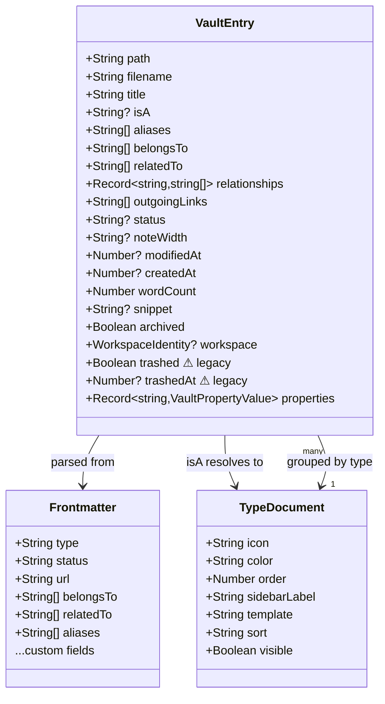
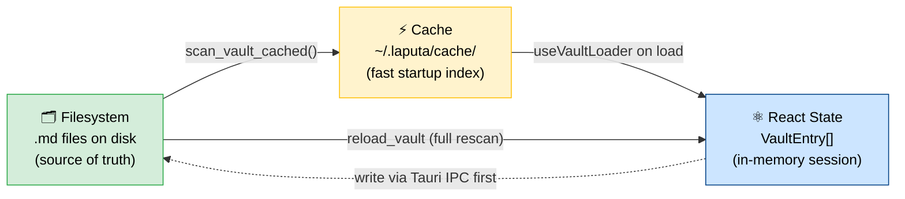

===== FILE: /root/web-archive/ai_agents_skills_library/0-platform-precursor-systems/imported/tolaria/scripts/generate_demo_vault.py =====

#!/usr/bin/env python3
"""Generate a large synthetic vault for scale and performance checks.

Creates a realistic 2-year knowledge vault (Q1 2024 - Q4 2025) for a
fictional persona based on Luca Rossi, founder of Refactoring.

The curated `demo-vault-v2/` fixture is intentionally small and lives in git.
This script generates the larger corpus on demand outside that checked-in QA
fixture.

Usage:
  python3 scripts/generate_demo_vault.py
  python3 scripts/generate_demo_vault.py --output /tmp/demo-vault-large
"""

import argparse
import random
import shutil
from datetime import date, timedelta
from pathlib import Path

random.seed(42)

DEFAULT_VAULT = Path(__file__).resolve().parent.parent / "generated-fixtures" / "demo-vault-large"
VAULT = DEFAULT_VAULT
SUBDIRS = [
    "area", "responsibility", "measure", "target", "goal", "year",
    "quarter", "month", "project", "experiment", "procedure", "task",
    "person", "topic", "event", "evergreen", "note",
]
COUNTS: dict[str, int] = {}

# ── Quarter / month mappings ─────────────────────────────────────
QUARTER_SLUGS = ["24q1", "24q2", "24q3", "24q4", "25q1", "25q2", "25q3", "25q4"]
Q_YEAR = {q: ("2024" if q.startswith("24") else "2025") for q in QUARTER_SLUGS}
Q_LABEL = {
    "24q1": "Q1 2024", "24q2": "Q2 2024", "24q3": "Q3 2024", "24q4": "Q4 2024",
    "25q1": "Q1 2025", "25q2": "Q2 2025", "25q3": "Q3 2025", "25q4": "Q4 2025",
}
Q_MONTHS = {
    "24q1": ["2024-01", "2024-02", "2024-03"], "24q2": ["2024-04", "2024-05", "2024-06"],
    "24q3": ["2024-07", "2024-08", "2024-09"], "24q4": ["2024-10", "2024-11", "2024-12"],
    "25q1": ["2025-01", "2025-02", "2025-03"], "25q2": ["2025-04", "2025-05", "2025-06"],
    "25q3": ["2025-07", "2025-08", "2025-09"], "25q4": ["2025-10", "2025-11", "2025-12"],
}
Q_START = {
    "24q1": "2024-01-01", "24q2": "2024-04-01", "24q3": "2024-07-01", "24q4": "2024-10-01",
    "25q1": "2025-01-01", "25q2": "2025-04-01", "25q3": "2025-07-01", "25q4": "2025-10-01",
}
MONTH_NAMES = [
    "", "January", "February", "March", "April", "May", "June",
    "July", "August", "September", "October", "November", "December",
]
MONTH_RATINGS = ["😄", "😄", "🤩", "😄", "😐", "🤩", "😄", "😄",
                 "🤩", "😄", "😐", "😄", "🤩", "😄", "😄", "🤩",
                 "😄", "😐", "🤩", "😄", "😄", "🤩", "😄", "😄"]

# Subscriber trajectory: (start, end) per quarter
SUB_TRAJ = {
    "24q1": (35000, 38000), "24q2": (38000, 42000),
    "24q3": (42000, 47000), "24q4": (47000, 53000),
    "25q1": (53000, 59000), "25q2": (59000, 66000),
    "25q3": (66000, 75000), "25q4": (75000, 85000),
}
# Revenue trajectory: monthly EUR at quarter end
REV_TRAJ = {
    "24q1": 8000, "24q2": 10000, "24q3": 12000, "24q4": 14000,
    "25q1": 15000, "25q2": 17000, "25q3": 19000, "25q4": 22000,
}

# ── Helpers ──────────────────────────────────────────────────────
_UNQUOTED = {
    "Open", "Done", "Draft", "Published", "Abandoned", "Behind",
    "Year", "Quarter", "Month", "Area", "Responsibility", "Measure",
    "Target", "Goal", "Project", "Experiment", "Procedure", "Task",
    "Person", "Topic", "Event", "Evergreen", "Note",
    "Weekly", "Bi-weekly", "Monthly", "Quarterly", "Daily",
}


def wl(slug: str) -> str:
    return f"[[{slug}]]"


def fm(fields: dict) -> str:
    lines = ["---"]
    for k, v in fields.items():
        if isinstance(v, list):
            inner = ", ".join(f'"{i}"' for i in v)
            lines.append(f"{k}: [{inner}]")
        elif isinstance(v, (int, float)):
            lines.append(f"{k}: {v}")
        elif isinstance(v, str) and v in _UNQUOTED:
            lines.append(f"{k}: {v}")
        else:
            lines.append(f'{k}: "{v}"')
    lines.append("---")
    return "\n".join(lines)


def write_md(subdir: str, slug: str, fields: dict, body: str):
    path = VAULT / subdir / f"{slug}.md"
    path.write_text(fm(fields) + "\n" + body.rstrip() + "\n", encoding="utf-8")
    COUNTS[subdir] = COUNTS.get(subdir, 0) + 1


def month_slug_to_q(ms: str) -> str:
    y, m = ms.split("-")
    qi = (int(m) - 1) // 3 + 1
    return f"{y[2:]}{'' if y == '2024' else ''}q{qi}" if y == "2024" else f"{y[2:]}q{qi}"


# ── AREAS ────────────────────────────────────────────────────────
# (slug, name, responsibility_slugs)
AREAS = [
    ("area-building", "Building", [
        "responsibility-grow-newsletter", "responsibility-sponsorships",
        "responsibility-content-production", "responsibility-podcast",
        "responsibility-team-management"]),
    ("area-health", "Health", ["responsibility-health-fitness"]),
    ("area-personal", "Personal", []),
    ("area-learning", "Learning", ["responsibility-learning"]),
    ("area-finance", "Finance", ["responsibility-personal-finance"]),
]

# ── RESPONSIBILITIES ─────────────────────────────────────────────
# (slug, name, area, measures, procedures, body)
RESPONSIBILITIES = [
    ("responsibility-grow-newsletter", "Grow Newsletter", "area-building",
     ["measure-subscribers", "measure-open-rate"],
     ["procedure-monthly-subscriber-metrics", "procedure-referral-program",
      "procedure-welcome-email-sequence", "procedure-seo-content-optimization"],
     "Growing the Refactoring newsletter subscriber base through organic content, SEO, referrals, and strategic partnerships.\n\n## KPIs\n- Subscribers: target 100k by end 2025\n- Open rate: maintain >45%"),
    ("responsibility-sponsorships", "Sponsorships", "area-building",
     ["measure-sponsorship-mrr", "measure-close-rate"],
     ["procedure-monthly-sponsor-report", "procedure-quarterly-sponsor-outreach",
      "procedure-sponsor-onboarding", "procedure-invoice-processing", "procedure-sponsor-renewal"],
     "Selling and managing sponsorships for Refactoring. Building long-term relationships with B2B tech companies.\n\n## KPIs\n- MRR: grow from €8k to €22k\n- Close rate: maintain >30%"),
    ("responsibility-content-production", "Content Production", "area-building",
     ["measure-articles-per-week", "measure-essay-quality-score"],
     ["procedure-weekly-newsletter", "procedure-monthly-pillar-planning",
      "procedure-social-media-scheduling", "procedure-newsletter-ab-testing",
      "procedure-content-calendar-review", "procedure-editorial-review",
      "procedure-evergreen-content-audit", "procedure-newsletter-metrics-weekly"],
     "Publishing weekly essays and newsletter editions. Maintaining high editorial quality while shipping consistently.\n\n## KPIs\n- Articles per week: 1 newsletter + 1 essay minimum\n- Quality score: reader feedback >4.5/5"),
    ("responsibility-podcast", "Podcast", "area-building",
     ["measure-podcast-downloads", "measure-podcast-episodes-per-month"],
     ["procedure-podcast-recording", "procedure-podcast-guest-outreach",
      "procedure-podcast-editing", "procedure-podcast-show-notes", "procedure-podcast-analytics"],
     "Running the Refactoring podcast — bi-weekly episodes with tech leaders on engineering culture, leadership, and building.\n\n## KPIs\n- Downloads per episode: target 5k+\n- Episodes per month: 2"),
    ("responsibility-team-management", "Team Management", "area-building",
     ["measure-team-nps", "measure-task-completion-rate"],
     ["procedure-weekly-team-sync", "procedure-biweekly-1on1-matteo",
      "procedure-biweekly-1on1-paco", "procedure-biweekly-1on1-sara",
      "procedure-quarterly-team-retro"],
     "Managing Matteo (partnerships), Paco (operations), and Sara (editor). Building a small but high-performing team.\n\n## KPIs\n- Team NPS: >8\n- Task completion rate: >85%"),
    ("responsibility-health-fitness", "Health & Fitness", "area-health",
     ["measure-resting-hr", "measure-cycling-km-per-month"],
     ["procedure-weekly-cycling-block", "procedure-gym-routine",
      "procedure-monthly-health-review", "procedure-race-preparation"],
     "Staying fit through cycling, gym, and good nutrition. Training for gran fondos and maintaining energy for work.\n\n## KPIs\n- Resting HR: <55 bpm\n- Cycling: 300+ km/month in season"),
    ("responsibility-personal-finance", "Personal Finance", "area-finance",
     ["measure-net-worth", "measure-savings-rate"],
     ["procedure-monthly-portfolio-review", "procedure-quarterly-financial-planning"],
     "Managing investments, savings, and financial planning. Building long-term wealth through index funds and diversification.\n\n## KPIs\n- Savings rate: >30% of income\n- Net worth: track monthly"),
    ("responsibility-learning", "Learning", "area-learning",
     ["measure-books-per-month", "measure-evergreen-notes-created"],
     ["procedure-weekly-reading-session", "procedure-evergreen-note-writing"],
     "Reading widely, studying deeply, and creating evergreen notes. Focused on non-fiction: business, technology, science, and self-improvement.\n\n## KPIs\n- Books per month: 2+\n- Evergreen notes: 3+ per month"),
]

# ── MEASURES ─────────────────────────────────────────────────────
# (slug, name, responsibility, unit)
MEASURES = [
    ("measure-subscribers", "Newsletter Subscribers", "responsibility-grow-newsletter", "subscribers"),
    ("measure-open-rate", "Newsletter Open Rate", "responsibility-grow-newsletter", "percent"),
    ("measure-sponsorship-mrr", "Sponsorship MRR", "responsibility-sponsorships", "EUR/month"),
    ("measure-close-rate", "Sponsorship Close Rate", "responsibility-sponsorships", "percent"),
    ("measure-articles-per-week", "Articles Per Week", "responsibility-content-production", "articles"),
    ("measure-essay-quality-score", "Essay Quality Score", "responsibility-content-production", "score (1-5)"),


===== FILE: /root/web-archive/ai_agents_skills_library/0-platform-precursor-systems/imported/tolaria/.chunk/config.json =====

{
  "commands": [
    {
      "name": "lint",
      "run": "pnpm lint",
      "role": "gate",
      "fileExt": ".ts,.tsx,.js,.jsx,.mjs,.json",
      "timeout": 120,
      "limit": 3
    },
    {
      "name": "typecheck",
      "run": "npx tsc --noEmit",
      "role": "gate",
      "fileExt": ".ts,.tsx",
      "timeout": 180,
      "limit": 3
    },
    {
      "name": "build",
      "run": "pnpm build",
      "role": "gate",
      "fileExt": ".ts,.tsx,.css,.html,.json",
      "timeout": 300,
      "limit": 2
    },
    {
      "name": "frontend-coverage",
      "run": "pnpm test:coverage --silent",
      "role": "gate",
      "fileExt": ".ts,.tsx",
      "timeout": 600,
      "limit": 2
    },
    {
      "name": "rust-lint",
      "run": "cargo clippy --manifest-path=src-tauri/Cargo.toml -- -D warnings && cargo fmt --manifest-path=src-tauri/Cargo.toml -- --check",
      "role": "gate",
      "fileExt": ".rs",
      "timeout": 300,
      "limit": 2
    },
    {
      "name": "rust-coverage",
      "run": "cargo llvm-cov --manifest-path src-tauri/Cargo.toml --no-clean --ignore-filename-regex \"lib\\.rs|main\\.rs|menu\\.rs\" --fail-under-lines 85 -- --test-threads=1",
      "role": "gate",
      "fileExt": ".rs",
      "timeout": 900,
      "limit": 1
    },
    {
      "name": "smoke-1",
      "run": "bash .chunk/run-playwright-smoke.sh 1/8",
      "role": "gate",
      "fileExt": ".ts,.tsx",
      "timeout": 240,
      "limit": 1
    },
    {
      "name": "smoke-2",
      "run": "bash .chunk/run-playwright-smoke.sh 2/8",
      "role": "gate",
      "fileExt": ".ts,.tsx",
      "timeout": 240,
      "limit": 1
    },
    {
      "name": "smoke-3",
      "run": "bash .chunk/run-playwright-smoke.sh 3/8",
      "role": "gate",
      "fileExt": ".ts,.tsx",
      "timeout": 240,
      "limit": 1
    },
    {
      "name": "smoke-4",
      "run": "bash .chunk/run-playwright-smoke.sh 4/8",
      "role": "gate",
      "fileExt": ".ts,.tsx",
      "timeout": 240,
      "limit": 1
    },
    {
      "name": "smoke-5",
      "run": "bash .chunk/run-playwright-smoke.sh 5/8",
      "role": "gate",
      "fileExt": ".ts,.tsx",
      "timeout": 240,
      "limit": 1
    },
    {
      "name": "smoke-6",
      "run": "bash .chunk/run-playwright-smoke.sh 6/8",
      "role": "gate",
      "fileExt": ".ts,.tsx",
      "timeout": 240,
      "limit": 1
    },
    {
      "name": "smoke-7",
      "run": "bash .chunk/run-playwright-smoke.sh 7/8",
      "role": "gate",
      "fileExt": ".ts,.tsx",
      "timeout": 240,
      "limit": 1
    },
    {
      "name": "smoke-8",
      "run": "bash .chunk/run-playwright-smoke.sh 8/8",
      "role": "gate",
      "fileExt": ".ts,.tsx",
      "timeout": 240,
      "limit": 1
    }
  ],
  "stopHookMaxAttempts": 2,
  "vcs": {
    "org": "refactoringhq",
    "repo": "tolaria"
  },
  "orgID": "39f93336-5295-4c6c-845f-e692c1d3f968",
  "environment": {
    "stack": "javascript-rust-tauri",
    "setup": [
      {
        "name": "system",
        "command": "sudo apt-get update && sudo apt-get install -y --no-install-recommends build-essential curl file git libwebkit2gtk-4.1-dev libxdo-dev libssl-dev libayatana-appindicator3-dev librsvg2-dev libsoup-3.0-dev patchelf pkg-config unzip wget xvfb && sudo rm -rf /var/lib/apt/lists/*"
      },
      {
        "name": "rust",
        "command": "curl --proto '=https' --tlsv1.2 -sSf https://sh.rustup.rs | sh -s -- -y --profile minimal && . \"$HOME/.cargo/env\" && rustup default stable && rustup component add clippy rustfmt && cargo install cargo-llvm-cov --locked"
      },
      {
        "name": "node",
        "command": "curl -fsSL https://nodejs.org/dist/v26.3.0/node-v26.3.0-linux-x64.tar.xz | sudo tar -xJ -C /usr/local --strip-components=1 && node --version && npm --version"
      },
      {
        "name": "pnpm",
        "command": "sudo npm install -g pnpm@10.33.0 && pnpm --version"
      },
      {
        "name": "install",
        "command": "mkdir -p \"$HOME/Documents\" && pnpm install --frozen-lockfile && . \"$HOME/.cargo/env\" && cargo fetch --manifest-path src-tauri/Cargo.toml"
      },
      {
        "name": "playwright-deps",
        "command": "pnpm exec playwright install-deps chromium"
      },
      {
        "name": "playwright",
        "command": "node .chunk/install-playwright-browsers.mjs"
      }
    ],
    "image": "cimg/node",
    "image_version": "26.3.0"
  }
}


===== FILE: /root/web-archive/ai_agents_skills_library/0-platform-precursor-systems/imported/tolaria/.claude/settings.local.json =====

{
  "permissions": {
    "allow": [
      "mcp__codescene__*",
      "Read(*)",
      "Bash(cat*)",
      "Bash(ls*)",
      "Write(*)"
    ]
  }
}


===== FILE: /root/web-archive/ai_agents_skills_library/0-platform-precursor-systems/imported/tolaria/biome.json =====

{
  "$schema": "https://biomejs.dev/schemas/2.4.15/schema.json",
  "files": {
    "includes": [
      "**",
      "!src-tauri/gen/**",
      "!target/**",
      "!dist/**",
      "!node_modules/**"
    ]
  },
  "css": {
    "parser": {
      "tailwindDirectives": true
    }
  },
  "overrides": [
    {
      "includes": ["site/**/*.vue"],
      "linter": {
        "rules": {
          "correctness": {
            "noUnusedImports": "off",
            "noUnusedVariables": "off",
            "useHookAtTopLevel": "off"
          }
        }
      }
    }
  ],
  "linter": {
    "rules": {
      "correctness": {
        "useQwikValidLexicalScope": "off"
      }
    }
  }
}


===== FILE: /root/web-archive/ai_agents_skills_library/0-platform-precursor-systems/imported/tolaria/components.json =====

{
  "$schema": "https://ui.shadcn.com/schema.json",
  "style": "new-york",
  "rsc": false,
  "tsx": true,
  "tailwind": {
    "config": "",
    "css": "src/index.css",
    "baseColor": "neutral",
    "cssVariables": true,
    "prefix": ""
  },
  "aliases": {
    "components": "@/components",
    "utils": "@/lib/utils",
    "ui": "@/components/ui",
    "lib": "@/lib",
    "hooks": "@/hooks"
  },
  "iconLibrary": "phosphor"
}


===== FILE: /root/web-archive/ai_agents_skills_library/0-platform-precursor-systems/imported/tolaria/demo-vault-v2/.fixture-manifest.json =====

{
  "name": "Tolaria QA fixture",
  "purpose": "Curated local vault for native QA and developer flows. This is not the public Getting Started starter vault.",
  "large_fixture": {
    "generator": "python3 scripts/generate_demo_vault.py",
    "default_output": "generated-fixtures/demo-vault-large"
  },
  "scenarios": [
    {
      "id": "exact-match-search",
      "reason": "Quick Open should rank the exact title 'Writing' above prefix matches.",
      "files": [
        "topic-writing.md",
        "writing-for-clarity-vs-writing-for-credit.md",
        "writing-weekly-rhythm.md"
      ]
    },
    {
      "id": "relationship-rendering",
      "reason": "Relationship keys should render in the inspector instead of as plain properties.",
      "files": [
        "responsibility-sponsorships.md",
        "measure-sponsorship-mrr.md",
        "measure-close-rate.md",
        "procedure-quarterly-sponsor-outreach.md",
        "procedure-sponsor-onboarding.md",
        "24q4-laputa-start.md",
        "24q4.md",
        "person-luca-rossi.md"
      ]
    },
    {
      "id": "project-navigation",
      "reason": "Projects, quarters, and a saved view give keyboard QA a compact but representative browsing path.",
      "files": [
        "24q4.md",
        "25q1.md",
        "25q2.md",
        "24q4-laputa-start.md",
        "25q1-laputa-v1.md",
        "25q2-laputa-v2.md",
        "views/active-projects.yml"
      ]
    },
    {
      "id": "attachment-rendering",
      "reason": "A note with a real binary attachment keeps image/block QA anchored to the fixture.",
      "files": [
        "laputa-qa-reference.md",
        "attachments/laputa-reference.png"
      ]
    },
    {
      "id": "rtl-mixed-direction",
      "reason": "Arabic and mixed English/Arabic paragraphs keep rich editor and raw editor BiDi QA anchored to the fixture.",
      "files": [
        "rtl-mixed-direction-qa.md"
      ]
    }
  ]
}


===== FILE: /root/web-archive/ai_agents_skills_library/0-platform-precursor-systems/imported/tolaria/mcp-server/package-lock.json =====

{
  "name": "tolaria-mcp-server",
  "version": "0.1.0",
  "lockfileVersion": 3,
  "requires": true,
  "packages": {
    "": {
      "name": "tolaria-mcp-server",
      "version": "0.1.0",
      "dependencies": {
        "@modelcontextprotocol/sdk": "^1.0.0",
        "gray-matter": "^4.0.3",
        "ws": "^8.20.1"
      }
    },
    "node_modules/@hono/node-server": {
      "version": "1.19.13",
      "resolved": "https://registry.npmjs.org/@hono/node-server/-/node-server-1.19.13.tgz",
      "integrity": "sha512-TsQLe4i2gvoTtrHje625ngThGBySOgSK3Xo2XRYOdqGN1teR8+I7vchQC46uLJi8OF62YTYA3AhSpumtkhsaKQ==",
      "license": "MIT",
      "engines": {
        "node": ">=18.14.1"
      },
      "peerDependencies": {
        "hono": "^4"
      }
    },
    "node_modules/@modelcontextprotocol/sdk": {
      "version": "1.26.0",
      "resolved": "https://registry.npmjs.org/@modelcontextprotocol/sdk/-/sdk-1.26.0.tgz",
      "integrity": "sha512-Y5RmPncpiDtTXDbLKswIJzTqu2hyBKxTNsgKqKclDbhIgg1wgtf1fRuvxgTnRfcnxtvvgbIEcqUOzZrJ6iSReg==",
      "license": "MIT",
      "dependencies": {
        "@hono/node-server": "^1.19.9",
        "ajv": "^8.17.1",
        "ajv-formats": "^3.0.1",
        "content-type": "^1.0.5",
        "cors": "^2.8.5",
        "cross-spawn": "^7.0.5",
        "eventsource": "^3.0.2",
        "eventsource-parser": "^3.0.0",
        "express": "^5.2.1",
        "express-rate-limit": "^8.2.1",
        "hono": "^4.11.4",
        "jose": "^6.1.3",
        "json-schema-typed": "^8.0.2",
        "pkce-challenge": "^5.0.0",
        "raw-body": "^3.0.0",
        "zod": "^3.25 || ^4.0",
        "zod-to-json-schema": "^3.25.1"
      },
      "engines": {
        "node": ">=18"
      },
      "peerDependencies": {
        "@cfworker/json-schema": "^4.1.1",
        "zod": "^3.25 || ^4.0"
      },
      "peerDependenciesMeta": {
        "@cfworker/json-schema": {
          "optional": true
        },
        "zod": {
          "optional": false
        }
      }
    },
    "node_modules/accepts": {
      "version": "2.0.0",
      "resolved": "https://registry.npmjs.org/accepts/-/accepts-2.0.0.tgz",
      "integrity": "sha512-5cvg6CtKwfgdmVqY1WIiXKc3Q1bkRqGLi+2W/6ao+6Y7gu/RCwRuAhGEzh5B4KlszSuTLgZYuqFqo5bImjNKng==",
      "license": "MIT",
      "dependencies": {
        "mime-types": "^3.0.0",
        "negotiator": "^1.0.0"
      },
      "engines": {
        "node": ">= 0.6"
      }
    },
    "node_modules/ajv": {
      "version": "8.18.0",
      "resolved": "https://registry.npmjs.org/ajv/-/ajv-8.18.0.tgz",
      "integrity": "sha512-PlXPeEWMXMZ7sPYOHqmDyCJzcfNrUr3fGNKtezX14ykXOEIvyK81d+qydx89KY5O71FKMPaQ2vBfBFI5NHR63A==",
      "license": "MIT",
      "dependencies": {
        "fast-deep-equal": "^3.1.3",
        "fast-uri": "^3.0.1",
        "json-schema-traverse": "^1.0.0",
        "require-from-string": "^2.0.2"
      },
      "funding": {
        "type": "github",
        "url": "https://github.com/sponsors/epoberezkin"
      }
    },
    "node_modules/ajv-formats": {
      "version": "3.0.1",
      "resolved": "https://registry.npmjs.org/ajv-formats/-/ajv-formats-3.0.1.tgz",
      "integrity": "sha512-8iUql50EUR+uUcdRQ3HDqa6EVyo3docL8g5WJ3FNcWmu62IbkGUue/pEyLBW8VGKKucTPgqeks4fIU1DA4yowQ==",
      "license": "MIT",
      "dependencies": {
        "ajv": "^8.0.0"
      },
      "peerDependencies": {
        "ajv": "^8.0.0"
      },
      "peerDependenciesMeta": {
        "ajv": {
          "optional": true
        }
      }
    },
    "node_modules/argparse": {
      "version": "1.0.10",
      "resolved": "https://registry.npmjs.org/argparse/-/argparse-1.0.10.tgz",
      "integrity": "sha512-o5Roy6tNG4SL/FOkCAN6RzjiakZS25RLYFrcMttJqbdd8BWrnA+fGz57iN5Pb06pvBGvl5gQ0B48dJlslXvoTg==",
      "license": "MIT",
      "dependencies": {
        "sprintf-js": "~1.0.2"
      }
    },
    "node_modules/body-parser": {
      "version": "2.2.2",
      "resolved": "https://registry.npmjs.org/body-parser/-/body-parser-2.2.2.tgz",
      "integrity": "sha512-oP5VkATKlNwcgvxi0vM0p/D3n2C3EReYVX+DNYs5TjZFn/oQt2j+4sVJtSMr18pdRr8wjTcBl6LoV+FUwzPmNA==",
      "license": "MIT",
      "dependencies": {
        "bytes": "^3.1.2",
        "content-type": "^1.0.5",
        "debug": "^4.4.3",
        "http-errors": "^2.0.0",
        "iconv-lite": "^0.7.0",
        "on-finished": "^2.4.1",
        "qs": "^6.14.1",
        "raw-body": "^3.0.1",
        "type-is": "^2.0.1"
      },
      "engines": {
        "node": ">=18"
      },
      "funding": {
        "type": "opencollective",
        "url": "https://opencollective.com/express"
      }
    },
    "node_modules/bytes": {
      "version": "3.1.2",
      "resolved": "https://registry.npmjs.org/bytes/-/bytes-3.1.2.tgz",
      "integrity": "sha512-/Nf7TyzTx6S3yRJObOAV7956r8cr2+Oj8AC5dt8wSP3BQAoeX58NoHyCU8P8zGkNXStjTSi6fzO6F0pBdcYbEg==",
      "license": "MIT",
      "engines": {
        "node": ">= 0.8"
      }
    },
    "node_modules/call-bind-apply-helpers": {
      "version": "1.0.2",
      "resolved": "https://registry.npmjs.org/call-bind-apply-helpers/-/call-bind-apply-helpers-1.0.2.tgz",
      "integrity": "sha512-Sp1ablJ0ivDkSzjcaJdxEunN5/XvksFJ2sMBFfq6x0ryhQV/2b/KwFe21cMpmHtPOSij8K99/wSfoEuTObmuMQ==",
      "license": "MIT",
      "dependencies": {
        "es-errors": "^1.3.0",
        "function-bind": "^1.1.2"
      },
      "engines": {
        "node": ">= 0.4"
      }
    },
    "node_modules/call-bound": {
      "version": "1.0.4",
      "resolved": "https://registry.npmjs.org/call-bound/-/call-bound-1.0.4.tgz",
      "integrity": "sha512-+ys997U96po4Kx/ABpBCqhA9EuxJaQWDQg7295H4hBphv3IZg0boBKuwYpt4YXp6MZ5AmZQnU/tyMTlRpaSejg==",
      "license": "MIT",
      "dependencies": {
        "call-bind-apply-helpers": "^1.0.2",
        "get-intrinsic": "^1.3.0"
      },
      "engines": {
        "node": ">= 0.4"
      },


===== FILE: /root/web-archive/ai_agents_skills_library/0-platform-precursor-systems/imported/tolaria/mcp-server/package.json =====

{
  "name": "tolaria-mcp-server",
  "version": "0.1.0",
  "description": "MCP server for Tolaria vault operations",
  "type": "module",
  "main": "index.js",
  "scripts": {
    "start": "node index.js",
    "test": "node --test test.js tool-service.test.js"
  },
  "dependencies": {
    "@modelcontextprotocol/sdk": "^1.0.0",
    "gray-matter": "^4.0.3",
    "ws": "^8.20.1"
  },
  "overrides": {
    "@hono/node-server": "1.19.13",
    "express-rate-limit": "8.2.2",
    "fast-uri": "3.1.2",
    "hono": "4.12.21",
    "qs": "6.15.2",
    "ip-address": "10.1.1",
    "path-to-regexp": "8.4.0"
  }
}


===== FILE: /root/web-archive/ai_agents_skills_library/0-platform-precursor-systems/imported/tolaria/package.json =====

{
  "name": "tolaria",
  "private": true,
  "license": "AGPL-3.0-or-later",
  "version": "0.1.0",
  "type": "module",
  "scripts": {
    "dev": "vite",
    "build": "tsc -b && vite build",
    "agent-docs": "node scripts/build-agent-docs.mjs",
    "bundle-mcp": "node scripts/bundle-mcp-server.mjs",
    "docs:dev": "vitepress dev site --host 127.0.0.1",
    "docs:build": "pnpm agent-docs && vitepress build site",
    "docs:preview": "vitepress preview site --host 127.0.0.1",
    "lint": "eslint . --max-warnings=0",
    "l10n:translate": "lara-cli translate",
    "l10n:translate:force": "lara-cli translate --force",
    "l10n:validate": "node scripts/validate-locales.mjs",
    "preview": "vite preview",
    "tauri": "tauri",
    "test": "vitest run",
    "test:watch": "vitest",
    "test:e2e": "playwright test",
    "playwright:smoke": "playwright test --config playwright.smoke.config.ts tests/smoke/autosave-low-end-typing.spec.ts tests/smoke/create-note-backing-file.spec.ts tests/smoke/delete-note-nonblocking.spec.ts tests/smoke/example.spec.ts tests/smoke/fix-crash-create-note.spec.ts tests/smoke/quick-open-create-note.spec.ts tests/smoke/save-before-note-switch.spec.ts tests/smoke/h1-untitled-auto-rename.spec.ts tests/smoke/keyboard-command-routing.spec.ts tests/smoke/missing-string-metadata-open-note.spec.ts tests/smoke/multibyte-search-snippet.spec.ts tests/smoke/pull-refresh-open-note.spec.ts tests/smoke/wikilink-path-fix.spec.ts",
    "playwright:regression": "playwright test tests/smoke/",
    "playwright:integration": "playwright test --config playwright.integration.config.ts",
    "test:coverage": "node scripts/run-vitest-coverage.mjs",
    "prepare": "husky"
  },
  "dependencies": {
    "@anthropic-ai/sdk": "^0.78.0",
    "@blocknote/code-block": "^0.46.2",
    "@blocknote/core": "^0.46.2",
    "@blocknote/mantine": "^0.46.2",
    "@blocknote/react": "^0.46.2",
    "@codemirror/commands": "^6.10.2",
    "@codemirror/lang-markdown": "^6.5.0",
    "@codemirror/lang-yaml": "^6.1.2",
    "@codemirror/language": "^6.12.2",
    "@codemirror/state": "^6.5.4",
    "@codemirror/view": "^6.39.16",
    "@dnd-kit/core": "^6.3.1",
    "@dnd-kit/sortable": "^10.0.0",
    "@dnd-kit/utilities": "^3.2.2",
    "@lezer/highlight": "^1.2.3",
    "@mantine/core": "^8.3.14",
    "@phosphor-icons/react": "^2.1.10",
    "@radix-ui/react-dialog": "^1.1.15",
    "@radix-ui/react-dropdown-menu": "^2.1.16",
    "@radix-ui/react-select": "^2.2.6",
    "@radix-ui/react-separator": "^1.1.8",
    "@radix-ui/react-slot": "^1.2.4",
    "@radix-ui/react-tabs": "^1.1.13",
    "@radix-ui/react-tooltip": "^1.2.8",
    "@sentry/react": "^10.47.0",
    "@shikijs/langs": "3.23.0",
    "@tailwindcss/vite": "^4.1.18",
    "@tauri-apps/api": "^2.10.1",
    "@tauri-apps/plugin-deep-link": "2.4.9",
    "@tauri-apps/plugin-dialog": "^2.6.0",
    "@tauri-apps/plugin-opener": "^2.5.3",
    "@tauri-apps/plugin-process": "^2.3.1",
    "@tauri-apps/plugin-updater": "^2.10.0",
    "@tldraw/assets": "4.5.10",
    "class-variance-authority": "^0.7.1",
    "clsx": "^2.1.1",
    "date-fns": "^4.1.0",
    "dompurify": "3.4.2",
    "katex": "^0.16.28",
    "mermaid": "^11.14.0",
    "posthog-js": "^1.363.5",
    "radix-ui": "^1.4.3",
    "react": "^19.2.0",
    "react-day-picker": "^9.13.2",
    "react-dom": "^19.2.0",
    "react-markdown": "^10.1.0",
    "react-virtuoso": "^4.18.1",
    "rehype-highlight": "^7.0.2",
    "remark-gfm": "^4.0.1",
    "safe-regex2": "5.1.1",
    "tailwind-merge": "^3.4.1",
    "tailwindcss": "^4.1.18",
    "tldraw": "^4.5.10",
    "tw-animate-css": "^1.4.0",
    "unicode-emoji-json": "^0.8.0"
  },
  "devDependencies": {
    "@eslint/js": "^9.39.1",
    "@playwright/test": "^1.58.2",
    "@tauri-apps/cli": "^2.10.0",
    "@testing-library/jest-dom": "^6.9.1",
    "@testing-library/react": "^16.3.2",
    "@translated/lara-cli": "^1.3.2",
    "@types/node": "^24.10.1",
    "@types/react": "^19.2.7",
    "@types/react-dom": "^19.2.3",
    "@types/ws": "^8.18.1",
    "@vitejs/plugin-react": "^5.1.1",
    "@vitest/coverage-v8": "^4.0.18",
    "esbuild": "^0.27.3",
    "eslint": "^9.39.1",
    "eslint-plugin-react-hooks": "^7.0.1",
    "eslint-plugin-react-refresh": "^0.4.24",
    "globals": "^16.5.0",
    "gray-matter": "^4.0.3",
    "husky": "^9.1.7",
    "jsdom": "^28.0.0",
    "typescript": "~5.9.3",
    "typescript-eslint": "^8.48.0",
    "vite": "^7.3.2",
    "vitepress": "^1.6.4",
    "vitest": "^4.0.18",
    "ws": "^8.19.0"
  },
  "pnpm": {
    "overrides": {
      "@hono/node-server": "1.19.13",
      "express-rate-limit": "8.2.2",
      "hono": "4.12.18",
      "ip-address": "10.1.1",
      "mermaid>uuid": "11.1.1",
      "path-to-regexp": "8.4.0",
      "fast-uri": "3.1.2",
      "fast-xml-builder": "1.1.7",
      "flatted": "3.4.2",
      "minimatch@3.1.2": "3.1.5",
      "minimatch@3.1.3": "3.1.5",
      "minimatch@9.0.5": "9.0.9",
      "minimatch@9.0.6": "9.0.9",
      "picomatch": "4.0.4",
      "postcss": "8.5.10",
      "protobufjs": "7.5.6",
      "qs": "6.15.2",
      "rollup": "4.59.0",
      "undici": "7.25.0",
      "@blocknote/core>uuid": "11.1.1"
    },
    "patchedDependencies": {
      "@blocknote/core@0.46.2": "patches/@blocknote__core@0.46.2.patch",
      "@blocknote/react@0.46.2": "patches/@blocknote__react@0.46.2.patch",
      "@tiptap/extension-link@3.19.0": "patches/@tiptap__extension-link@3.19.0.patch",
      "prosemirror-tables@1.8.5": "patches/prosemirror-tables@1.8.5.patch",
      "@blocknote/code-block@0.46.2": "patches/@blocknote__code-block@0.46.2.patch"
    }
  }
}


===== FILE: /root/web-archive/ai_agents_skills_library/0-platform-precursor-systems/imported/tolaria/src-tauri/capabilities/default.json =====

{
  "$schema": "../gen/schemas/desktop-schema.json",
  "identifier": "default",
  "description": "enables the default permissions",
  "windows": [
    "main",
    "ai-workspace",
    "note-*"
  ],
  "platforms": ["linux", "macOS", "windows"],
  "permissions": [
    "core:default",
    "core:window:allow-create",
    "core:window:allow-start-dragging",
    "core:window:allow-start-resize-dragging",
    "core:window:allow-minimize",
    "core:window:allow-toggle-maximize",
    "core:window:allow-close",
    "core:window:allow-set-title",
    "core:webview:allow-create-webview-window",
    "core:event:default",
    "dialog:default",
    "deep-link:default",
    "updater:default",
    "process:default",
    "opener:default"
  ]
}


===== FILE: /root/web-archive/ai_agents_skills_library/0-platform-precursor-systems/imported/tolaria/src-tauri/capabilities/mobile.json =====

{
  "$schema": "../gen/schemas/mobile-schema.json",
  "identifier": "mobile",
  "description": "permissions for iOS/iPadOS",
  "windows": [
    "main"
  ],
  "platforms": ["iOS", "android"],
  "permissions": [
    "core:default",
    "core:window:allow-close",
    "core:window:allow-set-title",
    "dialog:default"
  ]
}


===== FILE: /root/web-archive/ai_agents_skills_library/0-platform-precursor-systems/imported/tolaria/src-tauri/gen/apple/Assets.xcassets/AppIcon.appiconset/Contents.json =====

{
  "images" : [
    {
      "size" : "20x20",
      "idiom" : "iphone",
      "filename" : "AppIcon-20x20@2x.png",
      "scale" : "2x"
    },
    {
      "size" : "20x20",
      "idiom" : "iphone",
      "filename" : "AppIcon-20x20@3x.png",
      "scale" : "3x"
    },
    {
      "size" : "29x29",
      "idiom" : "iphone",
      "filename" : "AppIcon-29x29@2x-1.png",
      "scale" : "2x"
    },
    {
      "size" : "29x29",
      "idiom" : "iphone",
      "filename" : "AppIcon-29x29@3x.png",
      "scale" : "3x"
    },
    {
      "size" : "40x40",
      "idiom" : "iphone",
      "filename" : "AppIcon-40x40@2x.png",
      "scale" : "2x"
    },
    {
      "size" : "40x40",
      "idiom" : "iphone",
      "filename" : "AppIcon-40x40@3x.png",
      "scale" : "3x"
    },
    {
      "size" : "60x60",
      "idiom" : "iphone",
      "filename" : "AppIcon-60x60@2x.png",
      "scale" : "2x"
    },
    {
      "size" : "60x60",
      "idiom" : "iphone",
      "filename" : "AppIcon-60x60@3x.png",
      "scale" : "3x"
    },
    {
      "size" : "20x20",
      "idiom" : "ipad",
      "filename" : "AppIcon-20x20@1x.png",
      "scale" : "1x"
    },
    {
      "size" : "20x20",
      "idiom" : "ipad",
      "filename" : "AppIcon-20x20@2x-1.png",
      "scale" : "2x"
    },
    {
      "size" : "29x29",
      "idiom" : "ipad",
      "filename" : "AppIcon-29x29@1x.png",
      "scale" : "1x"
    },
    {
      "size" : "29x29",
      "idiom" : "ipad",
      "filename" : "AppIcon-29x29@2x.png",
      "scale" : "2x"
    },
    {
      "size" : "40x40",
      "idiom" : "ipad",
      "filename" : "AppIcon-40x40@1x.png",
      "scale" : "1x"
    },
    {
      "size" : "40x40",
      "idiom" : "ipad",
      "filename" : "AppIcon-40x40@2x-1.png",
      "scale" : "2x"
    },
    {
      "size" : "76x76",
      "idiom" : "ipad",
      "filename" : "AppIcon-76x76@1x.png",
      "scale" : "1x"
    },
    {
      "size" : "76x76",
      "idiom" : "ipad",
      "filename" : "AppIcon-76x76@2x.png",
      "scale" : "2x"
    },
    {
      "size" : "83.5x83.5",
      "idiom" : "ipad",
      "filename" : "AppIcon-83.5x83.5@2x.png",
      "scale" : "2x"
    },
    {
      "size" : "1024x1024",
      "idiom" : "ios-marketing",
      "filename" : "AppIcon-512@2x.png",
      "scale" : "1x"
    }
  ],
  "info" : {
    "version" : 1,
    "author" : "xcode"
  }
}


===== FILE: /root/web-archive/ai_agents_skills_library/0-platform-precursor-systems/imported/tolaria/src-tauri/gen/apple/Assets.xcassets/Contents.json =====

{
  "info" : {
    "version" : 1,
    "author" : "xcode"
  }
}


===== FILE: /root/web-archive/ai_agents_skills_library/0-platform-precursor-systems/imported/tolaria/src-tauri/gen/apple/assets/mcp-server/package.json =====

{"type":"commonjs"}


===== FILE: /root/web-archive/ai_agents_skills_library/0-platform-precursor-systems/imported/tolaria/src-tauri/resources/agent-docs/search-index.json =====

[
  {
    "title": "Index",
    "path": "pages/index.md",
    "url": "/",
    "section": "home",
    "headings": []
  },
  {
    "title": "First Launch",
    "path": "pages/start/first-launch.md",
    "url": "/start/first-launch",
    "section": "start",
    "headings": [
      "What You Choose",
      "What Tolaria Creates",
      "First Commands To Try",
      "AI Setup Prompt"
    ]
  },
  {
    "title": "Getting Started Vault",
    "path": "pages/start/getting-started-vault.md",
    "url": "/start/getting-started-vault",
    "section": "start",
    "headings": [
      "What It Demonstrates",
      "Local-Only By Default",
      "Use It Alongside Your Own Vaults",
      "When To Move On"
    ]
  },
  {
    "title": "Install Tolaria",
    "path": "pages/start/install.md",
    "url": "/start/install",
    "section": "start",
    "headings": [
      "Download",
      "Homebrew",
      "Platform Status",
      "Managed Windows Devices",
      "After Installing"
    ]
  },
  {
    "title": "Open Or Create A Vault",
    "path": "pages/start/open-or-create-vault.md",
    "url": "/start/open-or-create-vault",
    "section": "start",
    "headings": [
      "Open An Existing Folder",
      "Create A New Vault",
      "Use More Than One Vault",
      "Git Is Recommended, Not Required"
    ]
  },
  {
    "title": "AI",
    "path": "pages/concepts/ai.md",
    "url": "/concepts/ai",
    "section": "concepts",
    "headings": [
      "Coding Agents",
      "Direct Models",
      "External MCP Setup",
      "Why Git Matters For AI"
    ]
  },
  {
    "title": "Editor",
    "path": "pages/concepts/editor.md",
    "url": "/concepts/editor",
    "section": "concepts",
    "headings": [
      "Rich Editing",
      "Raw Mode",
      "Table Of Contents",
      "Width"
    ]
  },
  {
    "title": "Files And Media",
    "path": "pages/concepts/files-and-media.md",
    "url": "/concepts/files-and-media",
    "section": "concepts",
    "headings": [
      "Mermaid Diagrams",
      "Attachments",
      "Previews",
      "Whiteboards",
      "Git Boundary"
    ]
  },
  {
    "title": "Git",
    "path": "pages/concepts/git.md",
    "url": "/concepts/git",
    "section": "concepts",
    "headings": [
      "What Tolaria Uses Git For",
      "History And Diffs",
      "Local Commits",
      "Remotes"
    ]
  },
  {
    "title": "Inbox",
    "path": "pages/concepts/inbox.md",
    "url": "/concepts/inbox",
    "section": "concepts",
    "headings": [
      "Why It Exists",
      "Organizing Inbox Notes",
      "Healthy Inbox Habit"
    ]
  },
  {
    "title": "Notes",
    "path": "pages/concepts/notes.md",
    "url": "/concepts/notes",
    "section": "concepts",
    "headings": [
      "Anatomy",
      "Titles",
      "Body Links",
      "Frontmatter"
    ]
  },
  {
    "title": "Properties",
    "path": "pages/concepts/properties.md",
    "url": "/concepts/properties",
    "section": "concepts",
    "headings": [
      "Suggested Properties",
      "System Properties",
      "Property Editing"
    ]
  },
  {
    "title": "Relationships",
    "path": "pages/concepts/relationships.md",
    "url": "/concepts/relationships",
    "section": "concepts",
    "headings": [
      "Relationship Fields",
      "Body Links Versus Relationship Fields",
      "Backlinks"
    ]
  },
  {
    "title": "Types",
    "path": "pages/concepts/types.md",
    "url": "/concepts/types",
    "section": "concepts",
    "headings": [
      "Type Field",
      "Prefer Types Over Folders",
      "Type Documents",
      "What Types Control",
      "New Note Defaults"
    ]
  },
  {
    "title": "Vaults",
    "path": "pages/concepts/vaults.md",
    "url": "/concepts/vaults",
    "section": "concepts",
    "headings": [
      "Core Rules",
      "Why Local Files Matter",
      "Git Is A Capability",
      "Multiple Vaults At The Same Time",
      "App State Versus Vault State"
    ]
  },
  {
    "title": "Build Custom Views",
    "path": "pages/guides/build-custom-views.md",


===== FILE: /root/web-archive/ai_agents_skills_library/0-platform-precursor-systems/imported/tolaria/src-tauri/tauri.conf.json =====

{
  "$schema": "../node_modules/@tauri-apps/cli/config.schema.json",
  "productName": "Tolaria",
  "version": "0.1.0",
  "identifier": "club.refactoring.tolaria",
  "build": {
    "frontendDist": "../dist",
    "devUrl": "http://localhost:5202",
    "beforeDevCommand": "pnpm dev",
    "beforeBuildCommand": "pnpm build && pnpm bundle-mcp && pnpm agent-docs"
  },
  "app": {
    "withGlobalTauri": true,
    "macOSPrivateApi": true,
    "windows": [
      {
        "title": "Tolaria",
        "width": 1400,
        "height": 900,
        "minWidth": 480,
        "minHeight": 400,
        "resizable": true,
        "fullscreen": false,
        "titleBarStyle": "Overlay",
        "trafficLightPosition": {
          "x": 18,
          "y": 24
        },
        "hiddenTitle": true,
        "backgroundColor": "#F7F6F3",
        "dragDropEnabled": false
      }
    ],
    "security": {
      "csp": {
        "default-src": "'self' ipc: http://ipc.localhost",
        "script-src": "'self' https://us.i.posthog.com https://eu.i.posthog.com https://us-assets.i.posthog.com https://eu-assets.i.posthog.com",
        "connect-src": "'self' ipc: http://ipc.localhost data: ws://localhost:9710 ws://127.0.0.1:9710 ws://localhost:9711 ws://127.0.0.1:9711 https:",
        "img-src": "'self' asset: http://asset.localhost data: blob: https:",
        "style-src": "'self' 'unsafe-inline' https://fonts.googleapis.com",
        "style-src-elem": "'self' 'nonce-tolaria-runtime-style' https://fonts.googleapis.com",
        "style-src-attr": "'unsafe-inline'",
        "font-src": "'self' data: https://fonts.gstatic.com",
        "media-src": "'self' asset: http://asset.localhost data: blob: https:",
        "object-src": "'self' asset: http://asset.localhost"
      },
      "devCsp": "default-src 'self' ipc: http://ipc.localhost http://localhost:5202 http://127.0.0.1:5202 asset: http://asset.localhost data: blob: https:; script-src 'self' 'unsafe-inline' 'unsafe-eval' http://localhost:5202 http://127.0.0.1:5202 https://us.i.posthog.com https://eu.i.posthog.com https://us-assets.i.posthog.com https://eu-assets.i.posthog.com; connect-src 'self' ipc: http://ipc.localhost http://localhost:5202 http://127.0.0.1:5202 data: ws://localhost:5202 ws://127.0.0.1:5202 ws://localhost:9710 ws://127.0.0.1:9710 ws://localhost:9711 ws://127.0.0.1:9711 https:; img-src 'self' asset: http://asset.localhost data: blob: https:; style-src 'self' 'unsafe-inline' https://fonts.googleapis.com; style-src-elem 'self' 'unsafe-inline' 'nonce-tolaria-runtime-style' https://fonts.googleapis.com; style-src-attr 'unsafe-inline'; font-src 'self' data: https://fonts.gstatic.com; media-src 'self' asset: http://asset.localhost data: blob: https:; object-src 'self' asset: http://asset.localhost",
      "assetProtocol": {
        "enable": true,
        "scope": []
      }
    }
  },
  "bundle": {
    "active": true,
    "targets": "all",
    "createUpdaterArtifacts": true,
    "category": "Productivity",
    "windows": {
      "webviewInstallMode": {
        "type": "downloadBootstrapper"
      }
    },
    "resources": {
      "resources/mcp-server/**/*": "mcp-server/",
      "resources/agent-docs/**/*": "agent-docs/"
    },
    "icon": [
      "icons/32x32.png",
      "icons/128x128.png",
      "icons/128x128@2x.png",
      "icons/icon.icns",
      "icons/icon.ico"
    ]
  },
  "plugins": {
    "deep-link": {
      "desktop": {
        "schemes": ["tolaria"]
      }
    },
    "updater": {
      "endpoints": [
        "https://refactoringhq.github.io/tolaria/stable/latest.json"
      ],
      "windows": {
        "installMode": "passive"
      },
      "pubkey": "dW50cnVzdGVkIGNvbW1lbnQ6IG1pbmlzaWduIHB1YmxpYyBrZXk6IEE4NkQ5MDI3REVCRkFGNUMKUldSY3I3L2VKNUJ0cU5JRlRZZlp3NGhnU3ZwbkVKeGVvREpmb2sxRVJndHFpVFZPNlArbEE5R1IK"
    }
  }
}


===== FILE: /root/web-archive/ai_agents_skills_library/0-platform-precursor-systems/imported/tolaria/src/lib/locales/be-BY.json =====

{
  "command.noMatches": "Няма адпаведных каманд",
  "command.palettePlaceholder": "Увядзіце каманду...",
  "command.footerNavigate": "↑↓ навігацыя",
  "command.footerSelect": "↵ выбраць",
  "command.footerClose": "esc закрыць",
  "command.footerSend": "↵ адправіць",
  "command.aiMode": "Рэжым {agent}",
  "command.openSettings": "Адкрыць налады",
  "command.openSettings.keywords": "preferences config налады прэферэнцыі",
  "command.openLanguageSettings": "Адкрыць налады мовы",
  "command.openLanguageSettings.keywords": "language locale i18n internationalization localization мова лакаль беларуская англійская італьянская французcкая нямецкая руская іспанская партугальская кітайская японская карэйская польская 中文 繁體中文 zh-tw",
  "command.useSystemLanguage": "Выкарыстоўваць сістэмную мову",
  "command.openH1Setting": "Налады аўтаматычнага перайменавання па H1",
  "command.toggleGitignoredFilesVisibility": "Паказаць/схаваць файлы, якія ігнаруюцца Git",
  "command.contribute": "Далучыцца да праекта",
  "command.checkUpdates": "Праверыць абнаўленні",
  "menu.application": "Меню праграмы",
  "menu.file": "Файл",
  "menu.edit": "Рэдагаваць",
  "menu.view": "Прагляд",
  "menu.go": "Перайсці",
  "menu.note": "Нататка",
  "menu.vault": "Сховішча",
  "menu.window": "Акно",
  "menu.file.quickOpen": "Хуткае адкрыццё",
  "menu.file.quickOpenCmdO": "Хуткае адкрыццё (Cmd+O)",
  "menu.file.quickOpenCtrlO": "Хуткае адкрыццё (Ctrl+O)",
  "menu.file.save": "Захаваць",
  "menu.edit.pasteWithoutFormatting": "Уставіць без фарматавання",
  "menu.edit.findInVault": "Знайсці ў Vault",
  "menu.edit.toggleNoteListSearch": "Уключыць/выключыць пошук у спісе нататак",
  "menu.view.allPanels": "Усе панэлі",
  "menu.view.zoomIn": "Павелічэнне",
  "menu.view.zoomOut": "Паменшыць",
  "menu.view.actualSize": "Фактычны памер",
  "menu.view.commandPalette": "Палітра каманд",
  "menu.go.allNotes": "Усе нататкі",
  "menu.go.archived": "Архівавана",
  "menu.go.changes": "Змены",
  "menu.go.inbox": "Уваходныя",
  "menu.note.toggleOrganized": "Пераключыць «Упарадкавана»",
  "menu.note.toggleTableOfContents": "Пераключыць змест",
  "menu.vault.addRemote": "Дадаць аддаленае…",
  "feedback.title": "Зрабіце ўнёсак у Tolaria",
  "feedback.description": "Выберыце шлях, які адпавядае таму, што вы хочаце зрабіць! Мы будзем удзячныя за любую дапамогу",
  "feedback.sponsor.title": "Спонсар / Падтрымка",
  "feedback.sponsor.description": "Гэта Лука 👋. Мая праца на поўны працоўны дзень — кіраванне Refactoring, інфармацыйным бюлетэнем для больш чым 170 000 інжынераў пра тое, як кіраваць добрымі камандамі і выпускаць праграмнае забеспячэнне з дапамогай ШІ. Я пішу пра працоўныя працэсы, бяру інтэрв'ю ў тэхналагічных лідэраў (напрыклад, DHH, Марціна Фаўлера і іншых) і кірую прыватнай супольнасцю з больш чым 2000 інжынераў, праводзячы штомесячны жывы коўчынг, клуб ШІ і многае іншае.\n\nTolaria — гэта FOSS, і так будзе заўсёды. Калі вам гэта падабаецца, лепшы спосаб падтрымаць — падпісацца на рассылку.",
  "feedback.sponsor.cta": "Паглядзіце Refactoring",
  "feedback.sponsor.linkLabel": "Refactoring",
  "feedback.featureRequests.title": "Запыты на функцыі",
  "feedback.featureRequests.description": "Спачатку выканайце пошук на дошцы, прагаласуйце за існуючыя ідэі і стварайце новыя публікацыі, калі яны сапраўды новыя!",
  "feedback.featureRequests.cta": "Адкрыць дошку прадукту",
  "feedback.featureRequests.linkLabel": "Дошка прадукту",
  "feedback.discussions.title": "Дыскусіі",
  "feedback.discussions.description": "Выкарыстоўвайце «Обсуждения» для пытанняў, размоваў, паказу і расповеду, а таксама кантэксту супольнасці.",
  "feedback.discussions.cta": "Адкрытыя абмеркаванні",
  "feedback.discussions.linkLabel": "Обсуждения GitHub",
  "feedback.contributeCode.title": "Унесці код",
  "feedback.contributeCode.description": "Вітаюцца невялікія, мэтанакіраваныя PR. Спачатку праверце дошку, каб ствараць правільныя рэчы!",
  "feedback.contributeCode.cta": "Адкрытыя запыты на ўключэнне змяненняў",
  "feedback.contributeCode.linkLabel": "Запыты на ўцягванне GitHub",
  "feedback.contributingGuide.cta": "Адкрыць дапаможнік для ўдзельнікаў",
  "feedback.contributingGuide.linkLabel": "дапаможнік па ўкладах",
  "feedback.reportBug.title": "Паведаміць пра памылку",
  "feedback.reportBug.description": "Растлумачце, як прайграць, што вы чакалі і што адбылося. Калі ласка, дадайце дыягностыку!",
  "feedback.reportBug.cta": "Адкрыць праблемы GitHub",
  "feedback.reportBug.linkLabel": "Праблемы GitHub",
  "feedback.linkFallback.title": "Немагчыма адкрыць {label} аўтаматычна.",
  "feedback.linkFallback.description": "Адкрыйце гэты URL уручную замест гэтага:",
  "feedback.copyDiagnostics": "Капіраваць ачышчаную дыягностыку",
  "feedback.diagnosticsCopied": "Дыягностыка скапіявана",
  "feedback.diagnosticsCopiedSentence": "Дыягностыка скапіявана.",
  "feedback.clipboardUnavailable": "Доступ да буфера абмену зараз недаступны. Вы ўсё яшчэ можаце адкрываць праблемы GitHub непасрэдна.",
  "command.group.navigation": "Навігацыя",
  "command.group.note": "Нататка",
  "command.group.git": "Git",
  "command.group.view": "Выгляд",
  "command.group.settings": "Налады",
  "command.navigation.searchNotes": "Пошук нататак",
  "command.navigation.goAllNotes": "Перайсці да ўсіх нататак",
  "command.navigation.goArchived": "Перайсці ў архіў",
  "command.navigation.goChanges": "Перайсці да змяненняў",
  "command.navigation.goHistory": "Перайсці да гісторыі",
  "command.navigation.goBack": "Крок назад",
  "command.navigation.goForward": "Крок наперад",
  "command.navigation.goInbox": "Перайсці ва Уваходныя",
  "command.navigation.renameFolder": "Перайменаваць папку",
  "command.navigation.deleteFolder": "Выдаліць папку",
  "command.navigation.showOpenNotes": "Паказаць адкрытыя нататкі",
  "command.navigation.showArchivedNotes": "Паказаць архіваваныя нататкі",
  "command.navigation.listType": "Спіс {type}",
  "command.note.newNote": "Новая нататка",
  "command.note.newNoteInCurrentFolder": "Стварыць новую нататку ў бягучай папцы",
  "command.note.newType": "Новы тып",
  "command.note.newTypedNote": "Стварыць {type}",
  "command.note.saveNote": "Захаваць нататку",
  "command.note.undo": "Адрабіць",
  "command.note.undoAction": "Адмяніць {action}",
  "command.note.redo": "Повторити",
  "command.note.redoAction": "Паўтарыць {action}",
  "command.note.pastePlainText": "Уставіць як просты тэкст",
  "command.note.findInNote": "Знайсці ў нататцы",
  "command.note.replaceInNote": "Замяніць у нататцы",
  "command.note.deleteNote": "Выдаліць нататку",
  "command.note.archiveNote": "У архіў",
  "command.note.unarchiveNote": "Дастаць з архіва",
  "command.note.addFavorite": "Дадаць у абранае",
  "command.note.removeFavorite": "Выдаліць з абранага",
  "command.note.markOrganized": "Адзначыць як упарадкаванае",
  "command.note.markUnorganized": "Адзначыць як неўпарадкаванае",
  "command.note.restoreDeleted": "Аднавіць выдаленую нататку",
  "command.note.setIcon": "Усталяваць значок нататкі",
  "command.note.removeIcon": "Выдаліць значок нататкі",
  "command.note.changeType": "Змяніць тып нататкі…",
  "command.note.moveToFolder": "Перамясціць нататку ў папку…",
  "command.note.copyDeepLink": "Капіяваць глыбокі спасылку на бягучы элемент",
  "command.note.exportPdf": "Экспартаваць нататку ў фармаце PDF",
  "command.note.openNewWindow": "Адкрыць у новым акне",
  "command.git.initialize": "Ініцыялізаваць Git для бягучага сховішча",
  "command.git.commitPush": "Закаміціць і адправіць (Commit & Push)",
  "command.git.addRemote": "Дадаць аддалены сервер (Remote) да сховішча",
  "command.git.pull": "Атрымаць змены (Pull)",
  "command.git.pullRepository": "Атрымаць з аддаленага рэпазіторыя: {repository}",
  "command.git.resolveConflicts": "Вырашыць канфлікты",
  "command.git.viewChanges": "Прагледзець чакаючыя змены",
  "git.author.label": "Аўтар каміту",
  "git.author.warning.localOverridesGlobal": "Аўтар Git у рэпазітары адрозніваецца ад вашага глабальнага аўтара Git. Калі здаецца, што нешта не так, скасуйце і абнавіце git config гэтага сховішча перад камітам.",
  "git.repository.select": "Сховішча",
  "git.toast.autoGitFailed": "Памылка AutoGit: {error}",
  "git.toast.commitFailed": "Памылка каміта: {error}",
  "git.toast.missingAuthor": "Задайце аўтара Git, перш чым AutoGit зможа ствараць каміты. Выканайце git config --global user.name \"Your Name\" і git config --global user.email you@example.com.",
  "command.view.editorOnly": "Толькі рэдактар",
  "command.view.editorNoteList": "Рэдактар + Спіс нататак",
  "command.view.fullLayout": "Поўны выгляд",
  "command.view.toggleProperties": "Паказаць/схаваць панэль уласцівасцей",
  "command.view.toggleDiff": "Уключыць/выключыць рэжым параўнання (Diff)",
  "command.view.toggleRaw": "Рэдактар зыходнага кода",
  "command.view.noteWidthNormal": "Звычайная шырыня нататкі",
  "command.view.noteWidthWide": "Шырокая нататка",
  "command.view.defaultNoteWidthNormal": "Звычайная шырыня нататкі па змаўчанні",
  "command.view.defaultNoteWidthWide": "Шырокая нататка па змаўчанні",
  "command.view.leftLayout": "Размяшчэнне злева",
  "command.view.centerLayout": "Размяшчэнне па цэнтры",
  "command.view.toggleAiPanel": "Панэль ШІ",
  "command.view.newAiChat": "Новы ШІ чат",
  "command.view.toggleBacklinks": "Паказаць/схаваць адваротныя спасылкі",
  "command.view.moveViewUp": "Перамясціць выгляд вышэй",
  "command.view.moveViewDown": "Перамясціць выгляд ніжэй",
  "command.view.moveNamedViewUp": "Перамясціць {name} вышэй",
  "command.view.moveNamedViewDown": "Перамясціць {name} ніжэй",
  "command.view.zoomIn": "Павялічыць маштаб ({zoom}%)",
  "command.view.zoomOut": "Паменшыць маштаб ({zoom}%)",
  "command.view.resetZoom": "Скінуць маштаб",
  "command.settings.createEmptyVault": "Стварыць пустое сховішча…",
  "command.settings.openVault": "Адкрыць сховішча…",
  "command.settings.removeVault": "Выдаліць сховішча са спісу",
  "command.settings.restoreGettingStarted": "Аднавіць навучальнае сховішча",
  "command.settings.manageExternalAi": "Кіраванне вонкавымі інструментамі ШІ…",
  "command.settings.setupExternalAi": "Наладзіць вонкавыя інструменты ШІ…",
  "command.settings.reloadVault": "Перазагрузіць сховішча",
  "command.settings.repairVault": "Аднавіць сховішча",
  "command.settings.useLightMode": "Светлая тэма",
  "command.settings.useDarkMode": "Цёмная тэма",
  "command.settings.useSystemTheme": "Сістэмная тэма",
  "command.settings.toggleGitignoredFilesVisibility": "Паказаць/схаваць файлы, што ігнаруюцца Git",
  "command.ai.openAgents": "Адкрыць ШІ агентаў",
  "command.ai.restoreGuidance": "Аднавіць інструкцыі для Tolaria ШІ",
  "command.ai.switchToAgent": "Пераключыць ШІ агента на {agent}",
  "command.ai.switchDefault": "Змяніць стандартнага ШІ агента",
  "command.ai.switchDefaultWithAgent": "Змяніць стандартнага ШІ агента ({agent})",
  "settings.title": "Налады",
  "settings.close": "Закрыць налады",
  "settings.sync.title": "Сінхранізацыя і Абнаўленні",
  "settings.sync.description": "Наладка фонавай загрузкі і канала абнаўленняў Tolaria.",
  "settings.pullInterval": "Інтэрвал сінхранізацыі (хвіліны)",
  "settings.pullIntervalDescription": "Як часта Tolaria правярае змены на аддаленым серверы.",
  "settings.releaseChannel": "Канал абнаўленняў",
  "settings.releaseChannelDescription": "Стабільны канал для правераных рэлізаў; Альфа – для самых апошніх змяненняў.",
  "settings.releaseStable": "Стабільны (Stable)",


===== FILE: /root/web-archive/ai_agents_skills_library/0-platform-precursor-systems/imported/tolaria/src/lib/locales/be-Latn.json =====

{
  "command.noMatches": "Niama adpaviednych kamand",
  "command.palettePlaceholder": "Uviadzicie kamandu...",
  "command.footerNavigate": "↑↓ navihacyja",
  "command.footerSelect": "↵ vybrać",
  "command.footerClose": "esc zakryć",
  "command.footerSend": "↵ adpravić",
  "command.aiMode": "Režym {agent}",
  "command.openSettings": "Adkryć nalady",
  "command.openSettings.keywords": "preferences config nalady prefierencyi",
  "command.openLanguageSettings": "Adkryć nalady movy",
  "command.openLanguageSettings.keywords": "language locale i18n internationalization localization mova lakaĺ bielaruskaja anhlijskaja itaĺjanskaja francuzckaja niamieckaja ruskaja ispanskaja partuhaĺskaja kitajskaja japonskaja karejskaja poĺskaja 中文 繁體中文 zh-tw",
  "command.useSystemLanguage": "Vykarystoŭvać sistemnuju movu",
  "command.openH1Setting": "Nalady aŭtamatyčnaha pierajmienavannia pa H1",
  "command.toggleGitignoredFilesVisibility": "Pakazać/schavać fajly, jakija ihnarujucca Git",
  "command.contribute": "Dalučycca da prajekta",
  "command.checkUpdates": "Pravieryć abnaŭlienni",
  "menu.application": "Mieniu prahramy",
  "menu.file": "Fajl",
  "menu.edit": "Redahavannie",
  "menu.view": "Vyhliad",
  "menu.go": "Pierajsci",
  "menu.note": "Natatka",
  "menu.vault": "Schovišča",
  "menu.window": "Akno",
  "menu.file.quickOpen": "Chutka adkryć",
  "menu.file.quickOpenCmdO": "Chutka adkryć (Cmd+O)",
  "menu.file.quickOpenCtrlO": "Chutka adkryć (Ctrl+O)",
  "menu.file.save": "Zachavać",
  "menu.edit.pasteWithoutFormatting": "Ustavić biez farmatavannia",
  "menu.edit.findInVault": "Znajsci ŭ schoviščy",
  "menu.edit.toggleNoteListSearch": "Pakazać/schavać pošuk u spisie natatak",
  "menu.view.allPanels": "Usie paneli",
  "menu.view.zoomIn": "Pavialičyć maštab",
  "menu.view.zoomOut": "Pamienšyć maštab",
  "menu.view.actualSize": "Sapraŭdny pamier",
  "menu.view.commandPalette": "Palitra kamand",
  "menu.go.allNotes": "Usie natatki",
  "menu.go.archived": "Archivavanyja",
  "menu.go.changes": "Zmieny",
  "menu.go.inbox": "Uvachodnyja",
  "menu.note.toggleOrganized": "Pierakliučyć uparadkavannie",
  "menu.note.toggleTableOfContents": "Pakazać/schavać źmiest",
  "menu.vault.addRemote": "Dadać addalieny siervier…",
  "feedback.title": "Dalučycca da Tolaria",
  "feedback.description": "Vybierycie šliach, jaki adpaviadaje tamu, što vy chočacie zrabić! Liubaja dapamoha vartaia",
  "feedback.sponsor.title": "Sponsorstva / Padtrymka",
  "feedback.sponsor.description": "Luca tut 👋 maja asnoŭnaja praca — viesci Refactoring, rasylku dlia 170K+ inžynieraŭ pra toje, jak kiravać mocnymi kamandami i pastavljać prahramy z ŠI. Ja pišu pra pracovnyja pracesy, hutaryu z technaličnymi liderami (napryklad DHH, Martin Fowler i inšymi) i viadu pryvatnuju supoĺnaść z 2000+ inžynieraŭ z štomiesiačnym live-coaching, AI club i inšym.\n\nTolaria — heta FOSS i zaŭsiody budzie takim. Kali vam padabajecca prajekt, lepšy sposab padtrymać jaho — padpisaćca na rasylku.",
  "feedback.sponsor.cta": "Prahliedzieć Refactoring",
  "feedback.sponsor.linkLabel": "Refactoring",
  "feedback.featureRequests.title": "Zapyty na funkcyi",
  "feedback.featureRequests.description": "Spačatku pašukajcie na došcy, prahalasujcie za isnuiučyja idei i stvarajcie novyja zapisy toĺki kali idea sapraŭdy novaja!",
  "feedback.featureRequests.cta": "Adkryć praduktavuju došku",
  "feedback.featureRequests.linkLabel": "Praduktavaja doška",
  "feedback.discussions.title": "Dyskussii",
  "feedback.discussions.description": "Vykarystoŭvajcie Discussions dlia pytanniaŭ, razmoŭ, show & tell i kantêkstu supoĺnaści.",
  "feedback.discussions.cta": "Adkryć dyskussii",
  "feedback.discussions.linkLabel": "GitHub Discussions",
  "feedback.contributeCode.title": "Dalučycca kodam",
  "feedback.contributeCode.description": "Malenkija, dakladnyja PR vitajucca. Spačatku pravierycie došku, kab budavać praviĺnyja rečy!",
  "feedback.contributeCode.cta": "Adkryć Pull Requests",
  "feedback.contributeCode.linkLabel": "GitHub Pull Requests",
  "feedback.contributingGuide.cta": "Adkryć vodič pa ŭnieskach",
  "feedback.contributingGuide.linkLabel": "vodič pa ŭnieskach",
  "feedback.reportBug.title": "Paviedamić pra pamylku",
  "feedback.reportBug.description": "Apishicie, jak paŭtaryć, što vy čakali i što adbylosia. Kali laska, daduć dyjahnostyku!",
  "feedback.reportBug.cta": "Adkryć GitHub Issues",
  "feedback.reportBug.linkLabel": "GitHub Issues",
  "feedback.linkFallback.title": "Nie ŭdalosia aŭtamatyčna adkryć {label}.",
  "feedback.linkFallback.description": "Adkryjcie hety URL ručna:",
  "feedback.copyDiagnostics": "Skapijavać ačyščanuju dyjahnostyku",
  "feedback.diagnosticsCopied": "Dyjahnostyka skapijavanaja",
  "feedback.diagnosticsCopiedSentence": "Dyjahnostyka skapijavanaja.",
  "feedback.clipboardUnavailable": "Bufer abmienu ciapier niedastupny. Vy ŭsio roŭna možacie adkryć GitHub Issues napramuju.",
  "command.group.navigation": "Navihacyja",
  "command.group.note": "Natatka",
  "command.group.git": "Git",
  "command.group.view": "Vyhliad",
  "command.group.settings": "Nalady",
  "command.navigation.searchNotes": "Pošuk natatak",
  "command.navigation.goAllNotes": "Pierajsci da ŭsich natatak",
  "command.navigation.goArchived": "Pierajsci ŭ archiŭ",
  "command.navigation.goChanges": "Pierajsci da zmianienniaŭ",
  "command.navigation.goHistory": "Pierajsci da historyi",
  "command.navigation.goBack": "Krok nazad",
  "command.navigation.goForward": "Krok napierad",
  "command.navigation.goInbox": "Pierajsci va Uvachodnyja",
  "command.navigation.renameFolder": "Pierajmienavać papku",
  "command.navigation.deleteFolder": "Vydalić papku",
  "command.navigation.showOpenNotes": "Pakazać adkrytyja natatki",
  "command.navigation.showArchivedNotes": "Pakazać archivavanyja natatki",
  "command.navigation.listType": "Spis {type}",
  "command.note.newNote": "Novaja natatka",
  "command.note.newNoteInCurrentFolder": "Stvaryć novuju natatku ŭ biahučaj papcy",
  "command.note.newType": "Novy typ",
  "command.note.newTypedNote": "Stvaryć {type}",
  "command.note.saveNote": "Zachavać natatku",
  "command.note.undo": "Adkacić",
  "command.note.undoAction": "Adkacić {action}",
  "command.note.redo": "Paŭtaryć",
  "command.note.redoAction": "Paŭtaryć {action}",
  "command.note.pastePlainText": "Ustavić jak prosty tekst",
  "command.note.findInNote": "Znajsci ŭ natatcy",
  "command.note.replaceInNote": "Zamianić u natatcy",
  "command.note.deleteNote": "Vydalić natatku",
  "command.note.archiveNote": "U archiŭ",
  "command.note.unarchiveNote": "Dastać z archiva",
  "command.note.addFavorite": "Dadać u abranaje",
  "command.note.removeFavorite": "Vydalić z abranaha",
  "command.note.markOrganized": "Adznačyć jak uparadkavanaje",
  "command.note.markUnorganized": "Adznačyć jak nieŭparadkavanaje",
  "command.note.restoreDeleted": "Adnavić vydalienuju natatku",
  "command.note.setIcon": "Ustaliavać značok natatki",
  "command.note.removeIcon": "Vydalić značok natatki",
  "command.note.changeType": "Zmianić typ natatki…",
  "command.note.moveToFolder": "Pieramiascić natatku ŭ papku…",
  "command.note.exportPdf": "Ekspartavać natatku ŭ farmacie PDF",
  "command.note.openNewWindow": "Adkryć u novym aknie",
  "command.note.copyDeepLink": "Kapijavać deep-link da biahučaha elementa",
  "command.git.initialize": "Inicyjalizavać Git dlia biahučaha schovišča",
  "command.git.commitPush": "Zakamicić i adpravić (Commit & Push)",
  "command.git.addRemote": "Dadać addalieny siervier (Remote) da schovišča",
  "command.git.pull": "Atrymać zmieny (Pull)",
  "command.git.pullRepository": "Atrymać z addalienaha repazitoryja: {repository}",
  "command.git.resolveConflicts": "Vyrašyć kanflikty",
  "command.git.viewChanges": "Prahliedzieć čakajučyja zmieny",
  "git.author.label": "Aŭtar kamita",
  "git.author.warning.localOverridesGlobal": "Aŭtar Git u repazitoryi adroźnivajecca ad vašaha hlabalnaha aŭtara Git. Kali zdajecca, što niešta nie tak, skasujcie i abnavicie git config hetaha schovišča pierad kamitam.",
  "git.repository.select": "Schovišča",
  "git.toast.autoGitFailed": "Pamylka AutoGit: {error}",
  "git.toast.commitFailed": "Pamylka kamita: {error}",
  "git.toast.missingAuthor": "Zadajcie aŭtara Git, pierš čym AutoGit zmoža stvarać kamity. Vykanajcie git config --global user.name \"Your Name\" i git config --global user.email you@example.com.",
  "command.view.editorOnly": "Toĺki redaktar",
  "command.view.editorNoteList": "Redaktar + Spis natatak",
  "command.view.fullLayout": "Poŭny vyhliad",
  "command.view.toggleProperties": "Pakazać/schavać paneĺ ulascivasciej",
  "command.view.toggleDiff": "Ukliučyć/vykliučyć režym paraŭnannia (Diff)",
  "command.view.toggleRaw": "Redaktar zychodnaha koda",
  "command.view.noteWidthNormal": "Zvyčajnaja šyrynia natatki",
  "command.view.noteWidthWide": "Šyrokaja natatka",
  "command.view.defaultNoteWidthNormal": "Zvyčajnaja šyrynia natatki pa zmaŭčanni",
  "command.view.defaultNoteWidthWide": "Šyrokaja natatka pa zmaŭčanni",
  "command.view.leftLayout": "Razmiaščennie zlieva",
  "command.view.centerLayout": "Razmiaščennie pa centry",
  "command.view.toggleAiPanel": "Paneĺ ŠI",
  "command.view.newAiChat": "Novy ŠI čat",
  "command.view.toggleBacklinks": "Pakazać/schavać advarotnyja spasylki",
  "command.view.moveViewUp": "Pieramiascić vyhliad vyšej",
  "command.view.moveViewDown": "Pieramiascić vyhliad nižej",
  "command.view.moveNamedViewUp": "Pieramiascić {name} vyšej",
  "command.view.moveNamedViewDown": "Pieramiascić {name} nižej",
  "command.view.zoomIn": "Pavialičyć maštab ({zoom}%)",
  "command.view.zoomOut": "Pamienšyć maštab ({zoom}%)",
  "command.view.resetZoom": "Skinuć maštab",
  "command.settings.createEmptyVault": "Stvaryć pustoje schovišča…",
  "command.settings.openVault": "Adkryć schovišča…",
  "command.settings.removeVault": "Vydalić schovišča sa spisu",
  "command.settings.restoreGettingStarted": "Adnavić navučaĺnaje schovišča",
  "command.settings.manageExternalAi": "Kiravannie vonkavymi instrumientami ŠI…",
  "command.settings.setupExternalAi": "Naladzić vonkavyja instrumienty ŠI…",
  "command.settings.reloadVault": "Pierazahruzić schovišča",
  "command.settings.repairVault": "Adnavić schovišča",
  "command.settings.useLightMode": "Svietlaja tema",
  "command.settings.useDarkMode": "Ciomnaja tema",
  "command.settings.useSystemTheme": "Sistemnaja tema",
  "command.settings.toggleGitignoredFilesVisibility": "Pakazać/schavać fajly, što ihnarujucca Git",
  "command.ai.openAgents": "Adkryć ŠI ahientaŭ",
  "command.ai.restoreGuidance": "Adnavić instrukcyi dlia Tolaria ŠI",
  "command.ai.switchToAgent": "Pierakliučyć ŠI ahienta na {agent}",
  "command.ai.switchDefault": "Zmianić standartnaha ŠI ahienta",
  "command.ai.switchDefaultWithAgent": "Zmianić standartnaha ŠI ahienta ({agent})",
  "settings.title": "Nalady",
  "settings.close": "Zakryć nalady",
  "settings.sync.title": "Sinchranizacyja i Abnaŭlienni",
  "settings.sync.description": "Naladka fonavaj zahruzki i kanala abnaŭlienniaŭ Tolaria.",
  "settings.pullInterval": "Interval sinchranizacyi (chviliny)",
  "settings.pullIntervalDescription": "Jak časta Tolaria praviaraje zmieny na addalienym sierviery.",
  "settings.releaseChannel": "Kanal abnaŭlienniaŭ",
  "settings.releaseChannelDescription": "Stabiĺny kanal dlia pravieranych relizaŭ; Aĺfa – dlia samych apošnich zmianienniaŭ.",
  "settings.releaseStable": "Stabiĺny (Stable)",


===== FILE: /root/web-archive/ai_agents_skills_library/0-platform-precursor-systems/imported/tolaria/src/lib/locales/de-DE.json =====

{
  "command.noMatches": "Keine passenden Befehle",
  "command.palettePlaceholder": "Geben Sie einen Befehl ein …",
  "command.footerNavigate": "↑↓ navigieren",
  "command.footerSelect": "↵ Auswählen",
  "command.footerClose": "esc schließen",
  "command.footerSend": "↵ Senden",
  "command.aiMode": "{agent}-Modus",
  "command.openSettings": "Einstellungen öffnen",
  "command.openSettings.keywords": "Einstellungen Konfiguration",
  "command.openLanguageSettings": "Spracheinstellungen öffnen",
  "command.openLanguageSettings.keywords": "Sprache Gebietsschema i18n Internationalisierung Lokalisierung Englisch Italienisch Französisch Deutsch Russisch Spanisch Portugiesisch Chinesisch vereinfacht traditionell Japanisch Koreanisch Polnisch 中文 繁體中文 zh-tw",
  "command.useSystemLanguage": "Systemsprache verwenden",
  "command.openH1Setting": "Einstellung für automatische H1-Umbenennung öffnen",
  "command.toggleGitignoredFilesVisibility": "Sichtbarkeit von Gitignored-Dateien umschalten",
  "command.contribute": "Mitwirken",
  "command.checkUpdates": "Nach Updates suchen",
  "menu.application": "Anwendungsmenü",
  "menu.file": "Datei",
  "menu.edit": "Bearbeiten",
  "menu.view": "Anzeigen",
  "menu.go": "Los",
  "menu.note": "Notiz",
  "menu.vault": "Vault",
  "menu.window": "Fenster",
  "menu.file.quickOpen": "Schnell öffnen",
  "menu.file.quickOpenCmdO": "Schnell öffnen (Cmd+O)",
  "menu.file.quickOpenCtrlO": "Schnell öffnen (Strg+O)",
  "menu.file.save": "Speichern",
  "menu.edit.pasteWithoutFormatting": "Ohne Formatierung einfügen",
  "menu.edit.findInVault": "Im Vault suchen",
  "menu.edit.toggleNoteListSearch": "Suche in der Notizenliste umschalten",
  "menu.view.allPanels": "Alle Panels",
  "menu.view.zoomIn": "Vergrößern",
  "menu.view.zoomOut": "Verkleinern",
  "menu.view.actualSize": "Tatsächliche Größe",
  "menu.view.commandPalette": "Befehlspalette",
  "menu.go.allNotes": "Alle Notizen",
  "menu.go.archived": "Archiviert",
  "menu.go.changes": "Änderungen",
  "menu.go.inbox": "Posteingang",
  "menu.note.toggleOrganized": "„Organisiert“ umschalten",
  "menu.note.toggleTableOfContents": "Inhaltsverzeichnis ein-/ausblenden",
  "menu.vault.addRemote": "Remote hinzufügen …",
  "feedback.title": "Zu Tolaria beitragen",
  "feedback.description": "Wähle den Weg, der zu dem passt, was du tun möchtest! Jede Art von Hilfe wird geschätzt",
  "feedback.sponsor.title": "Sponsor / Unterstützung",
  "feedback.sponsor.description": "Ich bin Luca 👋. Mein Vollzeitjob ist die Leitung von Refactoring, einem Newsletter für über 170.000 Ingenieure, in dem es darum geht, wie man gute Teams führt und Software mit KI bereitstellt. Ich schreibe über Workflows, interviewe Tech-Leader (z. B. DHH, Martin Fowler und andere) und leite eine private Community mit über 2.000 Ingenieuren, in der es monatliches Live-Coaching, einen KI-Club und vieles mehr gibt.\n\nTolaria ist FOSS und wird es immer sein. Wenn es dir gefällt, unterstützt du es am besten, indem du den Newsletter abonnierst.",
  "feedback.sponsor.cta": "Schau dir Refactoring an",
  "feedback.sponsor.linkLabel": "Refactoring",
  "feedback.featureRequests.title": "Funktionsanfragen",
  "feedback.featureRequests.description": "Suche zuerst im Board, stimme für bestehende Ideen ab und erstelle neue Beiträge, wenn sie wirklich neu sind!",
  "feedback.featureRequests.cta": "Product Board öffnen",
  "feedback.featureRequests.linkLabel": "Product Board",
  "feedback.discussions.title": "Diskussionen",
  "feedback.discussions.description": "Nutze Diskussionen für Fragen, Gespräche, Show & Tell und Community-Kontext.",
  "feedback.discussions.cta": "Offene Diskussionen",
  "feedback.discussions.linkLabel": "GitHub-Diskussionen",
  "feedback.contributeCode.title": "Code beisteuern",
  "feedback.contributeCode.description": "Kleine, fokussierte PRs sind willkommen. Schau dir zuerst das Board an, damit du die richtigen Dinge baust!",
  "feedback.contributeCode.cta": "Offene Pull Requests",
  "feedback.contributeCode.linkLabel": "GitHub-Pull-Requests",
  "feedback.contributingGuide.cta": "Leitfaden für Mitwirkende öffnen",
  "feedback.contributingGuide.linkLabel": "der Leitfaden für Mitwirkende",
  "feedback.reportBug.title": "Einen Fehler melden",
  "feedback.reportBug.description": "Erkläre, wie man ihn reproduziert, was du erwartet hast und was passiert ist. Bitte füge die Diagnose bei!",
  "feedback.reportBug.cta": "GitHub-Issues öffnen",
  "feedback.reportBug.linkLabel": "GitHub-Issues",
  "feedback.linkFallback.title": "{label} konnte nicht automatisch geöffnet werden.",
  "feedback.linkFallback.description": "Öffnen Sie stattdessen diese URL manuell:",
  "feedback.copyDiagnostics": "Bereinigte Diagnose kopieren",
  "feedback.diagnosticsCopied": "Diagnose kopiert",
  "feedback.diagnosticsCopiedSentence": "Diagnose kopiert.",
  "feedback.clipboardUnavailable": "Der Zugriff auf die Zwischenablage ist derzeit nicht möglich. Du kannst GitHub-Issues weiterhin direkt öffnen.",
  "command.group.navigation": "Navigation",
  "command.group.note": "Notiz",
  "command.group.git": "Git",
  "command.group.view": "Anzeigen",
  "command.group.settings": "Einstellungen",
  "command.navigation.searchNotes": "Notizen durchsuchen",
  "command.navigation.goAllNotes": "Zu allen Notizen",
  "command.navigation.goArchived": "Zu Archivierten Notizen",
  "command.navigation.goChanges": "Zu den Änderungen",
  "command.navigation.goHistory": "Zum Verlauf",
  "command.navigation.goBack": "Zurück",
  "command.navigation.goForward": "Vorwärts",
  "command.navigation.goInbox": "Zum Posteingang",
  "command.navigation.renameFolder": "Ordner umbenennen",
  "command.navigation.deleteFolder": "Ordner löschen",
  "command.navigation.showOpenNotes": "Offene Notizen anzeigen",
  "command.navigation.showArchivedNotes": "Archivierte Notizen anzeigen",
  "command.navigation.listType": "{type}-Liste",
  "command.note.newNote": "Neue Notiz",
  "command.note.newNoteInCurrentFolder": "Neue Notiz im aktuellen Ordner erstellen",
  "command.note.newType": "Neuer Typ",
  "command.note.newTypedNote": "Neuer {type}",
  "command.note.saveNote": "Notiz speichern",
  "command.note.undo": "Rückgängig machen",
  "command.note.undoAction": "{action} rückgängig machen",
  "command.note.redo": "Wiederholen",
  "command.note.redoAction": "{action} wiederholen",
  "command.note.pastePlainText": "Ohne Formatierung einfügen",
  "command.note.findInNote": "In Notiz suchen",
  "command.note.replaceInNote": "In Notiz ersetzen",
  "command.note.deleteNote": "Notiz löschen",
  "command.note.archiveNote": "Notiz archivieren",
  "command.note.unarchiveNote": "Notiz aus dem Archiv holen",
  "command.note.addFavorite": "Zu Favoriten hinzufügen",
  "command.note.removeFavorite": "Aus Favoriten entfernen",
  "command.note.markOrganized": "Als organisiert markieren",
  "command.note.markUnorganized": "Als unorganisiert markieren",
  "command.note.restoreDeleted": "Gelöschte Notiz wiederherstellen",
  "command.note.setIcon": "Notizsymbol festlegen",
  "command.note.removeIcon": "Notizsymbol entfernen",
  "command.note.changeType": "Notiztyp ändern …",
  "command.note.moveToFolder": "Notiz in Ordner verschieben …",
  "command.note.copyDeepLink": "Deep-Link zum aktuellen Element kopieren",
  "command.note.exportPdf": "Notiz als PDF exportieren",
  "command.note.openNewWindow": "In neuem Fenster öffnen",
  "command.git.initialize": "Git für den aktuellen Vault initialisieren",
  "command.git.commitPush": "Commit & Push",
  "command.git.addRemote": "Remote zum aktuellen Vault hinzufügen",
  "command.git.pull": "Von Remote abrufen",
  "command.git.pullRepository": "Aus Remote abrufen: {repository}",
  "command.git.resolveConflicts": "Konflikte auflösen",
  "command.git.viewChanges": "Ausstehende Änderungen anzeigen",
  "git.author.label": "Autor des Commits",
  "git.author.warning.localOverridesGlobal": "Der Git-Autor des Repositorys unterscheidet sich von Ihrem globalen Git-Autor. Breche ab und aktualisiere die Git-Konfiguration dieses Vaults, bevor du einen Commit durchführst, wenn sie falsch aussieht.",
  "git.repository.select": "Repository",
  "git.toast.autoGitFailed": "AutoGit ist fehlgeschlagen: {error}",
  "git.toast.commitFailed": "Commit fehlgeschlagen: {error}",
  "git.toast.missingAuthor": "Legen Sie einen Git-Autor fest, bevor AutoGit einen Commit durchführen kann. Führen Sie git config --global user.name \"Ihr Name\" und git config --global user.email you@example.com aus.",
  "command.view.editorOnly": "Nur Editor",
  "command.view.editorNoteList": "Editor + Notizenliste",
  "command.view.fullLayout": "Vollständiges Layout",
  "command.view.toggleProperties": "Eigenschaften-Panel ein-/ausblenden",
  "command.view.toggleDiff": "Diff-Modus umschalten",
  "command.view.toggleRaw": "Raw-Editor umschalten",
  "command.view.noteWidthNormal": "Normale Notizenbreite verwenden",
  "command.view.noteWidthWide": "Breite Notizenbreite verwenden",
  "command.view.defaultNoteWidthNormal": "Standardmäßig normale Notenbreite verwenden",
  "command.view.defaultNoteWidthWide": "Standardmäßig breite Notenbreite verwenden",
  "command.view.leftLayout": "Linksbündiges Notizenlayout verwenden",
  "command.view.centerLayout": "Zentriertes Notizen-Layout verwenden",
  "command.view.toggleAiPanel": "KI-Panel umschalten",
  "command.view.newAiChat": "Neuer KI-Chat",
  "command.view.toggleBacklinks": "Backlinks ein-/ausblenden",
  "command.view.moveViewUp": "Ansicht nach oben verschieben",
  "command.view.moveViewDown": "Ansicht nach unten verschieben",
  "command.view.moveNamedViewUp": "{name} nach oben verschieben",
  "command.view.moveNamedViewDown": "{name} nach unten verschieben",
  "command.view.zoomIn": "Vergrößern ({zoom} %)",
  "command.view.zoomOut": "Verkleinern ({zoom} %)",
  "command.view.resetZoom": "Zoom zurücksetzen",
  "command.settings.createEmptyVault": "Leeren Vault erstellen …",
  "command.settings.openVault": "Vault öffnen …",
  "command.settings.removeVault": "Vault aus der Liste entfernen",
  "command.settings.restoreGettingStarted": "Getting-Started-Vault wiederherstellen",
  "command.settings.manageExternalAi": "Externe KI-Tools verwalten …",
  "command.settings.setupExternalAi": "Externe KI-Tools einrichten …",
  "command.settings.reloadVault": "Vault neu laden",
  "command.settings.repairVault": "Vault reparieren",
  "command.settings.useLightMode": "Hellen Modus verwenden",
  "command.settings.useDarkMode": "Dunklen Modus verwenden",
  "command.settings.useSystemTheme": "Systemdesign verwenden",
  "command.settings.toggleGitignoredFilesVisibility": "Sichtbarkeit von Gitignored-Dateien umschalten",
  "command.ai.openAgents": "KI-Agents öffnen",
  "command.ai.restoreGuidance": "Tolaria-KI-Anleitung wiederherstellen",
  "command.ai.switchToAgent": "KI-Agent auf {agent} umstellen",
  "command.ai.switchDefault": "Standard-AI-Agent wechseln",
  "command.ai.switchDefaultWithAgent": "Standard-AI-Agent ({agent}) wechseln",
  "settings.title": "Einstellungen",
  "settings.close": "Einstellungen schließen",
  "settings.sync.title": "Synchronisierung & Updates",
  "settings.sync.description": "Konfigurieren Sie das Abrufen im Hintergrund und legen Sie fest, welchem Update-Feed Tolaria folgt. Stable erhält nur manuell promotete Releases, während Alpha jedem Push auf main folgt.",
  "settings.pullInterval": "Pull-Intervall (Minuten)",
  "settings.pullIntervalDescription": "Wie oft Tolaria nach entfernten Vault-Änderungen sucht.",
  "settings.releaseChannel": "Release-Kanal",
  "settings.releaseChannelDescription": "Stable folgt freigegebenen Releases; Alpha folgt jedem Push auf main.",
  "settings.releaseStable": "Stable",


===== FILE: /root/web-archive/ai_agents_skills_library/0-platform-precursor-systems/imported/tolaria/src/lib/locales/en.json =====

{
  "command.noMatches": "No matching commands",
  "command.palettePlaceholder": "Type a command...",
  "command.footerNavigate": "↑↓ navigate",
  "command.footerSelect": "↵ select",
  "command.footerClose": "esc close",
  "command.footerSend": "↵ send",
  "command.aiMode": "{agent} mode",
  "command.openSettings": "Open Settings",
  "command.openSettings.keywords": "preferences config",
  "command.openLanguageSettings": "Open Language Settings",
  "command.openLanguageSettings.keywords": "language locale i18n internationalization localization english italian french german russian spanish portuguese chinese simplified traditional japanese korean polish 中文 繁體中文 zh-tw",
  "command.useSystemLanguage": "Use System Language",
  "command.openH1Setting": "Open H1 Auto-Rename Setting",
  "command.toggleGitignoredFilesVisibility": "Toggle Gitignored Files Visibility",
  "command.contribute": "Contribute",
  "command.checkUpdates": "Check for Updates",
  "menu.application": "Application menu",
  "menu.file": "File",
  "menu.edit": "Edit",
  "menu.view": "View",
  "menu.go": "Go",
  "menu.note": "Note",
  "menu.vault": "Vault",
  "menu.window": "Window",
  "menu.file.quickOpen": "Quick Open",
  "menu.file.quickOpenCmdO": "Quick Open (Cmd+O)",
  "menu.file.quickOpenCtrlO": "Quick Open (Ctrl+O)",
  "menu.file.save": "Save",
  "menu.edit.pasteWithoutFormatting": "Paste without Formatting",
  "menu.edit.findInVault": "Find in Vault",
  "menu.edit.toggleNoteListSearch": "Toggle Note List Search",
  "menu.view.allPanels": "All Panels",
  "menu.view.zoomIn": "Zoom In",
  "menu.view.zoomOut": "Zoom Out",
  "menu.view.actualSize": "Actual Size",
  "menu.view.commandPalette": "Command Palette",
  "menu.go.allNotes": "All Notes",
  "menu.go.archived": "Archived",
  "menu.go.changes": "Changes",
  "menu.go.inbox": "Inbox",
  "menu.note.toggleOrganized": "Toggle Organized",
  "menu.note.toggleTableOfContents": "Toggle Table of Contents",
  "menu.vault.addRemote": "Add Remote…",
  "feedback.title": "Contribute to Tolaria",
  "feedback.description": "Pick the path that fits what you want to do! Any type of help is appreciated",
  "feedback.sponsor.title": "Sponsor / Support",
  "feedback.sponsor.description": "Luca here 👋 my full-time job is running Refactoring, a newsletter for 170K+ engineers about how to run good teams and ship software with AI. I write about workflows, interview tech leaders (e.g. DHH, Martin Fowler, and more) and run a private community of 2000+ engineers with monthly live coaching, AI club, and more.\n\nTolaria is FOSS and always will be. If you like it, the best way to support it is to subscribe to the newsletter.",
  "feedback.sponsor.cta": "Check out Refactoring",
  "feedback.sponsor.linkLabel": "Refactoring",
  "feedback.featureRequests.title": "Feature requests",
  "feedback.featureRequests.description": "Search on the board first, upvote existing ideas, and create new posts when genuinely new!",
  "feedback.featureRequests.cta": "Open Product Board",
  "feedback.featureRequests.linkLabel": "Product Board",
  "feedback.discussions.title": "Discussions",
  "feedback.discussions.description": "Use Discussions for questions, conversations, show & tell, and community context.",
  "feedback.discussions.cta": "Open Discussions",
  "feedback.discussions.linkLabel": "GitHub Discussions",
  "feedback.contributeCode.title": "Contribute code",
  "feedback.contributeCode.description": "Small, focused PRs are welcome. Check the board first so you build the right things!",
  "feedback.contributeCode.cta": "Open Pull Requests",
  "feedback.contributeCode.linkLabel": "GitHub Pull Requests",
  "feedback.contributingGuide.cta": "Open Contributing Guide",
  "feedback.contributingGuide.linkLabel": "the contributing guide",
  "feedback.reportBug.title": "Report a bug",
  "feedback.reportBug.description": "Explain how to reproduce, what you expected, vs what happened. Attach the diagnostics please!",
  "feedback.reportBug.cta": "Open GitHub Issues",
  "feedback.reportBug.linkLabel": "GitHub Issues",
  "feedback.linkFallback.title": "Couldn’t open {label} automatically.",
  "feedback.linkFallback.description": "Open this URL manually instead:",
  "feedback.copyDiagnostics": "Copy sanitized diagnostics",
  "feedback.diagnosticsCopied": "Diagnostics copied",
  "feedback.diagnosticsCopiedSentence": "Diagnostics copied.",
  "feedback.clipboardUnavailable": "Clipboard access is unavailable right now. You can still open GitHub Issues directly.",
  "command.group.navigation": "Navigation",
  "command.group.note": "Note",
  "command.group.git": "Git",
  "command.group.view": "View",
  "command.group.settings": "Settings",
  "command.navigation.searchNotes": "Search Notes",
  "command.navigation.goAllNotes": "Go to All Notes",
  "command.navigation.goArchived": "Go to Archived",
  "command.navigation.goChanges": "Go to Changes",
  "command.navigation.goHistory": "Go to History",
  "command.navigation.goBack": "Go Back",
  "command.navigation.goForward": "Go Forward",
  "command.navigation.goInbox": "Go to Inbox",
  "command.navigation.renameFolder": "Rename Folder",
  "command.navigation.deleteFolder": "Delete Folder",
  "command.navigation.showOpenNotes": "Show Open Notes",
  "command.navigation.showArchivedNotes": "Show Archived Notes",
  "command.navigation.listType": "List {type}",
  "command.note.newNote": "New Note",
  "command.note.newNoteInCurrentFolder": "Create New Note in Current Folder",
  "command.note.newType": "New Type",
  "command.note.newTypedNote": "New {type}",
  "command.note.saveNote": "Save Note",
  "command.note.undo": "Undo",
  "command.note.undoAction": "Undo {action}",
  "command.note.redo": "Redo",
  "command.note.redoAction": "Redo {action}",
  "command.note.pastePlainText": "Paste without formatting",
  "command.note.findInNote": "Find in Note",
  "command.note.replaceInNote": "Replace in Note",
  "command.note.deleteNote": "Delete Note",
  "command.note.archiveNote": "Archive Note",
  "command.note.unarchiveNote": "Unarchive Note",
  "command.note.addFavorite": "Add to Favorites",
  "command.note.removeFavorite": "Remove from Favorites",
  "command.note.markOrganized": "Mark as Organized",
  "command.note.markUnorganized": "Mark as Unorganized",
  "command.note.restoreDeleted": "Restore Deleted Note",
  "command.note.setIcon": "Set Note Icon",
  "command.note.removeIcon": "Remove Note Icon",
  "command.note.changeType": "Change Note Type…",
  "command.note.moveToFolder": "Move Note to Folder…",
  "command.note.copyDeepLink": "Copy deep link to current item",
  "command.note.exportPdf": "Export note as PDF",
  "command.note.openNewWindow": "Open in New Window",
  "command.git.initialize": "Initialize Git for Current Vault",
  "command.git.commitPush": "Commit & Push",
  "command.git.addRemote": "Add Remote to Current Vault",
  "command.git.pull": "Pull from Remote",
  "command.git.pullRepository": "Pull from Remote: {repository}",
  "command.git.resolveConflicts": "Resolve Conflicts",
  "command.git.viewChanges": "View Pending Changes",
  "git.author.label": "Commit author",
  "git.author.warning.localOverridesGlobal": "Repository Git author differs from your global Git author. Cancel and update this vault's git config before committing if it looks wrong.",
  "git.repository.select": "Repository",
  "git.toast.autoGitFailed": "AutoGit failed: {error}",
  "git.toast.commitFailed": "Commit failed: {error}",
  "git.toast.missingAuthor": "Set a Git author before AutoGit can commit. Run git config --global user.name \"Your Name\" and git config --global user.email you@example.com.",
  "command.view.editorOnly": "Editor Only",
  "command.view.editorNoteList": "Editor + Note List",
  "command.view.fullLayout": "Full Layout",
  "command.view.toggleProperties": "Toggle Properties Panel",
  "command.view.toggleDiff": "Toggle Diff Mode",
  "command.view.toggleRaw": "Toggle Raw Editor",
  "command.view.noteWidthNormal": "Use Normal Note Width",
  "command.view.noteWidthWide": "Use Wide Note Width",
  "command.view.defaultNoteWidthNormal": "Use Normal Note Width by Default",
  "command.view.defaultNoteWidthWide": "Use Wide Note Width by Default",
  "command.view.leftLayout": "Use Left-Aligned Note Layout",
  "command.view.centerLayout": "Use Centered Note Layout",
  "command.view.toggleAiPanel": "Toggle AI Panel",
  "command.view.newAiChat": "New AI chat",
  "command.view.toggleBacklinks": "Toggle Backlinks",
  "command.view.moveViewUp": "Move View Up",
  "command.view.moveViewDown": "Move View Down",
  "command.view.moveNamedViewUp": "Move {name} Up",
  "command.view.moveNamedViewDown": "Move {name} Down",
  "command.view.zoomIn": "Zoom In ({zoom}%)",
  "command.view.zoomOut": "Zoom Out ({zoom}%)",
  "command.view.resetZoom": "Reset Zoom",
  "command.settings.createEmptyVault": "Create Empty Vault…",
  "command.settings.openVault": "Open Vault…",
  "command.settings.removeVault": "Remove Vault from List",
  "command.settings.restoreGettingStarted": "Restore Getting Started Vault",
  "command.settings.manageExternalAi": "Manage External AI Tools…",
  "command.settings.setupExternalAi": "Set Up External AI Tools…",
  "command.settings.reloadVault": "Reload Vault",
  "command.settings.repairVault": "Repair Vault",
  "command.settings.useLightMode": "Use Light Mode",
  "command.settings.useDarkMode": "Use Dark Mode",
  "command.settings.useSystemTheme": "Use System Theme",
  "command.settings.toggleGitignoredFilesVisibility": "Toggle Gitignored Files Visibility",
  "command.ai.openAgents": "Open AI Agents",
  "command.ai.restoreGuidance": "Restore Tolaria AI Guidance",
  "command.ai.switchToAgent": "Switch AI Agent to {agent}",
  "command.ai.switchDefault": "Switch Default AI Agent",
  "command.ai.switchDefaultWithAgent": "Switch Default AI Agent ({agent})",
  "settings.title": "Settings",
  "settings.close": "Close settings",
  "settings.sync.title": "Sync & Updates",
  "settings.sync.description": "Configure background pulling and which update feed Tolaria follows. Stable only receives manually promoted releases, while Alpha follows every push to main.",
  "settings.pullInterval": "Pull interval (minutes)",
  "settings.pullIntervalDescription": "How often Tolaria checks for remote vault changes.",
  "settings.releaseChannel": "Release channel",
  "settings.releaseChannelDescription": "Stable follows promoted releases; Alpha follows every push to main.",
  "settings.releaseStable": "Stable",


===== FILE: /root/web-archive/ai_agents_skills_library/0-platform-precursor-systems/imported/tolaria/src/lib/locales/es-419.json =====

{
  "command.noMatches": "No hay comandos que coincidan",
  "command.palettePlaceholder": "Escriba un comando...",
  "command.footerNavigate": "↑↓ navegar",
  "command.footerSelect": "↵ seleccionar",
  "command.footerClose": "esc cerrar",
  "command.footerSend": "↵ enviar",
  "command.aiMode": "Modo {agent}",
  "command.openSettings": "Abrir Configuración",
  "command.openSettings.keywords": "configuración de preferencias",
  "command.openLanguageSettings": "Abrir la configuración de idioma",
  "command.openLanguageSettings.keywords": "idioma configuración regional i18n internacionalización localización inglés italiano francés alemán ruso español portugués chino simplificado tradicional japonés coreano polaco 中文 繁體中文 zh-tw",
  "command.useSystemLanguage": "Usar el idioma del sistema",
  "command.openH1Setting": "Abrir la configuración de renombrado automático de H1",
  "command.toggleGitignoredFilesVisibility": "Alternar la visibilidad de los archivos Gitignored",
  "command.contribute": "Contribuir",
  "command.checkUpdates": "Buscar actualizaciones",
  "menu.application": "Menú de la aplicación",
  "menu.file": "Archivo",
  "menu.edit": "Editar",
  "menu.view": "Ver",
  "menu.go": "Ir",
  "menu.note": "Nota",
  "menu.vault": "Vault",
  "menu.window": "Ventana",
  "menu.file.quickOpen": "Abrir rápido",
  "menu.file.quickOpenCmdO": "Abrir rápido (Cmd+O)",
  "menu.file.quickOpenCtrlO": "Abrir rápido (Ctrl+O)",
  "menu.file.save": "Guardar",
  "menu.edit.pasteWithoutFormatting": "Pegar sin formato",
  "menu.edit.findInVault": "Buscar en Vault",
  "menu.edit.toggleNoteListSearch": "Activar/desactivar la búsqueda en la lista de notas",
  "menu.view.allPanels": "Todos los paneles",
  "menu.view.zoomIn": "Acercar",
  "menu.view.zoomOut": "Alejar",
  "menu.view.actualSize": "Tamaño real",
  "menu.view.commandPalette": "Paleta de comandos",
  "menu.go.allNotes": "Todas las notas",
  "menu.go.archived": "Archivado",
  "menu.go.changes": "Cambios",
  "menu.go.inbox": "Bandeja de entrada",
  "menu.note.toggleOrganized": "Alternar Organizado",
  "menu.note.toggleTableOfContents": "Alternar Índice",
  "menu.vault.addRemote": "Agregar remoto…",
  "feedback.title": "Contribuir a Tolaria",
  "feedback.description": "¡Elige el camino que se adapte a lo que quieres hacer! Cualquier tipo de ayuda es bienvenida",
  "feedback.sponsor.title": "Patrocinio / Apoyo",
  "feedback.sponsor.description": "Soy Luca 👋. Mi trabajo de tiempo completo es dirigir Refactoring, un boletín para más de 170 000 ingenieros sobre cómo dirigir buenos equipos y lanzar software con IA. Escribo sobre flujos de trabajo, entrevisto a líderes tecnológicos (por ejemplo, DHH, Martin Fowler y más) y dirijo una comunidad privada de más de 2000 ingenieros con coaching mensual en vivo, club de IA y más.\n\nTolaria es FOSS y siempre lo será. Si te gusta, la mejor manera de apoyarla es suscribirte al boletín.",
  "feedback.sponsor.cta": "Echa un vistazo a Refactoring",
  "feedback.sponsor.linkLabel": "Refactoring",
  "feedback.featureRequests.title": "Solicitudes de funciones",
  "feedback.featureRequests.description": "Primero busca en el tablero, vota a favor de las ideas existentes y crea nuevas publicaciones cuando sean realmente nuevas.",
  "feedback.featureRequests.cta": "Abrir el Tablero de productos",
  "feedback.featureRequests.linkLabel": "Product Board",
  "feedback.discussions.title": "Discusiones",
  "feedback.discussions.description": "Utiliza Discussions para preguntas, conversaciones, presentaciones y contexto de la comunidad.",
  "feedback.discussions.cta": "Abrir Discussions",
  "feedback.discussions.linkLabel": "Discusiones de GitHub",
  "feedback.contributeCode.title": "Contribuir con código",
  "feedback.contributeCode.description": "Las PR pequeñas y específicas son bienvenidas. ¡Revisa primero el tablero para que desarrolles lo correcto!",
  "feedback.contributeCode.cta": "Solicitudes de extracción abiertas",
  "feedback.contributeCode.linkLabel": "Solicitudes de extracción de GitHub",
  "feedback.contributingGuide.cta": "Abrir la Guía para contribuir",
  "feedback.contributingGuide.linkLabel": "la guía de contribución",
  "feedback.reportBug.title": "Informar un error",
  "feedback.reportBug.description": "Explica cómo reproducirlo, qué esperabas y qué sucedió. ¡Adjunta el diagnóstico, por favor!",
  "feedback.reportBug.cta": "Abrir incidencias de GitHub",
  "feedback.reportBug.linkLabel": "Incidencias de GitHub",
  "feedback.linkFallback.title": "No se pudo abrir {label} automáticamente.",
  "feedback.linkFallback.description": "En su lugar, abra esta URL manualmente:",
  "feedback.copyDiagnostics": "Copiar diagnósticos depurados",
  "feedback.diagnosticsCopied": "Diagnósticos copiados",
  "feedback.diagnosticsCopiedSentence": "Diagnósticos copiados.",
  "feedback.clipboardUnavailable": "El acceso al portapapeles no está disponible en este momento. Aún puedes abrir los problemas de GitHub directamente.",
  "command.group.navigation": "Navegación",
  "command.group.note": "Nota",
  "command.group.git": "Git",
  "command.group.view": "Ver",
  "command.group.settings": "Configuración",
  "command.navigation.searchNotes": "Buscar notas",
  "command.navigation.goAllNotes": "Ir a Todas las notas",
  "command.navigation.goArchived": "Ir a Archivadas",
  "command.navigation.goChanges": "Ir a Cambios",
  "command.navigation.goHistory": "Ir a Historial",
  "command.navigation.goBack": "Volver",
  "command.navigation.goForward": "Avanzar",
  "command.navigation.goInbox": "Ir a la bandeja de entrada",
  "command.navigation.renameFolder": "Cambiar el nombre de la carpeta",
  "command.navigation.deleteFolder": "Eliminar carpeta",
  "command.navigation.showOpenNotes": "Mostrar notas abiertas",
  "command.navigation.showArchivedNotes": "Mostrar notas archivadas",
  "command.navigation.listType": "Lista {type}",
  "command.note.newNote": "Nueva nota",
  "command.note.newNoteInCurrentFolder": "Crear nueva nota en la carpeta actual",
  "command.note.newType": "Nuevo tipo",
  "command.note.newTypedNote": "Nuevo {type}",
  "command.note.saveNote": "Guardar nota",
  "command.note.undo": "Deshacer",
  "command.note.undoAction": "Deshacer {action}",
  "command.note.redo": "Rehacer",
  "command.note.redoAction": "Rehacer {action}",
  "command.note.pastePlainText": "Pegar sin formato",
  "command.note.findInNote": "Buscar en la nota",
  "command.note.replaceInNote": "Reemplazar en la nota",
  "command.note.deleteNote": "Eliminar nota",
  "command.note.archiveNote": "Archivar nota",
  "command.note.unarchiveNote": "Desarchivar nota",
  "command.note.addFavorite": "Agregar a Favoritos",
  "command.note.removeFavorite": "Eliminar de Favoritos",
  "command.note.markOrganized": "Marcar como organizada",
  "command.note.markUnorganized": "Marcar como no organizada",
  "command.note.restoreDeleted": "Restaurar nota eliminada",
  "command.note.setIcon": "Establecer ícono de nota",
  "command.note.removeIcon": "Eliminar ícono de nota",
  "command.note.changeType": "Cambiar tipo de nota…",
  "command.note.moveToFolder": "Mover nota a la carpeta…",
  "command.note.copyDeepLink": "Copiar el enlace profundo al elemento actual",
  "command.note.exportPdf": "Exportar nota como PDF",
  "command.note.openNewWindow": "Abrir en una ventana nueva",
  "command.git.initialize": "Inicializar Git para el repositorio actual",
  "command.git.commitPush": "Confirmar y enviar",
  "command.git.addRemote": "Agregar repositorio remoto al repositorio actual",
  "command.git.pull": "Extraer desde el repositorio remoto",
  "command.git.pullRepository": "Extraer del repositorio remoto: {repository}",
  "command.git.resolveConflicts": "Resolver conflictos",
  "command.git.viewChanges": "Ver cambios pendientes",
  "git.author.label": "Autor de la confirmación",
  "git.author.warning.localOverridesGlobal": "El autor del repositorio Git es diferente de su autor global de Git. Cancele y actualice la configuración de Git de este repositorio antes de confirmar si parece incorrecta.",
  "git.repository.select": "Repositorio",
  "git.toast.autoGitFailed": "Error de AutoGit: {error}",
  "git.toast.commitFailed": "Error al confirmar: {error}",
  "git.toast.missingAuthor": "Establezca un autor de Git antes de que AutoGit pueda realizar la confirmación. Ejecute git config --global user.name \"Su nombre\" y git config --global user.email you@example.com.",
  "command.view.editorOnly": "Solo editor",
  "command.view.editorNoteList": "Editor + Lista de notas",
  "command.view.fullLayout": "Diseño completo",
  "command.view.toggleProperties": "Activar/desactivar el panel de propiedades",
  "command.view.toggleDiff": "Activar/desactivar el modo de diferencias",
  "command.view.toggleRaw": "Activar/desactivar el editor sin formato",
  "command.view.noteWidthNormal": "Usar ancho de nota normal",
  "command.view.noteWidthWide": "Usar ancho de nota amplio",
  "command.view.defaultNoteWidthNormal": "Usar el ancho de nota normal de forma predeterminada",
  "command.view.defaultNoteWidthWide": "Usar ancho de nota amplio de forma predeterminada",
  "command.view.leftLayout": "Usar diseño de nota alineado a la izquierda",
  "command.view.centerLayout": "Usar diseño de nota centrado",
  "command.view.toggleAiPanel": "Activar/desactivar el panel de IA",
  "command.view.newAiChat": "Nuevo chat de IA",
  "command.view.toggleBacklinks": "Activar/desactivar enlaces de retroceso",
  "command.view.moveViewUp": "Mover vista hacia arriba",
  "command.view.moveViewDown": "Mover vista hacia abajo",
  "command.view.moveNamedViewUp": "Mover {name} hacia arriba",
  "command.view.moveNamedViewDown": "Mover {name} hacia abajo",
  "command.view.zoomIn": "Acercar ({zoom} %)",
  "command.view.zoomOut": "Alejar ({zoom} %)",
  "command.view.resetZoom": "Restablecer el zoom",
  "command.settings.createEmptyVault": "Crear bóveda vacía…",
  "command.settings.openVault": "Abrir bóveda…",
  "command.settings.removeVault": "Eliminar caja fuerte de la lista",
  "command.settings.restoreGettingStarted": "Restaurar el almacén de introducción",
  "command.settings.manageExternalAi": "Administrar herramientas de IA externas…",
  "command.settings.setupExternalAi": "Configurar herramientas de IA externas…",
  "command.settings.reloadVault": "Volver a cargar el almacén",
  "command.settings.repairVault": "Reparar el repositorio",
  "command.settings.useLightMode": "Usar modo claro",
  "command.settings.useDarkMode": "Usar modo oscuro",
  "command.settings.useSystemTheme": "Usar el tema del sistema",
  "command.settings.toggleGitignoredFilesVisibility": "Activar/desactivar la visibilidad de los archivos ignorados por Git",
  "command.ai.openAgents": "Abrir agentes de IA",
  "command.ai.restoreGuidance": "Restaurar la guía de IA de Tolaria",
  "command.ai.switchToAgent": "Cambiar el agente de IA a {agent}",
  "command.ai.switchDefault": "Cambiar el agente de IA predeterminado",
  "command.ai.switchDefaultWithAgent": "Cambiar agente de IA predeterminado ({agent})",
  "settings.title": "Configuración",
  "settings.close": "Cerrar la configuración",
  "settings.sync.title": "Sincronización y actualizaciones",
  "settings.sync.description": "Configure la extracción en segundo plano y el feed de actualizaciones que sigue Tolaria. Stable solo recibe las versiones promocionadas manualmente, mientras que Alpha sigue cada push a main.",
  "settings.pullInterval": "Intervalo de extracción (minutos)",
  "settings.pullIntervalDescription": "Con qué frecuencia Tolaria comprueba cambios remotos en el almacén.",
  "settings.releaseChannel": "Canal de versiones",
  "settings.releaseChannelDescription": "Stable sigue las versiones promocionadas; Alpha sigue cada push a main.",
  "settings.releaseStable": "Stable",


===== FILE: /root/web-archive/ai_agents_skills_library/0-platform-precursor-systems/imported/tolaria/src/lib/locales/es-ES.json =====

{
  "command.noMatches": "No hay comandos que coincidan",
  "command.palettePlaceholder": "Escribe un comando...",
  "command.footerNavigate": "↑↓ navegar",
  "command.footerSelect": "↵ seleccionar",
  "command.footerClose": "esc cerrar",
  "command.footerSend": "↵ enviar",
  "command.aiMode": "Modo {agent}",
  "command.openSettings": "Abrir Ajustes",
  "command.openSettings.keywords": "preferencias config",
  "command.openLanguageSettings": "Abrir la configuración de idioma",
  "command.openLanguageSettings.keywords": "idioma configuración regional i18n internacionalización localización inglés italiano francés alemán ruso español portugués chino simplificado tradicional japonés coreano polaco 中文 繁體中文 zh-tw",
  "command.useSystemLanguage": "Usar el idioma del sistema",
  "command.openH1Setting": "Abrir la configuración de renombrado automático de H1",
  "command.toggleGitignoredFilesVisibility": "Activar/desactivar la visibilidad de los archivos Gitignored",
  "command.contribute": "Contribuir",
  "command.checkUpdates": "Buscar actualizaciones",
  "menu.application": "Menú de la aplicación",
  "menu.file": "Archivo",
  "menu.edit": "Editar",
  "menu.view": "Ver",
  "menu.go": "Ir",
  "menu.note": "Nota",
  "menu.vault": "Repositorio",
  "menu.window": "Ventana",
  "menu.file.quickOpen": "Abrir rápido",
  "menu.file.quickOpenCmdO": "Abrir rápido (Cmd+O)",
  "menu.file.quickOpenCtrlO": "Abrir rápidamente (Ctrl+O)",
  "menu.file.save": "Guardar",
  "menu.edit.pasteWithoutFormatting": "Pegar sin formato",
  "menu.edit.findInVault": "Buscar en el repositorio",
  "menu.edit.toggleNoteListSearch": "Activar/desactivar la búsqueda en la lista de notas",
  "menu.view.allPanels": "Todos los paneles",
  "menu.view.zoomIn": "Acercar",
  "menu.view.zoomOut": "Alejar",
  "menu.view.actualSize": "Tamaño real",
  "menu.view.commandPalette": "Paleta de comandos",
  "menu.go.allNotes": "Todas las notas",
  "menu.go.archived": "Archivado",
  "menu.go.changes": "Cambios",
  "menu.go.inbox": "Bandeja de entrada",
  "menu.note.toggleOrganized": "Alternar Organizado",
  "menu.note.toggleTableOfContents": "Activar/desactivar índice",
  "menu.vault.addRemote": "Añadir remoto…",
  "feedback.title": "Contribuir a Tolaria",
  "feedback.description": "¡Elige la ruta que mejor se adapte a lo que quieres hacer! Cualquier tipo de ayuda es bienvenida",
  "feedback.sponsor.title": "Patrocinio / Apoyo",
  "feedback.sponsor.description": "Soy Luca 👋. Mi trabajo a tiempo completo es dirigir Refactoring, un boletín para más de 170 000 ingenieros sobre cómo dirigir buenos equipos y lanzar software con IA. Escribo sobre flujos de trabajo, entrevisto a líderes tecnológicos (por ejemplo, DHH, Martin Fowler y otros) y dirijo una comunidad privada de más de 2000 ingenieros con coaching mensual en directo, club de IA y mucho más.\n\nTolaria es FOSS y siempre lo será. Si te gusta, la mejor manera de apoyarla es suscribirte al boletín.",
  "feedback.sponsor.cta": "Echa un vistazo a Refactoring",
  "feedback.sponsor.linkLabel": "Refactoring",
  "feedback.featureRequests.title": "Solicitudes de funciones",
  "feedback.featureRequests.description": "Primero busca en el foro, vota las ideas existentes y crea nuevas publicaciones cuando sean realmente nuevas.",
  "feedback.featureRequests.cta": "Abrir Product Board",
  "feedback.featureRequests.linkLabel": "Product Board",
  "feedback.discussions.title": "Discusiones",
  "feedback.discussions.description": "Utiliza Discussions para preguntas, conversaciones, presentaciones y contexto de la comunidad.",
  "feedback.discussions.cta": "Abrir Discussions",
  "feedback.discussions.linkLabel": "Discusiones de GitHub",
  "feedback.contributeCode.title": "Contribuir con código",
  "feedback.contributeCode.description": "Se aceptan solicitudes de extracción pequeñas y específicas. ¡Revisa primero el tablero para crear lo correcto!",
  "feedback.contributeCode.cta": "Solicitudes de extracción abiertas",
  "feedback.contributeCode.linkLabel": "Solicitudes de extracción de GitHub",
  "feedback.contributingGuide.cta": "Abrir la Guía para contribuir",
  "feedback.contributingGuide.linkLabel": "la guía de contribución",
  "feedback.reportBug.title": "Informar de un error",
  "feedback.reportBug.description": "Explica cómo reproducirlo, qué esperabas y qué ha ocurrido. ¡Adjunta el diagnóstico, por favor!",
  "feedback.reportBug.cta": "Abrir incidencias de GitHub",
  "feedback.reportBug.linkLabel": "Incidencias de GitHub",
  "feedback.linkFallback.title": "No se ha podido abrir {label} automáticamente.",
  "feedback.linkFallback.description": "Abra esta URL manualmente en su lugar:",
  "feedback.copyDiagnostics": "Copiar diagnósticos depurados",
  "feedback.diagnosticsCopied": "Diagnósticos copiados",
  "feedback.diagnosticsCopiedSentence": "Diagnósticos copiados.",
  "feedback.clipboardUnavailable": "El acceso al portapapeles no está disponible en este momento. Aún puede abrir los problemas de GitHub directamente.",
  "command.group.navigation": "Navegación",
  "command.group.note": "Nota",
  "command.group.git": "Git",
  "command.group.view": "Ver",
  "command.group.settings": "Ajustes",
  "command.navigation.searchNotes": "Buscar en las notas",
  "command.navigation.goAllNotes": "Ir a Todas las notas",
  "command.navigation.goArchived": "Ir a Archivadas",
  "command.navigation.goChanges": "Ir a Cambios",
  "command.navigation.goHistory": "Ir al historial",
  "command.navigation.goBack": "Volver atrás",
  "command.navigation.goForward": "Ir adelante",
  "command.navigation.goInbox": "Ir a la bandeja de entrada",
  "command.navigation.renameFolder": "Cambiar el nombre de la carpeta",
  "command.navigation.deleteFolder": "Eliminar carpeta",
  "command.navigation.showOpenNotes": "Mostrar notas abiertas",
  "command.navigation.showArchivedNotes": "Mostrar notas archivadas",
  "command.navigation.listType": "Lista {type}",
  "command.note.newNote": "Nueva nota",
  "command.note.newNoteInCurrentFolder": "Crear nueva nota en la carpeta actual",
  "command.note.newType": "Nuevo tipo",
  "command.note.newTypedNote": "Nuevo {type}",
  "command.note.saveNote": "Guardar nota",
  "command.note.undo": "Deshacer",
  "command.note.undoAction": "Deshacer {action}",
  "command.note.redo": "Rehacer",
  "command.note.redoAction": "Rehacer {action}",
  "command.note.pastePlainText": "Pegar sin formato",
  "command.note.findInNote": "Buscar en la nota",
  "command.note.replaceInNote": "Reemplazar en la nota",
  "command.note.deleteNote": "Eliminar nota",
  "command.note.archiveNote": "Archivar nota",
  "command.note.unarchiveNote": "Desarchivar nota",
  "command.note.addFavorite": "Añadir a Favoritos",
  "command.note.removeFavorite": "Eliminar de Favoritos",
  "command.note.markOrganized": "Marcar como organizada",
  "command.note.markUnorganized": "Marcar como no organizada",
  "command.note.restoreDeleted": "Restaurar nota eliminada",
  "command.note.setIcon": "Establecer icono de nota",
  "command.note.removeIcon": "Eliminar icono de nota",
  "command.note.changeType": "Cambiar tipo de nota…",
  "command.note.moveToFolder": "Mover nota a la carpeta…",
  "command.note.copyDeepLink": "Copiar el enlace profundo al elemento actual",
  "command.note.exportPdf": "Exportar nota como PDF",
  "command.note.openNewWindow": "Abrir en una ventana nueva",
  "command.git.initialize": "Inicializar Git para el almacén actual",
  "command.git.commitPush": "Confirmar y enviar",
  "command.git.addRemote": "Añadir repositorio remoto al almacén actual",
  "command.git.pull": "Extraer del repositorio remoto",
  "command.git.pullRepository": "Extraer del repositorio remoto: {repository}",
  "command.git.resolveConflicts": "Resolver conflictos",
  "command.git.viewChanges": "Ver cambios pendientes",
  "git.author.label": "Autor de la confirmación",
  "git.author.warning.localOverridesGlobal": "El autor del repositorio Git es diferente de su autor global de Git. Cancele y actualice la configuración de Git de este almacén antes de confirmar si parece incorrecta.",
  "git.repository.select": "Repositorio",
  "git.toast.autoGitFailed": "Error de AutoGit: {error}",
  "git.toast.commitFailed": "Error al confirmar: {error}",
  "git.toast.missingAuthor": "Establezca un autor de Git antes de que AutoGit pueda realizar la confirmación. Ejecute git config --global user.name \"Su nombre\" y git config --global user.email you@example.com.",
  "command.view.editorOnly": "Solo editor",
  "command.view.editorNoteList": "Editor + Lista de notas",
  "command.view.fullLayout": "Diseño completo",
  "command.view.toggleProperties": "Activar/desactivar el panel de propiedades",
  "command.view.toggleDiff": "Activar/desactivar el modo de diferencias",
  "command.view.toggleRaw": "Activar/desactivar el editor sin formato",
  "command.view.noteWidthNormal": "Usar ancho de nota normal",
  "command.view.noteWidthWide": "Usar ancho de nota amplio",
  "command.view.defaultNoteWidthNormal": "Usar el ancho de nota normal de forma predeterminada",
  "command.view.defaultNoteWidthWide": "Usar ancho de nota amplio de forma predeterminada",
  "command.view.leftLayout": "Usar diseño de nota alineado a la izquierda",
  "command.view.centerLayout": "Usar diseño de nota centrado",
  "command.view.toggleAiPanel": "Activar/desactivar el panel de IA",
  "command.view.newAiChat": "Nuevo chat de IA",
  "command.view.toggleBacklinks": "Activar/desactivar los enlaces de retroceso",
  "command.view.moveViewUp": "Subir la vista",
  "command.view.moveViewDown": "Mover vista hacia abajo",
  "command.view.moveNamedViewUp": "Subir {name}",
  "command.view.moveNamedViewDown": "Mover {name} hacia abajo",
  "command.view.zoomIn": "Acercar ({zoom} %)",
  "command.view.zoomOut": "Alejar ({zoom} %)",
  "command.view.resetZoom": "Restablecer el zoom",
  "command.settings.createEmptyVault": "Crear caja fuerte vacía…",
  "command.settings.openVault": "Abrir caja fuerte…",
  "command.settings.removeVault": "Eliminar caja fuerte de la lista",
  "command.settings.restoreGettingStarted": "Restaurar el almacén de introducción",
  "command.settings.manageExternalAi": "Gestionar herramientas externas de IA…",
  "command.settings.setupExternalAi": "Configurar herramientas de IA externas…",
  "command.settings.reloadVault": "Volver a cargar el almacén",
  "command.settings.repairVault": "Reparar el almacén",
  "command.settings.useLightMode": "Usar modo claro",
  "command.settings.useDarkMode": "Usar modo oscuro",
  "command.settings.useSystemTheme": "Usar el tema del sistema",
  "command.settings.toggleGitignoredFilesVisibility": "Activar/desactivar la visibilidad de los archivos gitignored",
  "command.ai.openAgents": "Abrir agentes de IA",
  "command.ai.restoreGuidance": "Restaurar la guía de IA de Tolaria",
  "command.ai.switchToAgent": "Cambiar el agente de IA a {agent}",
  "command.ai.switchDefault": "Cambiar agente de IA predeterminado",
  "command.ai.switchDefaultWithAgent": "Cambiar agente de IA predeterminado ({agent})",
  "settings.title": "Ajustes",
  "settings.close": "Cerrar ajustes",
  "settings.sync.title": "Sincronización y actualizaciones",
  "settings.sync.description": "Configurar la descarga en segundo plano y el canal de actualizaciones que sigue Tolaria. Stable solo recibe las versiones promocionadas manualmente, mientras que Alpha sigue todos los pushes a main.",
  "settings.pullInterval": "Intervalo de extracción (minutos)",
  "settings.pullIntervalDescription": "Con qué frecuencia Tolaria comprueba cambios remotos en el almacén.",
  "settings.releaseChannel": "Canal de versiones",
  "settings.releaseChannelDescription": "Stable sigue las versiones promocionadas; Alpha sigue cada push a main.",
  "settings.releaseStable": "Stable",


===== FILE: /root/web-archive/ai_agents_skills_library/0-platform-precursor-systems/imported/tolaria/src/lib/locales/fr-FR.json =====

{
  "command.noMatches": "Aucune commande correspondante",
  "command.palettePlaceholder": "Saisir une commande…",
  "command.footerNavigate": "↑↓ naviguer",
  "command.footerSelect": "↵ sélectionner",
  "command.footerClose": "esc fermer",
  "command.footerSend": "↵ envoyer",
  "command.aiMode": "Mode {agent}",
  "command.openSettings": "Ouvrir les paramètres",
  "command.openSettings.keywords": "préférences config",
  "command.openLanguageSettings": "Ouvrir les paramètres de langue",
  "command.openLanguageSettings.keywords": "langue paramètres régionaux i18n internationalisation localisation anglais italien français allemand russe espagnol portugais chinois simplifié traditionnel japonais coréen polonais 中文 繁體中文 zh-tw",
  "command.useSystemLanguage": "Utiliser la langue du système",
  "command.openH1Setting": "Ouvrir le paramètre de renommage automatique des titres H1",
  "command.toggleGitignoredFilesVisibility": "Activer/désactiver la visibilité des fichiers Gitignored",
  "command.contribute": "Contribuer",
  "command.checkUpdates": "Rechercher les mises à jour",
  "menu.application": "Menu de l'application",
  "menu.file": "Fichier",
  "menu.edit": "Modifier",
  "menu.view": "Afficher",
  "menu.go": "Aller",
  "menu.note": "Note",
  "menu.vault": "Coffre",
  "menu.window": "Fenêtre",
  "menu.file.quickOpen": "Ouverture rapide",
  "menu.file.quickOpenCmdO": "Ouverture rapide (Cmd+O)",
  "menu.file.quickOpenCtrlO": "Ouverture rapide (Ctrl+O)",
  "menu.file.save": "Enregistrer",
  "menu.edit.pasteWithoutFormatting": "Coller sans formatage",
  "menu.edit.findInVault": "Rechercher dans le coffre-fort",
  "menu.edit.toggleNoteListSearch": "Activer/désactiver la recherche dans la liste de notes",
  "menu.view.allPanels": "Tous les panneaux",
  "menu.view.zoomIn": "Zoom avant",
  "menu.view.zoomOut": "Zoom arrière",
  "menu.view.actualSize": "Taille réelle",
  "menu.view.commandPalette": "Palette de commandes",
  "menu.go.allNotes": "Toutes les notes",
  "menu.go.archived": "Archivé",
  "menu.go.changes": "Modifications",
  "menu.go.inbox": "Boîte de réception",
  "menu.note.toggleOrganized": "Activer/désactiver Organisé",
  "menu.note.toggleTableOfContents": "Activer/désactiver la table des matières",
  "menu.vault.addRemote": "Ajouter un dépôt distant…",
  "feedback.title": "Contribuer à Tolaria",
  "feedback.description": "Choisissez le chemin qui correspond à ce que vous voulez faire ! Toute aide est la bienvenue",
  "feedback.sponsor.title": "Sponsor / Soutien",
  "feedback.sponsor.description": "C'est Luca 👋 Mon travail à temps plein est de gérer Refactoring, une newsletter destinée à plus de 170 000 ingénieurs sur la façon de gérer de bonnes équipes et de livrer des logiciels avec l'IA. J'écris sur les workflows, j'interviewe des leaders du secteur tech (par exemple, DHH, Martin Fowler et bien d'autres) et je gère une communauté privée de plus de 2 000 ingénieurs avec un coaching mensuel en direct, un club IA et bien plus encore.\n\nTolaria est FOSS et le restera. Si vous l'aimez, la meilleure façon de la soutenir est de vous abonner à la newsletter.",
  "feedback.sponsor.cta": "Découvrez Refactoring",
  "feedback.sponsor.linkLabel": "Refactoring",
  "feedback.featureRequests.title": "Demandes de fonctionnalités",
  "feedback.featureRequests.description": "Recherchez d'abord sur le forum, votez pour les idées existantes et créez de nouveaux messages lorsqu'ils sont vraiment nouveaux !",
  "feedback.featureRequests.cta": "Ouvrir le Product Board",
  "feedback.featureRequests.linkLabel": "Tableau produit",
  "feedback.discussions.title": "Discussions",
  "feedback.discussions.description": "Utilisez Discussions pour les questions, les conversations, les présentations et le contexte de la communauté.",
  "feedback.discussions.cta": "Ouvrir Discussions",
  "feedback.discussions.linkLabel": "Discussions GitHub",
  "feedback.contributeCode.title": "Contribuer du code",
  "feedback.contributeCode.description": "Les petites PR ciblées sont les bienvenues. Consultez d'abord le tableau pour créer les bonnes choses !",
  "feedback.contributeCode.cta": "Pull requests ouvertes",
  "feedback.contributeCode.linkLabel": "Demandes de tirage GitHub",
  "feedback.contributingGuide.cta": "Ouvrir le guide de contribution",
  "feedback.contributingGuide.linkLabel": "le guide de contribution",
  "feedback.reportBug.title": "Signaler un bug",
  "feedback.reportBug.description": "Expliquez comment reproduire le problème, ce à quoi vous vous attendiez et ce qui s'est passé. Veuillez joindre les diagnostics !",
  "feedback.reportBug.cta": "Ouvrir les tickets GitHub",
  "feedback.reportBug.linkLabel": "Tickets GitHub",
  "feedback.linkFallback.title": "Impossible d'ouvrir {label} automatiquement.",
  "feedback.linkFallback.description": "Ouvrez plutôt cette URL manuellement :",
  "feedback.copyDiagnostics": "Copier les diagnostics nettoyés",
  "feedback.diagnosticsCopied": "Diagnostics copiés",
  "feedback.diagnosticsCopiedSentence": "Diagnostics copiés.",
  "feedback.clipboardUnavailable": "L'accès au presse-papiers n'est pas disponible pour le moment. Vous pouvez toujours ouvrir les tickets GitHub directement.",
  "command.group.navigation": "Navigation",
  "command.group.note": "Note",
  "command.group.git": "Git",
  "command.group.view": "Afficher",
  "command.group.settings": "Paramètres",
  "command.navigation.searchNotes": "Rechercher dans les notes",
  "command.navigation.goAllNotes": "Accéder à toutes les notes",
  "command.navigation.goArchived": "Accéder aux notes archivées",
  "command.navigation.goChanges": "Accéder aux modifications",
  "command.navigation.goHistory": "Accéder à l'historique",
  "command.navigation.goBack": "Retour en arrière",
  "command.navigation.goForward": "Aller en avant",
  "command.navigation.goInbox": "Accéder à la boîte de réception",
  "command.navigation.renameFolder": "Renommer le dossier",
  "command.navigation.deleteFolder": "Supprimer le dossier",
  "command.navigation.showOpenNotes": "Afficher les notes ouvertes",
  "command.navigation.showArchivedNotes": "Afficher les notes archivées",
  "command.navigation.listType": "Liste {type}",
  "command.note.newNote": "Nouvelle note",
  "command.note.newNoteInCurrentFolder": "Créer une nouvelle note dans le dossier actuel",
  "command.note.newType": "Nouveau type",
  "command.note.newTypedNote": "Nouveau {type}",
  "command.note.saveNote": "Enregistrer la note",
  "command.note.undo": "Annuler",
  "command.note.undoAction": "Annuler {action}",
  "command.note.redo": "Rétablir",
  "command.note.redoAction": "Rétablir {action}",
  "command.note.pastePlainText": "Coller sans mise en forme",
  "command.note.findInNote": "Rechercher dans la note",
  "command.note.replaceInNote": "Remplacer dans la note",
  "command.note.deleteNote": "Supprimer la note",
  "command.note.archiveNote": "Archiver la note",
  "command.note.unarchiveNote": "Désarchiver la note",
  "command.note.addFavorite": "Ajouter aux favoris",
  "command.note.removeFavorite": "Supprimer des favoris",
  "command.note.markOrganized": "Marquer comme organisée",
  "command.note.markUnorganized": "Marquer comme non organisée",
  "command.note.restoreDeleted": "Restaurer la note supprimée",
  "command.note.setIcon": "Définir l'icône de la note",
  "command.note.removeIcon": "Supprimer l'icône de la note",
  "command.note.changeType": "Modifier le type de note…",
  "command.note.moveToFolder": "Déplacer la note vers le dossier…",
  "command.note.copyDeepLink": "Copier le lien profond vers l'élément actuel",
  "command.note.exportPdf": "Exporter la note au format PDF",
  "command.note.openNewWindow": "Ouvrir dans une nouvelle fenêtre",
  "command.git.initialize": "Initialiser Git pour le coffre-fort actuel",
  "command.git.commitPush": "Valider et pousser",
  "command.git.addRemote": "Ajouter le dépôt distant au coffre-fort actuel",
  "command.git.pull": "Extraire depuis le dépôt distant",
  "command.git.pullRepository": "Extraire du dépôt distant : {repository}",
  "command.git.resolveConflicts": "Résoudre les conflits",
  "command.git.viewChanges": "Afficher les modifications en attente",
  "git.author.label": "Auteur de la validation",
  "git.author.warning.localOverridesGlobal": "L'auteur Git du dépôt diffère de votre auteur Git global. Annulez et mettez à jour la configuration Git de ce coffre-fort avant de valider si elle semble incorrecte.",
  "git.repository.select": "Dépôt",
  "git.toast.autoGitFailed": "Échec d'AutoGit : {error}",
  "git.toast.commitFailed": "Échec de la validation : {error}",
  "git.toast.missingAuthor": "Définissez un auteur Git avant qu'AutoGit puisse valider. Exécutez git config --global user.name \"Votre nom\" et git config --global user.email you@example.com.",
  "command.view.editorOnly": "Éditeur uniquement",
  "command.view.editorNoteList": "Éditeur + liste de notes",
  "command.view.fullLayout": "Mise en page complète",
  "command.view.toggleProperties": "Activer/désactiver le panneau des propriétés",
  "command.view.toggleDiff": "Activer/désactiver le mode Diff",
  "command.view.toggleRaw": "Activer/désactiver l'éditeur Raw",
  "command.view.noteWidthNormal": "Utiliser la largeur de note normale",
  "command.view.noteWidthWide": "Utiliser la largeur de note large",
  "command.view.defaultNoteWidthNormal": "Utiliser la largeur de note normale par défaut",
  "command.view.defaultNoteWidthWide": "Utiliser la largeur de note large par défaut",
  "command.view.leftLayout": "Utiliser la mise en page des notes alignée à gauche",
  "command.view.centerLayout": "Utiliser la mise en page centrée pour les notes",
  "command.view.toggleAiPanel": "Activer/désactiver le panneau d'IA",
  "command.view.newAiChat": "Nouveau chat IA",
  "command.view.toggleBacklinks": "Activer/désactiver les backlinks",
  "command.view.moveViewUp": "Déplacer la vue vers le haut",
  "command.view.moveViewDown": "Déplacer la vue vers le bas",
  "command.view.moveNamedViewUp": "Déplacer {name} vers le haut",
  "command.view.moveNamedViewDown": "Déplacer {name} vers le bas",
  "command.view.zoomIn": "Zoom avant ({zoom} %)",
  "command.view.zoomOut": "Zoom arrière ({zoom} %)",
  "command.view.resetZoom": "Réinitialiser le zoom",
  "command.settings.createEmptyVault": "Créer un coffre-fort vide…",
  "command.settings.openVault": "Ouvrir le coffre-fort…",
  "command.settings.removeVault": "Supprimer le coffre de la liste",
  "command.settings.restoreGettingStarted": "Restaurer le coffre-fort « Premiers pas »",
  "command.settings.manageExternalAi": "Gérer les outils d'IA externes…",
  "command.settings.setupExternalAi": "Configurer des outils d'IA externes…",
  "command.settings.reloadVault": "Recharger le coffre-fort",
  "command.settings.repairVault": "Réparer le coffre-fort",
  "command.settings.useLightMode": "Utiliser le mode clair",
  "command.settings.useDarkMode": "Utiliser le mode sombre",
  "command.settings.useSystemTheme": "Utiliser le thème système",
  "command.settings.toggleGitignoredFilesVisibility": "Activer/désactiver la visibilité des fichiers Gitignored",
  "command.ai.openAgents": "Ouvrir les agents d'IA",
  "command.ai.restoreGuidance": "Restaurer les conseils de l'IA Tolaria",
  "command.ai.switchToAgent": "Basculer l'agent d'IA sur {agent}",
  "command.ai.switchDefault": "Changer d'agent d'IA par défaut",
  "command.ai.switchDefaultWithAgent": "Changer d'agent d'IA par défaut ({agent})",
  "settings.title": "Paramètres",
  "settings.close": "Fermer les paramètres",
  "settings.sync.title": "Synchronisation et mises à jour",
  "settings.sync.description": "Configurer la récupération en arrière-plan et le flux de mises à jour suivi par Tolaria. Stable ne reçoit que les versions promues manuellement, tandis qu'Alpha suit chaque push vers main.",
  "settings.pullInterval": "Intervalle de pull (minutes)",
  "settings.pullIntervalDescription": "Fréquence à laquelle Tolaria vérifie les changements distants du coffre-fort.",
  "settings.releaseChannel": "Canal de publication",
  "settings.releaseChannelDescription": "Stable suit les versions promues; Alpha suit chaque push vers main.",
  "settings.releaseStable": "Stable",


===== FILE: /root/web-archive/ai_agents_skills_library/0-platform-precursor-systems/imported/tolaria/src/lib/locales/id-ID.json =====

{
  "command.noMatches": "Tidak ada perintah yang cocok",
  "command.palettePlaceholder": "Ketik perintah...",
  "command.footerNavigate": "↑↓ navigasi",
  "command.footerSelect": "↵ pilih",
  "command.footerClose": "esc tutup",
  "command.footerSend": "↵ kirim",
  "command.aiMode": "Mode {agent}",
  "command.openSettings": "Buka Pengaturan",
  "command.openSettings.keywords": "preferences config",
  "command.openLanguageSettings": "Buka Pengaturan Bahasa",
  "command.openLanguageSettings.keywords": "language locale i18n internationalization localization english italian french german russian spanish portuguese chinese simplified traditional japanese korean polish 中文 繁體中文 zh-tw",
  "command.useSystemLanguage": "Gunakan Bahasa Sistem",
  "command.openH1Setting": "Buka Pengaturan Ganti Nama Otomatis H1",
  "command.toggleGitignoredFilesVisibility": "Alihkan Visibilitas File yang Diabaikan Git",
  "command.contribute": "Berkontribusi",
  "command.checkUpdates": "Periksa Pembaruan",
  "menu.application": "Menu aplikasi",
  "menu.file": "File",
  "menu.edit": "Edit",
  "menu.view": "Lihat",
  "menu.go": "Mulai",
  "menu.note": "Catatan",
  "menu.vault": "Vault",
  "menu.window": "Jendela",
  "menu.file.quickOpen": "Buka Cepat",
  "menu.file.quickOpenCmdO": "Buka Cepat (Cmd+O)",
  "menu.file.quickOpenCtrlO": "Buka Cepat (Ctrl+O)",
  "menu.file.save": "Simpan",
  "menu.edit.pasteWithoutFormatting": "Tempel tanpa Format",
  "menu.edit.findInVault": "Cari di Vault",
  "menu.edit.toggleNoteListSearch": "Alihkan Pencarian Daftar Catatan",
  "menu.view.allPanels": "Semua Panel",
  "menu.view.zoomIn": "Perbesar",
  "menu.view.zoomOut": "Perkecil",
  "menu.view.actualSize": "Ukuran Sebenarnya",
  "menu.view.commandPalette": "Palet Perintah",
  "menu.go.allNotes": "Semua Catatan",
  "menu.go.archived": "Diarsipkan",
  "menu.go.changes": "Perubahan",
  "menu.go.inbox": "Kotak Masuk",
  "menu.note.toggleOrganized": "Alihkan ke Terorganisir",
  "menu.note.toggleTableOfContents": "Alihkan Daftar Isi",
  "menu.vault.addRemote": "Tambahkan Remote…",
  "feedback.title": "Berkontribusi ke Tolaria",
  "feedback.description": "Pilih jalur yang sesuai dengan apa yang ingin Anda lakukan! Segala bentuk bantuan akan sangat dihargai",
  "feedback.sponsor.title": "Sponsor / Dukungan",
  "feedback.sponsor.description": "Ini Luca 👋 Pekerjaan penuh waktu saya adalah menjalankan Refactoring, buletin untuk 170 ribu lebih insinyur tentang cara mengelola tim yang baik dan merilis perangkat lunak dengan AI. Saya menulis tentang alur kerja, mewawancarai para pemimpin teknologi (misalnya DHH, Martin Fowler, dan lainnya), dan menjalankan komunitas pribadi yang terdiri dari 2000+ insinyur dengan sesi coaching live bulanan, klub AI, dan lainnya.\n\nTolaria adalah FOSS dan akan selalu begitu. Jika Anda menyukainya, cara terbaik untuk mendukungnya adalah dengan berlangganan buletin.",
  "feedback.sponsor.cta": "Lihat Refactoring",
  "feedback.sponsor.linkLabel": "Refactoring",
  "feedback.featureRequests.title": "Permintaan fitur",
  "feedback.featureRequests.description": "Cari di papan terlebih dahulu, upvote ide yang sudah ada, dan buat postingan baru jika benar-benar baru!",
  "feedback.featureRequests.cta": "Buka Papan Produk",
  "feedback.featureRequests.linkLabel": "Papan Produk",
  "feedback.discussions.title": "Diskusi",
  "feedback.discussions.description": "Gunakan Diskusi untuk pertanyaan, percakapan, show & tell, dan konteks komunitas.",
  "feedback.discussions.cta": "Buka Diskusi",
  "feedback.discussions.linkLabel": "Diskusi GitHub",
  "feedback.contributeCode.title": "Kontribusikan kode",
  "feedback.contributeCode.description": "PR kecil dan fokus dipersilakan. Periksa papan terlebih dahulu agar Anda membangun hal yang tepat!",
  "feedback.contributeCode.cta": "Buka Permintaan Penarikan",
  "feedback.contributeCode.linkLabel": "Permintaan Penarikan GitHub",
  "feedback.contributingGuide.cta": "Buka Panduan Kontribusi",
  "feedback.contributingGuide.linkLabel": "panduan kontribusi",
  "feedback.reportBug.title": "Laporkan bug",
  "feedback.reportBug.description": "Jelaskan cara mereproduksi, apa yang Anda harapkan, vs apa yang terjadi. Harap lampirkan diagnostiknya!",
  "feedback.reportBug.cta": "Buka Isu GitHub",
  "feedback.reportBug.linkLabel": "Isu GitHub",
  "feedback.linkFallback.title": "Tidak dapat membuka {label} secara otomatis.",
  "feedback.linkFallback.description": "Buka URL ini secara manual sebagai gantinya:",
  "feedback.copyDiagnostics": "Salin diagnostik yang sudah dibersihkan",
  "feedback.diagnosticsCopied": "Diagnostik disalin",
  "feedback.diagnosticsCopiedSentence": "Diagnostik disalin.",
  "feedback.clipboardUnavailable": "Akses clipboard saat ini tidak tersedia. Anda masih dapat membuka Isu GitHub secara langsung.",
  "command.group.navigation": "Navigasi",
  "command.group.note": "Catatan",
  "command.group.git": "Git",
  "command.group.view": "Tampilan",
  "command.group.settings": "Pengaturan",
  "command.navigation.searchNotes": "Cari Catatan",
  "command.navigation.goAllNotes": "Buka Semua Catatan",
  "command.navigation.goArchived": "Buka Arsip",
  "command.navigation.goChanges": "Buka Perubahan",
  "command.navigation.goHistory": "Buka Riwayat",
  "command.navigation.goBack": "Kembali",
  "command.navigation.goForward": "Maju",
  "command.navigation.goInbox": "Buka Kotak Masuk",
  "command.navigation.renameFolder": "Ganti Nama Folder",
  "command.navigation.deleteFolder": "Hapus Folder",
  "command.navigation.showOpenNotes": "Tampilkan Catatan Terbuka",
  "command.navigation.showArchivedNotes": "Tampilkan Catatan Terarsip",
  "command.navigation.listType": "Daftar {type}",
  "command.note.newNote": "Catatan Baru",
  "command.note.newNoteInCurrentFolder": "Buat Catatan Baru di Folder Saat Ini",
  "command.note.newType": "Tipe Baru",
  "command.note.newTypedNote": "{type} Baru",
  "command.note.saveNote": "Simpan Catatan",
  "command.note.undo": "Batalkan",
  "command.note.undoAction": "Batalkan {action}",
  "command.note.redo": "Ulangi",
  "command.note.redoAction": "Ulangi {action}",
  "command.note.pastePlainText": "Tempel tanpa format",
  "command.note.findInNote": "Temukan di Catatan",
  "command.note.replaceInNote": "Ganti di Catatan",
  "command.note.deleteNote": "Hapus Catatan",
  "command.note.archiveNote": "Arsipkan Catatan",
  "command.note.unarchiveNote": "Batalkan Arsip Catatan",
  "command.note.addFavorite": "Tambahkan ke Favorit",
  "command.note.removeFavorite": "Hapus dari Favorit",
  "command.note.markOrganized": "Tandai sebagai Terorganisir",
  "command.note.markUnorganized": "Tandai sebagai Belum Terorganisir",
  "command.note.restoreDeleted": "Pulihkan Catatan yang Dihapus",
  "command.note.setIcon": "Atur Ikon Catatan",
  "command.note.removeIcon": "Hapus Ikon Catatan",
  "command.note.changeType": "Ubah Tipe Catatan…",
  "command.note.moveToFolder": "Pindahkan Catatan ke Folder…",
  "command.note.copyDeepLink": "Salin tautan dalam ke item saat ini",
  "command.note.exportPdf": "Ekspor catatan sebagai PDF",
  "command.note.openNewWindow": "Buka di Jendela Baru",
  "command.git.initialize": "Inisialisasi Git untuk Brankas Saat Ini",
  "command.git.commitPush": "Commit & Dorong",
  "command.git.addRemote": "Tambahkan Remote ke Brankas Saat Ini",
  "command.git.pull": "Tarik dari Remote",
  "command.git.pullRepository": "Tarik dari Remote: {repository}",
  "command.git.resolveConflicts": "Selesaikan Konflik",
  "command.git.viewChanges": "Lihat Perubahan Tertunda",
  "git.author.label": "Penulis commit",
  "git.author.warning.localOverridesGlobal": "Penulis Git repositori berbeda dengan penulis Git global Anda. Batalkan dan perbarui konfigurasi git vault ini sebelum melakukan commit jika tampak salah.",
  "git.repository.select": "Repositori",
  "git.toast.autoGitFailed": "AutoGit gagal: {error}",
  "git.toast.commitFailed": "Commit gagal: {error}",
  "git.toast.missingAuthor": "Atur penulis Git sebelum AutoGit dapat melakukan commit. Jalankan git config --global user.name \"Nama Anda\" dan git config --global user.email anda@contoh.com.",
  "command.view.editorOnly": "Hanya Editor",
  "command.view.editorNoteList": "Editor + Daftar Catatan",
  "command.view.fullLayout": "Tata Letak Penuh",
  "command.view.toggleProperties": "Alihkan Panel Properti",
  "command.view.toggleDiff": "Alihkan Mode Diff",
  "command.view.toggleRaw": "Alihkan Editor Mentah",
  "command.view.noteWidthNormal": "Gunakan Lebar Catatan Normal",
  "command.view.noteWidthWide": "Gunakan Lebar Catatan Lebar",
  "command.view.defaultNoteWidthNormal": "Gunakan Lebar Catatan Normal sebagai Default",
  "command.view.defaultNoteWidthWide": "Gunakan Lebar Catatan Lebar sebagai Default",
  "command.view.leftLayout": "Gunakan Tata Letak Catatan Rata Kiri",
  "command.view.centerLayout": "Gunakan Tata Letak Catatan Rata Tengah",
  "command.view.toggleAiPanel": "Alihkan Panel AI",
  "command.view.newAiChat": "Obrolan AI Baru",
  "command.view.toggleBacklinks": "Alihkan Tautan Balik",
  "command.view.moveViewUp": "Pindahkan Tampilan ke Atas",
  "command.view.moveViewDown": "Pindahkan Tampilan ke Bawah",
  "command.view.moveNamedViewUp": "Pindahkan {name} ke Atas",
  "command.view.moveNamedViewDown": "Pindahkan {name} ke Bawah",
  "command.view.zoomIn": "Perbesar ({zoom}%)",
  "command.view.zoomOut": "Perkecil ({zoom}%)",
  "command.view.resetZoom": "Atur Ulang Zoom",
  "command.settings.createEmptyVault": "Buat Brankas Kosong…",
  "command.settings.openVault": "Buka Brankas…",
  "command.settings.removeVault": "Hapus Brankas dari Daftar",
  "command.settings.restoreGettingStarted": "Pulihkan Brankas Memulai",
  "command.settings.manageExternalAi": "Kelola Alat AI Eksternal…",
  "command.settings.setupExternalAi": "Siapkan Alat AI Eksternal…",
  "command.settings.reloadVault": "Muat Ulang Brankas",
  "command.settings.repairVault": "Perbaiki Brankas",
  "command.settings.useLightMode": "Gunakan Mode Terang",
  "command.settings.useDarkMode": "Gunakan Mode Gelap",
  "command.settings.useSystemTheme": "Gunakan Tema Sistem",
  "command.settings.toggleGitignoredFilesVisibility": "Alihkan Visibilitas File yang Diabaikan Git",
  "command.ai.openAgents": "Buka Agen AI",
  "command.ai.restoreGuidance": "Pulihkan Panduan Tolaria AI",
  "command.ai.switchToAgent": "Ganti Agen AI ke {agent}",
  "command.ai.switchDefault": "Ganti Agen AI Default",
  "command.ai.switchDefaultWithAgent": "Ganti Agen AI Default ({agent})",
  "settings.title": "Pengaturan",
  "settings.close": "Tutup pengaturan",
  "settings.sync.title": "Sinkronisasi & Pembaruan",
  "settings.sync.description": "Konfigurasikan penarikan latar belakang dan saluran pembaruan yang diikuti Tolaria. Stabil hanya menerima rilis yang dipromosikan secara manual, sedangkan Alpha mengikuti setiap dorongan ke main.",
  "settings.pullInterval": "Interval tarik (menit)",
  "settings.pullIntervalDescription": "Seberapa sering Tolaria memeriksa perubahan brankas jarak jauh.",
  "settings.releaseChannel": "Saluran rilis",
  "settings.releaseChannelDescription": "Stabil mengikuti rilis yang dipromosikan; Alpha mengikuti setiap dorongan ke main.",
  "settings.releaseStable": "Stabil",


===== FILE: /root/web-archive/ai_agents_skills_library/0-platform-precursor-systems/imported/tolaria/src/lib/locales/it-IT.json =====

{
  "command.noMatches": "Nessun comando corrispondente",
  "command.palettePlaceholder": "Digita un comando...",
  "command.footerNavigate": "↑↓ naviga",
  "command.footerSelect": "↵ seleziona",
  "command.footerClose": "esc chiudi",
  "command.footerSend": "↵ invia",
  "command.aiMode": "Modalità {agent}",
  "command.openSettings": "Apri le impostazioni",
  "command.openSettings.keywords": "preferences config",
  "command.openLanguageSettings": "Apri le impostazioni della lingua",
  "command.openLanguageSettings.keywords": "lingua locale i18n internazionalizzazione localizzazione inglese italiano francese tedesco russo spagnolo portoghese cinese semplificato tradizionale giapponese coreano polacco 中文 繁體中文 zh-tw",
  "command.useSystemLanguage": "Usa la lingua di sistema",
  "command.openH1Setting": "Apri l'impostazione di rinomina automatica H1",
  "command.toggleGitignoredFilesVisibility": "Attiva/disattiva la visibilità dei file Gitignored",
  "command.contribute": "Contribuisci",
  "command.checkUpdates": "Verifica disponibilità aggiornamenti",
  "menu.application": "Menu dell'applicazione",
  "menu.file": "File",
  "menu.edit": "Modifica",
  "menu.view": "Visualizza",
  "menu.go": "Vai",
  "menu.note": "Nota",
  "menu.vault": "Vault",
  "menu.window": "Finestra",
  "menu.file.quickOpen": "Apertura rapida",
  "menu.file.quickOpenCmdO": "Apertura rapida (Cmd+O)",
  "menu.file.quickOpenCtrlO": "Apertura rapida (Ctrl+O)",
  "menu.file.save": "Salva",
  "menu.edit.pasteWithoutFormatting": "Incolla senza formattazione",
  "menu.edit.findInVault": "Trova in Vault",
  "menu.edit.toggleNoteListSearch": "Attiva/disattiva ricerca nell'elenco note",
  "menu.view.allPanels": "Tutti i pannelli",
  "menu.view.zoomIn": "Ingrandisci",
  "menu.view.zoomOut": "Riduci",
  "menu.view.actualSize": "Dimensioni effettive",
  "menu.view.commandPalette": "Tavolozza dei comandi",
  "menu.go.allNotes": "Tutte le note",
  "menu.go.archived": "Archiviato",
  "menu.go.changes": "Modifiche",
  "menu.go.inbox": "Posta in arrivo",
  "menu.note.toggleOrganized": "Attiva/disattiva Organizzato",
  "menu.note.toggleTableOfContents": "Attiva/disattiva indice",
  "menu.vault.addRemote": "Aggiungi remoto…",
  "feedback.title": "Contribuisci a Tolaria",
  "feedback.description": "Scegli il percorso che si adatta a ciò che vuoi fare! Qualsiasi tipo di aiuto è apprezzato",
  "feedback.sponsor.title": "Sponsor / Supporto",
  "feedback.sponsor.description": "Sono Luca 👋 Il mio lavoro a tempo pieno è gestire Refactoring, una newsletter per oltre 170.000 ingegneri su come gestire buoni team e rilasciare software con l'AI. Scrivo di flussi di lavoro, intervisto leader del settore tecnologico (ad esempio DHH, Martin Fowler e altri) e gestisco una community privata di oltre 2000 ingegneri con coaching mensile dal vivo, AI club e altro ancora.\n\nTolaria è FOSS e lo sarà sempre. Se ti piace, il modo migliore per sostenerla è iscriverti alla newsletter.",
  "feedback.sponsor.cta": "Dai un'occhiata a Refactoring",
  "feedback.sponsor.linkLabel": "Refactoring",
  "feedback.featureRequests.title": "Richieste di funzionalità",
  "feedback.featureRequests.description": "Cerca prima sulla bacheca, vota le idee esistenti e crea nuovi post quando sono davvero nuovi!",
  "feedback.featureRequests.cta": "Apri Product Board",
  "feedback.featureRequests.linkLabel": "Product Board",
  "feedback.discussions.title": "Discussioni",
  "feedback.discussions.description": "Usa Discussions per domande, conversazioni, show & tell e contesto della community.",
  "feedback.discussions.cta": "Apri Discussions",
  "feedback.discussions.linkLabel": "Discussioni GitHub",
  "feedback.contributeCode.title": "Contribuisci con il codice",
  "feedback.contributeCode.description": "Sono benvenute piccole PR mirate. Controlla prima la bacheca in modo da creare le cose giuste!",
  "feedback.contributeCode.cta": "Pull request aperte",
  "feedback.contributeCode.linkLabel": "Richieste di pull di GitHub",
  "feedback.contributingGuide.cta": "Apri la Guida per i contributori",
  "feedback.contributingGuide.linkLabel": "la guida per i contributori",
  "feedback.reportBug.title": "Segnala un bug",
  "feedback.reportBug.description": "Spiega come riprodurre il problema, cosa ti aspettavi e cosa è successo. Allega la diagnostica, per favore!",
  "feedback.reportBug.cta": "Apri le issue di GitHub",
  "feedback.reportBug.linkLabel": "Ticket GitHub",
  "feedback.linkFallback.title": "Impossibile aprire {label} automaticamente.",
  "feedback.linkFallback.description": "Apri invece questo URL manualmente:",
  "feedback.copyDiagnostics": "Copia la diagnostica sanificata",
  "feedback.diagnosticsCopied": "Diagnostica copiata",
  "feedback.diagnosticsCopiedSentence": "Diagnostica copiata.",
  "feedback.clipboardUnavailable": "L'accesso agli appunti non è disponibile. Puoi comunque aprire direttamente le issue di GitHub.",
  "command.group.navigation": "Navigazione",
  "command.group.note": "Nota",
  "command.group.git": "Git",
  "command.group.view": "Visualizza",
  "command.group.settings": "Impostazioni",
  "command.navigation.searchNotes": "Cerca note",
  "command.navigation.goAllNotes": "Vai a Tutte le note",
  "command.navigation.goArchived": "Vai ad Archiviate",
  "command.navigation.goChanges": "Vai a Modifiche",
  "command.navigation.goHistory": "Vai a Cronologia",
  "command.navigation.goBack": "Torna indietro",
  "command.navigation.goForward": "Vai avanti",
  "command.navigation.goInbox": "Vai a Inbox",
  "command.navigation.renameFolder": "Rinomina cartella",
  "command.navigation.deleteFolder": "Elimina cartella",
  "command.navigation.showOpenNotes": "Mostra note aperte",
  "command.navigation.showArchivedNotes": "Mostra note archiviate",
  "command.navigation.listType": "Elenco {type}",
  "command.note.newNote": "Nuova nota",
  "command.note.newNoteInCurrentFolder": "Crea nuova nota nella cartella corrente",
  "command.note.newType": "Nuovo tipo",
  "command.note.newTypedNote": "Nuovo {type}",
  "command.note.saveNote": "Salva nota",
  "command.note.undo": "Annulla",
  "command.note.undoAction": "Annulla {action}",
  "command.note.redo": "Ripeti",
  "command.note.redoAction": "Ripeti {action}",
  "command.note.pastePlainText": "Incolla senza formattazione",
  "command.note.findInNote": "Trova nella nota",
  "command.note.replaceInNote": "Sostituisci nella nota",
  "command.note.deleteNote": "Elimina nota",
  "command.note.archiveNote": "Archivia nota",
  "command.note.unarchiveNote": "Annulla archiviazione nota",
  "command.note.addFavorite": "Aggiungi ai preferiti",
  "command.note.removeFavorite": "Rimuovi dai Preferiti",
  "command.note.markOrganized": "Contrassegna come organizzata",
  "command.note.markUnorganized": "Contrassegna come Non organizzata",
  "command.note.restoreDeleted": "Ripristina nota eliminata",
  "command.note.setIcon": "Imposta icona nota",
  "command.note.removeIcon": "Rimuovi icona nota",
  "command.note.changeType": "Modifica tipo di nota…",
  "command.note.moveToFolder": "Sposta nota nella cartella…",
  "command.note.copyDeepLink": "Copia il deep link all'elemento corrente",
  "command.note.exportPdf": "Esporta nota in PDF",
  "command.note.openNewWindow": "Apri in una nuova finestra",
  "command.git.initialize": "Inizializza Git per il vault corrente",
  "command.git.commitPush": "Commit e push",
  "command.git.addRemote": "Aggiungi repository remoto al vault corrente",
  "command.git.pull": "Esegui il pull dal repository remoto",
  "command.git.pullRepository": "Esegui il pull dal repository remoto: {repository}",
  "command.git.resolveConflicts": "Risolvi conflitti",
  "command.git.viewChanges": "Visualizza modifiche in sospeso",
  "git.author.label": "Autore del commit",
  "git.author.warning.localOverridesGlobal": "L'autore Git del repository è diverso dal tuo autore Git globale. Annulla e aggiorna la configurazione Git di questo vault prima di eseguire il commit se sembra errata.",
  "git.repository.select": "Repository",
  "git.toast.autoGitFailed": "AutoGit non riuscito: {error}",
  "git.toast.commitFailed": "Commit non riuscito: {error}",
  "git.toast.missingAuthor": "Imposta un autore Git prima che AutoGit possa eseguire il commit. Esegui git config --global user.name \"Il tuo nome\" e git config --global user.email you@example.com.",
  "command.view.editorOnly": "Solo editor",
  "command.view.editorNoteList": "Editor + Elenco note",
  "command.view.fullLayout": "Layout completo",
  "command.view.toggleProperties": "Attiva/disattiva pannello Proprietà",
  "command.view.toggleDiff": "Attiva/disattiva modalità Diff",
  "command.view.toggleRaw": "Attiva/disattiva editor RAW",
  "command.view.noteWidthNormal": "Usa larghezza normale per le note",
  "command.view.noteWidthWide": "Usa larghezza nota ampia",
  "command.view.defaultNoteWidthNormal": "Usa larghezza normale delle note per impostazione predefinita",
  "command.view.defaultNoteWidthWide": "Usa larghezza nota ampia per impostazione predefinita",
  "command.view.leftLayout": "Usa layout delle note allineato a sinistra",
  "command.view.centerLayout": "Usa layout delle note centrato",
  "command.view.toggleAiPanel": "Attiva/disattiva pannello IA",
  "command.view.newAiChat": "Nuova chat con l'IA",
  "command.view.toggleBacklinks": "Attiva/disattiva backlink",
  "command.view.moveViewUp": "Sposta vista in alto",
  "command.view.moveViewDown": "Sposta vista in basso",
  "command.view.moveNamedViewUp": "Sposta {name} in alto",
  "command.view.moveNamedViewDown": "Sposta {name} in basso",
  "command.view.zoomIn": "Ingrandisci ({zoom}%)",
  "command.view.zoomOut": "Riduci ({zoom}%)",
  "command.view.resetZoom": "Ripristina zoom",
  "command.settings.createEmptyVault": "Crea vault vuoto…",
  "command.settings.openVault": "Apri vault…",
  "command.settings.removeVault": "Rimuovi vault dall'elenco",
  "command.settings.restoreGettingStarted": "Ripristina il vault Getting Started",
  "command.settings.manageExternalAi": "Gestisci strumenti di IA esterni…",
  "command.settings.setupExternalAi": "Configura strumenti di IA esterni…",
  "command.settings.reloadVault": "Ricarica Vault",
  "command.settings.repairVault": "Ripara Vault",
  "command.settings.useLightMode": "Usa modalità chiara",
  "command.settings.useDarkMode": "Usa modalità scura",
  "command.settings.useSystemTheme": "Usa il tema di sistema",
  "command.settings.toggleGitignoredFilesVisibility": "Attiva/disattiva la visibilità dei file Gitignored",
  "command.ai.openAgents": "Apri agenti IA",
  "command.ai.restoreGuidance": "Ripristina la guida IA di Tolaria",
  "command.ai.switchToAgent": "Passa ad agente IA {agent}",
  "command.ai.switchDefault": "Cambia agente IA predefinito",
  "command.ai.switchDefaultWithAgent": "Cambia agente IA predefinito ({agent})",
  "settings.title": "Impostazioni",
  "settings.close": "Chiudi le impostazioni",
  "settings.sync.title": "Sincronizzazione e aggiornamenti",
  "settings.sync.description": "Configura il pulling in background e scegli quale feed di aggiornamenti deve seguire Tolaria. Stable riceve solo le release promosse manualmente, mentre Alpha segue ogni push su main.",
  "settings.pullInterval": "Intervallo di pull (minuti)",
  "settings.pullIntervalDescription": "Ogni quanto Tolaria controlla le modifiche remote del vault.",
  "settings.releaseChannel": "Canale di rilascio",
  "settings.releaseChannelDescription": "Stable segue le release promosse; Alpha segue ogni push su main.",
  "settings.releaseStable": "Stable",


===== FILE: /root/web-archive/ai_agents_skills_library/0-platform-precursor-systems/imported/tolaria/src/lib/locales/ja-JP.json =====

{
  "command.noMatches": "一致するコマンドはありません",
  "command.palettePlaceholder": "コマンドを入力…",
  "command.footerNavigate": "↑↓ 移動",
  "command.footerSelect": "↵ 選択",
  "command.footerClose": "esc 閉じる",
  "command.footerSend": "↵ 送信",
  "command.aiMode": "{agent}モード",
  "command.openSettings": "設定を開く",
  "command.openSettings.keywords": "preferences config",
  "command.openLanguageSettings": "言語設定を開く",
  "command.openLanguageSettings.keywords": "言語 ロケール i18n 国際化 ローカライゼーション 英語 イタリア語 フランス語 ドイツ語 ロシア語 スペイン語 ポルトガル語 中国語 簡体字 繁体字 日本語 韓国語 ポーランド語 中文 繁體中文 zh-tw",
  "command.useSystemLanguage": "システム言語を使用",
  "command.openH1Setting": "H1 自動名前変更設定を開く",
  "command.toggleGitignoredFilesVisibility": "Gitignoredファイルの表示/非表示を切り替える",
  "command.contribute": "投稿する",
  "command.checkUpdates": "更新の確認",
  "menu.application": "アプリケーションメニュー",
  "menu.file": "ファイル",
  "menu.edit": "編集",
  "menu.view": "表示",
  "menu.go": "移動",
  "menu.note": "ノート",
  "menu.vault": "Vault",
  "menu.window": "ウィンドウ",
  "menu.file.quickOpen": "クイックオープン",
  "menu.file.quickOpenCmdO": "クイックオープン (Cmd+O)",
  "menu.file.quickOpenCtrlO": "クイックオープン (Ctrl+O)",
  "menu.file.save": "保存",
  "menu.edit.pasteWithoutFormatting": "書式設定なしで貼り付け",
  "menu.edit.findInVault": "Vaultで検索",
  "menu.edit.toggleNoteListSearch": "ノートリスト検索の切り替え",
  "menu.view.allPanels": "すべてのパネル",
  "menu.view.zoomIn": "拡大",
  "menu.view.zoomOut": "縮小",
  "menu.view.actualSize": "実寸",
  "menu.view.commandPalette": "コマンドパレット",
  "menu.go.allNotes": "すべてのノート",
  "menu.go.archived": "アーカイブ済み",
  "menu.go.changes": "変更",
  "menu.go.inbox": "受信トレイ",
  "menu.note.toggleOrganized": "整理済みに切り替える",
  "menu.note.toggleTableOfContents": "目次の切り替え",
  "menu.vault.addRemote": "リモートを追加…",
  "feedback.title": "Tolariaに貢献する",
  "feedback.description": "あなたがしたいことに合った道を選んでください！どのような支援でも大歓迎です。",
  "feedback.sponsor.title": "スポンサー／サポート",
  "feedback.sponsor.description": "Lucaです👋。フルタイムの仕事は、17万人以上のエンジニア向けに、優れたチームの運営方法やAIを活用したソフトウェアのリリース方法についてのニュースレター「Refactoring」を運営することです。ワークフローについて書いたり、技術リーダー（DHH、Martin Fowlerなど）にインタビューしたり、2000人以上のエンジニアからなるプライベートコミュニティを運営して、毎月のライブコーチングやAIクラブなどを提供しています。\n\nTolariaはFOSSであり、これからもずっとFOSSです。気に入ってくださった場合、ニュースレターに登録することが最善のサポート方法です。",
  "feedback.sponsor.cta": "Refactoringをチェック",
  "feedback.sponsor.linkLabel": "Refactoring",
  "feedback.featureRequests.title": "機能リクエスト",
  "feedback.featureRequests.description": "まずはボードで検索し、既存のアイデアに賛成票を投じてください。本当に新しいアイデアの場合は、新しい投稿を作成してください！",
  "feedback.featureRequests.cta": "製品ボードを開く",
  "feedback.featureRequests.linkLabel": "Product Board",
  "feedback.discussions.title": "ディスカッション",
  "feedback.discussions.description": "ディスカッションは、質問、会話、ショー＆テル、コミュニティのコンテキストに使用してください。",
  "feedback.discussions.cta": "ディスカッションを開く",
  "feedback.discussions.linkLabel": "GitHub Discussions",
  "feedback.contributeCode.title": "コードを投稿する",
  "feedback.contributeCode.description": "小規模で焦点を絞ったPRを歓迎します。まずはボードを確認して、適切なものを作成してください！",
  "feedback.contributeCode.cta": "オープンなプルリクエスト",
  "feedback.contributeCode.linkLabel": "GitHub プルリクエスト",
  "feedback.contributingGuide.cta": "貢献ガイドを開く",
  "feedback.contributingGuide.linkLabel": "貢献ガイド",
  "feedback.reportBug.title": "バグを報告する",
  "feedback.reportBug.description": "再現方法、期待していたこと、実際に起きたことを説明してください。診断情報を添付してください！",
  "feedback.reportBug.cta": "GitHubのイシューを開く",
  "feedback.reportBug.linkLabel": "GitHubのイシュー",
  "feedback.linkFallback.title": "{label} を自動的に開くことができませんでした。",
  "feedback.linkFallback.description": "代わりに、このURLを手動で開いてください。",
  "feedback.copyDiagnostics": "サニタイズされた診断情報をコピー",
  "feedback.diagnosticsCopied": "診断情報をコピーしました",
  "feedback.diagnosticsCopiedSentence": "診断情報をコピーしました。",
  "feedback.clipboardUnavailable": "現在、クリップボードへのアクセスは利用できません。GitHubのイシューは引き続き直接開くことができます。",
  "command.group.navigation": "ナビゲーション",
  "command.group.note": "メモ",
  "command.group.git": "Git",
  "command.group.view": "表示",
  "command.group.settings": "設定",
  "command.navigation.searchNotes": "ノートを検索",
  "command.navigation.goAllNotes": "すべてのノートへ移動",
  "command.navigation.goArchived": "アーカイブ済みへ移動",
  "command.navigation.goChanges": "変更へ移動",
  "command.navigation.goHistory": "履歴へ移動",
  "command.navigation.goBack": "戻る",
  "command.navigation.goForward": "先に進む",
  "command.navigation.goInbox": "受信トレイへ移動",
  "command.navigation.renameFolder": "フォルダー名を変更",
  "command.navigation.deleteFolder": "フォルダーを削除",
  "command.navigation.showOpenNotes": "未解決のノートを表示",
  "command.navigation.showArchivedNotes": "アーカイブされたノートを表示",
  "command.navigation.listType": "{type}のリスト",
  "command.note.newNote": "新規ノート",
  "command.note.newNoteInCurrentFolder": "現在のフォルダに新しいノートを作成",
  "command.note.newType": "新しいタイプ",
  "command.note.newTypedNote": "新規{type}",
  "command.note.saveNote": "メモを保存",
  "command.note.undo": "元に戻す",
  "command.note.undoAction": "{action}を元に戻す",
  "command.note.redo": "やり直し",
  "command.note.redoAction": "{action}をやり直す",
  "command.note.pastePlainText": "書式設定せずに貼り付け",
  "command.note.findInNote": "ノート内で検索",
  "command.note.replaceInNote": "ノート内で置き換える",
  "command.note.deleteNote": "ノートを削除",
  "command.note.archiveNote": "メモをアーカイブ",
  "command.note.unarchiveNote": "ノートのアーカイブ解除",
  "command.note.addFavorite": "お気に入りに追加",
  "command.note.removeFavorite": "お気に入りから削除",
  "command.note.markOrganized": "整理済みとしてマーク",
  "command.note.markUnorganized": "未整理としてマーク",
  "command.note.restoreDeleted": "削除したノートを復元",
  "command.note.setIcon": "ノートのアイコンを設定",
  "command.note.removeIcon": "ノートアイコンを削除",
  "command.note.changeType": "ノートの種類を変更…",
  "command.note.moveToFolder": "ノートをフォルダーに移動…",
  "command.note.copyDeepLink": "現在のアイテムへのディープリンクをコピー",
  "command.note.exportPdf": "ノートをPDFとしてエクスポート",
  "command.note.openNewWindow": "新しいウィンドウで開く",
  "command.git.initialize": "現在のボールトでGitを初期化",
  "command.git.commitPush": "コミット & プッシュ",
  "command.git.addRemote": "現在のボールトにリモートを追加",
  "command.git.pull": "リモートからプル",
  "command.git.pullRepository": "リモートからプル：{repository}",
  "command.git.resolveConflicts": "競合を解決",
  "command.git.viewChanges": "保留中の変更を表示",
  "git.author.label": "コミット作成者",
  "git.author.warning.localOverridesGlobal": "リポジトリのGit作成者が、グローバルのGit作成者と異なります。間違っているように見える場合は、コミットする前にこのボールトのgit configをキャンセルして更新してください。",
  "git.repository.select": "リポジトリ",
  "git.toast.autoGitFailed": "AutoGitに失敗しました：{error}",
  "git.toast.commitFailed": "コミットに失敗しました：{error}",
  "git.toast.missingAuthor": "AutoGitがコミットできるようになる前に、Gitの作成者を設定してください。git config --global user.name \"Your Name\" と git config --global user.email you@example.com を実行してください。",
  "command.view.editorOnly": "エディターのみ",
  "command.view.editorNoteList": "エディター + メモリスト",
  "command.view.fullLayout": "フルレイアウト",
  "command.view.toggleProperties": "プロパティパネルの切り替え",
  "command.view.toggleDiff": "差分モードの切り替え",
  "command.view.toggleRaw": "Rawエディターの切り替え",
  "command.view.noteWidthNormal": "通常のノート幅を使用",
  "command.view.noteWidthWide": "広いノート幅を使用",
  "command.view.defaultNoteWidthNormal": "デフォルトで通常のノート幅を使用",
  "command.view.defaultNoteWidthWide": "デフォルトで広いノート幅を使用",
  "command.view.leftLayout": "左揃えのノートレイアウトを使用",
  "command.view.centerLayout": "メモの中央揃えレイアウトを使用",
  "command.view.toggleAiPanel": "AIパネルの切り替え",
  "command.view.newAiChat": "新しいAIチャット",
  "command.view.toggleBacklinks": "バックリンクの切り替え",
  "command.view.moveViewUp": "ビューを上に移動",
  "command.view.moveViewDown": "ビューを下に移動",
  "command.view.moveNamedViewUp": "{name}を上に移動",
  "command.view.moveNamedViewDown": "{name}を下に移動",
  "command.view.zoomIn": "拡大（{zoom}%）",
  "command.view.zoomOut": "ズームアウト（{zoom}%）",
  "command.view.resetZoom": "ズームをリセット",
  "command.settings.createEmptyVault": "空のボールトを作成…",
  "command.settings.openVault": "Vault を開く…",
  "command.settings.removeVault": "リストからボールトを削除",
  "command.settings.restoreGettingStarted": "Getting Started Vaultを復元",
  "command.settings.manageExternalAi": "外部AIツールの管理…",
  "command.settings.setupExternalAi": "外部AIツールを設定…",
  "command.settings.reloadVault": "Vault を再読み込み",
  "command.settings.repairVault": "Vault を修復",
  "command.settings.useLightMode": "ライトモードを使用",
  "command.settings.useDarkMode": "ダークモードを使用",
  "command.settings.useSystemTheme": "システムテーマを使用",
  "command.settings.toggleGitignoredFilesVisibility": "Gitignoredファイルの表示/非表示を切り替える",
  "command.ai.openAgents": "AIエージェントを開く",
  "command.ai.restoreGuidance": "Tolaria AIガイダンスを復元",
  "command.ai.switchToAgent": "AIエージェントを{agent}に切り替える",
  "command.ai.switchDefault": "デフォルトのAIエージェントを切り替える",
  "command.ai.switchDefaultWithAgent": "デフォルトのAIエージェント（{agent}）に切り替える",
  "settings.title": "設定",
  "settings.close": "設定を閉じる",
  "settings.sync.title": "同期と更新",
  "settings.sync.description": "バックグラウンドでのプルと、Tolariaがフォローする更新フィードを設定します。Stableは手動でプロモートされたリリースのみを受け取り、Alphaはmainへのすべてのプッシュをフォローします。",
  "settings.pullInterval": "プル間隔（分）",
  "settings.pullIntervalDescription": "Tolaria がリモートのボールト変更を確認する頻度です。",
  "settings.releaseChannel": "リリースチャネル",
  "settings.releaseChannelDescription": "Stable は昇格済みリリースを追跡し、Alpha は main へのすべての push を追跡します。",
  "settings.releaseStable": "Stable",


===== FILE: /root/web-archive/ai_agents_skills_library/0-platform-precursor-systems/imported/tolaria/src/lib/locales/ko-KR.json =====

{
  "command.noMatches": "일치하는 명령 없음",
  "command.palettePlaceholder": "명령어를 입력하세요...",
  "command.footerNavigate": "↑↓ 탐색",
  "command.footerSelect": "↵ 선택",
  "command.footerClose": "esc 닫기",
  "command.footerSend": "↵ 보내기",
  "command.aiMode": "{agent} 모드",
  "command.openSettings": "설정 열기",
  "command.openSettings.keywords": "preferences config",
  "command.openLanguageSettings": "언어 설정 열기",
  "command.openLanguageSettings.keywords": "언어 로케일 i18n 국제화 현지화 영어 이탈리아어 프랑스어 독일어 러시아어 스페인어 포르투갈어 중국어 간체 중국어 번체 일본어 한국어 폴란드어 中文 繁體中文 zh-tw",
  "command.useSystemLanguage": "시스템 언어 사용",
  "command.openH1Setting": "H1 자동 이름 변경 설정 열기",
  "command.toggleGitignoredFilesVisibility": "Gitignored 파일 표시/숨기기",
  "command.contribute": "기여하기",
  "command.checkUpdates": "업데이트 확인",
  "menu.application": "애플리케이션 메뉴",
  "menu.file": "파일",
  "menu.edit": "편집",
  "menu.view": "보기",
  "menu.go": "이동",
  "menu.note": "노트",
  "menu.vault": "Vault",
  "menu.window": "창",
  "menu.file.quickOpen": "빠른 열기",
  "menu.file.quickOpenCmdO": "빠른 열기(Cmd+O)",
  "menu.file.quickOpenCtrlO": "빠른 열기(Ctrl+O)",
  "menu.file.save": "저장",
  "menu.edit.pasteWithoutFormatting": "서식 없이 붙여넣기",
  "menu.edit.findInVault": "Vault에서 찾기",
  "menu.edit.toggleNoteListSearch": "노트 목록 검색 전환",
  "menu.view.allPanels": "모든 패널",
  "menu.view.zoomIn": "확대",
  "menu.view.zoomOut": "축소",
  "menu.view.actualSize": "실제 크기",
  "menu.view.commandPalette": "명령 팔레트",
  "menu.go.allNotes": "모든 노트",
  "menu.go.archived": "보관됨",
  "menu.go.changes": "변경 사항",
  "menu.go.inbox": "받은 편지함",
  "menu.note.toggleOrganized": "정리됨 전환",
  "menu.note.toggleTableOfContents": "목차 토글",
  "menu.vault.addRemote": "원격 추가…",
  "feedback.title": "Tolaria에 기여하기",
  "feedback.description": "원하는 일에 맞는 경로를 선택하세요! 어떤 유형의 도움도 감사드립니다",
  "feedback.sponsor.title": "스폰서 / 후원",
  "feedback.sponsor.description": "Luca입니다 👋 제 정규직 업무는 17만 명 이상의 엔지니어를 대상으로 좋은 팀을 운영하고 AI로 소프트웨어를 출시하는 방법에 대한 뉴스레터인 Refactoring을 운영하는 것입니다. 워크플로에 대해 글을 쓰고, DHH, Martin Fowler 등 기술 리더들을 인터뷰하며, 월간 라이브 코칭, AI 클럽 등을 통해 2,000명 이상의 엔지니어로 구성된 비공개 커뮤니티를 운영하고 있습니다.\n\nTolaria는 FOSS이며 앞으로도 항상 그럴 것입니다. 마음에 드신다면, 뉴스레터를 구독하는 것이 가장 좋은 지원 방법입니다.",
  "feedback.sponsor.cta": "Refactoring 확인하기",
  "feedback.sponsor.linkLabel": "Refactoring",
  "feedback.featureRequests.title": "기능 요청",
  "feedback.featureRequests.description": "먼저 게시판에서 검색하고, 기존 아이디어에 찬성 투표한 다음, 정말로 새로운 아이디어일 때 새 게시물을 작성하세요!",
  "feedback.featureRequests.cta": "제품 보드 열기",
  "feedback.featureRequests.linkLabel": "제품 보드",
  "feedback.discussions.title": "토론",
  "feedback.discussions.description": "질문, 대화, 쇼앤텔, 커뮤니티 맥락에 대해 논의에 참여하세요.",
  "feedback.discussions.cta": "Discussions 열기",
  "feedback.discussions.linkLabel": "GitHub 토론",
  "feedback.contributeCode.title": "코드 기여",
  "feedback.contributeCode.description": "작고 집중된 PR을 환영합니다. 먼저 보드를 확인하여 올바른 것을 구축하세요!",
  "feedback.contributeCode.cta": "진행 중인 풀 요청",
  "feedback.contributeCode.linkLabel": "GitHub Pull Request",
  "feedback.contributingGuide.cta": "기여 가이드 열기",
  "feedback.contributingGuide.linkLabel": "기여 가이드",
  "feedback.reportBug.title": "버그 신고",
  "feedback.reportBug.description": "재현 방법을 설명하고, 예상했던 것과 실제 발생한 것을 비교해주세요. 진단 정보를 첨부해주세요!",
  "feedback.reportBug.cta": "GitHub 이슈 열기",
  "feedback.reportBug.linkLabel": "GitHub 이슈",
  "feedback.linkFallback.title": "{label}을(를) 자동으로 열 수 없습니다.",
  "feedback.linkFallback.description": "대신 이 URL을 수동으로 여세요:",
  "feedback.copyDiagnostics": "정리된 진단 정보 복사",
  "feedback.diagnosticsCopied": "진단 정보 복사됨",
  "feedback.diagnosticsCopiedSentence": "진단 정보가 복사되었습니다.",
  "feedback.clipboardUnavailable": "현재 클립보드에 액세스할 수 없습니다. 여전히 GitHub 이슈를 직접 열 수 있습니다.",
  "command.group.navigation": "탐색",
  "command.group.note": "노트",
  "command.group.git": "Git",
  "command.group.view": "보기",
  "command.group.settings": "설정",
  "command.navigation.searchNotes": "노트 검색",
  "command.navigation.goAllNotes": "모든 노트로 이동",
  "command.navigation.goArchived": "보관 처리됨으로 이동",
  "command.navigation.goChanges": "변경 사항으로 이동",
  "command.navigation.goHistory": "이력으로 이동",
  "command.navigation.goBack": "뒤로 가기",
  "command.navigation.goForward": "앞으로 이동",
  "command.navigation.goInbox": "Inbox로 이동",
  "command.navigation.renameFolder": "폴더 이름 변경",
  "command.navigation.deleteFolder": "폴더 삭제",
  "command.navigation.showOpenNotes": "열린 노트 표시",
  "command.navigation.showArchivedNotes": "보관된 노트 표시",
  "command.navigation.listType": "{type} 목록",
  "command.note.newNote": "새 노트",
  "command.note.newNoteInCurrentFolder": "현재 폴더에 새 노트 만들기",
  "command.note.newType": "새 유형",
  "command.note.newTypedNote": "새 {type}",
  "command.note.saveNote": "노트 저장",
  "command.note.undo": "실행 취소",
  "command.note.undoAction": "{action} 실행 취소",
  "command.note.redo": "다시 실행",
  "command.note.redoAction": "{action} 다시 실행",
  "command.note.pastePlainText": "서식 없이 붙여넣기",
  "command.note.findInNote": "노트에서 찾기",
  "command.note.replaceInNote": "노트에서 바꾸기",
  "command.note.deleteNote": "노트 삭제",
  "command.note.archiveNote": "노트 보관",
  "command.note.unarchiveNote": "노트 보관 해제",
  "command.note.addFavorite": "즐겨찾기에 추가",
  "command.note.removeFavorite": "즐겨찾기에서 삭제",
  "command.note.markOrganized": "정리됨으로 표시",
  "command.note.markUnorganized": "정리되지 않음으로 표시",
  "command.note.restoreDeleted": "삭제된 노트 복원",
  "command.note.setIcon": "노트 아이콘 설정",
  "command.note.removeIcon": "노트 아이콘 제거",
  "command.note.changeType": "노트 유형 변경…",
  "command.note.moveToFolder": "노트를 폴더로 이동…",
  "command.note.copyDeepLink": "현재 항목에 대한 딥 링크 복사",
  "command.note.exportPdf": "PDF로 노트 내보내기",
  "command.note.openNewWindow": "새 창에서 열기",
  "command.git.initialize": "현재 Vault에 대해 Git 초기화",
  "command.git.commitPush": "커밋 및 푸시",
  "command.git.addRemote": "현재 Vault에 원격 저장소 추가",
  "command.git.pull": "원격에서 가져오기",
  "command.git.pullRepository": "원격에서 가져오기: {repository}",
  "command.git.resolveConflicts": "충돌 해결",
  "command.git.viewChanges": "보류 중인 변경 사항 보기",
  "git.author.label": "커밋 작성자",
  "git.author.warning.localOverridesGlobal": "리포지토리 Git 작성자가 글로벌 Git 작성자와 다릅니다. 잘못된 것처럼 보이면 커밋하기 전에 이 보관함의 Git 구성을 취소하고 업데이트하세요.",
  "git.repository.select": "저장소",
  "git.toast.autoGitFailed": "AutoGit 실패: {error}",
  "git.toast.commitFailed": "커밋 실패: {error}",
  "git.toast.missingAuthor": "AutoGit이 커밋하기 전에 Git 작성자를 설정하세요. git config --global user.name \"Your Name\" 및 git config --global user.email you@example.com을 실행하세요.",
  "command.view.editorOnly": "편집기만",
  "command.view.editorNoteList": "편집기 + 노트 목록",
  "command.view.fullLayout": "전체 레이아웃",
  "command.view.toggleProperties": "속성 패널 켜기/끄기",
  "command.view.toggleDiff": "차이 모드 전환",
  "command.view.toggleRaw": "Raw Editor 켜기/끄기",
  "command.view.noteWidthNormal": "일반 노트 너비 사용",
  "command.view.noteWidthWide": "넓은 노트 너비 사용",
  "command.view.defaultNoteWidthNormal": "기본적으로 일반 노트 너비 사용",
  "command.view.defaultNoteWidthWide": "기본적으로 넓은 노트 너비 사용",
  "command.view.leftLayout": "왼쪽 정렬 노트 레이아웃 사용",
  "command.view.centerLayout": "중앙 정렬 노트 레이아웃 사용",
  "command.view.toggleAiPanel": "AI 패널 켜기/끄기",
  "command.view.newAiChat": "새 AI 채팅",
  "command.view.toggleBacklinks": "백링크 켜기/끄기",
  "command.view.moveViewUp": "뷰 위로 이동",
  "command.view.moveViewDown": "뷰 아래로 이동",
  "command.view.moveNamedViewUp": "{name} 위로 이동",
  "command.view.moveNamedViewDown": "{name} 아래로 이동",
  "command.view.zoomIn": "확대({zoom}%)",
  "command.view.zoomOut": "축소({zoom}%)",
  "command.view.resetZoom": "확대/축소 재설정",
  "command.settings.createEmptyVault": "빈 Vault 생성…",
  "command.settings.openVault": "Vault 열기…",
  "command.settings.removeVault": "목록에서 Vault 제거",
  "command.settings.restoreGettingStarted": "Getting Started Vault 복원",
  "command.settings.manageExternalAi": "외부 AI 도구 관리…",
  "command.settings.setupExternalAi": "외부 AI 도구 설정…",
  "command.settings.reloadVault": "Vault 다시 로드",
  "command.settings.repairVault": "Vault 복구",
  "command.settings.useLightMode": "라이트 모드 사용",
  "command.settings.useDarkMode": "다크 모드 사용",
  "command.settings.useSystemTheme": "시스템 테마 사용",
  "command.settings.toggleGitignoredFilesVisibility": "Gitignored 파일 표시/숨기기",
  "command.ai.openAgents": "AI 에이전트 열기",
  "command.ai.restoreGuidance": "Tolaria AI 가이던스 복원",
  "command.ai.switchToAgent": "AI 에이전트를 {agent}(으)로 전환",
  "command.ai.switchDefault": "기본 AI 에이전트 전환",
  "command.ai.switchDefaultWithAgent": "기본 AI 에이전트({agent})로 전환",
  "settings.title": "설정",
  "settings.close": "설정 닫기",
  "settings.sync.title": "동기화 및 업데이트",
  "settings.sync.description": "백그라운드 풀링 및 Tolaria가 팔로우하는 업데이트 피드를 구성하세요. Stable은 수동으로 승격된 릴리스만 받으며, Alpha는 main으로의 모든 푸시를 따릅니다.",
  "settings.pullInterval": "풀 간격(분)",
  "settings.pullIntervalDescription": "Tolaria가 원격 Vault 변경 사항을 확인하는 빈도입니다.",
  "settings.releaseChannel": "릴리스 채널",
  "settings.releaseChannelDescription": "Stable은 승격된 릴리스를 따르고, Alpha는 main으로의 모든 푸시를 따릅니다.",
  "settings.releaseStable": "Stable",


===== FILE: /root/web-archive/ai_agents_skills_library/0-platform-precursor-systems/imported/tolaria/src/lib/locales/pl-PL.json =====

{
  "command.noMatches": "Brak pasujących poleceń",
  "command.palettePlaceholder": "Wpisz polecenie...",
  "command.footerNavigate": "↑↓ nawiguj",
  "command.footerSelect": "↵ wybierz",
  "command.footerClose": "esc zamknij",
  "command.footerSend": "↵ wyślij",
  "command.aiMode": "Tryb {agent}",
  "command.openSettings": "Otwórz ustawienia",
  "command.openSettings.keywords": "preferencje konfiguracja",
  "command.openLanguageSettings": "Otwórz ustawienia języka",
  "command.openLanguageSettings.keywords": "język ustawienia regionalne i18n internacjonalizacja lokalizacja angielski włoski francuski niemiecki rosyjski hiszpański portugalski chiński uproszczony tradycyjny japoński koreański polski 中文 繁體中文 zh-tw",
  "command.useSystemLanguage": "Użyj języka systemowego",
  "command.openH1Setting": "Otwórz ustawienie automatycznej zmiany nazwy H1",
  "command.toggleGitignoredFilesVisibility": "Przełącz widoczność plików ignorowanych przez Git",
  "command.contribute": "Współtwórz",
  "command.checkUpdates": "Sprawdź aktualizacje",
  "menu.application": "Menu aplikacji",
  "menu.file": "Plik",
  "menu.edit": "Edytuj",
  "menu.view": "Widok",
  "menu.go": "Przejdź",
  "menu.note": "Notatka",
  "menu.vault": "Magazyn",
  "menu.window": "Okno",
  "menu.file.quickOpen": "Szybkie otwieranie",
  "menu.file.quickOpenCmdO": "Szybkie otwieranie (Cmd+O)",
  "menu.file.quickOpenCtrlO": "Szybkie otwieranie (Ctrl+O)",
  "menu.file.save": "Zapisz",
  "menu.edit.pasteWithoutFormatting": "Wklej bez formatowania",
  "menu.edit.findInVault": "Znajdź w skarbcu",
  "menu.edit.toggleNoteListSearch": "Przełącz wyszukiwanie na liście notatek",
  "menu.view.allPanels": "Wszystkie panele",
  "menu.view.zoomIn": "Powiększ",
  "menu.view.zoomOut": "Pomniejsz",
  "menu.view.actualSize": "Rozmiar rzeczywisty",
  "menu.view.commandPalette": "Paleta poleceń",
  "menu.go.allNotes": "Wszystkie notatki",
  "menu.go.archived": "Zarchiwizowane",
  "menu.go.changes": "Zmiany",
  "menu.go.inbox": "Skrzynka odbiorcza",
  "menu.note.toggleOrganized": "Przełącz na zorganizowane",
  "menu.note.toggleTableOfContents": "Przełączanie spisu treści",
  "menu.vault.addRemote": "Dodaj zdalne…",
  "feedback.title": "Wspieraj Tolarię",
  "feedback.description": "Wybierz ścieżkę, która pasuje do tego, co chcesz robić! Docenimy każdą pomoc",
  "feedback.sponsor.title": "Sponsor / Wsparcie",
  "feedback.sponsor.description": "Tu Luca 👋 Moja praca na pełny etat to prowadzenie Refactoring, newslettera dla ponad 170 000 inżynierów na temat tego, jak zarządzać dobrymi zespołami i dostarczać oprogramowanie z wykorzystaniem sztucznej inteligencji. Piszę o przepływach pracy, przeprowadzam wywiady z liderami technologii (np. DHH, Martinem Fowlerem i innymi) i prowadzę prywatną społeczność ponad 2000 inżynierów, w której organizuję comiesięczny coaching na żywo, klub AI i wiele innych aktywności.\n\nTolaria jest FOSS i zawsze taka pozostanie. Jeśli Ci się podoba, najlepszym sposobem na wsparcie jest subskrypcja newslettera.",
  "feedback.sponsor.cta": "Sprawdź Refactoring",
  "feedback.sponsor.linkLabel": "Refactoring",
  "feedback.featureRequests.title": "Propozycje funkcji",
  "feedback.featureRequests.description": "Najpierw przeszukaj tablicę, zagłosuj na istniejące pomysły i utwórz nowe posty, gdy są naprawdę nowe!",
  "feedback.featureRequests.cta": "Otwórz tablicę produktu",
  "feedback.featureRequests.linkLabel": "Tablica produktów",
  "feedback.discussions.title": "Dyskusje",
  "feedback.discussions.description": "Używaj Dyskusji do zadawania pytań, prowadzenia rozmów, prezentowania i opowiadania oraz do poznawania kontekstu społeczności.",
  "feedback.discussions.cta": "Otwórz dyskusje",
  "feedback.discussions.linkLabel": "Dyskusje na GitHubie",
  "feedback.contributeCode.title": "Prześlij kod",
  "feedback.contributeCode.description": "Mile widziane są małe, ukierunkowane PR-y. Najpierw sprawdź tablicę, żeby tworzyć właściwe rzeczy!",
  "feedback.contributeCode.cta": "Otwarte pull requesty",
  "feedback.contributeCode.linkLabel": "Pull requesty na GitHubie",
  "feedback.contributingGuide.cta": "Otwórz Przewodnik dla współtwórców",
  "feedback.contributingGuide.linkLabel": "przewodnik dla współtwórców",
  "feedback.reportBug.title": "Zgłoś błąd",
  "feedback.reportBug.description": "Wyjaśnij, jak odtworzyć problem, czego się spodziewałeś(-aś) i co się stało. Proszę dołączyć diagnostykę!",
  "feedback.reportBug.cta": "Otwórz zgłoszenia na GitHubie",
  "feedback.reportBug.linkLabel": "Zgłoszenia na GitHubie",
  "feedback.linkFallback.title": "Nie można było automatycznie otworzyć {label}.",
  "feedback.linkFallback.description": "Zamiast tego otwórz ten adres URL ręcznie:",
  "feedback.copyDiagnostics": "Skopiuj oczyszczoną diagnostykę",
  "feedback.diagnosticsCopied": "Skopiowano diagnostykę",
  "feedback.diagnosticsCopiedSentence": "Skopiowano diagnostykę.",
  "feedback.clipboardUnavailable": "Dostęp do schowka jest obecnie niedostępny. Nadal możesz bezpośrednio otwierać zgłoszenia na GitHubie.",
  "command.group.navigation": "Nawigacja",
  "command.group.note": "Notatka",
  "command.group.git": "Git",
  "command.group.view": "Widok",
  "command.group.settings": "Ustawienia",
  "command.navigation.searchNotes": "Szukaj notatek",
  "command.navigation.goAllNotes": "Przejdź do Wszystkich notatek",
  "command.navigation.goArchived": "Przejdź do Archiwum",
  "command.navigation.goChanges": "Przejdź do Zmian",
  "command.navigation.goHistory": "Przejdź do Historii",
  "command.navigation.goBack": "Wstecz",
  "command.navigation.goForward": "Naprzód",
  "command.navigation.goInbox": "Przejdź do Skrzynki odbiorczej",
  "command.navigation.renameFolder": "Zmień nazwę folderu",
  "command.navigation.deleteFolder": "Usuń folder",
  "command.navigation.showOpenNotes": "Pokaż otwarte notatki",
  "command.navigation.showArchivedNotes": "Pokaż zarchiwizowane notatki",
  "command.navigation.listType": "Lista {type}",
  "command.note.newNote": "Nowa notatka",
  "command.note.newNoteInCurrentFolder": "Utwórz nową notatkę w bieżącym folderze",
  "command.note.newType": "Nowy typ",
  "command.note.newTypedNote": "Nowy {type}",
  "command.note.saveNote": "Zapisz notatkę",
  "command.note.undo": "Cofnij",
  "command.note.undoAction": "Cofnij {action}",
  "command.note.redo": "Ponów",
  "command.note.redoAction": "Ponów {action}",
  "command.note.pastePlainText": "Wklej bez formatowania",
  "command.note.findInNote": "Znajdź w notatce",
  "command.note.replaceInNote": "Zamień w notatce",
  "command.note.deleteNote": "Usuń notatkę",
  "command.note.archiveNote": "Archiwizuj notatkę",
  "command.note.unarchiveNote": "Przywróć z archiwum",
  "command.note.addFavorite": "Dodaj do ulubionych",
  "command.note.removeFavorite": "Usuń z ulubionych",
  "command.note.markOrganized": "Oznacz jako uporządkowaną",
  "command.note.markUnorganized": "Oznacz jako nieuporządkowaną",
  "command.note.restoreDeleted": "Przywróć usuniętą notatkę",
  "command.note.setIcon": "Ustaw ikonę notatki",
  "command.note.removeIcon": "Usuń ikonę notatki",
  "command.note.changeType": "Zmień typ notatki…",
  "command.note.moveToFolder": "Przenieś notatkę do folderu…",
  "command.note.copyDeepLink": "Skopiuj deep link do bieżącego elementu",
  "command.note.exportPdf": "Eksportuj notatkę jako PDF",
  "command.note.openNewWindow": "Otwórz w nowym oknie",
  "command.git.initialize": "Zainicjalizuj Git dla bieżącego sejfu",
  "command.git.commitPush": "Zatwierdź i wypchnij",
  "command.git.addRemote": "Dodaj zdalne repozytorium do bieżącego sejfu",
  "command.git.pull": "Pobierz ze zdalnego repozytorium",
  "command.git.pullRepository": "Pobierz z repozytorium zdalnego: {repository}",
  "command.git.resolveConflicts": "Rozwiąż konflikty",
  "command.git.viewChanges": "Pokaż oczekujące zmiany",
  "git.author.label": "Autor commitów",
  "git.author.warning.localOverridesGlobal": "Autor repozytorium Git różni się od Twojego globalnego autora Git. Anuluj i zaktualizuj konfigurację Git tego skarbca przed wykonaniem commit, jeśli wygląda na nieprawidłową.",
  "git.repository.select": "Repozytorium",
  "git.toast.autoGitFailed": "Błąd AutoGit: {error}",
  "git.toast.commitFailed": "Zatwierdzenie nie powiodło się: {error}",
  "git.toast.missingAuthor": "Ustaw autora Git, zanim AutoGit będzie mógł wykonać commit. Uruchom git config --global user.name \"Twoje imię\" i git config --global user.email you@example.com.",
  "command.view.editorOnly": "Tylko edytor",
  "command.view.editorNoteList": "Edytor + lista notatek",
  "command.view.fullLayout": "Pełny układ",
  "command.view.toggleProperties": "Przełącz panel właściwości",
  "command.view.toggleDiff": "Przełącz tryb diff",
  "command.view.toggleRaw": "Przełącz edytor surowy",
  "command.view.noteWidthNormal": "Użyj normalnej szerokości notatki",
  "command.view.noteWidthWide": "Użyj szerokiej szerokości notatki",
  "command.view.defaultNoteWidthNormal": "Domyślnie normalna szerokość notatki",
  "command.view.defaultNoteWidthWide": "Domyślnie szeroka szerokość notatki",
  "command.view.leftLayout": "Użyj układu wyrównanego do lewej",
  "command.view.centerLayout": "Użyj układu wyśrodkowanego",
  "command.view.toggleAiPanel": "Przełącz panel AI",
  "command.view.newAiChat": "Nowy czat AI",
  "command.view.toggleBacklinks": "Przełącz linki zwrotne",
  "command.view.moveViewUp": "Przesuń widok w górę",
  "command.view.moveViewDown": "Przesuń widok w dół",
  "command.view.moveNamedViewUp": "Przesuń {name} w górę",
  "command.view.moveNamedViewDown": "Przesuń {name} w dół",
  "command.view.zoomIn": "Powiększ ({zoom}%)",
  "command.view.zoomOut": "Pomniejsz ({zoom}%)",
  "command.view.resetZoom": "Resetuj powiększenie",
  "command.settings.createEmptyVault": "Utwórz pusty sejf…",
  "command.settings.openVault": "Otwórz sejf…",
  "command.settings.removeVault": "Usuń sejf z listy",
  "command.settings.restoreGettingStarted": "Przywróć sejf Wprowadzenie",
  "command.settings.manageExternalAi": "Zarządzaj zewnętrznymi narzędziami AI…",
  "command.settings.setupExternalAi": "Skonfiguruj zewnętrzne narzędzia AI…",
  "command.settings.reloadVault": "Przeładuj sejf",
  "command.settings.repairVault": "Napraw sejf",
  "command.settings.useLightMode": "Użyj trybu jasnego",
  "command.settings.useDarkMode": "Użyj trybu ciemnego",
  "command.settings.useSystemTheme": "Użyj motywu systemowego",
  "command.settings.toggleGitignoredFilesVisibility": "Przełącz widoczność plików ignorowanych przez Git",
  "command.ai.openAgents": "Otwórz agentów AI",
  "command.ai.restoreGuidance": "Przywróć wytyczne Tolaria AI",
  "command.ai.switchToAgent": "Przełącz agenta AI na {agent}",
  "command.ai.switchDefault": "Zmień domyślnego agenta AI",
  "command.ai.switchDefaultWithAgent": "Zmień domyślnego agenta AI ({agent})",
  "settings.title": "Ustawienia",
  "settings.close": "Zamknij ustawienia",
  "settings.sync.title": "Synchronizacja i aktualizacje",
  "settings.sync.description": "Skonfiguruj automatyczne pobieranie i kanał aktualizacji Tolaria. Stabilny otrzymuje tylko ręcznie promowane wydania, natomiast Alpha śledzi każde wypchnięcie na main.",
  "settings.pullInterval": "Interwał pobierania (minuty)",
  "settings.pullIntervalDescription": "Jak często Tolaria sprawdza zdalne zmiany w sejfie.",
  "settings.releaseChannel": "Kanał wydania",
  "settings.releaseChannelDescription": "Stable śledzi promowane wydania; Alpha śledzi każde wypchnięcie do main.",
  "settings.releaseStable": "Stabilny",


===== FILE: /root/web-archive/ai_agents_skills_library/0-platform-precursor-systems/imported/tolaria/src/lib/locales/pt-BR.json =====

{
  "command.noMatches": "Nenhum comando correspondente",
  "command.palettePlaceholder": "Digite um comando...",
  "command.footerNavigate": "↑↓ navegar",
  "command.footerSelect": "↵ selecionar",
  "command.footerClose": "esc fechar",
  "command.footerSend": "↵ enviar",
  "command.aiMode": "Modo {agent}",
  "command.openSettings": "Abrir configurações",
  "command.openSettings.keywords": "configuração de preferências",
  "command.openLanguageSettings": "Abrir configurações de idioma",
  "command.openLanguageSettings.keywords": "idioma localização i18n internacionalização localização inglês italiano francês alemão russo espanhol português chinês simplificado tradicional japonês coreano polonês 中文 繁體中文 zh-tw",
  "command.useSystemLanguage": "Usar o idioma do sistema",
  "command.openH1Setting": "Abrir configuração de renomeação automática de H1",
  "command.toggleGitignoredFilesVisibility": "Alternar visibilidade dos arquivos Gitignored",
  "command.contribute": "Contribuir",
  "command.checkUpdates": "Verificar atualizações",
  "menu.application": "Menu do aplicativo",
  "menu.file": "Arquivo",
  "menu.edit": "Editar",
  "menu.view": "Visualizar",
  "menu.go": "Ir",
  "menu.note": "Nota",
  "menu.vault": "Cofre",
  "menu.window": "Janela",
  "menu.file.quickOpen": "Abertura rápida",
  "menu.file.quickOpenCmdO": "Abertura Rápida (Cmd+O)",
  "menu.file.quickOpenCtrlO": "Abertura Rápida (Ctrl+O)",
  "menu.file.save": "Salvar",
  "menu.edit.pasteWithoutFormatting": "Colar sem formatação",
  "menu.edit.findInVault": "Encontrar no Vault",
  "menu.edit.toggleNoteListSearch": "Alternar pesquisa na lista de notas",
  "menu.view.allPanels": "Todos os painéis",
  "menu.view.zoomIn": "Ampliar",
  "menu.view.zoomOut": "Diminuir zoom",
  "menu.view.actualSize": "Tamanho real",
  "menu.view.commandPalette": "Paleta de comandos",
  "menu.go.allNotes": "Todas as notas",
  "menu.go.archived": "Arquivado",
  "menu.go.changes": "Alterações",
  "menu.go.inbox": "Caixa de entrada",
  "menu.note.toggleOrganized": "Alternar para Organizado",
  "menu.note.toggleTableOfContents": "Alternar Índice",
  "menu.vault.addRemote": "Adicionar remoto…",
  "feedback.title": "Contribua para a Tolaria",
  "feedback.description": "Escolha o caminho que se encaixa no que você quer fazer! Qualquer tipo de ajuda é bem-vinda",
  "feedback.sponsor.title": "Patrocinador / Apoio",
  "feedback.sponsor.description": "Aqui é o Luca 👋. Meu trabalho em tempo integral é administrar o Refactoring, um boletim informativo para mais de 170 mil engenheiros sobre como gerenciar boas equipes e entregar software com IA. Escrevo sobre fluxos de trabalho, entrevisto líderes de tecnologia (por exemplo, DHH, Martin Fowler e outros) e administro uma comunidade privada de mais de 2.000 engenheiros com coaching mensal ao vivo, clube de IA e muito mais.\n\nTolaria é FOSS e sempre será. Se você gostar, a melhor maneira de apoiar é assinar a newsletter.",
  "feedback.sponsor.cta": "Confira o Refactoring",
  "feedback.sponsor.linkLabel": "Refactoring",
  "feedback.featureRequests.title": "Solicitações de recursos",
  "feedback.featureRequests.description": "Pesquise no fórum primeiro, vote nas ideias existentes e crie novos posts quando forem genuinamente novos!",
  "feedback.featureRequests.cta": "Abrir Product Board",
  "feedback.featureRequests.linkLabel": "Product Board",
  "feedback.discussions.title": "Discussões",
  "feedback.discussions.description": "Use Discussions para perguntas, conversas, show & tell e contexto da comunidade.",
  "feedback.discussions.cta": "Abrir Discussions",
  "feedback.discussions.linkLabel": "Discussões do GitHub",
  "feedback.contributeCode.title": "Contribuir com código",
  "feedback.contributeCode.description": "PRs pequenas e focadas são bem-vindas. Verifique o quadro primeiro para criar as coisas certas!",
  "feedback.contributeCode.cta": "Pull Requests abertas",
  "feedback.contributeCode.linkLabel": "Pull requests do GitHub",
  "feedback.contributingGuide.cta": "Abrir Guia de Contribuição",
  "feedback.contributingGuide.linkLabel": "o guia de contribuição",
  "feedback.reportBug.title": "Relatar um bug",
  "feedback.reportBug.description": "Explique como reproduzir, o que você esperava e o que aconteceu. Anexe o diagnóstico, por favor!",
  "feedback.reportBug.cta": "Abrir issues do GitHub",
  "feedback.reportBug.linkLabel": "Problemas do GitHub",
  "feedback.linkFallback.title": "Não foi possível abrir {label} automaticamente.",
  "feedback.linkFallback.description": "Em vez disso, abra este URL manualmente:",
  "feedback.copyDiagnostics": "Copiar diagnósticos limpos",
  "feedback.diagnosticsCopied": "Diagnósticos copiados",
  "feedback.diagnosticsCopiedSentence": "Diagnósticos copiados.",
  "feedback.clipboardUnavailable": "O acesso à área de transferência não está disponível no momento. Você ainda pode abrir os problemas do GitHub diretamente.",
  "command.group.navigation": "Navegação",
  "command.group.note": "Observação",
  "command.group.git": "Git",
  "command.group.view": "Visualizar",
  "command.group.settings": "Configurações",
  "command.navigation.searchNotes": "Buscar notas",
  "command.navigation.goAllNotes": "Ir para Todas as notas",
  "command.navigation.goArchived": "Ir para Arquivadas",
  "command.navigation.goChanges": "Ir para Alterações",
  "command.navigation.goHistory": "Ir para Histórico",
  "command.navigation.goBack": "Voltar",
  "command.navigation.goForward": "Avançar",
  "command.navigation.goInbox": "Ir para a Caixa de entrada",
  "command.navigation.renameFolder": "Renomear pasta",
  "command.navigation.deleteFolder": "Excluir pasta",
  "command.navigation.showOpenNotes": "Exibir notas abertas",
  "command.navigation.showArchivedNotes": "Exibir notas arquivadas",
  "command.navigation.listType": "Lista {type}",
  "command.note.newNote": "Nova nota",
  "command.note.newNoteInCurrentFolder": "Criar nova nota na pasta atual",
  "command.note.newType": "Novo tipo",
  "command.note.newTypedNote": "Novo {type}",
  "command.note.saveNote": "Salvar nota",
  "command.note.undo": "Desfazer",
  "command.note.undoAction": "Desfazer {action}",
  "command.note.redo": "Refazer",
  "command.note.redoAction": "Refazer {action}",
  "command.note.pastePlainText": "Colar sem formatação",
  "command.note.findInNote": "Localizar na nota",
  "command.note.replaceInNote": "Substituir na nota",
  "command.note.deleteNote": "Excluir nota",
  "command.note.archiveNote": "Arquivar nota",
  "command.note.unarchiveNote": "Desarquivar nota",
  "command.note.addFavorite": "Adicionar aos Favoritos",
  "command.note.removeFavorite": "Remover dos Favoritos",
  "command.note.markOrganized": "Marcar como organizada",
  "command.note.markUnorganized": "Marcar como não organizada",
  "command.note.restoreDeleted": "Restaurar nota excluída",
  "command.note.setIcon": "Definir ícone da nota",
  "command.note.removeIcon": "Remover ícone da nota",
  "command.note.changeType": "Alterar tipo de nota…",
  "command.note.moveToFolder": "Mover nota para a pasta…",
  "command.note.copyDeepLink": "Copiar deep link para o item atual",
  "command.note.exportPdf": "Exportar nota como PDF",
  "command.note.openNewWindow": "Abrir em nova janela",
  "command.git.initialize": "Inicializar o Git para o cofre atual",
  "command.git.commitPush": "Fazer commit e push",
  "command.git.addRemote": "Adicionar repositório remoto ao cofre atual",
  "command.git.pull": "Fazer pull do repositório remoto",
  "command.git.pullRepository": "Puxar do Remoto: {repository}",
  "command.git.resolveConflicts": "Resolver conflitos",
  "command.git.viewChanges": "Exibir alterações pendentes",
  "git.author.label": "Autor do commit",
  "git.author.warning.localOverridesGlobal": "O autor do repositório Git é diferente do seu autor global do Git. Cancele e atualize a configuração do Git deste cofre antes de fazer o commit, se ela parecer incorreta.",
  "git.repository.select": "Repositório",
  "git.toast.autoGitFailed": "Falha no AutoGit: {error}",
  "git.toast.commitFailed": "Falha no commit: {error}",
  "git.toast.missingAuthor": "Defina um autor Git antes que o AutoGit possa fazer o commit. Execute git config --global user.name \"Seu Nome\" e git config --global user.email you@example.com.",
  "command.view.editorOnly": "Somente editor",
  "command.view.editorNoteList": "Editor + Lista de notas",
  "command.view.fullLayout": "Layout completo",
  "command.view.toggleProperties": "Ativar/desativar painel de propriedades",
  "command.view.toggleDiff": "Ativar/desativar modo de comparação",
  "command.view.toggleRaw": "Ativar/desativar editor Raw",
  "command.view.noteWidthNormal": "Usar largura normal de nota",
  "command.view.noteWidthWide": "Usar largura de nota ampla",
  "command.view.defaultNoteWidthNormal": "Usar largura de nota normal por padrão",
  "command.view.defaultNoteWidthWide": "Usar largura de nota ampla por padrão",
  "command.view.leftLayout": "Usar layout de nota alinhado à esquerda",
  "command.view.centerLayout": "Usar layout de nota centralizado",
  "command.view.toggleAiPanel": "Alternar painel de IA",
  "command.view.newAiChat": "Novo chat de IA",
  "command.view.toggleBacklinks": "Alternar backlinks",
  "command.view.moveViewUp": "Mover visualização para cima",
  "command.view.moveViewDown": "Mover visualização para baixo",
  "command.view.moveNamedViewUp": "Mover {name} para cima",
  "command.view.moveNamedViewDown": "Mover {name} para baixo",
  "command.view.zoomIn": "Aumentar zoom ({zoom}%)",
  "command.view.zoomOut": "Diminuir zoom ({zoom}%)",
  "command.view.resetZoom": "Redefinir zoom",
  "command.settings.createEmptyVault": "Criar cofre vazio…",
  "command.settings.openVault": "Abrir cofre…",
  "command.settings.removeVault": "Remover cofre da lista",
  "command.settings.restoreGettingStarted": "Restaurar cofre de introdução",
  "command.settings.manageExternalAi": "Gerenciar ferramentas externas de IA…",
  "command.settings.setupExternalAi": "Configurar ferramentas externas de IA…",
  "command.settings.reloadVault": "Recarregar cofre",
  "command.settings.repairVault": "Reparar cofre",
  "command.settings.useLightMode": "Usar modo claro",
  "command.settings.useDarkMode": "Usar modo escuro",
  "command.settings.useSystemTheme": "Usar tema do sistema",
  "command.settings.toggleGitignoredFilesVisibility": "Alternar visibilidade dos arquivos ignorados pelo Git",
  "command.ai.openAgents": "Abrir agentes de IA",
  "command.ai.restoreGuidance": "Restaurar orientação de IA da Tolaria",
  "command.ai.switchToAgent": "Trocar o agente de IA para {agent}",
  "command.ai.switchDefault": "Trocar agente de IA padrão",
  "command.ai.switchDefaultWithAgent": "Trocar agente de IA padrão ({agent})",
  "settings.title": "Configurações",
  "settings.close": "Fechar configurações",
  "settings.sync.title": "Sincronização e atualizações",
  "settings.sync.description": "Configure o pull em segundo plano e qual feed de atualizações o Tolaria segue. O canal Stable recebe apenas versões promovidas manualmente, enquanto o canal Alpha acompanha todos os pushes para o main.",
  "settings.pullInterval": "Intervalo de pull (minutos)",
  "settings.pullIntervalDescription": "Com que frequência o Tolaria verifica mudanças remotas no cofre.",
  "settings.releaseChannel": "Canal de lançamento",
  "settings.releaseChannelDescription": "Stable acompanha versões promovidas; Alpha acompanha cada push para main.",
  "settings.releaseStable": "Stable",


===== FILE: /root/web-archive/ai_agents_skills_library/0-platform-precursor-systems/imported/tolaria/src/lib/locales/pt-PT.json =====

{
  "command.noMatches": "Sem comandos correspondentes",
  "command.palettePlaceholder": "Escreva um comando...",
  "command.footerNavigate": "↑↓ navegar",
  "command.footerSelect": "↵ selecionar",
  "command.footerClose": "esc fechar",
  "command.footerSend": "↵ enviar",
  "command.aiMode": "Modo {agent}",
  "command.openSettings": "Abrir Definições",
  "command.openSettings.keywords": "configuração de preferências",
  "command.openLanguageSettings": "Abrir definições de idioma",
  "command.openLanguageSettings.keywords": "idioma região i18n internacionalização localização inglês italiano francês alemão russo espanhol português chinês simplificado tradicional japonês coreano polaco 中文 繁體中文 zh-tw",
  "command.useSystemLanguage": "Utilizar o idioma do sistema",
  "command.openH1Setting": "Abrir a definição de renomeação automática de H1",
  "command.toggleGitignoredFilesVisibility": "Alternar a visibilidade dos ficheiros Gitignored",
  "command.contribute": "Contribuir",
  "command.checkUpdates": "Verificar atualizações",
  "menu.application": "Menu da aplicação",
  "menu.file": "Ficheiro",
  "menu.edit": "Editar",
  "menu.view": "Ver",
  "menu.go": "Ir",
  "menu.note": "Nota",
  "menu.vault": "Cofre",
  "menu.window": "Janela",
  "menu.file.quickOpen": "Abertura rápida",
  "menu.file.quickOpenCmdO": "Abertura rápida (Cmd+O)",
  "menu.file.quickOpenCtrlO": "Abertura rápida (Ctrl+O)",
  "menu.file.save": "Guardar",
  "menu.edit.pasteWithoutFormatting": "Colar sem formatação",
  "menu.edit.findInVault": "Procurar no Vault",
  "menu.edit.toggleNoteListSearch": "Ativar/desativar a pesquisa na lista de notas",
  "menu.view.allPanels": "Todos os painéis",
  "menu.view.zoomIn": "Ampliar",
  "menu.view.zoomOut": "Reduzir",
  "menu.view.actualSize": "Tamanho real",
  "menu.view.commandPalette": "Paleta de comandos",
  "menu.go.allNotes": "Todas as notas",
  "menu.go.archived": "Arquivado",
  "menu.go.changes": "Alterações",
  "menu.go.inbox": "Caixa de entrada",
  "menu.note.toggleOrganized": "Alternar para Organizado",
  "menu.note.toggleTableOfContents": "Alternar Índice",
  "menu.vault.addRemote": "Adicionar Remoto…",
  "feedback.title": "Contribuir para a Tolaria",
  "feedback.description": "Escolha o caminho que se adequa ao que pretende fazer! Qualquer tipo de ajuda é bem-vinda",
  "feedback.sponsor.title": "Patrocinador / Apoio",
  "feedback.sponsor.description": "Sou o Luca 👋 O meu trabalho a tempo inteiro é gerir a Refactoring, uma newsletter para mais de 170 mil engenheiros sobre como gerir boas equipas e lançar software com IA. Escrevo sobre fluxos de trabalho, entrevisto líderes de tecnologia (por exemplo, DHH, Martin Fowler e outros) e gerio uma comunidade privada de mais de 2000 engenheiros com coaching mensal em direto, clube de IA e muito mais.\n\nA Tolaria é FOSS e sempre será. Se gostar, a melhor forma de apoiar é subscrever a newsletter.",
  "feedback.sponsor.cta": "Veja a Refactoring",
  "feedback.sponsor.linkLabel": "Refactoring",
  "feedback.featureRequests.title": "Pedidos de funcionalidades",
  "feedback.featureRequests.description": "Pesquise primeiro no fórum, vote em ideias existentes e crie novas publicações quando forem genuinamente novas!",
  "feedback.featureRequests.cta": "Abrir Product Board",
  "feedback.featureRequests.linkLabel": "Product Board",
  "feedback.discussions.title": "Discussões",
  "feedback.discussions.description": "Use as Discussões para perguntas, conversas, apresentações e contexto da comunidade.",
  "feedback.discussions.cta": "Abrir Discussões",
  "feedback.discussions.linkLabel": "Discussões do GitHub",
  "feedback.contributeCode.title": "Contribuir com código",
  "feedback.contributeCode.description": "PR pequenos e focados são bem-vindos. Verifique primeiro o quadro para criar as coisas certas!",
  "feedback.contributeCode.cta": "Pull Requests abertos",
  "feedback.contributeCode.linkLabel": "Pull Requests do GitHub",
  "feedback.contributingGuide.cta": "Abrir Guia de Contribuição",
  "feedback.contributingGuide.linkLabel": "o guia de contribuição",
  "feedback.reportBug.title": "Comunicar um erro",
  "feedback.reportBug.description": "Explique como reproduzir, o que esperava e o que aconteceu. Anexe o diagnóstico, por favor!",
  "feedback.reportBug.cta": "Abrir problemas do GitHub",
  "feedback.reportBug.linkLabel": "Problemas do GitHub",
  "feedback.linkFallback.title": "Não foi possível abrir {label} automaticamente.",
  "feedback.linkFallback.description": "Em vez disso, abra este URL manualmente:",
  "feedback.copyDiagnostics": "Copiar diagnósticos limpos",
  "feedback.diagnosticsCopied": "Diagnósticos copiados",
  "feedback.diagnosticsCopiedSentence": "Diagnósticos copiados.",
  "feedback.clipboardUnavailable": "O acesso à área de transferência não está disponível neste momento. Ainda pode abrir os problemas do GitHub diretamente.",
  "command.group.navigation": "Navegação",
  "command.group.note": "Nota",
  "command.group.git": "Git",
  "command.group.view": "Ver",
  "command.group.settings": "Definições",
  "command.navigation.searchNotes": "Pesquisar notas",
  "command.navigation.goAllNotes": "Ir para Todas as notas",
  "command.navigation.goArchived": "Ir para Arquivadas",
  "command.navigation.goChanges": "Ir para Alterações",
  "command.navigation.goHistory": "Ir para o Histórico",
  "command.navigation.goBack": "Voltar",
  "command.navigation.goForward": "Avançar",
  "command.navigation.goInbox": "Ir para a Caixa de entrada",
  "command.navigation.renameFolder": "Mudar o nome da pasta",
  "command.navigation.deleteFolder": "Eliminar pasta",
  "command.navigation.showOpenNotes": "Mostrar notas abertas",
  "command.navigation.showArchivedNotes": "Mostrar notas arquivadas",
  "command.navigation.listType": "Lista {type}",
  "command.note.newNote": "Nova nota",
  "command.note.newNoteInCurrentFolder": "Criar nova nota na pasta atual",
  "command.note.newType": "Novo tipo",
  "command.note.newTypedNote": "Novo {type}",
  "command.note.saveNote": "Guardar nota",
  "command.note.undo": "Anular",
  "command.note.undoAction": "Anular {action}",
  "command.note.redo": "Refazer",
  "command.note.redoAction": "Refazer {action}",
  "command.note.pastePlainText": "Colar sem formatação",
  "command.note.findInNote": "Procurar na nota",
  "command.note.replaceInNote": "Substituir na nota",
  "command.note.deleteNote": "Eliminar nota",
  "command.note.archiveNote": "Arquivar nota",
  "command.note.unarchiveNote": "Desarquivar nota",
  "command.note.addFavorite": "Adicionar aos Favoritos",
  "command.note.removeFavorite": "Remover dos Favoritos",
  "command.note.markOrganized": "Assinalar como organizada",
  "command.note.markUnorganized": "Assinalar como não organizada",
  "command.note.restoreDeleted": "Recuperar nota eliminada",
  "command.note.setIcon": "Definir ícone da nota",
  "command.note.removeIcon": "Remover ícone da nota",
  "command.note.changeType": "Alterar tipo de nota…",
  "command.note.moveToFolder": "Mover nota para a pasta…",
  "command.note.copyDeepLink": "Copiar deep link para o item atual",
  "command.note.exportPdf": "Exportar nota como PDF",
  "command.note.openNewWindow": "Abrir numa nova janela",
  "command.git.initialize": "Inicializar o Git para o cofre atual",
  "command.git.commitPush": "Fazer commit e push",
  "command.git.addRemote": "Adicionar repositório remoto ao cofre atual",
  "command.git.pull": "Efetuar pull do repositório remoto",
  "command.git.pullRepository": "Obter do Remoto: {repository}",
  "command.git.resolveConflicts": "Resolver conflitos",
  "command.git.viewChanges": "Ver alterações pendentes",
  "git.author.label": "Autor do commit",
  "git.author.warning.localOverridesGlobal": "O autor do repositório Git é diferente do seu autor Git global. Cancele e atualize a configuração git deste cofre antes de fazer o commit, se parecer incorreta.",
  "git.repository.select": "Repositório",
  "git.toast.autoGitFailed": "Falha no AutoGit: {error}",
  "git.toast.commitFailed": "Falha no commit: {error}",
  "git.toast.missingAuthor": "Defina um autor Git antes de o AutoGit poder fazer o commit. Execute git config --global user.name \"O seu nome\" e git config --global user.email you@example.com.",
  "command.view.editorOnly": "Apenas editor",
  "command.view.editorNoteList": "Editor + Lista de notas",
  "command.view.fullLayout": "Disposição completa",
  "command.view.toggleProperties": "Ativar/desativar painel de propriedades",
  "command.view.toggleDiff": "Ativar/desativar modo de diferenças",
  "command.view.toggleRaw": "Ativar/desativar editor RAW",
  "command.view.noteWidthNormal": "Utilizar largura de nota normal",
  "command.view.noteWidthWide": "Utilizar largura de nota ampla",
  "command.view.defaultNoteWidthNormal": "Utilizar largura de nota normal por predefinição",
  "command.view.defaultNoteWidthWide": "Utilizar largura de nota ampla por predefinição",
  "command.view.leftLayout": "Utilizar layout de nota alinhado à esquerda",
  "command.view.centerLayout": "Utilizar layout de nota centrado",
  "command.view.toggleAiPanel": "Ativar/desativar painel de IA",
  "command.view.newAiChat": "Novo chat de IA",
  "command.view.toggleBacklinks": "Ativar/desativar backlinks",
  "command.view.moveViewUp": "Mover vista para cima",
  "command.view.moveViewDown": "Mover vista para baixo",
  "command.view.moveNamedViewUp": "Mover {name} para cima",
  "command.view.moveNamedViewDown": "Mover {name} para baixo",
  "command.view.zoomIn": "Aumentar ({zoom}%)",
  "command.view.zoomOut": "Reduzir ({zoom}%)",
  "command.view.resetZoom": "Repor o zoom",
  "command.settings.createEmptyVault": "Criar cofre vazio…",
  "command.settings.openVault": "Abrir cofre…",
  "command.settings.removeVault": "Remover cofre da lista",
  "command.settings.restoreGettingStarted": "Repor o cofre de introdução",
  "command.settings.manageExternalAi": "Gerir ferramentas de IA externas…",
  "command.settings.setupExternalAi": "Configurar ferramentas de IA externas…",
  "command.settings.reloadVault": "Recarregar cofre",
  "command.settings.repairVault": "Reparar cofre",
  "command.settings.useLightMode": "Usar modo claro",
  "command.settings.useDarkMode": "Usar modo escuro",
  "command.settings.useSystemTheme": "Utilizar o tema do sistema",
  "command.settings.toggleGitignoredFilesVisibility": "Alternar a visibilidade dos ficheiros Gitignored",
  "command.ai.openAgents": "Abrir agentes de IA",
  "command.ai.restoreGuidance": "Repor a orientação de IA da Tolaria",
  "command.ai.switchToAgent": "Mudar o agente de IA para {agent}",
  "command.ai.switchDefault": "Alterar agente de IA predefinido",
  "command.ai.switchDefaultWithAgent": "Alterar agente de IA predefinido ({agent})",
  "settings.title": "Definições",
  "settings.close": "Fechar as definições",
  "settings.sync.title": "Sincronização e atualizações",
  "settings.sync.description": "Configurar a obtenção de atualizações em segundo plano e o feed de atualizações que a Tolaria segue. O canal Stable recebe apenas lançamentos promovidos manualmente, enquanto o canal Alpha segue todos os pushes para o main.",
  "settings.pullInterval": "Intervalo de pull (minutos)",
  "settings.pullIntervalDescription": "Com que frequência a Tolaria verifica alterações remotas no cofre.",
  "settings.releaseChannel": "Canal de lançamentos",
  "settings.releaseChannelDescription": "Stable segue lançamentos promovidos; Alpha segue cada push para main.",
  "settings.releaseStable": "Stable",


===== FILE: /root/web-archive/ai_agents_skills_library/0-platform-precursor-systems/imported/tolaria/src/lib/locales/ru-RU.json =====

{
  "command.noMatches": "Нет подходящих команд",
  "command.palettePlaceholder": "Введите команду...",
  "command.footerNavigate": "↑↓ навигация",
  "command.footerSelect": "↵ выбрать",
  "command.footerClose": "esc закрыть",
  "command.footerSend": "↵ отправить",
  "command.aiMode": "Режим {agent}",
  "command.openSettings": "Открыть настройки",
  "command.openSettings.keywords": "Настройки конфигурации",
  "command.openLanguageSettings": "Открыть настройки языка",
  "command.openLanguageSettings.keywords": "Язык Регион i18n Интернационализация Локализация Английский Итальянский Французский Немецкий Русский Испанский Португальский Китайский (упрощенный) Китайский (традиционный) Японский Корейский Польский 中文 繁體中文 zh-tw",
  "command.useSystemLanguage": "Использовать язык системы",
  "command.openH1Setting": "Открыть настройку автоматического переименования H1",
  "command.toggleGitignoredFilesVisibility": "Переключить отображение файлов Gitignored",
  "command.contribute": "Внести свой вклад",
  "command.checkUpdates": "Проверить наличие обновлений",
  "menu.application": "Меню приложения",
  "menu.file": "Файл",
  "menu.edit": "Редактировать",
  "menu.view": "Просмотр",
  "menu.go": "Перейти",
  "menu.note": "Заметка",
  "menu.vault": "Хранилище",
  "menu.window": "Окно",
  "menu.file.quickOpen": "Быстрое открытие",
  "menu.file.quickOpenCmdO": "Быстрое открытие (Cmd+O)",
  "menu.file.quickOpenCtrlO": "Быстрое открытие (Ctrl+O)",
  "menu.file.save": "Сохранить",
  "menu.edit.pasteWithoutFormatting": "Вставить без форматирования",
  "menu.edit.findInVault": "Найти в Vault",
  "menu.edit.toggleNoteListSearch": "Переключить поиск по списку заметок",
  "menu.view.allPanels": "Все панели",
  "menu.view.zoomIn": "Увеличить",
  "menu.view.zoomOut": "Уменьшить",
  "menu.view.actualSize": "Фактический размер",
  "menu.view.commandPalette": "Панель команд",
  "menu.go.allNotes": "Все заметки",
  "menu.go.archived": "Архивировано",
  "menu.go.changes": "Изменения",
  "menu.go.inbox": "Входящие",
  "menu.note.toggleOrganized": "Переключить «Упорядоченное»",
  "menu.note.toggleTableOfContents": "Переключить оглавление",
  "menu.vault.addRemote": "Добавить удаленный…",
  "feedback.title": "Внести вклад в Tolaria",
  "feedback.description": "Выберите путь, который соответствует тому, что вы хотите сделать! Будем признательны за любую помощь",
  "feedback.sponsor.title": "Спонсорство / Поддержка",
  "feedback.sponsor.description": "Привет, я Лука 👋. Моя основная работа — вести Refactoring, рассылку для более чем 170 000 инженеров о том, как управлять хорошими командами и выпускать программное обеспечение с помощью ИИ. Я пишу о рабочих процессах, беру интервью у лидеров в сфере технологий (например, у DHH, Мартина Фаулера и других) и веду закрытое сообщество, в котором более 2000 инженеров. В нём я провожу ежемесячные коучинг-сессии в прямом эфире, веду клуб по искусственному интеллекту и многое другое.\n\nTolaria — это FOSS, и она всегда будет такой. Если вам нравится приложение, лучший способ поддержать его — подписаться на рассылку.",
  "feedback.sponsor.cta": "Ознакомьтесь с Refactoring",
  "feedback.sponsor.linkLabel": "Refactoring",
  "feedback.featureRequests.title": "Запросы функций",
  "feedback.featureRequests.description": "Сначала выполните поиск на доске, проголосуйте за существующие идеи и создайте новые сообщения, если они действительно новые!",
  "feedback.featureRequests.cta": "Открыть доску продукта",
  "feedback.featureRequests.linkLabel": "Product Board",
  "feedback.discussions.title": "Обсуждения",
  "feedback.discussions.description": "Используйте «Обсуждения» для вопросов, бесед, демонстраций и рассказов, а также для контекста сообщества.",
  "feedback.discussions.cta": "Открытые обсуждения",
  "feedback.discussions.linkLabel": "Обсуждения GitHub",
  "feedback.contributeCode.title": "Предоставьте код",
  "feedback.contributeCode.description": "Приветствуются небольшие, целенаправленные PR. Сначала проверьте доску, чтобы создавать нужные вещи!",
  "feedback.contributeCode.cta": "Открытые пулреквесты",
  "feedback.contributeCode.linkLabel": "Запросы на включение внесенных изменений GitHub",
  "feedback.contributingGuide.cta": "Открыть руководство для участников",
  "feedback.contributingGuide.linkLabel": "руководство по участию",
  "feedback.reportBug.title": "Сообщить об ошибке",
  "feedback.reportBug.description": "Объясните, как воспроизвести ошибку, и сравните, что вы ожидали, и что произошло. Пожалуйста, приложите диагностику!",
  "feedback.reportBug.cta": "Открыть проблемы GitHub",
  "feedback.reportBug.linkLabel": "Задачи GitHub",
  "feedback.linkFallback.title": "Не удалось открыть {label} автоматически.",
  "feedback.linkFallback.description": "Вместо этого откройте этот URL вручную:",
  "feedback.copyDiagnostics": "Копировать очищенную диагностику",
  "feedback.diagnosticsCopied": "Диагностика скопирована",
  "feedback.diagnosticsCopiedSentence": "Диагностика скопирована.",
  "feedback.clipboardUnavailable": "Доступ к буферу обмена в данный момент недоступен. Вы по-прежнему можете открывать проблемы GitHub напрямую.",
  "command.group.navigation": "Навигация",
  "command.group.note": "Примечание",
  "command.group.git": "Git",
  "command.group.view": "Просмотр",
  "command.group.settings": "Настройки",
  "command.navigation.searchNotes": "Поиск по заметкам",
  "command.navigation.goAllNotes": "Перейти ко всем заметкам",
  "command.navigation.goArchived": "Перейти к архивированным",
  "command.navigation.goChanges": "Перейти к изменениям",
  "command.navigation.goHistory": "Перейти к истории",
  "command.navigation.goBack": "Назад",
  "command.navigation.goForward": "Вперед",
  "command.navigation.goInbox": "Перейти во «Входящие»",
  "command.navigation.renameFolder": "Переименовать папку",
  "command.navigation.deleteFolder": "Удалить папку",
  "command.navigation.showOpenNotes": "Показать открытые заметки",
  "command.navigation.showArchivedNotes": "Показать заархивированные заметки",
  "command.navigation.listType": "Список {type}",
  "command.note.newNote": "Новая заметка",
  "command.note.newNoteInCurrentFolder": "Создать новую заметку в текущей папке",
  "command.note.newType": "Новый тип",
  "command.note.newTypedNote": "Новый {type}",
  "command.note.saveNote": "Сохранить заметку",
  "command.note.undo": "Отменить",
  "command.note.undoAction": "Отменить {action}",
  "command.note.redo": "Повторить",
  "command.note.redoAction": "Повторить {action}",
  "command.note.pastePlainText": "Вставить без форматирования",
  "command.note.findInNote": "Найти в заметке",
  "command.note.replaceInNote": "Заменить в заметке",
  "command.note.deleteNote": "Удалить заметку",
  "command.note.archiveNote": "Архивировать заметку",
  "command.note.unarchiveNote": "Разархивировать заметку",
  "command.note.addFavorite": "Добавить в избранное",
  "command.note.removeFavorite": "Удалить из избранного",
  "command.note.markOrganized": "Пометить как упорядоченную",
  "command.note.markUnorganized": "Пометить как неорганизованную",
  "command.note.restoreDeleted": "Восстановить удаленную заметку",
  "command.note.setIcon": "Установить значок заметки",
  "command.note.removeIcon": "Удалить значок заметки",
  "command.note.changeType": "Изменить тип заметки…",
  "command.note.moveToFolder": "Переместить заметку в папку…",
  "command.note.copyDeepLink": "Копировать глубокую ссылку на текущий элемент",
  "command.note.exportPdf": "Экспортировать заметку в формате PDF",
  "command.note.openNewWindow": "Открыть в новом окне",
  "command.git.initialize": "Инициализировать Git для текущего хранилища",
  "command.git.commitPush": "Commit и Push",
  "command.git.addRemote": "Добавить удаленный репозиторий в текущий хранилище",
  "command.git.pull": "Pull from Remote",
  "command.git.pullRepository": "Получить из удаленного репозитория: {repository}",
  "command.git.resolveConflicts": "Разрешить конфликты",
  "command.git.viewChanges": "Просмотреть ожидающие изменения",
  "git.author.label": "Автор коммита",
  "git.author.warning.localOverridesGlobal": "Автор репозитория Git отличается от вашего глобального автора Git. Если конфигурация git этого хранилища выглядит неправильно, отмените и обновите ее перед коммитом.",
  "git.repository.select": "Репозиторий",
  "git.toast.autoGitFailed": "Ошибка AutoGit: {error}",
  "git.toast.commitFailed": "Ошибка коммита: {error}",
  "git.toast.missingAuthor": "Укажите автора Git, прежде чем AutoGit сможет выполнить коммит. Выполните git config --global user.name \"Your Name\" и git config --global user.email you@example.com.",
  "command.view.editorOnly": "Только редактор",
  "command.view.editorNoteList": "Редактор + список заметок",
  "command.view.fullLayout": "Полный макет",
  "command.view.toggleProperties": "Переключить панель свойств",
  "command.view.toggleDiff": "Переключить режим сравнения",
  "command.view.toggleRaw": "Переключить редактор Raw",
  "command.view.noteWidthNormal": "Использовать обычную ширину заметки",
  "command.view.noteWidthWide": "Использовать широкую ширину заметки",
  "command.view.defaultNoteWidthNormal": "По умолчанию использовать нормальную ширину заметки",
  "command.view.defaultNoteWidthWide": "По умолчанию использовать широкую ширину нот",
  "command.view.leftLayout": "Использовать левостороннее расположение заметок",
  "command.view.centerLayout": "Использовать центрированный макет заметки",
  "command.view.toggleAiPanel": "Переключить панель ИИ",
  "command.view.newAiChat": "Новый AI-чат",
  "command.view.toggleBacklinks": "Переключить обратные ссылки",
  "command.view.moveViewUp": "Переместить представление вверх",
  "command.view.moveViewDown": "Переместить представление вниз",
  "command.view.moveNamedViewUp": "Переместить {name} вверх",
  "command.view.moveNamedViewDown": "Переместить {name} вниз",
  "command.view.zoomIn": "Увеличить ({zoom}%)",
  "command.view.zoomOut": "Уменьшить ({zoom}%)",
  "command.view.resetZoom": "Сбросить масштаб",
  "command.settings.createEmptyVault": "Создать пустой хранилище…",
  "command.settings.openVault": "Открыть хранилище…",
  "command.settings.removeVault": "Удалить хранилище из списка",
  "command.settings.restoreGettingStarted": "Восстановить хранилище «Начало работы»",
  "command.settings.manageExternalAi": "Управление внешними инструментами ИИ…",
  "command.settings.setupExternalAi": "Настроить внешние инструменты ИИ…",
  "command.settings.reloadVault": "Перезагрузить хранилище",
  "command.settings.repairVault": "Восстановить хранилище",
  "command.settings.useLightMode": "Использовать светлый режим",
  "command.settings.useDarkMode": "Использовать темный режим",
  "command.settings.useSystemTheme": "Использовать системную тему",
  "command.settings.toggleGitignoredFilesVisibility": "Переключить отображение файлов, игнорируемых Git",
  "command.ai.openAgents": "Открыть AI Agents",
  "command.ai.restoreGuidance": "Восстановить руководство Tolaria AI",
  "command.ai.switchToAgent": "Переключить AI-агента на {agent}",
  "command.ai.switchDefault": "Переключить агент ИИ по умолчанию",
  "command.ai.switchDefaultWithAgent": "Переключить агент ИИ по умолчанию ({agent})",
  "settings.title": "Настройки",
  "settings.close": "Закрыть настройки",
  "settings.sync.title": "Синхронизация и обновления",
  "settings.sync.description": "Настройте загрузку в фоновом режиме и выберите, за каким каналом обновлений будет следить Tolaria. В канале Stable поступают только релизы, продвигаемые вручную, а в канале Alpha отслежимается каждый пуш в main.",
  "settings.pullInterval": "Интервал получения (минуты)",
  "settings.pullIntervalDescription": "Как часто Tolaria проверяет удалённые изменения в хранилище.",
  "settings.releaseChannel": "Канал выпусков",
  "settings.releaseChannelDescription": "Stable отслеживает продвигаемые релизы; Alpha отслеживает каждый push в main.",
  "settings.releaseStable": "Stable",


===== FILE: /root/web-archive/ai_agents_skills_library/0-platform-precursor-systems/imported/tolaria/src/lib/locales/sv-SE.json =====

{
  "command.noMatches": "Inga matchande kommandon",
  "command.palettePlaceholder": "Skriv ett kommando...",
  "command.footerNavigate": "↑↓ navigera",
  "command.footerSelect": "↵ välj",
  "command.footerClose": "esc stäng",
  "command.footerSend": "↵ skicka",
  "command.aiMode": "{agent}-läge",
  "command.openSettings": "Öppna inställningar",
  "command.openSettings.keywords": "inställningar konfiguration preferenser",
  "command.openLanguageSettings": "Öppna språkinställningar",
  "command.openLanguageSettings.keywords": "språk lokal i18n internationalisering lokalisering översättning engelska italienska franska tyska ryska spanska portugisiska kinesiska förenklad traditionell japanska koreanska polska svenska 中文 繁體中文 zh-tw",
  "command.useSystemLanguage": "Använd systemspråk",
  "command.openH1Setting": "Öppna inställning för automatiskt H1-namnbyte",
  "command.toggleGitignoredFilesVisibility": "Visa/dölj Git-ignorerade filer",
  "command.contribute": "Bidra",
  "command.checkUpdates": "Sök efter uppdateringar",
  "menu.application": "Programmeny",
  "menu.file": "Arkiv",
  "menu.edit": "Redigera",
  "menu.view": "Visa",
  "menu.go": "Gå",
  "menu.note": "Anteckning",
  "menu.vault": "Valv",
  "menu.window": "Fönster",
  "menu.file.quickOpen": "Snabböppna",
  "menu.file.quickOpenCmdO": "Snabböppna (Cmd+O)",
  "menu.file.quickOpenCtrlO": "Snabböppna (Ctrl+O)",
  "menu.file.save": "Spara",
  "menu.edit.pasteWithoutFormatting": "Klistra in utan formatering",
  "menu.edit.findInVault": "Sök i valvet",
  "menu.edit.toggleNoteListSearch": "Växla sökning i anteckningslistan",
  "menu.view.allPanels": "Alla paneler",
  "menu.view.zoomIn": "Zooma in",
  "menu.view.zoomOut": "Zooma ut",
  "menu.view.actualSize": "Verklig storlek",
  "menu.view.commandPalette": "Kommandopalett",
  "menu.go.allNotes": "Alla anteckningar",
  "menu.go.archived": "Arkiverade",
  "menu.go.changes": "Ändringar",
  "menu.go.inbox": "Inkorg",
  "menu.note.toggleOrganized": "Växla organiserad",
  "menu.note.toggleTableOfContents": "Växla innehållsförteckning",
  "menu.vault.addRemote": "Lägg till fjärr…",
  "feedback.title": "Bidra till Tolaria",
  "feedback.description": "Välj den väg som passar det du vill göra! All slags hjälp uppskattas",
  "feedback.sponsor.title": "Sponsra / stöd",
  "feedback.sponsor.description": "Luca här 👋 mitt heltidsjobb är att driva Refactoring, ett nyhetsbrev för 170 000+ ingenjörer om hur man leder bra team och levererar mjukvara med AI. Jag skriver om arbetsflöden, intervjuar tekniska ledare (t.ex. DHH, Martin Fowler m.fl.) och driver en privat community med 2000+ ingenjörer med månatlig live-coaching, AI-klubb och mycket mer.\n\nTolaria är FOSS och kommer alltid att vara det. Om du gillar det är det bästa sättet att stödja det att prenumerera på nyhetsbrevet.",
  "feedback.sponsor.cta": "Kolla in Refactoring",
  "feedback.sponsor.linkLabel": "Refactoring",
  "feedback.featureRequests.title": "Funktionsönskemål",
  "feedback.featureRequests.description": "Sök på anslagstavlan först, rösta upp befintliga idéer och skapa nya inlägg när de är genuint nya!",
  "feedback.featureRequests.cta": "Öppna anslagstavlan",
  "feedback.featureRequests.linkLabel": "Product Board",
  "feedback.discussions.title": "Diskussioner",
  "feedback.discussions.description": "Använd Diskussioner för frågor, samtal, show & tell och community-sammanhang.",
  "feedback.discussions.cta": "Öppna Diskussioner",
  "feedback.discussions.linkLabel": "GitHub Discussions",
  "feedback.contributeCode.title": "Bidra med kod",
  "feedback.contributeCode.description": "Små, fokuserade PR:er är välkomna. Kolla anslagstavlan först så att du bygger rätt saker!",
  "feedback.contributeCode.cta": "Öppna pull-förfrågningar",
  "feedback.contributeCode.linkLabel": "GitHub Pull Requests",
  "feedback.contributingGuide.cta": "Öppna bidragsguiden",
  "feedback.contributingGuide.linkLabel": "bidragsguiden",
  "feedback.reportBug.title": "Rapportera en bugg",
  "feedback.reportBug.description": "Förklara hur man återskapar problemet, vad du förväntade dig och vad som hände i stället. Bifoga diagnostiken!",
  "feedback.reportBug.cta": "Öppna GitHub Issues",
  "feedback.reportBug.linkLabel": "GitHub Issues",
  "feedback.linkFallback.title": "Det gick inte att öppna {label} automatiskt.",
  "feedback.linkFallback.description": "Öppna den här URL:en manuellt i stället:",
  "feedback.copyDiagnostics": "Kopiera sanerad diagnostik",
  "feedback.diagnosticsCopied": "Diagnostik kopierad",
  "feedback.diagnosticsCopiedSentence": "Diagnostik kopierad.",
  "feedback.clipboardUnavailable": "Åtkomst till urklipp är inte tillgänglig just nu. Du kan fortfarande öppna GitHub Issues direkt.",
  "command.group.navigation": "Navigering",
  "command.group.note": "Anteckning",
  "command.group.git": "Git",
  "command.group.view": "Visa",
  "command.group.settings": "Inställningar",
  "command.navigation.searchNotes": "Sök anteckningar",
  "command.navigation.goAllNotes": "Gå till Alla anteckningar",
  "command.navigation.goArchived": "Gå till Arkiverade",
  "command.navigation.goChanges": "Gå till Ändringar",
  "command.navigation.goHistory": "Gå till Historik",
  "command.navigation.goBack": "Gå bakåt",
  "command.navigation.goForward": "Gå framåt",
  "command.navigation.goInbox": "Gå till Inkorg",
  "command.navigation.renameFolder": "Byt namn på mapp",
  "command.navigation.deleteFolder": "Radera mapp",
  "command.navigation.showOpenNotes": "Visa öppna anteckningar",
  "command.navigation.showArchivedNotes": "Visa arkiverade anteckningar",
  "command.navigation.listType": "Lista {type}",
  "command.note.newNote": "Ny anteckning",
  "command.note.newNoteInCurrentFolder": "Skapa ny anteckning i aktuell mapp",
  "command.note.newType": "Ny typ",
  "command.note.newTypedNote": "Ny {type}",
  "command.note.saveNote": "Spara anteckning",
  "command.note.undo": "Ångra",
  "command.note.undoAction": "Ångra {action}",
  "command.note.redo": "Gör om",
  "command.note.redoAction": "Gör om {action}",
  "command.note.pastePlainText": "Klistra in utan formatering",
  "command.note.findInNote": "Sök i anteckning",
  "command.note.replaceInNote": "Ersätt i anteckning",
  "command.note.deleteNote": "Radera anteckning",
  "command.note.archiveNote": "Arkivera anteckning",
  "command.note.unarchiveNote": "Avarkivera anteckning",
  "command.note.addFavorite": "Lägg till i favoriter",
  "command.note.removeFavorite": "Ta bort från favoriter",
  "command.note.markOrganized": "Markera som organiserad",
  "command.note.markUnorganized": "Markera som oorganiserad",
  "command.note.restoreDeleted": "Återställ raderad anteckning",
  "command.note.setIcon": "Ange anteckningsikon",
  "command.note.removeIcon": "Ta bort anteckningsikon",
  "command.note.changeType": "Byt anteckningstyp…",
  "command.note.moveToFolder": "Flytta anteckning till mapp…",
  "command.note.copyDeepLink": "Kopiera djuplänk till aktuellt objekt",
  "command.note.exportPdf": "Exportera anteckning som PDF",
  "command.note.openNewWindow": "Öppna i nytt fönster",
  "command.git.initialize": "Initiera Git för aktuellt valv",
  "command.git.commitPush": "Checka in och pusha",
  "command.git.addRemote": "Lägg till fjärr i aktuellt valv",
  "command.git.pull": "Hämta från fjärr",
  "command.git.pullRepository": "Hämta från fjärr: {repository}",
  "command.git.resolveConflicts": "Lös konflikter",
  "command.git.viewChanges": "Visa väntande ändringar",
  "git.author.label": "Commit-författare",
  "git.author.warning.localOverridesGlobal": "Repository Git-författaren skiljer sig från din globala Git-författare. Avbryt och uppdatera detta valvs git-konfiguration innan du gör en commit om den ser fel ut.",
  "git.repository.select": "Arkiv",
  "git.toast.autoGitFailed": "AutoGit misslyckades: {error}",
  "git.toast.commitFailed": "Incheckning misslyckades: {error}",
  "git.toast.missingAuthor": "Ange en Git-författare innan AutoGit kan checka in. Kör git config --global user.name \"Ditt namn\" och git config --global user.email du@example.com.",
  "command.view.editorOnly": "Endast redigerare",
  "command.view.editorNoteList": "Redigerare + anteckningslista",
  "command.view.fullLayout": "Fullständig layout",
  "command.view.toggleProperties": "Växla egenskapspanel",
  "command.view.toggleDiff": "Växla diff-läge",
  "command.view.toggleRaw": "Växla råredigerare",
  "command.view.noteWidthNormal": "Använd normal anteckningsbredd",
  "command.view.noteWidthWide": "Använd bred anteckningsbredd",
  "command.view.defaultNoteWidthNormal": "Använd normal anteckningsbredd som standard",
  "command.view.defaultNoteWidthWide": "Använd bred anteckningsbredd som standard",
  "command.view.leftLayout": "Använd vänsterjusterad anteckningslayout",
  "command.view.centerLayout": "Använd centrerad anteckningslayout",
  "command.view.toggleAiPanel": "Växla AI-panel",
  "command.view.newAiChat": "Ny AI-chatt",
  "command.view.toggleBacklinks": "Växla bakåtlänkar",
  "command.view.moveViewUp": "Flytta vy uppåt",
  "command.view.moveViewDown": "Flytta vy nedåt",
  "command.view.moveNamedViewUp": "Flytta {name} uppåt",
  "command.view.moveNamedViewDown": "Flytta {name} nedåt",
  "command.view.zoomIn": "Zooma in ({zoom}%)",
  "command.view.zoomOut": "Zooma ut ({zoom}%)",
  "command.view.resetZoom": "Återställ zoom",
  "command.settings.createEmptyVault": "Skapa tomt valv…",
  "command.settings.openVault": "Öppna valv…",
  "command.settings.removeVault": "Ta bort valv från listan",
  "command.settings.restoreGettingStarted": "Återställ Kom igång-valvet",
  "command.settings.manageExternalAi": "Hantera externa AI-verktyg…",
  "command.settings.setupExternalAi": "Konfigurera externa AI-verktyg…",
  "command.settings.reloadVault": "Läs in valvet på nytt",
  "command.settings.repairVault": "Reparera valv",
  "command.settings.useLightMode": "Använd ljust läge",
  "command.settings.useDarkMode": "Använd mörkt läge",
  "command.settings.useSystemTheme": "Använd systemtema",
  "command.settings.toggleGitignoredFilesVisibility": "Visa/dölj Git-ignorerade filer",
  "command.ai.openAgents": "Öppna AI-agenter",
  "command.ai.restoreGuidance": "Återställ Tolaria AI-vägledning",
  "command.ai.switchToAgent": "Byt AI-agent till {agent}",
  "command.ai.switchDefault": "Byt standard-AI-agent",
  "command.ai.switchDefaultWithAgent": "Byt standard-AI-agent ({agent})",
  "settings.title": "Inställningar",
  "settings.close": "Stäng inställningar",
  "settings.sync.title": "Synkronisering och uppdateringar",
  "settings.sync.description": "Konfigurera hämtning i bakgrunden och vilket uppdateringsflöde Tolaria följer. Stable får endast manuellt godkända versioner, medan Alpha följer varje push till main.",
  "settings.pullInterval": "Hämtningsintervall (minuter)",
  "settings.pullIntervalDescription": "Hur ofta Tolaria söker efter ändringar i fjärrvalvet.",
  "settings.releaseChannel": "Utgivningskanal",
  "settings.releaseChannelDescription": "Stable följer godkända versioner; Alpha följer varje push till main.",
  "settings.releaseStable": "Stable",


===== FILE: /root/web-archive/ai_agents_skills_library/0-platform-precursor-systems/imported/tolaria/src/lib/locales/uk-UA.json =====

{
  "command.noMatches": "Немає відповідних команд",
  "command.palettePlaceholder": "Введіть команду...",
  "command.footerNavigate": "↑↓ навігація",
  "command.footerSelect": "↵ вибрати",
  "command.footerClose": "esc закрити",
  "command.footerSend": "↵ надіслати",
  "command.aiMode": "Режим {agent}",
  "command.openSettings": "Відкрити налаштування",
  "command.openSettings.keywords": "Налаштування конфігурації",
  "command.openLanguageSettings": "Відкрити налаштування мови",
  "command.openLanguageSettings.keywords": "Мова регіон i18n інтернаціоналізація локалізація переклад англійська італійська французька німецька російська іспанська португальська китайська спрощена традиційна японська корейська польська українська 中文 繁體中文 zh-tw",
  "command.useSystemLanguage": "Використовувати мову системи",
  "command.openH1Setting": "Відкрити налаштування авто-перейменування H1",
  "command.toggleGitignoredFilesVisibility": "Перемкнути видимість файлів, ігнорованих Git",
  "command.contribute": "Зробити внесок",
  "command.checkUpdates": "Перевірити оновлення",
  "menu.application": "Меню застосунку",
  "menu.file": "Файл",
  "menu.edit": "Редагування",
  "menu.view": "Перегляд",
  "menu.go": "Перейти",
  "menu.note": "Нотатка",
  "menu.vault": "Сховище",
  "menu.window": "Вікно",
  "menu.file.quickOpen": "Швидке відкриття",
  "menu.file.quickOpenCmdO": "Швидке відкриття (Cmd+O)",
  "menu.file.quickOpenCtrlO": "Швидке відкриття (Ctrl+O)",
  "menu.file.save": "Зберегти",
  "menu.edit.pasteWithoutFormatting": "Вставити без форматування",
  "menu.edit.findInVault": "Знайти у сховищі",
  "menu.edit.toggleNoteListSearch": "Перемкнути пошук у списку нотаток",
  "menu.view.allPanels": "Усі панелі",
  "menu.view.zoomIn": "Збільшити",
  "menu.view.zoomOut": "Зменшити",
  "menu.view.actualSize": "Фактичний розмір",
  "menu.view.commandPalette": "Палітра команд",
  "menu.go.allNotes": "Усі нотатки",
  "menu.go.archived": "Архів",
  "menu.go.changes": "Зміни",
  "menu.go.inbox": "Вхідні",
  "menu.note.toggleOrganized": "Перемкнути впорядкованість",
  "menu.note.toggleTableOfContents": "Перемкнути зміст",
  "menu.vault.addRemote": "Додати віддалений репозиторій…",
  "feedback.title": "Зробити внесок у Tolaria",
  "feedback.description": "Виберіть шлях, який відповідає тому, що ви хочете зробити! Будь-яка допомога вітається",
  "feedback.sponsor.title": "Спонсорство / Підтримка",
  "feedback.sponsor.description": "Привіт, це Лука 👋 моя основна робота — вести Refactoring, розсилку для понад 170 000 інженерів про те, як керувати хорошими командами та випускати програмне забезпечення за допомогою ШІ. Я пишу про робочі процеси, беру інтерв’ю в технологічних лідерів (наприклад, DHH, Мартіна Фаулера та інших) і веду приватну спільноту з понад 2000 інженерів зі щомісячним живим коучингом, клубом ШІ та іншим.\n\nTolaria — це FOSS, і так буде завжди. Якщо вам подобається, найкращий спосіб підтримати — підписатися на розсилку.",
  "feedback.sponsor.cta": "Ознайомтеся з Refactoring",
  "feedback.sponsor.linkLabel": "Refactoring",
  "feedback.featureRequests.title": "Запити на функції",
  "feedback.featureRequests.description": "Спершу пошукайте на дошці, проголосуйте за наявні ідеї та створюйте нові дописи, лише коли ідея справді нова!",
  "feedback.featureRequests.cta": "Відкрити дошку продукту",
  "feedback.featureRequests.linkLabel": "Дошка продукту",
  "feedback.discussions.title": "Обговорення",
  "feedback.discussions.description": "Використовуйте «Обговорення» для запитань, розмов, демонстрацій і контексту спільноти.",
  "feedback.discussions.cta": "Відкрити обговорення",
  "feedback.discussions.linkLabel": "GitHub Discussions",
  "feedback.contributeCode.title": "Зробити внесок кодом",
  "feedback.contributeCode.description": "Невеликі, сфокусовані PR вітаються. Спершу перевірте дошку, щоб створювати правильні речі!",
  "feedback.contributeCode.cta": "Відкрити Pull Requests",
  "feedback.contributeCode.linkLabel": "GitHub Pull Requests",
  "feedback.contributingGuide.cta": "Відкрити посібник для учасників",
  "feedback.contributingGuide.linkLabel": "посібник для учасників",
  "feedback.reportBug.title": "Повідомити про помилку",
  "feedback.reportBug.description": "Поясніть, як відтворити, що ви очікували, і що сталося. Будь ласка, додайте діагностику!",
  "feedback.reportBug.cta": "Відкрити GitHub Issues",
  "feedback.reportBug.linkLabel": "GitHub Issues",
  "feedback.linkFallback.title": "Не вдалося відкрити {label} автоматично.",
  "feedback.linkFallback.description": "Натомість відкрийте цей URL вручну:",
  "feedback.copyDiagnostics": "Копіювати очищену діагностику",
  "feedback.diagnosticsCopied": "Діагностику скопійовано",
  "feedback.diagnosticsCopiedSentence": "Діагностику скопійовано.",
  "feedback.clipboardUnavailable": "Доступ до буфера обміну зараз недоступний. Ви все одно можете відкрити GitHub Issues напряму.",
  "command.group.navigation": "Навігація",
  "command.group.note": "Нотатка",
  "command.group.git": "Git",
  "command.group.view": "Перегляд",
  "command.group.settings": "Налаштування",
  "command.navigation.searchNotes": "Шукати нотатки",
  "command.navigation.goAllNotes": "Перейти до всіх нотаток",
  "command.navigation.goArchived": "Перейти до архіву",
  "command.navigation.goChanges": "Перейти до змін",
  "command.navigation.goHistory": "Перейти до історії",
  "command.navigation.goBack": "Назад",
  "command.navigation.goForward": "Вперед",
  "command.navigation.goInbox": "Перейти до «Вхідних»",
  "command.navigation.renameFolder": "Перейменувати теку",
  "command.navigation.deleteFolder": "Видалити теку",
  "command.navigation.showOpenNotes": "Показати відкриті нотатки",
  "command.navigation.showArchivedNotes": "Показати архівовані нотатки",
  "command.navigation.listType": "Список {type}",
  "command.note.newNote": "Нова нотатка",
  "command.note.newNoteInCurrentFolder": "Створити нову нотатку в поточній теці",
  "command.note.newType": "Новий тип",
  "command.note.newTypedNote": "Нова нотатка: {type}",
  "command.note.saveNote": "Зберегти нотатку",
  "command.note.undo": "Скасувати",
  "command.note.undoAction": "Скасувати: {action}",
  "command.note.redo": "Повторити",
  "command.note.redoAction": "Повторити: {action}",
  "command.note.pastePlainText": "Вставити без форматування",
  "command.note.findInNote": "Знайти в нотатці",
  "command.note.replaceInNote": "Замінити в нотатці",
  "command.note.deleteNote": "Видалити нотатку",
  "command.note.archiveNote": "Архівувати нотатку",
  "command.note.unarchiveNote": "Вилучити нотатку з архіву",
  "command.note.addFavorite": "Додати до обраного",
  "command.note.removeFavorite": "Вилучити з обраного",
  "command.note.markOrganized": "Позначити як впорядковану",
  "command.note.markUnorganized": "Позначити як невпорядковану",
  "command.note.restoreDeleted": "Відновити видалену нотатку",
  "command.note.setIcon": "Встановити піктограму нотатки",
  "command.note.removeIcon": "Вилучити піктограму нотатки",
  "command.note.changeType": "Змінити тип нотатки…",
  "command.note.moveToFolder": "Перемістити нотатку до теки…",
  "command.note.copyDeepLink": "Копіювати глибоке посилання на поточний елемент",
  "command.note.exportPdf": "Експортувати нотатку як PDF",
  "command.note.openNewWindow": "Відкрити в новому вікні",
  "command.git.initialize": "Ініціалізувати Git для поточного сховища",
  "command.git.commitPush": "Закомітити та надіслати",
  "command.git.addRemote": "Додати віддалений репозиторій до поточного сховища",
  "command.git.pull": "Отримати з віддаленого репозиторію",
  "command.git.pullRepository": "Отримати з віддаленого репозиторію: {repository}",
  "command.git.resolveConflicts": "Розв'язати конфлікти",
  "command.git.viewChanges": "Переглянути незавершені зміни",
  "git.author.label": "Автор коміту",
  "git.author.warning.localOverridesGlobal": "Автор репозиторію Git відрізняється від вашого глобального автора Git. Якщо конфігурація Git цього сховища виглядає неправильно, скасуйте її та оновіть перед комітом.",
  "git.repository.select": "Репозиторій",
  "git.toast.autoGitFailed": "Помилка AutoGit: {error}",
  "git.toast.commitFailed": "Помилка коміту: {error}",
  "git.toast.missingAuthor": "Вкажіть автора Git, перш ніж AutoGit зможе комітити. Виконайте git config --global user.name \"Your Name\" і git config --global user.email you@example.com.",
  "command.view.editorOnly": "Лише редактор",
  "command.view.editorNoteList": "Редактор + список нотаток",
  "command.view.fullLayout": "Повний макет",
  "command.view.toggleProperties": "Перемкнути панель властивостей",
  "command.view.toggleDiff": "Перемкнути режим порівняння",
  "command.view.toggleRaw": "Перемкнути редактор Raw",
  "command.view.noteWidthNormal": "Використовувати звичайну ширину нотатки",
  "command.view.noteWidthWide": "Використовувати широку ширину нотатки",
  "command.view.defaultNoteWidthNormal": "Звичайна ширина нотатки за замовчуванням",
  "command.view.defaultNoteWidthWide": "Широка ширина нотатки за замовчуванням",
  "command.view.leftLayout": "Використовувати макет нотатки з вирівнюванням ліворуч",
  "command.view.centerLayout": "Використовувати центрований макет нотатки",
  "command.view.toggleAiPanel": "Перемкнути панель ШІ",
  "command.view.newAiChat": "Новий чат з ШІ",
  "command.view.toggleBacklinks": "Перемкнути зворотні посилання",
  "command.view.moveViewUp": "Перемістити подання вгору",
  "command.view.moveViewDown": "Перемістити подання вниз",
  "command.view.moveNamedViewUp": "Перемістити {name} вгору",
  "command.view.moveNamedViewDown": "Перемістити {name} вниз",
  "command.view.zoomIn": "Збільшити ({zoom}%)",
  "command.view.zoomOut": "Зменшити ({zoom}%)",
  "command.view.resetZoom": "Скинути масштаб",
  "command.settings.createEmptyVault": "Створити порожнє сховище…",
  "command.settings.openVault": "Відкрити сховище…",
  "command.settings.removeVault": "Вилучити сховище зі списку",
  "command.settings.restoreGettingStarted": "Відновити ознайомче сховище",
  "command.settings.manageExternalAi": "Керувати зовнішніми інструментами ШІ…",
  "command.settings.setupExternalAi": "Налаштувати зовнішні інструменти ШІ…",
  "command.settings.reloadVault": "Перезавантажити сховище",
  "command.settings.repairVault": "Відновити сховище",
  "command.settings.useLightMode": "Використовувати світлу тему",
  "command.settings.useDarkMode": "Використовувати темну тему",
  "command.settings.useSystemTheme": "Використовувати системну тему",
  "command.settings.toggleGitignoredFilesVisibility": "Перемкнути видимість файлів, ігнорованих Git",
  "command.ai.openAgents": "Відкрити агентів ШІ",
  "command.ai.restoreGuidance": "Відновити настанови Tolaria AI",
  "command.ai.switchToAgent": "Перемкнути агента ШІ на {agent}",
  "command.ai.switchDefault": "Змінити агента ШІ за замовчуванням",
  "command.ai.switchDefaultWithAgent": "Змінити агента ШІ за замовчуванням ({agent})",
  "settings.title": "Налаштування",
  "settings.close": "Закрити налаштування",
  "settings.sync.title": "Синхронізація та оновлення",
  "settings.sync.description": "Налаштуйте фонове отримання змін і канал оновлень, якому слідує Tolaria. Stable отримує лише підвищені вручну випуски, тоді як Alpha слідує за кожним надсиланням до main.",
  "settings.pullInterval": "Інтервал отримання (хвилини)",
  "settings.pullIntervalDescription": "Як часто Tolaria перевіряє зміну у віддаленому сховищі.",
  "settings.releaseChannel": "Канал випусків",
  "settings.releaseChannelDescription": "Stable слідує за підвищеними вручну випусками; Alpha слідує за кожним надсиланням до main.",
  "settings.releaseStable": "Stable",


===== FILE: /root/web-archive/ai_agents_skills_library/0-platform-precursor-systems/imported/tolaria/src/lib/locales/vi.json =====

{
  "command.noMatches": "Không có lệnh phù hợp",
  "command.palettePlaceholder": "Nhập một lệnh...",
  "command.footerNavigate": "↑↓ điều hướng",
  "command.footerSelect": "↵ chọn",
  "command.footerClose": "esc đóng",
  "command.footerSend": "↵ gửi",
  "command.aiMode": "chế độ {agent}",
  "command.openSettings": "Mở cài đặt",
  "command.openSettings.keywords": "preferences config",
  "command.openLanguageSettings": "Mở cài đặt ngôn ngữ",
  "command.openLanguageSettings.keywords": "language locale i18n internationalization localization english italian french german russian spanish portuguese chinese japanese korean vietnamese tiếng việt việt nam 中文",
  "command.useSystemLanguage": "Dùng ngôn ngữ hệ thống",
  "command.openH1Setting": "Mở cài đặt tự đổi tên H1",
  "command.toggleGitignoredFilesVisibility": "Bật/tắt hiển thị Git Ignored",
  "command.contribute": "Đóng góp",
  "command.checkUpdates": "Kiểm tra cập nhật",
  "menu.application": "Menu ứng dụng",
  "menu.file": "Tệp",
  "menu.edit": "Chỉnh sửa",
  "menu.view": "Xem",
  "menu.go": "Đi",
  "menu.note": "Ghi chú",
  "menu.vault": "Kho lưu trữ",
  "menu.window": "Cửa sổ",
  "menu.file.quickOpen": "Mở nhanh",
  "menu.file.quickOpenCmdO": "Mở nhanh (Cmd+O)",
  "menu.file.quickOpenCtrlO": "Mở nhanh (Ctrl+O)",
  "menu.file.save": "Lưu",
  "menu.edit.pasteWithoutFormatting": "Dán mà không định dạng",
  "menu.edit.findInVault": "Tìm trong Vault",
  "menu.edit.toggleNoteListSearch": "Bật/tắt Tìm kiếm danh sách ghi chú",
  "menu.view.allPanels": "Tất cả các bảng",
  "menu.view.zoomIn": "Phóng to",
  "menu.view.zoomOut": "Thu nhỏ",
  "menu.view.actualSize": "Kích thước thực tế",
  "menu.view.commandPalette": "Bảng điều khiển lệnh",
  "menu.go.allNotes": "Tất cả ghi chú",
  "menu.go.archived": "Đã lưu trữ",
  "menu.go.changes": "Thay đổi",
  "menu.go.inbox": "Hộp thư đến",
  "menu.note.toggleOrganized": "Bật/tắt chế độ Đã sắp xếp",
  "menu.note.toggleTableOfContents": "Bật/tắt mục lục",
  "menu.vault.addRemote": "Thêm từ xa…",
  "feedback.title": "Đóng góp cho Tolaria",
  "feedback.description": "Chọn con đường phù hợp với những gì bạn muốn làm! Mọi sự giúp đỡ đều được đánh giá cao",
  "feedback.sponsor.title": "Tài trợ / Hỗ trợ",
  "feedback.sponsor.description": "Luca đây 👋 công việc toàn thời gian của tôi là điều hành Refactoring, một bản tin dành cho hơn 170.000 kỹ sư về cách điều hành các nhóm tốt và phát hành phần mềm với AI. Tôi viết về quy trình làm việc, phỏng vấn các nhà lãnh đạo công nghệ (ví dụ: DHH, Martin Fowler, v.v.) và điều hành một cộng đồng riêng gồm hơn 2000 kỹ sư với hoạt động huấn luyện trực tiếp hằng tháng, câu lạc bộ AI, v.v.\n\nTolaria là FOSS và sẽ luôn như vậy. Nếu bạn thích ứng dụng, cách tốt nhất để hỗ trợ là đăng ký nhận bản tin.",
  "feedback.sponsor.cta": "Khám phá Refactoring",
  "feedback.sponsor.linkLabel": "Refactoring",
  "feedback.featureRequests.title": "Yêu cầu tính năng",
  "feedback.featureRequests.description": "Trước tiên, hãy tìm kiếm trên bảng, bình chọn cho các ý tưởng hiện có và tạo bài đăng mới khi ý tưởng thực sự mới!",
  "feedback.featureRequests.cta": "Mở Product Board",
  "feedback.featureRequests.linkLabel": "Product Board",
  "feedback.discussions.title": "Thảo luận",
  "feedback.discussions.description": "Sử dụng Discussions để đặt câu hỏi, trò chuyện, chia sẻ và tìm hiểu bối cảnh cộng đồng.",
  "feedback.discussions.cta": "Mở Thảo luận",
  "feedback.discussions.linkLabel": "Thảo luận trên GitHub",
  "feedback.contributeCode.title": "Đóng góp mã",
  "feedback.contributeCode.description": "Chúng tôi hoan nghênh các PR nhỏ, tập trung. Trước tiên, hãy kiểm tra bảng để bạn xây dựng đúng thứ!",
  "feedback.contributeCode.cta": "Mở Pull Request",
  "feedback.contributeCode.linkLabel": "Yêu cầu kéo GitHub",
  "feedback.contributingGuide.cta": "Mở Hướng dẫn đóng góp",
  "feedback.contributingGuide.linkLabel": "hướng dẫn đóng góp",
  "feedback.reportBug.title": "Báo lỗi",
  "feedback.reportBug.description": "Giải thích cách tái tạo, những gì bạn mong đợi so với những gì đã xảy ra. Vui lòng đính kèm thông tin chẩn đoán!",
  "feedback.reportBug.cta": "Mở các vấn đề trên GitHub",
  "feedback.reportBug.linkLabel": "Vấn đề GitHub",
  "feedback.linkFallback.title": "Không thể mở {label} tự động.",
  "feedback.linkFallback.description": "Thay vào đó, hãy mở URL này theo cách thủ công:",
  "feedback.copyDiagnostics": "Sao chép thông tin chẩn đoán đã được làm sạch",
  "feedback.diagnosticsCopied": "Đã sao chép thông tin chẩn đoán",
  "feedback.diagnosticsCopiedSentence": "Đã sao chép thông tin chẩn đoán.",
  "feedback.clipboardUnavailable": "Hiện không thể truy cập vào bộ nhớ tạm. Bạn vẫn có thể mở trực tiếp các Vấn đề trên GitHub.",
  "command.group.navigation": "Điều hướng",
  "command.group.note": "Ghi chú",
  "command.group.git": "Git",
  "command.group.view": "Giao diện",
  "command.group.settings": "Cài đặt",
  "command.navigation.searchNotes": "Tìm ghi chú",
  "command.navigation.goAllNotes": "Đi tới tất cả ghi chú",
  "command.navigation.goArchived": "Đi tới mục lưu trữ",
  "command.navigation.goChanges": "Đi tới thay đổi",
  "command.navigation.goHistory": "Đi tới lịch sử",
  "command.navigation.goBack": "Quay lại",
  "command.navigation.goForward": "Tiếp theo",
  "command.navigation.goInbox": "Đi tới Hộp thư đến",
  "command.navigation.renameFolder": "Đổi tên thư mục",
  "command.navigation.deleteFolder": "Xóa thư mục",
  "command.navigation.showOpenNotes": "Hiển thị ghi chú đang mở",
  "command.navigation.showArchivedNotes": "Hiển thị ghi chú đã lưu trữ",
  "command.navigation.listType": "Danh sách {type}",
  "command.note.newNote": "Ghi chú mới",
  "command.note.newNoteInCurrentFolder": "Tạo ghi chú mới trong thư mục hiện tại",
  "command.note.newType": "Loại mới",
  "command.note.newTypedNote": "{type} mới",
  "command.note.saveNote": "Lưu ghi chú",
  "command.note.undo": "Hoàn tác",
  "command.note.undoAction": "Hoàn tác {action}",
  "command.note.redo": "Làm lại",
  "command.note.redoAction": "Làm lại {action}",
  "command.note.pastePlainText": "Paste without formatting",
  "command.note.findInNote": "Tìm trong ghi chú",
  "command.note.replaceInNote": "Thay thế trong ghi chú",
  "command.note.deleteNote": "Xóa ghi chú",
  "command.note.archiveNote": "Lưu trữ ghi chú",
  "command.note.unarchiveNote": "Bỏ lưu trữ ghi chú",
  "command.note.addFavorite": "Thêm vào mục yêu thích",
  "command.note.removeFavorite": "Xóa khỏi mục yêu thích",
  "command.note.markOrganized": "Đánh dấu đã sắp xếp",
  "command.note.markUnorganized": "Đánh dấu chưa sắp xếp",
  "command.note.restoreDeleted": "Khôi phục ghi chú đã xóa",
  "command.note.setIcon": "Đặt biểu tượng ghi chú",
  "command.note.removeIcon": "Xóa biểu tượng ghi chú",
  "command.note.changeType": "Đổi loại ghi chú…",
  "command.note.moveToFolder": "Di chuyển ghi chú vào thư mục…",
  "command.note.copyDeepLink": "Sao chép liên kết sâu đến mục hiện tại",
  "command.note.exportPdf": "Xuất ghi chú dưới dạng PDF",
  "command.note.openNewWindow": "Mở trong cửa sổ mới",
  "command.git.initialize": "Khởi tạo Git cho kho hiện tại",
  "command.git.commitPush": "Commit & Push",
  "command.git.addRemote": "Thêm remote cho kho hiện tại",
  "command.git.pull": "Kéo từ remote",
  "command.git.pullRepository": "Lấy từ Remote: {repository}",
  "command.git.resolveConflicts": "Giải quyết xung đột",
  "command.git.viewChanges": "Xem các thay đổi đang chờ",
  "git.author.label": "Tác giả cam kết",
  "git.author.warning.localOverridesGlobal": "Tác giả Git của kho lưu trữ khác với tác giả Git toàn cục của bạn. Hủy và cập nhật cấu hình git của vault này trước khi commit nếu nó có vẻ không đúng.",
  "git.repository.select": "Kho lưu trữ",
  "git.toast.autoGitFailed": "AutoGit không thành công: {error}",
  "git.toast.commitFailed": "Gửi không thành công: {error}",
  "git.toast.missingAuthor": "Đặt tác giả Git trước khi AutoGit có thể commit. Chạy git config --global user.name \"Tên của bạn\" và git config --global user.email you@example.com.",
  "command.view.editorOnly": "Chỉ trình soạn thảo",
  "command.view.editorNoteList": "Trình soạn thảo + danh sách ghi chú",
  "command.view.fullLayout": "Bố cục đầy đủ",
  "command.view.toggleProperties": "Bật/tắt bảng thuộc tính",
  "command.view.toggleDiff": "Bật/tắt chế độ diff",
  "command.view.toggleRaw": "Bật/tắt trình soạn thảo thô",
  "command.view.noteWidthNormal": "Use Normal Note Width",
  "command.view.noteWidthWide": "Use Wide Note Width",
  "command.view.defaultNoteWidthNormal": "Use Normal Note Width by Default",
  "command.view.defaultNoteWidthWide": "Use Wide Note Width by Default",
  "command.view.leftLayout": "Dùng bố cục ghi chú căn trái",
  "command.view.centerLayout": "Dùng bố cục ghi chú căn giữa",
  "command.view.toggleAiPanel": "Bật/tắt bảng AI",
  "command.view.newAiChat": "Cuộc trò chuyện AI mới",
  "command.view.toggleBacklinks": "Bật/tắt backlink",
  "command.view.moveViewUp": "Move View Up",
  "command.view.moveViewDown": "Move View Down",
  "command.view.moveNamedViewUp": "Move {name} Up",
  "command.view.moveNamedViewDown": "Move {name} Down",
  "command.view.zoomIn": "Phóng to ({zoom}%)",
  "command.view.zoomOut": "Thu nhỏ ({zoom}%)",
  "command.view.resetZoom": "Đặt lại thu phóng",
  "command.settings.createEmptyVault": "Tạo kho trống…",
  "command.settings.openVault": "Mở kho…",
  "command.settings.removeVault": "Xóa kho khỏi danh sách",
  "command.settings.restoreGettingStarted": "Khôi phục kho Getting Started",
  "command.settings.manageExternalAi": "Quản lý công cụ AI bên ngoài…",
  "command.settings.setupExternalAi": "Thiết lập công cụ AI bên ngoài…",
  "command.settings.reloadVault": "Tải lại kho",
  "command.settings.repairVault": "Sửa kho",
  "command.settings.useLightMode": "Dùng giao diện sáng",
  "command.settings.useDarkMode": "Dùng giao diện tối",
  "command.settings.useSystemTheme": "Sử dụng Giao diện Hệ thống",
  "command.settings.toggleGitignoredFilesVisibility": "Bật/tắt hiển thị tệp Git Ignored",
  "command.ai.openAgents": "Mở tác nhân AI",
  "command.ai.restoreGuidance": "Khôi phục hướng dẫn AI của Tolaria",
  "command.ai.switchToAgent": "Chuyển tác nhân AI sang {agent}",
  "command.ai.switchDefault": "Chuyển tác nhân AI mặc định",
  "command.ai.switchDefaultWithAgent": "Chuyển tác nhân AI mặc định ({agent})",
  "settings.title": "Cài đặt",
  "settings.close": "Đóng cài đặt",
  "settings.sync.title": "Đồng bộ & cập nhật",
  "settings.sync.description": "Cấu hình việc kéo nền và nguồn cập nhật mà Tolaria theo dõi. Stable chỉ nhận các bản phát hành đã được duyệt thủ công, còn Alpha sẽ theo mọi lần đẩy lên main.",
  "settings.pullInterval": "Chu kỳ kéo (phút)",
  "settings.pullIntervalDescription": "Tần suất Tolaria kiểm tra các thay đổi kho từ xa.",
  "settings.releaseChannel": "Kênh phát hành",
  "settings.releaseChannelDescription": "Stable theo các bản phát hành đã được duyệt; Alpha theo mọi lần đẩy lên main.",
  "settings.releaseStable": "Ổn định",


===== FILE: /root/web-archive/ai_agents_skills_library/0-platform-precursor-systems/imported/tolaria/src/lib/locales/zh-CN.json =====

{
  "command.noMatches": "没有匹配的命令",
  "command.palettePlaceholder": "输入命令...",
  "command.footerNavigate": "↑↓ 导航",
  "command.footerSelect": "↵ 选择",
  "command.footerClose": "esc 关闭",
  "command.footerSend": "↵ 发送",
  "command.aiMode": "{agent} 模式",
  "command.openSettings": "打开设置",
  "command.openSettings.keywords": "设置 偏好 配置",
  "command.openLanguageSettings": "打开语言设置",
  "command.openLanguageSettings.keywords": "语言 区域设置 i18n 国际化 本地化 英语 意大利语 法语 德语 俄语 西班牙语 葡萄牙语 中文 简体中文 繁体中文 台湾繁体中文 日语 韩语 波兰语 中文 繁體中文 zh-tw",
  "command.useSystemLanguage": "使用系统语言",
  "command.openH1Setting": "打开 H1 自动重命名设置",
  "command.toggleGitignoredFilesVisibility": "切换 Gitignored 文件的可见性",
  "command.contribute": "参与贡献",
  "command.checkUpdates": "检查更新",
  "menu.application": "应用菜单",
  "menu.file": "文件",
  "menu.edit": "编辑",
  "menu.view": "视图",
  "menu.go": "前往",
  "menu.note": "笔记",
  "menu.vault": "仓库",
  "menu.window": "窗口",
  "menu.file.quickOpen": "快速打开",
  "menu.file.quickOpenCmdO": "快速打开（Cmd+O）",
  "menu.file.quickOpenCtrlO": "快速打开（Ctrl+O）",
  "menu.file.save": "保存",
  "menu.edit.pasteWithoutFormatting": "粘贴为纯文本",
  "menu.edit.findInVault": "在仓库中查找",
  "menu.edit.toggleNoteListSearch": "切换笔记列表搜索",
  "menu.view.allPanels": "全部面板",
  "menu.view.zoomIn": "放大",
  "menu.view.zoomOut": "缩小",
  "menu.view.actualSize": "实际大小",
  "menu.view.commandPalette": "命令面板",
  "menu.go.allNotes": "全部笔记",
  "menu.go.archived": "已归档",
  "menu.go.changes": "更改",
  "menu.go.inbox": "收件箱",
  "menu.note.toggleOrganized": "切换整理状态",
  "menu.note.toggleTableOfContents": "切换目录",
  "menu.vault.addRemote": "添加远程地址…",
  "feedback.title": "参与 Tolaria 贡献",
  "feedback.description": "选择最符合你想做的事情的路径！任何形式的帮助都非常感谢",
  "feedback.sponsor.title": "赞助 / 支持",
  "feedback.sponsor.description": "我是 Luca 👋 我的全职工作是运营 Refactoring，这是一份面向 17 万+ 工程师的通讯，内容关于如何管理优秀团队并用 AI 交付软件。我会撰写工作流文章，采访技术领导者（例如 DHH、Martin Fowler 等），并运营一个 2000+ 工程师的私人社区，提供每月直播辅导、AI 俱乐部等。\n\nTolaria 是 FOSS，而且会一直如此。如果你喜欢它，最好的支持方式就是订阅这份通讯。",
  "feedback.sponsor.cta": "查看 Refactoring",
  "feedback.sponsor.linkLabel": "Refactoring",
  "feedback.featureRequests.title": "功能请求",
  "feedback.featureRequests.description": "请先在看板上搜索，为已有想法投票，只有真正全新的想法再创建新帖子！",
  "feedback.featureRequests.cta": "打开产品看板",
  "feedback.featureRequests.linkLabel": "产品看板",
  "feedback.discussions.title": "讨论",
  "feedback.discussions.description": "使用 Discussions 提问、交流、展示作品，以及补充社区上下文。",
  "feedback.discussions.cta": "打开讨论",
  "feedback.discussions.linkLabel": "GitHub Discussions",
  "feedback.contributeCode.title": "贡献代码",
  "feedback.contributeCode.description": "欢迎小而聚焦的 PR。请先查看看板，确保你构建的是正确的东西！",
  "feedback.contributeCode.cta": "打开 Pull Requests",
  "feedback.contributeCode.linkLabel": "GitHub Pull Requests",
  "feedback.contributingGuide.cta": "打开贡献指南",
  "feedback.contributingGuide.linkLabel": "贡献指南",
  "feedback.reportBug.title": "报告 Bug",
  "feedback.reportBug.description": "说明如何复现、你期望发生什么以及实际发生了什么。请附上诊断信息！",
  "feedback.reportBug.cta": "打开 GitHub Issues",
  "feedback.reportBug.linkLabel": "GitHub Issues",
  "feedback.linkFallback.title": "无法自动打开 {label}。",
  "feedback.linkFallback.description": "请改为手动打开这个 URL：",
  "feedback.copyDiagnostics": "复制已清理的诊断信息",
  "feedback.diagnosticsCopied": "诊断信息已复制",
  "feedback.diagnosticsCopiedSentence": "诊断信息已复制。",
  "feedback.clipboardUnavailable": "当前无法访问剪贴板。你仍然可以直接打开 GitHub Issues。",
  "command.group.navigation": "导航",
  "command.group.note": "笔记",
  "command.group.git": "Git",
  "command.group.view": "视图",
  "command.group.settings": "设置",
  "command.navigation.searchNotes": "搜索笔记",
  "command.navigation.goAllNotes": "前往全部笔记",
  "command.navigation.goArchived": "前往归档",
  "command.navigation.goChanges": "前往更改",
  "command.navigation.goHistory": "前往历史",
  "command.navigation.goBack": "后退",
  "command.navigation.goForward": "前进",
  "command.navigation.goInbox": "前往收件箱",
  "command.navigation.renameFolder": "重命名文件夹",
  "command.navigation.deleteFolder": "删除文件夹",
  "command.navigation.showOpenNotes": "显示打开的笔记",
  "command.navigation.showArchivedNotes": "显示归档笔记",
  "command.navigation.listType": "列出{type}",
  "command.note.newNote": "新建笔记",
  "command.note.newNoteInCurrentFolder": "在当前文件夹中创建新笔记",
  "command.note.newType": "新建类型",
  "command.note.newTypedNote": "新建{type}",
  "command.note.saveNote": "保存笔记",
  "command.note.undo": "撤消",
  "command.note.undoAction": "撤消{action}",
  "command.note.redo": "重做",
  "command.note.redoAction": "重做 {action}",
  "command.note.pastePlainText": "粘贴时不保留格式",
  "command.note.findInNote": "在笔记中查找",
  "command.note.replaceInNote": "在笔记中替换",
  "command.note.deleteNote": "删除笔记",
  "command.note.archiveNote": "归档笔记",
  "command.note.unarchiveNote": "取消归档笔记",
  "command.note.addFavorite": "添加到收藏",
  "command.note.removeFavorite": "从收藏中移除",
  "command.note.markOrganized": "标记为已整理",
  "command.note.markUnorganized": "标记为未整理",
  "command.note.restoreDeleted": "恢复已删除笔记",
  "command.note.setIcon": "设置笔记图标",
  "command.note.removeIcon": "移除笔记图标",
  "command.note.changeType": "更改笔记类型…",
  "command.note.moveToFolder": "将笔记移动到文件夹…",
  "command.note.copyDeepLink": "复制当前项目的深层链接",
  "command.note.exportPdf": "将笔记导出为 PDF",
  "command.note.openNewWindow": "在新窗口中打开",
  "command.git.initialize": "为当前仓库初始化 Git",
  "command.git.commitPush": "提交并推送",
  "command.git.addRemote": "为当前仓库添加远程地址",
  "command.git.pull": "从远程拉取",
  "command.git.pullRepository": "从远程拉取：{repository}",
  "command.git.resolveConflicts": "解决冲突",
  "command.git.viewChanges": "查看待处理更改",
  "git.author.label": "提交作者",
  "git.author.warning.localOverridesGlobal": "存储库 Git 作者与您的全局 Git 作者不同。如果看起来有问题，请在提交之前取消并更新此保管库的 Git 配置。",
  "git.repository.select": "仓库",
  "git.toast.autoGitFailed": "AutoGit 失败：{error}",
  "git.toast.commitFailed": "提交失败：{error}",
  "git.toast.missingAuthor": "设置 Git 作者后，AutoGit 才能提交。运行 git config --global user.name \"Your Name\" 和 git config --global user.email you@example.com。",
  "command.view.editorOnly": "仅编辑器",
  "command.view.editorNoteList": "编辑器 + 笔记列表",
  "command.view.fullLayout": "完整布局",
  "command.view.toggleProperties": "切换属性面板",
  "command.view.toggleDiff": "切换差异模式",
  "command.view.toggleRaw": "切换源码编辑器",
  "command.view.noteWidthNormal": "使用普通笔记宽度",
  "command.view.noteWidthWide": "使用宽笔记宽度",
  "command.view.defaultNoteWidthNormal": "默认使用普通笔记宽度",
  "command.view.defaultNoteWidthWide": "默认使用宽笔记宽度",
  "command.view.leftLayout": "使用左对齐笔记布局",
  "command.view.centerLayout": "使用居中笔记布局",
  "command.view.toggleAiPanel": "切换 AI 面板",
  "command.view.newAiChat": "新建 AI 对话",
  "command.view.toggleBacklinks": "切换反向链接",
  "command.view.moveViewUp": "向上移动视图",
  "command.view.moveViewDown": "向下移动视图",
  "command.view.moveNamedViewUp": "向上移动 {name}",
  "command.view.moveNamedViewDown": "向下移动 {name}",
  "command.view.zoomIn": "放大（{zoom}%）",
  "command.view.zoomOut": "缩小（{zoom}%）",
  "command.view.resetZoom": "重置缩放",
  "command.settings.createEmptyVault": "创建空仓库…",
  "command.settings.openVault": "打开仓库…",
  "command.settings.removeVault": "从列表移除仓库",
  "command.settings.restoreGettingStarted": "恢复入门仓库",
  "command.settings.manageExternalAi": "管理外部 AI 工具…",
  "command.settings.setupExternalAi": "设置外部 AI 工具…",
  "command.settings.reloadVault": "重新加载仓库",
  "command.settings.repairVault": "修复仓库",
  "command.settings.useLightMode": "使用浅色模式",
  "command.settings.useDarkMode": "使用深色模式",
  "command.settings.useSystemTheme": "使用系统主题",
  "command.settings.toggleGitignoredFilesVisibility": "切换 Gitignored 文件的可见性",
  "command.ai.openAgents": "打开 AI 代理设置",
  "command.ai.restoreGuidance": "恢复 Tolaria AI 指导文件",
  "command.ai.switchToAgent": "将 AI 代理切换为 {agent}",
  "command.ai.switchDefault": "切换默认 AI 代理",
  "command.ai.switchDefaultWithAgent": "切换默认 AI 代理（{agent}）",
  "settings.title": "设置",
  "settings.close": "关闭设置",
  "settings.sync.title": "同步与更新",
  "settings.sync.description": "配置后台拉取以及 Tolaria 使用的更新通道。Stable 只接收手动推广的版本，Alpha 跟随 main 的每次推送。",
  "settings.pullInterval": "拉取间隔（分钟）",
  "settings.pullIntervalDescription": "Tolaria 检查远程仓库更改的频率。",
  "settings.releaseChannel": "发布通道",
  "settings.releaseChannelDescription": "Stable 跟随推广版本；Alpha 跟随 main 的每次推送。",
  "settings.releaseStable": "Stable",


===== FILE: /root/web-archive/ai_agents_skills_library/0-platform-precursor-systems/imported/tolaria/src/lib/locales/zh-TW.json =====

{
  "command.noMatches": "沒有匹配的命令",
  "command.palettePlaceholder": "輸入命令...",
  "command.footerNavigate": "↑↓ 導航",
  "command.footerSelect": "↵ 選擇",
  "command.footerClose": "esc 關閉",
  "command.footerSend": "↵ 傳送",
  "command.aiMode": "{agent} 模式",
  "command.openSettings": "開啟設定",
  "command.openSettings.keywords": "設定 偏好 配置",
  "command.openLanguageSettings": "開啟語言設定",
  "command.openLanguageSettings.keywords": "語言 地區設定 i18n 国际化 本地化 英語 意大利語 法語 德語 俄語 西班牙語 葡萄牙語 中文 簡體中文 繁體中文 日語 韓語 波蘭語 中文 繁體中文 zh-tw",
  "command.useSystemLanguage": "使用系統語言",
  "command.openH1Setting": "開啟 H1 自動重新命名設定",
  "command.toggleGitignoredFilesVisibility": "切換 Gitignored 檔案的顯示狀態",
  "command.contribute": "參與貢獻",
  "command.checkUpdates": "檢查更新",
  "menu.application": "應用程式選單",
  "menu.file": "檔案",
  "menu.edit": "編輯",
  "menu.view": "檢視",
  "menu.go": "前往",
  "menu.note": "筆記",
  "menu.vault": "Vault",
  "menu.window": "視窗",
  "menu.file.quickOpen": "快速開啟",
  "menu.file.quickOpenCmdO": "快速開啟 (Cmd+O)",
  "menu.file.quickOpenCtrlO": "快速開啟 (Ctrl+O)",
  "menu.file.save": "儲存",
  "menu.edit.pasteWithoutFormatting": "貼上但不保留格式",
  "menu.edit.findInVault": "在 Vault 中尋找",
  "menu.edit.toggleNoteListSearch": "切換筆記清單搜尋",
  "menu.view.allPanels": "所有面板",
  "menu.view.zoomIn": "放大",
  "menu.view.zoomOut": "縮小",
  "menu.view.actualSize": "實際大小",
  "menu.view.commandPalette": "命令調色盤",
  "menu.go.allNotes": "所有筆記",
  "menu.go.archived": "已封存",
  "menu.go.changes": "變更",
  "menu.go.inbox": "收件匣",
  "menu.note.toggleOrganized": "切換「已整理」",
  "menu.note.toggleTableOfContents": "切換目錄",
  "menu.vault.addRemote": "新增遠端…",
  "feedback.title": "為 Tolaria 做出貢獻",
  "feedback.description": "選擇適合您想做的事情的路徑！我們感謝任何形式的協助",
  "feedback.sponsor.title": "贊助／支援",
  "feedback.sponsor.description": "我是 Luca 👋 我的全職工作是經營 Refactoring，這是一份電子報，提供給超過 17 萬名工程師，內容涵蓋如何管理優秀的團隊，以及如何使用 AI 交付軟體。我撰寫有關工作流程的文章，採訪技術領袖（例如 DHH、Martin Fowler 等），並經營一個由 2000 多名工程師組成的私人社群，提供每月直播指導、AI 俱樂部等活動。\n\nTolaria 是 FOSS，而且永遠都是。如果你喜歡，最好的支持方式就是訂閱電子報。",
  "feedback.sponsor.cta": "查看 Refactoring",
  "feedback.sponsor.linkLabel": "Refactoring",
  "feedback.featureRequests.title": "功能要求",
  "feedback.featureRequests.description": "先在看板上搜尋，為現有的想法點讚，如果真的是新的想法，再建立新貼文！",
  "feedback.featureRequests.cta": "開啟產品看板",
  "feedback.featureRequests.linkLabel": "產品看板",
  "feedback.discussions.title": "討論",
  "feedback.discussions.description": "使用「討論」來提出問題、進行對話、分享展示，以及了解社群情況。",
  "feedback.discussions.cta": "開啟討論",
  "feedback.discussions.linkLabel": "GitHub 討論",
  "feedback.contributeCode.title": "貢獻程式碼",
  "feedback.contributeCode.description": "歡迎提交小型、重點明確的 PR。請先查看看板，以便建立正確的內容！",
  "feedback.contributeCode.cta": "開啟提取請求",
  "feedback.contributeCode.linkLabel": "GitHub 提取請求",
  "feedback.contributingGuide.cta": "開啟貢獻指南",
  "feedback.contributingGuide.linkLabel": "貢獻指南",
  "feedback.reportBug.title": "回報錯誤",
  "feedback.reportBug.description": "請說明如何重現問題，以及您的預期與實際發生的情況。請附上診斷資訊！",
  "feedback.reportBug.cta": "開啟 GitHub 問題",
  "feedback.reportBug.linkLabel": "GitHub 問題",
  "feedback.linkFallback.title": "無法自動開啟 {label}。",
  "feedback.linkFallback.description": "請改為手動開啟此 URL：",
  "feedback.copyDiagnostics": "複製經過清理的診斷資訊",
  "feedback.diagnosticsCopied": "已複製診斷資訊",
  "feedback.diagnosticsCopiedSentence": "已複製診斷資訊。",
  "feedback.clipboardUnavailable": "目前無法存取剪貼簿。您仍然可以直接開啟 GitHub 問題。",
  "command.group.navigation": "導航",
  "command.group.note": "筆記",
  "command.group.git": "Git",
  "command.group.view": "檢視",
  "command.group.settings": "設定",
  "command.navigation.searchNotes": "搜尋筆記",
  "command.navigation.goAllNotes": "前往全部筆記",
  "command.navigation.goArchived": "前往歸檔",
  "command.navigation.goChanges": "前往更改",
  "command.navigation.goHistory": "前往歷史",
  "command.navigation.goBack": "後退",
  "command.navigation.goForward": "前進",
  "command.navigation.goInbox": "前往收件箱",
  "command.navigation.renameFolder": "重新命名資料夾",
  "command.navigation.deleteFolder": "刪除資料夾",
  "command.navigation.showOpenNotes": "顯示開啟的筆記",
  "command.navigation.showArchivedNotes": "顯示歸檔筆記",
  "command.navigation.listType": "列出{type}",
  "command.note.newNote": "新建筆記",
  "command.note.newNoteInCurrentFolder": "在目前資料夾中建立新筆記",
  "command.note.newType": "新建型別",
  "command.note.newTypedNote": "新建{type}",
  "command.note.saveNote": "儲存筆記",
  "command.note.undo": "復原",
  "command.note.undoAction": "復原 {action}",
  "command.note.redo": "重做",
  "command.note.redoAction": "重做 {action}",
  "command.note.pastePlainText": "貼上內容（不保留格式）",
  "command.note.findInNote": "在筆記中查詢",
  "command.note.replaceInNote": "在筆記中替換",
  "command.note.deleteNote": "刪除筆記",
  "command.note.archiveNote": "歸檔筆記",
  "command.note.unarchiveNote": "取消歸檔筆記",
  "command.note.addFavorite": "新增到收藏",
  "command.note.removeFavorite": "從收藏中移除",
  "command.note.markOrganized": "標記為已整理",
  "command.note.markUnorganized": "標記為未整理",
  "command.note.restoreDeleted": "恢復已刪除筆記",
  "command.note.setIcon": "設定筆記圖示",
  "command.note.removeIcon": "移除筆記圖示",
  "command.note.changeType": "更改筆記型別…",
  "command.note.moveToFolder": "將筆記移動到資料夾…",
  "command.note.copyDeepLink": "複製目前項目的深層連結",
  "command.note.exportPdf": "將筆記匯出為 PDF",
  "command.note.openNewWindow": "在新視窗中開啟",
  "command.git.initialize": "為當前倉庫初始化 Git",
  "command.git.commitPush": "提交併推送",
  "command.git.addRemote": "為當前倉庫新增遠端地址",
  "command.git.pull": "從遠端拉取",
  "command.git.pullRepository": "從遠端提取：{repository}",
  "command.git.resolveConflicts": "解決衝突",
  "command.git.viewChanges": "檢視待處理更改",
  "git.author.label": "提交作者",
  "git.author.warning.localOverridesGlobal": "儲存庫 Git 作者與您的全域 Git 作者不同。如果看起來有問題，請在提交前取消並更新此保管庫的 Git 設定。",
  "git.repository.select": "儲存庫",
  "git.toast.autoGitFailed": "AutoGit 失敗：{error}",
  "git.toast.commitFailed": "提交失敗：{error}",
  "git.toast.missingAuthor": "設定 Git 作者後，AutoGit 才能提交。執行 git config --global user.name \"Your Name\" 和 git config --global user.email you@example.com。",
  "command.view.editorOnly": "僅編輯器",
  "command.view.editorNoteList": "編輯器 + 筆記列表",
  "command.view.fullLayout": "完整佈局",
  "command.view.toggleProperties": "切換屬性面板",
  "command.view.toggleDiff": "切換差異模式",
  "command.view.toggleRaw": "切換原始碼編輯器",
  "command.view.noteWidthNormal": "使用一般筆記寬度",
  "command.view.noteWidthWide": "使用寬筆記寬度",
  "command.view.defaultNoteWidthNormal": "預設使用一般筆記寬度",
  "command.view.defaultNoteWidthWide": "預設使用寬筆記寬度",
  "command.view.leftLayout": "使用左對齊筆記佈局",
  "command.view.centerLayout": "使用居中筆記佈局",
  "command.view.toggleAiPanel": "切換 AI 面板",
  "command.view.newAiChat": "新建 AI 對話",
  "command.view.toggleBacklinks": "切換反向連結",
  "command.view.moveViewUp": "向上移動檢視區",
  "command.view.moveViewDown": "將檢視區向下移動",
  "command.view.moveNamedViewUp": "向上移動 {name}",
  "command.view.moveNamedViewDown": "向下移動 {name}",
  "command.view.zoomIn": "放大（{zoom}%）",
  "command.view.zoomOut": "縮小（{zoom}%）",
  "command.view.resetZoom": "重置縮放",
  "command.settings.createEmptyVault": "建立空倉庫…",
  "command.settings.openVault": "開啟倉庫…",
  "command.settings.removeVault": "從列表移除倉庫",
  "command.settings.restoreGettingStarted": "恢復入門倉庫",
  "command.settings.manageExternalAi": "管理外部 AI 工具…",
  "command.settings.setupExternalAi": "設定外部 AI 工具…",
  "command.settings.reloadVault": "重新載入倉庫",
  "command.settings.repairVault": "修復倉庫",
  "command.settings.useLightMode": "使用淺色模式",
  "command.settings.useDarkMode": "使用深色模式",
  "command.settings.useSystemTheme": "使用系統主題",
  "command.settings.toggleGitignoredFilesVisibility": "切換 Gitignored 檔案的顯示狀態",
  "command.ai.openAgents": "開啟 AI 代理設定",
  "command.ai.restoreGuidance": "恢復 Tolaria AI 指導檔案",
  "command.ai.switchToAgent": "將 AI 代理切換為 {agent}",
  "command.ai.switchDefault": "切換預設 AI 代理",
  "command.ai.switchDefaultWithAgent": "切換預設 AI 代理（{agent}）",
  "settings.title": "設定",
  "settings.close": "關閉設定",
  "settings.sync.title": "同步與更新",
  "settings.sync.description": "配置後臺拉取以及 Tolaria 使用的更新通道。Stable 只接收手動推廣的版本，Alpha 跟隨 main 的每次推送。",
  "settings.pullInterval": "拉取間隔（分鐘）",
  "settings.pullIntervalDescription": "Tolaria 檢查遠端倉庫更改的頻率。",
  "settings.releaseChannel": "釋出通道",
  "settings.releaseChannelDescription": "Stable 跟隨推廣版本；Alpha 跟隨 main 的每次推送。",
  "settings.releaseStable": "Stable",


===== FILE: /root/web-archive/ai_agents_skills_library/0-platform-precursor-systems/imported/tolaria/src/shared/aiModelProviderCatalog.json =====

[
  {
    "kind": "ollama",
    "name": "Ollama",
    "label_key": "settings.aiProviders.kind.ollama",
    "base_url": "http://localhost:11434/v1",
    "runtime_base_url": "http://localhost:11434/v1",
    "default_model_id": "llama3.2",
    "api_key_storage": "none",
    "api_key_env_var": null,
    "local": true
  },
  {
    "kind": "lm_studio",
    "name": "LM Studio",
    "label_key": "settings.aiProviders.kind.lmStudio",
    "base_url": "http://127.0.0.1:1234/v1",
    "runtime_base_url": "http://127.0.0.1:1234/v1",
    "default_model_id": "llama3.2",
    "api_key_storage": "none",
    "api_key_env_var": null,
    "local": true
  },
  {
    "kind": "open_ai",
    "name": "OpenAI",
    "label_key": "settings.aiProviders.kind.openAi",
    "base_url": "https://api.openai.com/v1",
    "runtime_base_url": "https://api.openai.com/v1",
    "default_model_id": "gpt-4.1-mini",
    "api_key_storage": "local_file",
    "api_key_env_var": "OPENAI_API_KEY",
    "local": false
  },
  {
    "kind": "anthropic",
    "name": "Anthropic",
    "label_key": "settings.aiProviders.kind.anthropic",
    "base_url": "https://api.anthropic.com/v1",
    "runtime_base_url": "https://api.anthropic.com/v1",
    "default_model_id": "claude-3-5-sonnet-latest",
    "api_key_storage": "local_file",
    "api_key_env_var": "ANTHROPIC_API_KEY",
    "local": false
  },
  {
    "kind": "gemini",
    "name": "Gemini",
    "label_key": "settings.aiProviders.kind.gemini",
    "base_url": "https://generativelanguage.googleapis.com/v1beta/openai",
    "runtime_base_url": "https://generativelanguage.googleapis.com/v1beta/openai",
    "default_model_id": "gemini-2.5-flash",
    "api_key_storage": "local_file",
    "api_key_env_var": "GEMINI_API_KEY",
    "local": false
  },
  {
    "kind": "open_router",
    "name": "OpenRouter",
    "label_key": "settings.aiProviders.kind.openRouter",
    "base_url": "https://openrouter.ai/api/v1",
    "runtime_base_url": "https://openrouter.ai/api/v1",
    "default_model_id": "openai/gpt-4.1-mini",
    "api_key_storage": "local_file",
    "api_key_env_var": "OPENROUTER_API_KEY",
    "local": false
  },
  {
    "kind": "open_ai_compatible",
    "name": "Custom provider",
    "label_key": "settings.aiProviders.kind.compatible",
    "base_url": "https://api.example.com/v1",
    "runtime_base_url": null,
    "default_model_id": "gpt-4.1-mini",
    "api_key_storage": "local_file",
    "api_key_env_var": "OPENAI_API_KEY",
    "local": false
  }
]


===== FILE: /root/web-archive/ai_agents_skills_library/0-platform-precursor-systems/imported/tolaria/src/shared/appCommandManifest.json =====

{
  "commands": {
    "appSettings": {
      "id": "app-settings",
      "route": { "kind": "handler", "handler": "onOpenSettings" },
      "menuOwned": true,
      "shortcut": {
        "combo": "command-or-ctrl",
        "key": ",",
        "display": "⌘,",
        "accelerator": "CmdOrCtrl+,",
        "requiresManualNativeAcceleratorQa": true
      }
    },
    "appCheckForUpdates": {
      "id": "app-check-for-updates",
      "route": { "kind": "handler", "handler": "onCheckForUpdates" },
      "menuOwned": true
    },
    "fileNewNote": {
      "id": "file-new-note",
      "route": { "kind": "handler", "handler": "onCreateNote" },
      "menuOwned": true,
      "shortcut": {
        "combo": "command-or-ctrl",
        "key": "n",
        "code": "KeyN",
        "display": "⌘N",
        "accelerator": "CmdOrCtrl+N",
        "requiresManualNativeAcceleratorQa": true
      }
    },
    "fileNewType": {
      "id": "file-new-type",
      "route": { "kind": "handler", "handler": "onCreateType" },
      "menuOwned": true
    },
    "fileQuickOpen": {
      "id": "file-quick-open",
      "route": { "kind": "handler", "handler": "onQuickOpen" },
      "menuOwned": true,
      "shortcut": {
        "combo": "command-or-ctrl",
        "key": "p",
        "aliases": ["o"],
        "code": "KeyP",
        "display": "⌘P / ⌘O",
        "accelerator": "CmdOrCtrl+P",
        "requiresManualNativeAcceleratorQa": true
      }
    },
    "fileSave": {
      "id": "file-save",
      "route": { "kind": "handler", "handler": "onSave" },
      "menuOwned": true,
      "shortcut": {
        "combo": "command-or-ctrl",
        "key": "s",
        "code": "KeyS",
        "display": "⌘S",
        "accelerator": "CmdOrCtrl+S",
        "requiresManualNativeAcceleratorQa": true
      }
    },
    "editUndo": {
      "id": "edit-undo",
      "route": { "kind": "handler", "handler": "onUndo" },
      "menuOwned": true,
      "preferredShortcutQaMode": "renderer-shortcut-event",
      "shortcut": {
        "combo": "command-or-ctrl",
        "key": "z",
        "code": "KeyZ",
        "display": "⌘Z",
        "accelerator": "CmdOrCtrl+Z",
        "requiresManualNativeAcceleratorQa": true
      }
    },
    "editRedo": {
      "id": "edit-redo",
      "route": { "kind": "handler", "handler": "onRedo" },
      "menuOwned": true,
      "preferredShortcutQaMode": "renderer-shortcut-event",
      "shortcut": {
        "combo": "command-or-ctrl-shift",
        "key": "z",
        "code": "KeyZ",
        "display": "⌘⇧Z",
        "accelerator": "CmdOrCtrl+Shift+Z",
        "requiresManualNativeAcceleratorQa": true
      }
    },
    "editFindInNote": {
      "id": "edit-find-in-note",
      "route": { "kind": "handler", "handler": "onFindInNote" },
      "menuOwned": true,
      "preferredShortcutQaMode": "renderer-shortcut-event",
      "shortcut": {
        "combo": "command-or-ctrl",
        "key": "f",
        "code": "KeyF",
        "display": "⌘F",
        "accelerator": "CmdOrCtrl+F",
        "requiresManualNativeAcceleratorQa": true
      }
    },
    "editReplaceInNote": {
      "id": "edit-replace-in-note",
      "route": { "kind": "handler", "handler": "onReplaceInNote" },
      "menuOwned": true
    },
    "editFindInVault": {
      "id": "edit-find-in-vault",
      "route": { "kind": "handler", "handler": "onSearch" },
      "menuOwned": true,
      "shortcut": {
        "combo": "command-or-ctrl-shift",
        "key": "f",
        "code": "KeyF",
        "display": "⌘⇧F",
        "accelerator": "CmdOrCtrl+Shift+F",
        "requiresManualNativeAcceleratorQa": true
      }
    },
    "editPastePlainText": {
      "id": "edit-paste-plain-text",
      "route": { "kind": "handler", "handler": "onPastePlainText" },
      "menuOwned": true,
      "shortcut": {
        "combo": "command-or-ctrl-shift",
        "key": "v",
        "code": "KeyV",
        "display": "⌘⇧V",
        "accelerator": "CmdOrCtrl+Shift+V",
        "requiresManualNativeAcceleratorQa": true
      }
    },
    "editToggleRawEditor": {
      "id": "edit-toggle-raw-editor",
      "route": { "kind": "handler", "handler": "onToggleRawEditor" },
      "menuOwned": true,
      "shortcut": {
        "combo": "command-or-ctrl",
        "key": "\\",
        "code": "Backslash",
        "display": "⌘\\",
        "accelerator": "CmdOrCtrl+\\"
      }
    },
    "editToggleDiff": {
      "id": "edit-toggle-diff",
      "route": { "kind": "handler", "handler": "onToggleDiff" },
      "menuOwned": true
    },
    "viewEditorOnly": {
      "id": "view-editor-only",
      "route": { "kind": "view-mode", "value": "editor-only" },
      "menuOwned": true,
      "shortcut": {
        "combo": "command-or-ctrl",
        "key": "1",
        "display": "⌘1",
        "accelerator": "CmdOrCtrl+1"
      }
    },
    "viewEditorList": {
      "id": "view-editor-list",
      "route": { "kind": "view-mode", "value": "editor-list" },
      "menuOwned": true,
      "shortcut": {
        "combo": "command-or-ctrl",
        "key": "2",
        "display": "⌘2",
        "accelerator": "CmdOrCtrl+2"
      }
    },
    "viewAll": {
      "id": "view-all",
      "route": { "kind": "view-mode", "value": "all" },
      "menuOwned": true,


===== FILE: /root/web-archive/ai_agents_skills_library/0-platform-precursor-systems/imported/tolaria/src/theme.json =====

{
  "editor": {
    "fontFamily": "'Inter', -apple-system, BlinkMacSystemFont, sans-serif",
    "fontSize": 15,
    "lineHeight": 1.5,
    "maxWidth": 720,
    "paddingHorizontal": 40,
    "paddingVertical": 20,
    "paragraphSpacing": 8
  },
  "headings": {
    "h1": {
      "fontSize": 32,
      "fontWeight": 700,
      "lineHeight": 1.2,
      "marginTop": 32,
      "marginBottom": 12,
      "color": "var(--text-heading)",
      "letterSpacing": -0.5
    },
    "h2": {
      "fontSize": 27,
      "fontWeight": 600,
      "lineHeight": 1.4,
      "marginTop": 28,
      "marginBottom": 10,
      "color": "var(--text-heading)",
      "letterSpacing": -0.5
    },
    "h3": {
      "fontSize": 20,
      "fontWeight": 600,
      "lineHeight": 1.4,
      "marginTop": 24,
      "marginBottom": 8,
      "color": "var(--text-heading)",
      "letterSpacing": -0.5
    },
    "h4": {
      "fontSize": 20,
      "fontWeight": 600,
      "lineHeight": 1.4,
      "marginTop": 20,
      "marginBottom": 6,
      "color": "var(--text-heading)",
      "letterSpacing": 0
    }
  },
  "lists": {
    "bulletSymbol": "•",
    "bulletSize": 24,
    "bulletColor": "var(--accent-blue)",
    "indentSize": 24,
    "itemSpacing": 4,
    "paddingLeft": 8,
    "nestedBulletSymbols": ["•", "◦", "▪"],
    "bulletGap": 6
  },
  "checkboxes": {
    "size": 18,
    "borderRadius": 3,
    "checkedColor": "var(--accent-blue)",
    "uncheckedBorderColor": "var(--text-muted)",
    "gap": 8
  },
  "inlineStyles": {
    "bold": {
      "fontWeight": 700,
      "color": "var(--text-primary)"
    },
    "italic": {
      "fontStyle": "italic",
      "color": "var(--text-primary)"
    },
    "strikethrough": {
      "color": "var(--text-tertiary)",
      "textDecoration": "line-through"
    },
    "code": {
      "fontFamily": "'SF Mono', 'Fira Code', monospace",
      "fontSize": 14,
      "backgroundColor": "var(--bg-hover-subtle)",
      "paddingHorizontal": 4,
      "paddingVertical": 2,
      "borderRadius": 3,
      "color": "var(--text-secondary)"
    },
    "link": {
      "color": "var(--accent-blue)",
      "textDecoration": "underline"
    },
    "wikilink": {
      "color": "var(--accent-blue)",
      "textDecoration": "none",
      "borderBottom": "1px dotted currentColor",
      "cursor": "pointer"
    }
  },
  "blockquote": {
    "borderLeftWidth": 3,
    "borderLeftColor": "var(--accent-blue)",
    "paddingLeft": 16,
    "marginVertical": 12,
    "color": "var(--text-secondary)",
    "fontStyle": "italic"
  },
  "table": {
    "borderColor": "var(--border-primary)",
    "headerBackground": "var(--bg-card)",
    "cellPaddingHorizontal": 12,
    "cellPaddingVertical": 8,
    "fontSize": 14
  },
  "horizontalRule": {
    "color": "var(--border-primary)",
    "marginVertical": 24,
    "thickness": 1
  },
  "colors": {
    "background": "var(--bg-primary)",
    "text": "var(--text-primary)",
    "textSecondary": "var(--text-secondary)",
    "textMuted": "var(--text-muted)",
    "heading": "var(--text-heading)",
    "accent": "var(--accent-blue)",
    "selection": "var(--bg-selected)",
    "cursor": "var(--text-primary)"
  }
}


===== FILE: /root/web-archive/ai_agents_skills_library/0-platform-precursor-systems/imported/tolaria/tsconfig.app.json =====

{
  "compilerOptions": {
    "tsBuildInfoFile": "./node_modules/.tmp/tsconfig.app.tsbuildinfo",
    "target": "ES2022",
    "useDefineForClassFields": true,
    "lib": ["ES2022", "DOM", "DOM.Iterable"],
    "module": "ESNext",
    "types": ["vite/client"],
    "skipLibCheck": true,
    "baseUrl": ".",
    "paths": {
      "@/*": ["./src/*"]
    },

    /* Bundler mode */
    "moduleResolution": "bundler",
    "resolveJsonModule": true,
    "allowImportingTsExtensions": true,
    "verbatimModuleSyntax": true,
    "moduleDetection": "force",
    "noEmit": true,
    "jsx": "react-jsx",

    /* Linting */
    "strict": true,
    "noUnusedLocals": true,
    "noUnusedParameters": true,
    "erasableSyntaxOnly": true,
    "noFallthroughCasesInSwitch": true,
    "noUncheckedSideEffectImports": true
  },
  "include": ["src"],
  "exclude": ["src/**/*.test.ts", "src/**/*.test.tsx", "src/**/*.spec.ts", "src/**/*.spec.tsx"]
}


===== FILE: /root/web-archive/ai_agents_skills_library/0-platform-precursor-systems/imported/tolaria/tsconfig.json =====

{
  "files": [],
  "references": [
    { "path": "./tsconfig.app.json" },
    { "path": "./tsconfig.node.json" }
  ],
  "compilerOptions": {
    "baseUrl": ".",
    "paths": {
      "@/*": ["./src/*"]
    }
  }
}


===== FILE: /root/web-archive/ai_agents_skills_library/0-platform-precursor-systems/imported/tolaria/tsconfig.node.json =====

{
  "compilerOptions": {
    "tsBuildInfoFile": "./node_modules/.tmp/tsconfig.node.tsbuildinfo",
    "target": "ES2023",
    "lib": ["ES2023"],
    "module": "ESNext",
    "types": ["node"],
    "skipLibCheck": true,

    /* Bundler mode */
    "moduleResolution": "bundler",
    "resolveJsonModule": true,
    "allowImportingTsExtensions": true,
    "verbatimModuleSyntax": true,
    "moduleDetection": "force",
    "noEmit": true,

    /* Linting */
    "strict": true,
    "noUnusedLocals": true,
    "noUnusedParameters": true,
    "erasableSyntaxOnly": true,
    "noFallthroughCasesInSwitch": true,
    "noUncheckedSideEffectImports": true
  },
  "include": ["vite.config.ts", "scripts/**/*.ts"]
}


===== FILE: /root/web-archive/ai_agents_skills_library/0-platform-precursor-systems/imported/tolaria/.github/FUNDING.yml =====

# These are supported funding model platforms

custom: https://refactoring.fm/


===== FILE: /root/web-archive/ai_agents_skills_library/0-platform-precursor-systems/imported/tolaria/.github/workflows/auto-update-prs.yml =====

name: Auto-update PR branches

# When main advances, automatically update all open PR branches
# so they stay up to date and can be auto-merged without manual rebase.

on:
  push:
    branches: [main]

jobs:
  update-prs:
    name: Update open PR branches
    runs-on: ubuntu-latest
    permissions:
      contents: write
      pull-requests: write

    steps:
      - uses: actions/checkout@v4
        with:
          fetch-depth: 0
          token: ${{ secrets.GITHUB_TOKEN }}

      - name: Update all open PR branches
        env:
          GH_TOKEN: ${{ secrets.GITHUB_TOKEN }}
        run: |
          # Get all open PRs targeting main
          PRS=$(gh pr list --base main --state open --json number,headRefName --jq '.[]')

          echo "$PRS" | while IFS= read -r pr; do
            PR_NUM=$(echo "$pr" | jq -r '.number')
            BRANCH=$(echo "$pr" | jq -r '.headRefName')

            echo "Updating PR #$PR_NUM ($BRANCH)..."
            # GitHub native update — does a merge of main into the branch
            gh pr update-branch "$PR_NUM" 2>&1 && echo "✅ #$PR_NUM updated" || echo "⚠️ #$PR_NUM skipped (already up to date or conflict)"
          done


===== FILE: /root/web-archive/ai_agents_skills_library/0-platform-precursor-systems/imported/tolaria/.github/workflows/ci.yml =====

name: CI

on:
  push:
    branches: [main]
  pull_request:
    branches: [main]
  workflow_dispatch:

permissions:
  contents: read
  id-token: write

env:
  # Bump this when Tauri/Rust target artifacts capture stale absolute paths.
  RUST_TARGET_CACHE_VERSION: v2026-04-14-tolaria
  # Keep large production frontend builds below CI runner memory limits.
  NODE_OPTIONS: --max-old-space-size=4096

jobs:
  frontend-quality:
    name: Frontend Tests & Quality Checks
    runs-on: macos-15

    steps:
      - uses: actions/checkout@v4
        with:
          fetch-depth: 0  # Full history for CodeScene

      - name: Setup pnpm
        uses: pnpm/action-setup@f40ffcd9367d9f12939873eb1018b921a783ffaa
        with:
          version: 10

      - name: Setup Node.js
        uses: actions/setup-node@v4
        with:
          node-version: '22'
          cache: 'pnpm'

      - name: Install dependencies
        run: pnpm install --frozen-lockfile

      # Keep frontend and Rust quality gates in separate macOS jobs so the
      # expensive Rust target cache restore no longer blocks the frontend lane.
      # ── 0. Build check (catches type errors and bundler failures) ─────────
      - name: TypeScript type check
        run: pnpm exec tsc --noEmit

      - name: Vite build check
        # TypeScript is checked explicitly above; run Vite directly here to avoid
        # paying for the package build script's duplicate `tsc -b` pass.
        run: pnpm exec vite build

      - name: Check whether docs build is needed
        id: docs-changes
        shell: bash
        run: |
          set -euo pipefail
          BASE_SHA="${{ github.event_name == 'pull_request' && github.event.pull_request.base.sha || github.event.before }}"
          if [ "${{ github.event_name }}" = "workflow_dispatch" ] || [ -z "$BASE_SHA" ] || [[ "$BASE_SHA" =~ ^0+$ ]]; then
            echo "should-build=true" >> "$GITHUB_OUTPUT"
            exit 0
          fi
          if git diff --name-only "$BASE_SHA" HEAD | grep -qE '^(docs/|site/|scripts/build-agent-docs\.mjs|package\.json|pnpm-lock\.yaml|\.github/workflows/ci\.yml)'; then
            echo "should-build=true" >> "$GITHUB_OUTPUT"
          else
            echo "should-build=false" >> "$GITHUB_OUTPUT"
          fi

      - name: Docs build check
        if: steps.docs-changes.outputs.should-build == 'true'
        run: pnpm docs:build

      # ── 1. Coverage-backed tests ──────────────────────────────────────────
      # The coverage command runs the canonical frontend test suite.
      - name: Bundle MCP server resources (required by Tauri build)
        run: node scripts/bundle-mcp-server.mjs

      # ── 2. Tests + coverage (enforced — fails build if thresholds not met) ─
      - name: Frontend tests + coverage (≥70% lines/functions/branches/statements)
        run: pnpm test:coverage
        # Thresholds configured in vite.config.ts — exits non-zero if coverage drops

      - name: Upload frontend coverage to Codecov
        if: github.event_name != 'pull_request' || github.event.pull_request.head.repo.full_name == github.repository
        uses: codecov/codecov-action@5975040f7f7d40edaff8d784b576fd65ae95c073
        with:
          use_oidc: true
          fail_ci_if_error: true
          disable_search: true
          files: ./coverage/lcov.info
          flags: frontend
          verbose: true
        # OIDC avoids long-lived CODECOV_TOKEN secrets.

      # ── 3. Code Health (CodeScene — Hotspot + Average Code Health gates) ──
      # Enforces minimum floors on BOTH hotspot and average code health.
      # Thresholds come from .codescene-thresholds so CI and local hooks match.
      - name: Code Health gates
        env:
          CODESCENE_PAT: ${{ secrets.CODESCENE_PAT }}
          CODESCENE_PROJECT_ID: ${{ secrets.CODESCENE_PROJECT_ID }}
        run: |
          HOTSPOT_THRESHOLD=$(grep '^HOTSPOT_THRESHOLD=' .codescene-thresholds | cut -d= -f2)
          AVERAGE_THRESHOLD=$(grep '^AVERAGE_THRESHOLD=' .codescene-thresholds | cut -d= -f2)
          API_RESPONSE=$(curl -sf \
            -H "Authorization: Bearer $CODESCENE_PAT" \
            -H "Accept: application/json" \
            "https://api.codescene.io/v2/projects/$CODESCENE_PROJECT_ID")
          HOTSPOT_SCORE=$(echo "$API_RESPONSE" | python3 -c "import sys,json; d=json.load(sys.stdin); print(d['analysis']['hotspot_code_health']['now'])")
          AVERAGE_SCORE=$(echo "$API_RESPONSE" | python3 -c "import sys,json; d=json.load(sys.stdin); print(d['analysis']['code_health']['now'])")
          echo "Hotspot Code Health: $HOTSPOT_SCORE (threshold: $HOTSPOT_THRESHOLD)"
          echo "Average Code Health: $AVERAGE_SCORE (threshold: $AVERAGE_THRESHOLD)"
          python3 -c "
          hotspot = float('$HOTSPOT_SCORE')
          average = float('$AVERAGE_SCORE')
          ht = float('$HOTSPOT_THRESHOLD')
          at = float('$AVERAGE_THRESHOLD')
          failed = False
          if hotspot < ht:
              print(f'❌ Hotspot Code Health {hotspot:.2f} is below threshold {ht}')
              failed = True
          else:
              print(f'✅ Hotspot Code Health {hotspot:.2f} ≥ {ht}')
          if average < at:
              print(f'❌ Average Code Health {average:.2f} is below threshold {at}')
              failed = True
          else:
              print(f'✅ Average Code Health {average:.2f} ≥ {at}')
          if failed:
              exit(1)
          "

      # ── 4. Documentation check (warning only — does not fail build) ───────
      - name: Check docs are updated
        continue-on-error: true
        run: |
          if git log -1 --pretty=%B | grep -i '\[skip docs\]' > /dev/null; then
            echo "⏭️  Documentation check skipped"
            exit 0
          fi
          if git diff --name-only origin/main | grep -E '^(src/|src-tauri/)' > /dev/null; then
            if ! git diff --name-only origin/main | grep -E '^docs/' > /dev/null; then
              echo "⚠️  Code files changed but docs/ not updated"
              git diff --name-only origin/main | grep -E '^(src/|src-tauri/)'
              echo "If this change affects architecture/abstractions/theme documented in docs/, update them."
              echo "To suppress: include [skip docs] in your commit message."
            fi
          fi
          echo "✅ Documentation check passed"

      # ── 5. Lint & format ──────────────────────────────────────────────────
      - name: Lint frontend
        run: pnpm lint

  rust-quality:
    name: Rust Tests & Quality Checks
    runs-on: macos-15

    steps:
      - uses: actions/checkout@v4

      - name: Setup Rust
        uses: dtolnay/rust-toolchain@29eef336d9b2848a0b548edc03f92a220660cdb8
        with:
          components: rustfmt, clippy, llvm-tools-preview

      - name: Cache Rust dependencies
        uses: actions/cache@v4
        with:
          path: |
            ~/.cargo/registry
            ~/.cargo/git
            src-tauri/target
          key: ${{ runner.os }}-cargo-${{ env.RUST_TARGET_CACHE_VERSION }}-${{ hashFiles('src-tauri/Cargo.lock') }}
          restore-keys: |
            ${{ runner.os }}-cargo-${{ env.RUST_TARGET_CACHE_VERSION }}-

      - name: Install cargo-llvm-cov


===== FILE: /root/web-archive/ai_agents_skills_library/0-platform-precursor-systems/imported/tolaria/.github/workflows/deploy-docs.yml =====

name: Deploy docs

on:
  push:
    branches: [main]
    paths:
      - ".github/workflows/deploy-docs.yml"
      - "package.json"
      - "pnpm-lock.yaml"
      - "scripts/build-agent-docs.mjs"
      - "site/**"
  workflow_dispatch:

permissions:
  contents: read
  pages: write
  id-token: write

concurrency:
  group: pages
  cancel-in-progress: false

env:
  NODE_OPTIONS: --max-old-space-size=4096

jobs:
  build:
    name: Build VitePress site
    runs-on: ubuntu-24.04

    steps:
      - name: Checkout
        uses: actions/checkout@v4

      - name: Setup pnpm
        uses: pnpm/action-setup@f40ffcd9367d9f12939873eb1018b921a783ffaa
        with:
          version: 10

      - name: Setup Node.js
        uses: actions/setup-node@v4
        with:
          node-version: "22"
          cache: pnpm

      - name: Setup Bun
        uses: oven-sh/setup-bun@0c5077e51419868618aeaa5fe8019c62421857d6
        with:
          bun-version: latest

      - name: Setup Pages
        uses: actions/configure-pages@v5

      - name: Install dependencies
        run: pnpm install --frozen-lockfile

      - name: Build docs and download pages
        env:
          GH_TOKEN: ${{ secrets.GITHUB_TOKEN }}
        run: |
          pnpm docs:build

          DIST="site/.vitepress/dist"
          mkdir -p "$DIST/alpha" "$DIST/stable" "$DIST/download" "$DIST/releases" "$DIST/stable/download"

          gh api -H "Accept: application/vnd.github.html+json" repos/${{ github.repository }}/releases --paginate > "$DIST/releases.json"

          STABLE_TAG="$(gh release list --repo ${{ github.repository }} --limit 100 --json tagName,isDraft,isPrerelease --jq '[.[] | select(.isDraft == false and .isPrerelease == false)][0].tagName // ""')"
          if [ -n "$STABLE_TAG" ]; then
            gh release download --repo ${{ github.repository }} "$STABLE_TAG" --pattern "stable-latest.json" --output "$DIST/stable/latest.json" || echo '{}' > "$DIST/stable/latest.json"
          else
            echo '{}' > "$DIST/stable/latest.json"
          fi

          ALPHA_TAG="$(gh release list --repo ${{ github.repository }} --limit 100 --json tagName,isDraft,isPrerelease --jq '[.[] | select(.isDraft == false and .isPrerelease == true)][0].tagName // ""')"
          if [ -n "$ALPHA_TAG" ]; then
            gh release download --repo ${{ github.repository }} "$ALPHA_TAG" --pattern "alpha-latest.json" --output "$DIST/alpha/latest.json" || echo '{}' > "$DIST/alpha/latest.json"
          else
            echo '{}' > "$DIST/alpha/latest.json"
          fi

          bun scripts/build-release-download-page.ts --latest-json "$DIST/stable/latest.json" --releases-json "$DIST/releases.json" --output-file "$DIST/download/index.html"
          bun scripts/build-release-history-page.ts --releases-json "$DIST/releases.json" --output-file "$DIST/releases/index.html"
          cp "$DIST/download/index.html" "$DIST/stable/download/index.html"
          cp "$DIST/alpha/latest.json" "$DIST/latest.json"
          cp "$DIST/alpha/latest.json" "$DIST/latest-canary.json"

      - name: Upload Pages artifact
        uses: actions/upload-pages-artifact@v4
        with:
          path: site/.vitepress/dist

  deploy:
    name: Deploy to GitHub Pages
    needs: build
    runs-on: ubuntu-24.04
    environment:
      name: github-pages
      url: ${{ steps.deployment.outputs.page_url }}

    steps:
      - name: Deploy
        id: deployment
        uses: actions/deploy-pages@v4


===== FILE: /root/web-archive/ai_agents_skills_library/0-platform-precursor-systems/imported/tolaria/.github/workflows/release-build-artifacts.yml =====

name: Release build artifacts

on:
  workflow_call:
    inputs:
      version:
        required: true
        type: string
      macos_bundles:
        required: false
        type: string
        default: ""
      upload_macos_dmg:
        required: true
        type: boolean

env:
  # Bump this when Tauri/Rust target artifacts capture stale absolute paths.
  RUST_TARGET_CACHE_VERSION: v2026-04-14-tolaria
  # The production Vite bundle can exceed Node's default ~2GB heap on
  # macOS arm64 runners while Tauri runs beforeBuildCommand.
  NODE_OPTIONS: --max-old-space-size=4096

jobs:
  build:
    name: Build (${{ matrix.arch }})
    runs-on: macos-15
    strategy:
      fail-fast: true
      matrix:
        include:
          - arch: aarch64
            target: aarch64-apple-darwin
          - arch: x86_64
            target: x86_64-apple-darwin
    steps:
      - uses: actions/checkout@v4

      - name: Setup pnpm
        uses: pnpm/action-setup@f40ffcd9367d9f12939873eb1018b921a783ffaa
        with:
          version: 10

      - name: Setup Node.js
        uses: actions/setup-node@v4
        with:
          node-version: "22"
          cache: "pnpm"

      - name: Setup Bun (required for bundle-qmd.sh)
        uses: oven-sh/setup-bun@0c5077e51419868618aeaa5fe8019c62421857d6
        with:
          bun-version: latest

      - name: Setup Rust
        uses: dtolnay/rust-toolchain@29eef336d9b2848a0b548edc03f92a220660cdb8
        with:
          targets: ${{ matrix.target }}

      - name: Cache Rust dependencies
        uses: actions/cache@v4
        with:
          path: |
            ~/.cargo/registry
            ~/.cargo/git
            src-tauri/target
          key: ${{ runner.os }}-release-cargo-${{ matrix.target }}-${{ env.RUST_TARGET_CACHE_VERSION }}-${{ hashFiles('src-tauri/Cargo.lock') }}
          restore-keys: |
            ${{ runner.os }}-release-cargo-${{ matrix.target }}-${{ env.RUST_TARGET_CACHE_VERSION }}-

      - name: Install frontend dependencies
        run: pnpm install --frozen-lockfile

      - name: Clear cached bundle artifacts
        run: |
          rm -rf src-tauri/target/${{ matrix.target }}/release/bundle

      - name: Set version
        run: |
          VERSION="${{ inputs.version }}"
          jq --arg v "$VERSION" '.version = $v' src-tauri/tauri.conf.json > tmp.json && mv tmp.json src-tauri/tauri.conf.json
          sed -i '' "s/^version = \".*\"/version = \"$VERSION\"/" src-tauri/Cargo.toml

      - name: Import Apple Developer certificate into keychain
        env:
          APPLE_CERTIFICATE: ${{ secrets.APPLE_CERTIFICATE }}
          APPLE_CERTIFICATE_PASSWORD: ${{ secrets.APPLE_CERTIFICATE_PASSWORD }}
        run: |
          CERT_PATH="$RUNNER_TEMP/apple_cert.p12"
          KEYCHAIN_PATH="$RUNNER_TEMP/laputa-signing.keychain-db"
          KEYCHAIN_PASSWORD="$(uuidgen)"
          echo "$APPLE_CERTIFICATE" | base64 --decode > "$CERT_PATH"
          security create-keychain -p "$KEYCHAIN_PASSWORD" "$KEYCHAIN_PATH"
          security set-keychain-settings -lut 21600 "$KEYCHAIN_PATH"
          security unlock-keychain -p "$KEYCHAIN_PASSWORD" "$KEYCHAIN_PATH"
          security import "$CERT_PATH" -P "$APPLE_CERTIFICATE_PASSWORD" -A -t cert -f pkcs12 -k "$KEYCHAIN_PATH"
          security list-keychain -d user -s "$KEYCHAIN_PATH"
          security set-key-partition-list -S apple-tool:,apple: -s -k "$KEYCHAIN_PASSWORD" "$KEYCHAIN_PATH"
          echo "KEYCHAIN_PATH=$KEYCHAIN_PATH" >> "$GITHUB_ENV"

      - name: Validate telemetry env
        env:
          VITE_SENTRY_DSN: ${{ secrets.VITE_SENTRY_DSN }}
          SENTRY_DSN: ${{ secrets.SENTRY_DSN }}
          VITE_POSTHOG_KEY: ${{ secrets.VITE_POSTHOG_KEY }}
          VITE_POSTHOG_HOST: ${{ secrets.VITE_POSTHOG_HOST }}
        run: |
          python3 <<'PY'
          import os
          import re
          import sys
          from urllib.parse import urlparse

          DISALLOWED_PLACEHOLDERS = {
              "",
              "-",
              "_",
              "false",
              "true",
              "null",
              "undefined",
              "none",
              "disabled",
          }

          def normalize(name: str) -> str:
              value = os.getenv(name, "").strip()
              if len(value) >= 2 and value[0] == value[-1] and value[0] in ("'", '"'):
                  value = value[1:-1].strip()
              return value

          def normalize_http_like(value: str) -> str:
              if "://" in value:
                  return value
              return f"https://{value}"

          def normalize_hostname(hostname: str) -> str:
              normalized = hostname.strip().rstrip('.').lower()
              if normalized.startswith('[') and normalized.endswith(']'):
                  normalized = normalized[1:-1]
              return normalized

          def is_ip_address(hostname: str) -> bool:
              if re.fullmatch(r"(?:\d{1,3}\.){3}\d{1,3}", hostname):
                  return all(0 <= int(part) <= 255 for part in hostname.split('.'))
              return ':' in hostname and re.fullmatch(r"[\da-f:]+", hostname, re.IGNORECASE) is not None

          def is_allowed_hostname(hostname: str) -> bool:
              normalized = normalize_hostname(hostname)
              if not normalized or normalized in DISALLOWED_PLACEHOLDERS:
                  return False
              if normalized == 'localhost':
                  return True
              return '.' in normalized or is_ip_address(normalized)

          def is_http_url(value: str) -> bool:
              parsed = urlparse(normalize_http_like(value))
              return parsed.scheme in {"http", "https"} and is_allowed_hostname(parsed.hostname or "")

          values = {
              name: normalize(name)
              for name in (
                  "VITE_SENTRY_DSN",
                  "SENTRY_DSN",
                  "VITE_POSTHOG_KEY",
                  "VITE_POSTHOG_HOST",
              )
          }
          errors = []

          for name in ("VITE_SENTRY_DSN", "SENTRY_DSN", "VITE_POSTHOG_HOST"):
              value = values[name]
              if value.lower() in DISALLOWED_PLACEHOLDERS:
                  errors.append(f"{name} must be set to a real value, not a placeholder")
              elif not is_http_url(value):
                  errors.append(f"{name} must be a valid http(s) URL with a non-placeholder host")

          if values["VITE_POSTHOG_KEY"].lower() in DISALLOWED_PLACEHOLDERS:
              errors.append("VITE_POSTHOG_KEY must be set to a real project API key, not a placeholder")


===== FILE: /root/web-archive/ai_agents_skills_library/0-platform-precursor-systems/imported/tolaria/.github/workflows/release-stable.yml =====

name: Release (Stable)

on:
  push:
    tags:
      - 'stable-v*'
      - 'v20*'

concurrency:
  group: release-stable-${{ github.ref }}
  cancel-in-progress: true

jobs:
  # ─────────────────────────────────────────────────────────────
  # Phase 1: Compute the stable version string once
  # ─────────────────────────────────────────────────────────────
  version:
    name: Compute stable version
    runs-on: ubuntu-latest
    outputs:
      version: ${{ steps.ver.outputs.version }}
      display_version: ${{ steps.ver.outputs.display_version }}
      tag: ${{ steps.ver.outputs.tag }}
    steps:
      - id: ver
        shell: bash
        run: |
          python3 <<'PY' > version.env
          import os
          import re
          from datetime import date

          tag = os.environ["GITHUB_REF_NAME"]
          legacy_match = re.fullmatch(r"stable-v(\d{4})\.(\d{1,2})\.(\d{1,2})", tag)
          date_match = re.fullmatch(r"v(\d{4})-(\d{2})-(\d{2})", tag)

          if date_match:
              year, month, day = map(int, date_match.groups())
              date(year, month, day)
              version = f"{year}.{month}.{day}"
              display_version = tag
          elif legacy_match:
              year, month, day = map(int, legacy_match.groups())
              date(year, month, day)
              version = f"{year}.{month}.{day}"
              display_version = version
          else:
              raise SystemExit(f"Stable tags must use vYYYY-MM-DD or stable-vYYYY.M.D, got {tag}")

          print(f"version={version}")
          print(f"display_version={display_version}")
          print(f"tag={tag}")
          PY

          cat version.env >> "$GITHUB_OUTPUT"
          DISPLAY_VERSION=$(grep '^display_version=' version.env | cut -d= -f2-)
          echo "### Stable version: \`$DISPLAY_VERSION\`" >> "$GITHUB_STEP_SUMMARY"

  # -------------------------------------------------------------
  # Phase 2: Build shared release artifacts
  # -------------------------------------------------------------
  build-artifacts:
    name: Build release artifacts
    needs: version
    uses: ./.github/workflows/release-build-artifacts.yml
    with:
      version: ${{ needs.version.outputs.version }}
      macos_bundles: ""
      upload_macos_dmg: true
    secrets: inherit

  # ─────────────────────────────────────────────────────────────
  # Phase 3: Publish GitHub Release
  # ─────────────────────────────────────────────────────────────
  release:
    name: GitHub Release (stable)
    needs: [version, build-artifacts]
    runs-on: ubuntu-latest
    permissions:
      contents: write
      pages: write
    steps:
      - uses: actions/checkout@v4
        with:
          fetch-depth: 0

      - name: Download all artifacts
        uses: actions/download-artifact@v4

      - name: Normalize macOS release artifact names
        run: |
          normalize_macos_artifacts() {
            local arch="$1"
            local normalized_updater="$2"
            local normalized_dmg="$3"
            local updater_dir="updater-${arch}"
            local updater_file
            updater_file=$(find "$updater_dir" -maxdepth 1 -name "*.app.tar.gz" -print -quit)
            if [ -z "$updater_file" ]; then
              echo "::error::Missing macOS updater artifact in ${updater_dir}" >&2
              return 1
            fi

            local sig_file="${updater_file}.sig"
            if [ ! -f "$sig_file" ]; then
              echo "::error::Missing macOS updater signature for ${updater_file}" >&2
              return 1
            fi

            local normalized_sig="${normalized_updater}.sig"
            if [ "$updater_file" != "$normalized_updater" ]; then
              mv "$updater_file" "$normalized_updater"
            fi
            if [ "$sig_file" != "$normalized_sig" ]; then
              mv "$sig_file" "$normalized_sig"
            fi

            local dmg_dir="dmg-${arch}"
            local dmg_file
            dmg_file=$(find "$dmg_dir" -maxdepth 1 -name "*.dmg" -print -quit)
            if [ -z "$dmg_file" ]; then
              echo "::error::Missing macOS DMG artifact in ${dmg_dir}" >&2
              return 1
            fi

            if [ "$dmg_file" != "$normalized_dmg" ]; then
              mv "$dmg_file" "$normalized_dmg"
            fi
          }

          normalize_macos_artifacts aarch64 \
            "updater-aarch64/Tolaria_${{ needs.version.outputs.version }}_macOS_Silicon.app.tar.gz" \
            "dmg-aarch64/Tolaria_${{ needs.version.outputs.version }}_macOS_Silicon.dmg"
          normalize_macos_artifacts x86_64 \
            "updater-x86_64/Tolaria_${{ needs.version.outputs.version }}_macOS_Intel.app.tar.gz" \
            "dmg-x86_64/Tolaria_${{ needs.version.outputs.version }}_macOS_Intel.dmg"

      - name: Generate release notes
        run: |
          NOTES_FILE="release-notes/${{ needs.version.outputs.tag }}.md"
          if [ -f "$NOTES_FILE" ]; then
            cat "$NOTES_FILE" > release_notes.md
          else
            PREV_TAG=$(git for-each-ref --sort=-creatordate --format='%(refname:short)' refs/tags/v20* refs/tags/stable-v* | grep -vx "${{ needs.version.outputs.tag }}" | head -n 1 || echo "")
            if [ -z "$PREV_TAG" ]; then
              NOTES=$(git log --oneline --no-merges -20)
            else
              NOTES=$(git log --oneline --no-merges "${PREV_TAG}..${{ needs.version.outputs.tag }}")
            fi
            {
              echo "## What's Changed"
              echo ""
              echo "$NOTES" | while IFS= read -r line; do echo "- $line"; done
            } > release_notes.md
          fi
          {
            echo ""
            echo "---"
            echo "**Stable release — manually promoted from \`main\`**"
            echo ""
            echo "**Includes macOS (Apple Silicon and Intel), Windows x64, and Linux x64 bundles**"
            echo ""
            echo "*Built from \`$(git rev-parse --short ${{ needs.version.outputs.tag }})\` on $(date -u +%Y-%m-%d)*"
          } >> release_notes.md

      - name: Build stable-latest.json
        run: |
          VERSION="${{ needs.version.outputs.version }}"
          TAG="${{ needs.version.outputs.tag }}"
          REPO="${GITHUB_REPOSITORY}"
          REPO_NAME="${REPO#*/}"
          PAGES_URL="https://refactoringhq.github.io/${REPO_NAME}/"

          find_required() {
            local patterns=("$@")
            for pattern in "${patterns[@]}"; do
              set -- $pattern
              if [ -e "$1" ]; then
                printf '%s\n' "$1"
                return 0


===== FILE: /root/web-archive/ai_agents_skills_library/0-platform-precursor-systems/imported/tolaria/.github/workflows/release.yml =====

name: Release (Alpha)

on:
  push:
    branches:
      - main
    paths-ignore:
      - ".husky/**"
      - ".github/workflows/deploy-docs.yml"
      - ".github/workflows/release.yml"
      - "site/**"

concurrency:
  group: release-alpha-${{ github.ref }}
  cancel-in-progress: true

jobs:
  # ─────────────────────────────────────────────────────────────
  # Phase 1: Compute the alpha version string once
  # Alpha builds use calendar semver and stay newer than the latest stable tag.
  # ─────────────────────────────────────────────────────────────
  version:
    name: Compute alpha version
    runs-on: ubuntu-latest
    outputs:
      version: ${{ steps.ver.outputs.version }}
      display_version: ${{ steps.ver.outputs.display_version }}
      tag: ${{ steps.ver.outputs.tag }}
    steps:
      - uses: actions/checkout@v4
        with:
          fetch-depth: 0

      - id: ver
        shell: bash
        run: |
          python3 <<'PY' > version.env
          import re
          import subprocess
          from datetime import datetime, timedelta, timezone

          def lines(command: list[str]) -> list[str]:
              output = subprocess.check_output(command, text=True).strip()
              return [line for line in output.splitlines() if line]

          alpha_pattern = re.compile(r"^alpha-v(\d{4}\.\d{1,2}\.\d{1,2})-alpha\.(\d+)$")

          def parse_alpha_tag(tag: str) -> tuple[str, int] | None:
              match = alpha_pattern.fullmatch(tag)
              if not match:
                  return None
              calendar_version, sequence = match.groups()
              return calendar_version, int(sequence)

          def alpha_version(calendar_version: str, sequence: int) -> str:
              return f"{calendar_version}-alpha.{sequence}"

          def alpha_tag(calendar_version: str, sequence: int) -> str:
              return f"alpha-v{calendar_version}-alpha.{sequence:04d}"

          existing_tags = [
              tag for tag in lines(["git", "tag", "--points-at", "HEAD"])
              if tag.startswith("alpha-v")
          ]

          if existing_tags:
              tag = existing_tags[0]
              parsed = parse_alpha_tag(tag)
              version = alpha_version(*parsed) if parsed is not None else tag.removeprefix("alpha-v")
          else:
              today = datetime.now(timezone.utc).date()
              stable_date = None
              stable_patterns = (
                  re.compile(r"^v(\d{4})-(\d{2})-(\d{2})$"),
                  re.compile(r"^stable-v(\d{4})\.(\d{1,2})\.(\d{1,2})$"),
              )

              stable_tags = lines([
                  "git", "for-each-ref", "--sort=-creatordate", "--format=%(refname:short)",
                  "refs/tags/v20*", "refs/tags/stable-v*",
              ])

              for stable_tag in stable_tags:
                  match = next((pattern.fullmatch(stable_tag) for pattern in stable_patterns if pattern.fullmatch(stable_tag)), None)
                  if not match:
                      continue

                  year, month, day = map(int, match.groups())
                  try:
                      stable_date = datetime(year, month, day, tzinfo=timezone.utc).date()
                  except ValueError:
                      continue
                  break

              alpha_date = today if stable_date is None or today > stable_date else stable_date + timedelta(days=1)
              calendar_version = f"{alpha_date.year}.{alpha_date.month}.{alpha_date.day}"
              sequence = len(lines(["git", "tag", "--list", f"alpha-v{calendar_version}-alpha.*"])) + 1

              version = alpha_version(calendar_version, sequence)
              tag = alpha_tag(calendar_version, sequence)

          display_match = re.fullmatch(r"(\d{4})\.(\d{1,2})\.(\d{1,2})-alpha\.(\d+)", version)
          display_version = (
              f"Alpha {int(display_match.group(1))}.{int(display_match.group(2))}.{int(display_match.group(3))}.{int(display_match.group(4))}"
              if display_match
              else version
          )

          print(f"version={version}")
          print(f"display_version={display_version}")
          print(f"tag={tag}")
          PY

          cat version.env >> "$GITHUB_OUTPUT"
          VERSION=$(grep '^version=' version.env | cut -d= -f2-)
          DISPLAY_VERSION=$(grep '^display_version=' version.env | cut -d= -f2-)
          echo "### Alpha version: \`$DISPLAY_VERSION\` (\`$VERSION\`)" >> "$GITHUB_STEP_SUMMARY"

  # -------------------------------------------------------------
  # Phase 2: Build shared release artifacts
  # -------------------------------------------------------------
  build-artifacts:
    name: Build release artifacts
    needs: version
    uses: ./.github/workflows/release-build-artifacts.yml
    with:
      version: ${{ needs.version.outputs.version }}
      macos_bundles: app
      upload_macos_dmg: false
    secrets: inherit

  # ─────────────────────────────────────────────────────────────
  # Phase 3: Publish GitHub Release
  # No lipo/re-signing — use the per-arch artifacts directly
  # ─────────────────────────────────────────────────────────────
  release:
    name: GitHub Release (alpha)
    needs: [version, build-artifacts]
    runs-on: ubuntu-latest
    permissions:
      contents: write
      pages: write
    steps:
      - uses: actions/checkout@v4
        with:
          fetch-depth: 0

      - name: Download all artifacts
        uses: actions/download-artifact@v4

      - name: Normalize macOS updater artifact names
        run: |
          normalize_updater() {
            local arch="$1"
            local normalized_updater="$2"
            local artifact_dir="updater-${arch}"
            local updater_file
            updater_file=$(find "$artifact_dir" -maxdepth 1 -name "*.app.tar.gz" -print -quit)
            if [ -z "$updater_file" ]; then
              echo "::error::Missing macOS updater artifact in ${artifact_dir}" >&2
              return 1
            fi

            local sig_file="${updater_file}.sig"
            if [ ! -f "$sig_file" ]; then
              echo "::error::Missing macOS updater signature for ${updater_file}" >&2
              return 1
            fi

            local normalized_sig="${normalized_updater}.sig"
            if [ "$updater_file" != "$normalized_updater" ]; then
              mv "$updater_file" "$normalized_updater"
            fi
            if [ "$sig_file" != "$normalized_sig" ]; then
              mv "$sig_file" "$normalized_sig"
            fi
          }

          normalize_updater aarch64 "updater-aarch64/Tolaria_${{ needs.version.outputs.version }}_macOS_Silicon.app.tar.gz"
          normalize_updater x86_64 "updater-x86_64/Tolaria_${{ needs.version.outputs.version }}_macOS_Intel.app.tar.gz"


===== FILE: /root/web-archive/ai_agents_skills_library/0-platform-precursor-systems/imported/tolaria/demo-vault-v2/views/active-projects.yml =====

name: Active Projects
icon: rocket
color: blue
sort: "modified:desc"
filters:
  all:
    - field: type
      op: equals
      value: Project


===== FILE: /root/web-archive/ai_agents_skills_library/0-platform-precursor-systems/imported/tolaria/src-tauri/gen/apple/project.yml =====

name: Tolaria
options:
  bundleIdPrefix: club.refactoring.tolaria
  deploymentTarget:
    iOS: 14.0
fileGroups: [../../src]
configs:
  debug: debug
  release: release
settingGroups:
  app:
    base:
      PRODUCT_NAME: Tolaria
      PRODUCT_BUNDLE_IDENTIFIER: club.refactoring.tolaria
targetTemplates:
  app:
    type: application
    sources:
      - path: Sources
    scheme:
      environmentVariables:
        RUST_BACKTRACE: full
        RUST_LOG: info
    settings:
      groups: [app]
targets:
  laputa_iOS:
    type: application
    platform: iOS
    sources:
      - path: Sources
      - path: Assets.xcassets
      - path: Externals
      - path: laputa_iOS
      - path: assets
        buildPhase: resources
        type: folder
      - path: LaunchScreen.storyboard
    info:
      path: laputa_iOS/Info.plist
      properties:
        LSRequiresIPhoneOS: true
        UILaunchStoryboardName: LaunchScreen
        UIRequiredDeviceCapabilities: [arm64, metal]
        UISupportedInterfaceOrientations:
          - UIInterfaceOrientationPortrait
          - UIInterfaceOrientationLandscapeLeft
          - UIInterfaceOrientationLandscapeRight
        UISupportedInterfaceOrientations~ipad:
          - UIInterfaceOrientationPortrait
          - UIInterfaceOrientationPortraitUpsideDown
          - UIInterfaceOrientationLandscapeLeft
          - UIInterfaceOrientationLandscapeRight
        CFBundleShortVersionString: 0.1.0
        CFBundleVersion: "0.1.0"
    entitlements:
      path: laputa_iOS/laputa_iOS.entitlements
    scheme:
      environmentVariables:
        RUST_BACKTRACE: full
        RUST_LOG: info
    settings:
      base:
        ENABLE_BITCODE: false
        ARCHS: [arm64]
        VALID_ARCHS: arm64 
        LIBRARY_SEARCH_PATHS[arch=x86_64]: $(inherited) $(PROJECT_DIR)/Externals/x86_64/$(CONFIGURATION) $(SDKROOT)/usr/lib/swift $(TOOLCHAIN_DIR)/usr/lib/swift/$(PLATFORM_NAME) $(TOOLCHAIN_DIR)/usr/lib/swift-5.0/$(PLATFORM_NAME)
        LIBRARY_SEARCH_PATHS[arch=arm64]: $(inherited) $(PROJECT_DIR)/Externals/arm64/$(CONFIGURATION) $(SDKROOT)/usr/lib/swift $(TOOLCHAIN_DIR)/usr/lib/swift/$(PLATFORM_NAME) $(TOOLCHAIN_DIR)/usr/lib/swift-5.0/$(PLATFORM_NAME)
        ALWAYS_EMBED_SWIFT_STANDARD_LIBRARIES: true
        EXCLUDED_ARCHS[sdk=iphoneos*]: x86_64
      groups: [app]
    dependencies:
      - framework: libapp.a
        embed: false
      - sdk: CoreGraphics.framework
      - sdk: Metal.framework
      - sdk: MetalKit.framework
      - sdk: QuartzCore.framework
      - sdk: Security.framework
      - sdk: UIKit.framework
      - sdk: WebKit.framework
    preBuildScripts:
      - script: npm run -- tauri ios xcode-script -v --platform ${PLATFORM_DISPLAY_NAME:?} --sdk-root ${SDKROOT:?} --framework-search-paths "${FRAMEWORK_SEARCH_PATHS:?}" --header-search-paths "${HEADER_SEARCH_PATHS:?}" --gcc-preprocessor-definitions "${GCC_PREPROCESSOR_DEFINITIONS:-}" --configuration ${CONFIGURATION:?} ${FORCE_COLOR} ${ARCHS:?}
        name: Build Rust Code
        basedOnDependencyAnalysis: false
        outputFiles:
          - $(SRCROOT)/Externals/x86_64/${CONFIGURATION}/libapp.a
          - $(SRCROOT)/Externals/arm64/${CONFIGURATION}/libapp.a


===== FILE: /root/web-archive/ai_agents_skills_library/0-platform-precursor-systems/imported/tolaria/.codacy.yaml =====

---
exclude_paths:
  - "coverage/**"
  - "dist/**"
  - "e2e/**"
  - "node_modules/**"
  - "scripts/**"
  - "src/test/**"
  - "src-tauri/gen/**"
  - "src-tauri/resources/agent-docs/**"
  - "src-tauri/target/**"
  - "target/**"
  - "test-results/**"
  - "tests/**"
  - "**/*.test.ts"
  - "**/*.test.tsx"
  - "vite.config.ts"


===== FILE: /root/web-archive/ai_agents_skills_library/0-platform-precursor-systems/imported/tolaria/lara.yaml =====

version: "1.0.0"

project:
  instruction: >
    Tolaria is a desktop knowledge-management app. Keep product names, CLI names,
    markdown wikilinks, frontmatter keys, file paths, and placeholders like
    {agent}, {zoom}, {language}, {name}, {label}, {file}, and {count} unchanged.

locales:
  source: en
  target:
    - it-IT
    - fr-FR
    - de-DE
    - ru-RU
    - es-ES
    - pt-BR
    - pt-PT
    - es-419
    - zh-CN
    - zh-TW
    - ja-JP
    - ko-KR
    - vi
    - pl-PL
    - be-BY
    - id-ID
    - uk-UA
    - sv-SE

files:
  json:
    include:
      - "src/lib/locales/[locale].json"
    exclude: []
    lockedKeys: []
    ignoredKeys: []


===== FILE: /root/web-archive/ai_agents_skills_library/0-platform-precursor-systems/imported/tolaria/pnpm-lock.yaml =====

lockfileVersion: '9.0'

settings:
  autoInstallPeers: true
  excludeLinksFromLockfile: false

overrides:
  '@hono/node-server': 1.19.13
  express-rate-limit: 8.2.2
  hono: 4.12.18
  ip-address: 10.1.1
  mermaid>uuid: 11.1.1
  path-to-regexp: 8.4.0
  fast-uri: 3.1.2
  fast-xml-builder: 1.1.7
  flatted: 3.4.2
  minimatch@3.1.2: 3.1.5
  minimatch@3.1.3: 3.1.5
  minimatch@9.0.5: 9.0.9
  minimatch@9.0.6: 9.0.9
  picomatch: 4.0.4
  postcss: 8.5.10
  protobufjs: 7.5.6
  qs: 6.15.2
  rollup: 4.59.0
  undici: 7.25.0
  '@blocknote/core>uuid': 11.1.1

patchedDependencies:
  '@blocknote/code-block@0.46.2':
    hash: c006cad64c22a2efc10299d85bf72407150fd29a1f16d497b8db0faa071535f8
    path: patches/@blocknote__code-block@0.46.2.patch
  '@blocknote/core@0.46.2':
    hash: 9a05ab63f78eff8887ea009f15116e0e7e70de00eaba31093f3f9584da364df2
    path: patches/@blocknote__core@0.46.2.patch
  '@blocknote/react@0.46.2':
    hash: 67ee7211dff79c50d821c3145b0c96b42bb9a614d508edafd65492b6b5ccb41e
    path: patches/@blocknote__react@0.46.2.patch
  '@tiptap/extension-link@3.19.0':
    hash: fbe59b1b8b798ba3fefa371c0729b5aa3458e1ea70a4b86cd5267f9f62529284
    path: patches/@tiptap__extension-link@3.19.0.patch
  prosemirror-tables@1.8.5:
    hash: cd456f0d1d88a3ce11bcf53122a0e0575c0d82810eddd887adae21d6ec570a8b
    path: patches/prosemirror-tables@1.8.5.patch

importers:

  .:
    dependencies:
      '@anthropic-ai/sdk':
        specifier: ^0.78.0
        version: 0.78.0(zod@4.3.6)
      '@blocknote/code-block':
        specifier: ^0.46.2
        version: 0.46.2(patch_hash=c006cad64c22a2efc10299d85bf72407150fd29a1f16d497b8db0faa071535f8)(@blocknote/core@0.46.2(patch_hash=9a05ab63f78eff8887ea009f15116e0e7e70de00eaba31093f3f9584da364df2)(@types/hast@3.0.4)(highlight.js@11.11.1)(lowlight@3.3.0))
      '@blocknote/core':
        specifier: ^0.46.2
        version: 0.46.2(patch_hash=9a05ab63f78eff8887ea009f15116e0e7e70de00eaba31093f3f9584da364df2)(@types/hast@3.0.4)(highlight.js@11.11.1)(lowlight@3.3.0)
      '@blocknote/mantine':
        specifier: ^0.46.2
        version: 0.46.2(@floating-ui/dom@1.7.5)(@mantine/core@8.3.14(@mantine/hooks@8.3.14(react@19.2.4))(@types/react@19.2.14)(react-dom@19.2.4(react@19.2.4))(react@19.2.4))(@mantine/hooks@8.3.14(react@19.2.4))(@mantine/utils@6.0.22(react@19.2.4))(@types/hast@3.0.4)(@types/react-dom@19.2.3(@types/react@19.2.14))(@types/react@19.2.14)(highlight.js@11.11.1)(lowlight@3.3.0)(react-dom@19.2.4(react@19.2.4))(react@19.2.4)
      '@blocknote/react':
        specifier: ^0.46.2
        version: 0.46.2(patch_hash=67ee7211dff79c50d821c3145b0c96b42bb9a614d508edafd65492b6b5ccb41e)(@floating-ui/dom@1.7.5)(@types/hast@3.0.4)(@types/react-dom@19.2.3(@types/react@19.2.14))(@types/react@19.2.14)(highlight.js@11.11.1)(lowlight@3.3.0)(react-dom@19.2.4(react@19.2.4))(react@19.2.4)
      '@codemirror/commands':
        specifier: ^6.10.2
        version: 6.10.2
      '@codemirror/lang-markdown':
        specifier: ^6.5.0
        version: 6.5.0
      '@codemirror/lang-yaml':
        specifier: ^6.1.2
        version: 6.1.2
      '@codemirror/language':
        specifier: ^6.12.2
        version: 6.12.2
      '@codemirror/state':
        specifier: ^6.5.4
        version: 6.5.4
      '@codemirror/view':
        specifier: ^6.39.16
        version: 6.39.16
      '@dnd-kit/core':
        specifier: ^6.3.1
        version: 6.3.1(react-dom@19.2.4(react@19.2.4))(react@19.2.4)
      '@dnd-kit/sortable':
        specifier: ^10.0.0
        version: 10.0.0(@dnd-kit/core@6.3.1(react-dom@19.2.4(react@19.2.4))(react@19.2.4))(react@19.2.4)
      '@dnd-kit/utilities':
        specifier: ^3.2.2
        version: 3.2.2(react@19.2.4)
      '@lezer/highlight':
        specifier: ^1.2.3
        version: 1.2.3
      '@mantine/core':
        specifier: ^8.3.14
        version: 8.3.14(@mantine/hooks@8.3.14(react@19.2.4))(@types/react@19.2.14)(react-dom@19.2.4(react@19.2.4))(react@19.2.4)
      '@phosphor-icons/react':
        specifier: ^2.1.10
        version: 2.1.10(react-dom@19.2.4(react@19.2.4))(react@19.2.4)
      '@radix-ui/react-dialog':
        specifier: ^1.1.15
        version: 1.1.15(@types/react-dom@19.2.3(@types/react@19.2.14))(@types/react@19.2.14)(react-dom@19.2.4(react@19.2.4))(react@19.2.4)
      '@radix-ui/react-dropdown-menu':
        specifier: ^2.1.16
        version: 2.1.16(@types/react-dom@19.2.3(@types/react@19.2.14))(@types/react@19.2.14)(react-dom@19.2.4(react@19.2.4))(react@19.2.4)
      '@radix-ui/react-select':
        specifier: ^2.2.6
        version: 2.2.6(@types/react-dom@19.2.3(@types/react@19.2.14))(@types/react@19.2.14)(react-dom@19.2.4(react@19.2.4))(react@19.2.4)
      '@radix-ui/react-separator':
        specifier: ^1.1.8
        version: 1.1.8(@types/react-dom@19.2.3(@types/react@19.2.14))(@types/react@19.2.14)(react-dom@19.2.4(react@19.2.4))(react@19.2.4)
      '@radix-ui/react-slot':
        specifier: ^1.2.4
        version: 1.2.4(@types/react@19.2.14)(react@19.2.4)
      '@radix-ui/react-tabs':
        specifier: ^1.1.13
        version: 1.1.13(@types/react-dom@19.2.3(@types/react@19.2.14))(@types/react@19.2.14)(react-dom@19.2.4(react@19.2.4))(react@19.2.4)
      '@radix-ui/react-tooltip':
        specifier: ^1.2.8
        version: 1.2.8(@types/react-dom@19.2.3(@types/react@19.2.14))(@types/react@19.2.14)(react-dom@19.2.4(react@19.2.4))(react@19.2.4)
      '@sentry/react':
        specifier: ^10.47.0
        version: 10.47.0(react@19.2.4)
      '@shikijs/langs':
        specifier: 3.23.0
        version: 3.23.0
      '@tailwindcss/vite':
        specifier: ^4.1.18
        version: 4.1.18(vite@7.3.2(@types/node@24.10.13)(jiti@2.6.1)(lightningcss@1.30.2)(yaml@2.8.3))
      '@tauri-apps/api':
        specifier: ^2.10.1
        version: 2.10.1
      '@tauri-apps/plugin-deep-link':
        specifier: 2.4.9
        version: 2.4.9
      '@tauri-apps/plugin-dialog':
        specifier: ^2.6.0
        version: 2.6.0
      '@tauri-apps/plugin-opener':
        specifier: ^2.5.3
        version: 2.5.3
      '@tauri-apps/plugin-process':
        specifier: ^2.3.1
        version: 2.3.1
      '@tauri-apps/plugin-updater':
        specifier: ^2.10.0
        version: 2.10.0
      '@tldraw/assets':
        specifier: 4.5.10
        version: 4.5.10
      class-variance-authority:
        specifier: ^0.7.1
        version: 0.7.1
      clsx:
        specifier: ^2.1.1
        version: 2.1.1
      date-fns:
        specifier: ^4.1.0
        version: 4.1.0
      dompurify:
        specifier: 3.4.2
        version: 3.4.2
      katex:
        specifier: ^0.16.28
        version: 0.16.28
      mermaid:
        specifier: ^11.14.0
        version: 11.14.0
      posthog-js:
        specifier: ^1.363.5
        version: 1.363.5
      radix-ui:
        specifier: ^1.4.3
        version: 1.4.3(@types/react-dom@19.2.3(@types/react@19.2.14))(@types/react@19.2.14)(react-dom@19.2.4(react@19.2.4))(react@19.2.4)
      react:
        specifier: ^19.2.0
        version: 19.2.4
      react-day-picker:
        specifier: ^9.13.2


===== FILE: /root/web-archive/ai_agents_skills_library/0-platform-precursor-systems/imported/tolaria/pnpm-workspace.yaml =====

packages:
  - mcp-server

ignoredBuiltDependencies:
  - esbuild

patchedDependencies:
  '@blocknote/core@0.46.2': patches/@blocknote__core@0.46.2.patch
  '@blocknote/react@0.46.2': patches/@blocknote__react@0.46.2.patch
  '@tiptap/extension-link@3.19.0': patches/@tiptap__extension-link@3.19.0.patch
  prosemirror-tables@1.8.5: patches/prosemirror-tables@1.8.5.patch


===== FILE: /root/web-archive/ai_agents_skills_library/0-platform-precursor-systems/imported/tolaria/.chunk/README.md =====

# Chunk Sidecar Validation

This repo uses Chunk as an experimental inner-loop validation runner for the same gates enforced by the local git hooks.

## Setup

Install the CLI:

```bash
brew install CircleCI-Public/circleci/chunk
```

If Homebrew cannot install the formula, use the matching archive from the Chunk CLI GitHub releases and place the `chunk` binary on `PATH`.

Authenticate before remote sidecar runs:

```bash
chunk auth set circleci
```

`chunk validate` can run locally without CircleCI auth. Remote sidecars require `CIRCLECI_TOKEN` or stored CircleCI auth.

## Commands

```bash
chunk validate --list
chunk validate lint
chunk validate typecheck
chunk validate frontend-coverage
chunk validate --remote lint
bash .chunk/run-sidecar-gates-local.sh true
```

Use `chunk sidecar setup --name tolaria-hooks` for the first remote environment setup. Once the environment passes, create a snapshot and launch future sidecars from that snapshot to avoid reinstalling Node, Rust, Tauri Linux dependencies, Playwright Chromium, and `cargo-llvm-cov` every time.

Keep native macOS Tauri QA outside Chunk. The sidecar is Linux-based and is meant to catch portable lint, build, unit coverage, Rust, and Playwright smoke failures before the full local pre-push hook runs. Browser provisioning uses `.chunk/install-playwright-browsers.mjs` because Playwright's built-in installer can outlive the current Chunk SSH session while extracting large archives.

## Fast Pre-Push Path

The local pre-push hook prefers the sidecar fast path when Chunk is available. It targets three independent sidecars by name and always passes `--sidecar-id` after resolution, avoiding races with Chunk's global active-sidecar state:

- `tolaria-hooks-frontend-2`: lint and build first, then frontend coverage with `FRONTEND_COVERAGE_SHARDS=2` and `VITEST_COVERAGE_MAX_WORKERS=2`.
- `tolaria-hooks-rust`: clippy, rustfmt, and `cargo llvm-cov` with `CARGO_BUILD_JOBS=2`.
- `tolaria-hooks-playwright`: curated Playwright smoke with one shared Vite server, eight shards, and four concurrent shard workers.

Set `LAPUTA_PREPUSH_LOCAL=1` to force the old local path. Use `SIDECAR_FRONTEND_ID`, `SIDECAR_RUST_ID`, or `SIDECAR_PLAYWRIGHT_ID` to pin a lane to a specific sidecar when duplicate names exist in CircleCI. Use `SIDECAR_SNAPSHOT_ID=<snapshot-id>` when provisioning missing lane sidecars from a prepared snapshot.

The lane launcher uses `chunk sidecar exec` only to start detached remote lane processes with `setsid -f`, then polls status files. Long foreground `exec` commands hit CircleCI's sidecar API deadline; plain background jobs are still tracked by `exec` and can time out.

```bash
bash .chunk/run-sidecar-gates-local.sh true
```

Latest measured passing run with two frontend coverage shards: lane runtime 318s including sync, frontend completed in 313s, and Playwright smoke completed in 104s. The previous single-coverage frontend path took 441s with 457s external wall time, so the two-shard experiment reduced the sidecar long pole by about 29%. A previous Playwright run exposed `tests/smoke/h1-title-decoupled.spec.ts` as flaky on sidecar, so it remains in regression coverage but is no longer part of the curated smoke lane.

To compare the frontend coverage experiment against the old single coverage run, use:

```bash
FRONTEND_COVERAGE_SHARDS=1 bash .chunk/run-sidecar-gates-local.sh false
FRONTEND_COVERAGE_SHARDS=2 bash .chunk/run-sidecar-gates-local.sh false
```

The default sidecar fast path uses two frontend coverage shards. Each shard disables per-shard coverage thresholds, then the merged V8/Istanbul coverage map is checked once against the same 70% line/function/branch/statement thresholds.


===== FILE: /root/web-archive/ai_agents_skills_library/0-platform-precursor-systems/imported/tolaria/.claude/commands/create-adr.md =====

# Create Architecture Decision Record

Use this command when you need to document an architectural decision made during a task.

Inspired by [adr-tools](https://github.com/npryce/adr-tools) (Nygard format), adapted for Laputa's frontmatter-based note format.

## When to use this

Create an ADR when your work involves any of these:
- Choosing a storage strategy (vault vs app settings vs database)
- Adding or removing a major dependency
- Supporting a new platform or target
- Introducing or removing a core abstraction
- Making a cross-cutting decision that affects how future code should be written

Do NOT create ADRs for: bug fixes, UI styling, refactors that preserve behavior, or test additions.

## Creating a new ADR

### 1. Find the next ID

```bash
ls docs/adr/*.md | grep -oP '\d{4}' | sort -n | tail -1 | xargs -I{} printf '%04d\n' $(({} + 1))
```

If no files exist yet, start at `0001`.

### 2. Create the file

Filename: `docs/adr/NNNN-short-kebab-title.md`

Template:

```markdown
---
type: ADR
id: "NNNN"
title: "Short decision title"
status: active
date: YYYY-MM-DD
---

## Context

The issue motivating this decision, and any context that influences or constrains it.

## Decision

**The change we're proposing or have agreed to implement.** State it clearly in one or two sentences — bold so it stands out.

## Options considered

- **Option A** (chosen): brief description — pros / cons
- **Option B**: brief description — pros / cons
- **Option C**: brief description — pros / cons

## Consequences

What becomes easier or harder as a result?
What risks does this introduce that will need to be mitigated?
What would trigger re-evaluation of this decision?

## Advice

*(optional)* Input received before making this decision — who was consulted, what they said.
Omit this section if the decision was made without external input.
```

### 3. Update the index

Add a row to `docs/adr/README.md`:

```markdown
| [NNNN](NNNN-short-kebab-title.md) | Title | active |
```

### 4. Include in the same commit as the feature

```bash
git add docs/adr/NNNN-*.md docs/adr/README.md
# fold into the feature commit — do not create a separate commit just for the ADR
```

---

## Superseding an existing ADR

Equivalent of `adr new -s <N>` from adr-tools — do this in two steps:

### Step 1: Mark the old ADR as superseded

Edit the existing file — add `superseded_by` and update `status`:

```yaml
---
type: ADR
id: "000N"
title: "Old decision title"
status: superseded          # ← change from active
superseded_by: "NNNN"       # ← add this
date: YYYY-MM-DD
---
```

**Never edit the content sections** of an active ADR — only the status metadata.

### Step 2: Create the new ADR

Follow the steps above. In the **Context** section, reference the superseded ADR:

```markdown
## Context

Supersedes [ADR-000N](000N-old-title.md).

[explain why the old decision no longer holds]
```

### Step 3: Update the README index

Change the old row's status to `superseded`, add the new row.

---

## Best practices (from adr-tools / Nygard)

- **One decision per ADR** — if you find yourself writing "and also", split it
- **Write Decision first** — if you can't state it in 1-2 sentences, the decision is too vague
- **Context is the "why now"** — what forced this decision to be made today?
- **Consequences should include negatives** — a one-sided ADR is a red flag
- **Committed = immutable** — once pushed, the content doesn't change; only status metadata does
- **If in doubt, create one** — cheaper to have an unnecessary ADR than to lose context
- Date = today's date, `YYYY-MM-DD`


===== FILE: /root/web-archive/ai_agents_skills_library/0-platform-precursor-systems/imported/tolaria/.claude/commands/laputa-done.md =====

# /laputa-done <task_id>

Mark a Laputa task as done: add completion comment, move to In Review, then self-dispatch the next task.

Run this after Phase 1 (Playwright) and Phase 2 (native app QA) both pass **and `git push origin main` has succeeded**.

⚠️ A task is NOT done until the push succeeds. If the push is blocked by the pre-push hook (clippy, tests, CodeScene, build):
- Read the error
- Fix it (never use `--no-verify`)
- Commit the fix and push again
- Repeat until push exits with code 0

## Steps

**1. Add completion comment to the task**

Summarize what was done — this is the context Luca and Brian will read in Todoist:

```bash
curl -s -X POST "https://api.todoist.com/api/v1/comments" \
  -H "Authorization: Bearer $TODOIST_API_KEY" \
  -H "Content-Type: application/json" \
  -d '{
    "task_id": "$ARGUMENTS",
    "content": "✅ Implementation complete.\n\n**What changed:** [brief summary of the implementation]\n**ADR:** [if an ADR was created, reference it here; otherwise omit]\n**Playwright:** all tests pass\n**Native QA:** tested with pnpm tauri dev — [describe what was tested and what was observed]"
  }'
```

**2. Move task to In Review**

```bash
curl -s -X POST "https://api.todoist.com/api/v1/tasks/$ARGUMENTS/move" \
  -H "Authorization: Bearer $TODOIST_API_KEY" \
  -H "Content-Type: application/json" \
  -d '{"section_id": "6g3XjX33FF4Vj86M"}'
```

**3. Pick the next task**

Run `/laputa-next-task` to get the next task and start working on it immediately.

If there are no tasks, `/laputa-next-task` will wait 10 minutes and retry automatically. Do NOT exit — stay alive and let it loop.


===== FILE: /root/web-archive/ai_agents_skills_library/0-platform-precursor-systems/imported/tolaria/.claude/commands/laputa-next-task.md =====

# /laputa-next-task

Pick the next Laputa task from Todoist and move it to In Progress.

Priority order: **To Rework** first, then **Open** (sorted by Todoist priority p1→p4).

## Steps

1. Fetch tasks from To Rework (`6g6QqvR9rRpvJWvv`), then Open (`6g3XjWR832hVHhCM`)
2. **Sort by priority — this is mandatory.** Todoist returns tasks in arbitrary order. You must sort them yourself:
   - Todoist priority field: `4` = p1 (urgent), `3` = p2, `2` = p3, `1` = p4
   - Sort descending by `priority` field (4 first, 1 last)
   - To Rework tasks always come before Open tasks regardless of priority
   - **Never pick a p3/p4 task if a p1/p2 task exists in the same section**
3. Take the first task from the sorted list
4. Move it to In Progress (`6g3XjWjfmJFcGgHM`) via Todoist API:

```bash
curl -s -X POST "https://api.todoist.com/api/v1/tasks/<task_id>/move" \
  -H "Authorization: Bearer $TODOIST_API_KEY" \
  -H "Content-Type: application/json" \
  -d '{"section_id": "6g3XjWjfmJFcGgHM"}'
```

5. Add a "started" comment to the task:

```bash
curl -s -X POST "https://api.todoist.com/api/v1/comments" \
  -H "Authorization: Bearer $TODOIST_API_KEY" \
  -H "Content-Type: application/json" \
  -d '{"task_id": "<task_id>", "content": "🚀 Starting work. [Brief description of approach or what needs to be fixed]"}'
```

6. Fetch the full task details (description, comments) from Todoist:

```bash
curl -s "https://api.todoist.com/api/v1/tasks/<task_id>" \
  -H "Authorization: Bearer $TODOIST_API_KEY"

curl -s "https://api.todoist.com/api/v1/comments?task_id=<task_id>" \
  -H "Authorization: Bearer $TODOIST_API_KEY"
```

6. For To Rework tasks: read the ❌ QA failed comment — it tells you exactly what to fix
7. Output: task ID, title, and full description so you can start working immediately

If no tasks are available in either section → wait 10 minutes and try again (loop forever):

```bash
while true; do
  # ... check tasks ...
  if no_tasks; then
    sleep 600  # 10 minutes
  else
    break  # got a task, proceed
  fi
done
```

Do NOT exit when there are no tasks. Keep looping until a task appears. This keeps Claude Code alive permanently — the watchdog is a safety net only, not the primary dispatcher.


===== FILE: /root/web-archive/ai_agents_skills_library/0-platform-precursor-systems/imported/tolaria/.github/HOOKS.md =====

# Git Hooks

This repo uses Husky hooks from `.husky/`. Those files are the source of truth.

## Installation

`pnpm install` runs the `prepare` script and installs the hooks into `.git/hooks`.

If you need to reinstall them manually:

```bash
pnpm exec husky
```

The hooks expect `node` and `pnpm` to be available. If they are installed via `nvm`, the hooks will try to load `~/.nvm/nvm.sh` automatically.

## Policy

- Commit on `main` only.
- Push from `main` to `origin/main` only.
- Never use `--no-verify`.
- `.codescene-thresholds` is a ratchet. It can only move up.

## Pre-commit

`.husky/pre-commit` blocks commits unless all of the following are true:

- `HEAD` is attached to `main`
- staged TypeScript files pass `pnpm lint --quiet`
- TypeScript passes `npx tsc --noEmit`
- frontend tests pass via `pnpm test --run --silent`
- current CodeScene Hotspot and Average health are both at or above `.codescene-thresholds`

If `CODESCENE_PAT` or `CODESCENE_PROJECT_ID` is missing, the CodeScene portion is skipped, but the rest of the hook still runs.

## Pre-push

`.husky/pre-push` blocks pushes unless all of the following are true:

- the current branch is `main`
- every pushed branch ref is `refs/heads/main -> refs/heads/main`
- TypeScript and the Vite build pass
- frontend coverage passes
- Rust lint and Rust coverage pass when `src-tauri/` changed
- the curated Playwright core smoke lane passes via `pnpm playwright:smoke`
- current CodeScene Hotspot and Average health are both at or above `.codescene-thresholds`

If the remote CodeScene scores are better than the current thresholds, the hook updates `.codescene-thresholds`, stages it, and stops the push. Commit that file normally, then push again. The hook does not auto-commit or bypass itself.

## Legacy Files

The legacy `pre-commit` file under `.github/hooks/` is archival only. Do not copy it into `.git/hooks`; use Husky and `.husky/` instead. The old design `post-commit` auto-implementation hook was removed because it depended on obsolete one-off scripts. `install-hooks.sh` remains as a reinstall helper that runs Husky.

## Troubleshooting

If a hook cannot find `node` or `pnpm`:

```bash
export NVM_DIR="$HOME/.nvm"
. "$NVM_DIR/nvm.sh"
nvm use node
```

Then retry the commit or push.


===== FILE: /root/web-archive/ai_agents_skills_library/0-platform-precursor-systems/imported/tolaria/.github/SETUP.md =====

# CI/CD Setup Guide

## Quick Start

### 1. Add GitHub Secrets

Nel repository GitHub (Settings → Secrets and variables → Actions → New repository secret):

**CODESCENE_TOKEN**
```
<il tuo CodeScene PAT — stesso di ~/.codescene/token>
```

**CODESCENE_PROJECT_ID**  
Trova l'ID del progetto nella dashboard CodeScene (URL: `https://codescene.io/projects/<PROJECT_ID>/...`)

**VITE_SENTRY_DSN**
```
<frontend Sentry DSN used by shipped Tolaria builds>
```

**SENTRY_DSN**
```
<same DSN as VITE_SENTRY_DSN, passed to the Rust/Tauri build for native crash reporting>
```

**VITE_POSTHOG_KEY**
```
<PostHog project API key used by shipped Tolaria builds>
```

**VITE_POSTHOG_HOST**
```
https://eu.i.posthog.com
```

**Windows Authenticode release signing**

Windows release artifacts can be Authenticode-signed when a trusted code-signing certificate is available. Until Windows certificate provisioning is complete, the release workflow warns and publishes Windows artifacts with Tauri updater signatures only.

To enable Authenticode, configure a trusted certificate exported as base64 PFX data:

```
WINDOWS_CODE_SIGNING_CERTIFICATE=<base64-encoded pfx>
WINDOWS_CODE_SIGNING_CERTIFICATE_PASSWORD=<pfx password>
```

Optional:

```
WINDOWS_CODE_SIGNING_CERTIFICATE_THUMBPRINT=<expected certificate thumbprint>
WINDOWS_CODE_SIGNING_TIMESTAMP_URL=https://timestamp.digicert.com
```

Legacy aliases `WINDOWS_CERTIFICATE`, `WINDOWS_CERTIFICATE_PASSWORD`, `WINDOWS_CERTIFICATE_THUMBPRINT`, and `WINDOWS_TIMESTAMP_URL` are still accepted by the signing script. Do not use a self-signed certificate for public releases; Windows Authenticode release signing needs a certificate from a trusted CA or signing service.

### 2. Enable GitHub Actions

- Vai su Settings → Actions → General
- Assicurati che "Allow all actions and reusable workflows" sia selezionato

### 3. Configure Branch Protection (Optional ma Raccomandato)

Settings → Branches → Add branch protection rule:

**Branch name pattern**: `main`

Abilita:
- ✅ Require status checks to pass before merging
  - Select: `Tests & Quality Checks`
- ✅ Require branches to be up to date before merging
- ✅ Do not allow bypassing the above settings

Questo forza tutti i check a passare prima di poter fare merge su main.

### 4. Test Locally Prima di Pushare

```bash
# Full test suite
pnpm test && cargo test --manifest-path=src-tauri/Cargo.toml

# Coverage
pnpm test:coverage

# Lint
pnpm lint
cargo clippy --manifest-path=src-tauri/Cargo.toml

# Format check
cargo fmt --manifest-path=src-tauri/Cargo.toml -- --check
```

## What Gets Checked

### ✅ Tests
- Frontend: Vitest
- Backend: `cargo test`

### 📊 Coverage
- Threshold: 70% (lines, functions, branches, statements)
- Configurabile in `vite.config.ts`

### 🏥 Code Health
- CodeScene delta analysis
- **Fail se code health diminuisce**
- Confronta HEAD vs base branch

### 📡 Telemetry In Release Builds
- `release.yml` e `release-stable.yml` devono ricevere `VITE_SENTRY_DSN`, `SENTRY_DSN`, `VITE_POSTHOG_KEY`, `VITE_POSTHOG_HOST`
- `VITE_SENTRY_DSN` inizializza il frontend Sentry bundle
- `SENTRY_DSN` inizializza Sentry nel binary Rust/Tauri
- `VITE_POSTHOG_KEY` / `VITE_POSTHOG_HOST` permettono ai build distribuiti di inizializzare PostHog quando l'utente abilita analytics

### 📝 Documentation
- **Warning se modifichi `src/` o `src-tauri/` ma non aggiorni `docs/`**
- Non blocca il merge, solo un reminder
- Skip il check con `[skip docs]` nel commit message
- Aggiorna docs solo se la modifica invalida qualcosa già documentato

### 🎨 Lint & Format
- ESLint per frontend
- Clippy + rustfmt per Rust

## Workflow File

Il workflow è in `.github/workflows/ci.yml`.

**Trigger**: 
- Push su `main` o `experiment/*`
- Pull request verso `main`

**Runner**: `macos-latest` (necessario per Tauri + Rust)

## Customization

### Soglie Coverage

Modifica `vite.config.ts`:

```typescript
coverage: {
  thresholds: {
    lines: 80,     // Aumenta se vuoi più coverage
    functions: 80,
    branches: 80,
    statements: 80,
  }
}
```

### Documentation Check

Il check **avvisa** (non fallisce) se:
1. Modifichi file in `src/` o `src-tauri/`
2. NON modifichi nulla in `docs/`

**Quando aggiornare docs:**
- Cambi architettura → aggiorna `docs/ARCHITECTURE.md`
- Cambi astrazioni chiave → aggiorna `docs/ABSTRACTIONS.md`
- Cambi theme system → aggiorna `docs/THEMING.md`
- Bug fix / refactor interno → `[skip docs]` nel commit message

**Skip il check:**
```bash
git commit -m "fix: editor scroll bug [skip docs]"
```

### CodeScene Fail Threshold

Nel workflow, modifica:

```yaml
- name: CodeScene Delta Analysis
  uses: codescene-oss/codescene-delta-analysis-action@v1
  with:
    fail-on-declining-code-health: true  # Cambia a false per warning-only
    minimum-code-health-score: 8.0       # Aggiungi per soglia assoluta
```

## Troubleshooting


===== FILE: /root/web-archive/ai_agents_skills_library/0-platform-precursor-systems/imported/tolaria/.github/workflows/README.md =====

# CI/CD Setup

## GitHub Actions Workflow

Il workflow `ci.yml` esegue i seguenti check automatici:

### 1. Tests
- Frontend: `pnpm test`
- Rust backend: `cargo test`

### 2. Test Coverage
- Frontend: vitest con coverage reporting
- Upload automatico su Codecov dai report LCOV frontend + Rust
- Threshold configurabile in `vitest.config.ts`

### 3. Code Health (CodeScene)
- Delta analysis su ogni PR/push
- Fail se il code health diminuisce
- Richiede secrets configurati (vedi sotto)

### 4. Documentation Check
- Verifica che se cambia codice in `src/` o `src-tauri/`, anche `docs/` viene aggiornato
- **Warning only** — non blocca il merge, solo un reminder
- Skip con `[skip docs]` nel commit message
- Aggiorna docs solo se la modifica invalida architettura/astrazioni/design già documentati

### 5. Lint & Format
- ESLint per frontend
- Clippy + rustfmt per Rust

## Setup Required

### CodeScene Secrets
Aggiungi questi secrets nel repository GitHub (Settings → Secrets → Actions):

```
CODESCENE_TOKEN=<your-codescene-pat>
CODESCENE_PROJECT_ID=<your-project-id>
```

Il PAT di CodeScene è lo stesso che usi localmente (~/.codescene/token).
Il project ID lo trovi nella dashboard CodeScene.

### Codecov Setup
- Installa/attiva il repo in Codecov una volta sola tramite GitHub App / import del repository.
- Nessun `CODECOV_TOKEN` richiesto in GitHub Actions: `ci.yml` usa OIDC (`id-token: write` + `use_oidc: true`).
- Il workflow carica `coverage/lcov.info` (Vitest) e `coverage/rust.lcov` (cargo-llvm-cov).
- L'action Codecov resta con integrity validation attiva. Se Codecov ruota la chiave GPG del CLI, aggiorna il pin dell'action invece di usare `skip_validation`.

### Telemetry Secrets For Release Builds
Aggiungi anche questi secrets per i workflow `release.yml` e `release-stable.yml`:

```
VITE_SENTRY_DSN=<frontend sentry dsn>
SENTRY_DSN=<same dsn for rust/native crash reporting>
VITE_POSTHOG_KEY=<posthog project api key>
VITE_POSTHOG_HOST=https://eu.i.posthog.com
```

Senza questi valori, i build distribuiti possono mantenere i toggle telemetry nelle Settings ma non inizializzare davvero PostHog/Sentry.

### Windows Authenticode Secrets For Release Builds
Windows alpha e stable release builds usano sempre le firme Tauri updater. Se i secret Authenticode sono presenti, il workflow firma anche gli installer Windows e verifica le firme; se mancano, emette un warning e pubblica gli artifact Windows senza Authenticode finche' il certificato non e' pronto.

```
WINDOWS_CODE_SIGNING_CERTIFICATE=<base64-encoded pfx>
WINDOWS_CODE_SIGNING_CERTIFICATE_PASSWORD=<pfx password>
```

Opzionale:

```
WINDOWS_CODE_SIGNING_CERTIFICATE_THUMBPRINT=<expected thumbprint>
WINDOWS_CODE_SIGNING_TIMESTAMP_URL=https://timestamp.digicert.com
```

Il certificato deve essere un certificato di code signing trusted; un certificato self-signed non e' adatto per i release artifact pubblici.

### Coverage Thresholds
Configura in `vitest.config.ts`:

```typescript
export default defineConfig({
  test: {
    coverage: {
      lines: 80,
      functions: 80,
      branches: 80,
      statements: 80,
      // Fail CI se sotto threshold
      thresholds: {
        lines: 80,
        functions: 80,
        branches: 80,
        statements: 80
      }
    }
  }
})
```

## Local Testing

Prima di pushare, puoi testare localmente:

```bash
# Run all tests
pnpm test && cargo test

# Check coverage
pnpm test:coverage

# Lint
pnpm lint
cargo clippy
cargo fmt --check

# CodeScene (local)
codescene delta-analysis --base-revision origin/main
```

## Workflow Triggers

- **Push**: su `main`
- **Pull Request**: verso `main`
- **Manuale**: `workflow_dispatch`

Nota: l'upload a Codecov gira su push a `main` e sulle PR dello stesso repository. Le PR da fork saltano l'upload per evitare problemi di permessi OIDC.

## Status Checks

Tutti i check devono passare prima di poter fare merge.
Se un check fallisce, vedrai il dettaglio nei logs di GitHub Actions.


===== FILE: /root/web-archive/ai_agents_skills_library/0-platform-precursor-systems/imported/tolaria/AGENTS.md =====

# AGENTS.md — Tolaria App

## 1. Development Process

### Start working on a task

**Before writing a single line of code:** run `mcp__codescene__code_health_score` to check the current codebase health against `.codescene-thresholds`. If the score is already below the threshold, **stop and refactor first** — find the worst files with the MCP, improve them, commit, then start the task. Never start feature work on a codebase that is already below the gate.

- Read task description and all comments fully
- For To Rework: the ❌ QA failed comment tells you exactly what to fix
- Check `docs/adr/` for relevant architecture decisions before structural choices
- Check `docs/ARCHITECTURE.md` and `docs/ABSTRACTIONS.md` for relevant structural information
- For UI tasks: study app visual language and components first. Prioritize reusing existing components, assets, and variables over recreating them.
- If working on a Todoist task, add a comment: `🚀 Starting work on this task. [Brief description of approach]`

### Commits & pushes

- Local work may happen on `main`, in detached HEAD worktrees, or in other temporary local states. The production path is still direct-to-main: final verified work is pushed to `origin/main`, with no PR branch flow.
- Commit every 20–30 min: `feat:`, `fix:`, `refactor:`, `test:`, `docs:`
- Pre-commit is a lightweight lint gate only. Pre-push runs the full check suite (build + tests + coverage + core Playwright smoke + CodeScene), preferably on three Chunk sidecar lanes for automatic test/coverage work: frontend lint/build/coverage, Rust coverage, and Playwright smoke. The goal is lower wall-clock time than local hooks while keeping each heavy gate isolated; keep local Playwright mainly for authoring, focused reproduction, or sidecar outages.
- **A task is NOT done until `git push origin main` succeeds.** If the hook blocks: read the error, fix it (clippy, tests, CodeScene, build), commit the fix, push again. **⛔ NEVER use --no-verify**

### TDD (mandatory)

Red → Green → Refactor → Commit. One cycle per commit. For bugs: write failing regression test first, then fix. Exception: pure CSS/layout changes.

**Test quality (Kent Beck's Desiderata):** Isolated · Deterministic · Fast · Behavioral · Structure-insensitive · Specific · Predictive. Fix flaky tests first. Prefer E2E over unit tests for user flows.

### Localization (mandatory for UI copy)

All user-facing UI labels/copy must live in `src/lib/locales/en.json` and be translated into every target listed in `lara.yaml`. When adding or changing interface copy:

```bash
pnpm l10n:translate
```

Use `pnpm l10n:translate:force` only when intentionally regenerating existing translations. Commit `src/lib/locales/*.json`, `lara.yaml`/`lara.lock` changes if produced, and verify placeholders/product names stayed intact.

### Product analytics (mandatory for meaningful features)

New features should almost always emit a PostHog event so we can see whether users actually discover and use them. Skip instrumentation only for very small changes where a dedicated event would create noise. Use clear, stable event names, avoid PII or note content, and include only safe metadata that helps evaluate adoption and failures.

When adding or changing a meaningful user-facing feature, include the event name(s) in the Todoist completion comment alongside QA, docs, and code health. If intentionally not instrumenting a feature, explain why in the completion comment.

### Code health (mandatory)

Pre-push enforces **Hotspot Code Health** and **Average Code Health** ≥ thresholds in `.codescene-thresholds`. Pre-commit is lint-only; CodeScene remains mandatory through the file-level review rules below and the pre-push ratchet gate. Thresholds are a **ratchet** — only go up. When pre-push sees improved remote scores, it updates `.codescene-thresholds`, stages it, and stops so you can commit the new floor with normal verified hooks before pushing again. Never add `// eslint-disable`, `#[allow(...)]`, or `as any`.

**Release rule:** CodeScene is a before/after gate, not just a final score. Every task must record the starting CodeScene state before edits and the final state after edits. If touched code gets worse, refactor before committing.

**⛔ NEVER edit `.codescene-thresholds` to lower the values.** If the gate blocks you, improve the code — do not lower the bar.

**CodeScene access order:** use CodeScene MCP tools if available. If MCP is unavailable, use the installed `cs` CLI for file-level review/delta work, and use the CodeScene API (`CODESCENE_PAT` + `CODESCENE_PROJECT_ID`) for project-wide Hotspot/Average threshold checks from `.codescene-thresholds`.

**Before editing any existing code file:** capture its current file-level CodeScene score. After your edits, re-run the same file-level review and verify the score is higher. If the file already starts at `10.0`, it must remain `10.0`.

**New files:** every new **scorable code file** must reach CodeScene score `10.0` before commit. If CodeScene reports `null` / "no scorable code" for a new file, it must still have zero CodeScene findings/warnings.

**Before every commit:** run CodeScene file-level review on every touched or newly created code file and verify the rule above. **Boy Scout Rule:** every file you touch must leave with a higher score, unless it was already `10.0`, in which case it must stay `10.0`.

**If CodeScene gate blocks your push:** use `mcp__codescene__code_health_score` to find the worst file, refactor it, commit, push again. Do NOT stop or wait for laputa-refactor — that is a background loop, not a substitute for fixing your own regressions.

### Security scan with Codacy (mandatory)

Use Codacy as a security and static-analysis gate before a task is considered releasable.

- Prefer the Codacy MCP inside Codex to inspect repository/file issues for every touched code file.
- If MCP is unavailable, use the local CLI wrapper, e.g. `.codacy/cli.sh analyze <path> --format sarif`; choose the relevant tool when useful (`eslint`, `opengrep`, `trivy`, `lizard`).
- **Always fix Critical and High severity findings introduced by your change.** Do not move the task to In Review with new Critical/High Codacy issues.
- Review Medium findings. Fix them when they are real defects or security-sensitive; otherwise explain why they are acceptable in the completion comment.
- Never silence a Codacy rule just to pass the scan. Prefer small code changes that remove the finding.

### Check suite (runs on every push)
```bash
pnpm lint && npx tsc --noEmit && pnpm test && pnpm test:coverage  # frontend ≥70%
cargo test && cargo llvm-cov --manifest-path src-tauri/Cargo.toml --no-clean --fail-under-lines 85
```

Coverage is a release gate, not a vanity metric:
- Frontend coverage must stay ≥70%.
- Rust line coverage must stay ≥85%.
- For bug fixes, add a regression test when practical.
- For new behavior, add targeted coverage close to the changed code; do not rely only on broad E2E coverage.

### UI and native QA

**Phase 1 — Playwright (only for core user flows):**

Write Playwright test in `tests/smoke/<slug>.spec.ts` only if feature touches: vault open, note create/save/delete, search, wikilink navigation, git commit/push, conflict resolution. Tag a test with `@smoke` only if it protects a core pre-push workflow. Do NOT tag cosmetic or mock-heavy checks — keep those in the full regression lane. Prefer `.chunk/run-playwright-smoke.sh` on a Chunk sidecar for the curated smoke lane because local Playwright is expensive; keep `pnpm playwright:smoke` available for focused local reproduction. The curated smoke suite must stay under **5 minutes** when sharded on sidecars; use `pnpm playwright:regression` for the full Playwright pass.

```bash
pnpm dev --port 5201 &
sleep 3
BASE_URL="http://localhost:5201" npx playwright test tests/smoke/<slug>.spec.ts
```

**Phase 2 — Native app QA:**

```bash
pnpm tauri dev &
sleep 10
bash ~/.openclaw/skills/tolaria-qa/scripts/focus-app.sh laputa
bash ~/.openclaw/skills/tolaria-qa/scripts/screenshot.sh /tmp/qa-native.png
```

Use computer-use/browser-control style interaction for native UI QA when available: click, hover, drag, select, scroll, and type the way a real user would with the mouse and trackpad. For every UI feature, test the primary mouse-driven path first, then verify any relevant keyboard shortcut or keyboard-first workflow still works. Tolaria is still a keyboard-first app, but QA must not assume users only interact by keyboard.

Use `osascript` for app focus, keyboard shortcuts, and keyboard-specific checks. **⚠️ WKWebView:** `osascript keystroke` can be blocked inside editor content — use computer use for native editor interaction when possible, and rely on Playwright for deterministic text-input coverage. Write result as Todoist comment (✅ or ❌).

### Release-readiness checklist

Before pushing or moving a task to In Review, verify the release gates and add a **completion comment** to the Todoist task. The comment must include:

- What was implemented (a few lines covering logic and UX/UI).
- QA: what was tested and how (Playwright / native screenshot / osascript).
- Tests/coverage: commands run and final coverage result.
- CodeScene: before/after touched-file checks plus final Hotspot and Average scores after push; final scores must pass `.codescene-thresholds`.
- Coverage commands passed (`pnpm test:coverage` and `cargo llvm-cov ... --fail-under-lines 85`) or the change is docs-only.
- Codacy: MCP/CLI scan summary; confirm no new Critical/High findings.
- Localization: any user-facing copy lives in `src/lib/locales/en.json`, `pnpm l10n:translate` was run, and `pnpm l10n:validate` passes. If no copy changed, say “Localization: no UI copy changes”.
- PostHog: meaningful new user actions/events are instrumented with safe metadata; noisy/minor changes explicitly say “PostHog: no event needed because …”.
- Refactoring: any files refactored to meet the CodeScene gate, or "none needed".
- ADRs: any new/updated ADRs, or "none".
- Docs: any updated docs (`ARCHITECTURE.md`, `ABSTRACTIONS.md`, etc.), or "none".
- Demo vault dirt checked: `git status --short -- demo-vault demo-vault-v2` is empty unless fixture changes are intentional.

### ADRs & docs

ADRs live in `docs/adr/`. Create in the same commit as the code. Never edit existing — create a new one that supersedes. Use `/create-adr`. **When:** new dependency, storage strategy, platform target, core abstraction, cross-cutting pattern. **Not for:** bug fixes, styling, refactors.

After any Tauri command, new component/hook, data model change, or new integration: update `docs/ARCHITECTURE.md`, `docs/ABSTRACTIONS.md`, and/or `docs/GETTING-STARTED.md` in the same commit.

---

## 2. Product Rules

### Demo vault hygiene (`demo-vault/`, `demo-vault-v2/`)

Default to `demo-vault-v2/` for testing.

- Treat `demo-vault/` and `demo-vault-v2/` as disposable QA fixtures unless the task explicitly changes demo content.
- If you create untracked notes, attachments, or other temporary files there for testing, delete them before the task is complete.
- If you modify tracked demo-vault files only to test or QA behavior, revert those edits before the final commit.
- Before declaring a task done, make sure `git status --short -- demo-vault demo-vault-v2` is empty unless demo fixture changes are part of the task.
- If a fresh run starts and the only local dirt is inside `demo-vault/` or `demo-vault-v2/`, clean those paths first and continue. That case is recoverable QA residue, not a blocker.

### User vault (`~/Laputa/`)

Default to `demo-vault-v2/`. If you must use `~/Laputa/` for testing:
- **Never commit or push** any test notes to the remote vault
- **Delete all test notes from disk** when done — do not leave untitled or temporary notes on the filesystem. Run `cd ~/Laputa && git checkout -- . && git clean -fd` to restore the vault to its last committed state.
- **Rationale:** test notes pollute the local vault over time, making it a collection of nonsensical untitled files. The vault must stay clean on disk, not just on the remote.

### UI components — mandatory rules

**Always use shadcn/ui components.** Never use raw HTML form elements (`<input>`, `<select>`, `<button>`, native `<input type="date">`, etc.) for user-facing UI. Every interactive element must use the shadcn/ui equivalent:

| Need | Use |
|---|---|
| Text input | `Input` from shadcn/ui |
| Dropdown/select | `Select` from shadcn/ui |
| Date picker | `Calendar` + `Popover` from shadcn/ui (NOT native `<input type="date">`) |
| Button | `Button` from shadcn/ui |
| Autocomplete/combobox | Reuse existing combobox components from the app (check `src/components/`) |
| Wikilink picker | Reuse the wikilink autocomplete component already used in the editor and Properties panel |
| Emoji picker | Reuse the emoji picker component already used for note/type icons |
| Color picker | Reuse the color swatch picker used for type customization |
| Toggle/switch | `Switch` or `ToggleGroup` from shadcn/ui |
| Dialog/modal | `Dialog` from shadcn/ui |

**When in doubt:** search `src/components/` for an existing component before building new. **Visual language:** all new UI must feel native to Tolaria — if it looks like a browser default, it's wrong.

---

## 3. Reference

### macOS / Tauri gotchas

- `Option+N` → special chars on macOS. Use `e.code` or `Cmd+N`
- Tauri menu accelerators: `MenuItemBuilder::new(label).accelerator("CmdOrCtrl+1")`


===== FILE: /root/web-archive/ai_agents_skills_library/0-platform-precursor-systems/imported/tolaria/CLAUDE.md =====

---
type: Note
_organized: true
---

@AGENTS.md

This file is only a Claude Code compatibility shim. Keep shared agent instructions in `AGENTS.md`.


===== FILE: /root/web-archive/ai_agents_skills_library/0-platform-precursor-systems/imported/tolaria/CONTRIBUTING.md =====

# Contributing to Tolaria

Thanks for being here! Tolaria is still early, and every bug report, idea, and contribution genuinely helps shape the app.

## 🗳️ Where to share what

To keep things clean:

- 🐛 Bugs → GitHub Issues
- 💡 Feature requests / ideas → Canny • <https://tolaria.canny.io/>

If you have a feature idea, please check Canny first and upvote it if it already exists.

## 📥 Pull requests are welcome

PRs are very welcome.

A few things to keep in mind before opening one:

- Bug fixes are always great
- Small improvements are great too
- For bigger features, please check Canny first before building
  - Try to avoid things that are already marked **in progress**
  - Requests marked **planned** are usually great contribution targets
- Keep PRs small, focused, and easy to review
- Include a short explanation of the problem and your solution
- Follow the dev process described in Tolaria’s `AGENTS.md` (tests, code health, etc.)
- Avoid bundling unrelated refactors into the same PR

If you want to contribute a feature, the best place to start is here: <https://tolaria.canny.io/>

## 📋 What makes a good bug report

If you open a bug report on GitHub, it really helps to include:

- your Tolaria version
- your OS version
- steps to reproduce
- what you expected to happen
- what actually happened
- screenshots or screen recordings if useful

The clearer the report, the easier it is for us to reproduce and fix it.

## 🙏 Thank you

Tolaria is getting better because people care enough to try it, report what’s broken, suggest what’s missing, and contribute improvements.

That means a lot. Thanks for helping build it.


===== FILE: /root/web-archive/ai_agents_skills_library/0-platform-precursor-systems/imported/tolaria/GEMINI.md =====

---
type: Note
_organized: true
---

@AGENTS.md

This file is only a Gemini CLI compatibility shim. Keep shared agent instructions in `AGENTS.md`.


===== FILE: /root/web-archive/ai_agents_skills_library/0-platform-precursor-systems/imported/tolaria/README.md =====

 [](https://github.com/refactoringhq/tolaria/actions/workflows/ci.yml) [](https://codecov.io/gh/refactoringhq/tolaria) [](https://codescene.io/projects/76865)

# 💧 Tolaria

Tolaria is a desktop app for macOS, Windows, and Linux for managing **markdown knowledge bases**. People use it for a variety of use cases:

* Operate second brains and personal knowledge
* Organize company docs as context for AI
* Store OpenClaw/assistants memory and procedures

Personally, I use it to **run my life** (hey 👋 [Luca here](http://x.com/lucaronin)). I have a massive workspace of 10,000+ notes, which are the result of my [Refactoring](https://refactoring.fm/) work + a ton of personal journaling and *second braining*.


## Walkthroughs

You can find some Loom walkthroughs below — they are short and to the point:
- [How I Organize My Own Tolaria Workspace](https://www.loom.com/share/bb3aaffa238b4be0bd62e4464bca2528)
- [My Inbox Workflow](https://www.loom.com/share/dffda263317b4fa8b47b59cdf9330571)
- [How I Save Web Resources to Tolaria](https://www.loom.com/share/8a3c1776f801402ebbf4d7b0f31e9882)

## Principles

- 📑 **Files-first** — Your notes are plain markdown files. They're portable, work with any editor, and require no export step. Your data belongs to you, not to any app.
- 🔌 **Git-first** — Every vault is a git repository. You get full version history, the ability to use any git remote, and zero dependency on Tolaria servers.
- 🛜 **Offline-first, zero lock-in** — No accounts, no subscriptions, no cloud dependencies. Your vault works completely offline and always will. If you stop using Tolaria, you lose nothing.
- 🔬 **Open source** — Tolaria is free and open source. I built this for [myself](https://x.com/lucaronin) and for sharing it with others.
- 📋 **Standards-based** — Notes are markdown files with YAML frontmatter. No proprietary formats, no locked-in data. Everything works with standard tools if you decide to move away from Tolaria.
- 🔍 **Types as lenses, not schemas** — Types in Tolaria are navigation aids, not enforcement mechanisms. There's no required fields, no validation, just helpful categories for finding notes.
- 🪄**AI-first but not AI-only** — A vault of files works very well with AI agents, but you are free to use whatever you want. We support Claude Code, Codex CLI, and Gemini CLI setup paths, but you can edit the vault with any AI you want. We provide an AGENTS file for your agents to figure out.
- ⌨️ **Keyboard-first** — Tolaria is designed for power-users who want to use keyboard as much as possible. A lot of how we designed the Editor and the Command Palette is based on this.
- 💪 **Built from real use** — Tolaria was created for manage my personal vault of 10,000+ notes, and I use it every day. Every feature exists because it solved a real problem.

## Installation

### Homebrew

Install via Homebrew on macOS:

```batch
brew install --cask tolaria
```

### Download from releases

Download the [latest release here](https://refactoringhq.github.io/tolaria/download/) for macOS, Windows, or Linux. Windows installers are Authenticode-signed; company-managed devices may still require IT approval of the Tolaria publisher before first install.

## Getting started

When you open Tolaria for the first time you get the chance of cloning the [getting started vault](https://github.com/refactoringhq/tolaria-getting-started) — which gives you a walkthrough of the whole app.

The public user docs live in [`site/`](site/) and are published to GitHub Pages. Start with [Install Tolaria](site/start/install.md), then [First Launch](site/start/first-launch.md).

## Open source and local setup

Tolaria is open source and built with Tauri, React, and TypeScript. If you want to run or contribute to the app locally, here is [how to get started](https://github.com/refactoringhq/tolaria/blob/main/docs/GETTING-STARTED.md). You can also find the gist below 👇

### Prerequisites

- Node.js 20+
- pnpm 8+
- Rust stable
- macOS or Linux for development

#### Linux system dependencies

Tauri 2 on Linux requires WebKit2GTK 4.1 and GTK 3:

- Arch / Manjaro:
  ```bash
  sudo pacman -S --needed webkit2gtk-4.1 base-devel curl wget file openssl \
    appmenu-gtk-module libappindicator-gtk3 librsvg
  ```
- Debian / Ubuntu (22.04+):
  ```bash
  sudo apt install libwebkit2gtk-4.1-dev build-essential curl wget file \
    libxdo-dev libssl-dev libayatana-appindicator3-dev librsvg2-dev \
    libsoup-3.0-dev patchelf
  ```
- Fedora 38+:
  ```bash
  sudo dnf install webkit2gtk4.1-devel openssl-devel curl wget file \
    libappindicator-gtk3-devel librsvg2-devel
  ```

The bundled MCP server still spawns the system `node` binary at runtime on Linux, so install Node from your distro package manager if you want the external AI tooling flow.

### Quick start

```bash
pnpm install
pnpm dev
```

Open `http://localhost:5173` for the browser-based mock mode, or run the native desktop app with:

```bash
pnpm tauri dev
```

## Tech Docs

- 📐 [ARCHITECTURE.md](docs/ARCHITECTURE.md) — System design, tech stack, data flow
- 🧩 [ABSTRACTIONS.md](docs/ABSTRACTIONS.md) — Core abstractions and models
- 🚀 [GETTING-STARTED.md](docs/GETTING-STARTED.md) — How to navigate the codebase
- 📚 [ADRs](docs/adr) — Architecture Decision Records

## Security

If you believe you have found a security issue, please report it privately as described in [SECURITY.md](./SECURITY.md).

## License

Tolaria is licensed under AGPL-3.0-or-later. The Tolaria name and logo remain covered by the project’s trademark policy.


===== FILE: /root/web-archive/ai_agents_skills_library/0-platform-precursor-systems/imported/tolaria/SECURITY.md =====

# Security Policy

Thanks for helping keep Tolaria safe.

If you believe you have found a security vulnerability, **please do not open a public GitHub issue**. Report it privately instead.

## Supported versions

We currently support security fixes for:

| Version | Supported |
| --- | --- |
| Latest stable release | ✅ |
| `main` branch | Best effort |
| Older releases / prereleases | ❌ |

## Reporting a vulnerability

Please use GitHub's private vulnerability reporting flow for this repository.

Include as much of the following as you can:

- a short description of the issue
- reproduction steps or a proof of concept
- affected version / commit, if known
- impact assessment
- any suggested mitigation

If the issue involves sensitive user data, credentials, or a working exploit, keep the report private and do not post details publicly.

## What to expect

We will try to:

- acknowledge receipt within a few business days
- reproduce and assess the report
- work on a fix or mitigation if the issue is valid
- coordinate public disclosure after users have had a reasonable chance to update

## Disclosure guidelines

Please give us a reasonable amount of time to investigate and ship a fix before publishing details.

We appreciate responsible disclosure and good-faith research.

## Out of scope

The following are generally out of scope unless they demonstrate a real security impact:

- missing best-practice headers or hardening with no practical exploit
- self-XSS or editor behavior that requires unrealistic user actions
- reports that only affect unsupported old builds
- purely theoretical issues with no plausible attack path

If you are unsure whether something qualifies, please still report it privately.


===== FILE: /root/web-archive/ai_agents_skills_library/0-platform-precursor-systems/imported/tolaria/demo-vault-v2/24q4-laputa-start.md =====

---
type: Project
aliases:
  - "[[Start Laputa App Project]]"
belongs_to: "[[24q4]]"
owner: "[[person-luca-rossi]]"
status: Done
---

# Start Laputa App Project

The original spike that proved Tolaria could read a markdown vault, render note metadata, and support keyboard-first navigation.

- Set the initial four-panel layout.
- Proved the note list, editor, and inspector could coexist in one flow.
- Led directly into [[25q1-laputa-v1]].


===== FILE: /root/web-archive/ai_agents_skills_library/0-platform-precursor-systems/imported/tolaria/demo-vault-v2/24q4.md =====

---
type: Quarter
aliases:
  - "[[Q4 2024]]"
status: Done
has:
  - "[[24q4-laputa-start]]"
---

# Q4 2024

The quarter where the Laputa prototype became real enough to replace sketches and notes.

- Started [[24q4-laputa-start]] as the first working app spike.
- Captured the initial panel layout and editor decisions.


===== FILE: /root/web-archive/ai_agents_skills_library/0-platform-precursor-systems/imported/tolaria/demo-vault-v2/25q1-laputa-v1.md =====

---
type: Project
aliases:
  - "[[Laputa App V1]]"
belongs_to: "[[25q1]]"
owner: "[[person-luca-rossi]]"
status: Done
---

# Laputa App V1

The first usable release for daily browsing, quick open, and note-property editing.

- Shipped the working command palette.
- Made the inspector practical for real frontmatter editing.
- Captured enough confidence to continue with [[25q2-laputa-v2]].


===== FILE: /root/web-archive/ai_agents_skills_library/0-platform-precursor-systems/imported/tolaria/demo-vault-v2/25q1.md =====

---
type: Quarter
aliases:
  - "[[Q1 2025]]"
status: Done
has:
  - "[[25q1-laputa-v1]]"
---

# Q1 2025

The first period where Laputa was usable for daily navigation, quick open, and inspector flows.


===== FILE: /root/web-archive/ai_agents_skills_library/0-platform-precursor-systems/imported/tolaria/demo-vault-v2/25q2-laputa-v2.md =====

---
type: Project
aliases:
  - "[[Laputa App V2]]"
belongs_to: "[[25q2]]"
owner: "[[person-luca-rossi]]"
status: Active
related_to:
  - "[[laputa-qa-reference]]"
---

# Laputa App V2

The active polish project used for current QA, especially richer editing, keyboard navigation, and attachment rendering.

- Tightened the editor interaction model.
- Reduced friction in wikilink navigation.
- Uses [[laputa-qa-reference]] as a lightweight visual reference note.


===== FILE: /root/web-archive/ai_agents_skills_library/0-platform-precursor-systems/imported/tolaria/demo-vault-v2/25q2.md =====

---
type: Quarter
aliases:
  - "[[Q2 2025]]"
status: Active
has:
  - "[[25q2-laputa-v2]]"
---

# Q2 2025

The polish cycle focused on richer editing, faster linking, and better keyboard QA.


===== FILE: /root/web-archive/ai_agents_skills_library/0-platform-precursor-systems/imported/tolaria/demo-vault-v2/area-building.md =====

---
type: Area
aliases:
  - "[[Building]]"
has:
  - "[[responsibility-sponsorships]]"
---

# Building

The business-facing area used in QA to anchor a responsibility with linked procedures and metrics.


===== FILE: /root/web-archive/ai_agents_skills_library/0-platform-precursor-systems/imported/tolaria/demo-vault-v2/event-team-sync-2025-01-13.md =====

---
type: Event
belongs_to: "[[25q1-laputa-v1]]"
related_to:
  - "[[person-luca-rossi]]"
  - "[[person-matteo-cellini]]"
date: 2025-01-13
---

# Team sync — 2025-01-13

Short checkpoint on V1 priorities: stabilize quick open, tighten keyboard navigation, and keep the inspector fast.


===== FILE: /root/web-archive/ai_agents_skills_library/0-platform-precursor-systems/imported/tolaria/demo-vault-v2/laputa-qa-reference.md =====

---
type: Note
aliases:
  - "[[Laputa QA Reference]]"
related_to:
  - "[[25q2-laputa-v2]]"
---

# Laputa QA Reference

This note anchors the fixture's binary attachment scenario and gives native QA a simple note with an embedded image.


Use this note to confirm that the editor renders an attached asset without dragging in a huge demo corpus.


===== FILE: /root/web-archive/ai_agents_skills_library/0-platform-precursor-systems/imported/tolaria/demo-vault-v2/measure-close-rate.md =====

---
type: Measure
aliases:
  - "[[Sponsorship Close Rate]]"
belongs_to: "[[responsibility-sponsorships]]"
unit: percent
---

# Sponsorship Close Rate

Tracks how many qualified sponsor conversations become signed deals.


===== FILE: /root/web-archive/ai_agents_skills_library/0-platform-precursor-systems/imported/tolaria/demo-vault-v2/measure-sponsorship-mrr.md =====

---
type: Measure
aliases:
  - "[[Sponsorship MRR]]"
belongs_to: "[[responsibility-sponsorships]]"
unit: EUR/month
---

# Sponsorship MRR

Tracks monthly recurring sponsorship revenue so the responsibility note has a real linked metric.


===== FILE: /root/web-archive/ai_agents_skills_library/0-platform-precursor-systems/imported/tolaria/demo-vault-v2/note-on-clear-prose.md =====

---
type: Note
topics:
  - "[[topic-writing]]"
---

# On Clear Prose

Reference note for a book worth reopening whenever prose starts to feel bloated.


===== FILE: /root/web-archive/ai_agents_skills_library/0-platform-precursor-systems/imported/tolaria/demo-vault-v2/person-luca-rossi.md =====

---
type: Person
aliases:
  - "[[Luca Rossi]]"
tier: 1st
---

# Luca Rossi

Owns the Laputa product work and remains the primary owner on the fixture's project notes.


===== FILE: /root/web-archive/ai_agents_skills_library/0-platform-precursor-systems/imported/tolaria/demo-vault-v2/person-matteo-cellini.md =====

---
type: Person
aliases:
  - "[[Matteo Cellini]]"
tier: 1st
---

# Matteo Cellini

Owns sponsor outreach and makes the responsibility/procedure relationships feel like real working notes.


===== FILE: /root/web-archive/ai_agents_skills_library/0-platform-precursor-systems/imported/tolaria/demo-vault-v2/procedure-quarterly-sponsor-outreach.md =====

---
type: Procedure
aliases:
  - "[[Quarterly Sponsor Outreach]]"
belongs_to: "[[responsibility-sponsorships]]"
owner: "[[person-matteo-cellini]]"
cadence: Quarterly
---

# Quarterly Sponsor Outreach

Review the pipeline, choose the next target companies, and send a fresh outreach batch each quarter.

- Start from last quarter's warm leads.
- Share the shortlist with [[person-matteo-cellini]] before sending outreach.


===== FILE: /root/web-archive/ai_agents_skills_library/0-platform-precursor-systems/imported/tolaria/demo-vault-v2/procedure-sponsor-onboarding.md =====

---
type: Procedure
aliases:
  - "[[Sponsor Onboarding]]"
belongs_to: "[[responsibility-sponsorships]]"
owner: "[[person-luca-rossi]]"
cadence: "As needed"
---

# Sponsor Onboarding

Turn a signed sponsor into a smooth first placement with minimal back-and-forth.

- Confirm the publication date.
- Review copy and assets.
- Hand off recurring communication to [[person-matteo-cellini]].


===== FILE: /root/web-archive/ai_agents_skills_library/0-platform-precursor-systems/imported/tolaria/demo-vault-v2/responsibility-sponsorships.md =====

---
type: Responsibility
aliases:
  - "[[Sponsorships]]"
belongs_to: "[[area-building]]"
has_measures:
  - "[[measure-sponsorship-mrr]]"
  - "[[measure-close-rate]]"
has_procedures:
  - "[[procedure-quarterly-sponsor-outreach]]"
  - "[[procedure-sponsor-onboarding]]"
status: Open
---

# Sponsorships

The compact responsibility used to verify that wikilink-valued fields render as relationships instead of plain text properties.

- `status` stays a normal property.
- `has_measures` and `has_procedures` should render in the relationships area.


===== FILE: /root/web-archive/ai_agents_skills_library/0-platform-precursor-systems/imported/tolaria/demo-vault-v2/rtl-mixed-direction-qa.md =====

---
type: Note
topics:
  - "[[topic-writing]]"
---

# RTL Mixed Direction QA

مرحبا بالعالم. هذه فقرة عربية لاختبار اتجاه النص من اليمين إلى اليسار داخل محرر تولاريا.

English text should keep reading left to right when it appears next to Arabic content.

English then مرحبا بالعالم keeps both scripts readable on one line.

مرحبا بالعالم then English keeps the Arabic run anchored correctly while preserving the English words.

Use this note when checking rich editor and raw Markdown editor behavior for automatic LTR/RTL direction.


===== FILE: /root/web-archive/ai_agents_skills_library/0-platform-precursor-systems/imported/tolaria/demo-vault-v2/topic-writing.md =====

---
type: Topic
aliases:
  - "[[Writing]]"
---

# Writing

The exact-match Quick Open target for search ranking QA.

- [[writing-for-clarity-vs-writing-for-credit]]
- [[writing-weekly-rhythm]]
- [[note-on-clear-prose]]


===== FILE: /root/web-archive/ai_agents_skills_library/0-platform-precursor-systems/imported/tolaria/demo-vault-v2/type/area.md =====

---
type: Type
icon: folders
color: amber
sidebar label: Areas
---

# Area

Areas are ongoing domains of responsibility with no fixed end date.


===== FILE: /root/web-archive/ai_agents_skills_library/0-platform-precursor-systems/imported/tolaria/demo-vault-v2/type/event.md =====

---
type: Type
icon: calendar
color: orange
sidebar label: Events
---

# Event

Events are time-bound occurrences tied to projects, people, or periods.


===== FILE: /root/web-archive/ai_agents_skills_library/0-platform-precursor-systems/imported/tolaria/demo-vault-v2/type/measure.md =====

---
type: Type
icon: chart-line-up
color: cyan
sidebar label: Measures
---

# Measure

Measures track the numbers that matter for a responsibility or project.


===== FILE: /root/web-archive/ai_agents_skills_library/0-platform-precursor-systems/imported/tolaria/demo-vault-v2/type/note.md =====

---
type: Type
icon: note
color: slate
sidebar label: Notes
---

# Note

Notes capture references, ideas, or QA artifacts that do not need a more specific type.


===== FILE: /root/web-archive/ai_agents_skills_library/0-platform-precursor-systems/imported/tolaria/demo-vault-v2/type/person.md =====

---
type: Type
icon: user
color: rose
sidebar label: People
---

# Person

People notes represent collaborators, owners, or recurring contacts.


===== FILE: /root/web-archive/ai_agents_skills_library/0-platform-precursor-systems/imported/tolaria/demo-vault-v2/type/procedure.md =====

---
type: Type
icon: checklist
color: violet
sidebar label: Procedures
---

# Procedure

Procedures describe repeatable workflows that support a responsibility.


===== FILE: /root/web-archive/ai_agents_skills_library/0-platform-precursor-systems/imported/tolaria/demo-vault-v2/type/project.md =====

---
type: Type
icon: rocket
color: blue
sidebar label: Projects
---

# Project

Projects are time-bound efforts with an owner, a status, and a clear outcome.


===== FILE: /root/web-archive/ai_agents_skills_library/0-platform-precursor-systems/imported/tolaria/demo-vault-v2/type/quarter.md =====

---
type: Type
icon: clock-countdown
color: emerald
sidebar label: Quarters
---

# Quarter

Quarter notes group the initiatives and outcomes for a planning window.


===== FILE: /root/web-archive/ai_agents_skills_library/0-platform-precursor-systems/imported/tolaria/demo-vault-v2/type/responsibility.md =====

---
type: Type
icon: briefcase
color: green
sidebar label: Responsibilities
---

# Responsibility

Responsibilities are long-lived ownership areas with linked procedures and measures.


===== FILE: /root/web-archive/ai_agents_skills_library/0-platform-precursor-systems/imported/tolaria/demo-vault-v2/type/topic.md =====

---
type: Type
icon: books
color: indigo
sidebar label: Topics
---

# Topic

Topics collect related notes and make search/navigation scenarios easy to inspect.


===== FILE: /root/web-archive/ai_agents_skills_library/0-platform-precursor-systems/imported/tolaria/demo-vault-v2/writing-for-clarity-vs-writing-for-credit.md =====

---
type: Note
topics:
  - "[[topic-writing]]"
status: Published
---

# Writing for Clarity vs. Writing for Credit

Write to be understood before you write to impress. This note exists so `Writing` has a strong prefix match underneath the exact title result.


===== FILE: /root/web-archive/ai_agents_skills_library/0-platform-precursor-systems/imported/tolaria/demo-vault-v2/writing-weekly-rhythm.md =====

---
type: Note
topics:
  - "[[topic-writing]]"
status: Active
---

# Writing Weekly Rhythm

A short operational note about keeping a weekly publishing cadence without overproducing drafts.


===== FILE: /root/web-archive/ai_agents_skills_library/0-platform-precursor-systems/imported/tolaria/docs/ABSTRACTIONS.md =====

# Abstractions

Key abstractions and domain models in Tolaria.

## Design Philosophy

Tolaria's abstractions follow the **convention over configuration** principle: standard field names, types, and relationships have well-defined meanings and trigger UI behavior automatically. This makes vaults legible both to humans and to AI agents — the more a vault follows conventions, the less custom configuration an AI needs to navigate it correctly.

The full set of design principles is documented in [ARCHITECTURE.md](./ARCHITECTURE.md#design-principles).

## Semantic Field Names (conventions)

These frontmatter field names have special meaning in Tolaria's UI:

| Field | Meaning | UI behavior |
|---|---|---|
| `title:` | Legacy display-title fallback for older notes | Used only when a note has no H1; new notes do not write it automatically |
| `type:` | Entity type (Project, Person, Quarter…) | Type chip in note list + sidebar grouping |
| `status:` | Lifecycle stage (active, done, blocked…) | Colored chip in note list + editor header |
| `icon:` | Per-note icon (emoji, Phosphor name, or HTTP/HTTPS image URL) | Rendered on note title surfaces; editable from the Properties panel |
| `url:` | External link | Clickable link chip in editor header |
| `date:` | Single date | Formatted date badge |
| `start_date:` + `end_date:` | Duration/timespan | Date range badge |
| `goal:` + `result:` | Progress | Progress indicator in editor header |
| `Workspace:` | Vault context filter | Global workspace filter |
| `belongs_to:` | Parent relationship | Humanized to `Belongs to` in the UI |
| `related_to:` | Lateral relationship | Humanized to `Related to` in the UI |
| `has:` | Contained relationship | Humanized to `Has` in the UI |

Relationship fields are detected dynamically — any frontmatter field containing `[[wikilink]]` values is treated as a relationship (see [ADR-0010](adr/0010-dynamic-wikilink-relationship-detection.md)). Tolaria's own default relationship vocabulary uses snake_case on disk, but labels are humanized at render time and existing user-authored keys are left untouched.

### System Properties (underscore convention)

Any frontmatter field whose name starts with `_` is a **system property**:

- It is **not shown** in the Properties panel (neither for notes nor for Type notes)
- It is **not exposed** as a user-visible property in search, filters, or the UI
- It **is editable** directly in the raw editor (power users can access it if needed)
- It is used by Tolaria internally for configuration, behavior, and UI preferences

Examples:
```yaml
_pinned_properties:       # which properties appear in the editor inline bar (per-type)
  - key: status
    icon: circle-dot
_icon: shapes             # icon assigned to a type
_color: blue              # color assigned to a type
_order: 10                # sort order in the sidebar
_sidebar_label: Projects  # override label in sidebar
_width: wide              # rich-editor width override for this note
```

**This convention is universal** — apply it to all future system-level frontmatter fields. When a new feature needs to store configuration in a note's frontmatter (especially in Type notes), use `_field_name` to keep it hidden from normal user-facing surfaces while still stored on-disk as plain text.

The frontmatter parser (Rust: `vault/mod.rs`, TS: `utils/frontmatter.ts`) must filter out `_*` fields before passing `properties` to the UI.

## Document Model

All data lives in markdown files with YAML frontmatter. There is no database — the filesystem is the source of truth.

### Vault Git Capability

Git is a per-vault capability, not a prerequisite for the document model. A vault can be:

| State | Meaning | UI behavior |
|---|---|---|
| Git-backed | The vault path contains a Git repository | History, changes, commits, sync, conflict resolution, remotes, AutoGit, and auto-sync are available according to remote/config state |
| Non-git | The vault path is a plain folder | Markdown scanning, editing, search, and navigation work; Git-dependent status-bar controls and command-palette entries are replaced by `Git disabled` + `Initialize Git for Current Vault` |

Plain folders become Git-backed only when the user explicitly runs Git initialization from the setup dialog, status bar, or command palette. The setup dialog supports "not now" for a one-time dismissal and "never for this vault" for a local per-vault opt-out from future automatic prompts. Features that depend on Git must check both the vault capability and the installation-local `git_enabled` setting instead of assuming every vault has `.git` or that Git chrome is globally visible.

Git initialization is intentionally scoped to dedicated vault folders. When the current non-git folder looks like a broad personal root such as Documents, Desktop, or Downloads and does not already carry Tolaria-managed vault markers, `init_git_repo` refuses to run Git and asks the user to select or create a dedicated subfolder instead.

### VaultEntry

The core data type representing a single note, defined in Rust (`src-tauri/src/vault/mod.rs`) and TypeScript (`src/types.ts`).



```typescript
// src/types.ts
interface VaultEntry {
  path: string              // Absolute file path
  filename: string          // Just the filename
  title: string             // From first # heading, or filename fallback
  isA: string | null        // Entity type: Project, Procedure, Person, etc. (from frontmatter `type:` field)
  aliases: string[]         // Alternative names for wikilink resolution
  belongsTo: string[]       // Parent relationships (wikilinks)
  relatedTo: string[]       // Related entity links (wikilinks)
  relationships: Record<string, string[]>  // All frontmatter fields containing wikilinks
  outgoingLinks: string[]   // All [[wikilinks]] found in note body
  status: string | null     // Active, Done, Paused, Archived, Dropped
  noteWidth?: 'normal' | 'wide' | null // Rich-editor width mode from `_width`
  modifiedAt: number | null // Unix timestamp (seconds)
  // Note: owner and cadence are now in the generic `properties` map
  createdAt: number | null  // Unix timestamp (seconds)
  fileSize: number
  wordCount: number | null  // Body word count (excludes frontmatter)
  snippet: string | null    // First 200 chars of body
  workspace?: WorkspaceIdentity // Mounted-workspace provenance for cross-vault graph entries
  archived: boolean         // Archived flag
  trashed: boolean          // Kept for backward compatibility (Trash system removed — delete is permanent)
  trashedAt: number | null  // Kept for backward compatibility (Trash system removed)
  properties: Record<string, VaultPropertyValue>  // Scalar and scalar-array custom properties
  fileKind?: 'markdown' | 'text' | 'binary'  // Controls editor/raw/preview behavior
}
```

### WorkspaceIdentity

Mounted workspace provenance is renderer-owned metadata attached to `VaultEntry.workspace` when entries are loaded through the registered workspace set. It is not parsed from note frontmatter and is not written into vault files.

```typescript
interface WorkspaceIdentity {
  id: string
  label: string
  alias: string          // Stable prefix used in cross-workspace wikilinks
  path: string           // Absolute workspace root
  shortLabel: string     // Compact note-list badge text
  color: string | null
  icon: string | null
  mounted: boolean
  available: boolean
  defaultForNewNotes: boolean
}
```

The status-bar workspace manager edits installation-local identity and mount state. The alias is the durable user-facing namespace for cross-workspace links such as `[[team/projects/alpha]]`; labels and colors are display affordances only. The default workspace controls where new notes and Type files are created; it is not a claim that only one vault is active. When multiple workspaces are enabled, every mounted available workspace participates in the graph and the active Git repository set.

Git-facing renderer code must pass an explicit repository path instead of assuming a single active vault. Changes and Pulse/history display one selected repository at a time, manual commit selects one target repository, and AutoGit checkpoints iterate every active repository. Diff, file history, note saves, and discarded changes resolve the repository from the note's workspace provenance or from the selected Git surface. Manual Sync refreshes vault-derived sidebar state and bumps a shared Git history refresh key after successful pulls, including `up_to_date` pulls, while automatic up-to-date checks avoid that heavier reload path.

`useGitFileWorkflows` is the renderer abstraction for note-scoped Git file actions. It translates active tabs, visible entries, and modified-file surfaces into the correct repository path for diff/history commands, deleted-note previews, queued editor diff requests, and discard refresh behavior.


===== FILE: /root/web-archive/ai_agents_skills_library/0-platform-precursor-systems/imported/tolaria/docs/ARCHITECTURE.md =====

# Architecture

Tolaria is a personal knowledge and life management desktop app. It reads a vault of markdown files with YAML frontmatter and presents them in a four-panel UI inspired by Bear Notes.

## Design Principles

### Filesystem as the single source of truth

The vault is a folder of plain markdown files. The app never owns the data — it only reads and writes files. The cache, React state, and any in-memory representation are always derived from the filesystem and must be reconstructible by deleting them. When in doubt, the file on disk wins.

### Convention over configuration

Tolaria is opinionated. Standard field names (`type:`, `status:`, `url:`, `Workspace:`, `belongs_to:`, `related_to:`, `has:`, `start_date:`, `end_date:`) have well-defined meanings and trigger specific UI behavior — without any setup. Relationship defaults are stored in snake_case on disk and humanized in the UI. This is not convention *instead of* configuration: users can override defaults via config files in their vault (e.g. `config/relations.md`, `config/semantic-properties.md`). But the defaults work out of the box, and most users never need to touch them.

This principle directly serves AI-readability: the more structure comes from shared conventions rather than per-user custom configurations, the easier it is for an AI agent to understand and navigate the vault correctly — without needing bespoke instructions for every setup.

### Where to store state: vault vs. app settings

When deciding where to persist a piece of data, ask: **"Would the user want this to follow them across all their Tolaria installations — other devices, future platforms (tablet, web)?"**

| Follows the vault | Stays with the installation |
|-------------------|-----------------------------|
| Type icon, type color | Editor zoom level |
| Pinned properties per type | API keys (OpenAI, Google) |
| Sidebar label overrides | Auto-sync interval |
| Property display order | Window size / position |
| Per-note `_width` rich-editor width override | Default rich-editor note width |
| Vault-authored `.gitignore` patterns | Whether this installation hides Gitignored files |
| N/A | Whether this installation shows Git features |
| Per-vault All Notes note-list column overrides | All Notes PDF/image/unsupported file visibility |
| N/A | Per-vault Git setup prompt opt-out |
| Type `_sidebar_label` overrides | Whether this installation auto-pluralizes type labels |
| N/A | Registered workspace labels, aliases, mount state, and default new-note destination |
| Any user-visible customization of how content is organized or displayed | Any machine-specific or credential-type setting |

**Rule:** If the information is about *how the content is structured or presented* and the user would expect it to be consistent wherever they open their vault, store it in the vault (frontmatter of the relevant note, using the `_field` underscore convention for system properties). If it's about *this specific installation of the app*, store it in `~/.config/com.tolaria.app/settings.json` or localStorage.

Examples:
- ✅ Vault: `_pinned_properties` in a Type note (every device should show the same pinned properties)
- ✅ Vault: `_icon: shapes` in a Type note (icon is part of the type's identity)
- ✅ Vault: `_width: wide` in a note that already has frontmatter (per-note reading/editing preference)
- ✅ App settings: `zoom: 1.3` (machine-specific preference)
- ✅ App settings: `ui_language: "zh-CN"` (installation-specific UI language)
- ✅ App settings: `note_width_mode: "wide"` (installation-specific default for notes without an override)
- ✅ App settings: `date_display_format: "friendly"` (installation-specific date rendering preference)
- ✅ App settings: `sidebar_type_pluralization_enabled: false` (installation-specific sidebar label preference)
- ✅ App settings: `all_notes_show_images: true` (installation-specific All Notes file-category visibility)

### No hardcoded exceptions

No field names, folder paths, or vault-specific values should be hardcoded in the application source code. What can be a convention should be a convention. What needs to be configurable should live in a file. Relationship fields are detected dynamically by checking whether values contain `[[wikilinks]]` — no hardcoded field name lists.

### AI-first knowledge graph

Notes are not just documents — they are nodes in a structured graph of people, projects, events, responsibilities, and ideas. Every design decision should ask: "Does this make the knowledge graph easier for a human *and* an AI to navigate?" Conventions that are legible to both are better than conventions that are legible only to one.

### Three representations, one authority

Vault data exists in three forms simultaneously:
1. **Filesystem** — the `.md` files on disk. This is the single source of truth.
2. **Cache** — `~/.laputa/cache/<hash>.json`, an index for fast startup. Always reconstructible from the filesystem.
3. **React state** — the in-memory `VaultEntry[]` during a session. Always derived from the cache or filesystem.

These must never diverge permanently. If they do, the filesystem wins and the cache/state are rebuilt.



#### Ownership rules

| Layer | Owner | Writes to | Reads from |
|-------|-------|-----------|------------|
| Filesystem | Tauri Rust commands (`save_note_content`, `update_frontmatter`, etc.) | Disk | — |
| Cache | `scan_vault_cached()` in `vault/cache.rs` | `~/.laputa/cache/` | Filesystem + git diff |
| React state | `useVaultLoader` + `useEntryActions` + `useNoteActions` | In-memory `entries` | Cache (on load), filesystem (on reload) |

#### Invariants

1. **Disk-first writes**: All functions that change vault data must write to disk (via Tauri IPC) *before* updating React state. This ensures that if the disk write fails, React state remains consistent with what's actually on disk.
2. **Optimistic UI with rollback**: Where responsiveness matters (e.g. `persistOptimistic` in `useNoteCreation`), state may update before disk confirmation — but a failure callback must revert the optimistic state.
3. **No orphan state updates**: Never call `updateEntry()` before the corresponding `handleUpdateFrontmatter()` or `handleDeleteProperty()` has resolved. Type metadata actions in `useEntryActions` follow this rule — create the missing type document if needed, write frontmatter first, then update state. If missing type creation collides with an existing note filename, the action stops after the existing creation toast instead of applying orphaned state.
4. **Recovery via reload**: If state ever diverges from disk (crash, external edit, race condition), `Reload Vault` (Cmd+K → "Reload Vault") invalidates the cache and does a full filesystem rescan via the `reload_vault` Tauri command, replacing all React state. The `reload_vault_entry` command can re-read a single file.
5. **Cache is disposable**: The `reload_vault` command deletes the cache file before rescanning, guaranteeing fresh data. The cache never contains data that doesn't exist on the filesystem.
6. **Visibility filters are command-boundary concerns**: Gitignored-content visibility is applied after scanning/caching, before entries, folders, or search results reach React. The cache remains complete so toggling the setting can show ignored content again without rebuilding a different cache shape. Large folder filtering runs on the blocking Tokio pool and drains `git check-ignore` output while feeding stdin so broad ignore matches cannot freeze the native UI thread.

#### External Change Detection

The main window starts a native watcher for the active vault through `start_vault_watcher` / `stop_vault_watcher` (`src-tauri/src/vault_watcher.rs`, backed by Rust `notify`). The watcher emits `vault-changed` events for content paths and ignores churn from `.git/`, `node_modules/`, temp files, and `.tolaria-rename-txn`. `useVaultWatcher` batches those events, suppresses recent app-owned saves, and sends the remaining external paths through `refreshPulledVaultState()` so folders, saved views, note-list state, and clean active-editor content refresh under the ADR-0135 unsaved-edit rules. When that clean active-editor remount starts from a focused editor, the main app dispatches a post-replacement editor focus request so typing can continue in the refreshed tab. `useVaultLoader.isReloading` drives the status-bar reload spinner for both manual and watcher-triggered reloads.

#### Progressive Vault Loading

Vault opening is allowed to render the main app shell while the full entry scan is still in flight. `useVaultLoader` keeps `isLoading` true until entries are ready, but folders and saved views load independently so the sidebar can become useful before the note index completes. The status bar uses the vault activity badge during this initial indexing state, while command-palette and editor-shell interactions remain mounted instead of being hidden behind the full app skeleton. The full skeleton is reserved for app-level capability checks such as the initial Git-state probe.

Large-vault reproduction and keyboard QA steps live in [LARGE-VAULT-LOADING-QA.md](./LARGE-VAULT-LOADING-QA.md).

#### Mounted Workspaces

The registered vault list can act as a mounted-workspace set. `useVaultSwitcher` persists each workspace's installation-local identity (`label`, stable `alias`, color, mount flag) and the default destination for newly created notes in `~/.config/com.tolaria.app/vaults.json`. `useVaultLoader` scans every available mounted workspace and annotates each `VaultEntry` with provenance before React consumes the combined graph. The default workspace is the write target for new notes and Type documents; it is not the only active vault when multiple workspaces are enabled.

Vault item deep links use the registered vault list as their resolver namespace. `src/utils/deepLinks.ts` builds `tolaria://<vault-slug>/<relative-path-with-extension>` URLs from workspace aliases, labels, and paths, appending a short stable hash when generated slugs would collide. `useDeepLinks` validates incoming links, switches vaults when required, reloads the vault index once for recently changed files, and opens the matching `VaultEntry` through the normal note-selection path.

Saved Views participate in that mounted graph as source-scoped chrome. `useVaultLoader` loads view definitions from every mounted vault, annotates each `ViewFile` with its owning `rootPath` and workspace identity, and keeps sidebar selection/persistence keyed by `(rootPath, filename)` so same-named view files from different vaults stay independent.

Git surfaces resolve repository paths explicitly. `useGitRepositories` derives the active repository set from the mounted available workspaces, keeps separate selected repositories for Changes, Pulse/history, and manual commits, and exposes the combined modified-file count for status/commands. AutoGit checkpoints iterate that repository set, while manual commit, history, diff, and discard operations use the selected surface or the note's workspace provenance.

Renderer git file workflows stay behind `useGitFileWorkflows`. The hook resolves per-note repository paths, queues editor diff requests, opens Pulse history entries including deleted-file previews, and keeps discard/reload handling close to the selected Git surface while `App.tsx` only wires the resulting callbacks into `NoteList`, `PulseView`, and `Editor`.

Cross-workspace note reads and writes keep the disk-first invariant. When an absolute note path is saved or read without an explicit `vaultPath`, the Tauri boundary resolves the deepest registered vault root that contains the path and validates against that root before touching disk. This lets an editor tab opened from a mounted workspace save back to its source repository while preserving the same path-escape protections as active-vault operations.

#### Note Opening Fast Path

Note opening uses bounded in-memory fast paths for raw content and parsed editor blocks. `useTabManagement` owns the markdown/text prefetch cache and treats every cached value as a performance hint only: identity-matched entries (`modifiedAt` + `fileSize`) can be reused immediately, while identity-missing or identity-mismatched cached text is checked with `validate_note_content`, which compares the cached text with the current file bytes inside the validated vault boundary. If validation fails, Tolaria discards the cached entry and reads fresh disk content before swapping the editor.

The note list opportunistically preloads visible and adjacent markdown/text entries after a short delay. When a large warmed Markdown note resolves, `useEditorTabSwap` may parse it into a bounded parsed-block cache only after foreground editor work has been idle and the rich editor is mounted. Parsed blocks are keyed by vault, path, and exact source content; every async swap carries a generation/source-content token so stale conversion results cannot overwrite newer file content or dirty editor state. The editor never renders a preview surface that later morphs into BlockNote. See [ADR-0105](./adr/0105-editor-correctness-and-responsiveness-contract.md).

## Tech Stack

| Layer | Technology | Version |
|-------|-----------|---------|
| Desktop shell | Tauri v2 | 2.10.0 |
| Frontend | React + TypeScript | React 19, TS 5.9 |
| Editor | BlockNote | 0.46.2 |
| Code block highlighting | @blocknote/code-block | 0.46.2 |
| Additional code grammars | @shikijs/langs | 3.23.0 |
| Diagram rendering | Mermaid | 11.14.0 |
| Whiteboard rendering | tldraw | 4.5.10 |
| Raw editor | CodeMirror 6 | - |
| Styling | Tailwind CSS v4 + CSS variables | 4.1.18 |
| UI primitives | Radix UI + shadcn/ui | - |
| Icons | Phosphor Icons | - |
| Build | Vite | 7.3.1 |
| Backend language | Rust (edition 2021) | 1.77.2 |
| Frontmatter parsing | gray_matter | 0.2 |
| Filesystem watcher | notify | 6.1 |
| AI (workspace) | CLI agent adapters (Claude Code + Codex + OpenCode + Pi + Gemini + Kiro + Hermes Agent) plus configured local/API model targets | - |
| Search | Keyword (walkdir-based file scan) | - |
| Localization | App-owned runtime + JSON catalogs (`src/lib/i18n.ts`, `src/lib/locales/*.json`, `lara.yaml`) | English fallback + Lara CLI sync |
| MCP | @modelcontextprotocol/sdk | 1.0 |
| Tests | Vitest (unit), Playwright (E2E/smoke), cargo test (Rust) | - |
| Package manager | pnpm | - |

## System Overview

```mermaid
flowchart TD
    subgraph TW["Tauri v2 Window"]
        subgraph FE["React Frontend"]
            App["App.tsx (orchestrator)"]
            WS["WelcomeScreen\n(onboarding)"]
            SB["Sidebar\n(navigation + filters + types)"]
            NL["NoteList / PulseView\n(filtered list / activity)"]
            ED["Editor\n(BlockNote + diff + raw)"]
            IN["Right Panel\n(Inspector + TOC)"]
            AIW["AiWorkspace\n(docked or native window)"]
            AIP["AiPanel\n(transcript + composer)"]
            SP["SearchPanel\n(keyword search)"]
            ST["StatusBar\n(vault picker + sync + version)"]
            CP["CommandPalette\n(Cmd+K launcher)"]

            App --> WS & SB & NL & ED & AIW & SP & ST & CP
            ED --> IN
            AIW --> AIP
        end

        subgraph RB["Rust Backend"]
            LIB["lib.rs → Tauri commands"]
            VAULT["vault/"]


===== FILE: /root/web-archive/ai_agents_skills_library/0-platform-precursor-systems/imported/tolaria/docs/GETTING-STARTED.md =====

# Getting Started

How to navigate the codebase, run the app, and find what you need.

## Prerequisites

- **Node.js** 18+ and **pnpm**
- **Rust** 1.77.2+ (for the Tauri backend)
- **git** CLI (required by the git integration features)

### Linux system dependencies

If you run the desktop app on Linux, install Tauri's WebKit2GTK 4.1 dependencies first:

- Arch / Manjaro:
  ```bash
  sudo pacman -S --needed webkit2gtk-4.1 base-devel curl wget file openssl \
    appmenu-gtk-module libappindicator-gtk3 librsvg
  ```
- Debian / Ubuntu (22.04+):
  ```bash
  sudo apt install libwebkit2gtk-4.1-dev build-essential curl wget file \
    libxdo-dev libssl-dev libayatana-appindicator3-dev librsvg2-dev \
    libsoup-3.0-dev patchelf
  ```
- Fedora 38+:
  ```bash
  sudo dnf install webkit2gtk4.1-devel openssl-devel curl wget file \
    libappindicator-gtk3-devel librsvg2-devel
  ```

### Linux AppImage Wayland troubleshooting

On some Wayland systems, the Linux AppImage may fail to launch with:

```text
Could not create default EGL display: EGL_BAD_PARAMETER. Aborting...
```

Recent Tolaria Linux builds automatically disable unstable WebKitGTK rendering paths on Wayland and AppImage launches. AppImage launches also retry startup with an architecture-matching system Wayland client library when they detect this class of AppImage + Wayland environment. If you are running an older build, use this workaround:

```bash
WEBKIT_DISABLE_COMPOSITING_MODE=1 WEBKIT_DISABLE_DMABUF_RENDERER=1 LD_PRELOAD=/usr/lib64/libwayland-client.so.0 ./Tolaria*.AppImage
```

If your distribution stores the 64-bit library elsewhere, use that path instead, for example `/usr/lib/x86_64-linux-gnu/libwayland-client.so.0`. On 64-bit Fedora, avoid `/usr/lib/libwayland-client.so.0`; that path can point at a 32-bit library and be ignored by the loader with a wrong ELF class warning.

### Linux AppImage packaging checks

Linux release CI currently uses Tauri's stock linuxdeploy AppImage output plugin:

```bash
pnpm tauri build --target x86_64-unknown-linux-gnu --bundles deb,rpm,appimage
```

Release validation verifies that the Linux job produced an AppImage, at least one installer bundle, and updater signature artifacts. Windows release jobs always require Tauri updater signatures; when Authenticode certificate secrets are configured, they also import the CI code-signing certificate, build NSIS with a generated Tauri Authenticode signing config, and verify the app executable plus installer signatures before upload. The experimental AppImage output-plugin shim in `scripts/appimage-launcher-tools.mjs` is retained for local investigation, but it is not wired into release packaging because linuxdeploy currently exits before sealing the AppImage when the shim is pre-seeded in Tauri's tools cache.

## Quick Start

```bash
# Install dependencies
pnpm install

# Run in browser (no Rust needed — uses mock data)
pnpm dev
# Open http://localhost:5173

# Run with Tauri (full app, requires Rust)
pnpm tauri dev

# Run tests
pnpm test    # Vitest unit tests
cargo test   # Rust tests (from src-tauri/)

# Or, run Rust tests from root project directory
cargo test --manifest-path src-tauri/Cargo.toml

# E2E tests
pnpm playwright:smoke       # Curated Playwright core smoke lane (~5 min)
pnpm playwright:regression  # Full Playwright regression suite
```

## Chunk Sidecar Validation

The experimental `.chunk/config.json` mirrors the portable parts of the local git hook gate as named validations. Use it for inner-loop checks before running the full pre-push hook:

```bash
chunk validate --list
chunk validate lint
chunk validate typecheck
chunk validate frontend-coverage
```

Remote sidecar validation requires CircleCI authentication:

```bash
chunk auth set circleci
chunk sidecar setup --name tolaria-hooks
chunk validate --remote lint
```

For Playwright smoke, prefer the shared-server shard runner after setup:

```bash
chunk sidecar ssh --sidecar-id <playwright-sidecar-id> -- 'cd /home/user/tolaria && PLAYWRIGHT_CONCURRENCY=4 bash .chunk/run-playwright-shards.sh 8'
```

The pre-push hook uses the faster sidecar path automatically when Chunk is available. It syncs the checkout to three independent sidecars and fans out the automatic gates:

- `tolaria-hooks-frontend-2`: lint and build first, then frontend coverage.
- `tolaria-hooks-rust`: clippy, rustfmt, and Rust coverage.
- `tolaria-hooks-playwright`: curated Playwright smoke with a shared Vite server and eight shards.

Set `LAPUTA_PREPUSH_LOCAL=1` to force the local fallback path. If CircleCI has duplicate sidecar names, pin lanes with `SIDECAR_FRONTEND_ID`, `SIDECAR_RUST_ID`, and `SIDECAR_PLAYWRIGHT_ID`.

The sidecar is Linux-based, so keep native macOS Tauri QA and app-focus screenshot checks on the host machine. The Chunk config is intended for portable frontend, Rust, coverage, and Playwright smoke checks. Avoid starting multiple `chunk validate --remote ...` processes against the same sidecar at once; each validate run syncs the checkout, so concurrent validates can race.

## Starter Vaults And Remotes

`create_getting_started_vault` clones the public starter repo and then removes every git remote from the new local copy. That means Getting Started vaults open local-only by default. Users connect a compatible remote later through the bottom-bar `No remote` chip or the command palette, both of which feed the same `AddRemoteModal` and `git_add_remote` backend flow.

Linux AppImage builds still use the user's system `git` and `node`. Before Tolaria spawns those Git or MCP Node subprocesses, it removes AppImage loader overrides such as `LD_LIBRARY_PATH`, `LD_PRELOAD`, and `GIT_EXEC_PATH` so HTTPS clone helpers and MCP tooling use the host library stack instead of bundled AppImage libraries.

## Multiple Vaults At The Same Time

The `settings.multi_workspace_enabled` flag turns the registered vault list into a unified graph. When enabled, `useVaultLoader` loads every available mounted vault, annotates entries with workspace provenance, and lets note lists, quick open, keyword search, backlinks, and wikilink navigation span those vaults.

The selected/default vault remains the write target for new notes and Type documents when `defaultWorkspacePath` points at an available mounted vault. Git status, changes, AutoGit checkpointing, and sync operate across the active mounted repository set, while history, diff, repair, and file operations still resolve explicit repository roots from the selected surface or entry provenance. Saved Views are listed from every mounted vault with source-vault identity, so duplicate view filenames remain separate and edits persist back to the view's owning vault.

The bottom-left `VaultMenu` exposes quick include/exclude controls and a `Manage vaults` entry. The Vaults settings section owns the full identity controls: display name, short label, read-only alias, accent color, removal, and default destination for new notes.

## Directory Structure

```
tolaria/
├── src/                          # React frontend
│   ├── main.tsx                  # Entry point (renders <App />)
│   ├── App.tsx                   # Root component — wires layout + state hooks
│   ├── App.css                   # App shell layout styles
│   ├── types.ts                  # Shared TS types (VaultEntry, Settings, etc.)
│   ├── mock-tauri.ts             # Mock Tauri layer for browser testing
│   ├── theme.json                # Editor typography theme configuration
│   ├── index.css                 # Semantic app theme variables + Tailwind setup
│   │
│   ├── components/               # UI components (~100 files)
│   │   ├── Sidebar.tsx           # Left panel: filters + type groups
│   │   ├── SidebarParts.tsx      # Sidebar subcomponents
│   │   ├── NoteList.tsx          # Second panel: filtered note list
│   │   ├── NoteItem.tsx          # Individual note item
│   │   ├── PulseView.tsx         # Git activity feed (replaces NoteList)
│   │   ├── Editor.tsx            # Third panel: editor orchestration
│   │   ├── EditorContent.tsx     # Editor content area
│   │   ├── EditorRightPanel.tsx  # Right panel toggle
│   │   ├── editorSchema.tsx      # BlockNote schema + wikilink type
│   │   ├── RawEditorView.tsx     # CodeMirror raw editor
│   │   ├── Inspector.tsx         # Fourth panel: metadata + relationships
│   │   ├── DynamicPropertiesPanel.tsx  # Editable frontmatter properties
│   │   ├── AiWorkspace.tsx       # Multi-chat AI workspace orchestration (docked or native window)
│   │   ├── AiWorkspaceChrome.tsx # AI workspace header and vault-guidance chrome
│   │   ├── AiWorkspaceResizeHandles.tsx # AI workspace edge resize handles
│   │   ├── AiPanel.tsx           # AI transcript/composer surface (selected target + per-vault permission mode)
│   │   ├── AiMessage.tsx         # Agent message display
│   │   ├── AiActionCard.tsx      # Agent tool action cards
│   │   ├── AiAgentsOnboardingPrompt.tsx # First-launch AI agent installer prompt
│   │   ├── SearchPanel.tsx       # Search interface
│   │   ├── SettingsPanel.tsx     # App settings
│   │   ├── StatusBar.tsx         # Bottom bar: vault picker + sync
│   │   ├── CommandPalette.tsx    # Cmd+K command launcher
│   │   ├── BreadcrumbBar.tsx     # Breadcrumb + word count + actions
│   │   ├── WelcomeScreen.tsx     # Onboarding screen
│   │   ├── LinuxTitlebar.tsx     # Linux/Windows custom window chrome + controls
│   │   ├── LinuxMenuButton.tsx   # Linux titlebar menu mirroring app commands
│   │   ├── CloneVaultModal.tsx   # Clone a vault from any git URL
│   │   ├── AddRemoteModal.tsx    # Connect a local-only vault to a remote later
│   │   ├── ConflictResolverModal.tsx # Git conflict resolution
│   │   ├── CommitDialog.tsx      # Git commit modal
│   │   ├── CreateNoteDialog.tsx  # New note modal
│   │   ├── CreateTypeDialog.tsx  # New type modal
│   │   ├── UpdateBanner.tsx      # In-app update notification
│   │   ├── inspector/            # Inspector sub-panels


===== FILE: /root/web-archive/ai_agents_skills_library/0-platform-precursor-systems/imported/tolaria/docs/PUBLIC-DOCS-PLAN.md =====

# Public Docs Plan

This document records the phase 1 information architecture for public Tolaria documentation. The public docs source lives in `site/`; the existing `docs/` directory remains contributor, architecture, and agent context.

## Audiences

| Audience | Needs | Primary location |
|---|---|---|
| New users | Install, first launch, understand the app layout, clone the starter vault | `site/start/` |
| Active users | Learn concrete workflows such as organizing, Git sync, custom views, and AI | `site/guides/` |
| Power users | Understand file layout, frontmatter, filters, release channels, shortcuts, and platform support | `site/reference/` |
| Contributors and agents | Architecture, abstractions, ADRs, development workflow | `docs/`, `AGENTS.md` |

## Hosting Shape

The GitHub Pages output should reserve the root for public docs and mount release assets underneath it:

```text
/                  public docs home
/releases/         release history
/download/         latest stable download redirect
/stable/latest.json
/alpha/latest.json
/latest.json       compatibility alias for alpha latest
/latest-canary.json compatibility alias for alpha latest
```

## Current Coverage

The phase 1 site now covers post-branch features added after the original April docs snapshot:

- Windows and Linux release artifacts.
- Stable and Alpha updater channels.
- Direct AI model providers and local/API model setup.
- Claude Code, Codex, OpenCode, Pi, and Gemini CLI agent targets.
- Explicit MCP setup for external AI tools.
- Table of contents, note width, raw mode, and paste-without-formatting workflows.
- Media/PDF previews, image attachments, All Notes visibility, and Markdown whiteboards.
- System theme mode and sidebar pluralization settings.

Every user-visible app change should answer:

```text
Public docs impact:
- updated: <pages>
- not needed because: <reason>
```


===== FILE: /root/web-archive/ai_agents_skills_library/0-platform-precursor-systems/imported/tolaria/docs/VISION.md =====

# Tolaria — Product Vision

*Written by Brian based on conversations with Luca Rossi, Feb–Mar 2026.*
*This is a living document — update it as the vision evolves.*

---

## Why this, why now, why us

Before the what and how: the why.

The best projects are built by people who have an unusually strong answer to "why are you the right person to build this?" This is that answer.

**Luca Rossi** is a startup founder and former generalist CTO — someone who can build a product end-to-end across code, design, scope, and product. And for the last five years, full-time, he has run Refactoring: a technical newsletter with nearly 200,000 subscribers, for which he has written over 300 original articles. In word count, that's roughly two *Lord of the Rings* novels.

Personal knowledge management has been an obsession since university. But over the last five years it stopped being a hobby and became *table stakes* — the system that makes writing 300 articles possible. Tolaria is an attempt to bottle that system.

The credibility is real: if you wonder whether this person knows how to organize knowledge for sustained output, the output speaks for itself. The method inside Tolaria is not theorized — it's been battle-tested for years at scale.

**The distribution is built in.** Refactoring reaches ~200,000 engineers, managers, and technical leaders — exactly the people most receptive to a tool like this. The audience already trusts the author on this topic, because they've been reading his writing about knowledge management and learning for years.

This is not a product looking for a market. It's a tool built by its first power user, for an audience that already knows and trusts him.

**Why Tolaria, in the context of Refactoring.**

Refactoring is a newsletter about how software is built, how teams work, and how digital products are developed — written from Luca's experience and conversations with other tech leaders. A natural question follows: what is the author's own current experience building software with AI?

Tolaria answers that question directly and publicly. If it works — if it becomes a real product used by real people — it validates the author's capabilities and authority to write about these topics. Not as theory, but as demonstrated practice. Anyone can look at the GitHub repository, see 100 commits a day, and verify: this person actually does this.

This is why Tolaria is **free and open source**: success becomes a reputation and acquisition channel for Refactoring. The attention and trust earned through a well-executed open source project converts — through sponsorships, paid subscriptions, and brand authority — into the business that Refactoring runs on.

The strategy is coherent: build the tool you describe, make the work visible, let the product speak for the author.

---

## The problem

Most people who want to work effectively with AI face a version of the same problem: **they don't have their knowledge organized in a way that AI can actually use.**

They have notes scattered across Notion, Apple Notes, browser bookmarks, and email. Some of it is structured, most of it isn't. Even the people who do maintain a knowledge base discover that AI tools — ChatGPT, Notion AI, others — struggle to navigate it meaningfully. The knowledge is there, but it's not *accessible*.

The problem has two distinct layers:

1. **Architectural**: most knowledge tools store data in proprietary formats on remote servers. AI tools can't read them efficiently, can't commit changes back, can't reason over the full structure. The format itself creates a ceiling.

2. **Methodological**: even with the right tool, most people don't know *how* to organize knowledge so it becomes useful over time — what to capture, how to connect things, how to turn raw notes into a system that works with you instead of against you.

Tolaria addresses both layers, together. That's what makes it different.

---

## The insight: tool and method, together

Most PKM tools give you a blank canvas and leave the rest to you. They solve the first problem (somewhere to put things) but not the second (how to organize them). The result is that sophisticated users build complex custom systems, while everyone else gives up.

Tolaria's position is different: **we ship the method alongside the tool.**

The method is opinionated but not rigid. It tells you: here's how to think about your work, here's where different kinds of notes belong, here's how to connect them. If it fits your needs — great, start immediately. If your situation is different — customize it. The types, the relationships, the structure can all be changed. But you don't have to figure it out from scratch.

This combination — an opinionated method on top of a technically excellent foundation — is what makes Tolaria genuinely useful to people who are stuck, not just people who already know what they're doing.

---

## The method: a framework for knowledge work

### The knowledge ontology

Tolaria organizes work around two axes:

|  | **One-time** | **Recurring** |
|---|---|---|
| **Multi-session** | **Project** (has a start and end) | **Responsibility** (no end, measured by KPIs) |
| **Single-session** | *Task* (lives in a task manager) | **Procedure** (checklist, routine) |

Everything else is context:
- **Notes** — the atomic unit. Any note connects to one or more of the above.
- **Topics** — areas of interest with no performance expectation. A knowledge repository.
- **Events** — things that happened, anchored to a date.
- **People** — contacts and their history.

Relations between notes are first-class citizens — not just wiki-links, but typed, bidirectional connections that make the knowledge graph navigable.

This ontology is not arbitrary. It maps cleanly to how both individuals and organizations actually structure their work: companies have projects, responsibilities, procedures, and people. So do independent creators. So do individuals managing their lives.

### Knowledge has a purpose

A principle that underlies everything in Tolaria: **notes exist to get things done.** Not to be stored for some abstract future use. Not to show how organized you are. To do something.

This is the difference between a knowledge system that works over years and one that collapses after a few weeks. Without a real purpose, the maintenance cost of taking notes is never justified, and people stop. With a purpose — writing regularly, building things, making decisions — the system pays for itself.

What you *do* with organized knowledge depends on who you are:

- **Writers and content creators** — the output is articles, essays, posts. Captures become highlights, highlights become **evergreen notes** (small, atomic, timeless ideas), evergreen notes become building blocks for articles. Evergreen notes are a middle layer: not the raw input, not the final output, but the refined reusable units that make writing easier and faster.
- **Builders and project-driven people** — the output is shipped work. Captures feed projects, decisions, and procedures. Evergreen notes matter less; the project knowledge graph matters more.
- **Operators and managers** — the output is better systems and decisions. Captures feed responsibilities (KPIs, workflows) and procedures (how we do things). The value accumulates in the recurring structure, not in individual notes.

The framework is flexible enough to fit all three — and most people are a mix. What stays constant is the flow: **capture → organize → express**. The *what* of expressing changes; the discipline doesn't.

### The two-phase workflow: capture and organize

Notes move through two distinct phases, and the transition between them is intentional.

**Capture** — fast, frictionless, available everywhere. A thought, a saved article, a Kindle highlight, a voice memo. The cardinal rule: never let friction during capture cause a good idea to be lost. Captured notes land in the vault unconnected — no relationships, no organization. That's fine. That's the point.

**Organize** — a deliberate, periodic activity (weekly is the natural cadence). You ask: *what is this useful for?* Many things that seemed important when captured won't survive this question — deleting >50% of captures is normal and healthy. For the things that survive: connect them. Link to a Project, a Responsibility, a Topic. Every note should eventually connect to at least one actionable container. If you can't connect something to anything, that's a signal worth paying attention to.

**The Inbox** is the UI expression of this split: a smart section that shows all unorganized notes — those with no outgoing relationships. The goal is Inbox Zero, reached periodically (weekly). The inbox is not a folder; it's a derived state. Connecting a note to something removes it automatically.

### Convention over configuration

The method lives in the app as *conventions*: standard field names and folder structures that have well-defined meanings and trigger specific behavior.

`status:` shows a colored chip. `Workspace: [[workspace/refactoring]]` assigns a note to a context. `Belongs to:` connects it to its parent. `start_date:` and `end_date:` show a duration badge. The app recognizes these by convention, without any setup.

Users who want more can override the defaults: `config/relations.md` changes which relationship fields appear by default; `config/semantic-properties.md` controls how fields are rendered. But the defaults work immediately, for everyone.

This is convention *over* configuration — not convention *instead of* it.

---

## The foundation: architecture that earns trust

The method is only as good as the system it runs on. Tolaria's architecture is built around a single principle: **your knowledge is yours, permanently and unconditionally.**

### Local files, version-controlled with Git

Every note is a plain Markdown file on your disk. There is no database, no proprietary format, no sync lock-in. The files are readable by any tool that can open a text file — today and in twenty years.

Git provides version control: every change is tracked, diffable, reversible. You have a full audit trail of what changed, when, and why. Collaboration happens via Git — the same way software teams have collaborated for decades, without any proprietary cloud in between.

### AI-native by design

A vault of plain Markdown files, version-controlled with Git, is dramatically more AI-friendly than any SaaS-based system.

An AI agent working on a local vault can read thousands of notes in seconds, understand their structure, write new ones, connect existing ones, and commit the changes back — all with full comprehension. Notion's AI can't do this. No SaaS-based AI can do this, because the architecture doesn't allow it.

More importantly: the more a vault follows Tolaria's conventions, the *less configuration an AI needs* to navigate it. Shared conventions make knowledge legible to both humans and AI without bespoke instructions for every setup. The method and the AI-native architecture reinforce each other.

### Open and exit-friendly

The trust between Tolaria and the user is earned daily, not enforced by format. If something better comes along, you take your Markdown files and leave. The exit door is always open.

---

## Why not Obsidian?

Obsidian is the obvious comparison. The difference is philosophy:

- **Obsidian** is a blank canvas. Infinitely configurable via plugins and community extensions. Powerful for users who want to build their own system — and who have the time and patience to do so.
- **Tolaria** is opinionated. It ships with a complete point of view: a knowledge framework, semantic conventions, and defaults that work immediately. No plugin hunting. No configuration required to get started.

Obsidian also treats Git as an afterthought — its business model is built around proprietary sync. In Tolaria, Git is a first-class citizen: the natural, obvious way to sync, collaborate, and maintain history.

---

## Who it's for, and where it's going

### Three stages of adoption

Tolaria is designed to grow through three natural stages — not pivots, but extensions of the same foundation:

**Stage 1: Personal PKM + AI context** *(current)*
A single person manages their knowledge, life, and work in a local vault. The primary collaborator is AI. The vault gives structure to one person's context, making it legible to an AI that can assist meaningfully across all areas of work and life. The method helps structure the knowledge; the AI helps use it.

**Stage 2: Independent knowledge workers**
Content creators, freelancers, consultants. People with maximum incentive *and* maximum agency to build a real system. They have projects, clients, responsibilities — and they work alone or in very small teams. The same ontology applies: a newsletter creator has editorial projects, a subscriber-growth responsibility, and a publishing procedure. AI collaboration deepens: the AI can see not just personal notes but client commitments, content pipelines, recurring workflows.

**Stage 3: Small teams**
The ontology scales to organizations. Companies have projects, responsibilities, procedures, and people — the same categories, at a larger scale. The access model changes: different people see different subsets of the vault, via workspace filtering and Git-based access control. Version history gives teams a full audit trail. AI agents become shared collaborators on team knowledge, not just personal assistants.

**What makes this trajectory coherent:** the foundational model — local files, Git-versioned, structured by conventions — doesn't need to be rebuilt at each stage. It extends naturally.

### The right early adopters

The first users who will get the most from Tolaria are technically-minded individuals who:
- Are frustrated with Notion's performance, complexity, or lock-in
- Understand or are comfortable with Git
- Want a system that's AI-native by design, not by bolted-on features
- Value owning their data


===== FILE: /root/web-archive/ai_agents_skills_library/0-platform-precursor-systems/imported/tolaria/docs/adr/0001-tauri-react-stack.md =====

---
type: ADR
id: "0001"
title: "Tauri v2 + React as application stack"
status: active
date: 2026-02-14
---

## Context

Laputa is a desktop app for macOS (with iPad as a future target) that reads and writes a vault of markdown files. The app needs a native feel, filesystem access, git integration, and a rich text editor. A single developer (with AI assistance) is building it.

## Decision

Use **Tauri v2** (Rust backend + WebView frontend) with **React + TypeScript** for the UI, **BlockNote** for the editor, and **Vitest + Playwright** for testing.

## Alternatives considered

- **Electron**: heavier runtime (~150MB), slower, but more mature ecosystem. Rejected — Tauri is lighter and has better native integration.
- **SwiftUI**: best native macOS/iOS experience, but locks to Apple platforms only, no code sharing with a potential web version, and requires rewriting the entire UI. Rejected for the initial version — revisited in ADR-0005.
- **Flutter**: cross-platform but WebView-based editor would have been poor; Dart ecosystem is thin for markdown tooling.
- **Pure web app**: no filesystem access, no git, would require a backend server. Rejected — offline-first is a core principle.

## Consequences

- React frontend can be shared with a future web version
- Rust backend provides safe, fast filesystem/git operations
- Tauri v2 supports iOS (beta) — see ADR-0005 for iPad strategy
- CodeScene code health monitoring applies to both Rust and TypeScript code
- Claude Code can work on both layers without context switching
- Triggers re-evaluation if: Tauri iOS proves unstable for production, or if SwiftUI becomes the primary target platform


===== FILE: /root/web-archive/ai_agents_skills_library/0-platform-precursor-systems/imported/tolaria/docs/adr/0002-filesystem-source-of-truth.md =====

---
type: ADR
id: "0002"
title: "Filesystem as the single source of truth"
status: active
date: 2026-02-14
---

## Context

Laputa needs a persistence model. The core question: does the app own the data, or does the filesystem? This affects sync, conflict resolution, offline support, portability, and long-term trust with users.

## Decision

**The vault is the source of truth.** The app never owns the data — it only reads and writes `.md` files. All cache, React state, and in-memory representations are derived from the filesystem and must be reconstructible by deleting them. When in doubt, the file on disk wins.

## Alternatives considered

- **Database-first (SQLite)**: faster queries, easier relationships. Rejected — creates lock-in, makes files unreadable outside the app, complicates sync.
- **Cloud-first (proprietary sync)**: easier multi-device. Rejected — zero lock-in is a core principle; git handles sync.
- **Hybrid (DB + files)**: DB as primary, files as export. Rejected — two sources of truth always diverge.

## Consequences

- Notes are plain markdown files, readable and editable by any text editor
- Git provides history, sync, and collaboration for free
- Vault can be opened/edited externally without app corruption
- App rebuilds cache on startup — acceptable cost for integrity guarantees
- No "save" button needed — autosave writes to disk immediately
- Triggers re-evaluation if: vault size grows to millions of files and filesystem scanning becomes a bottleneck


===== FILE: /root/web-archive/ai_agents_skills_library/0-platform-precursor-systems/imported/tolaria/docs/adr/0003-single-note-model.md =====

---
type: ADR
id: "0003"
title: "Single note open at a time (no tabs)"
status: active
date: 2026-03-24
---

## Context

The app originally had a tab bar allowing multiple notes to be open simultaneously (similar to a browser or code editor). After building and shipping it, the tab model was found to add significant UI complexity, state management overhead, and confusion — without a proportional benefit for a notes app.

## Decision

**Remove the tab bar. Only one note is open at a time.** Navigation history (Back/Forward with Cmd+[/]) replaces tabs for moving between recently visited notes. Closed tab history and `useTabManagement` are removed.

## Alternatives considered

- **Keep tabs**: familiar UX, allows comparing notes side by side. Rejected — adds ~2000 lines of complexity, confusing state (which tab is "active"?), and breaks the "editor is sacred" principle.
- **Tabs + single-note toggle**: configurable per user. Rejected — doubles the state surface and testing burden.
- **Split pane (two notes at once)**: useful for reference. Deferred — can be added later without tabs, via a dedicated split layout.

## Consequences

- Removes ~2000 lines of code (`TabBar`, `useClosedTabHistory`, `useEditorTabSwap`, `tabLayout`)
- `handleSelectNote` replaces the current note instead of adding a tab
- Cmd+W (close tab) and Cmd+Shift+T (reopen closed tab) removed from shortcuts
- Back/Forward navigation (Cmd+[/Cmd+]) preserves history without tab state
- Significant simplification of `App.tsx` and editor state
- Triggers re-evaluation if: multi-note workflows become a top user request


===== FILE: /root/web-archive/ai_agents_skills_library/0-platform-precursor-systems/imported/tolaria/docs/adr/0004-vault-vs-app-settings-storage.md =====

---
type: ADR
id: "0004"
title: "Vault vs app settings for state storage"
status: active
date: 2026-03-24
---

## Context

As features were added, there was recurring ambiguity about where to persist configuration and state: in the vault (as frontmatter in `.md` files) or in app settings (`~/.config/com.laputa.app/settings.json` / localStorage). Without a clear rule, some decisions were inconsistent.

## Decision

**Ask: "Would the user want this to follow the vault across all their installations?"**

- If **yes** → store in the vault (as frontmatter in the relevant `.md` file, using the `_` convention for system properties)
- If **no** → store in app settings

Examples:
| Data | Storage | Reason |
|------|---------|--------|
| Note type icon (`_icon`) | Vault frontmatter | Follows the vault everywhere |
| Note type color (`_color`) | Vault frontmatter | Follows the vault everywhere |
| Note sort preference | Vault frontmatter (type file) | Per-vault, consistent across devices |
| API keys (Anthropic, OpenAI) | App settings | Installation-specific |
| GitHub token | App settings | Installation-specific |
| Window size / zoom | App settings | Device-specific |
| Editor zoom level | App settings | Device-specific |
| Telemetry consent | App settings | Installation-specific |

## Alternatives considered

- **Everything in localStorage**: simple, but breaks cross-device sync for vault-level config.
- **Everything in vault**: pure, but makes device-specific settings (zoom, window size) propagate to all devices — confusing.

## Consequences

- Config that "belongs to a note or type" lives in frontmatter — readable/diffable in git
- The `_` prefix convention (see ABSTRACTIONS.md) distinguishes system properties from user properties
- App rebuilds from vault state on open — no stale config files to manage
- Triggers re-evaluation if: vault files become too polluted with system frontmatter properties


===== FILE: /root/web-archive/ai_agents_skills_library/0-platform-precursor-systems/imported/tolaria/docs/adr/0005-tauri-ios-for-ipad.md =====

---
type: ADR
id: "0005"
title: "Tauri v2 iOS for iPad support (vs SwiftUI rewrite)"
status: active
date: 2026-03-27
---

## Context

Laputa runs on macOS via Tauri v2. The goal is to also support iPad without changing the stack or redesigning the app from scratch. The core question: extend the existing stack to iOS, or rewrite in SwiftUI for a fully native experience?

## Decision

**Use Tauri v2 iOS (beta) for the iPad prototype.** The React frontend stays identical. The Rust backend compiles for iOS with `#[cfg(desktop)]` / `#[cfg(mobile)]` guards for platform-specific features. Desktop-only features (git CLI, macOS menu bar, MCP server, Claude CLI) are stubbed or skipped on mobile.

The prototype (`feat: add iPad/iOS prototype via Tauri v2 mobile target`, build `b492`) successfully builds and runs on iPad Pro 13" simulator (iOS 18.3.1).

## Alternatives considered

- **SwiftUI rewrite**: best native macOS/iPad experience, full App Store integration, native TextKit 2 editor. Rejected for now — would discard all existing React code, Rust backend, 2200+ tests, and Claude Code's accumulated context. Worth revisiting if Laputa becomes iOS-first.
- **Capacitor**: replaces Tauri layer, keeps React, but the Rust backend is lost entirely — git and file operations would need reimplementation in JS or Swift.
- **React Native + WebView**: wraps the React app in a WebView. Too hacky, performance concerns, App Store review risks.

## Git on iPad

`git` CLI is unavailable on iOS. Options for production:
- **Option A (recommended)**: `isomorphic-git` — pure JS git implementation, no native dependencies, runs in WebView. Replaces Rust git commands on mobile.
- **Option B (prototype)**: Working Copy as iOS Files provider — user manages git separately.
- **Option C**: iCloud Drive sync — no git history. Not recommended.

## Consequences

- Zero frontend changes needed for basic iPad support
- Desktop features (git, MCP, Claude CLI) unavailable on iPad until isomorphic-git is integrated
- Tauri v2 iOS is still beta — production stability unknown
- App Store distribution requires Apple Developer account and TestFlight
- Triggers re-evaluation if: Tauri iOS remains unstable after 6 months, or iPad becomes the primary target (in which case SwiftUI rewrite becomes rational)


===== FILE: /root/web-archive/ai_agents_skills_library/0-platform-precursor-systems/imported/tolaria/docs/adr/0006-flat-vault-structure.md =====

---
type: ADR
id: "0006"
title: "Flat vault structure (no type-based folders)"
status: active
date: 2026-03-15
---

## Context

Originally, notes were organized into type-based subfolders (`project/`, `person/`, `topic/`, etc.). Changing a note's type required moving it between folders, which broke wikilinks, complicated wikilink resolution (paths vs titles), and created friction for users who wanted to reorganize their knowledge. It also made vault scanning more complex and introduced edge cases around folder creation/deletion.

## Decision

**All user notes live as flat `.md` files at the vault root. Type is determined solely from the `type:` frontmatter field — never inferred from folder location.** Only a small set of protected folders exist: `type/` (type definition documents), `config/` (meta-configuration), and `attachments/`.

## Options considered

- **Option A** (chosen): Flat vault with frontmatter-only type — simple wikilink resolution (title/filename only), no file moves on type change, vault scanning restricted to root + protected folders. Downside: large vaults may look cluttered in Finder.
- **Option B**: Keep type-based folders — familiar Obsidian-like structure. Downside: type changes require file moves, wikilink resolution needs path awareness, scanning is recursive and slower.
- **Option C**: Hybrid (folders optional, type still from frontmatter) — maximum flexibility. Downside: two ways to do the same thing, confusing for AI agents and automation.

## Consequences

- Wikilink resolution is simplified to multi-pass title/filename matching — no path-based matching needed.
- Changing a note's type is a frontmatter edit, not a file move.
- A `flatten_vault` migration command and wizard were added for existing vaults with type folders.
- `vault_health_check` detects stray files in non-protected subfolders.
- `scan_vault` only indexes root-level `.md` files plus protected folders — non-protected subdirectories are ignored.
- Re-evaluation trigger: if users need nested folder hierarchies for non-type organization (e.g., project-specific subdirectories).


===== FILE: /root/web-archive/ai_agents_skills_library/0-platform-precursor-systems/imported/tolaria/docs/adr/0007-title-filename-sync.md =====

---
type: ADR
id: "0007"
title: "Title equals filename (slug sync)"
status: superseded
date: 2026-03-15
superseded_by: "0044"
---

## Context

With the move to a flat vault structure (ADR-0006), filenames became the primary identifier for notes. Previously, titles were extracted from the first H1 heading, which was fragile (users could delete or change the H1 without realizing it affected the note's identity). A clear, deterministic mapping between title and filename was needed.

## Decision

**Every note's filename is `slugify(title).md`. The `title` frontmatter field is the source of truth for the human-readable title. On note open, the system syncs the title field to match the filename if they've diverged (filename wins). On rename, both title and filename are updated atomically.**

## Options considered

- **Option A** (chosen): `title = slugify(filename)` with bidirectional sync — deterministic, predictable, wikilinks resolve by title/filename stem. Downside: titles with special characters get simplified in filenames.
- **Option B**: UUID-based filenames with title only in frontmatter — filenames never change. Downside: vault is unreadable in Finder/terminal, breaks the "plain markdown files" principle.
- **Option C**: H1-based title extraction — no explicit title field. Downside: fragile, H1 can be accidentally deleted or changed, decoupled from filename.

## Consequences

- `extract_title` reads from frontmatter `title:` field, never from H1. Falls back to `slug_to_title()` (hyphens → spaces, title-case).
- `sync_title_on_open` auto-corrects desynced frontmatter on note open.
- `rename_note` updates both `title:` frontmatter and filename atomically, plus cross-vault wikilink updates.
- The H1 block inside BlockNote is hidden via CSS; a dedicated `TitleField` component above the editor is the primary title editing surface.
- Slug collision detection prevents duplicate filenames.
- Re-evaluation trigger: if users need filenames that don't match titles (e.g., short slugs for long titles).


===== FILE: /root/web-archive/ai_agents_skills_library/0-platform-precursor-systems/imported/tolaria/docs/adr/0008-underscore-system-properties.md =====

---
type: ADR
id: "0008"
title: "Underscore convention for system properties"
status: active
date: 2026-03-24
---

## Context

As Laputa added more features that store configuration in note frontmatter (pinned properties, type icons, colors, sidebar labels, sort order), the Properties panel became cluttered with internal fields that users shouldn't normally edit. A convention was needed to distinguish user-visible properties from system-internal ones.

## Decision

**Any frontmatter field whose name starts with `_` is a system property. It is hidden from the Properties panel, not exposed in search/filters, but remains editable in the raw editor. The frontmatter parser filters out `_*` fields before passing properties to the UI.**

## Options considered

- **Option A** (chosen): Underscore prefix convention (`_icon`, `_color`, `_order`, `_pinned_properties`) — simple, readable in raw files, universal rule. Downside: users must know the convention to access system fields.
- **Option B**: Separate YAML block or nested `_system:` key — cleaner separation. Downside: more complex parsing, breaks flat key-value frontmatter model.
- **Option C**: Store system properties in a separate sidecar file (`.meta.yml`) — complete separation. Downside: doubles the number of files, harder to keep in sync.

## Consequences

- All future system-level frontmatter fields must use the `_field_name` convention.
- Both Rust (`vault/mod.rs`) and TypeScript (`utils/frontmatter.ts`) parsers filter `_*` fields before passing `properties` to the UI.
- Power users can still access and edit system properties via the raw editor.
- Type documents use `_icon`, `_color`, `_order`, `_sidebar_label`, `_pinned_properties`.
- Re-evaluation trigger: if the number of system properties grows large enough to warrant a structured sub-object.

## Normalized system properties

| Canonical key | Old keys (read with fallback) | Written by |
|---|---|---|
| `_archived` | `Archived`, `archived` | Archive action |
| `_trashed` | `Trashed`, `trashed` | Trash action |
| `_trashed_at` | `Trashed at`, `trashed_at` | Trash action |
| `_favorite` | — | Favorite toggle |
| `_favorite_index` | — | Favorite reorder |

**Write rule**: always use the canonical `_`-prefixed key.
**Read rule**: accept both canonical and legacy keys (case-insensitive). Do NOT rewrite on read — migration is a separate concern.


===== FILE: /root/web-archive/ai_agents_skills_library/0-platform-precursor-systems/imported/tolaria/docs/adr/0009-keyword-only-search.md =====

---
type: ADR
id: "0009"
title: "Keyword-only search (remove semantic indexing)"
status: active
date: 2026-03-24
---

## Context

Laputa previously used QMD (a Go binary) for semantic vector indexing, enabling similarity-based search. This added significant complexity: a bundled Go binary requiring code-signing, an indexing step on vault open, status bar progress tracking, auto-install logic, and a separate `tools/qmd/` directory. The semantic search quality did not justify the operational burden, especially as the AI agent (with MCP vault tools) became a more natural way to do exploratory queries.

## Decision

**Remove QMD semantic indexing entirely and keep only keyword-based search. Search uses `walkdir` to scan all `.md` files, matching against titles and content with case-insensitive substring matching and relevance scoring.**

## Options considered

- **Option A** (chosen): Keyword-only search via `walkdir` — zero dependencies, no indexing step, instant results, no binary to sign/bundle. Downside: no fuzzy or semantic matching.
- **Option B**: Keep QMD semantic search — richer search results, similarity matching. Downside: bundled Go binary, code-signing, indexing latency, maintenance burden.
- **Option C**: Replace QMD with a Rust-native embedding library — no external binary. Downside: large model files, cold start time, still needs indexing.

## Consequences

- No external search binary to bundle, sign, or install.
- No indexing step on vault open — search is instant.
- `search_vault` Tauri command scans files directly with `walkdir`, runs in a blocking Tokio task.
- Title matches rank higher than content-only matches; exact title matches rank highest.
- The AI agent (via MCP `search_notes` tool) provides an alternative for exploratory/semantic queries.
- Re-evaluation trigger: if users report keyword search is insufficient for large vaults (9000+ notes).


===== FILE: /root/web-archive/ai_agents_skills_library/0-platform-precursor-systems/imported/tolaria/docs/adr/0010-dynamic-wikilink-relationship-detection.md =====

---
type: ADR
id: "0010"
title: "Dynamic wikilink relationship detection"
status: active
date: 2026-03-08
---

## Context

Laputa needs to support arbitrary relationship types between notes (e.g., `Topics:`, `Key People:`, `Depends on:`). Initially, a hardcoded list `RELATIONSHIP_KEYS` identified which frontmatter fields were relationships. This was fragile — adding a new relationship type required a code change, and users couldn't define their own.

## Decision

**The Rust parser dynamically detects relationship fields by scanning all frontmatter keys for values containing `[[wikilinks]]`. Any field with wikilink values is captured in the `relationships` HashMap — no hardcoded field name list needed.**

## Options considered

- **Option A** (chosen): Dynamic detection via `[[wikilink]]` presence — zero configuration, extensible, any field name works. Downside: fields with bracket-like content could false-positive (mitigated by the `[[...]]` double-bracket syntax).
- **Option B**: Hardcoded `RELATIONSHIP_KEYS` list — simple, predictable. Downside: inflexible, requires code changes for new relationship types.
- **Option C**: User-configurable relationship field list in vault config — flexible. Downside: configuration burden, doesn't work out of the box.

## Consequences

- Users can define arbitrary relationship types by adding wikilink values to any frontmatter field.
- No code change needed when adding new relationship types — convention over configuration.
- All relationship fields appear in the Inspector's RelationshipsPanel automatically.
- The `relationships` HashMap in `VaultEntry` captures all dynamic relationships.
- Standard fields (`belongs_to`, `related_to`) are still recognized for backward compatibility but not privileged.
- Re-evaluation trigger: if false-positive detection becomes a problem (e.g., fields with literal `[[` content that aren't relationships).


===== FILE: /root/web-archive/ai_agents_skills_library/0-platform-precursor-systems/imported/tolaria/docs/adr/0011-mcp-server-for-ai-integration.md =====

---
type: ADR
id: "0011"
title: "MCP server for AI tool integration"
status: active
date: 2026-02-28
---

## Context

Laputa's AI features (agent panel, chat) need structured access to vault data — searching notes, reading content, editing frontmatter, and steering the UI. Rather than building a bespoke API, the Model Context Protocol (MCP) provides a standardized tool interface that works with Claude Code, Cursor, and any MCP-compatible client.

## Decision

**Laputa ships a Node.js MCP server (`mcp-server/`) that exposes vault operations as 14 tools. It runs on stdio for external clients and on two WebSocket ports (9710 for tool calls, 9711 for UI actions) for the embedded Laputa frontend. Tauri spawns the server on startup and auto-registers it in Claude Code and Cursor configs.**

## Options considered

- **Option A** (chosen): Node.js MCP server with stdio + WebSocket dual transport — standard MCP compatibility, works with Claude Code/Cursor out of the box, WebSocket enables real-time UI steering. Downside: Node.js dependency, two extra ports.
- **Option B**: Rust-native MCP server — no Node.js dependency. Downside: MCP SDK is JavaScript-first, Rust implementation would be custom and harder to maintain.
- **Option C**: Custom REST/gRPC API — full control. Downside: no compatibility with existing AI tool ecosystems, each client needs a custom integration.

## Consequences

- Vault tools (search, read, create, edit, delete, link) are available to any MCP-compatible client.
- Auto-registration in `~/.claude/mcp.json` and `~/.cursor/mcp.json` means zero setup for users.
- The WebSocket bridge enables real-time UI actions (highlight elements, open notes, set filters) from AI tools.
- `mcp-server/` is bundled into release builds and spawned as a child process by `mcp.rs`.
- Port conflicts on 9710/9711 are handled gracefully (EADDRINUSE tolerance).
- Re-evaluation trigger: if MCP SDK gains a Rust implementation that eliminates the Node.js dependency.


===== FILE: /root/web-archive/ai_agents_skills_library/0-platform-precursor-systems/imported/tolaria/docs/adr/0012-claude-cli-for-ai-agent.md =====

---
type: ADR
id: "0012"
title: "Claude CLI subprocess for AI agent (replacing direct API)"
status: active
date: 2026-03-01
---

## Context

The AI agent panel initially called the Anthropic API directly from Rust, managing tool calling loops manually. This required implementing tool execution, conversation state, and streaming — all complex to maintain. Claude CLI (`claude` binary) handles all of this natively, including MCP tool integration, conversation history, and streaming NDJSON output.

## Decision

**The AI agent panel spawns Claude CLI as a subprocess via `claude_cli.rs`, passing messages with `--output-format stream-json` and vault MCP config via `--mcp-config`. The frontend parses the NDJSON event stream (Init, TextDelta, ThinkingDelta, ToolStart, ToolDone, Result, Done) for real-time display.**

## Options considered

- **Option A** (chosen): Claude CLI subprocess with NDJSON streaming — built-in tool calling, MCP integration, conversation management, no API key needed (CLI handles auth). Downside: requires Claude CLI installed, subprocess management complexity.
- **Option B**: Direct Anthropic API with manual tool loop — full control, no external dependency. Downside: must implement tool calling, retries, conversation state, MCP tool bridging.
- **Option C**: Use Anthropic Agent SDK from Rust — structured agent framework. Downside: SDK is Python/TypeScript, no Rust support.

## Consequences

- The AI agent gets full tool access (MCP vault tools + shell access) without custom tool-calling code.
- `claude_cli.rs` manages subprocess lifecycle: spawn, stream events, kill on cancel.
- The frontend (`useAiAgent` hook) processes NDJSON events for reasoning blocks, tool action cards, and response display.
- File operation detection (from Write/Edit tool inputs) triggers automatic vault reload.
- The simpler AI Chat panel still uses the Anthropic API directly for lightweight, no-tools conversations.
- Re-evaluation trigger: if Anthropic releases a Rust Agent SDK or if Claude CLI streaming format changes significantly.


===== FILE: /root/web-archive/ai_agents_skills_library/0-platform-precursor-systems/imported/tolaria/docs/adr/0013-remove-theming-system.md =====

---
type: ADR
id: "0013"
title: "Remove vault-based theming system"
status: superseded
date: 2026-03-23
superseded_by: "0081"
---

## Context

Laputa had a vault-based theming system where themes were markdown notes in `theme/` with `type: Theme` frontmatter. Each property became a CSS variable. This included a `ThemeManager` hook, theme property editor, dark mode detection, live preview on save, and three built-in themes. The system was complex (spanning Rust seed/create/defaults modules, TypeScript hooks, and CSS variable bridging) and added significant maintenance burden for a feature that most users never customized beyond the defaults.

## Decision

**Remove the vault-based theming system entirely. The app uses a single, hardcoded light theme defined in CSS variables (`src/index.css`) and editor theme (`src/theme.json`).** The `theme/` folder, `ThemeManager` hook, theme Rust modules, theme property editor, and dark mode support were all deleted.

## Options considered

- **Option A** (chosen): Remove theming, ship a single polished light theme — drastically reduced complexity, fewer files to maintain, no theme-related bugs. Downside: no user customization, no dark mode.
- **Option B**: Keep theming but simplify — reduce to light/dark toggle only. Downside: still requires theme loading, CSS variable bridging, and live preview infrastructure.
- **Option C**: Keep the full theming system — maximum flexibility. Downside: high maintenance cost for a rarely-used feature, frequent source of bugs (WKWebView reflow issues, CSS var sync).

## Consequences

- Deleted: `src-tauri/src/theme/`, `src/hooks/useThemeManager.ts`, `ThemePropertyEditor.tsx`, theme-related commands, `_themes/` legacy support.
- Single theme defined in `src/index.css` (CSS variables) and `src/theme.json` (editor typography).
- No dark mode support — the app is light-only.
- Protected folders reduced: `theme/` is no longer scanned by `scan_vault`.
- Re-evaluation trigger: if dark mode becomes a hard requirement for accessibility or user demand.


===== FILE: /root/web-archive/ai_agents_skills_library/0-platform-precursor-systems/imported/tolaria/docs/adr/0014-git-based-vault-cache.md =====

---
type: ADR
id: "0014"
title: "Git-based incremental vault cache"
status: active
date: 2026-03-08
---

## Context

Scanning a vault of 9000+ markdown files on every app launch takes several seconds. A caching strategy was needed that could detect which files changed since the last scan and only re-parse those, while remaining correct even after external edits (e.g., from a text editor or git pull).

## Decision

**Use git as the change detection mechanism. The cache stores all `VaultEntry` objects in a JSON file at `~/.laputa/cache/<vault-hash>.json`. On load, it compares the cached git HEAD commit hash with the current one: if the same, only re-parse uncommitted changed files; if different, use `git diff` to find changed files and selectively re-parse. Full rescan only on cache miss or version bump.**

## Options considered

- **Option A** (chosen): Git-based incremental cache — leverages existing git infrastructure, precise change detection, handles both committed and uncommitted changes. Downside: requires git-tracked vault, cache invalidation logic is complex.
- **Option B**: File modification time (`mtime`) based cache — works without git. Downside: unreliable across filesystems (iCloud, Dropbox), clock skew issues.
- **Option C**: File hash (content-based) cache — always correct. Downside: must read every file to compute hash, defeating the purpose of caching.

## Consequences

- Cache file stored outside the vault at `~/.laputa/cache/<vault-hash>.json` — never pollutes the user's git repo.
- Writes are atomic (write to `.tmp` then rename) to prevent corruption.
- Cache version (v5) is bumped on `VaultEntry` field changes to force full rescan.
- Legacy `.laputa-cache.json` files inside the vault are auto-migrated and deleted on first run.
- `reload_vault` command deletes the cache file before rescanning, guaranteeing fresh data.
- Stale cache entries are pruned on vault open (files that no longer exist on disk).
- Re-evaluation trigger: if non-git vaults (e.g., iCloud-only) need to be supported.


===== FILE: /root/web-archive/ai_agents_skills_library/0-platform-precursor-systems/imported/tolaria/docs/adr/0015-auto-save-with-debounce.md =====

---
type: ADR
id: "0015"
title: "Auto-save with 500ms debounce"
status: active
date: 2026-03-19
---

## Context

Manual save (Cmd+S) was the only way to persist editor changes. Users occasionally lost work when switching notes or closing the app without saving. An auto-save mechanism was needed that balanced responsiveness (no perceived lag) with disk I/O efficiency (not writing on every keystroke).

## Decision

**Notes auto-save with a 500ms debounce after the last keystroke. The `useEditorSave` hook watches for editor content changes and triggers a save after 500ms of inactivity. The same `save_note_content` Rust command is used for both auto-save and manual save.**

## Options considered

- **Option A** (chosen): 500ms debounce auto-save — fast enough to feel instant, slow enough to batch rapid keystrokes. Downside: 500ms window where unsaved changes exist.
- **Option B**: Save on every change (no debounce) — zero data loss risk. Downside: excessive disk writes, poor performance, frequent git diffs.
- **Option C**: Save on note switch / app blur only — minimal disk writes. Downside: data loss if app crashes mid-edit, no live preview of changes in other views.

## Consequences

- Users never need to manually save (Cmd+S still works as an immediate save).
- Auto-save triggers vault entry updates, keeping the note list, search, and relationships current.
- The same save path handles wikilink extraction and frontmatter parsing after save.
- Secondary windows (multi-window mode) each have their own auto-save via `useEditorSaveWithLinks`.
- Re-evaluation trigger: if 500ms is too aggressive for low-powered devices or network-synced vaults.


===== FILE: /root/web-archive/ai_agents_skills_library/0-platform-precursor-systems/imported/tolaria/docs/adr/0016-sentry-posthog-telemetry.md =====

---
type: ADR
id: "0016"
title: "Sentry crash reporting + PostHog analytics with consent"
status: active
date: 2026-03-25
---

## Context

As Laputa approaches public release, crash reports and usage analytics are needed to identify bugs and understand feature adoption. However, as a personal knowledge management app that handles sensitive data, user privacy is paramount. Any telemetry must be opt-in with clear consent.

## Decision

**Integrate Sentry for crash reporting and PostHog for product analytics, both gated behind an explicit consent dialog on first launch. Users can toggle each independently in Settings. No telemetry is sent without affirmative consent.**

## Options considered

- **Option A** (chosen): Sentry + PostHog with consent dialog — industry-standard tools, separate crash/analytics toggles, privacy-respecting opt-in. Downside: two external dependencies, two services to manage.
- **Option B**: Self-hosted error tracking — full data control. Downside: operational burden, limited analytics features.
- **Option C**: No telemetry — simplest, most private. Downside: blind to crashes and usage patterns, harder to prioritize features.

## Consequences

- `TelemetryConsentDialog` shows on first launch with accept/decline buttons.
- Accepting generates an `anonymous_id` (no PII) and sets `telemetry_consent: true` in settings.
- `useTelemetry` hook reactively initializes/tears down Sentry and PostHog based on settings.
- Both frontend (`src/lib/telemetry.ts`) and Rust backend (`src-tauri/src/telemetry.rs`) have path scrubbers in `beforeSend` hooks to strip vault paths.
- DSN/keys come from `VITE_SENTRY_DSN` / `VITE_POSTHOG_KEY` env vars.
- `reinit_telemetry` Tauri command toggles Rust-side Sentry at runtime.
- Re-evaluation trigger: if a unified telemetry platform (e.g., OpenTelemetry) could replace both services.


===== FILE: /root/web-archive/ai_agents_skills_library/0-platform-precursor-systems/imported/tolaria/docs/adr/0018-codescene-code-health-gates.md =====

---
type: ADR
id: "0018"
title: "CodeScene code health gates in CI and git hooks"
status: superseded
date: 2026-03-13
superseded_by: "0064"
---

## Context

Code complexity tends to increase over time, especially in fast-moving projects. Without automated enforcement, hotspot files (most-edited files) degrade in quality, making future changes harder and buggier. A quantitative code health metric was needed to prevent regression.

## Decision

**Enforce CodeScene code health scores as mandatory gates in pre-commit and pre-push hooks. Hotspot Code Health must be >= 9.5 and Average Code Health must be >= 9.31 (project-wide). Both gates block commit/push on failure.** The Boy Scout Rule ("leave every file better than you found it") is enforced as part of every task.

## Options considered

- **Option A** (chosen): CodeScene with hard gates — quantitative, automated, catches complexity before it merges. Downside: can slow development if scores are borderline, requires CodeScene API access.
- **Option B**: Manual code review for complexity — human judgment. Downside: subjective, inconsistent, doesn't scale.
- **Option C**: Linter-only rules (ESLint complexity, Clippy) — built-in, no external service. Downside: coarser metrics, no hotspot awareness, no project-wide average tracking.

## Consequences

- Pre-commit hook runs vitest + CodeScene health check before every commit.
- Pre-push hook runs the same checks plus Playwright smoke tests.
- Developers must fix complexity regressions before committing — even in files they didn't directly modify if changes indirectly affected complexity.
- Never use `// eslint-disable`, `#[allow(...)]`, or `as any` to pass the gate.
- Common fixes: extract hooks, split large components, reduce function complexity, extract modules.
- `.codesceneignore` excludes `tools/`, `e2e/`, `tests/`, `scripts/` from analysis.
- Re-evaluation trigger: if CodeScene becomes unavailable or a better code health tool emerges.


===== FILE: /root/web-archive/ai_agents_skills_library/0-platform-precursor-systems/imported/tolaria/docs/adr/0019-github-device-flow-oauth.md =====

---
type: ADR
id: "0019"
title: "GitHub device flow OAuth for vault sync"
status: active
date: 2026-02-28
---

## Context

Laputa supports git-backed vaults synced to GitHub. Users need to authenticate with GitHub to clone repos, push changes, and create new vault repositories. In a desktop app, the standard OAuth redirect flow is awkward (no web server to receive the callback). The Device Authorization Flow is designed for exactly this scenario.

## Decision

**Use GitHub's Device Authorization Flow (OAuth device code grant) for GitHub authentication. The user sees a code, opens a browser to enter it, and the app polls for the token. Token is persisted in app settings for future git operations.**

## Options considered

- **Option A** (chosen): Device Authorization Flow — designed for desktop/CLI apps, no redirect URI needed, secure (user authenticates in their own browser). Downside: requires user to switch to browser and back.
- **Option B**: Personal Access Token (PAT) entry — user generates token on GitHub, pastes it in Settings. Downside: poor UX, users must navigate GitHub settings, token scope management is manual.
- **Option C**: OAuth redirect with local server — spawn a local HTTP server to receive the redirect. Downside: port conflicts, firewall issues, more complex implementation.

## Consequences

- `GitHubDeviceFlow` component handles the OAuth flow UI (device code display, polling, success/error states).
- `GitHubVaultModal` enables cloning existing repos or creating new ones.
- Token persisted in `settings.json` under `github_token` / `github_username`.
- `SettingsPanel` shows connection status with disconnect option.
- Uses Tauri opener plugin to launch the browser for user authentication.
- Re-evaluation trigger: if Tauri gains native OAuth redirect support that's simpler than the device flow.


===== FILE: /root/web-archive/ai_agents_skills_library/0-platform-precursor-systems/imported/tolaria/docs/adr/0020-keyboard-first-design.md =====

---
type: ADR
id: "0020"
title: "Keyboard-first design principle"
status: active
date: 2026-03-01
---

## Context

Laputa is a productivity tool for knowledge workers who spend most of their time typing. Mouse-heavy interactions interrupt flow. Every feature should be reachable without touching the mouse, and the app must be fully testable via keyboard events (important for Playwright automation and accessibility).

## Decision

**Every feature must be reachable via keyboard. Every command palette entry must also appear in the macOS menu bar (File / Edit / View / Note / Vault / Window). This is both a design principle and a QA requirement.** Navigation, note switching, panel toggling, search, and all commands work via keyboard shortcuts or the Cmd+K command palette.

## Options considered

- **Option A** (chosen): Keyboard-first with menu bar parity — full keyboard accessibility, menu bar for discoverability, testable via Playwright keyboard events. Downside: more work per feature (must wire shortcut + menu item + command palette entry).
- **Option B**: Mouse-primary with some shortcuts — faster to implement. Downside: poor flow for power users, harder to automate testing.
- **Option C**: Keyboard-only (no menu bar) — simplest. Downside: poor discoverability, macOS HIG violation.

## Consequences

- `useCommandRegistry` + `useAppCommands` build a centralized command registry with labels, shortcuts, and handlers.
- `CommandPalette` (Cmd+K) fuzzy-searches all registered commands.
- `menu.rs` defines the native macOS menu bar with accelerators matching keyboard shortcuts.
- `useAppKeyboard` registers global keyboard shortcuts.
- `useMenuEvents` bridges menu bar clicks to command handlers.
- QA uses `osascript` keyboard events for native testing — no mouse, no `cliclick`.
- macOS gotcha: `Option+N` produces special characters — use `e.code` or `Cmd+N` instead.
- Re-evaluation trigger: if a non-macOS platform (Windows, Linux) is supported and needs different menu/shortcut conventions.


===== FILE: /root/web-archive/ai_agents_skills_library/0-platform-precursor-systems/imported/tolaria/docs/adr/0021-push-to-main-workflow.md =====

---
type: ADR
id: "0021"
title: "Push directly to main (no PRs or branches)"
status: active
date: 2026-03-02
---

## Context

Initially, the project used feature branches and PRs. With a single developer (assisted by Claude Code), the PR overhead — branch creation, rebase churn, merge conflicts from long-lived branches — slowed development without adding review value. The pre-commit and pre-push hooks already enforce tests, linting, type checking, and code health gates.

## Decision

**Push directly to main — no PRs, no feature branches. The pre-push hook runs all quality gates (tests, lint, type check, coverage, CodeScene health). Never use `--no-verify`.**

## Options considered

- **Option A** (chosen): Push to main with hook-enforced quality gates — fastest iteration, no rebase churn, hooks provide automated review. Downside: no PR-based review, harder to roll back a batch of changes.
- **Option B**: Feature branches with PRs — standard team workflow, code review. Downside: rebase churn for a solo developer, PR overhead with no reviewer.
- **Option C**: Feature branches without PRs (merge to main locally) — branch isolation without review overhead. Downside: still has merge conflicts, branches diverge.

## Consequences

- Commit every 20-30 minutes with conventional commit prefixes (`feat:`, `fix:`, `refactor:`, `test:`, `docs:`).
- Pre-commit hook: vitest + CodeScene health check.
- Pre-push hook: same + Playwright smoke tests.
- No `--no-verify` ever — the hooks are the quality gate.
- Reverting changes requires `git revert` (not force push).
- Re-evaluation trigger: if a second developer joins and needs code review.


===== FILE: /root/web-archive/ai_agents_skills_library/0-platform-precursor-systems/imported/tolaria/docs/adr/0022-blocknote-rich-text-editor.md =====

---
type: ADR
id: "0022"
title: "BlockNote as the rich text editor"
status: active
date: 2026-02-15
---

## Context

Laputa needs a rich text editor that can render markdown with YAML frontmatter, support custom inline content types (wikilinks), and provide a modern editing experience. The editor must handle the markdown-to-blocks-to-markdown round-trip without data loss.

## Decision

**Use BlockNote as the primary rich text editor, with CodeMirror 6 as an alternative raw editing mode. Custom wikilink inline content is defined via `createReactInlineContentSpec`. Markdown round-tripping uses a pre/post-processing pipeline with placeholder tokens for wikilinks.**

## Options considered

- **Option A** (chosen): BlockNote + CodeMirror 6 raw mode — BlockNote provides modern block-based editing, CodeMirror gives power users direct markdown access. Downside: wikilink round-tripping requires custom preprocessing pipeline.
- **Option B**: ProseMirror directly — maximum control. Downside: much more boilerplate, no block-level abstractions, harder to maintain.
- **Option C**: CodeMirror only (no rich text) — simplest, no round-trip issues. Downside: poor UX for non-technical users, no inline previews.
- **Option D**: Monaco Editor — rich features, VS Code-like. Downside: heavy, designed for code not prose, no block-level structure.

## Consequences

- Custom wikilink type defined in `editorSchema.tsx` via `createReactInlineContentSpec`.
- Markdown-to-BlockNote pipeline: `splitFrontmatter()` → `preProcessWikilinks()` → `tryParseMarkdownToBlocks()` → `injectWikilinks()`.
- BlockNote-to-Markdown pipeline: `blocksToMarkdownLossy()` → `postProcessWikilinks()` → prepend frontmatter.
- Placeholder tokens use `‹` and `›` (U+2039/U+203A) to avoid colliding with markdown syntax.
- Raw editor (CodeMirror 6) toggled via Cmd+K → "Raw Editor" or breadcrumb bar button.
- The H1 block is hidden via CSS in favor of a dedicated `TitleField` component.
- Re-evaluation trigger: if BlockNote's markdown round-tripping degrades or a better block editor emerges.


===== FILE: /root/web-archive/ai_agents_skills_library/0-platform-precursor-systems/imported/tolaria/docs/adr/0023-repair-vault-auto-bootstrap.md =====

---
type: ADR
id: "0023"
title: "Repair Vault auto-bootstrap pattern"
status: active
date: 2026-03-07
---

## Context

As Laputa adds features that depend on vault files (type definitions, config files, agents), users with existing vaults would miss these files. Manually creating them is error-prone. Features must work on both new and existing vaults without user intervention.

## Decision

**Every feature that depends on vault files must auto-bootstrap: check if file/folder exists on vault open, create with defaults if missing (silent, idempotent). All bootstrap functions are registered with the central `Cmd+K → "Repair Vault"` command for manual re-creation.**

## Options considered

- **Option A** (chosen): Auto-bootstrap on vault open + manual Repair Vault command — works for new and existing vaults, idempotent, no user action needed. Downside: vault may accumulate files the user didn't explicitly create.
- **Option B**: Require users to run a setup wizard — explicit, user-controlled. Downside: friction, users forget, new features don't work until setup is run.
- **Option C**: Store defaults in app bundle, not vault — no vault files created. Downside: breaks the "vault as source of truth" principle, custom configs can't override defaults.

## Consequences

- Type definitions (`type/project.md`, etc.) are seeded on vault open if missing.
- Config files (`config/agents.md`, etc.) are seeded on vault open if missing.
- `Repair Vault` command (Cmd+K) re-creates all expected files — useful after manual deletion or vault corruption.
- All bootstrap operations are silent and idempotent — running twice has no effect.
- `getting_started.rs` creates the Getting Started demo vault with all expected structure.
- The `vault_health_check` command detects missing or misconfigured vault files.
- Re-evaluation trigger: if the number of auto-created files becomes excessive or confusing for users.


===== FILE: /root/web-archive/ai_agents_skills_library/0-platform-precursor-systems/imported/tolaria/docs/adr/0024-cache-outside-vault.md =====

---
type: ADR
id: "0024"
title: "Vault cache stored outside vault directory"
status: active
date: 2026-03-08
---

## Context

The vault cache was originally stored as `.laputa-cache.json` inside the vault directory. This caused problems: the cache file appeared in git status, polluted the user's repo, and could be accidentally committed. It also confused vault scanning (the cache file was itself a file in the vault).

## Decision

**Store the vault cache at `~/.laputa/cache/<vault-hash>.json`, outside the vault directory. The vault path is hashed (via `DefaultHasher`) to produce a deterministic filename. Legacy cache files inside the vault are auto-migrated and deleted on first run.**

## Options considered

- **Option A** (chosen): External cache at `~/.laputa/cache/` — never pollutes the vault, no git issues, deterministic filename from vault path hash. Downside: separate cleanup needed if vault is deleted.
- **Option B**: Cache inside vault with `.gitignore` — simpler, travels with the vault. Downside: .gitignore can be overridden, users may not have one, still appears in file listings.
- **Option C**: No persistent cache (in-memory only) — simplest, no file management. Downside: full rescan on every app launch, slow for large vaults.

## Consequences

- Cache path: `~/.laputa/cache/<vault-hash>.json` (e.g., `~/.laputa/cache/12345678.json`).
- Writes are atomic: write to `.tmp` then rename.
- Legacy `.laputa-cache.json` files inside the vault are auto-migrated and deleted.
- `reload_vault` command deletes the cache file before rescanning.
- The `.laputa/` directory also stores other app data (future: vault metadata, indexes).
- Re-evaluation trigger: if vaults need to be portable between machines (cache would need to travel with the vault or be regenerated).


===== FILE: /root/web-archive/ai_agents_skills_library/0-platform-precursor-systems/imported/tolaria/docs/adr/0025-type-field-canonical.md =====

---
type: ADR
id: "0025"
title: "type: as canonical field (replacing Is A:)"
status: active
date: 2026-03-08
---

## Context

The entity type field was originally stored as `Is A:` in frontmatter (e.g., `Is A: Project`), following a natural-language naming convention. This caused problems: the space and colon made it awkward to parse, `is_a` was used internally as the snake_case variant, and `type:` is the standard YAML convention for metadata classification. The field name also confused AI agents that expected standard YAML conventions.

## Decision

**Use `type:` as the primary frontmatter field for entity types (e.g., `type: Project`). The legacy `Is A:` field is accepted as an alias for backward compatibility but new notes always use `type:`.** The internal TypeScript/Rust property remains `isA` for backward compatibility.

## Options considered

- **Option A** (chosen): `type:` as canonical with `Is A:` as legacy alias — clean, standard YAML convention, AI-readable. Downside: must maintain backward compatibility with existing vaults.
- **Option B**: Keep `Is A:` as canonical — no migration needed. Downside: non-standard, awkward parsing, confusing for AI agents.
- **Option C**: `kind:` or `category:` — avoids potential YAML type conflicts. Downside: less intuitive, still requires migration from `Is A:`.

## Consequences

- New notes use `type: Project` (not `Is A: Project`).
- The Rust parser checks `type:` first, falls back to `Is A:` for legacy notes.
- `VaultEntry.isA` property name kept for internal backward compatibility.
- Type documents in `type/` folder use `type: Type` in their own frontmatter.
- Repair Vault migrates legacy `Is A:` fields to `type:` when run.
- Re-evaluation trigger: if YAML reserved word `type` causes parsing issues (not observed so far).


===== FILE: /root/web-archive/ai_agents_skills_library/0-platform-precursor-systems/imported/tolaria/docs/adr/0026-props-down-no-global-state.md =====

---
type: ADR
id: "0026"
title: "Props-down callbacks-up (no global state management)"
status: superseded
date: 2026-02-15
superseded_by: "0115"
---

## Context

React apps commonly adopt global state management libraries (Redux, Zustand, Jotai, Context) to share state across components. For Laputa, the component tree is relatively shallow (App → panels → sub-components), and the data flow is predictable. Adding a state management library would increase complexity without proportional benefit.

## Decision

**No global state management (no Redux, no Context for data). `App.tsx` owns the state and passes it down as props. Child-to-parent communication uses callback props (`onSelectNote`, `onCloseTab`, etc.). Local state uses `useState`/`useReducer`.**

## Options considered

- **Option A** (chosen): Props-down, callbacks-up — simple, predictable data flow, easy to trace state changes, no library dependency. Downside: prop drilling through deep trees, verbose parent components.
- **Option B**: Redux/Zustand global store — centralized state, easy cross-component access. Downside: boilerplate, indirection, harder to trace state changes, over-engineering for a single-window app.
- **Option C**: React Context for shared state — built-in, no library. Downside: re-renders on any context value change, performance issues with large state objects.

## Consequences

- `App.tsx` is the state orchestrator — it holds vault entries, active note, sidebar selection, and all top-level state.
- Components receive data and callbacks as props — no `useContext` for data access.
- Hooks (`useVaultLoader`, `useNoteActions`, `useTabManagement`, etc.) encapsulate state logic but return values consumed by `App.tsx`.
- Prop drilling is mitigated by composing hooks and keeping the component tree shallow.
- Components are easy to test in isolation (just pass props).
- Re-evaluation trigger: if the component tree deepens significantly or cross-cutting state becomes unmanageable with props.


===== FILE: /root/web-archive/ai_agents_skills_library/0-platform-precursor-systems/imported/tolaria/docs/adr/0027-dual-ai-architecture.md =====

---
type: ADR
id: "0027"
title: "Dual AI architecture (API chat + CLI agent)"
status: superseded
superseded_by: "0028"
date: 2026-03-01
---

## Context

Laputa needs two distinct AI interaction modes: a lightweight chat for quick questions about the current note (no tool access, fast responses), and a full agent that can search, read, create, and modify vault notes via MCP tools. These have fundamentally different requirements — the chat needs low latency and simple streaming, while the agent needs tool calling, conversation state, and MCP integration.

## Decision

**Maintain two separate AI interfaces: AI Chat (AIChatPanel) uses the Anthropic API directly via Rust for simple streaming responses. AI Agent (AiPanel) spawns Claude CLI as a subprocess with MCP vault integration for full tool access.** Both share a context builder (`ai-context.ts`) that provides the active note and linked entries.

## Options considered

- **Option A** (chosen): Dual architecture — optimized for each use case. Chat is fast and simple; agent is powerful with tool access. Downside: two codepaths to maintain.
- **Option B**: Single agent for both — always use Claude CLI. Downside: overkill for simple questions, slower startup, unnecessary tool overhead.
- **Option C**: Single API-based chat with manual tool calling — unified codebase. Downside: complex tool-calling loop implementation, no MCP integration.

## Consequences

- AI Chat: `AIChatPanel` + `useAIChat` hook → Rust `ai_chat` command → Anthropic API. Default model: Haiku 3.5 (fast, cheap).
- AI Agent: `AiPanel` + `useAiAgent` hook → Rust `claude_cli.rs` → Claude CLI subprocess with MCP config.
- Both panels share a toggle in the breadcrumb bar (Sparkle icon).
- Context builder (`ai-context.ts`) provides structured JSON with active note, linked notes, open tabs, vault metadata.
- Token budget: 60% of 180k context limit (~108k tokens max).
- Chat requires an Anthropic API key in settings; agent uses Claude CLI's own authentication.
- Re-evaluation trigger: if Anthropic releases an SDK that handles both simple chat and tool calling efficiently.


===== FILE: /root/web-archive/ai_agents_skills_library/0-platform-precursor-systems/imported/tolaria/docs/adr/0028-cli-agent-only-no-api-key.md =====

---
type: ADR
id: "0028"
title: "CLI agent only — no direct Anthropic API key"
status: active
date: 2026-03-29
supersedes: "0027"
---

## Context

ADR-0027 introduced a dual AI architecture: a lightweight API-based chat (AIChatPanel) using the Anthropic API directly, and a full CLI agent (AiPanel) spawning Claude CLI as a subprocess with MCP tool access. In practice, the API chat was never shipped to users — the CLI agent covered all use cases and provided a superior experience through tool access and MCP integration. Maintaining two codepaths added complexity, and requiring users to manage an Anthropic API key created friction.

## Decision

**Remove the direct Anthropic API integration entirely. AI is available exclusively via CLI agent subprocesses (Claude Code, and in the future Codex or other CLI agents).** No API key field in settings. The CLI agent authenticates via its own mechanism (e.g. `claude` CLI login).

Removed:
- `AIChatPanel` component, `useAIChat` hook
- Rust `ai_chat` command and `ai_chat.rs` module
- `anthropic_key` field from Settings (Rust and TypeScript)
- Vite dev-server Anthropic API proxy (`aiChatProxyPlugin`, `aiAgentProxyPlugin`)

Kept:
- `AiPanel` + `useAiAgent` — Claude CLI subprocess with MCP vault integration
- Shared utilities in `ai-chat.ts` (`trimHistory`, `formatMessageWithHistory`, `streamClaudeChat`, etc.)
- `Cmd+I` keyboard shortcut and menu item for toggling the AI panel

## Options considered

- **Option A** (chosen): Remove API chat, keep CLI agent only. Simplifies codebase, removes API key management, single codepath.
- **Option B**: Keep both but hide API chat behind feature flag. Adds dead code weight without benefit.
- **Option C**: Replace CLI agent with API chat + manual tool calling. Loses MCP integration and Claude CLI features.

## Consequences

- Users no longer need to obtain or manage an Anthropic API key
- Existing saved API keys are silently ignored (the field no longer exists in the Settings struct; serde skips unknown fields on deserialization)
- Future CLI agents (Codex, etc.) can plug into the same `AiPanel` architecture
- If a lightweight chat mode is needed later, it should be built as a CLI agent mode, not a separate API integration


===== FILE: /root/web-archive/ai_agents_skills_library/0-platform-precursor-systems/imported/tolaria/docs/adr/0029-domain-command-builder-pattern.md =====

---
type: ADR
id: "0029"
title: "Domain command builder pattern for useCommandRegistry"
status: active
date: 2026-03-30
---

## Context

`useCommandRegistry` was a 224-line "brain method" (CodeScene hotspot) that defined all command palette commands inline: navigation, note actions, git operations, view toggles, settings, type management, and filter controls. This monolithic structure scored 39 on CodeScene's complexity scale (target: ≤9.5 for hotspots), making it increasingly hard to add new commands without touching the central file.

## Decision

**Split command definitions into focused domain modules under `src/hooks/commands/`, each exporting a `build*Commands(config)` factory function. `useCommandRegistry` becomes a thin assembler that calls each builder and merges the results.** Domain modules: `navigationCommands`, `noteCommands`, `gitCommands`, `viewCommands`, `settingsCommands`, `typeCommands`, `filterCommands`. Shared types live in `commands/types.ts`; public API re-exported from `commands/index.ts`.

## Options considered

- **Option A** (chosen): Domain builder modules — each module owns its command shape and receives typed config. `useCommandRegistry` is pure assembly. All new files score 9.58–10.0. Downside: more files to navigate.
- **Option B**: Split by file but keep one large hook calling sub-hooks — sub-hooks still need shared state passed down, similar coupling. No real complexity win.
- **Option C**: Register commands imperatively via a global registry — decouples callers entirely. Downside: harder to trace, no TypeScript inference at the registration site, over-engineering for current scale.

## Consequences

- Adding a new command means editing the relevant domain module (e.g. `noteCommands.ts`) only, not touching the assembler.
- Each domain module receives only the config it needs — explicit, typed interface, no hook dependency.
- `useCommandRegistry` reduced from 224 lines to a thin assembler.
- Pattern is consistent with the Rust commands/ module split (ADR-0030).
- Re-evaluation trigger: if command count grows to the point where the assembler itself becomes a complexity hotspot.


===== FILE: /root/web-archive/ai_agents_skills_library/0-platform-precursor-systems/imported/tolaria/docs/adr/0030-rust-commands-module-split.md =====

---
type: ADR
id: "0030"
title: "Rust commands/ module split by domain"
status: active
date: 2026-03-30
---

## Context

`src-tauri/src/commands.rs` grew to 937 lines as Tauri command handlers accumulated for vault CRUD, git/GitHub sync, AI, system, and window operations. All commands shared a single file with no domain separation, making it hard to navigate, review, and extend. The file was a CodeScene hotspot dragging down overall code health.

## Decision

**Replace `commands.rs` with a `commands/` module split by domain: `vault.rs`, `git.rs`, `github.rs`, `ai.rs`, `system.rs`, and `mod.rs` (shared utilities + re-exports).** Each file owns the Tauri command handlers for its domain and the `#[cfg(desktop)]` / `#[cfg(mobile)]` stubs for platform-conditional availability. `mod.rs` is kept thin (≤100 lines) with no command logic — only re-exports and shared helpers (`expand_tilde`, `parse_build_label`).

## Options considered

- **Option A** (chosen): Domain-based module split — mirrors the TypeScript `hooks/commands/` pattern (ADR-0029). Each file is independently reviewable and scores well on code health. Downside: more files to navigate.
- **Option B**: Split by platform (`desktop.rs`, `mobile.rs`) — aligns with `#[cfg(...)]` guards but mixes domain concerns. Harder to find a specific command.
- **Option C**: Keep monolith but add section comments — zero file-count cost, but doesn't solve complexity or reviewability.

## Consequences

- `github.rs` separates GitHub OAuth/API commands from git sync commands (`git.rs`), matching the underlying Rust module split (`github/` vs `git/`).
- Platform stubs (`#[cfg(mobile)]` error returns) live alongside the desktop implementation in the same domain file.
- `mod.rs` re-exports all command functions so `lib.rs` `invoke_handler!` registration is unchanged.
- New Tauri commands go into the appropriate domain file; if no domain fits, create a new one rather than putting it in `mod.rs`.
- Re-evaluation trigger: if a single domain file (e.g. `vault.rs`) itself grows beyond ~300 lines and becomes a hotspot.


===== FILE: /root/web-archive/ai_agents_skills_library/0-platform-precursor-systems/imported/tolaria/docs/adr/0031-full-app-for-note-windows.md =====

---
type: ADR
id: "0031"
title: "Full App instance for secondary note windows"
status: active
date: 2026-03-31
---

## Context

Laputa supports opening a note in a secondary window ("Open in New Window"). The original implementation used a dedicated `NoteWindow` component — a thin shell that rendered only the editor, duplicating some App-level logic (vault loading, settings, keyboard shortcuts) in a simplified but diverging form. As the main App gained features (properties editing, zoom, command palette, keyboard shortcuts), the `NoteWindow` shell fell behind, requiring ongoing maintenance to keep parity.

## Decision

**Remove `NoteWindow` and render the full `App` component in secondary note windows.** The window type is detected at startup via URL query parameters (`?window=note&path=...&vault=...`). When in note-window mode, the App initialises with panels hidden (sidebar collapsed, inspector collapsed) and auto-opens the target note once vault entries load. The window title is kept in sync with the active note title via the Tauri window API.

## Options considered

- **Keep `NoteWindow` shell** (status quo): lower initial bundle weight per window, but divergence grows with every main-App feature. Rejected — maintenance cost dominates.
- **Full `App` instance with URL-param mode** (chosen): complete feature parity for free; single code path for all window types. Trade-off: slightly heavier startup for secondary windows (full vault load), acceptable given local filesystem speed.
- **IPC-driven secondary window (no vault reload)**: secondary window subscribes to primary window's vault state via Tauri events. Maximum efficiency, avoids double vault reads. Deferred — requires significant IPC plumbing; can be layered on top later without changing the rendering model.

## Consequences

- Removes ~163 lines (`NoteWindow.tsx` deleted entirely)
- Secondary note windows get full feature parity: all keyboard shortcuts, properties panel, zoom, command palette, diff mode, raw editor
- `useLayoutPanels` gains an `initialInspectorCollapsed` option to support the hidden-panel initial state
- A new `src/utils/windowMode.ts` utility encapsulates URL-param detection — single source of truth for window-type logic
- Vault is loaded independently in each note window (no shared state with the main window); writes go to the same filesystem so eventual consistency is maintained via file-watching
- Triggers re-evaluation if: multiple simultaneous note windows cause measurable vault-read contention, or if IPC-driven shared-state windows become a product requirement


===== FILE: /root/web-archive/ai_agents_skills_library/0-platform-precursor-systems/imported/tolaria/docs/adr/0032-status-bar-for-git-actions.md =====

---
type: ADR
id: "0032"
title: 0032 Status Bar For Git Actions
status: active
date: 2026-03-31
---
[[Subfolder scanning and folder tree navigation]]

## Context

The Laputa sidebar originally surfaced git-related affordances — a "Changes" nav item (visible when modified files > 0), a "Pulse" nav item, and a "Commit & Push" button — alongside the note-type navigation filters and sections. This mixed two concerns in the sidebar: **navigation** (where to go) and **git status / actions** (what changed, what to do). As the sidebar grew, the git items created visual noise and made the nav hierarchy harder to scan.

## Decision

**Move Changes, Pulse, and Commit & Push out of the sidebar and into the bottom status bar.** The status bar shows a GitDiff icon with an orange count badge for modified files; a Pulse icon sits next to it. Commit & Push is accessible via an icon button beside the Changes indicator. The sidebar now contains only navigation items (filters and type sections).

## Options considered

* **Keep git items in sidebar** (status quo): familiar placement, visible at all times. Rejected — mixes navigation and action concerns; sidebar becomes harder to scan.
* **Status bar** (chosen): consistent with app conventions (build number, sync status, vault switcher already live there); persistent but unobtrusive; follows macOS app patterns where status/action items live at window bottom.
* **Toolbar / breadcrumb bar**: would require a new chrome layer or polluting the per-note breadcrumb with global git state. Rejected.

## Consequences

* Sidebar props `modifiedCount`, `onCommitPush`, `isGitVault` removed; sidebar renders navigation-only
* `StatusBar` gains `onClickPending`, `onClickPulse`, `onCommitPush`, `isGitVault` props
* Sidebar tests for Changes/Pulse/Commit button removed; StatusBar tests extended
* Users find Commit & Push in the status bar (same location as sync indicators) rather than bottom of sidebar — small discoverability change, offset by status bar being always visible regardless of sidebar collapsed state
* Triggers re-evaluation if: user research shows git actions are hard to discover in the status bar


===== FILE: /root/web-archive/ai_agents_skills_library/0-platform-precursor-systems/imported/tolaria/docs/adr/0033-subfolder-scanning-and-folder-tree.md =====

---
type: ADR
id: "0033"
title: "Subfolder scanning and folder tree navigation"
status: active
date: 2026-03-31
---
## Context

[[0032 Status Bar For Git Actions]]

Supersedes the scanning constraint in [ADR-0006](0006-flat-vault-structure.md) which limited vault indexing to root-level `.md` files plus protected folders (`attachments/`, `assets/`).

Users with folder-based workflows (PARA, Zettelkasten with folders, project directories) could not see or filter notes by directory. The vault scanner silently ignored all subdirectory `.md` files, making Laputa unsuitable for vaults with any folder structure.

## Decision

**Extend the Rust vault scanner to index&#x20;**`.md`**&#x20;files in all visible subdirectories, and expose the vault's folder tree via a new&#x20;**`list_vault_folders`**&#x20;Tauri command so the sidebar can render a collapsible FOLDERS section.**

Hidden directories (names starting with `.`, plus `.git` and `.laputa`) are excluded from both scanning and the folder tree.

## Options considered

* **Option A** (chosen): Scan all subdirectories with `walkdir`, expose separate `list_vault_folders` command — simple, no schema changes to VaultEntry, folder tree is lightweight and independent of the entry cache.
* **Option B**: Add a `folder` field to VaultEntry and derive the tree on the frontend — couples folder metadata to the entry cache, complicates cache invalidation when folders are created/deleted without file changes.
* **Option C**: Keep flat scanning, add a "virtual folders" feature that groups by path prefix from frontmatter — doesn't solve the core problem of missing notes in subdirectories.

## Consequences

* All `.md` files in the vault are now indexed regardless of depth — vaults with many non-note `.md` files (e.g. node_modules) will see spurious entries. Mitigation: hidden directories are already excluded; users can add a `.laputaignore` in the future if needed.
* The git-based cache in `cache.rs` already uses `walkdir` for change detection, so this change aligns scanning with caching.
* `SidebarSelection` gains a new `{ kind: 'folder'; path: string }` variant — all exhaustive switches on selection kind must handle it.
* ADR-0006's "flat vault" principle is relaxed: notes can now live in subdirectories. Type definitions still live in `type/` at the root.
* Re-evaluate if users request recursive folder filtering (currently only direct children are shown when a folder is selected).


===== FILE: /root/web-archive/ai_agents_skills_library/0-platform-precursor-systems/imported/tolaria/docs/adr/0034-git-repo-required-for-vault.md =====

---
type: ADR
id: "0034"
title: "Git repo required — blocking modal enforces vault prerequisite"
status: active
date: 2026-04-01
---

## Context

ADR-0014 (git-based vault cache) and ADR-0021 (push-to-main workflow) both assume the vault is a git repository, but neither codified it as a hard enforcement. In practice, opening a non-git folder silently degraded: the cache couldn't compute a commit hash, Pulse/Changes were empty, and commit/push commands failed. The failure mode was invisible to users.

## Decision

**When the app opens a vault that has no `.git` directory, a blocking modal prevents all app use until the user either initialises a git repository (git init + initial commit, offered as a one-click action) or selects a different vault. The check is performed by a new `is_git_repo` Tauri command. In browser/dev mode, the check fails open (modal is skipped).**

## Options considered

- **Option A** (chosen): Hard block via modal on vault open — unambiguous, prevents silent failures, surfaces the fix immediately. Downside: breaks existing workflows for users with non-git vaults; requires a clear escape hatch (choose different vault).
- **Option B**: Soft warning banner, allow using the app without git — avoids blocking users, but silent failures persist for Pulse/Changes/commit features.
- **Option C**: Auto-init git on vault open without asking — less friction, but surprising; user may not want their vault in git.

## Consequences

- Git is now a first-class prerequisite for Laputa vaults, not just implied by the cache strategy.
- The `is_git_repo` command is intentionally lightweight (checks for `.git` existence only; does not validate remote or commit history).
- The modal offers `git init` + an initial commit as a one-click path, lowering the barrier for new users.
- Browser mode bypasses the check so dev/Storybook workflows are unaffected.
- Re-evaluate if Laputa needs to support non-git vaults (e.g., iCloud-only, shared network drive); at that point ADR-0014 would also need revisiting.


===== FILE: /root/web-archive/ai_agents_skills_library/0-platform-precursor-systems/imported/tolaria/docs/adr/0035-path-suffix-wikilink-resolution.md =====

---
type: ADR
id: "0035"
title: "Path-suffix wikilink resolution for subfolder vaults"
status: active
date: 2026-04-01
---

## Context

ADR-0006 stated that wikilink resolution was "simplified to multi-pass title/filename matching — no path-based matching needed" because the vault was flat. ADR-0033 relaxed the flat-vault constraint by adding subfolder scanning. As a result, wikilinks like `[[docs/adr/0031-foo]]` or `[[adr/0031-foo]]` could not resolve to entries in subdirectories: the resolver only matched on `title` and `filename` stem, never on the vault-relative path.

The backlink detection in the Inspector also used a hardcoded `/Laputa/` path regex, which was wrong for any vault that isn't named "Laputa".

## Decision

**Add path-suffix matching as Pass 1 of wikilink resolution: a link target resolves to a `VaultEntry` if the entry's vault-relative path ends with the link string (with or without `.md`). Filename-stem matching (the previous Pass 1) becomes Pass 2. Inspector backlinks replace the hardcoded `/Laputa/` regex with a generic `targetMatchesEntry` path-suffix helper. Autocomplete pre-filter also matches against the full vault-relative path so subfolder names surface results.**

## Options considered

- **Option A** (chosen): Path-suffix as Pass 1, then filename match as Pass 2 — consistent with how Obsidian resolves links in multi-folder vaults, zero config. Downside: if two notes share the same filename in different folders, only the first (path-suffix) match wins.
- **Option B**: Strict full-path matching only (disable title-stem resolution) — unambiguous, but breaks the majority of existing short-form `[[note-title]]` links.
- **Option C**: Keep title-only matching, require full paths for subfolder notes — backwards-compatible, but forces users to always type full paths for subfolders, defeating the purpose of wikilinks.

## Consequences

- Supersedes the "no path-based matching needed" clause from ADR-0006 (that assumption was contingent on the flat vault invariant, which ADR-0033 relaxed).
- `relativePathStem` utility added in `wikilink.ts` to extract the vault-relative path stem from a full `VaultEntry`.
- The Inspector's `targetMatchesEntry` helper is now the canonical way to test if a link resolves to an entry — use it everywhere instead of ad-hoc regex.
- Wikilink autocomplete suggestions now surface notes in subfolders when users type a folder prefix (e.g. `[[adr/`).
- Re-evaluate if path-suffix ambiguity (two files with the same name in different folders) becomes a user complaint.


===== FILE: /root/web-archive/ai_agents_skills_library/0-platform-precursor-systems/imported/tolaria/docs/adr/0036-external-rename-detection-via-git-diff.md =====

---
type: ADR
id: "0036"
title: "External rename detection via git diff on focus regain"
status: active
date: 2026-04-01
---

## Context

Laputa handles in-app renames (rename.rs) and propagates wikilink updates across the vault. But notes can also be renamed externally — from Finder, another editor, or a git operation (e.g., `git mv`). In those cases, the app had no way to detect that a rename had occurred, leaving wikilinks broken and the vault inconsistent.

The app already uses git for the cache (ADR-0014) and requires git as a vault prerequisite (ADR-0034), making git diff a natural and already-available detection mechanism.

## Decision

**When the app window regains focus, run `git diff --diff-filter=R --name-status HEAD` to detect file renames that occurred since the last committed HEAD. If any renamed `.md` files are found, show a non-blocking banner ("X file(s) renamed — update wikilinks?"). Accepting triggers the existing vault-wide wikilink replacement logic (reused from rename.rs). Ignoring dismisses the banner without changes. New Tauri commands: `detect_renames` and `update_wikilinks_for_renames`.**

## Options considered

- **Option A** (chosen): Git diff on focus regain, non-blocking banner — uses existing infrastructure, non-disruptive, user retains control. Downside: only detects renames that are staged/committed; uncommitted renames via `git mv` are captured, but renames done purely in Finder (no git involvement) are not.
- **Option B**: `FSEvents` / file-system watcher for rename events — catches all renames regardless of git. Downside: significantly more complex, requires Rust async machinery, false positives from editor temp files, and this feature is already planned as a separate enhancement.
- **Option C**: Scan for broken wikilinks on focus — correct but O(n) and noisy; doesn't tell us the new filename.

## Consequences

- Git's rename detection (`--diff-filter=R`) requires the rename to be git-tracked (either staged or committed); renames that happen outside git knowledge are not detected by this mechanism.
- The on-focus check runs `git diff HEAD` which is fast but adds a small shell invocation overhead each time the window activates. This is acceptable for typical vault sizes.
- `rename.rs` is now shared between in-app renames and external rename recovery — the replacement logic is the canonical entry point for wikilink bulk updates.
- The banner is non-blocking and "Ignore" is always available — the user never loses work.
- Re-evaluate if FS-level rename detection (outside git) becomes a priority; at that point this mechanism would be a fallback, not the primary strategy.


===== FILE: /root/web-archive/ai_agents_skills_library/0-platform-precursor-systems/imported/tolaria/docs/adr/0037-codemirror-language-markdown-highlighting.md =====

---
type: ADR
id: "0037"
title: "Language-based markdown syntax highlighting in raw editor"
status: active
date: 2026-04-01
---

## Context

The raw editor (CodeMirror 6, introduced in ADR-0022) initially had a custom `frontmatterHighlight` extension that used regex-based decoration for YAML frontmatter and headings. Markdown body content had no syntax highlighting at all, making the raw editor feel like a plain textarea despite being a full CodeMirror instance.

Extending the custom regex-based approach to cover all markdown syntax (bold, italic, links, lists, blockquotes, code) would have been brittle and hard to maintain.

## Decision

**Replace the custom heading decoration in `frontmatterHighlight.ts` with `@codemirror/lang-markdown` (the official CodeMirror language package). A custom `HighlightStyle` maps CodeMirror highlight tags to visual styles for headings, bold, italic, strikethrough, links, lists, blockquotes, and inline code. The frontmatter YAML plugin is retained for YAML-specific colouring but its heading decoration is removed in favour of the language parser.**

## Options considered

- **Option A** (chosen): `@codemirror/lang-markdown` with custom HighlightStyle — uses the official, maintained language parser; future highlight rules are one CSS declaration. Downside: adds a new npm dependency; the custom frontmatter plugin must be kept separately.
- **Option B**: Extend the custom regex plugin to cover all markdown — no new dependency. Downside: regex-based tokenisation is fragile (e.g., nested formatting), already proving hard to maintain after the heading/frontmatter overlap bug.
- **Option C**: Switch to a markdown-aware editor (e.g., Milkdown, Monaco) — full-featured. Downside: major migration, breaks the dual-editor architecture in ADR-0022, significant scope.

## Consequences

- `@codemirror/lang-markdown` added to `package.json` — this is the only new runtime dependency introduced by this change.
- `frontmatterHighlight.ts` is simplified (heading decoration removed); `markdownHighlight.ts` is the new extension responsible for body highlighting.
- The two extensions are composed in `useCodeMirror.ts` — YAML frontmatter block is still styled by the custom plugin; everything else by the language parser.
- Future syntax highlighting changes (e.g., task lists, tables) can be added by extending the `HighlightStyle` without modifying the parser.
- Re-evaluate if `@codemirror/lang-markdown` conflicts with the custom frontmatter YAML handling as the editor evolves (e.g., if frontmatter block needs to be parsed as a code block rather than decorated text).


===== FILE: /root/web-archive/ai_agents_skills_library/0-platform-precursor-systems/imported/tolaria/docs/adr/0038-frontmatter-backed-favorites.md =====

---
type: ADR
id: "0038"
title: "Frontmatter-backed favorites with _favorite and _favorite_index"
status: active
date: 2026-04-02
---

## Context

Users want to pin frequently-accessed notes to a dedicated FAVORITES section in the sidebar for quick navigation. The app needs a persistence mechanism for which notes are favorited and their display order.

## Decision

**Favorites are stored as two system properties in each note's YAML frontmatter: `_favorite: true` and `_favorite_index: <integer>`.**

- `_favorite`: boolean. Present and `true` = favorited. Absent = not favorited. Toggling off deletes the key entirely (no `_favorite: false`).
- `_favorite_index`: integer. Controls display order in the FAVORITES sidebar section (lower = higher). Assigned automatically on favorite, updated on drag-to-reorder.
- Both use the `_` prefix convention (ADR 0008) — they are system-owned and hidden from the Properties panel.

## Options considered

- **Frontmatter per-note (chosen)**: Each note carries its own favorite state. Portable across devices (synced via git). No separate metadata file. Cons: two extra frontmatter writes on reorder.
- **Separate `.laputa/favorites.json` file**: Central list of favorite paths. Simpler reorder (one file write). Cons: not portable if `.laputa/` is gitignored; path references break on rename.
- **SQLite/app-level metadata**: Fast queries. Cons: not synced via git; diverges from frontmatter-first data model established in ADR 0008.

## Consequences

- Favorites survive vault sync via git — any client that reads frontmatter sees them.
- Reorder writes `_favorite_index` to N files (one per affected note). Acceptable for typical favorites lists (< 20 items).
- If `_favorite: true` exists but `_favorite_index` is absent, the note is appended to the end of the list.
- Re-evaluate if favorites list exceeds ~50 items and reorder writes become a performance concern.


===== FILE: /root/web-archive/ai_agents_skills_library/0-platform-precursor-systems/imported/tolaria/docs/adr/0039-git-history-for-note-dates.md =====

---
type: ADR
id: "0039"
title: "Use git history for note creation and modification dates"
status: active
date: 2026-04-02
---

## Context

Filesystem metadata (`ctime`/`mtime`) is unreliable for a git-backed vault. After `git clone`, `git pull`, or iCloud sync, files appear "newly created" even when they have years of history. This causes incorrect sort ordering in the note list and wrong dates in the inspector panel.

## Decision

**Use `git log` to determine the true creation and modification dates for notes.** A single batch `git log --format="COMMIT %aI" --name-only` command walks the full commit history and extracts:

- **modified_at** = author date of the most recent commit that touched the file
- **created_at** = author date of the oldest commit that touched the file

The batch approach runs once per vault scan (not per-file), parsing the log output in a single linear pass. Results are stored in a `HashMap<String, GitDates>` keyed by vault-relative path and threaded through the existing `parse_md_file` / `scan_vault` / `scan_vault_cached` pipeline.

### Fallback to filesystem dates

- **Non-git vaults** (no `.git` directory): all notes use filesystem `mtime`/`ctime`.
- **Uncommitted new files**: not in git log output, so filesystem dates are used automatically.
- **Single-file reloads** (`reload_entry`): use filesystem dates since the file was just saved and the most accurate timestamp is the filesystem one.

## Options considered

- **Per-file `git log`**: Correct but O(n) subprocesses. Too slow for vaults with 500+ notes.
- **Frontmatter dates** (e.g., `created: 2025-01-15`): Requires user discipline. Not automatic. Breaks when users forget to set them.
- **Filesystem metadata** (current): Unreliable across clones, pulls, and cloud sync.
- **Single batch `git log`** (chosen): One subprocess, O(n) parsing, correct dates for all committed files.

## Consequences

- Note sort-by-created and sort-by-modified now reflect true git history, stable across clones and machines.
- First vault scan runs one `git log` over the full history. For a vault with 1000 files and 500 commits, output is ~100KB and parses in <100ms.
- Renamed files get `created_at` set to the rename commit date (not the original creation). Acceptable trade-off vs. the complexity of rename tracking.
- `CACHE_VERSION` bumped from 9 to 10 to force a full rescan with git dates on upgrade.


===== FILE: /root/web-archive/ai_agents_skills_library/0-platform-precursor-systems/imported/tolaria/docs/adr/0040-custom-views-yml-filter-engine.md =====

---
type: ADR
id: "0040"
title: "Custom views as .yml files with client-side filter engine"
status: active
date: 2026-04-02
---

## Context

Users want to save reusable filtered note lists (e.g., "Active Projects", "This Week's Events") as named sidebar items. These views need to persist across sessions, sync via git, and support arbitrary frontmatter conditions.

## Decision

**Custom views are stored as `.yml` files in `.laputa/views/` within the vault root.** Each file defines a named view with filter conditions, optional icon/color, and sort preferences.

### File format

```yaml
name: Active Projects
icon: rocket
color: blue
sort: "modified:desc"
filters:
  all:
    - field: type
      op: equals
      value: Project
    - field: status
      op: not_equals
      value: done
```

### Filter engine

Filters use a tree of AND/OR groups (`all`/`any`) containing conditions. Each condition specifies a `field`, `op` (operator), and optional `value`. Supported operators: `equals`, `not_equals`, `contains`, `not_contains`, `any_of`, `none_of`, `is_empty`, `is_not_empty`, `before`, `after`.

Field resolution: built-in fields (`type`, `status`, `title`, `archived`, `trashed`, `favorite`) map to VaultEntry struct fields. Unknown fields fall back to `entry.properties`, then `entry.relationships`.

Wikilink values like `[[target|Alias]]` are matched by stem (stripping brackets and pipe+alias).

### Architecture

- **Rust backend** (`vault/views.rs`): YAML parsing via `serde_yaml`, filter evaluation, file CRUD. Three Tauri commands: `list_views`, `save_view_cmd`, `delete_view_cmd`.
- **Frontend**: Client-side filter evaluation against the already-loaded `VaultEntry[]` array. The Rust `evaluate_view` exists for MCP/CLI access but is not the primary UI path.
- **Sidebar**: VIEWS section between Favorites and Types, hidden when no views exist.

## Options considered

- **SQLite views table**: Fast queries, but not portable via git and diverges from the file-first data model.
- **Frontmatter on a special `.md` file**: Overloads the note format for a non-note concept.
- **Standalone `.yml` files (chosen)**: Portable (synced via git), editable by hand or UI, naturally separated from note content.

## Consequences

- New dependency: `serde_yaml` crate for YAML parsing.
- `.laputa/views/` directory auto-created on first view save. Already excluded from vault scanning via `HIDDEN_DIRS`.
- Views sync across devices via git. Conflicts resolved by standard git merge (YAML is line-based, merges well).
- Sort persistence: changing sort while a view is selected writes `sort` back to the `.yml` file.


===== FILE: /root/web-archive/ai_agents_skills_library/0-platform-precursor-systems/imported/tolaria/docs/adr/0041-filekind-all-files-in-vault-scanner.md =====

---
type: ADR
id: "0041"
title: "fileKind field — scan all vault files, not just markdown"
status: active
date: 2026-04-02
---

## Context

Laputa vaults often contain non-markdown files alongside notes: images, PDFs, YAML configs, JSON exports, scripts, etc. Previously the vault scanner only indexed `.md` files — all other files were invisible to the app. This made the Folder view incomplete: navigating a folder containing a `config.yml` or `photo.png` showed nothing, even though the file was physically there.

The need arose when adding a Folder tree view that is meant to mirror the actual filesystem structure. Users expect to see all files in a folder, as any file manager would show.

## Decision

**The vault scanner now indexes all files (not just `.md`). Every `VaultEntry` carries a `fileKind` field (`"markdown"`, `"text"`, or `"binary"`) that controls how the frontend renders and opens it.**

- **`"markdown"`**: full Laputa behavior — frontmatter parsing, BlockNote editor, title sync, type system.
- **`"text"`**: filename as title, no frontmatter, opens in raw CodeMirror editor. Covers `.yml`, `.json`, `.ts`, `.py`, `.sh`, etc.
- **`"binary"`**: filename as title, grayed out, non-clickable. Covers images, PDFs, binaries.
- **Hidden files** (starting with `.`) are skipped regardless of extension.
- **Non-folder views** (All Notes, type sections, Custom Views) still show only `"markdown"` entries.
- **Folder view** shows all file kinds.

## Options considered

- **Option A** (chosen): Single `VaultEntry` model with a `fileKind` discriminator. All files go through the same pipeline; rendering is gated by `fileKind`. Simple, incremental — existing code paths untouched for markdown files.
- **Option B**: Separate data model for non-markdown files (e.g. `AssetEntry`). Cleaner type hierarchy, but requires duplicating list/filter/sort logic for two types across the codebase.
- **Option C**: Only scan `.md` + explicitly listed extensions (e.g. `.yml`, `.json`). Simpler initial implementation, but requires ongoing maintenance of an allowlist and still misses user files. Abandoned in favor of a deny-list approach (only `.`-prefixed hidden files are excluded).

## Consequences

- Non-markdown files are visible in Folder view — the app now behaves like a file manager in that context.
- All views except Folder view continue to show only markdown files (the `isMarkdown` guard in `filterEntries`).
- `countByFilter` / `countAllByFilter` exclude non-markdown entries to keep sidebar counters accurate.
- The vault cache version was bumped to `11` to force a full rescan after this change.
- Binary files have no click action — clicking does nothing (no editor opened).
- Re-evaluation trigger: if users need to preview or edit binary files (e.g. images), a dedicated preview pane would need a separate ADR.


===== FILE: /root/web-archive/ai_agents_skills_library/0-platform-precursor-systems/imported/tolaria/docs/adr/0042-posthog-release-channels-feature-flags.md =====

---
type: ADR
id: "0042"
title: "PostHog-based release channels and feature flags"
status: active
date: 2026-04-03
supersedes: "0017"
---
## Context

ADR-0017 introduced canary/stable update channels with localStorage-based feature flags. This worked for local development but lacked remote flag management — promoting a feature from beta to stable required a code change and rebuild.

## Decision

**Replace localStorage feature flags with PostHog-based feature flags, evaluated per release channel (alpha/beta/stable). The release channel is a user-selectable setting; PostHog flag rules determine which features are visible for each channel.**

- **Alpha**: all features always enabled (no PostHog lookup needed, works offline)
- **Beta**: sees features where the PostHog flag targets `release_channel = beta`
- **Stable** (default): sees features where the PostHog flag targets `release_channel = stable`
- Promotion = flipping a PostHog flag on the dashboard. Zero code changes, zero rebuilds.
- `isFeatureEnabled(flagKey)` in `telemetry.ts` is the single evaluation point.
- localStorage overrides (`ff_<name>`) still work for dev/QA testing (checked first).
- Offline: PostHog caches flags in localStorage; alpha always works; first-launch-no-network falls back to hardcoded defaults.

## Options considered

* **Option A**: Keep localStorage-only flags (ADR-0017) — no server dependency, but no remote management.
* **Option B** (chosen): PostHog feature flags — we already use PostHog for analytics, so no new dependency. Remote flag management, per-channel targeting, gradual rollouts via PostHog dashboard.
* **Option C**: Dedicated feature flag service (LaunchDarkly, Unleash) — more powerful but adds a new vendor dependency.

## Consequences

* `release_channel` added to Settings (persisted via Tauri backend, not vault).
* `useTelemetry` passes `release_channel` as a PostHog person property on identify.
* `isFeatureEnabled()` checks channel → PostHog → hardcoded defaults.
* `useFeatureFlag` hook updated to delegate to `isFeatureEnabled` (after localStorage override check).
* ADR-0017 is superseded — the canary update channel remains, but feature gating moves from localStorage to PostHog.


===== FILE: /root/web-archive/ai_agents_skills_library/0-platform-precursor-systems/imported/tolaria/docs/adr/0042-trash-auto-purge-safety-model.md =====

---
type: ADR
id: "0042"
title: "Trash auto-purge safety model"
status: superseded
date: 2026-04-05
superseded_by: "0045"
---

## Context

The Trash view already shows a "Notes trashed more than 30 days ago will be permanently deleted" warning, but the app never actually enforces this. Users expect trashed notes to be cleaned up automatically after 30 days — if we advertise it, we must implement it.

This is one of the most dangerous operations in the app: a bug could cause irreversible data loss. The safety model must be explicit and conservative.

## Decision

**Auto-purge trashed notes older than 30 days on app launch and window focus (max once per hour), using OS trash (`trash::delete`) for soft-deletion, with mandatory 5-point safety validation per file and an audit log at `.laputa/purge.log`.**

### Safety checks (all must pass before deleting any file)

1. `_trashed: true` (or legacy aliases `Trashed`, `trashed`) is present in frontmatter and set to a truthy value
2. `_trashed_at` (or legacy aliases `Trashed at`, `trashed_at`) is present and parseable as a date
3. The parsed date is **strictly more than 30 days ago** (exactly 30 days = skip)
4. The file exists on disk at the expected path
5. The file's canonical path is inside the vault root (prevents path traversal)

If any check fails, the file is skipped with a warning log. The purge never aborts early — it processes all candidates independently.

### Deletion method

Use the `trash` crate (`trash::delete`) to move files to the OS trash (macOS Trash, Windows Recycle Bin) instead of `fs::remove_file`. This gives users a last-resort recovery path. If OS trash fails, fall back to `fs::remove_file` and log a warning.

### Trigger conditions

- On app launch (in `run_startup_tasks`)
- On window focus (`WindowEvent::Focused(true)`) — throttled to max once per hour using a `Mutex<Instant>` timestamp

### Audit log

Every purge run appends to `.laputa/purge.log` with timestamp, files checked count, files purged count, and each purged file path. Users can inspect this file to audit what was deleted and when.

## Options considered

- **Option A — OS trash via `trash` crate** (chosen): moves to OS trash, user can recover from Trash app. Adds a ~small dependency. Safe default.
- **Option B — `fs::remove_file` (permanent)**: simpler, no dependency, but no recovery path. Too risky for an automatic background operation.
- **Option C — Move to `.laputa/purged/` archive folder**: custom recovery mechanism, but clutters vault directory and users wouldn't know to look there.

## Consequences

- Users get the auto-cleanup behavior already advertised in the UI
- Accidentally trashed notes have a second chance via OS Trash
- The `trash` crate adds a platform-specific dependency (macOS: `NSFileManager`, Windows: `IFileOperation`, Linux: freedesktop spec)
- The hourly throttle prevents excessive disk I/O on rapid focus/unfocus cycles
- The purge log provides auditability but will grow over time (acceptable for a text log)
- Re-evaluate if users report OS Trash filling up with vault files


===== FILE: /root/web-archive/ai_agents_skills_library/0-platform-precursor-systems/imported/tolaria/docs/adr/0043-reactive-vault-state-on-save.md =====

---
type: ADR
id: "0043"
title: "Reactive vault state: editor changes propagate immediately to all UI"
status: active
date: 2026-04-05
---
## Context

When a user edits frontmatter in the raw editor (or BlockNote preserves it), changes to metadata fields like `title`, `type`, `_favorite`, `_archived`, and `sidebar_label` must be reflected immediately across all UI components — sidebar sections, note list, breadcrumb bar, inspector, and tabs.

Previously, after `save_note_content`, only derived fields (`outgoingLinks`, `snippet`, `wordCount`) were updated in `vault.entries`. Frontmatter-derived fields were stale until a full vault reload.

## Decision

**All frontmatter changes are parsed in real-time and applied to `vault.entries` via `updateEntry()` during content editing, not after save.**

### How it works

1. **On every content change** (keystroke in raw editor, or BlockNote onChange), `useEditorSaveWithLinks.handleContentChange` is called.
2. It invokes `contentToEntryPatch(content)` which parses frontmatter and maps known keys to `VaultEntry` fields.
3. If the parsed patch differs from the previous one, `updateEntry(path, patch)` merges it into `vault.entries`.
4. All UI components derive from `vault.entries` via React reactivity — they re-render automatically.

### Mapped fields

`contentToEntryPatch` maps these frontmatter keys to `VaultEntry` fields:

| Frontmatter key | VaultEntry field | Notes |
|---|---|---|
| `title` | `title` | |
| `type` / `is_a` | `isA` | |
| `status` | `status` | |
| `_favorite` | `favorite` | |
| `_favorite_index` | `favoriteIndex` | |
| `_archived` / `archived` | `archived` | |
| `_trashed` / `trashed` | `trashed` | |
| `_organized` | `organized` | |
| `color` | `color` | Type entries |
| `icon` | `icon` | Type entries |
| `order` | `order` | Type entries |
| `sidebar_label` | `sidebarLabel` | Type entries |
| `visible` | `visible` | Type entries |
| `template` | `template` | Type entries |
| `sort` | `sort` | Type entries |
| `view` | `view` | Type entries |
| `aliases` | `aliases` | |
| `belongs_to` | `belongsTo` | |
| `related_to` | `relatedTo` | |

### Inspector operations use a separate, more direct path

When the user edits frontmatter via the Inspector panel, `runFrontmatterAndApply` calls the Tauri command and immediately applies the result via `updateEntry()`. This path was already reactive before this ADR.

### View files (.yml)

View files are not markdown notes — they have no frontmatter delimiters. When a `.yml` file is saved, `onNotePersisted` triggers `reloadViews()` to refresh the sidebar view list.

## Consequences

- Any new frontmatter key that should affect the UI must be added to `frontmatterToEntryPatch` and its delete counterpart.
- Components must read note metadata from `vault.entries` (via props), never from local state that could diverge.
- The `reload_vault_entry` Tauri command exists for full re-parsing from disk but is not needed in the normal editing flow — `contentToEntryPatch` handles it client-side.


===== FILE: /root/web-archive/ai_agents_skills_library/0-platform-precursor-systems/imported/tolaria/docs/adr/0044-h1-as-title-primary-source.md =====

---
type: ADR
id: "0044"
title: "H1 as primary title source — filename as stable identifier"
status: active
date: 2026-04-07
supersedes: "0007"
---

## Context

ADR-0007 established that the `title:` frontmatter field is the source of truth for display titles, with filenames derived from it via slugification and kept in sync bidirectionally. This model had a key assumption: the user explicitly types a title before writing content.

In practice this created friction: new notes required a title upfront, the TitleField was always visible cluttering the editor, and the "title = filename slug" contract was fragile when users renamed files externally. The team wanted a more natural writing flow where you just start writing — like most text editors — and the title emerges from the document.

A pair of commits on 2026-04-06 (`377a3f8d`, `7daf6898`) implemented a fundamentally different model.

## Decision

**The first `# H1` heading in the note body is the canonical display title. The `title:` frontmatter field is legacy/backward-compat only. New notes are created with filename `untitled-{type}-{timestamp}.md` and no `title:` in frontmatter. On save, if the note has an H1, the file is auto-renamed to a slug derived from it (collision-safe with `-2`, `-3` suffixes).**

Title resolution priority (Rust `extract_title`):
1. H1 on the first non-empty line of the body
2. Frontmatter `title:` field (legacy, backward-compat)
3. Slug-to-title derivation from filename stem

The `has_h1: bool` field on `VaultEntry` signals the frontend to hide `TitleField` and the icon picker when an H1 is present, since the H1 serves as the title surface.

The breadcrumb bar shows the **filename stem** (not display title) so users always know the actual file identifier.

Auto-rename (`auto_rename_untitled` Tauri command) fires on save for `untitled-*` files that gain an H1, converting them to a human-readable slug.

## Options considered

- **Option A — H1 as primary title + auto-rename on save** (chosen): natural writing flow, filename eventually reflects content, TitleField hidden when H1 present. Downside: auto-rename can surprise users; breadcrumb must show filename to stay honest.
- **Option B — Keep `title:` frontmatter as source of truth** (ADR-0007, now superseded): explicit, deterministic. Downside: forces upfront titling, TitleField always visible, friction for quick capture.
- **Option C — UUID-based filenames, title only in H1**: filenames never change, no rename logic needed. Downside: vault unreadable in Finder/terminal, breaks the plain-files principle (ADR-0002).

## Consequences

- New notes start as `untitled-note-{timestamp}.md` — the vault may accumulate untitled files if users abandon drafts without writing an H1
- `TitleField` component is hidden when `has_h1 = true`; icon picker is also hidden (icons only make sense on titled notes)
- Frontmatter `title:` still parsed for backward-compat; existing vaults with explicit titles continue to work
- Auto-rename on save introduces a file rename side-effect during editing — wikilinks pointing to the old filename may break until the rename propagates
- The breadcrumb filename display makes the system more honest but slightly more technical for non-power users
- Re-evaluate if users find auto-rename disorienting or if wikilink breakage during rename becomes a reliability concern


===== FILE: /root/web-archive/ai_agents_skills_library/0-platform-precursor-systems/imported/tolaria/docs/adr/0045-permanent-delete-no-trash.md =====

---
type: ADR
id: "0045"
title: "Permanent delete with confirm modal — no Trash system"
status: active
date: 2026-04-07
supersedes: "0042"
---

## Context

ADR-0042 designed a Trash auto-purge safety model (soft-delete with 30-day retention, OS trash via `trash` crate, audit log). This was built on top of a Trash system that treated deletion as a two-phase operation: move to trash → auto-purge after 30 days.

The Trash system was subsequently identified as unnecessary complexity: it required `trashed`/`trashedAt` frontmatter fields, sidebar filtering, editor banners, inspector components, dedicated smoke tests, and a `trash` crate dependency. The safety guarantee users actually need is a **confirmation prompt before irreversible action**, not a soft-delete buffer — especially given notes live in a git repo (vault git history is already a recovery mechanism per ADR-0034 and ADR-0014).

Commit `e581ad36` on 2026-04-06 removed the entire Trash system (123 files changed, ~3164 lines deleted).

## Decision

**Delete is permanent and immediate, gated only by a confirmation modal (`useDeleteActions`). Notes with `trashed: true` in existing vault frontmatter are treated as normal notes (the flag is ignored by the parser). The `trash` crate dependency is removed.**

The confirmation modal is the sole safety gate. No soft-delete, no Trash view, no auto-purge scheduler, no `.laputa/purge.log`.

## Options considered

- **Option A — Permanent delete + confirm modal** (chosen): simple, honest, no hidden state. Git history provides recovery. Removes ~3000 lines of code and a platform-specific dependency. Downside: no in-app recovery path for users who don't know about git.
- **Option B — OS Trash via `trash` crate** (ADR-0042, now superseded): soft-delete to OS Trash, user can recover from macOS Trash app. Downside: additional dependency, complex auto-purge scheduler, misleading "auto-purge" promise that was never actually implemented.
- **Option C — `.laputa/deleted/` archive folder**: custom recovery mechanism inside vault. Downside: clutters vault, users wouldn't know to look there, still requires manual cleanup.

## Consequences

- Users who accidentally delete a note must recover from git history (`git checkout HEAD -- path/to/note.md`) — this is a power-user action
- `trashed`/`trashedAt` frontmatter fields in existing vaults are silently ignored — no migration needed, no data loss
- The `trash` crate is removed from `Cargo.toml` — build times improve marginally
- Smoke tests for trash flows are deleted; delete-related test coverage is now purely the confirm modal behavior
- The Trash view, sidebar filter, note banners, and bulk-trash actions are all gone — simpler UI surface
- Re-evaluate if user feedback shows significant accidental deletion incidents, or if git-based recovery proves too inaccessible for non-technical users


===== FILE: /root/web-archive/ai_agents_skills_library/0-platform-precursor-systems/imported/tolaria/docs/adr/0046-starter-vault-cloned-from-github.md =====

---
type: ADR
id: "0046"
title: "Starter vault cloned from GitHub at runtime — no bundled content"
status: active
date: 2026-04-08
---

## Context

Laputa ships an optional "Getting Started" vault to help new users understand types, properties, wikilinks, and relationships. Previously, all starter content (markdown files, view YAMLs) was stored inside the app repo under `getting-started-vault/` and written to disk via `create_getting_started_vault()`. This created friction: updating sample content required a new app release, the content grew stale quickly, and the bundled files added noise to the main repo.

## Decision

**The Getting Started vault is no longer bundled in the app repo. On first launch, if the user selects "Get started with a template", the app clones the public starter repo (`https://github.com/refactoringhq/laputa-getting-started.git`) into a user-chosen folder using the existing git clone infrastructure.**

- `getting_started.rs` now holds only the public repo URL constant and delegates to `clone_public_repo()`.
- The `getting-started-vault/` directory has been removed from the app repo.
- `create_getting_started_vault(targetPath)` takes an explicit target path (chosen via folder picker) instead of defaulting to Documents/Getting Started.
- Clone failures show a user-friendly error with an inline "Retry download" button (`canRetryTemplate`, `retryCreateVault`).
- A `clone_public_repo()` function was added to `github/clone.rs` to clone unauthenticated public repos without injecting OAuth tokens or configuring remote auth.

## Options considered

- **Option A — Keep bundled content (status quo)**: Simple, works offline. Downside: content tied to app release cycle, repo noise, growing file count.
- **Option B — Clone from GitHub at runtime (chosen)**: Content is always current; starter vault can be updated without an app release; removes ~25 markdown files + YAML from the main repo. Downside: requires network on first use; failure modes need UX handling (retry flow added).
- **Option C — Download a zip archive**: Avoids a git clone, smaller payload. Downside: loses the clean git history in the cloned vault; adds a zip extraction code path.

## Consequences

- New users need a network connection when selecting the template option. The empty vault and open-folder paths remain fully offline.
- The starter repo (`laputa-getting-started`) becomes a separate maintenance artifact.
- `LAPUTA_GETTING_STARTED_REPO_URL` env var allows overriding the URL in tests without hitting GitHub.
- Onboarding UX now distinguishes three creation modes: `creatingAction: 'template' | 'empty' | null`, each with distinct button state and status copy.
- Retry UX: `lastTemplatePath` is cached in `useOnboarding` so users can retry a failed clone to the same folder without re-picking it.
- Re-evaluation trigger: if offline-first support becomes a priority, consider bundling a minimal vault again or shipping a fallback zip.


===== FILE: /root/web-archive/ai_agents_skills_library/0-platform-precursor-systems/imported/tolaria/docs/adr/0047-regex-mode-for-view-filter-conditions.md =====

---
type: ADR
id: "0047"
title: "Regex mode for view filter conditions"
status: active
date: 2026-04-08
---

## Context

The view filter engine (ADR 0040) supports operators like `contains`, `equals`, `not_contains`, `not_equals` with literal string matching. Power users who want pattern-based filtering (e.g., "all notes whose title matches a date pattern", "any property matching a URL regex") cannot express this with literals alone.

## Decision

**A `regex: true` flag is added to `FilterCondition`. When set, the `value` field is interpreted as a case-insensitive regular expression (via `regex::RegexBuilder` in Rust, and the native JS `RegExp` in TypeScript) for the operators that support it: `contains`, `equals`, `not_contains`, `not_equals`.**

- Regex is opt-in: the `regex` field defaults to `false` and is skipped during serialization when false (no noise in existing `.yml` files).
- If the regex fails to compile, the condition evaluates to `false` rather than throwing.
- For relationship fields, the regex is tested against all candidate forms: the raw wikilink string, the inner stem, and the alias (if present).
- The `FilterBuilder` UI gains a regex toggle icon button next to value inputs for supported operators.
- TypeScript `viewFilters.ts` mirrors the same regex logic for client-side evaluation.

## Options considered

- **Option A — Add regex operator variants** (`regex_equals`, `regex_contains`): More explicit in YAML. Downside: doubles the operator set; no clear path to combine regex with `not_contains`.
- **Option B — Per-condition `regex: bool` flag (chosen)**: Composable with existing operators; minimal schema change; serialization skips the field when false so existing views are unaffected.
- **Option C — Full query language** (e.g., JMESPath or SQL `WHERE`): Maximum power. Out of scope; would replace rather than extend the filter engine.

## Consequences

- New dependency: `regex` crate in Rust (already present for other vault modules; no net new dep).
- Filter YAML files that use `regex: true` require Laputa ≥ this version to evaluate correctly; older versions silently ignore the flag (falling back to `regex: false` default via `#[serde(default)]`).
- Regex evaluation has a small performance cost vs. literal matching. No memoization of compiled regexes per evaluation call — acceptable given vault sizes (< 10k notes).
- Re-evaluation trigger: if regex performance becomes measurable, cache compiled `Regex` objects keyed by pattern string.


===== FILE: /root/web-archive/ai_agents_skills_library/0-platform-precursor-systems/imported/tolaria/docs/adr/0048-relative-date-expressions-in-view-filters.md =====

---
type: ADR
id: "0048"
title: "Relative date expressions in view filter conditions"
status: active
date: 2026-04-08
---

## Context

The view filter engine (ADR 0040) supports `before` and `after` operators but previously compared values as raw strings, meaning users had to write absolute ISO dates (e.g., `2026-04-01`) that became stale immediately. Views like "notes modified in the last 7 days" required updating the date manually every week.

## Decision

**The `before` and `after` filter operators now accept relative date expressions in addition to absolute ISO dates. Both the Rust backend and the TypeScript client independently parse the expression before comparing.**

### Supported syntax

| Expression | Meaning |
|---|---|
| `today` | Start of the current day (00:00 UTC) |
| `yesterday` | Start of yesterday |
| `tomorrow` | Start of tomorrow |
| `N days ago` / `N weeks ago` / `N months ago` / `N years ago` | Past relative |
| `in N days` / `in N weeks` / `in N months` / `in N years` | Future relative |

Word-form amounts are also accepted: `one`, `two`, `three`, … `twelve`.

### Architecture

- **Rust** (`views.rs`): `parse_date_filter_timestamp()` resolves both field values and condition values to `i64` timestamps before comparing. Falls back gracefully when a value cannot be parsed.
- **TypeScript** (`utils/filterDates.ts`): `parseDateFilterInput()` and `toDateFilterTimestamp()` mirror the same logic for client-side filter evaluation. `date-fns` is used for date arithmetic.
- Both implementations use "start of day UTC" (00:00:00) as the anchor for relative expressions, consistent with how note creation/modification dates are stored.

## Options considered

- **Option A — Store and evaluate absolute dates only**: No parsing cost. Downside: views become stale; users must update dates manually.
- **Option B — Relative expressions resolved at evaluation time (chosen)**: Views stay perpetually current ("last 7 days" always means last 7 days). Downside: parallel implementation in Rust and TypeScript must stay in sync.
- **Option C — Pre-resolve relative expressions to absolute dates on save**: Expressions are human-readable when authoring but stored as ISO strings. Downside: view files drift; loses the relative intent.

## Consequences

- Relative expressions are evaluated at query time using the server/client clock. A view evaluated at 23:59 and 00:01 may return different results for "today".
- Both parsers share the same resolution anchor (start-of-day UTC). Timezone-sensitive relative expressions (e.g., "yesterday in Tokyo") are not supported.
- Existing `.yml` files with absolute ISO dates continue to work unchanged — the parser first tries ISO format before attempting relative parsing.
- Re-evaluation trigger: if timezone-aware relative dates become a user need, the expression syntax and anchor logic need revisiting.


===== FILE: /root/web-archive/ai_agents_skills_library/0-platform-precursor-systems/imported/tolaria/docs/adr/0049-per-note-icon-property.md =====

---
type: ADR
id: "0049"
title: "Per-note icon property (_icon on individual notes)"
status: active
date: 2026-04-08
---

## Context

Laputa already supports type-level icons via the `_icon` system property on type documents (ADR 0008). Every note of a given type inherits the type's icon. Users needed a way to give individual notes a distinct visual identity without changing the type — e.g., marking a specific project with a rocket emoji, or a key person with a star icon — without creating a new type just for one note.

## Decision

**The `_icon` system property (already used by type documents) is now also supported on regular notes. When a note has an `_icon` value, it overrides the inherited type icon in all UI surfaces. The value may be an emoji, a Phosphor icon name, or an HTTP(S) image URL.**

### Resolution logic

`resolveNoteIcon(icon)` in `utils/noteIcon.ts` returns a discriminated union:

| Kind | Condition |
|---|---|
| `none` | Value is empty/null |
| `emoji` | Value passes `isEmoji()` |
| `image` | Value is an HTTP(S) URL |
| `phosphor` | Value matches a registered Phosphor icon name |

The `NoteTitleIcon` component renders the correct element for each kind (span, ``, or Phosphor SVG component).

### UI surfaces updated

- Editor breadcrumb bar (clicking the icon opens the `_icon` property editor)
- Note list items (`NoteItem`)
- Search panel results
- Relationship chips (shows icons on wikilink chips)
- Sidebar type sections
- Backlinks / ReferencedBy panels
- Inspector pinned area

### Editing

A custom event (`laputa:focus-note-icon-property`) is dispatched from the breadcrumb bar click to focus the `_icon` field in the Properties panel without scrolling. The field uses the existing property editor UI.

## Options considered

- **Option A — Separate `_note_icon` property**: Avoids ambiguity with the type-level `_icon`. Downside: two names for the same concept depending on context; complicates the resolver.
- **Option B — Reuse `_icon` on notes (chosen)**: Consistent with existing convention (ADR 0008); type docs and note docs follow the same schema. The distinction between type-level and note-level is determined by `is_a: Type` in the frontmatter, not by a different property name.
- **Option C — Inline emoji in note title**: Zero-friction. Downside: title is also the filename (ADR 0044); emojis in filenames cause filesystem/git pain.

## Consequences

- `_icon` on a note overrides the type icon everywhere. A note with no `_icon` continues to inherit the type icon (no behavior change for existing vaults).
- The icon resolver (`resolveNoteIcon`) is shared between note icons and type icons; future changes to icon resolution affect both.
- `iconRegistry.ts` grows with any new Phosphor icon additions — currently loaded eagerly. If the icon set grows large, lazy loading or a build-time icon map should be considered.
- Re-evaluation trigger: if users request per-note color (the `_color` system property currently only applies to types), the same resolution pattern can be extended.


===== FILE: /root/web-archive/ai_agents_skills_library/0-platform-precursor-systems/imported/tolaria/docs/adr/0050-deterministic-shortcut-command-routing.md =====

---
type: ADR
id: "0050"
title: "Deterministic shortcut command routing"
status: active
date: 2026-04-11
---

## Context

Laputa is keyboard-first, but shortcut execution had split ownership: `useAppKeyboard` handled some shortcuts in the renderer while `menu.rs` owned others as native Tauri menu accelerators. That split made QA unreliable. Browser tests could prove the renderer path, but not the native menu path, and flaky macOS key synthesis made `Cmd+Shift+L`, `Cmd+Shift+I`, and `Cmd+N` regressions easy to miss.

## Decision

**Keyboard shortcuts and native menu accelerators now dispatch through the same canonical app command IDs. Renderer-owned shortcuts call the shared dispatcher directly; native menu items emit the same IDs into the frontend, and tests get a deterministic menu-command trigger that exercises that route without relying on synthesized native keystrokes.**

## Options considered

- **Option A** (chosen): Shared command IDs plus deterministic menu-command trigger — keeps native desktop UX while making menu-owned commands testable in unit tests, Playwright, and native QA. Downside: one more command layer to maintain.
- **Option B**: Move every shortcut to the renderer — simpler automated testing, but worse macOS menu-bar parity and weaker native UX.
- **Option C**: Keep renderer and native shortcuts separate — lowest code churn, but continues to produce false confidence and shortcut regressions.

## Consequences

- `appCommandDispatcher.ts` owns the canonical shortcut command IDs and the shared execution path used by `useAppKeyboard` and `useMenuEvents`.
- Native menu routing remains explicit in `menu.rs`; adding or changing a native shortcut now requires wiring the accelerator and the matching command ID in one place.
- Automated QA can trigger menu-owned commands deterministically through the shared `window.__laputaTest.triggerMenuCommand()` bridge in browser runs and through the native `trigger_menu_command` Tauri command in desktop runs.
- Keyboard QA should prefer real menu selection or the deterministic menu-command trigger for native-owned shortcuts, and reserve synthesized keystrokes for renderer-owned shortcuts or true end-to-end spot checks.
- This decision supersedes the blanket assumption in ADR 0020 that all shortcut verification can be treated as plain keyboard-event testing.


===== FILE: /root/web-archive/ai_agents_skills_library/0-platform-precursor-systems/imported/tolaria/docs/adr/0051-shared-shortcut-manifest-for-testable-routing.md =====

---
type: ADR
id: "0051"
title: "Shared shortcut manifest for testable routing"
status: active
date: 2026-04-11
---

## Context

ADR 0050 moved renderer shortcuts and native menu events onto the same command dispatcher, but shortcut ownership still drifted across multiple places: `appKeyboardShortcuts.ts`, `appCommandDispatcher.ts`, command-palette metadata, and `menu.rs`. That made shortcut regressions easy to reintroduce because the same facts had to be updated manually in several files.

The riskiest failures were exactly the native-owned commands that matter most in a keyboard-first app: `Cmd+\` for raw editor, `Cmd+Shift+I` for properties, and `Cmd+Shift+L` for the AI panel. We need one declarative place that says which command owns which shortcut, whether the shortcut is renderer-owned or native-menu-owned, and how tests should trigger it.

## Decision

**Shortcut-capable app commands are now defined in a shared frontend manifest that owns command IDs, routing semantics, and shortcut ownership. Renderer keyboard handling resolves commands from that manifest, native menu routing dispatches the same command IDs, and deterministic QA for native-owned shortcuts targets those IDs rather than duplicating shortcut facts in ad hoc code paths.**

## Options considered

- **Option A** (chosen): Shared shortcut manifest plus shared dispatcher and deterministic menu-command QA. This reduces drift, improves CodeScene on the command router, and makes native-owned shortcuts provable without flaky macOS key synthesis. Downside: one more manifest to maintain.
- **Option B**: Keep the shared dispatcher from ADR 0050 but continue storing shortcut ownership in separate key maps and menu lists. Lower churn, but it keeps the exact source of the regressions we reopened.
- **Option C**: Move all shortcuts into renderer-only handlers. Easier to test, but weaker macOS menu-bar parity and worse native desktop UX.

## Consequences

- `appCommandCatalog.ts` is now the frontend source of truth for shortcut-capable command IDs, ownership, modifier rules, and dispatch kind.
- `appCommandDispatcher.ts` is reduced to route execution instead of carrying a large switch plus duplicated ownership metadata.
- `useAppKeyboard.ts` resolves shortcuts from the shared manifest, including the distinction between `Cmd+Shift+L` (macOS-only) and `CmdOrCtrl+Shift+I/F/O`.
- Native-menu smoke tests should use `window.__laputaTest.triggerMenuCommand()` or the Tauri `trigger_menu_command` bridge to prove the native command path. Renderer-only commands may still be proven with direct keyboard events.
- This ADR supersedes ADR 0050 by replacing “shared command IDs are enough” with “shared command IDs plus shared shortcut ownership metadata are required.”


===== FILE: /root/web-archive/ai_agents_skills_library/0-platform-precursor-systems/imported/tolaria/docs/adr/0052-renderer-first-shortcut-execution-with-native-menu-dedupe.md =====

---
type: ADR
id: "0052"
title: "Renderer-first shortcut execution with native-menu dedupe"
status: active
date: 2026-04-11
---

## Context

ADR 0051 gave Laputa a shared shortcut manifest and shared command IDs, but it still treated many shortcuts as native-menu-owned at execution time. In practice that meant `useAppKeyboard` deferred commands like `Cmd+Shift+I`, `Cmd+Shift+L`, and `Cmd+\` whenever the app ran under Tauri, and automated QA had to prove those flows by injecting menu-command IDs instead of pressing the real keys.

That is not a strong enough QA story for a keyboard-first app. If a user presses a shortcut while the editor is focused, we need a deterministic way to prove the actual key combo works. At the same time, we still want a native macOS menu bar with working menu items and accelerators.

## Decision

**Renderer keyboard handling is now the primary execution path for all shortcut-capable app commands, including commands that also have native menu accelerators. Native menu clicks and accelerators still emit the same command IDs, but the shared dispatcher suppresses the duplicate native/renderer echo from a single keypress so the command runs exactly once.**

## Options considered

- **Option A** (chosen): Renderer-first shortcut execution plus native-menu dedupe. This keeps shortcuts testable with real key events in a Tauri-like environment while preserving menu-bar parity and clickable native menu items. Downside: the dispatcher has to understand and suppress paired native/renderer echoes.
- **Option B**: Keep deferring native-owned shortcuts out of the renderer and prove them only through `trigger_menu_command`. Lower implementation churn, but it still leaves the real keystroke path unproven.
- **Option C**: Remove native accelerators entirely and keep shortcuts renderer-only. Simplest to reason about, but weaker desktop UX and poorer macOS menu discoverability.

## Consequences

- `appCommandCatalog.ts` remains the single manifest for command IDs and shortcut combos, but keyboard execution no longer depends on a separate owner flag.
- `useAppKeyboard` handles the actual key event for every shortcut-capable command, even in Tauri mode.
- `useMenuEvents` still handles menu clicks and test-triggered native command IDs, but shared dispatcher dedupe prevents a focused keypress from firing twice when the native menu accelerator also echoes back into the renderer.
- Deterministic QA now has two complementary proofs:
  - real keyboard events in a Tauri-like environment for the actual shortcut combo
  - `trigger_menu_command` for the native menu click/accelerator command path
- This ADR supersedes ADR 0051 by replacing “execution ownership lives in the manifest” with “shortcut combos live in the manifest, while execution is renderer-first and native menu dispatch is deduped.”


===== FILE: /root/web-archive/ai_agents_skills_library/0-platform-precursor-systems/imported/tolaria/docs/adr/0053-webview-init-prevention-for-browser-reserved-shortcuts.md =====

---
type: ADR
id: "0053"
title: "Webview-init prevention for browser-reserved shortcuts"
status: active
date: 2026-04-11
---

## Context

ADR 0052 made renderer-first shortcut handling the primary path for command execution, with native menu accelerators deduped afterward. That works for normal shortcuts, but native QA on macOS showed that `Cmd+Shift+L` still failed to reach the app even though the shared command path and the Note menu item both worked.

The gap is WKWebView itself: some browser-reserved chords are swallowed by the webview before the renderer-level shortcut listener can execute. That makes the shortcut untestable with the real native keypress even though the command bus is correct.

## Decision

**Laputa will keep renderer-first shortcut execution, but for macOS browser-reserved chords we will add a narrow Tauri webview-init prevention layer using `tauri-plugin-prevent-default` so the real keystroke reaches the shared command path.**

## Options considered

- **Option A** (chosen): Add a narrow `tauri-plugin-prevent-default` registration for only the known browser-reserved chords we actually use. This preserves ADR 0052, keeps the command bus unified, and fixes the real native keystroke path without broad shortcut capture.
- **Option B**: Keep relying on renderer capture listeners alone. Simpler, but it fails for chords that WKWebView consumes before renderer code sees them.
- **Option C**: Use a global shortcut plugin as the fallback path. This would catch the keystroke natively, but it reserves the chord outside Laputa and is too heavy for app-local shortcuts.

## Consequences

- Shortcut ownership stays unified: command IDs and execution still live in the shared renderer/native command bus.
- macOS-only browser-reserved chords now have one extra declaration point in `src-tauri/src/lib.rs`, and that list must stay intentionally small.
- Native QA remains mandatory for any shortcut added to that list, because browser dev and mocked Tauri tests do not exercise the webview-init layer.
- Re-evaluate this decision if Tauri/WKWebView exposes a better app-local native shortcut hook that does not require browser-reserved-key workarounds.


===== FILE: /root/web-archive/ai_agents_skills_library/0-platform-precursor-systems/imported/tolaria/docs/adr/0054-deterministic-shortcut-qa-matrix.md =====

---
type: ADR
id: "0054"
title: "Deterministic shortcut QA matrix"
status: active
date: 2026-04-11
---

## Context

ADR 0052 made renderer-first shortcut execution the primary runtime path, and ADR 0053 added a narrow macOS webview-init prevent-default layer for browser-reserved chords such as `Cmd+Shift+L`. Those decisions improved behavior, but the automated QA story was still muddy:

- browser smoke tests were describing a mocked desktop harness as if it were native Tauri QA
- some tests used `page.keyboard.press()` for commands whose real desktop accelerators are intercepted or reserved by the browser shell
- native menu command coverage existed, but the catalog did not declare which deterministic proof path each shortcut should use

That made it too easy to ship a shortcut with passing automation while overstating what the automation had actually proven.

## Decision

**Laputa will treat shortcut QA as an explicit part of the shared command manifest. Every shortcut-capable command must have a deterministic automated proof path, and the test harness must distinguish renderer shortcut-event proof from native menu-command proof instead of calling the browser harness “native Tauri QA”.**

## Options considered

- **Option A** (chosen): Add a deterministic shortcut QA matrix to the shared command catalog. Renderer shortcut handling can be exercised through synthetic `keydown` events generated from the manifest, while native menu commands are exercised through `trigger_menu_command`. Pros: deterministic, explicit, and honest about what is being proved. Cons: still requires real native QA for exact accelerator delivery on macOS.
- **Option B**: Keep using ad hoc Playwright key presses and browser-side menu shims. Lower change cost, but still allows false claims about native coverage and still depends on browser-reserved shortcuts behaving nicely.
- **Option C**: Block all shortcut work until full native Tauri automation exists. Strongest eventual guarantee, but it would leave the keyboard-first app without a usable deterministic QA strategy today.

## Consequences

- `appCommandCatalog.ts` now owns not just command IDs and modifier rules, but also the deterministic QA mode for each shortcut-capable command.
- Browser harness smoke tests must describe themselves as a desktop command bridge, not native app QA.
- Renderer shortcut behavior can be verified deterministically without depending on browser chrome or flaky AppleScript key synthesis.
- Native menu-command behavior can be verified deterministically through the Tauri command bridge.
- Exact desktop accelerator delivery still requires real Tauri QA for commands flagged as needing manual native verification, especially browser-reserved macOS chords.


===== FILE: /root/web-archive/ai_agents_skills_library/0-platform-precursor-systems/imported/tolaria/docs/adr/0055-h1-is-the-only-editor-title-surface.md =====

---
type: ADR
id: "0055"
title: "H1 is the only editor title surface"
status: superseded
date: 2026-04-11
supersedes: "0044"
superseded_by: "0068"
---

## Context

ADR-0044 moved Laputa to H1-as-title, but the frontend still carried a legacy fallback: when a note had no H1, `TitleField` and the old title section could reappear above the editor. That left two competing title surfaces in the product and made it possible for deleting an H1 to resurrect UI that was supposed to be gone.

The result was both behavioral drift and stale tests: some code paths still treated the dedicated title row as a valid editing surface even though the product direction is now keyboard-first writing directly in the document body.

## Decision

**The editor body is now the only title surface. Laputa never renders a separate title section above the editor, regardless of whether a note currently has an H1.**

Display-title behavior stays:
1. First H1 in the body
2. Legacy frontmatter `title:`
3. Filename-derived fallback

But the UI no longer exposes a dedicated title field for cases 2 or 3. When a note has no H1, the editor simply shows normal body content or the empty-editor placeholder.

Filename operations remain explicit:
- untitled notes still auto-rename from H1 on save
- manual filename rename/sync remains in the breadcrumb

## Options considered

- **Option A** (chosen): remove the fallback title section entirely. This makes the editor honest, removes a stale code path, and keeps title editing aligned with the keyboard-first document model.
- **Option B**: keep the fallback title field for non-H1 notes. This preserves an alternate rename path, but it reintroduces the exact dual-surface ambiguity that ADR-0044 tried to escape.
- **Option C**: hide the title section with CSS only. Low churn, but it leaves dead render/state paths in place and makes regressions like “delete H1 and old title row returns” easy to reintroduce.

## Consequences

- Deleting an H1 no longer reveals any legacy title UI; the user stays in the editor body.
- `TitleField` and the title-section render path are removed from the frontend.
- Breadcrumb filename controls are now the only explicit file-identifier editing surface outside the editor body.
- Older tests that asserted title editing through `TitleField` are obsolete and should be replaced by H1-title or breadcrumb-filename coverage.


===== FILE: /root/web-archive/ai_agents_skills_library/0-platform-precursor-systems/imported/tolaria/docs/adr/0056-system-git-cli-auth-no-provider-oauth.md =====

---
type: ADR
id: "0056"
title: "System git auth only — no provider-specific OAuth or repo APIs"
status: active
date: 2026-04-12
supersedes: "0019"
---

## Context

Tolaria already uses the system `git` executable for the core remote workflow: commit, pull, push, status, history, and conflict resolution. The only provider-specific part left was GitHub authentication and repository management:

- GitHub Device Flow OAuth
- persisted `github_token` / `github_username` settings
- GitHub-only clone/create UI
- GitHub API calls for repo listing and creation

That split made the product more complex than the actual user need. Tolaria's remote-sync users are developers who typically already have git configured via SSH keys, Git Credential Manager, Keychain helpers, or `gh auth`. The app was carrying a provider-specific auth stack even though the real transport path was already plain git CLI.

## Decision

**Tolaria does not implement provider-specific authentication or remote-repository APIs. All remote auth is delegated to the user's existing system git configuration, and cloning is a generic "paste any git URL" flow.**

Concretely:

- remove GitHub Device Flow commands and UI
- remove persisted GitHub auth fields from app settings
- remove GitHub repo list/create API integration
- keep `clone_repo`, but make it a generic system-git clone command
- keep commit / pull / push behavior unchanged apart from surfacing raw git errors directly

## Options considered

- **Option A — Keep GitHub Device Flow OAuth** (ADR-0019, now superseded): polished GitHub-specific onboarding, but it preserves provider lock-in, token storage, and an entire second auth model beside system git.
- **Option B — Replace OAuth with manual PAT entry**: smaller implementation than Device Flow, but still provider-specific, still stores credentials in app settings, and still teaches users the wrong abstraction.
- **Option C — Pure system git auth** (chosen): one auth path, less code, works with any git host, and aligns the clone flow with the rest of Tolaria's git stack. Downside: users must already have git auth configured outside the app.

## Consequences

- `CloneVaultModal` accepts any git URL and local destination path.
- `clone_repo` shells out to system git without injecting provider tokens.
- `git_push` / `git_pull` continue to rely on the same external git configuration; auth failures surface as raw git stderr.
- `SettingsPanel` no longer contains a GitHub connection section.
- Tolaria no longer stores git-provider credentials in `settings.json`.
- GitHub, GitLab, Bitbucket, Gitea, and self-hosted remotes all work through the same product path.
- Creating or listing remote repos from inside Tolaria is no longer supported; remote setup happens in the user's normal git tools.
- The Getting Started vault still clones from a public remote URL, but it now goes through the same generic git clone path as every other vault import.

Re-evaluate if Tolaria later targets less technical users who cannot reasonably be expected to configure git outside the app.


===== FILE: /root/web-archive/ai_agents_skills_library/0-platform-precursor-systems/imported/tolaria/docs/adr/0057-alpha-stable-release-channels-and-beta-cohorts.md =====

---
type: ADR
id: "0057"
title: "Alpha/stable release channels with PostHog beta cohorts"
status: superseded
date: 2026-04-12
superseded_by: "0066"
---

## Context

Tolaria's updater and release docs still described a canary branch, a beta updater channel, and a single `latest.json` feed. That no longer matched the desired product model:

- `main` should continuously publish **alpha** builds.
- **Stable** should be promoted manually by pushing `stable-vX.Y.Z` tags.
- "Beta" users should be modeled in PostHog for targeting and analysis, not as a separate binary or updater feed.

The updater also needed semver-safe versioning when a user switches between Stable and Alpha. A date-based alpha version below the latest stable release would cause the updater to ignore newer alpha builds after a stable promotion.

This ADR supersedes ADR-0017's canary-branch updater model.

## Decision

**Tolaria exposes exactly two updater channels: `stable` and `alpha`. Stable is the default feed, while every push to `main` publishes a prerelease alpha build to `alpha/latest.json`, and manually promoted `stable-vX.Y.Z` tags publish stable builds to `stable/latest.json`. Beta audiences are handled in PostHog and are not a third updater channel.**

## Options considered

- **Option A** (chosen): Two updater channels (`stable`, `alpha`) plus PostHog beta cohorts. Pros: matches the product requirement, keeps CI simple, keeps updater semantics understandable, and separates release distribution from experimentation audiences. Cons: requires semver-aware alpha versioning and a small migration for legacy channel settings.
- **Option B**: Keep the canary branch / canary channel model. Pros: no workflow redesign. Cons: no longer matches how releases are actually promoted and forces distribution strategy to depend on a long-lived branch.
- **Option C**: Add a third updater channel for beta builds. Pros: direct binary segmentation. Cons: extra CI complexity, extra updater endpoints, and unnecessary duplication because beta targeting is already better handled by PostHog.

## Consequences

- `release.yml` now publishes alpha prereleases from every push to `main`.
- `release-stable.yml` publishes stable releases only from `stable-v*` tags.
- `src-tauri/src/app_updater.rs` selects `alpha/latest.json` or `stable/latest.json` at runtime.
- `release_channel` stays an app setting, but only `alpha` is stored explicitly; Stable serializes to the default `null` value.
- Legacy or invalid persisted channel values fall back to Stable.
- Alpha versions are prereleases of the next stable patch version (for example `1.2.4-alpha.202604122135.7` after stable `1.2.3`) so semver ordering remains valid across channel switches.
- The legacy GitHub Pages aliases `latest.json` and `latest-canary.json` continue to mirror alpha for backward compatibility.
- Beta rollouts and internal-user targeting are done in PostHog using person properties or cohorts rather than updater manifests.

## Advice

If a future release process needs more than two binary distribution rings, re-evaluate this decision only when PostHog cohorting is no longer sufficient and the extra operational cost of another updater feed is justified.


===== FILE: /root/web-archive/ai_agents_skills_library/0-platform-precursor-systems/imported/tolaria/docs/adr/0058-claude-code-first-launch-onboarding-gate.md =====

---
type: ADR
id: "0058"
title: "Claude Code first-launch onboarding gate"
status: superseded
superseded_by: "0062"
date: 2026-04-12
---

## Context

Tolaria's AI features depend on the `claude` CLI being installed on the user's machine. New users arriving with no prior context could open the app, try AI-powered workflows, and get silent failures with no explanation.

A dedicated first-launch prompt was needed to:
- Surface whether the `claude` CLI is already present.
- Guide users to the install page if it is missing.
- Not block experienced users who want to skip the check.

The existing `useOnboarding` hook already handles vault setup and resolves to a `ready` state, but it had no mechanism for a post-vault, pre-app step.

## Decision

**A one-time `ClaudeCodeOnboardingPrompt` is shown immediately after vault onboarding resolves to `ready`, before the main app shell renders. Dismissal is persisted in `localStorage` via `useClaudeCodeOnboarding`, so the gate appears exactly once per install.**

## Options considered

- **Option A** (chosen): Full-screen gate after vault onboarding, dismissed once and persisted in `localStorage`. Pros: cannot be missed on first launch, reuses `useClaudeCodeStatus` for live detection, zero impact on returning users. Cons: adds one extra render phase to the boot sequence.
- **Option B**: Inline banner inside the main app. Pros: less intrusive. Cons: easy to ignore, harder to surface install link prominently.
- **Option C**: Check at feature use time (show error when AI action fails). Pros: no new screen. Cons: poor UX — silent failure or cryptic error at the moment the user needs AI.

## Consequences

- The app boot sequence now has four phases: loading → welcome (if needed) → Claude Code check (once) → main shell.
- `useClaudeCodeOnboarding(enabled)` takes a boolean so the gate is skipped entirely in note windows and before vault onboarding completes.
- The dismissal key (`tolaria:claude-code-onboarding-dismissed`) must be pre-set in Playwright storage state so smoke tests bypass the gate.
- Re-evaluation warranted if the `claude` CLI gains an in-app auto-install path, making the manual prompt unnecessary.


===== FILE: /root/web-archive/ai_agents_skills_library/0-platform-precursor-systems/imported/tolaria/docs/adr/0059-local-only-git-commits-without-remote.md =====

---
type: ADR
id: "0059"
title: "Local-only git commits for vaults without a remote"
status: active
date: 2026-04-12
---

## Context

ADR-0034 mandates a git repo for every vault, but never required a remote. In practice, the commit flow always attempted a `git push` after staging and committing. Users with purely local vaults (no remote configured) would hit a push error on every commit.

The fix required distinguishing between two commit modes at the point of user action:
- **Push mode**: repo has a remote → commit then push (existing behavior).
- **Local mode**: repo has no remote → commit only, no push attempted.

## Decision

**`useCommitFlow` detects the vault's remote status before opening the commit dialog and at commit time. When `hasRemote === false`, it commits locally and skips the push step entirely, showing "Committed locally (no remote configured)" as the confirmation toast.**

## Options considered

- **Option A** (chosen): Runtime detection via a new `useGitRemoteStatus` hook + `CommitMode` type (`push` | `local`). Pros: transparent to the user, no configuration needed, adapts if a remote is added later. Cons: adds an async remote-status check to the commit open flow.
- **Option B**: Require all vaults to have a remote (keep blocking behavior). Pros: simpler model. Cons: breaks the valid use case of a local-only knowledge base; contradicts ADR-0056 which removed provider-specific OAuth.
- **Option C**: Let the push fail silently and always show success. Pros: no new logic. Cons: misleading feedback; users wouldn't know the push was skipped vs. succeeded.

## Consequences

- `useGitRemoteStatus` is a new hook that exposes `remoteStatus` and `refreshRemoteStatus`; it is called both when opening the commit dialog and after each commit.
- `CommitDialog` now receives a `commitMode` prop and adjusts its CTA label accordingly (`Commit & Push` vs `Commit`).
- The `commitAndPush` callback in `CommitFlowConfig` is replaced by `resolveRemoteStatus` + `vaultPath`; the actual git operations (`git_commit`, `git_push`) are invoked directly inside `useCommitFlow`.
- Local-only commits fire `trackEvent('commit_made')` the same as push commits for analytics continuity.
- Re-evaluation warranted if a remote is later added to a previously-local vault and the UX should prompt the user to push accumulated commits.


===== FILE: /root/web-archive/ai_agents_skills_library/0-platform-precursor-systems/imported/tolaria/docs/adr/0060-network-aware-ui-gating-for-remote-features.md =====

---
type: ADR
id: "0060"
title: "Network-aware UI gating for remote-dependent features"
status: active
date: 2026-04-13
---

## Context

Some app features require an active internet connection (e.g., cloning the Getting Started vault template from GitHub). Prior to this decision, the UI would attempt the operation and surface a generic error only after failure. Users on first launch in offline environments got a confusing error when trying to use the template.

## Decision

**Introduce a `useNetworkStatus` hook that tracks `navigator.onLine` via `online`/`offline` DOM events, and use it to proactively gate UI surfaces that require a network.** Features that depend on remote access (clone, sync) show an explanatory message and disable their action button when the device is offline, rather than failing silently at execution time.

## Options considered

- **Option A** (chosen): `useNetworkStatus` hook + proactive UI disable — disables the action before the user tries it, with inline copy explaining the offline state.
- **Option B**: Attempt and catch — let the operation run and surface the error in a toast. Simpler, but poor UX for first-launch users who don't know what went wrong.
- **Option C**: Check connectivity with a ping on demand — more accurate but adds latency and complexity; `navigator.onLine` is sufficient for the use case.

## Consequences

- Positive: cleaner first-run experience for offline users; no misleading error messages.
- Positive: `useNetworkStatus` is a reusable hook for future remote-gated features.
- Negative: `navigator.onLine` can return `true` on a captive-portal / no-internet network — the hook reflects OS-level connectivity, not end-to-end reachability. The operation may still fail with a network error, which must still be handled.
- Re-evaluate if the app adds more remote features that need finer-grained reachability checks.


===== FILE: /root/web-archive/ai_agents_skills_library/0-platform-precursor-systems/imported/tolaria/docs/adr/0061-ai-prompt-bridge-event-bus.md =====

---
type: ADR
id: "0061"
title: "AI prompt bridge — module-level event bus for cross-component prompt routing"
status: active
date: 2026-04-13
---

## Context

The AI panel is a sibling subtree to the command palette in the component tree. When the user submits a prompt from the command palette's AI mode, the AI panel (mounted elsewhere) needs to receive it and start processing. Props-down / callbacks-up wiring between the two would require threading state through multiple layers of unrelated components.

## Decision

**Introduce `aiPromptBridge.ts` as a module-level singleton event bus.** The bridge exposes `queueAiPrompt(text, references)` (write path) and `takeQueuedAiPrompt()` (consume path), backed by a module variable and a `CustomEvent` on `window` (`tolaria:ai-prompt-queued`). The command palette enqueues a prompt; the AI panel listens for the event, consumes the prompt via `takeQueuedAiPrompt`, and dispatches it to the agent. A companion `requestOpenAiChat()` function fires a separate `tolaria:open-ai-chat` event to open the panel before the prompt is sent.

## Options considered

- **Option A** (chosen): module-level singleton + `window` events — zero dependencies, no new global state manager, consistent with the existing `window.dispatchEvent` pattern already used for menu-command bridging.
- **Option B**: Lift AI panel state to a shared ancestor (e.g., `App.tsx`) and pass `onPrompt` callback down — would require `App.tsx` to own AI agent state, bloating it further; conflicts with ADR-0026 (props-down principle).
- **Option C**: Zustand / Jotai global store atom — adds a dependency and architecture overhead for a narrow, two-participant channel.

## Consequences

- Positive: decouples command palette from AI panel with no shared ancestor coupling.
- Positive: any future surface (e.g., wikilink context menu, note action bar) can call `queueAiPrompt` without tree-level wiring.
- Negative: module-level mutable state is harder to test in isolation; tests must call `takeQueuedAiPrompt` to drain state between runs.
- Negative: the event is fire-and-forget — if the AI panel is not mounted when the event fires, the prompt is silently dropped (currently not an issue as the panel is always mounted).
- Re-evaluate if the number of AI entry points grows large enough to warrant a proper state management solution.


===== FILE: /root/web-archive/ai_agents_skills_library/0-platform-precursor-systems/imported/tolaria/docs/adr/0062-selectable-cli-ai-agents.md =====

---
type: ADR
id: "0062"
title: "Selectable CLI AI agents with a shared panel architecture"
status: active
date: 2026-04-13
---

## Context

Tolaria's AI panel, onboarding flow, and status surfaces were built around a single CLI dependency: Claude Code. That worked for the first release, but it made every UI and backend seam agent-specific. Adding Codex as a second supported CLI agent would have duplicated large parts of the app: separate availability checks, a second onboarding path, another status badge, and yet another streaming hook.

The product direction is broader than a single vendor. Tolaria needs one AI panel that can target multiple local CLI agents while preserving the same MCP-backed vault tooling, the same note-context assembly, and a single install-local preference for which agent should be used by default.

## Decision

**Introduce a shared CLI-agent abstraction for Tolaria's AI surfaces.** The frontend now treats agents as a small registry (`claude_code`, `codex`) with labels, install URLs, availability state, and a persisted `default_ai_agent` setting. The AI panel, onboarding gate, command palette, and status bar all read from that shared model. On the backend, `ai_agents.rs` owns agent detection and streaming, dispatching to per-agent adapters: Claude still flows through `claude_cli.rs`, while Codex is launched through `codex exec --json` with Tolaria's MCP server injected via transient config flags.

## Options considered

- **Option A** (chosen): shared agent registry + backend adapter layer — one panel, one preference, one onboarding path, and a clear place to add future CLI agents.
- **Option B**: keep the UI Claude-specific and bolt on Codex as a second special case — lowest short-term cost, but every new agent multiplies the number of bespoke checks, prompts, and command handlers.
- **Option C**: split the product into separate per-agent panels — clearer ownership per integration, but fragments the UX and makes command-palette / status-bar interactions inconsistent.

## Consequences

- Positive: new CLI agents can be added by implementing one backend adapter and registering one frontend definition.
- Positive: onboarding and settings now explain the AI capability of the app at the product level rather than assuming Claude Code is the only valid path.
- Positive: the default agent is installation-local, matching ADR-0004's rule that machine-specific tool preferences belong in app settings rather than the vault.
- Negative: event normalization is now Tolaria-owned; backend adapters must translate each CLI's stream format into a common event model.
- Negative: some user guidance becomes agent-specific again at the edge, such as install links and authentication errors (`claude` login vs `codex login`).
- Re-evaluate if one agent needs capabilities the shared panel cannot express cleanly, or if Tolaria ever moves from CLI subprocesses to a dedicated local SDK/runtime.


===== FILE: /root/web-archive/ai_agents_skills_library/0-platform-precursor-systems/imported/tolaria/docs/adr/0063-blocknote-code-block-package-for-editor-highlighting.md =====

---
type: ADR
id: "0063"
title: "BlockNote code-block package for editor syntax highlighting"
status: active
date: 2026-04-13
---

## Context

Tolaria uses BlockNote for rich-text editing. Fenced code blocks already render on BlockNote's dark `pre > code` surface, but they were missing syntax highlighting and inherited the muted inline-code chip background from the global `code` selector in `EditorTheme.css`. The QA expectation is a dark code block with highlighted tokens and light code text, without regressing inline-code styling elsewhere in the editor.

BlockNote documents syntax highlighting as a schema concern: replace the default `codeBlock` spec with `createCodeBlockSpec(...)` and provide a Shiki highlighter. Tolaria also needs to preserve the existing default behavior for unlabeled code blocks, which should stay plain text instead of defaulting to JavaScript.

## Decision

**Tolaria overrides the default BlockNote `codeBlock` spec with `@blocknote/code-block`, keeps `defaultLanguage: "text"`, and scopes the muted inline-code chip styling away from fenced code blocks.**

## Options considered

- **Use `@blocknote/code-block`** (chosen): first-party BlockNote path, ships supported language aliases and a bundled Shiki highlighter, renders `.shiki` token spans in-editor, and avoids maintaining a parallel ProseMirror plugin integration.
- **Use a custom `createCodeBlockSpec({ createHighlighter })` bundle**: also valid, but Tolaria does not need a custom language/theme bundle beyond BlockNote's packaged setup right now.
- **Keep BlockNote defaults and only fix CSS**: removes the nested gray chip bug, but leaves fenced code blocks unhighlighted and fails the product requirement.

## Consequences

Tolaria's highlighting now lives in the editor schema instead of an editor-side plugin hook. `src/components/editorSchema.tsx` swaps in `createCodeBlockSpec({ ...codeBlockOptions, defaultLanguage: "text" })`, which adds BlockNote's language selector plus Shiki token spans for supported fenced blocks. `EditorTheme.css` continues to keep the `pre > code` background transparent so BlockNote's dark code-block shell remains intact.

The tradeoff is one new first-party dependency and BlockNote's bundled language menu inside code blocks. If Tolaria later needs a narrower bundle, custom themes, or export-time highlighting parity, this ADR should be superseded with a custom Shiki bundle decision.


===== FILE: /root/web-archive/ai_agents_skills_library/0-platform-precursor-systems/imported/tolaria/docs/adr/0064-ratcheted-codescene-thresholds.md =====

---
type: ADR
id: "0064"
title: "Ratcheted CodeScene thresholds as the quality gate baseline"
status: active
date: 2026-04-14
---

## Context

ADR-0018 established CodeScene code-health gates so Tolaria could block regressions before code reached `main`. Since then, the codebase has improved materially and the tracked baseline in `.codescene-thresholds` has been ratcheted above the original 9.50 / 9.31 minimums.

Leaving ADR-0018 active would make the architecture record stale: the enforced thresholds are now stricter than the decision document says, and the current workflow intentionally tightens them as the project's sustained health improves.

## Decision

**Supersede ADR-0018 and treat `.codescene-thresholds` as the ratcheted policy baseline for Tolaria's CodeScene gate.** The current required minimums are `HOTSPOT_THRESHOLD=9.84` and `AVERAGE_THRESHOLD=9.45`. Thresholds move upward only when the repository can sustain a stricter baseline without immediately regressing.

## Options considered

- **Ratchet the enforced thresholds and document the new baseline** (chosen): keeps the ADRs aligned with the real gate, preserves the Boy Scout Rule, and makes code-health expectations stricter as the codebase improves.
- **Keep ADR-0018 active and treat higher thresholds as an implementation detail**: lower documentation churn, but the active ADR would no longer describe the actual CI and hook policy.
- **Remove numeric thresholds from ADRs entirely**: more durable on paper, but loses the explicit quality bar that developers are expected to maintain.

## Consequences

- `.codescene-thresholds` is now the authoritative location for the current numeric gate values.
- ADRs must be superseded again if Tolaria makes another meaningful policy jump in CodeScene thresholds.
- Pre-push and related quality checks now enforce a stricter floor than ADR-0018 described.
- The quality gate remains intentionally one-way: relaxing thresholds would require an explicit architectural reversal, not a quiet config edit.


===== FILE: /root/web-archive/ai_agents_skills_library/0-platform-precursor-systems/imported/tolaria/docs/adr/0065-root-managed-ai-guidance-files.md =====

---
type: ADR
id: "0065"
title: "Root-managed AI guidance files with Claude shim"
status: active
date: 2026-04-14
---

## Context

Tolaria now supports multiple local CLI agents, but vault-level guidance still carried legacy assumptions. Existing vault bootstrap and repair flows centered on `config/agents.md`, while modern coding agents expect instructions at the vault root. That mismatch made managed guidance harder to reason about, left Claude Code compatibility implicit, and gave the UI no reliable way to distinguish between Tolaria-managed files that can be repaired and user-authored custom guidance that must be preserved.

## Decision

**Tolaria manages vault AI guidance at the vault root.** `AGENTS.md` is the canonical shared guidance file, `CLAUDE.md` is a compatibility shim that points Claude Code back to `AGENTS.md`, and Tolaria classifies both files as `managed`, `missing`, `broken`, or `custom` so repair flows restore only Tolaria-managed guidance without overwriting custom user files.

## Options considered

- **Root `AGENTS.md` as canonical plus a root `CLAUDE.md` shim** (chosen): matches current agent expectations, keeps one source of truth for shared instructions, and makes repair status explicit.
- **Keep managed guidance under `config/agents.md`**: preserves the older structure, but hides a user-facing integration contract behind legacy config paths and keeps Claude compatibility indirect.
- **Maintain separate full instruction files for each agent**: simple per tool, but duplicates instructions and increases drift risk whenever guidance changes.

## Consequences

- New and repaired vaults now seed `AGENTS.md` and `CLAUDE.md` at the vault root.
- Legacy `config/agents.md` content is migrated forward when safe, then the obsolete file is removed.
- The status bar and command palette can expose a first-class restore action because backend guidance state is normalized.
- Custom root guidance files are preserved instead of being silently overwritten by repair flows.
- Tolaria keeps a single shared guidance document even while supporting multiple CLI agents.
- Re-evaluate if supported agents stop relying on root-level files or if future agent integrations require materially different vault instructions instead of a shared source of truth.


===== FILE: /root/web-archive/ai_agents_skills_library/0-platform-precursor-systems/imported/tolaria/docs/adr/0066-calendar-semver-versioning-for-alpha-and-stable-releases.md =====

---
type: ADR
id: "0066"
title: "Calendar-semver versioning for alpha and stable releases"
status: active
date: 2026-04-16
supersedes: "0057"
---

## Context

ADR-0057 kept Tolaria on two updater channels and used "next stable patch" semver for alpha builds. That preserved ordering, but it no longer matched the agreed product naming:

- Alpha should display as `Alpha YYYY.M.D.N`
- Alpha should ship the technical version `YYYY.M.D-alpha.N`
- Stable should ship and display as `YYYY.M.D`

The naming change still needs to stay semver-safe when users switch between Stable and Alpha. A pure same-day calendar alpha would become older than a same-day stable promotion, so the workflow needs a monotonicity guard in addition to cleaner display strings.

## Decision

**Tolaria keeps exactly two updater channels (`stable` and `alpha`), but both now use calendar-semver release numbers.** Stable promotions use `stable-vYYYY.M.D` tags and stamp the technical version `YYYY.M.D`. Every push to `main` publishes an alpha build with technical version `YYYY.M.D-alpha.N` and display label `Alpha YYYY.M.D.N`.

If the latest stable tag already uses the current UTC calendar date, the alpha workflow advances to the next calendar day before assigning `-alpha.N`. That keeps alpha semver-newer than the most recent stable build even after a same-day promotion.

## Options considered

- **Calendar semver with a next-day safeguard** (chosen): matches the agreed naming, keeps user-facing labels clean, and preserves updater ordering across channel switches.
- **Calendar semver without a safeguard**: simplest display model, but alpha can become semver-older than Stable after a same-day promotion.
- **Keep ADR-0057's next-patch prerelease numbering**: semver-safe, but it does not match the agreed release naming or the product surfaces that should show calendar-based versions.

## Consequences

- Release workflows now compute both a technical version and a display version.
- User-facing version surfaces strip technical prerelease noise into clean labels (`Alpha YYYY.M.D.N` or `YYYY.M.D`).
- Stable promotions must use `stable-vYYYY.M.D` tags instead of patch-based semver tags.
- Alpha sequence numbers are scoped to a calendar core date and remain compatible with the updater manifests.


===== FILE: /root/web-archive/ai_agents_skills_library/0-platform-precursor-systems/imported/tolaria/docs/adr/0067-autogit-idle-and-inactive-checkpoints.md =====

---
type: ADR
id: "0067"
title: "AutoGit idle and inactive checkpoints"
status: active
date: 2026-04-17
---

## Context

Tolaria already had explicit git actions in the status bar (ADR-0032) and a remote-aware manual commit flow (ADR-0059), but git-backed vaults still depended on the user remembering to create checkpoints. That worked for deliberate commits, yet it left a gap for ordinary writing sessions where the app had already saved all note content but no git checkpoint had been recorded.

The new checkpointing behavior needed to stay conservative:

- never run for non-git vaults
- never commit unsaved editor buffers
- reuse the same remote detection and local-only fallback as the manual commit flow
- avoid drift between timer-driven checkpoints and the status-bar quick commit action

## Decision

**Tolaria introduces installation-local AutoGit settings plus a dedicated `useAutoGit` hook that triggers a shared `useCommitFlow.runAutomaticCheckpoint()` path after configurable idle or inactive thresholds.** The checkpoint runs only when the current vault is git-backed, there are pending saved changes (or local commits waiting to push), and no unsaved edits remain.

`useCommitFlow.runAutomaticCheckpoint()` is now the single checkpoint runner for both AutoGit and the status-bar quick commit action. That shared path generates deterministic automatic commit messages (`Updated N note(s)` / `Updated N file(s)`), commits locally when no remote exists, and can also do a push-only retry when commits already exist locally.

## Options considered

- **Option A** (chosen): A shared checkpoint runner used by both AutoGit timers and the quick commit action. Pros: one git policy, one message generator, one remote-handling path. Cons: adds another cross-cutting settings-driven hook.
- **Option B**: A separate background AutoGit implementation. Pros: could evolve independently from the manual commit flow. Cons: high risk of drift in commit messages, push behavior, and remote handling.
- **Option C**: Commit on every save. Pros: simplest trigger model. Cons: far too noisy for git history, especially with Tolaria's autosave model.

## Consequences

- App settings now persist `autogit_enabled`, `autogit_idle_threshold_seconds`, and `autogit_inactive_threshold_seconds` in installation-local settings storage.
- `useAutoGit` tracks editor activity plus app focus/visibility state and triggers checkpoints after the configured thresholds.
- Automatic checkpoints are blocked while unsaved edits exist, so AutoGit only records content that is already flushed through the normal save pipeline.
- The bottom-bar quick commit action now reuses the same checkpoint runner after forcing a save, keeping manual and automatic checkpoint behavior aligned.
- Vaults without a remote still benefit: AutoGit uses the existing local-only commit behavior from ADR-0059 instead of treating missing remotes as an error.
- Re-evaluate if users need per-vault policy instead of installation-local policy, or if timer-driven checkpoints create too much git noise in real-world use.


===== FILE: /root/web-archive/ai_agents_skills_library/0-platform-precursor-systems/imported/tolaria/docs/adr/0068-h1-only-title-surface-with-optional-untitled-auto-rename.md =====

---
type: ADR
id: "0068"
title: "H1-only title surface with optional untitled auto-rename"
status: active
date: 2026-04-17
supersedes: "0055"
---

## Context

ADR-0055 removed the legacy title row and made the editor body the only title surface. That ADR also kept one strong filename behavior from ADR-0044: untitled notes would auto-rename from their first H1 on save.

That always-on rename rule turned out to be too rigid. Some users want the H1 to drive the displayed title immediately, but prefer to keep the synthetic `untitled-*` filename stable until they explicitly rename it from the breadcrumb bar. The product needed to preserve the H1-only editing model without forcing every installation into automatic filename changes.

## Decision

**Tolaria keeps the editor body as the only title surface, but untitled-note auto-rename from the first H1 becomes an installation-local setting (`initial_h1_auto_rename_enabled`) that defaults to enabled.**

When the setting is enabled, untitled notes continue to auto-rename on save as soon as a real H1 title exists. When disabled, Tolaria still treats the H1 as the canonical display title, but it leaves the filename unchanged until the user explicitly renames it through the breadcrumb controls.

## Options considered

- **Option A** (chosen): Keep the current auto-rename behavior as the default, but make it an installation-local preference. Pros: preserves the fast path for most users while allowing opt-out for users who want stable temporary filenames. Cons: different installs can behave differently.
- **Option B**: Keep auto-rename mandatory, as assumed by ADR-0055. Pros: one simple filename policy. Cons: surprises users who want title editing without immediate file renames.
- **Option C**: Turn auto-rename off for everyone. Pros: filenames only change on explicit user action. Cons: leaves more `untitled-*` files around and adds friction to the common case.

## Consequences

- App settings now persist `initial_h1_auto_rename_enabled` in installation-local settings storage.
- The save pipeline consults that setting before scheduling untitled-file renames.
- Disabling untitled auto-rename does not restore any legacy title field or alternate title UI. H1 remains the only editor title surface.
- When the setting is off, display title and filename can diverge for longer: the note may show a human H1 while the file remains `untitled-*` until explicit rename.
- Settings UI and command/search affordances now expose this filename policy as a user preference rather than a hardcoded rule.
- Re-evaluate if users later need this policy to be per-vault instead of installation-local, or if longer-lived untitled filenames create too much Finder/git noise.


===== FILE: /root/web-archive/ai_agents_skills_library/0-platform-precursor-systems/imported/tolaria/docs/adr/0069-neighborhood-mode-for-note-list-relationship-browsing.md =====

---
type: ADR
id: "0069"
title: "Neighborhood mode for note-list relationship browsing"
status: active
date: 2026-04-19
---

## Context

Tolaria already had a relationship-browsing state behind `SidebarSelection.kind === 'entity'`, but the product language and interaction model were still fuzzy. The pinned source note rendered as a special card instead of a normal note row, grouped relationship results were deduplicated across sections, and Cmd-click behaved like a legacy "open separately" affordance rather than a clear graph-navigation action.

The new note-list flow needed an explicit product concept for browsing related notes around a source note, plus keyboard semantics that matched the mouse flow. The team also wanted the list to preserve graph truth instead of collapsing overlapping relationships away when a note legitimately belonged to multiple groups.

## Decision

**Tolaria formalizes `SidebarSelection.kind === 'entity'` as Neighborhood mode.** The note list now treats the selected note as the neighborhood source, pins it at the top using the standard active note-row styling, shows outgoing relationship groups first and inverse/backlink groups after, keeps empty groups visible with count `0`, and allows the same note to appear in multiple groups when multiple relationships are true.

**Neighborhood navigation is a distinct pivot action.** Plain click and plain `Enter` open the focused note without replacing the current neighborhood. Cmd/Ctrl-click and Cmd/Ctrl-`Enter` open the note and pivot the note list into that note's Neighborhood.

## Options considered

- **Reuse the existing `entity` selection as Neighborhood mode** (chosen): keeps the state model localized, avoids a second nearly-identical note-list mode, and lets sidebar navigation exit Neighborhood by selecting any other sidebar target. Cons: code still uses the historical `entity` name internally.
- **Add a new `neighborhood` selection variant**: clearer internal naming, but it duplicates the same source-note payload and would force wider selection-handling churn across the app for little product gain.
- **Keep the old implicit entity-browsing behavior**: lowest short-term engineering effort, but it leaves the product terminology inconsistent and preserves interaction mismatches like deduped groups and non-pivot Cmd-click behavior.

## Consequences

- Product, tests, and docs now refer to Neighborhood as a first-class note-list browsing mode.
- The note list preserves overlapping graph evidence: one note can appear in multiple groups when multiple relationships are true.
- Keyboard-only browsing now matches the pointer flow: arrow keys/open keep the current neighborhood, while Cmd/Ctrl-`Enter` pivots it.
- Sidebar navigation remains the exit path from Neighborhood because the app still models the mode through the existing selection union.
- Internal code still uses the `entity` discriminator, so future refactors should treat "entity selection" and "Neighborhood mode" as the same concept unless a broader navigation redesign justifies a new selection shape.


===== FILE: /root/web-archive/ai_agents_skills_library/0-platform-precursor-systems/imported/tolaria/docs/adr/0070-starter-vaults-local-first-with-explicit-remote-connection.md =====

---
type: ADR
id: "0070"
title: "Starter vaults are local-first with explicit remote connection"
status: active
date: 2026-04-19
---

## Context

ADR-0046 moved the Getting Started vault to a public GitHub repo cloned at runtime, and ADR-0059 established that Tolaria should support valid local-only vaults without treating a missing remote as an error.

That still left one mismatch: a freshly cloned starter vault inherited the template repo's `origin` remote. New users therefore landed in a vault that looked remote-backed by default, even though the intended workflow was to explore locally first and only connect a personal remote later. Keeping the starter remote also risked accidental pushes to the public template repo and gave Tolaria no safe place to reject incompatible remotes before tracking started.

## Decision

**After cloning the public starter vault, Tolaria removes every configured git remote so the vault opens local-only by default.** Users connect a remote later through an explicit Add Remote flow exposed from the `No remote` status-bar chip and the command palette.

**The new `git_add_remote` backend is the only path for attaching a remote to an existing local-only vault.** It adds `origin`, fetches the remote, rejects incompatible or ahead histories, and only starts tracking when the remote is safe for the current local repo.

## Options considered

- **Strip starter-vault remotes and add an explicit connect flow** (chosen): preserves a local-first onboarding experience, matches ADR-0059's local-only model, and prevents accidental coupling to the public template repo. Cons: users who want sync must do one extra explicit step.
- **Keep the starter repo's remote attached**: simplest implementation, but it makes the template repo look like the user's real sync target and increases the risk of accidental pushes or confusing remote state.
- **Force remote replacement during onboarding**: guarantees a personal remote up front, but adds too much setup friction to the Getting Started path and weakens Tolaria's offline/local-first story.

## Consequences

- Fresh Getting Started vaults now behave like any other local-only vault: commit locally first, then opt into sync later.
- The app gains a dedicated Add Remote UX (`AddRemoteModal`) plus a backend connection path (`git_add_remote`) instead of overloading clone or commit flows.
- Remote attachment is safer: Tolaria can reject unrelated or incompatible histories before the vault starts tracking a remote.
- The starter repo remains a distribution source only, not an ongoing sync destination.
- Re-evaluate if Tolaria later needs a faster "publish this local starter vault to my own repo" flow that should prefill or streamline the Add Remote step.


===== FILE: /root/web-archive/ai_agents_skills_library/0-platform-precursor-systems/imported/tolaria/docs/adr/0071-external-vault-refresh-and-clean-tab-reopen.md =====

---
type: ADR
id: "0071"
title: "External vault updates reload derived state and reopen the clean active note"
status: superseded
date: 2026-04-21
superseded_by: "0111"
---

## Context

ADR-0002 makes the filesystem the source of truth, and ADR-0043 keeps locally edited frontmatter reactive inside the running UI. But external vault mutations still had a gap. A `git pull` or an AI agent edit could change notes on disk while the app kept showing stale note-list state, stale derived relationships, or an editor surface that still rendered the pre-refresh BlockNote document.

The fix needed to satisfy a few constraints at once:

- refresh all vault-derived UI, not just the main note list
- preserve unsaved local edits instead of clobbering them with disk state
- reopen the active note from disk when it is safe, even if another file changed, because backlinks, inverse relationships, and other derived surfaces can depend on the whole vault
- handle the native editor case where an in-place file update requires a full tab reopen to show the fresh document reliably

## Decision

**All external vault mutations now reconcile through one shared refresh path that reloads vault-derived state and then conditionally reopens the active note from disk.**

Tolaria now routes post-pull refreshes and AI-agent file modifications through the same `refreshPulledVaultState()` helper.

That shared path does the following:

1. Reload `vault.entries`, folders, and saved views together.
2. If there is no active note, stop after the reload.
3. If the active note has unsaved local edits, keep the current editor buffer and do not replace it from disk.
4. Otherwise, find the refreshed `VaultEntry` for the active note and replace the active tab with freshly loaded disk content.
5. If the active file itself changed in place during the external update, close the tab before reopening it so BlockNote fully remounts onto the new document.
6. If the active file no longer exists after the reload, close the open tab state instead of leaving a stale editor behind.

## Options considered

- **Shared external-refresh reconciler** (chosen): one policy for pulls and agent edits, consistent vault-derived UI, and explicit protection for unsaved local edits. Cons: more coupling between sync flows and tab management.
- **Patch only the changed surfaces ad hoc**: smaller individual fixes, but high risk of drift between pull handling, agent handling, and future external-write paths.
- **Always force a full app-level reload**: simplest correctness story, but too disruptive and more likely to throw away user context unnecessarily.

## Consequences

- Any workflow that mutates the vault externally, such as git pulls or agent writes, should go through the shared refresh reconciler rather than reloading a single surface in isolation.
- Clean active notes now converge back to on-disk truth automatically after external updates.
- Unsaved local edits remain protected from external refreshes, even when the rest of the vault reloads.
- Folder, saved-view, backlink, and inverse-relationship surfaces stay aligned with the refreshed vault, not just the editor tab.
- Tolaria now treats "refresh after external mutation" as a first-class synchronization concern rather than a per-feature fix.
- Re-evaluate if the editor gains a reliable in-place document reset API, because that could remove the need for the close-and-reopen step when the active file itself changed.


===== FILE: /root/web-archive/ai_agents_skills_library/0-platform-precursor-systems/imported/tolaria/docs/adr/0072-confirmed-vault-paths-gate-startup-state.md =====

---
type: ADR
id: "0072"
title: "Confirmed vault paths gate startup state"
status: active
date: 2026-04-22
---

## Context

Tolaria's startup path was assuming that any incoming `vaultPath` was authoritative immediately. In practice, boot can pass through transient empty paths and stale paths that no longer correspond to the persisted active vault. That produced two classes of regressions:

1. `useVaultLoader` fired `reload_vault` and `get_modified_files` before a real vault path existed, generating avoidable warnings and backend calls for `""`.
2. On fresh install or other non-persisted startup cases, a missing path could incorrectly render `vault-missing` instead of the intended welcome flow.

Tolaria's onboarding and vault-loading surfaces need the same invariant: only a confirmed vault identity should drive startup side effects or missing-vault error UI.

## Decision

**Tolaria now treats a vault path as authoritative at startup only after it is confirmed.** Vault-loading side effects no-op until the path is non-empty, and the `vault-missing` onboarding state is shown only when the missing path was the persisted active vault recorded in `load_vault_list`. Otherwise, startup falls back to `welcome`.

## Options considered

- **Option A** (chosen): gate startup effects and missing-vault UI on confirmed vault identity. This keeps boot deterministic, avoids empty-path backend calls, and preserves the product rule that fresh installs should land in Welcome rather than an error state.
- **Option B**: treat any startup `vaultPath` as authoritative immediately. Simpler branching, but it keeps the existing race where transient or stale paths trigger warnings and the wrong onboarding state.
- **Option C**: special-case each startup surface independently. Lower immediate churn, but it would duplicate boot logic and let `useOnboarding` and `useVaultLoader` drift again.

## Consequences

- `useVaultLoader` must guard all startup work behind a real non-empty vault path.
- `useOnboarding` must consult persisted vault state before deciding that a missing path represents a deleted active vault.
- Fresh installs, cleared vault lists, and other startup flows without a confirmed active vault should resolve to `welcome`, even if an initial path probe fails.
- Re-evaluate if Tolaria introduces deeper startup routing (for example multiple launch intents or restored workspaces) that needs a richer boot-state model than the current confirmed-path gate.


===== FILE: /root/web-archive/ai_agents_skills_library/0-platform-precursor-systems/imported/tolaria/docs/adr/0073-persistent-linkify-protocol-registry-across-editor-remounts.md =====

---
type: ADR
id: "0073"
title: "Persistent linkify protocol registry across editor remounts"
status: active
date: 2026-04-22
---

## Context

Tolaria keeps a single editor shell alive while users swap notes and toggle between BlockNote and raw mode. The upstream BlockNote/Tiptap link stack assumes linkify protocol registration is effectively one-shot per editor lifetime, and Tiptap's link extension resets that registry on destroy.

In Tolaria's lifecycle, that behavior caused duplicate `linkifyjs: already initialized` warnings during note-open and editor-remount flows. The problem is cross-cutting: BlockNote and Tiptap both participate, and the failure only disappears when protocol registration survives teardown/remount cycles instead of being repeated opportunistically.

## Decision

**Tolaria patches the upstream BlockNote and Tiptap link packages so custom linkify protocols are pre-registered once per app runtime and are not reset on editor teardown.** The patched packages coordinate through `globalThis` flags, and Tolaria tracks them via `pnpm` patched dependencies rather than ad hoc runtime monkey-patching inside app code.

## Options considered

- **Option A** (chosen): maintain explicit `pnpm` patches for the affected upstream packages, pre-register the needed protocols once, and preserve the registry across remounts. This matches Tolaria's persistent editor shell and keeps the behavior deterministic in both dev and packaged builds.
- **Option B**: keep upstream behavior and tolerate or suppress the warnings locally. Lower maintenance, but it leaves editor lifecycle correctness dependent on noisy duplicate initialization and makes future regressions harder to reason about.
- **Option C**: add Tolaria-side runtime monkey-patches around editor mount/unmount. Avoids vendoring patches, but spreads dependency-specific lifecycle logic into application code and is more fragile across package upgrades.

## Consequences

- `pnpm-workspace.yaml` now treats the relevant BlockNote and Tiptap link packages as patched dependencies, so upgrades must preserve or consciously replace those patches.
- Editor teardown in Tolaria must not assume ownership of the global linkify protocol registry.
- Smoke coverage for note open, editor remount, and raw-mode toggling must stay in place because the failure mode is lifecycle-specific rather than feature-specific.
- Re-evaluate this ADR if upstream BlockNote/Tiptap gains a supported lifecycle-safe protocol-registration model that makes the Tolaria patches unnecessary.


===== FILE: /root/web-archive/ai_agents_skills_library/0-platform-precursor-systems/imported/tolaria/docs/adr/0074-explicit-external-ai-tool-setup-and-least-privilege-desktop-scope.md =====

---
type: ADR
id: "0074"
title: "Explicit external AI tool setup and least-privilege desktop scope"
status: active
date: 2026-04-22
---

## Context

Tolaria's first MCP integration optimized for zero setup: desktop startup auto-registered the Tolaria MCP server in Claude Code and Cursor config files, the Tauri asset protocol allowed every local path, and app-managed Codex sessions launched with the CLI's dangerous bypass flag. That made the product feel convenient, but it also widened trust by default in places that users could not see or consent to clearly.

The product direction now favors least-privilege defaults. Fresh installs should not silently edit third-party config files, external AI tool setup must be intentional and reversible, and the desktop shell should only expose the filesystem paths that the active vault actually needs.

## Decision

**Tolaria now treats external AI tool wiring as an explicit user action and keeps the desktop shell scoped to the active vault.**

- The app still spawns its local MCP WebSocket bridge on desktop startup, but it no longer auto-registers third-party MCP config files.
- External MCP registration is exposed through a keyboard-accessible setup flow reachable from the command palette and status surfaces. Confirming the flow upserts Tolaria's MCP entry for the current vault; cancel leaves external config untouched; disconnect removes Tolaria's entry again.
- The Tauri asset protocol remains enabled for local vault images, but its static config scope is empty. Tolaria grants recursive asset access only to the active vault at runtime when that vault is reloaded.
- App-managed Codex sessions use the CLI's normal approval and sandbox path by default instead of opting into the dangerous bypass mode automatically.

## Options considered

- **Explicit setup + runtime vault-only scope** (chosen): aligns with least-privilege defaults, keeps command-palette discoverability, preserves image loading and external-tool support, and makes every privileged step visible and reversible.
- **Keep startup auto-registration and global asset scope**: lowest friction, but it silently mutates third-party config and leaves the desktop shell effectively open to every local file path.
- **Disable external MCP registration entirely**: safest on paper, but it removes a valuable workflow for Claude Code, Cursor, and other MCP-compatible tools that Tolaria intentionally supports.

## Consequences

- Fresh installs no longer modify `~/.claude/mcp.json` or `~/.cursor/mcp.json` until the user confirms setup.
- Switching vaults does not silently retarget external MCP clients; users reconnect explicitly when they want a different vault exposed.
- Desktop asset access is constrained to the active vault instead of all filesystem paths, while note images and attachments continue to load normally.
- The command palette and status bar now expose an explicit external AI tools setup/remove flow that supports keyboard-only QA.
- Codex agent sessions are safer by default, at the cost of relying on the CLI's normal approval path instead of bypassing it automatically.


===== FILE: /root/web-archive/ai_agents_skills_library/0-platform-precursor-systems/imported/tolaria/docs/adr/0075-crash-safe-note-rename-transactions.md =====

---
type: ADR
id: "0075"
title: "Crash-safe note rename transactions"
status: active
date: 2026-04-22
---

## Context

Tolaria's note rename path used a simple "write new file, then delete old file" flow. That was easy to implement, but it had three integrity problems called out by issue #205: it could leave a visible duplicate note if the app crashed between those steps, destination-path selection depended on check-then-use races, and backlink rewrite failures were collapsed into a generic updated-files count that made partial success look clean.

Rename is a core vault integrity operation. The app needs a flow that preserves a trustworthy visible state even when the process dies mid-rename, and it needs to surface any partial backlink rewrite failures clearly enough that users are not told everything updated when some linked files still need manual repair.

## Decision

**Tolaria now stages note renames through a hidden per-vault transaction directory and recovers unfinished transactions on the next vault scan.**

- A rename that changes the file path first writes a transaction manifest plus a hidden backup path inside `<vault>/.tolaria-rename-txn/`.
- Tolaria moves the old note into that hidden backup, persists the new file with a no-clobber destination write, and then deletes the backup/manifest only after the new note exists.
- If the process crashes before the new note is committed, the next `scan_vault` restores the hidden backup back to the original path before listing entries.
- Manual filename renames keep their explicit conflict semantics, but the final destination is now claimed with a no-clobber write instead of relying on an existence check.
- Backlink rewrites now return both the number of successful updates and the number of failed updates so the UI can warn about partial success instead of reporting a clean rename.

## Options considered

- **Hidden transaction directory + scan-time recovery** (chosen): keeps in-flight rename artifacts out of the visible vault model, gives Tolaria a deterministic recovery point after crashes, and lets the final destination use no-clobber persistence.
- **Rename in place without transaction metadata**: simpler, but it cannot recover a half-finished rename reliably after process death and still leaves either duplicate or missing-note windows.
- **Best-effort duplicate cleanup with no recovery path**: lowest implementation cost, but it leaves the user-visible vault state dependent on exact crash timing and does not meet the trustworthiness goal for rename operations.

## Consequences

- Every vault can now contain a hidden `.tolaria-rename-txn/` directory managed by Tolaria; scan and folder UI continue to ignore it because hidden directories are already excluded.
- Rename results are richer: the frontend must treat `failed_updates > 0` as a warning state even when the rename itself succeeded.
- Future changes to vault scanning or note rename behavior must preserve transaction recovery before entry listing, otherwise crash safety regresses.
- The rename path no longer silently overwrites a destination discovered via a stale existence check; title-driven renames retry with suffixed filenames, while explicit filename renames fail cleanly on collision.


===== FILE: /root/web-archive/ai_agents_skills_library/0-platform-precursor-systems/imported/tolaria/docs/adr/0076-note-retargeting-separates-type-and-folder-moves.md =====

---
type: ADR
id: "0076"
title: "Note retargeting separates type changes from folder moves"
status: active
date: 2026-04-22
---

## Context

ADR-0025 made `type:` the canonical classification field, and ADR-0033 reopened subfolders as a valid way to organize files in the vault. Once Tolaria exposed both type sections and the folder tree in the sidebar, note reorganization had an unresolved ambiguity: does retargeting a note mean changing its semantic type, moving its file, or both?

Without an explicit model, drag-and-drop and command-palette flows would need to duplicate their own validation and persistence logic, and Tolaria could easily drift back toward the old type-folder coupling that ADR-0006 deliberately removed.

## Decision

**Tolaria treats note retargeting as one shared interaction model with two distinct mutation paths: types change metadata, folders change file paths.**

- Retargeting a note to a type updates only the note's `type:` frontmatter. The file stays where it is.
- Retargeting a note to a folder preserves the current filename and `type:` value, and moves the file through the same crash-safe rename transaction pipeline used for backend rename commands.
- Drag/drop targets and command-palette actions both route through the same frontend retargeting abstraction so validation, dialogs, collision handling, and success/error behavior stay consistent.

## Options considered

- **Shared retargeting model with separate type-vs-folder semantics** (chosen): preserves ADR-0025/ADR-0006's decoupling of type from path, lets folder moves reuse ADR-0075's crash-safe rename guarantees, and keeps multiple UI surfaces behaviorally aligned.
- **Treat folders as the source of truth for note type**: simpler mental model for some vaults, but it reintroduces path-based type inference and makes type changes depend on file moves again.
- **Implement drag/drop and command-palette retargeting as separate flows**: lower short-term coordination cost, but it duplicates mutation rules and makes consistency regressions likely.

## Consequences

- Type sections are semantic targets only; they must never imply a filesystem move.
- Folder targets are physical move operations; they must preserve filename/title behavior, reject collisions, and rewrite path-based wikilinks through the shared rename pipeline.
- Future note-retargeting surfaces should reuse the shared retargeting abstraction instead of introducing another mutation path.
- Re-evaluate this ADR if Tolaria later supports bulk retargeting, folder rules that intentionally infer type, or another organization primitive that needs different semantics.


===== FILE: /root/web-archive/ai_agents_skills_library/0-platform-precursor-systems/imported/tolaria/docs/adr/0077-concurrent-safe-vault-cache-replacement.md =====

---
type: ADR
id: "0077"
title: "Concurrent-safe vault cache replacement"
status: active
date: 2026-04-24
---

## Context

ADR-0014 and ADR-0024 established Tolaria's git-based persistent vault cache and moved it outside the vault directory. That cache was still being rewritten with a simple temp-file-and-rename flow.

Once Tolaria started reopening the same vault from multiple windows/processes more often, that write model became too optimistic: two scans could both build valid cache payloads from different moments in time, and the slower writer could still atomically replace a fresher cache written by another window. The cache needed cross-window safety without introducing a long-lived coordinator process or making vault open dependent on heavyweight IPC.

## Decision

**Tolaria now treats vault-cache replacement as a best-effort compare-and-swap operation instead of an unconditional atomic overwrite.**

- Each scan still builds the next cache payload in memory and writes it to a temp file first.
- Before replacing the real cache file, Tolaria acquires a short-lived lock file for that vault cache path.
- After the lock is acquired, Tolaria rechecks the on-disk cache fingerprint and only renames the temp file into place if another window/process has not already refreshed the cache.
- If the cache changed underneath the current scan, Tolaria skips the replace and keeps the newer on-disk cache.
- Stale cache-write locks are garbage-collected after a short timeout so a crashed writer does not block future refreshes.

## Options considered

- **Lock + fingerprint guarded replacement** (chosen): keeps the cache file external and file-based, avoids overwriting fresher cache state from another Tolaria window, and preserves graceful fallback to filesystem rescans. Cons: cache writes become best-effort rather than guaranteed after every scan.
- **Keep unconditional temp-file + rename**: simplest implementation, but concurrent windows can regress the cache to an older view even though each individual replace is atomic.
- **Centralized cache service or long-lived process mutex**: strongest coordination story, but too much operational complexity for a local desktop app and would create new failure modes around boot, process lifetime, and IPC.

## Consequences

- Tolaria's cache correctness model is now "latest successful guarded replace wins," not "every scan must write a cache file."
- Cache refreshes must tolerate a skipped write when another window/process already produced a fresher cache.
- Temp-file writes and renames still provide corruption resistance, but freshness is protected separately by the writer lock and fingerprint check.
- Cache-write failures remain non-fatal: Tolaria logs them and falls back to rebuilding from the filesystem when needed.
- Re-evaluate if Tolaria later needs stronger cross-process coordination than lock-file + fingerprint checks can provide.


===== FILE: /root/web-archive/ai_agents_skills_library/0-platform-precursor-systems/imported/tolaria/docs/adr/0078-scoped-unsigned-fallback-for-app-managed-git-commits.md =====

---
type: ADR
id: "0078"
title: "Scoped unsigned fallback for app-managed git commits"
status: active
date: 2026-04-24
---

## Context

ADR-0021, ADR-0059, and ADR-0070 all assume Tolaria can create and advance a local git-backed vault without asking users to debug git internals first. In practice, inherited `commit.gpgsign` settings were breaking that promise: a missing or misconfigured GPG/SSH signing helper could block the initial `Initial vault setup` commit during onboarding and could also strand later app-triggered commits behind opaque signing failures.

Tolaria needed a policy that kept signed workflows intact when the user's signing setup actually works, while still ensuring app-managed git operations do not become unusable just because a desktop environment cannot reach the signing helper.

## Decision

**Tolaria uses a scoped unsigned fallback for app-managed commits instead of requiring signing to succeed unconditionally.**

- The onboarding/setup commit (`Initial vault setup`) always runs with `commit.gpgsign=false` for that single git invocation.
- Normal app-managed `git_commit` calls still honor the user's existing git signing configuration first.
- If a commit fails and Git's error matches a signing-helper failure, Tolaria retries that same app-managed commit once with signing disabled.
- Tolaria does not rewrite the user's git config and does not broaden the retry to unrelated commit failures.

## Options considered

- **Scoped unsigned fallback for app-managed commits** (chosen): keeps onboarding and local commit flows resilient while still preserving signed commits when the user's environment supports them. Cons: some Tolaria-created commits may be unsigned on machines with broken signing setups.
- **Require signing to succeed for every commit**: simplest policy, but it turns missing desktop GPG/SSH helpers into app-breaking failures during onboarding and normal use.
- **Disable signing for all Tolaria-triggered commits**: maximally robust, but it would silently bypass working signing setups and weaken users' expected git security posture.

## Consequences

- New vault creation is no longer blocked by inherited signing settings that only fail in Tolaria's app context.
- Users with healthy signing setups still get signed Tolaria commits after the first normal attempt succeeds.
- Signing-failure detection must stay narrow so Tolaria does not mask unrelated git errors behind an unsigned retry.
- Tolaria's git integration now explicitly prefers "complete the app-managed commit safely" over "preserve signing at all costs" when the signing helper is unavailable.
- Re-evaluate if Tolaria later exposes per-vault git policy controls or needs a richer user-facing explanation for when a fallback unsigned commit was used.


===== FILE: /root/web-archive/ai_agents_skills_library/0-platform-precursor-systems/imported/tolaria/docs/adr/0079-linux-window-chrome-and-menu-reuse.md =====

---
type: ADR
id: "0079"
title: "Linux window chrome and menu reuse"
status: active
date: 2026-04-24
---

## Context

Tolaria's desktop shell was designed around macOS window chrome. `titleBarStyle: "Overlay"` and `hiddenTitle: true` give the app a clean single-surface titlebar on macOS, but Linux ignores those flags and draws native GTK decorations and a native menu bar on top of the React UI. That creates a double-titlebar effect, mismatched theming, and inconsistent behavior between the main window and detached note windows.

We still need Linux to reuse Tolaria's existing command palette, shortcut manifest, and deterministic menu-command routing instead of inventing a Linux-only command path.

## Decision

**Tolaria uses custom React-rendered window chrome on Linux and routes its menu through the existing shared command IDs.**

- The main Tauri window disables server-side decorations on Linux during app setup.
- Detached note windows set `decorations: false` when Linux chrome is active.
- `LinuxTitlebar` renders the drag region, resize handles, and window controls for Linux windows.
- `LinuxMenuButton` mirrors the app's File/Edit/View/Go/Note/Vault/Window menus, but dispatches the existing command IDs through `trigger_menu_command`.
- The native Tauri menu bar is not mounted on Linux; macOS and other existing desktop targets keep the native menu.
- Shared shortcuts remain defined in `appCommandCatalog.ts`, including `Cmd+Shift+L` on macOS and `Ctrl+Shift+L` on Linux through the same command manifest.

## Options considered

- **React-rendered Linux chrome with shared command IDs** (chosen): keeps Linux visually aligned with Tolaria's existing shell and preserves one command-routing model across keyboard shortcuts, menu clicks, and QA helpers. Cons: Tolaria now owns Linux window chrome behavior directly.
- **Keep native GTK decorations and menu bar on Linux**: cheaper to ship, but it breaks visual consistency and produces overlapping titlebar/menu surfaces that do not match the rest of the app.
- **Introduce Linux-only command wiring for the custom menu**: would allow a Linux-specific implementation, but it would fork the shortcut/menu architecture and weaken deterministic QA.

## Consequences

- Linux main windows and detached note windows now present one consistent titlebar surface controlled by Tolaria.
- Menu commands, command palette actions, and deterministic QA still share the same command IDs, which limits platform-specific drift.
- Linux packaging and CI must install WebKit2GTK 4.1 dependencies and produce Linux bundles explicitly.
- Tolaria now owns Linux resize handles, maximize/minimize/close behavior, and titlebar drag-region behavior in the renderer, so regressions in those surfaces require direct tests.


===== FILE: /root/web-archive/ai_agents_skills_library/0-platform-precursor-systems/imported/tolaria/docs/adr/0080-cross-platform-desktop-release-artifacts-and-portable-vault-names.md =====

---
type: ADR
id: "0080"
title: "Cross-platform desktop release artifacts and portable vault names"
status: active
date: 2026-04-24
---

## Context

Tolaria's release pipeline and file validation rules were still biased toward macOS. Alpha/stable releases only produced first-class macOS artifacts, stable download redirects assumed a DMG-only world, and vault file/folder validation allowed names that work on macOS/Linux but break on Windows clones and sync targets.

Shipping Windows as a supported desktop target requires both distribution and data portability to become explicit. A Windows installer is not enough if shared vault content can still produce invalid filenames on that platform, and cross-platform updater manifests must keep Tauri's signed updater artifact separate from the user-facing installer download.

## Decision

**Tolaria ships first-class macOS, Windows x64, and Linux x64 desktop artifacts, and its vault-facing filename rules are portable across those platforms by default.**

- Alpha and stable release workflows build and publish macOS, Windows x64, and Linux x64 artifacts from the same release tag/version computation.
- `latest.json` manifests continue to point Tauri updater clients at signed updater artifacts through `url`, while manual installer/download links are exposed separately via platform-specific fields such as `dmg_url` and `download_url`.
- The stable download page resolves the best current platform download from that manifest plus release assets, instead of assuming macOS-only DMG delivery.
- Note filename renames, folder creation/rename flows, and custom view filenames all share one portable validation rule set that rejects Windows reserved device names, invalid characters, and trailing dot/space suffixes.
- Shortcut labels shown in the UI are derived from the shared command manifest so non-macOS builds display `Ctrl`-style accelerators instead of macOS glyphs.

## Options considered

- **Cross-platform artifacts + portable filename rules** (chosen): makes Windows support real instead of nominal, keeps updater behavior compatible with Tauri, and prevents cross-OS vault breakage at the point of write. Cons: more CI matrix surface area and more platform-specific packaging constraints.
- **Ship Windows installers but keep existing filename validation**: lowers immediate implementation cost, but Windows users would still hit invalid vault content created elsewhere and trust in sync portability would stay weak.
- **Keep macOS-first updater/download metadata and infer other platforms from release assets only**: cheaper in the short term, but it weakens in-app update guarantees and makes the public download page depend on ad hoc asset naming rather than an explicit manifest contract.

## Consequences

- Tolaria's release CI now owns packaging and artifact validation on three desktop platforms instead of one.
- The public stable download page can redirect Windows/Linux users to real installers without special-case manual curation.
- Vault content created through Tolaria stays portable across macOS, Linux, and Windows, which reduces sync-time surprises and broken clones.
- Any future platform addition now needs both a release-artifact contract and an explicit portable-filename review instead of piggybacking on macOS assumptions.


===== FILE: /root/web-archive/ai_agents_skills_library/0-platform-precursor-systems/imported/tolaria/docs/adr/0081-internal-light-dark-theme-runtime.md =====

---
type: ADR
id: "0081"
title: "Internal light and dark theme runtime"
status: active
date: 2026-04-24
supersedes: "0013"
---

## Context

ADR-0013 removed the vault-authored theming system and made Tolaria light-only. That kept the app simpler, but dark mode has become a product requirement for long writing sessions and accessibility.

The previous theming system should not return in its old form: vault notes, live user-authored themes, and broad runtime editing created too much maintenance burden. Tolaria still needs a small app-owned theme architecture because the UI spans Tailwind/shadcn variables, BlockNote/Mantine surfaces, CodeMirror raw editing, syntax highlighting, and product-specific states such as selected rows, badges, warnings, and diff lines.

## Decision

**Tolaria will support internal app-owned light and dark themes through a semantic CSS-variable contract, with the user's theme mode persisted as installation-local app settings.**

The v1 theme runtime is deliberately smaller than a general theming system:

- Themes are defined by the app, not by vault-authored notes.
- CSS custom properties remain the public runtime contract for product components, Tailwind v4, and shadcn/ui.
- Typed TypeScript helpers may derive values for consumers that cannot read CSS variables directly, such as CodeMirror extensions.
- Existing CSS variables stay available as compatibility aliases while the UI migrates toward semantic names.
- The first persisted choices are `light` and `dark`; system-follow, high-contrast variants, custom themes, and per-vault themes are deferred.

## Options considered

- **Internal light/dark runtime with semantic tokens** (chosen): ships dark mode while keeping the product-owned theme surface small, testable, and compatible with existing CSS-variable usage.
- **Reintroduce vault-authored theme notes**: flexible, but repeats the complexity removed by ADR-0013 and makes dark mode dependent on user-editable data.
- **Ad hoc `.dark` overrides in components**: fastest initially, but would scatter color logic across the app and make future theme variants expensive.
- **Single TypeScript theme object as source of truth**: attractive for validation, but the current app already relies on CSS variables for Tailwind, shadcn/ui, BlockNote CSS overrides, and many product components.

## Consequences

- `src/index.css` owns the stable CSS custom-property contract for app chrome and shared states.
- `src/theme.json` continues to describe editor typography, but editor-facing colors should resolve through the same semantic CSS variables used by the app shell.
- `useTheme` remains responsible for editor theme flattening and can grow into the bridge between app theme mode and editor consumers.
- App settings, not vault frontmatter, store the selected theme mode because it is an installation-local comfort preference.
- Startup must avoid a light-mode flash when dark mode is selected, so the runtime needs a pre-React localStorage mirror and a minimal `index.html` prepaint style in addition to persisted Tauri settings.
- Domain tokens should be introduced only when a surface needs a role that generic semantic tokens cannot express clearly.
- Re-evaluate if Tolaria decides to support user-authored custom themes, per-vault themes, or system-synchronized mode as a first-class product requirement.


===== FILE: /root/web-archive/ai_agents_skills_library/0-platform-precursor-systems/imported/tolaria/docs/adr/0082-markdown-durable-math-notes.md =====

---
type: ADR
id: "0082"
title: "Markdown-durable math in notes"
status: active
date: 2026-04-26
---

## Context

Tolaria notes are durable Markdown files, while the main editor uses BlockNote and raw mode uses CodeMirror. Users coming from technical note-taking tools expect inline math such as `$E=mc^2$` and display math such as `$$ ... $$` to render inside notes without turning the note into an app-only document format.

BlockNote does not currently ship a first-party math block in the local editor package. Tiptap now offers an official Mathematics extension that renders KaTeX nodes, but Tolaria's save path still depends on BlockNote's Markdown parser and `blocksToMarkdownLossy()` serializer. Adding opaque ProseMirror math nodes without an explicit Tolaria serializer would risk losing or rewriting the original Markdown source.

## Decision

**Tolaria will support note math through a Markdown placeholder round-trip owned by the editor pipeline.**

The initial implementation:

- Treats `$...$` as inline math and line-owned `$$...$$` / multiline `$$` blocks as display math.
- Converts math source to temporary placeholders before BlockNote parses Markdown.
- Replaces placeholders with Tolaria schema nodes that render via the existing `katex` dependency.
- Serializes those schema nodes back to the original Markdown delimiters before saving or entering raw mode.
- Uses KaTeX with `throwOnError: false` and `trust: false` so malformed or untrusted formulas remain visible rather than breaking the note.

## Options considered

- **Tolaria-owned placeholder round-trip with KaTeX rendering** (chosen): matches the existing wikilink architecture, preserves plain-text source, and avoids depending on BlockNote support for non-default ProseMirror math nodes.
- **Tiptap Mathematics extension directly in BlockNote**: attractive because it is official Tiptap and KaTeX-backed, but it does not by itself solve Tolaria's BlockNote Markdown serializer contract.
- **Raw-mode-only math support**: preserves source but fails the rich editor reading experience users expect.
- **Store formulas as custom JSON/frontmatter metadata**: richer structured editing later, but violates the Markdown-first durability requirement.

## Consequences

- `src/utils/mathMarkdown.ts` is the canonical parser/serializer bridge for note math.
- The rich editor renders math as schema nodes; raw mode remains the most direct way to edit exact math source.
- CodeMirror raw editing keeps the literal Markdown delimiters, so imported Obsidian-style notes remain understandable outside Tolaria.
- Future equation editing helpers can be added on top of the same Markdown source contract instead of changing the storage model.
- Re-evaluate direct Tiptap Mathematics integration only if it can be proven to preserve Tolaria's Markdown save path without custom lossy behavior.


===== FILE: /root/web-archive/ai_agents_skills_library/0-platform-precursor-systems/imported/tolaria/docs/adr/0083-dual-architecture-macos-release-artifacts.md =====

---
type: ADR
id: "0083"
title: "Dual-architecture macOS release artifacts"
status: active
date: 2026-04-26
supersedes: "0080"
---

## Context

ADR-0080 made Tolaria's desktop release pipeline cross-platform, but the macOS leg still shipped only Apple Silicon artifacts. That left Intel Mac users without a compatible build in both the alpha feed and stable releases, even though Tauri and Rust can produce `x86_64-apple-darwin` bundles from the same release workflow.

The updater manifest also needs to distinguish macOS CPU architectures. A generic `darwin` or macOS-only entry would make it too easy for an Intel installation to see an Apple Silicon updater bundle, and browser user agents cannot reliably tell Apple Silicon Macs apart from Intel Macs.

## Decision

**Tolaria publishes macOS release artifacts for both Apple Silicon (`darwin-aarch64`) and Intel (`darwin-x86_64`) in every alpha and stable release.**

- Alpha and stable workflows build the macOS matrix for `aarch64-apple-darwin` and `x86_64-apple-darwin`.
- Alpha manifests include signed updater tarballs for `darwin-aarch64` and `darwin-x86_64`.
- Stable manifests include both macOS updater tarballs and both manual DMG downloads, alongside the existing Windows x64 and Linux x86_64 entries.
- Release jobs normalize macOS artifact filenames with the architecture suffix before publishing so GitHub release assets stay unambiguous.
- The stable download page exposes separate Apple Silicon and Intel Mac links. When both Mac links exist, a generic macOS browser is not auto-redirected because user-agent architecture detection is unreliable.
- The cross-platform filename portability decisions from ADR-0080 remain in force.

## Options considered

- **Publish separate Apple Silicon and Intel Mac artifacts** (chosen): gives each updater client an architecture-specific manifest key and gives users explicit manual download links. Cons: doubles the macOS release matrix and signing/notarization surface.
- **Publish a universal macOS binary**: gives users one download, but requires lipo/re-sign/notarize coordination and reintroduces the artifact-combining complexity the release pipeline intentionally avoided.
- **Keep Apple Silicon-only macOS releases**: keeps CI cheaper, but leaves Intel Mac users unsupported and makes the release artifacts inconsistent with Tolaria's desktop support goals.

## Consequences

- macOS release jobs now run one matrix entry per CPU architecture.
- Release manifest consumers must treat `darwin-aarch64` and `darwin-x86_64` as distinct platform keys.
- Stable manual downloads show two Mac choices instead of pretending browser detection can select the right CPU architecture.
- Future macOS release changes must validate both updater and manual-download artifacts for both architectures.


===== FILE: /root/web-archive/ai_agents_skills_library/0-platform-precursor-systems/imported/tolaria/docs/adr/0084-app-localization-foundation.md =====

---
type: ADR
id: "0084"
title: "App-owned localization foundation"
status: active
date: 2026-04-26
---

## Context

Tolaria was effectively English-only. Users requested a general i18n foundation and Chinese-language support. We need a path that lets the UI adopt additional locales without pushing UI-language preferences into vault files or making every partially translated string a runtime failure.

## Decision

Tolaria owns a dependency-free frontend localization layer in `src/lib/i18n.ts`.

- English is the canonical fallback locale.
- Simplified Chinese (`zh-Hans`) is the first additional locale.
- `ui_language` is an installation-local app setting in `~/.config/com.tolaria.app/settings.json`; `null` means "follow system language when supported, otherwise English".
- Missing translation keys fall back to English.
- App-level chrome receives locale through props from `App.tsx`, following the existing props-down/callbacks-up architecture instead of introducing global React context.
- Language switching is exposed in Settings and through command-palette actions.

## Alternatives considered

- **Add an i18n dependency now**: useful long term, but unnecessary for the first locale and would add framework surface before we know Tolaria's locale workflow.
- **Store language in the vault**: rejected because UI language is an installation preference, not content structure.
- **Translate ad hoc strings inline**: rejected because it would make fallback behavior inconsistent and future locales expensive.

## Consequences

- New UI strings should be added to `src/lib/i18n.ts` first and rendered through `translate()` / `createTranslator()` where the surface already receives locale.
- Partially translated locales remain usable because English is the fallback for missing keys.
- Locale choice changes UI chrome immediately after settings save or command-palette language commands without reopening the vault.
- Larger feature surfaces can migrate to the shared localization module incrementally.


===== FILE: /root/web-archive/ai_agents_skills_library/0-platform-precursor-systems/imported/tolaria/docs/adr/0085-non-git-vault-support.md =====

---
type: ADR
id: "0085"
title: "Non-git vaults open with explicit later Git initialization"
status: active
date: 2026-04-26
supersedes: "0034"
---

## Context

ADR-0034 made Git a hard prerequisite for opening a vault because Git-backed cache, history, change, and sync flows failed invisibly when users opened plain Markdown folders. That protected Git features, but it blocked the common adoption path of opening an existing folder from Obsidian, iCloud, Dropbox, or a manually maintained notes directory.

Tolaria now needs the opposite default: browsing and editing Markdown should work immediately, while Git remains an explicit capability users can enable when they want history, sync, commits, or collaboration.

## Decision

**Open existing Markdown folders even when they are not Git repositories.** A non-git vault is a supported state, not an error state. On open, Tolaria asks whether to initialize Git; if the user dismisses the prompt, the app keeps working and the status bar permanently shows a `Git disabled` warning. Clicking that warning, or running `Initialize Git for Current Vault` from the command palette, reopens the setup action.

While a vault is not Git-backed:

- Git history, change, commit, sync, conflict, and remote actions are hidden or disabled.
- Background auto-sync and AutoGit checkpoints do not run.
- Markdown scanning, note browsing, note editing, search, and non-Git vault features continue normally.

`init_git_repo` remains the single backend command for enabling Git later. It creates the repository, writes Tolaria's default `.gitignore`, stages the vault, and creates the unsigned setup commit.

## Options considered

- **Option A (chosen): Supported non-git mode with explicit later initialization.** Best adoption path; keeps Git capabilities visible without blocking the basic notes workflow.
- **Option B: Keep the ADR-0034 blocking modal.** Prevents Git feature ambiguity, but rejects valid plain-folder workflows.
- **Option C: Auto-initialize Git when opening a plain folder.** Low friction, but surprising for users who do not want Tolaria to mutate folder metadata.

## Consequences

- Existing Git-backed vaults keep the same history, commit, sync, and remote behavior.
- UI surfaces must treat Git capability as stateful per vault, not as an app-wide invariant.
- Tests need to cover both Git-backed and non-git vaults in browser mocks and native QA.
- Future Git-dependent features must check the current vault's Git state before registering commands or running background work.


===== FILE: /root/web-archive/ai_agents_skills_library/0-platform-precursor-systems/imported/tolaria/docs/adr/0086-in-app-image-file-preview.md =====

---
type: ADR
id: "0086"
title: "In-app image previews for binary vault files"
status: active
date: 2026-04-26
supersedes: "0041"
---

## Context

ADR-0041 made the vault scanner index all visible files and introduced `fileKind` as `"markdown"`, `"text"`, or `"binary"`. Binary files were deliberately shown as inert entries until Tolaria had a dedicated preview model.

That made image references visible in folder views, but opening an image still felt outside the normal Tolaria workflow. Users need to inspect screenshots, diagrams, and other image assets while keeping their place in the vault.

## Decision

**Tolaria previews supported image files in the editor pane while keeping them as ordinary binary `VaultEntry` files.**

- The scanner keeps the existing `fileKind: "binary"` representation. Image previewability is inferred in the renderer from the file extension, not by introducing a proprietary image document type.
- Opening a binary entry creates the same single active-tab state used for notes, but with empty content and no `get_note_content` text read.
- `FilePreview` renders supported image extensions through Tauri's asset protocol (`convertFileSrc`) so the original file remains on disk.
- Broken images and unsupported binary files render an explicit fallback state with an intentional "Open in default app" action instead of launching another app automatically.
- Note-list rows use an image indicator for previewable image binaries. Unsupported binary rows remain muted and non-clickable in the normal list surface.
- The preview surface is keyboard focusable and `Escape` returns focus to the note list, matching the app's keyboard-first navigation model.

## Consequences

- The existing `VaultEntry` model and cache version do not need to change.
- Supported image files can participate in normal selection/navigation context without being converted into Markdown notes.
- Unsupported/broken binary files have a clear in-app state when reached through navigation paths that can select them.
- Any future PDF, audio, or video preview should extend the same file-preview renderer rather than adding new vault-owned document representations.


===== FILE: /root/web-archive/ai_agents_skills_library/0-platform-precursor-systems/imported/tolaria/docs/adr/0087-json-catalogs-and-lara-cli-localization.md =====

---
type: ADR
id: "0087"
title: "JSON locale catalogs with Lara CLI synchronization"
status: active
date: 2026-04-27
supersedes:
  - "0084"
---

## Context

ADR-0084 established an app-owned localization layer in `src/lib/i18n.ts` with English fallback and hand-maintained TypeScript dictionaries. That was enough for the first localized UI surface, but it does not scale well to a broader locale matrix or machine-assisted translation workflows.

We now want Tolaria to support a wider set of locales and to automate translation updates with Lara CLI while keeping the runtime dependency-light and preserving the existing English fallback behavior.

## Decision

Tolaria will keep its app-owned runtime localization layer, but the translation source-of-truth moves to flat JSON catalogs in `src/lib/locales/`.

- `src/lib/locales/en.json` is the canonical source catalog.
- Additional locale files use one JSON file per locale code (for example `zh-CN.json`, `fr-FR.json`).
- `src/lib/i18n.ts` keeps fallback, interpolation, locale resolution, and props-down locale wiring, but it now loads locale catalogs from JSON files instead of TypeScript objects.
- Lara CLI configuration lives in `lara.yaml`, and translation runs happen through repo scripts (`pnpm l10n:translate`, `pnpm l10n:translate:force`).
- `scripts/validate-locales.mjs` verifies that every locale catalog present in the repo matches the English keyset and only contains flat string values.
- Legacy stored preferences such as `zh-Hans` are normalized to the canonical `zh-CN` locale.

## Alternatives considered

- **Keep TypeScript dictionaries and point Lara at `.ts` files**: possible, but JSON is the more standard interchange format for translation tooling and keeps diffs simpler for translators and reviewers.
- **Adopt a full frontend i18n framework now**: rejected because Tolaria already has working locale propagation and fallback behavior, and the immediate need is better content management plus translation automation.
- **Store translated strings outside the app repo**: rejected because Tolaria's chrome localization should stay versioned with the app code that consumes it.

## Consequences

- Translators and automation tools now work against plain JSON catalogs instead of editing source code.
- The runtime keeps English fallback behavior, so a missing locale file or missing key does not break app chrome.
- Locale additions become a data/config change first: add the locale metadata, run Lara, review JSON output, then ship.
- Localization work now has a dedicated validation step that can run in CI or before commit.


===== FILE: /root/web-archive/ai_agents_skills_library/0-platform-precursor-systems/imported/tolaria/docs/adr/0088-markdown-durable-mermaid-diagrams.md =====

---
type: ADR
id: "0088"
title: "Markdown-durable Mermaid diagrams in notes"
status: active
date: 2026-04-27
---

## Context

Tolaria notes are plain Markdown files, while the rich editor uses BlockNote and raw mode uses CodeMirror. Users need fenced `mermaid` blocks to render as diagrams in the note surface without changing the canonical file format or hiding the source from raw editing.

BlockNote can parse fenced code blocks, but a generic highlighted code block does not provide diagram rendering. Rendering Mermaid directly from the Markdown fence also has to preserve the original fence source when notes are saved, copied through raw mode, closed, and reopened.

## Decision

**Tolaria will support Mermaid diagrams through a Markdown placeholder round-trip owned by the editor pipeline and rendered with the `mermaid` package.**

The implementation:

- Converts fenced `mermaid` blocks to temporary placeholders before BlockNote parses Markdown.
- Replaces placeholders with a `mermaidBlock` schema block that stores both the original fenced source and the diagram body.
- Renders the block through Mermaid in the rich editor.
- Serializes `mermaidBlock` nodes back to their stored fenced Markdown before save, raw-mode entry, and editor-position snapshots.
- Shows the original source as an inline fallback when Mermaid cannot render a diagram.

## Options considered

- **Tolaria-owned placeholder round-trip with Mermaid rendering** (chosen): matches the existing wikilink and math architecture, keeps Markdown as the source of truth, and gives Tolaria explicit control over serialization.
- **Render all `mermaid` code blocks by overriding the generic code-block renderer**: smaller surface, but it couples diagram behavior to the code-highlighting package and makes exact source preservation harder.
- **Raw-mode-only Mermaid support**: preserves source but fails the enhanced note reading experience users expect.
- **Store parsed diagram metadata outside the Markdown body**: enables richer future editing, but violates the files-first model.

## Consequences

- `src/utils/mermaidMarkdown.ts` is the canonical parser/serializer bridge for note diagrams.
- Rich mode renders diagrams as schema-backed blocks; raw mode remains the direct source editor.
- Invalid Mermaid source remains visible instead of breaking the editor surface.
- `mermaid` is now a runtime dependency and should be upgraded deliberately with rendering regression coverage.
- Future diagram controls, such as copy source or expand, can attach to the same `mermaidBlock` without changing storage.


===== FILE: /root/web-archive/ai_agents_skills_library/0-platform-precursor-systems/imported/tolaria/docs/adr/0089-active-vault-filesystem-watcher.md =====

---
type: ADR
id: "0089"
title: "Active vault filesystem watcher"
status: active
date: 2026-04-27
---

## Context

Tolaria treats the filesystem as the source of truth, but before this decision the running app only noticed external file changes after a manual Reload Vault, a Git pull, or an AI-agent-specific refresh callback. Edits from another editor, terminal commands, another Tolaria window, or a non-pull Git operation could leave React state and the editor surface stale.

ADR-0071 already defines the safe reconciliation policy for external vault mutations: reload vault-derived state, protect unsaved local edits, and reopen the clean active note from disk when needed. Filesystem watching needed to reuse that policy instead of adding another ad hoc reload path.

## Decision

**Tolaria watches the active desktop vault with a native filesystem watcher and routes external change batches through the shared external-refresh reconciler.**

The desktop backend exposes `start_vault_watcher` and `stop_vault_watcher` commands backed by Rust `notify`. It watches the active vault recursively, ignores known non-content churn such as `.git/`, `node_modules/`, temp files, and `.tolaria-rename-txn`, then emits `vault-changed` events with the active vault path and changed paths.

The renderer owns batching and reconciliation. `useVaultWatcher` starts the backend watcher for the active main-window vault, debounces native events into one refresh, filters out recent app-owned saves, and calls `refreshPulledVaultState()`. Manual Reload Vault still uses `reload_vault` directly, but now exposes visible reload feedback.

## Options considered

- **Native active-vault watcher plus shared reconciliation** (chosen): keeps external changes visible without polling and preserves ADR-0071 behavior for clean and unsaved tabs. Cons: adds one native dependency and a long-lived watcher state.
- **Frontend-only polling**: simpler backend surface, but wastes work on idle vaults and still needs careful active-note reconciliation.
- **Direct `reloadVault()` on every native event**: easy to implement, but bypasses clean-tab reopen handling and can clobber the user experience around unsaved edits.
- **Watch every configured vault**: could pre-warm state, but burns resources for inactive vaults and complicates event ownership across windows.

## Consequences

- External writes converge automatically into the visible vault state after a short debounce.
- Active clean notes are refreshed through the same path as pull and AI-agent updates; unsaved local edits remain protected.
- Tolaria app-owned saves are suppressed briefly so autosave does not trigger a full external refresh loop.
- The status bar can show reload progress for manual and automatic refreshes.
- The watcher is a desktop-only integration; mobile builds keep no-op command stubs until a mobile-specific filesystem strategy exists.


===== FILE: /root/web-archive/ai_agents_skills_library/0-platform-precursor-systems/imported/tolaria/docs/adr/0090-pi-cli-agent-adapter.md =====

---
type: ADR
id: "0090"
title: "Pi CLI agent adapter"
status: active
date: 2026-04-28
---

## Context

Tolaria already supports Claude Code, Codex, and OpenCode as local CLI agents in the AI panel. The next provider request is Pi Coding Agent support with the same first-class availability, settings, status, streaming, and MCP vault access.

Pi exposes non-interactive JSON events through `pi --mode json`, but Pi core intentionally does not include built-in MCP. Its supported MCP path is the `pi-mcp-adapter` extension, which reads MCP server definitions from Pi-compatible config files.

## Decision

Tolaria adds Pi as a supported CLI agent id (`pi`) and launches app-managed Pi sessions through a dedicated adapter module.

The adapter runs `pi --mode json --no-session` from the active vault cwd, closes stdin, and points `PI_CODING_AGENT_DIR` at a temporary directory containing Tolaria's `mcp.json`. That config loads the Tolaria MCP server through `pi-mcp-adapter`, pins `VAULT_PATH` to the selected vault, sets `WS_UI_PORT=9711`, uses lazy server lifecycle, and exposes the small Tolaria tool set directly.

Pi availability follows the existing desktop pattern: check the inherited `PATH`, the user's login shell, and common local/toolchain install locations. Pi authentication remains owned by the Pi CLI; Tolaria only surfaces setup errors and does not store provider API keys.

## Options Considered

- **Transient Pi adapter config** (chosen): gives app-launched Pi sessions Tolaria MCP access without mutating user or vault config files. Cons: requires the Pi MCP adapter extension path to be available to Pi.
- **Write `.mcp.json` into the active vault**: simple for Pi discovery, but creates project files as a side effect of a chat session and can dirty user vaults.
- **Rely on global `~/.pi/agent/mcp.json`**: matches Pi documentation, but silently retargets or depends on user-global state and conflicts with Tolaria's explicit integration boundary.
- **Skip MCP for Pi**: easier to implement, but creates a weaker agent than the existing providers and violates the requirement for first-class MCP support.

## Consequences

- The AI panel, settings, command palette, status bar, onboarding, and stream normalization now treat Pi as a first-class supported agent.
- App-launched Pi sessions can use Tolaria vault MCP tools while remaining scoped to the selected vault.
- Pi support stays isolated in Pi-specific modules instead of expanding the shared `ai_agents.rs` hotspot.
- Users still need Pi itself, a configured Pi model/provider, and the Pi MCP adapter extension path available to the Pi CLI.


===== FILE: /root/web-archive/ai_agents_skills_library/0-platform-precursor-systems/imported/tolaria/docs/adr/0091-gemini-cli-external-ai-setup.md =====

---
type: ADR
id: "0091"
title: "Gemini CLI external AI setup"
status: active
date: 2026-04-28
---

## Context

Tolaria already supports explicit MCP setup for external desktop AI tools. Users asked for Gemini CLI support so the same active-vault MCP server can be registered where Gemini reads tool configuration, with optional Gemini-specific vault guidance.

Gemini CLI reads MCP server definitions from `~/.gemini/settings.json` and can load project guidance from `GEMINI.md`. Tolaria must support those conventions without silently rewriting global user settings or overwriting user-authored vault instructions.

## Decision

Tolaria adds `~/.gemini/settings.json` to the explicit external AI setup path list. The existing MCP entry shape is reused: `mcpServers.tolaria` runs the packaged stdio server through Node.js, pins `VAULT_PATH` to the selected vault, and sets `WS_UI_PORT=9711`.

Vault guidance keeps `AGENTS.md` as the canonical shared source. `restore_vault_ai_guidance` can create or repair a managed `GEMINI.md` shim that imports `AGENTS.md`, while bootstrap and repair flows continue to seed only required Tolaria guidance (`AGENTS.md` and `CLAUDE.md`) plus type scaffolding. Custom `GEMINI.md` files are classified as custom and are not overwritten.

The setup dialog documents that Gemini CLI still needs its own install and sign-in. Tolaria does not store Gemini credentials or model-provider API keys.

## Options Considered

- **Add Gemini to explicit MCP setup and optional guidance restore** (chosen): matches the existing consent boundary, preserves user settings, and gives Gemini the shared vault context.
- **Generate `GEMINI.md` automatically for every vault**: simpler discovery, but turns an optional third-party compatibility file into startup side effect and dirties vaults for users who do not use Gemini.
- **Document manual Gemini setup only**: avoids code changes, but leaves users to transpose paths and loses the active-vault safety already available for other MCP clients.
- **Create a Gemini-specific MCP entry shape**: unnecessary because Gemini accepts the same `mcpServers` entry structure used by the existing Tolaria MCP server.

## Consequences

- External AI setup now writes/removes Tolaria's MCP entry in Claude, Gemini, Cursor, and generic MCP config files.
- Gemini users can create a managed `GEMINI.md` shim without duplicating the canonical `AGENTS.md` guidance.
- Existing vault bootstrap and repair remain non-invasive for users who do not use Gemini.
- Native QA requires a local Gemini CLI install and authentication for an end-to-end Gemini prompt; otherwise the app can still verify the generated config and documentation paths.


===== FILE: /root/web-archive/ai_agents_skills_library/0-platform-precursor-systems/imported/tolaria/docs/adr/0092-vault-ai-agent-permission-modes.md =====

---
type: ADR
id: "0092"
title: "Vault-scoped AI agent permission modes"
status: active
date: 2026-04-28
---

## Context

ADR-0074 established explicit setup and least-privilege defaults for desktop AI tools. The in-app AI panel now supports multiple local CLI agents, and users need a clear per-vault way to choose whether an agent should stay in the narrow vault-safe profile or use broader local-work tools for that vault.

The mode must be visible at the point of use, must not mutate global CLI settings, and must not silently restore dangerous bypass flags. Existing transcripts should remain intact when the mode changes because a change applies to the next agent run, not to a process that is already streaming.

## Decision

**Tolaria stores an `ai_agent_permission_mode` per vault with values `safe` and `power_user`, defaulting missing or null values to `safe`, and passes that normalized mode through the AI panel stream request into each CLI adapter.**

The AI panel header displays the current mode and offers a compact Vault Safe / Power User control that is disabled while an agent run is active. Changing the mode preserves the transcript and inserts a local transcript marker.

Adapter mappings remain conservative:
- Claude Code Safe keeps `acceptEdits`, strict Tolaria MCP config, and file/search/edit tools only; Power User adds Bash to the allowed tool list without using `--dangerously-skip-permissions`.
- Codex keeps the active-vault `workspace-write` sandbox and `--ask-for-approval never` in both modes.
- OpenCode uses transient `OPENCODE_CONFIG_CONTENT`; Safe denies bash and external directories, while Power User allows bash but still denies external directories.
- Pi receives the mode on the adapter request path; both modes currently use the same transient MCP adapter config.

## Options Considered

- **Per-vault Safe / Power User modes** (chosen): makes the permission surface explicit where the agent is used and preserves least-privilege defaults for each vault.
- **Global app setting**: simpler storage, but a single toggle can over-apply a power-user profile to unrelated vaults.
- **Dangerous bypass mode**: maximizes CLI freedom, but violates ADR-0074's least-privilege boundary and needs a separate explicit security decision.
- **Adapter-specific UI switches**: exposes too much implementation detail and makes cross-agent behavior harder to reason about.

## Consequences

- Vault config normalization owns the safe default for old vaults and malformed values.
- Agent requests now carry a permission mode through frontend and Rust boundaries, so new adapters must choose an explicit mapping.
- Power User is intentionally not equivalent across agents; where an adapter lacks a safe broader local-work switch, both modes may map to the same conservative behavior and must document that with tests.
- Any future dangerous mode requires a new ADR and separate UI language.


===== FILE: /root/web-archive/ai_agents_skills_library/0-platform-precursor-systems/imported/tolaria/docs/adr/0093-shared-cli-agent-runtime-adapters.md =====

---
type: ADR
id: "0093"
title: "Shared CLI agent runtime adapters"
status: active
date: 2026-04-29
---

## Context

Tolaria supports Claude Code, Codex, OpenCode, and Pi as local CLI agents in the AI panel. Each agent has different command-line arguments, configuration shape, and JSON event schema, but the Rust backend had grown repeated runtime plumbing around those differences: request shapes, prompt wrapping, subprocess launch, stdout JSON reading, stderr capture, exit handling, done events, version probing, and Tolaria MCP server path resolution.

That duplication made small runtime fixes expensive because they had to be repeated across several adapter files. It also kept Codex-specific command and event mapping inside `ai_agents.rs`, making the top-level module both an orchestrator and a bespoke adapter.

## Decision

**Tolaria uses `cli_agent_runtime.rs` as the shared runtime scaffold for app-managed CLI agents, while `ai_agents.rs` only normalizes and dispatches requests to per-agent adapter modules.**

The shared scaffold owns the common agent request shape, system/user prompt wrapping, JSON-line process lifecycle, normalized error/done handling for `AiAgentStreamEvent` adapters, version probing, and Tolaria MCP server path resolution. Per-agent modules keep the provider-specific pieces: binary discovery candidates, command arguments, transient config shape, authentication error wording, and JSON event mapping.

Codex now lives in `codex_cli.rs`, matching the Claude, OpenCode, and Pi adapter boundary. `ai_agents.rs` remains the Tauri-facing orchestrator that chooses an adapter and maps Claude's legacy event enum into the normalized event stream.

## Options Considered

- **Shared runtime scaffold with thin adapters** (chosen): reduces repeated process lifecycle code without hiding provider-specific command/config/event behavior.
- **One trait object per agent**: more uniform on paper, but adds indirection without removing much current complexity.
- **Leave each adapter self-contained**: keeps local readability for a single file, but new process, prompt, and MCP fixes continue to land in parallel.
- **Fully generic event mapping**: over-abstracts the JSON schemas and makes provider-specific edge cases harder to test.

## Consequences

- Runtime lifecycle fixes should usually start in `cli_agent_runtime.rs`.
- New agent adapters should use the shared request/prompt/process helpers and keep only command, config, discovery, and event mapping local.
- `ai_agents.rs` should not grow provider-specific runtime code again; it should normalize the frontend request, dispatch to an adapter, and map any legacy event shape.
- The shared scaffold deliberately does not erase provider differences. Authentication messages, permission semantics, and transient config formats remain adapter-owned and must stay covered by adapter tests.


===== FILE: /root/web-archive/ai_agents_skills_library/0-platform-precursor-systems/imported/tolaria/docs/adr/0094-gitignored-content-visibility-boundary-filter.md =====

---
type: ADR
id: "0094"
title: "Gitignored content visibility as a command-boundary filter"
status: active
date: 2026-04-29
---

## Context

Tolaria's vault scanner now indexes more of the real filesystem so Folder views, search, and reload flows can reflect what is actually in the vault. In Git-backed vaults, that includes generated, local-only, or machine-specific content that users intentionally hide through `.gitignore`.

Always showing Gitignored files makes Folder lists and search noisy, especially in vaults that contain exports, build artifacts, or personal local scratch files. But removing those files during scanning would make visibility dependent on cache shape, complicate toggling, and blur the distinction between "what exists in the vault" and "what this installation chooses to surface."

## Decision

**Tolaria keeps the vault scan and cache complete, then applies Gitignored-content visibility at the command boundary before entries, folders, or search results reach React.**

- `hide_gitignored_files` is an installation-local app setting and defaults to `true`.
- Visibility checks use batched `git check-ignore --no-index --stdin` so Tolaria follows normal Git ignore and negation semantics as closely as practical.
- `list_vault`, `reload_vault`, `list_vault_folders`, and keyword search all apply the same filter when the setting is enabled.
- Toggling the setting reloads the current vault surfaces instead of rebuilding a different cache format.
- If a vault has no `.gitignore`, or Gitignored visibility is turned off, Tolaria shows the full scanned result.

## Options considered

- **Complete scan/cache + boundary filter** (chosen): keeps the filesystem model authoritative, makes toggling cheap and consistent, and avoids cache divergence.
- **Skip Gitignored content during scan/cache**: reduces later filtering work, but makes visibility part of the persisted cache shape and complicates instant toggling.
- **Always show Gitignored content**: simplest implementation, but too noisy for real Git-backed vaults and undermines users' existing ignore rules.

## Consequences

- Gitignored visibility is a per-installation comfort preference, not vault-authored shared metadata.
- Search, folder lists, and note reloads stay aligned because they all consult the same boundary filter.
- The cache can still support future visibility changes without a data migration.
- Users can reveal ignored content again immediately by disabling the setting.
- Future features that expose vault file lists should apply the same boundary filter unless they intentionally need raw filesystem output.


===== FILE: /root/web-archive/ai_agents_skills_library/0-platform-precursor-systems/imported/tolaria/docs/adr/0095-saved-view-order-field.md =====

---
type: ADR
id: "0095"
title: "Saved views use an explicit YAML order field"
status: active
date: 2026-04-29
---

## Context

Saved Views already persist as user-editable YAML files in the vault and sync through Git. Filename ordering was stable, but it forced users to rename files just to change sidebar order and gave Tolaria no durable way to support drag reordering, move actions, or keyboard-first ordering controls.

The ordering choice also needs to travel with the view definition itself. Saved Views are part of the vault's shared information architecture, not a machine-local preference.

## Decision

**Each Saved View may store an optional top-level `order` number in its YAML definition, and Tolaria sorts views by that value before falling back to filename.**

- Lower `order` values render earlier in the sidebar and other Saved View lists.
- Views without `order` sort after ordered views and then fall back to filename ordering for stability.
- Reordering actions rewrite affected view files with a dense sequence of order values instead of encoding position in filenames.
- The same persisted order supports drag handles, explicit move buttons, and command-palette ordering actions.

## Options considered

- **Explicit `order` field in the view YAML** (chosen): portable, Git-syncable, easy to inspect by hand, and consistent with the existing file-first view model.
- **Filename-based ordering only**: no schema change, but makes reordering clumsy and couples user-visible structure to file naming.
- **App-local ordering state**: easy to prototype, but breaks cross-device consistency and separates ordering from the view artifact users already version.

## Consequences

- Saved View ordering becomes part of the vault and syncs naturally through Git.
- Existing views remain valid; unordered files keep a stable fallback sort until reordered.
- Reordering can touch multiple view files in one action because Tolaria normalizes the sequence.
- Future Saved View features should treat `order` as part of the shared YAML schema rather than introducing a parallel ordering store.


===== FILE: /root/web-archive/ai_agents_skills_library/0-platform-precursor-systems/imported/tolaria/docs/adr/0096-root-created-type-documents.md =====

---
type: ADR
id: "0096"
title: "Root-created type documents"
status: active
date: 2026-04-29
---

## Context

Tolaria identifies type definitions by markdown frontmatter (`type: Type`), not by filesystem location. Older documentation and UI creation flows still treated `type/` as the canonical destination for new type documents, with a compatibility fallback for vaults that already used `types/`.

That folder-based creation policy conflicted with the broader vault model: notes are scanned from all non-hidden folders, type identity comes from metadata, and root `type.md` / `note.md` definitions are already used by repair and bootstrap flows.

## Decision

**Tolaria creates new type documents at the vault root.**

- A type document is any markdown note with `type: Type` in frontmatter.
- New UI-created type documents use `{vault}/{slug}.md`.
- Existing type documents in `type/`, `types/`, or other scanned folders remain valid and continue to drive templates, icons, colors, visibility, sorting, and sidebar grouping.
- Creation does not silently migrate or move existing type documents.
- Root filename collisions are handled as file collisions; Tolaria must not overwrite an existing note when creating a type document.

## Options considered

- **Root-created type documents** (chosen): matches the metadata-first model, removes special casing from creation, and aligns new types with root-managed default type scaffolding.
- **Canonical `type/` folder**: avoids root filename collisions, but makes path special even though type identity is already defined by frontmatter.
- **Preserve existing folder convention dynamically**: minimizes change for plural `types/` vaults, but creates inconsistent behavior across vaults and leaves `types/` only partially supported.

## Consequences

- Users can inspect and edit type documents as ordinary root notes by default.
- Existing vaults with `type/` or `types/` type documents remain readable because vault scanning already includes non-hidden subdirectories.
- If a root note with the same slug already exists, type creation fails with a collision message instead of writing into a fallback folder.
- Legacy `type/` may remain hidden from the folder tree so old type documents do not duplicate the Types sidebar section.
- Re-evaluate if users need a guided migration from folder-based type documents to root type documents.


===== FILE: /root/web-archive/ai_agents_skills_library/0-platform-precursor-systems/imported/tolaria/docs/adr/0097-gemini-cli-agent-adapter.md =====

---
type: ADR
id: "0097"
title: "Gemini CLI agent adapter"
status: active
date: 2026-04-29
---

## Context

ADR 0091 added Gemini CLI to explicit external MCP setup, but Gemini was still absent from Tolaria's selectable app-managed AI agents. That left the AI panel able to generate Gemini-compatible MCP configuration while the actual agent picker, availability checks, install links, and streaming dispatch did not treat Gemini like Claude Code, Codex, OpenCode, or Pi.

Gemini CLI supports headless `--prompt` execution with JSON output, configurable approval modes, tool exclusion, and settings-file overrides through `GEMINI_CLI_SYSTEM_SETTINGS_PATH`. Those features are enough to launch Gemini from Tolaria without mutating the user's durable `~/.gemini/settings.json` during app-managed sessions.

## Decision

Tolaria adds Gemini CLI as a first-class `AiAgentId`. The frontend agent definitions, onboarding prompt, install links, default-agent normalization, status badge, command registry, settings persistence, and mock Tauri status payloads include `gemini`.

The desktop backend adds a Gemini adapter that:

- discovers `gemini` through the process path, login shell, and common local/toolchain install locations
- runs `gemini --output-format json --approval-mode <mode> --prompt <prompt>` from the active vault
- supplies Tolaria MCP through a temporary settings file referenced by `GEMINI_CLI_SYSTEM_SETTINGS_PATH`
- uses Safe mode with `auto_edit`, an untrusted MCP entry, and `tools.exclude=["run_shell_command"]`
- uses Power User mode with `yolo` and a trusted Tolaria MCP entry
- maps Gemini JSON responses into Tolaria's existing AI panel stream events

The existing external MCP setup remains explicit and durable. The app-managed Gemini adapter uses transient settings so selecting Gemini in Tolaria does not rewrite the user's global Gemini config.

## Options Considered

- **Add Gemini as a first-class app-managed agent** (chosen): matches the existing agent picker and onboarding UI, uses Gemini's headless JSON mode, and keeps MCP setup vault-scoped.
- **Keep Gemini as external MCP setup only**: avoids another adapter, but keeps the interface inconsistent and requires users to leave Tolaria for a flow that other agents support in-panel.
- **Write app-managed Gemini config into `~/.gemini/settings.json`**: reuses the external setup path, but would blur the consent boundary and risk overwriting user preferences during normal AI panel usage.
- **Use interactive Gemini sessions**: could preserve richer CLI state, but does not fit Tolaria's current one-request stream lifecycle and would make cleanup/auth/error handling harder.

## Consequences

- Gemini appears anywhere users can choose, install, or switch local AI agents.
- End-to-end native Gemini QA requires the Gemini CLI to be installed and authenticated, but missing/auth failures now produce agent-specific guidance.
- Safe and Power User behavior is limited by Gemini's own approval/tool semantics; if Gemini changes those names, the adapter tests and docs need updating.
- The durable MCP setup path and optional `GEMINI.md` shim continue to serve external Gemini usage outside Tolaria's AI panel.


===== FILE: /root/web-archive/ai_agents_skills_library/0-platform-precursor-systems/imported/tolaria/docs/adr/0098-in-app-image-and-pdf-file-previews.md =====

---
type: ADR
id: "0098"
title: "In-app image and PDF previews for binary vault files"
status: superseded
date: 2026-04-29
supersedes: "0086"
superseded_by: "0110"
---

## Context

ADR-0086 introduced the `FilePreview` path for image binaries while keeping binary files as ordinary `VaultEntry` records. The same file-first model should now cover PDFs, because asset-heavy vaults often mix screenshots, diagrams, and document exports that users need to inspect without leaving Tolaria.

## Decision

**Tolaria previews supported image and PDF files in the editor pane while keeping them as ordinary binary vault files.**

- The scanner keeps the coarse `fileKind: "binary"` representation. Previewability stays a renderer concern inferred from the file extension in `src/utils/filePreview.ts`.
- Supported images render with `` and supported PDFs render with the webview PDF object renderer, both using Tauri asset URLs from `convertFileSrc`.
- The Tauri CSP permits scoped asset URLs in `object-src` so PDF objects can load vault-backed files without broadening script, connect, or image policy.
- PDF preview fallback content lives inside the PDF object so unsupported or failed renderers still expose an explicit "Open in default app" escape hatch.
- Note-list rows for previewable images and PDFs remain clickable and carry file-specific indicators; unsupported binary rows stay muted and non-clickable.
- `Escape` on the preview surface returns keyboard focus to the note list, matching the existing image-preview keyboard behavior.

## Consequences

- PDFs do not become notes and do not get Markdown editor semantics.
- The asset preview surface can keep growing to additional safe binary formats without changing the vault scanner or persisted cache shape.
- Broken PDFs may rely on the webview's own renderer failure state, but the surrounding Tolaria preview chrome still provides reveal, copy path, and default-app actions.


===== FILE: /root/web-archive/ai_agents_skills_library/0-platform-precursor-systems/imported/tolaria/docs/adr/0099-cumulative-vault-asset-scope.md =====

---
type: ADR
id: "0099"
title: "Cumulative vault asset scope for previews"
status: active
date: 2026-04-29
supersedes: "0074 asset-protocol runtime scoping"
---

## Context

ADR-0074 moved the desktop asset protocol away from broad filesystem access and toward runtime vault scoping. The implementation tried to keep only the active vault in scope by calling Tauri's `forbid_directory` for vault roots that were no longer active.

Tauri's filesystem scope treats forbidden paths as permanent precedence rules: a forbidden path is denied even if it is later allowed again. After a user switched away from a vault and back, image and PDF previews could keep producing `403 Forbidden` responses for valid vault files until the app restarted.

## Decision

**Tolaria accumulates Tauri asset protocol access for vault roots loaded during the current app session and never forbids a previously loaded vault root at runtime.**

- `sync_vault_asset_scope` adds the canonical vault root and requested vault root when they are missing from the runtime asset scope.
- The runtime asset scope remains narrower than global filesystem access because only vault roots that Tolaria has loaded are added.
- Command paths still enforce the active vault boundary through the Rust command layer before reads, writes, external opens, and attachment imports.
- Asset scope revocation is deferred to process exit, because Tauri does not expose a safe runtime unallow operation for directories.

## Options considered

- **Cumulative runtime vault scope** (chosen): keeps previews reliable after vault switches while preserving vault-only access in the current process.
- **Continue forbidding previous vaults**: appears stricter, but Tauri forbids are not reversible and valid previews fail after switching back.
- **Allow all filesystem paths**: avoids preview failures but returns to the broad asset protocol access that ADR-0074 intentionally removed.
- **Replace `convertFileSrc` with a custom protocol**: could support exact active-vault revocation, but it would be a larger cross-cutting migration for editor images, file previews, and PDF rendering.

## Consequences

- Images and PDFs from any vault loaded in the current session can keep rendering after vault switches.
- The app process, not each vault switch, is the revocation boundary for asset URL access.
- Active-vault command validation remains the primary guard for mutations and default-app opens.
- Re-evaluate this if Tauri adds a public runtime unallow operation for asset protocol directories.


===== FILE: /root/web-archive/ai_agents_skills_library/0-platform-precursor-systems/imported/tolaria/docs/adr/0100-synthetic-vault-root-folder-row.md =====

---
type: ADR
id: "0100"
title: "Synthetic vault-root row in folder navigation"
status: active
date: 2026-04-30
---

## Context

ADR-0033 introduced subfolder scanning and a collapsible folder tree backed by `list_vault_folders`, but the sidebar still had no first-class way to select the vault root itself. That left root-level files outside the folder-navigation model and pushed the UI toward one-off handling for the opened vault path.

The new sidebar behavior needs to show root-level files when the user clicks the vault name, while preserving the existing folder rename/delete model for real folders only.

## Decision

**Represent the vault root in the sidebar as a synthetic frontend-owned folder row rather than as a mutable backend folder.**

- `FolderTree` wraps backend folder nodes in a root row with `path: ""` and `rootPath` set to the opened vault path.
- `SidebarSelection` keeps using `kind: 'folder'`, but root selection is encoded as the empty folder path plus `rootPath` metadata.
- Root-level file filtering is handled in note-list helpers as a dedicated root case instead of pretending the vault root is an ordinary folder.
- Rename/delete remain available only for real folders; the vault root row is navigable, not mutable.

## Options considered

- **Option A** (chosen): Synthetic vault-root row in the renderer — keeps `list_vault_folders` focused on real folders, avoids backend schema churn, and reuses the existing folder-selection mental model.
- **Option B**: Add a pseudo-folder to backend folder results — would couple presentation-only root behavior to command data and blur the distinction between the vault itself and mutable folders.
- **Option C**: Keep root files outside folder navigation entirely — simpler, but leaves the sidebar with an incomplete navigation model and special cases elsewhere in the UI.

## Consequences

- Folder navigation now has a single model for root and nested folder browsing.
- Backend folder APIs stay unchanged: they describe actual folders, not UI-only rows.
- Selection handling must treat `path: ""` as the vault-root case and use `rootPath` when computing direct-root file membership.
- Re-evaluate if folder actions ever need to operate on the vault root itself, because that would likely require a separate command model instead of extending the synthetic row.


===== FILE: /root/web-archive/ai_agents_skills_library/0-platform-precursor-systems/imported/tolaria/docs/adr/0101-categorical-product-analytics-events.md =====

---
type: ADR
id: "0101"
title: "Categorical product analytics events"
status: active
date: 2026-04-30
---

## Context

ADR-0016 established opt-in PostHog analytics and Sentry crash reporting, but new feature telemetry now spans file previews, inline image lightbox opens, AI agent session lifecycle events, and All Notes visibility toggles. Instrumenting those flows ad hoc would make it easy to leak vault-specific data such as note paths, filenames, prompt text, or image URLs.

Tolaria needs richer product telemetry for feature behavior while preserving the privacy bar expected from a local-first notes app.

## Decision

**Route product analytics through dedicated helper functions that emit only coarse categorical metadata.**

- Product events live behind `src/lib/productAnalytics.ts` instead of scattering raw `trackEvent()` payloads across feature code.
- Allowed payloads are constrained to categories and counts such as preview kind, action kind, AI agent id, permission mode, response/tool counts, status, and All Notes visibility category/enabled state.
- Product events must not include vault content, note titles, file paths, filenames, image URLs, prompt text, or other user-authored data.
- When a feature needs telemetry, it should add or extend a typed helper rather than sending free-form payloads inline.

## Options considered

- **Option A** (chosen): Typed categorical wrappers for product events — preserves useful product signals while keeping privacy constraints explicit and reviewable in one place.
- **Option B**: Let each feature call `trackEvent()` directly with whatever fields seem useful — faster short term, but inconsistent and too easy to let sensitive data leak into analytics.
- **Option C**: Avoid new product events entirely — safest from a privacy standpoint, but leaves the team blind to whether preview, AI, and list-visibility features are actually being used or failing.

## Consequences

- Telemetry reviews become easier because the allowed product-event surface is centralized.
- Future product analytics work should start by defining categorical event helpers, not by attaching raw note/file context.
- Some debugging detail is intentionally sacrificed; deep diagnosis should rely on consented crash reporting and local reproduction rather than richer analytics payloads.
- Re-evaluate if Tolaria ever needs a broader telemetry taxonomy or stronger compile-time guarantees around event schemas.


===== FILE: /root/web-archive/ai_agents_skills_library/0-platform-precursor-systems/imported/tolaria/docs/adr/0102-low-end-safe-autosave-idle-window.md =====

---
type: ADR
id: "0102"
title: "Low-end-safe autosave idle window"
status: active
date: 2026-04-30
supersedes: "0015"
---

## Context

ADR-0015 chose a 500ms autosave debounce so normal edits would persist quickly without writing on every keystroke. GitHub issue #443 showed that this window is too aggressive on very weak Windows CPUs: if typing intervals exceed 500ms or a save takes long enough to overlap continued typing, Tolaria can start disk and derived-state work while the user is still entering text.

## Decision

**Tolaria autosaves after a 1.5s idle window and treats stale in-flight autosaves as obsolete when newer content arrives before they resolve.** Manual saves, note switches, raw-mode entry, and destructive actions still flush pending editor content immediately.

## Options Considered

- **Option A — 1.5s idle window plus stale-save protection** (chosen): reduces mid-typing saves on slow CPUs while keeping ordinary autosave behavior fast enough for reliability. It also prevents an older slow save from clearing or repainting over newer pending text.
- **Option B — Keep 500ms and only fix stale saves**: preserves the previous timing but still triggers repeated saves for slower typists and weaker machines.
- **Option C — Save only on blur or navigation**: minimizes background work but increases crash-loss risk during longer writing sessions.

## Consequences

- Autosave is less likely to compete with active typing on low-end Windows hardware.
- The unsaved window grows from roughly 500ms to roughly 1.5s after Tolaria receives the latest content change.
- Explicit flush paths remain immediate, so navigation, manual save, raw-mode transitions, and destructive actions still preserve pending edits before proceeding.
- Future changes to autosave timing should keep weak-CPU responsiveness and stale in-flight save behavior in the same test surface.


===== FILE: /root/web-archive/ai_agents_skills_library/0-platform-precursor-systems/imported/tolaria/docs/adr/0103-adapter-specific-ai-permission-semantics.md =====

---
type: ADR
id: "0103"
title: "Adapter-specific AI permission semantics"
status: active
date: 2026-04-30
supersedes: "0092"
---

## Context

ADR-0092 introduced per-vault Vault Safe / Power User modes, but the first implementation left too much room for adapter drift. Some agents can directly deny or allow Bash, some expose only a sandbox/approval profile, and Pi currently has no narrower app-managed switch beyond Tolaria's transient MCP configuration. The shared UI still needs a consistent product contract: Vault Safe must not encourage shell execution, while Power User should keep shell execution available across repeated agent turns where the selected adapter supports it.

## Decision

**Tolaria treats the permission mode as a product contract first and maps it conservatively per adapter.**

- Shared AI system prompts are mode-aware on every turn, including turns with note context snapshots.
- Vault Safe tells agents not to use or advertise shell, terminal, Bash, script execution, git, or command-line tools.
- Power User tells shell-capable agents that local shell commands are available for the active vault and should remain scoped to that vault.
- Claude Code Safe excludes Bash; Power User includes and pre-approves Bash without dangerous bypass flags.
- Codex Safe uses the CLI's read-only sandbox plus untrusted approval policy; Power User uses workspace-write plus never-ask approval so shell-capable Codex turns remain low-friction across the session.
- OpenCode Safe denies bash and external directories; Power User allows bash while still denying external directories.
- Pi keeps the same conservative transient MCP config in both modes until the Pi CLI exposes a reliable app-managed shell permission switch. The prompt must not promise shell for Pi Power User.
- Gemini Safe excludes `run_shell_command`; Gemini Power User intentionally uses `yolo` with trusted transient Tolaria MCP settings.

## Consequences

- Mode behavior is no longer described solely by generic UI copy; adapter docs and tests define the exact mapping.
- Codex Vault Safe remains a best-effort safe profile rather than a true built-in-tools-off mode, because Codex CLI currently exposes sandbox and approval controls but not a dedicated switch to remove shell tooling while preserving MCP.
- Future adapters must either implement both modes explicitly or document that Power User maps to the same conservative behavior.
- If Tolaria adds a stronger warning or dangerous mode later, it needs a separate ADR and UI language.


===== FILE: /root/web-archive/ai_agents_skills_library/0-platform-precursor-systems/imported/tolaria/docs/adr/0104-tauri-frontend-readiness-watchdog.md =====

---
type: ADR
id: "0104"
title: "Tauri frontend readiness watchdog"
status: active
date: 2026-05-01
---

## Context

Tolaria already keeps heavy filesystem and subprocess work off the Tauri window-creation path, but that alone does not protect against a different startup failure mode: the desktop WebView can render the static HTML shell while the React app never becomes interactive.

On macOS this showed up as an inert window that looked launched but never finished mounting the real app. The failure boundary is cross-layer:

- `index.html` can paint before React commits
- React root errors can happen before the app reports itself ready
- a plain reload is acceptable as a one-time recovery, but an automatic reload loop is not
- browser/mock runs should not inherit desktop-only recovery behavior

Tolaria needs a startup contract that distinguishes “HTML painted” from “frontend actually became interactive”, and a bounded recovery path when that contract is not satisfied.

## Decision

**Tolaria uses a Tauri-only frontend-readiness watchdog that reloads the WebView at most once if React never reports startup readiness.**

Concretely:

- `index.html` installs a Tauri-only startup timer before React loads
- React dispatches a readiness signal from a mounted effect after the app shell commits
- if readiness never arrives before the timeout, the WebView reloads once
- the same one-shot reload path is available to React root error handling before readiness is marked
- `sessionStorage` tracks whether the startup reload was already attempted so Tolaria does not loop forever
- browser/mock environments keep using ordinary browser clipboard/storage behavior and do not enable this desktop startup recovery path

## Options considered

- **Tauri-only readiness watchdog with one-shot reload** (chosen): directly addresses the inert-startup failure mode, keeps recovery local to the frontend, and avoids permanent reload loops. Cost: startup now depends on a small cross-layer contract between HTML bootstrap and React.
- **Do nothing and rely on manual relaunch**: simplest implementation, but leaves users stranded in a broken-looking app state with no automatic recovery.
- **Reload on any React root error without a readiness gate**: more aggressive, but too noisy; post-startup runtime errors should not trigger surprise reloads.
- **Move recovery entirely into native Rust window/bootstrap logic**: possible, but the failure signal lives in the frontend lifecycle, so native code would still need a readiness handshake.

## Consequences

- Tolaria now distinguishes successful frontend startup from merely rendering the HTML shell.
- Desktop startup recovery is bounded to a single retry per session, reducing the chance of trapping users in reload loops.
- `index.html`, `src/main.tsx`, and `src/utils/frontendReady.ts` form a shared startup contract that future bootstrap refactors must preserve.
- Any future change that delays app-shell mount beyond the watchdog timeout must re-evaluate the timeout and readiness trigger.
- If a startup failure persists after one retry, Tolaria still surfaces the broken state instead of hiding a deeper bug behind repeated reloads.


===== FILE: /root/web-archive/ai_agents_skills_library/0-platform-precursor-systems/imported/tolaria/docs/adr/0105-editor-correctness-and-responsiveness-contract.md =====

---
type: ADR
id: "0105"
title: "Editor correctness and responsiveness contract"
status: active
date: 2026-05-01
---

## Context

Tolaria notes are durable Markdown files on disk, but the rich editor renders them through BlockNote blocks. Large notes exposed a tempting optimization: show a fast Markdown preview first, then hydrate BlockNote later. In practice, that creates two renderers for the same document, visible flicker, delayed click-time lag, and more places for stale async work to race with the currently selected note.

The editor must optimize for the product priorities in this order:

1. no crashes
2. no stale content, race-condition overwrites, or lost edits
3. responsive typing and cursor movement
4. fast note-list-to-editor loading

## Decision

**Tolaria keeps a single direct editor surface for Markdown notes and treats editor content swaps as generation-checked, source-content-checked operations.** Fast loading may use raw file-content prefetching and a bounded parsed-block cache, but it must not show a separate preview that later swaps into the editor. Parsed BlockNote blocks are reusable only when their source Markdown exactly matches the content being opened, and background parsing must run only after recent typing/navigation has gone idle.

## Options considered

- **Single direct editor surface with guarded swaps plus bounded caches** (chosen): preserves one visual representation of the document, rejects stale async parse results, validates or identity-checks cached disk content before opening, and keeps typing work debounced. Cons: very large notes can still wait on BlockNote conversion when they were not warmed.
- **Fast Markdown preview followed by hidden BlockNote hydration**: improves first paint but creates flicker, delayed edit-time stalls, and duplicated rendering semantics.
- **Unbounded or eager background BlockNote parsing for likely next notes**: can make some opens faster, but competes with typing/navigation and introduces stale parse-result hazards unless heavily scheduled, bounded, and invalidated.
- **Always raw mode for large notes**: strongest responsiveness for huge files, but changes the editing experience abruptly and should be an explicit fallback rather than the default.

## Consequences

- Async editor work must prove it still matches both the latest swap generation and the latest tab source content before touching BlockNote.
- Cached raw note content must be validated against disk before it is shown unless it carries the same `modifiedAt` and `fileSize` identity as the current `VaultEntry`, or the content was just authored by Tolaria in the current process.
- Cached parsed BlockNote blocks must be keyed by vault, path, and exact source content, cloned on read/write, and bounded by entry count plus source byte budget.
- Background parsed-block warming is allowed only for likely next large Markdown notes after a foreground idle window; active typing, raw mode, and editor mount state must defer it.
- Dirty local editor content remains authoritative. External filesystem refreshes may replace clean notes, but must not overwrite unsaved local edits.
- Per-keystroke editor work must stay minimal. Serialization, metadata derivation, autosave, and cache updates should be debounced, coalesced, or scheduled away from active typing.
- Future large-note optimizations should target true progressive/chunked conversion or explicit raw/read-only fallback states, not a visually different preview that morphs into BlockNote.


===== FILE: /root/web-archive/ai_agents_skills_library/0-platform-precursor-systems/imported/tolaria/docs/adr/0106-shared-app-command-manifest.md =====

---
type: ADR
id: "0106"
title: "Shared app command manifest"
status: active
date: 2026-05-02
---

## Context

Tolaria command metadata was split across several runtime surfaces: TypeScript owned shortcut lookup and command-palette shortcut display, Rust owned native menu IDs, labels, accelerators, aliases, and enablement groups, and the Linux titlebar fallback menu duplicated another command list. Adding or changing a command required carefully editing multiple files that could drift while still compiling.

The existing renderer-first shortcut model and native-menu dedupe remain correct, but they need a single source for metadata that must be identical across those surfaces.

## Decision

**Tolaria stores cross-runtime app command metadata in `src/shared/appCommandManifest.json`, and both the renderer and Tauri native menu derive their command/menu IDs, accelerators, menu labels, menu aliases, enablement groups, and deterministic QA metadata from it.** Context-sensitive command-palette builders still own availability and execution callbacks, and OS-native menu entries remain local to the native menu implementation.

## Options considered

- **Shared JSON manifest included by TypeScript and Rust** (chosen): works in both runtimes without code generation, keeps menu metadata reviewable, and lets tests validate drift directly.
- **Generate TypeScript and Rust constants from a schema**: gives stronger compile-time types but adds a build step and a generated-file maintenance burden for a small manifest.
- **Keep duplicated constants with more tests**: reduces immediate refactor scope, but still forces every command change through parallel manual edits.

## Consequences

- New app commands that appear in native menus or shortcut QA must be added to `src/shared/appCommandManifest.json`.
- `appCommandCatalog.ts` is responsible for turning the manifest into typed renderer helpers such as `APP_COMMAND_IDS`, shortcut lookup maps, Linux menu sections, and deterministic QA definitions.
- `src-tauri/src/menu.rs` includes the same manifest JSON, builds custom menu items from it, maps overridden menu item IDs such as `file-quick-open-alias` back to their primary command IDs, and resolves state-dependent enablement groups from manifest entries.
- Platform-native menu items such as Undo, Redo, Copy, Paste, Select All, Services, Quit, and Window controls stay in Rust because they are OS affordances, not Tolaria app commands.
- Command-palette builders continue to own dynamic labels, filtering, enabled state, and callbacks where those depend on current app state.


===== FILE: /root/web-archive/ai_agents_skills_library/0-platform-precursor-systems/imported/tolaria/docs/adr/0107-markdown-durable-tldraw-whiteboards.md =====

---
type: ADR
id: "0107"
title: "Markdown-durable tldraw whiteboards in notes"
status: active
date: 2026-05-03
---

## Context

Tolaria notes are durable Markdown files, while whiteboard editing needs an interactive canvas with structured shape data. tldraw provides a mature React whiteboard runtime and exposes snapshot APIs that can persist the document without using browser-local `persistenceKey` storage.

The storage decision needs to preserve Tolaria's filesystem source-of-truth rule: deleting local caches must not lose a board, raw mode must expose the canonical source, and Git should track the board together with the surrounding note.

## Decision

**Tolaria will support whiteboards as Markdown-durable fenced `tldraw` blocks backed by tldraw document snapshots.**

The implementation:

- Converts fenced `tldraw` blocks into temporary placeholders before BlockNote parses Markdown.
- Replaces those placeholders with `tldrawBlock` schema blocks that store a stable board id and tldraw document snapshot JSON.
- Renders each block with the `tldraw` package inside the rich editor.
- Debounces tldraw document changes into BlockNote block props so Tolaria's normal autosave writes the snapshot into the `.md` file.
- Serializes `tldrawBlock` nodes back to fenced Markdown before save, raw-mode entry, and editor-position snapshots.
- Adds a `/whiteboard` slash command that inserts the same block format.

Session state such as camera position, selected shapes, and selected tools is not persisted into the note. Preview images are intentionally omitted from the initial design; they may be introduced later as derived cache artifacts for note lists, search results, or graph cards.

## Options considered

- **Markdown fenced block with tldraw document snapshot** (chosen): keeps the board in the note file, matches Tolaria's Mermaid/math round-trip model, and works for both full whiteboard notes and embedded boards inside larger notes.
- **tldraw `persistenceKey` / IndexedDB**: simplest app integration, but violates the vault-as-source-of-truth rule and would lose boards when browser storage is cleared.
- **Separate `.tldr` files embedded from Markdown**: keeps JSON out of prose notes, but fragments note ownership, makes embedded boards harder to move with their parent note, and complicates Git history for small board edits.
- **Preview-image-first storage**: useful for thumbnails, but not editable source. It would make the PNG an attractive but stale source of truth.

## Consequences

- `src/utils/tldrawMarkdown.ts` is the canonical parser/serializer bridge for whiteboard blocks.
- `src/components/TldrawWhiteboard.tsx` owns the tldraw runtime integration and only persists document snapshots.
- Raw mode remains a direct source editor for the fenced JSON.
- Embedded whiteboards and future full-note whiteboard templates share the same storage format.
- Asset support is deferred; when added, asset bytes should live in vault-relative attachment paths referenced from the tldraw asset records.


===== FILE: /root/web-archive/ai_agents_skills_library/0-platform-precursor-systems/imported/tolaria/docs/adr/0107-pointer-owned-editor-block-reordering.md =====

---
type: ADR
id: "0107"
title: "Pointer-owned editor block reordering"
status: active
date: 2026-05-02
---

## Context

Tolaria uses BlockNote for rich Markdown editing, Tauri for native desktop file drops, and custom editor drop handlers for images and wikilinks. BlockNote's default block drag path depends on HTML5 drag events and `DataTransfer`. On macOS inside the Tauri webview, that makes block reordering fragile because the same browser-level drag system also carries native file/image drops into the editor.

Regressions tended to oscillate: fixes that restored block dragging could break image drops, and fixes that protected native drops could make block reordering fail or lose visual feedback. The drag handle also needs editor-specific affordances: a moving block preview, an insertion separator, stale-block protection, and typography-aware positioning for the side-menu controls.

## Decision

**Tolaria owns editor block reordering as a pointer gesture that directly moves BlockNote blocks, and leaves HTML5/native drag data paths for file, image, and external drops.** The drag side menu is responsible for resolving live BlockNote blocks, computing pointer hit targets, rendering drag affordances, and aligning the hover controls to the rendered text range of the hovered block.

## Options considered

- **Pointer-owned block reordering** (chosen): separates internal block moves from native drop payloads, works without `DataTransfer`, gives Tolaria deterministic visual affordances, and can be tested with Playwright pointer/mouse actions. Cons: Tolaria now owns a small amount of hit-testing, block-move, and affordance code around BlockNote.
- **Continue using BlockNote's HTML5 drag handler**: keeps less local code, but ties internal block moves to the same unstable drag channel used by native file drops in Tauri.
- **Patch native file drops around BlockNote drag events**: might repair individual regressions, but preserves the root coupling between editor-internal reordering and external drag payload handling.
- **Disable block dragging on macOS/Tauri**: avoids the conflict, but removes an important editing workflow.

## Consequences

- Internal block reordering must not depend on `DataTransfer` or `draggable=true`.
- File/image/wikilink drop behavior remains owned by the existing editor drop abstractions and native Tauri file-drop bridge.
- Block reordering tests should use pointer or mouse movement in Playwright, and should assert the moving preview and insertion separator while the drag is in progress.
- The side menu should align to measured rendered content rather than heading-specific pixel offsets, so future theme font-size and line-height changes do not need drag-control retuning.
- Changes to BlockNote DOM structure around `.bn-block-content`, `.bn-inline-content`, `.bn-side-menu`, or block container IDs require rechecking the pointer hit-testing and side-menu alignment tests.


===== FILE: /root/web-archive/ai_agents_skills_library/0-platform-precursor-systems/imported/tolaria/docs/adr/0108-direct-model-ai-targets.md =====

---
type: ADR
id: "0108"
title: "Direct model AI targets alongside coding agents"
status: active
date: 2026-05-03
---

## Context

Tolaria's AI panel originally targeted desktop coding-agent CLIs only. That works well for tool-capable vault editing, but it excludes users who run local model servers, users who prefer OpenAI or Anthropic APIs, and future mobile builds where desktop subprocesses cannot run.

## Decision

**Tolaria models AI selection as an AI target.** Targets can be desktop coding agents or direct model endpoints. Coding agents keep the existing Safe / Power User permission modes and tool access. Direct model targets run in Chat mode: they receive note context and conversation history, but they do not get vault-write tools or shell access.

Direct model provider metadata is stored in app settings. Provider API secrets are not stored in settings; hosted providers can either save a key in Tolaria's local app-data secrets file or read a key from a named environment variable. The local secrets file is outside the vault, outside project worktrees, and written with owner-only file permissions on Unix platforms. Local providers such as Ollama and LM Studio can run without a key.

## Options Considered

- **AI target abstraction** (chosen): supports agents, local models, hosted APIs, and mobile-compatible model runtimes without pretending all AI backends have the same capabilities.
- **Treat custom providers as OpenCode configuration only**: lower implementation cost on desktop, but does not help mobile and keeps API users dependent on a coding-agent install.
- **Direct API runtime with write tools immediately**: powerful, but would require Tolaria-owned tool loops, confirmations, retries, and safety semantics before the basic chat value is proven.

## Consequences

- Settings owns durable provider setup and default target selection.
- The status bar becomes a quick target switcher across agents and configured model targets.
- The AI panel explains capability differences: agents show Safe / Power User; direct model targets show Chat mode.
- Future work can migrate local secrets to OS keychain storage and add read/write tool loops without changing the top-level target model.


===== FILE: /root/web-archive/ai_agents_skills_library/0-platform-precursor-systems/imported/tolaria/docs/adr/0108-sanitized-rendered-markup-and-safe-regex.md =====

# 0108. Sanitized Rendered Markup and Safe User Regex

Date: 2026-05-03

## Status

Accepted

## Context

Tolaria renders generated SVG/HTML from trusted libraries such as Mermaid and KaTeX, and it allows users to opt into regex matching in filters and editor find/replace. Codacy SRM flagged the raw markup insertion and direct regex construction as Critical XSS/DoS risks.

## Decision

Add direct runtime dependencies on `dompurify` and `safe-regex2`.

Rendered Mermaid SVG and KaTeX HTML must be sanitized before insertion and mounted through DOM nodes rather than React `dangerouslySetInnerHTML`. User-provided regex sources must be length-bounded and checked with `safe-regex2` before compilation.

SCA-reported vulnerable transitive dependencies are pinned through package-manager overrides so Codacy resolves patched floors until upstream dependencies adopt them naturally. This includes `protobufjs`, the MCP SDK web-server stack, and Vite's parser/build transitive stack. Rust lockfile-only updates keep OpenSSL, rustls-webpki, and tar on patched versions without changing public Tauri APIs.

## Consequences

Markup rendering now has an explicit sanitizer boundary that is shared by Mermaid and math rendering. User regex features remain available, but unsafe or overly large expressions fail validation instead of running in the UI thread.

The overrides should be removed once the dependency graph no longer pulls the vulnerable versions.


===== FILE: /root/web-archive/ai_agents_skills_library/0-platform-precursor-systems/imported/tolaria/docs/adr/0109-debounced-worker-derived-editor-indexes.md =====

---
type: ADR
id: "0109"
title: "Debounced worker-derived editor indexes"
status: active
date: 2026-05-04
---

## Context

Right side panels can need derived indexes of the active note, such as the Table of Contents hierarchy. These indexes are useful while editing, but rebuilding them synchronously during note opening or on every keystroke competes with the editor's main-thread work and violates ADR-0105's responsiveness contract.

The Table of Contents also needs live BlockNote block IDs for navigation, while the fastest and most stable source for the outline itself is the active note's Markdown content. Binding the outline rebuild directly to BlockNote document mutations makes typing and note swaps more expensive than necessary.

## Decision

**Derived editor indexes that are not required for the editor surface itself must be lazy, debounced, and built off the main thread when they can be derived from Markdown.** The Table of Contents does not build while its panel is closed; once opened, it uses a Web Worker to build its Markdown-derived H1/H2/H3 tree after a debounce, while live BlockNote block IDs are resolved only at click time for navigation.

## Options considered

- **Lazy debounced Web Worker for Markdown-derived indexes** (chosen): avoids any TOC work while the panel is closed, keeps outline parsing away from typing and note-opening work once opened, cancels stale panel updates, and lets the rendered editor remain the only editor surface. Cons: adds a small worker/client path and a title-only interim state.
- **Main-thread deferred rebuild with `setTimeout`**: avoids blocking the first render, but still runs on the UI thread and can still rebuild too often during active edits.
- **Synchronous rebuild from the BlockNote document**: simplest and gives immediate block IDs, but makes every BlockNote document update a potential side-panel rebuild.
- **Never update the TOC while editing**: safest for typing performance, but stale outlines make the panel misleading for active authoring.

## Consequences

- TOC tree state is driven by note identity plus debounced Markdown content, not by BlockNote document churn.
- Closing the TOC panel unmounts the panel and cancels pending debounce callbacks; no worker request is scheduled while the panel is closed.
- The TOC may briefly show only the note title after a note switch or edit burst; the full tree appears when the debounced worker result returns.
- Navigation remains tied to the live editor: block IDs are resolved from the current BlockNote document at click time and scrolled/focused then.
- Future derived side-panel indexes should follow the same pattern when they parse or scan note content and are not needed to render the editor itself.


===== FILE: /root/web-archive/ai_agents_skills_library/0-platform-precursor-systems/imported/tolaria/docs/adr/0110-in-app-media-and-pdf-file-previews.md =====

---
type: ADR
id: "0110"
title: "In-app media and PDF previews for binary vault files"
status: superseded
date: 2026-05-05
supersedes: "0098"
superseded_by: "0121"
---

## Context

ADR-0098 extended Tolaria's file-first preview model from images to PDFs while keeping binary files as ordinary `VaultEntry` records. In practice, vaults also carry voice notes, interview recordings, screen captures, and short clips that users need to inspect in context without round-tripping through another app.

The existing binary preview architecture already had the important constraints in place:

- previewability should stay a renderer concern inferred from filename extension rather than a persisted schema field
- preview access should stay inside Tauri's scoped asset protocol instead of broad filesystem reads
- external-open actions must still re-enter the active-vault command boundary before delegating to the OS

Audio and video support should extend that same model rather than introducing a separate asset or media subsystem.

## Decision

**Tolaria previews supported image, audio, video, and PDF files in the editor pane while keeping them as ordinary binary vault files.**

- The scanner keeps the coarse `fileKind: "binary"` representation; `src/utils/filePreview.ts` infers preview support from safe extension allow-lists.
- `FilePreview` remains the single renderer-owned preview surface for supported binary files.
- Images continue to render through ``, PDFs through the webview PDF object renderer, and audio/video through native HTML media controls, all backed by Tauri asset URLs from `convertFileSrc`.
- The Tauri CSP must allow scoped asset URLs in `media-src` for audio/video and in `object-src` for PDFs without broadening script or network permissions.
- Note-list rows for previewable media stay clickable and use file-specific affordances; unsupported binaries remain ordinary files with explicit fallback/open-external paths.

## Alternatives considered

- **Extend the existing FilePreview model to media** (chosen): keeps one binary-preview surface, reuses scoped asset access, and avoids new persisted file categories. Cons: native media controls are intentionally minimal.
- **Open audio and video only in the default app**: simpler implementation, but breaks in-context review for media-heavy vaults.
- **Introduce dedicated persisted media file kinds or a separate media library**: could support richer metadata later, but adds schema and scanner complexity for files that should remain normal vault entries.

## Consequences

- Audio and video do not become notes and do not get special persistence semantics.
- Tolaria's binary preview surface now covers the common safe media formats without changing cache shape, scanner output, or the filesystem-first model.
- Scoped runtime asset access and active-vault command validation remain the security boundary for binary previews and external-open actions.
- Re-evaluate this decision if Tolaria later needs editing, waveform/timeline tooling, subtitles, or transcoding, because those would justify a richer media-specific subsystem.


===== FILE: /root/web-archive/ai_agents_skills_library/0-platform-precursor-systems/imported/tolaria/docs/adr/0111-path-aware-external-vault-refresh-with-focused-editor-preservation.md =====

---
type: ADR
id: "0111"
title: "Path-aware external vault refresh with focused-editor preservation"
status: active
date: 2026-05-05
supersedes: "0071"
---

## Context

ADR-0071 established a shared reconciliation path for external vault mutations so git pulls, AI-agent writes, and other non-local edits would reload vault-derived state and protect unsaved local changes. That policy was directionally right, but the original "reopen the clean active note" rule was too broad once Tolaria added a native filesystem watcher and more editor-mounted integrations.

Two problems emerged:

- unrelated external updates could remount a clean active editor even when the active file itself did not change
- remounting while focus was inside the rich or raw editor surface could drop cursor/focus state and disrupt native input flows even when the vault refresh itself was otherwise safe

Tolaria still needs refreshed entries, folders, views, backlinks, and other derived state after external writes. But it should only pay the cost of an active-editor remount when the changed-path batch actually requires one and the user is not actively focused inside the editor.

## Decision

**External vault refreshes now reload shared vault-derived state eagerly, but only remount the active editor when the active file itself changed and the editor is clean and unfocused.**

The shared `refreshPulledVaultState()` path now applies these rules:

1. Reload vault entries, folders, and saved views together for every external change batch.
2. If there is no active note, stop after the shared reload.
3. If the active note changed during the async reload, stop rather than reopening stale context.
4. If the active note has unsaved local edits, keep the current editor buffer mounted.
5. If focus is currently inside the rich or raw editor surface, keep that editor mounted even for otherwise clean notes.
6. If the active file disappeared, close the tab instead of leaving a stale editor behind.
7. Only close and reopen the active tab when the changed-path batch includes that active file and the previous guards did not apply.

Git pulls, AI-agent refresh callbacks, and filesystem-watcher batches should continue to converge through this single reconciliation helper instead of inventing separate reload policies.

## Alternatives considered

- **Path-aware refresh with focused-editor preservation** (chosen): keeps derived vault state fresh while avoiding unnecessary remounts and focus loss. Cons: a focused clean editor can temporarily lag on-disk content until a later safe remount.
- **Always reopen the clean active note after every external refresh**: strongest immediate convergence, but causes visible churn and drops editor focus for unrelated changes.
- **Skip shared reloads whenever the editor is focused**: preserves focus, but leaves folders, views, backlinks, and other derived state stale.

## Consequences

- Unrelated external vault updates no longer remount the active editor just because the note is clean.
- Focused rich/raw editor sessions preserve cursor and native input state across watcher- or agent-driven vault refreshes.
- The changed-path batch is now part of the external-refresh contract; callers should pass the best available file list instead of treating all refreshes as full active-note invalidations.
- A focused clean editor may intentionally continue showing pre-refresh content until a later safe reopen, trading immediate active-note convergence for editing continuity.
- `refreshPulledVaultState()` remains the single place to evolve external-refresh policy; future features should extend that helper rather than layering ad hoc editor reload behavior.


===== FILE: /root/web-archive/ai_agents_skills_library/0-platform-precursor-systems/imported/tolaria/docs/adr/0112-system-theme-mode.md =====

---
type: ADR
id: "0112"
title: "System theme mode"
status: active
date: 2026-05-05
---

## Context

ADR-0081 introduced Tolaria's internal app-owned light and dark theme runtime and deliberately deferred system-follow mode. That kept the first dark-mode release small, but users now need Tolaria to match the operating system appearance automatically, including scheduled macOS light/dark changes.

The previous constraints still apply: themes are app-owned, not vault-authored; the renderer must avoid startup flashes; shadcn/ui, Tailwind variables, editor chrome, and secondary windows must keep sharing the same resolved light/dark contract.

## Decision

**Tolaria now treats `system` as a persisted theme preference that resolves to the current OS light/dark appearance at runtime.**

The selected preference can be `light`, `dark`, or `system`:

1. `settings.theme_mode` remains the source of truth for the installation-local preference.
2. The localStorage mirror stores the selected preference, including `system`, so the `index.html` prepaint script can resolve the correct appearance before React mounts.
3. `data-theme` and the shadcn `.dark` class always receive the resolved app theme, `light` or `dark`; they never receive `system`.
4. When `system` is selected, the renderer subscribes to `prefers-color-scheme` changes and reapplies the resolved theme without reopening the app.
5. Explicit `light` and `dark` choices remain overrides and do not follow OS changes.

Command-palette theme actions and the Settings panel both save the same preference path. Product analytics record preference changes with the selected mode only, without sending vault or note content.

## Alternatives considered

- **Persist `system` and resolve it into the existing light/dark runtime** (chosen): keeps ADR-0081's small app-owned theme surface while adding OS-follow behavior.
- **Store the resolved OS theme in settings**: avoids a third stored value, but silently converts System users into explicit Light/Dark users after every save.
- **Set `data-theme="system"` and branch in CSS**: would require every theme consumer to understand a third state and would break existing Tailwind/shadcn dark-mode assumptions.
- **Rely only on CSS `prefers-color-scheme` media queries**: helps static CSS, but does not update JavaScript consumers, command state, editor integrations, or the localStorage startup mirror consistently.

## Consequences

- Startup still avoids a light flash when the stored preference is `system` and the OS is dark.
- Secondary windows that mount the shared theme hook receive the same resolved appearance and update on OS changes.
- Code that reads `document.documentElement.dataset.theme` must treat it as a resolved `light` or `dark` value, not as the stored user preference.
- Future theme variants should preserve this split between selected preference and resolved app theme rather than widening `data-theme` to non-renderable preference values.


===== FILE: /root/web-archive/ai_agents_skills_library/0-platform-precursor-systems/imported/tolaria/docs/adr/0113-shared-renderer-attachment-path-normalization.md =====

---
type: ADR
id: "0113"
title: "Shared renderer attachment path normalization"
status: active
date: 2026-05-07
---

## Context

Tolaria already treats vault attachments as ordinary files under `attachments/`, and ADRs around previews and asset scoping rely on Tauri asset URLs to render them safely. In practice, attachment handling had started to fragment across the renderer: some flows joined `vaultPath + attachments/...`, some decoded `convertFileSrc` URLs directly, some handled Windows separators ad hoc, and some only worked for one editor surface.

That duplication turned attachment behavior into a drift risk. Opening file blocks, following editor links, serializing raw-mode Markdown, rewriting image URLs after vault switches, and copying dropped files into the vault all needed the same three representations to stay in sync:

- portable markdown references such as `attachments/report.pdf`
- Tauri asset URLs used by the renderer
- absolute filesystem paths inside the active vault

## Decision

**Tolaria centralizes attachment path conversion in a single renderer-owned primitive and keeps portable `attachments/...` references as the canonical cross-surface representation.**

Specifically:

1. `src/utils/vaultAttachments.ts` is the single owner for converting between portable attachment references, Tauri asset URLs, and active-vault filesystem paths.
2. Editor rendering, raw-mode serialization, image upload/drop flows, file-block open actions, and parsed-media cleanup must call that shared primitive instead of carrying local path/URL conversion logic.
3. Renderer code may derive absolute paths only relative to the current active vault and must reject asset URLs or relative paths that fall outside that boundary.
4. Tauri asset URLs remain a transport/rendering detail, not a persisted vault format.

## Alternatives considered

- **Shared renderer attachment-path primitive with portable persisted refs** (chosen): keeps behavior consistent across media rendering, editor actions, and vault switching while preserving Markdown portability.
- **Per-feature helpers for each attachment surface**: simpler locally, but repeats Windows/path-normalization rules and lets editor actions drift apart.
- **Persist absolute paths or Tauri asset URLs in Markdown/editor state**: would couple notes to one machine or one runtime session and make vault content less portable.
- **Push all attachment conversion into backend commands**: could reduce renderer logic, but the renderer still needs a shared local model for in-memory markdown rewriting, link activation, and preview URL handling.

## Consequences

- Attachment behavior becomes consistent across previews, editor links, toolbar/file-block opens, drag-drop imports, and markdown serialization.
- Vault content stays portable because persisted references remain `attachments/...` paths rather than machine-specific absolute paths or session-specific asset URLs.
- Cross-platform edge cases such as Windows separators, encoded asset URLs, and vault-switch rewrites now have one place to harden and test.
- The Rust command layer remains the write/read security boundary; this ADR only centralizes renderer-side normalization before those commands are called or asset URLs are rendered.
- Future attachment/media features should extend `vaultAttachments.ts` rather than introducing new ad hoc conversion helpers.


===== FILE: /root/web-archive/ai_agents_skills_library/0-platform-precursor-systems/imported/tolaria/docs/adr/0114-mounted-workspaces-unified-graph.md =====

---
type: ADR
id: "0114"
title: "Mounted workspaces unified graph"
status: active
date: 2026-05-07
---

## Context

Tolaria users can already register multiple vaults, but switching vaults historically replaced the active graph. That model breaks down when separate Git repositories represent different workspaces that still need to reference each other: search, quick-open, wikilink navigation, and note lists should see one graph, while Git status, folders, saved views, and sync controls remain scoped to the repository currently in focus.

The app also needs a stable way to disambiguate same-named notes across repositories without writing machine-specific paths into Markdown. A full storage migration or database-backed graph would conflict with Tolaria's filesystem-first model and make separate Git histories harder to reason about.

## Decision

**Tolaria treats the registered vault list as an installation-local mounted-workspace set and annotates loaded entries with workspace provenance.**

Specifically:

1. `vaults.json` persists workspace identity (`label`, stable `alias`, color, mount flag) and the default workspace path for newly created notes.
2. `useVaultLoader` loads entries from every available mounted workspace and attaches `WorkspaceIdentity` to each `VaultEntry` before React consumes the combined graph.
3. Active-vault switching remains the focus control for Git, folder tree, saved views, watchers, repair, and other per-repository operations.
4. Wikilinks stay Markdown-first. Same-workspace links remain vault-relative; cross-workspace canonical links are prefixed with the target workspace alias.
5. Note reads and writes for absolute paths can resolve the deepest registered vault root at the Tauri boundary when no explicit `vaultPath` is supplied, preserving path-containment validation across mounted workspaces.

## Alternatives considered

- **Mounted workspace provenance on `VaultEntry` with alias-prefixed links** (chosen): preserves filesystem/Git independence while letting UI graph surfaces operate across repositories.
- **Merge separate repositories into one vault**: avoids cross-root resolution, but forces users to collapse unrelated Git histories and permissions into one repo.
- **Persist absolute paths in wikilinks**: disambiguates locally, but makes notes non-portable and leaks machine paths into user data.
- **Store a global graph database**: could make cross-workspace queries faster, but violates the cache-is-disposable rule and adds a new source of truth.

## Consequences

- Search, quick-open, note lists, and wikilink navigation can operate across mounted workspaces.
- UI surfaces that show ambiguous note names should display compact workspace provenance only when more than one workspace is present.
- New notes and Type files are created in the configured default workspace, falling back to the active workspace if the default is unavailable or unmounted.
- Backend command boundaries must continue validating every disk operation against a registered root; mounted workspaces do not loosen filesystem access.
- Future per-workspace features should distinguish graph-wide behavior from active-repository behavior before adding state or commands.


===== FILE: /root/web-archive/ai_agents_skills_library/0-platform-precursor-systems/imported/tolaria/docs/adr/0115-scoped-react-context-for-shared-ui-preferences.md =====

---
type: ADR
id: "0115"
title: "Scoped React Context for shared UI preferences"
status: active
date: 2026-05-12
---

## Context

Laputa has relied on props-down callbacks-up state flow since ADR-0026 because most renderer state is orchestrated in `App.tsx` and the component tree stays understandable. Today's `date_display_format` refactor exposed a narrow exception: the same installation-local rendering preference now needs to reach note rows, property chips and cells, inspector surfaces, table-of-contents metadata, search subtitles, and date-editing controls across multiple branches of the tree. Continuing to thread that value through intermediate components would add noisy prop plumbing to components that do not conceptually own the preference.

## Decision

**Use a scoped React context for shared UI preferences that are read in many renderer leaves but still sourced from `App.tsx`. `AppPreferencesProvider` publishes the current installation-local preference values, and leaf components consume them through focused hooks such as `useDateDisplayFormat`; writes still flow through the existing settings/update path rather than through context mutations.**

## Alternatives considered
- **Scoped app-preferences context** (chosen): removes prop forwarding for cross-cutting rendering preferences while keeping the source of truth in `App.tsx` and avoiding a general-purpose global store.
- **Continue prop drilling from `App.tsx`**: preserves the old rule literally, but keeps widening component signatures and couples intermediate components to preferences they do not use.
- **Adopt a broader global state/store solution**: centralizes access, but introduces more indirection and policy surface than this renderer-only preference case needs.

## Consequences

Leaf components can read shared formatting preferences directly, so `date_display_format` stays consistent across note-list, inspector, search, and metadata surfaces without forwarding props through unrelated layers.

This narrows ADR-0026's blanket "no Context for data" rule. The replacement rule is: mutable application/domain state still lives in `App.tsx` plus focused hooks, while React context is allowed only for tightly scoped, cross-cutting UI preferences whose canonical value still originates from that same top-level state.

Future additions to `AppPreferencesProvider` should stay small, renderer-local, and read-focused. If Laputa starts moving writable domain state, async workflows, or large derived objects into context, that needs a new ADR rather than quietly expanding this pattern.


===== FILE: /root/web-archive/ai_agents_skills_library/0-platform-precursor-systems/imported/tolaria/docs/adr/0116-rich-raw-transition-and-serialization-ownership.md =====

---
type: ADR
id: "0116"
title: "Rich/raw transition and serialization ownership"
status: active
date: 2026-05-13
---

## Context

Tolaria already relies on BlockNote as the rich editor and on a Markdown-first save path, but the rich/raw boundary had started to split that contract across multiple local helpers. Autosave and tab-swap logic serialized rich-editor content in one place, raw-mode entry rebuilt Markdown in another, and raw-mode toggles carried pending content and pending cursor/scroll restore state through separate refs.

That fragmentation created two drift risks in one of the most correctness-sensitive parts of the app:

- rich-editor Markdown output could diverge across autosave, tab switches, and raw-mode entry, especially around wikilink restoration, durable schema-node serialization, frontmatter preservation, and portable attachment paths
- raw/rich mode switches could desynchronize pending content from pending position restoration, making stale transition state harder to reason about and harder to harden

Tolaria's editor contract already prioritizes no crashes, no stale overwrites, and minimal per-keystroke work. The rich/raw boundary needs the same single-owner discipline.

## Decision

**Tolaria centralizes BlockNote-to-Markdown serialization for editor flows in one shared owner and treats raw/rich mode handoff as explicit transition state with a single owner per concern.**

Specifically:

1. `src/utils/richEditorMarkdown.ts` is the canonical owner for rich-editor body/document serialization used by autosave, tab-swap, and raw-mode entry.
2. Raw-mode content handoff is modeled as one content transition object, so pending raw-exit content and raw-mode overrides move together.
3. Cursor/scroll restoration across rich/raw toggles is modeled as one restore-transition ref consumed by the editor-mode position sync path.
4. Editor surfaces should not keep independent ad hoc pending-content or pending-position refs outside those shared owners.

## Options considered

- **Shared serialization owner plus explicit transition owners** (chosen): keeps the Markdown contract and mode-switch lifecycle consistent across editor flows, while still allowing debounced work and focused testing.
- **Per-flow local serializers and pending refs**: simpler inside each hook, but lets autosave, tab-swap, and raw-mode entry drift apart over time.
- **Separate raw-mode-specific serialization and restore logic**: would preserve local autonomy, but duplicates correctness-sensitive rules at the exact boundary where stale state bugs are hardest to diagnose.
- **Always rebuild all content/position state synchronously on every toggle**: reduces retained transition state, but increases work at toggle time and does not solve ownership drift in shared serialization logic.

## Consequences

- Autosave, tab-switch flushing, and raw-mode entry now share one Markdown serialization contract.
- Wikilink restoration, durable editor-node serialization, frontmatter preservation, and portable attachment-path rewriting have one place to evolve.
- Rich/raw mode toggles become easier to reason about because content transition state and restore transition state each have a single owner.
- Future editor features that need rich-editor Markdown output or mode-transition bookkeeping should extend these shared owners rather than introducing local one-off refs or serializers.
- Re-evaluation is warranted if Tolaria adopts a different editor runtime or if rich/raw mode stops being a first-class bidirectional workflow.


===== FILE: /root/web-archive/ai_agents_skills_library/0-platform-precursor-systems/imported/tolaria/docs/adr/0117-appimage-fcitx-gtk3-frontend-bundle.md =====

# ADR-0117: Bundle the fcitx GTK3 frontend in Linux AppImages

## Status

Accepted

## Context

Linux AppImages run WebKitGTK through the GTK3 input-method stack. Users with fcitx5 can export `GTK_IM_MODULE=fcitx`, `QT_IM_MODULE=fcitx`, and `XMODIFIERS=@im=fcitx`, but the AppImage still cannot load the host GTK immodule reliably because the GTK module cache and library paths are isolated from the mounted AppDir.

The previous AppImage startup fallback set `GTK_IM_MODULE=fcitx` when fcitx was detected, but it did not make the `im-fcitx5.so` module available inside the AppImage. That left Chinese/Japanese/Korean input dependent on host paths that GTK may not search from a sealed AppImage.

## Decision

Linux release jobs install `fcitx5-frontend-gtk3` and the AppImage output-plugin shim copies the GTK3 fcitx immodule plus its client library into the AppDir before the AppImage is sealed. At runtime, AppImage startup writes a mount-path-specific `GTK_IM_MODULE_FILE` cache that points GTK at the bundled module whenever fcitx is configured explicitly or through common fcitx environment hints.

The sealed AppImage validation step extracts every produced AppImage and fails the release if the symlink-safe AppRun resolver, the bundled fcitx immodule, or the fcitx client library is missing.

## Consequences

- fcitx5 input works in AppImage launches without relying on the host GTK immodule cache path.
- X11 fallback launches with explicit `GTK_IM_MODULE=fcitx` use the same bundled module path as Wayland launches.
- Linux AppImage builds now depend on the distro package that provides the GTK3 fcitx frontend.
- If the Ubuntu package path changes, the AppImage validation step fails before publishing a broken bundle.


===== FILE: /root/web-archive/ai_agents_skills_library/0-platform-precursor-systems/imported/tolaria/docs/adr/0118-entry-scoped-note-windows-without-vault-index-scans.md =====

---
type: ADR
id: "0118"
title: "Entry-scoped note windows without vault index scans"
status: active
date: 2026-05-14
---

## Context

ADR-0031 kept secondary note windows on the full `App` shell so they would inherit the same editor capabilities as the primary window. That decision also accepted a full vault load per secondary window as the simpler trade-off.

In practice, repeated note-window opens were paying that full-vault scan cost even when the window only needed one known note path. The startup path loaded the vault index and passed related entries into the editor even though note-window mode renders a single-note surface. That extra work increased window-open cost and made every secondary window depend on repository-wide entry hydration for a workflow that is intentionally scoped to one note.

Tolaria still wants note windows to reuse the main App architecture rather than reviving a separate `NoteWindow` shell. The missing decision was how far the shared vault loader should go when the window contract is already narrowed to a single entry.

## Decision

**Secondary note windows continue to render the full `App` shell, but they no longer load the full vault index during startup.** In note-window mode, Tolaria skips the shared vault-entry scan, reloads only the requested note entry, and scopes editor entry props to that active note instead of passing repository-wide visible entries.

This keeps the architectural benefit of ADR-0031 (one window architecture, one editor surface) while changing the data-loading contract for secondary windows from vault-scoped to entry-scoped.

## Alternatives considered

- **Full `App` shell with entry-scoped loading** (chosen): preserves feature parity in the shared shell while removing unnecessary full-vault scans for a one-note window. Trade-off: note windows should not assume vault-index-derived context is available by default.
- **Full `App` shell with full vault scan**: simplest continuation of ADR-0031, but repeats avoidable repository-wide I/O every time a note window opens.
- **Dedicated `NoteWindow` shell**: could be lighter still, but reintroduces the architectural drift and duplicated feature work that ADR-0031 intentionally removed.

## Consequences

- Opening a secondary note window no longer requires `list_vault`/full entry hydration before the editor can render the requested note.
- Repeated note-window opens avoid redundant vault scans and stay aligned with the product contract that these windows are single-note work surfaces.
- Features inside note-window mode must treat vault-index-derived data as opt-in; they cannot assume related entries are already loaded just because the full `App` shell is mounted.
- ADR-0031 remains directionally valid for shared window architecture, but its original "full vault load per secondary window" trade-off is no longer the operating model.
- Re-evaluate if note windows later need immediate repository-wide browsing context, or if future profiling shows the remaining single-entry reload path is still too expensive.


===== FILE: /root/web-archive/ai_agents_skills_library/0-platform-precursor-systems/imported/tolaria/docs/adr/0119-vault-neutral-mcp-registration-with-mounted-workspace-guidance.md =====

# 0119. Vault-Neutral MCP Registration With Mounted Workspace Guidance

Status: active

Date: 2026-05-14

## Context

Tolaria used to register external MCP clients with a durable `VAULT_PATH` environment variable. That made the copied config easy to inspect, but it also meant Claude Code, Cursor, Gemini CLI, and generic MCP clients stayed pinned to whichever vault was active at setup time.

Domenico Lupinetti's dynamic-vault MCP proposal in PR #603 pointed in the right direction: MCP clients should follow Tolaria's current workspace state instead of requiring users to reconnect after each vault change. The current app model has also moved from one selected vault toward mounted workspaces, so the MCP server needs to operate on every active mounted vault and load local agent guidance from each vault.

## Decision

Durable external MCP registration is vault-neutral. Tolaria still writes an explicit stdio MCP entry, but that entry contains only the Node command, `mcp-server/index.js`, and `WS_UI_PORT=9711`. It no longer writes `VAULT_PATH`.

The Node MCP entrypoints resolve vaults at tool-call time:

- Explicit `VAULT_PATH` and `VAULT_PATHS` environment variables continue to win for app-owned bridge launches and legacy/manual launches.
- When those env vars are absent, the MCP server reads Tolaria's `vaults.json`.
- `active_vault` is returned first.
- Every workspace in `vaults[]` is included unless it is explicitly marked `mounted: false`.
- Paths are deduplicated and blank paths are ignored.

Vault context now checks each active mounted workspace root for `AGENTS.md` and returns those instructions with the vault summary. The MCP server also exposes `list_vaults` so agents can discover the active workspace set and whether each vault has root guidance.

We are not adding a session-local `switch_vault` tool. A switch tool would create a second source of truth inside the MCP process, while Tolaria already owns mounted workspace state.

## Consequences

External MCP config survives vault switches and mounted-workspace changes without reconnecting.

Agents can work across all active mounted vaults and receive the per-vault `AGENTS.md` instructions needed to respect local rules.

Manual users can still override the resolved workspace set with `VAULT_PATH` or `VAULT_PATHS` when they intentionally want a static or scripted MCP session.


===== FILE: /root/web-archive/ai_agents_skills_library/0-platform-precursor-systems/imported/tolaria/docs/adr/0120-stable-appimage-mcp-server-path-with-opencode-registration.md =====

# 0120. Stable AppImage MCP Server Path With OpenCode Registration

Status: active

Date: 2026-05-14

## Context

Domenico Lupinetti's PR #600 identified two gaps in durable external MCP setup:

- Linux AppImage launches expose bundled resources through a mount path that can change between app starts, so external clients can keep a stale `mcp-server/index.js` path.
- OpenCode uses `~/.config/opencode/opencode.json` with a different MCP schema from Claude Code, Cursor, Gemini, and generic `mcpServers` clients.

ADR-0119 made durable MCP registration vault-neutral, so PR #600 could not be merged directly: its registered entries still carried `VAULT_PATH`. The stable-path and OpenCode work is still valid, but it has to preserve the current mounted-workspace resolution model.

## Decision

On Linux AppImage startup, Tolaria extracts the bundled `mcp-server/` directory to `~/.local/share/tolaria/mcp-server/`. The extracted directory is version-gated by a `.tolaria-version` marker. Extraction runs on first launch or after an app version change, uses a staging directory plus rename, and uses a process lock so concurrent app launches do not write the stable directory at the same time.

Durable external registration prefers the stable extracted server directory when it is ready. Otherwise it falls back to the packaged resource resolver.

OpenCode is added to durable MCP registration and removal. Tolaria writes an OpenCode-specific entry under the top-level `mcp` key using:

- `type: "local"`
- `command: [node, index.js]`
- `enabled: true`
- `environment.WS_UI_PORT = "9711"`

OpenCode registration remains vault-neutral. It does not write `VAULT_PATH`; the Node MCP server resolves active mounted workspaces from Tolaria state per ADR-0119.

## Consequences

Linux AppImage users can register external MCP clients once and keep a valid `index.js` path across restarts and updates.

OpenCode participates in the same connect, disconnect, and status flow as Claude Code, Cursor, Gemini, and generic MCP clients while preserving its own config schema.

The stable path fixes the packaging lifecycle without reintroducing static vault pinning.


===== FILE: /root/web-archive/ai_agents_skills_library/0-platform-precursor-systems/imported/tolaria/docs/adr/0121-appimage-external-fallback-for-audio-and-video-previews.md =====

---
type: ADR
id: "0121"
title: "AppImage external fallback for audio and video previews"
status: active
date: 2026-05-15
supersedes: "0110"
---

## Context

ADR-0110 standardized in-app previews for image, audio, video, and PDF vault files through the shared `FilePreview` surface and Tauri asset URLs. In practice, Linux AppImage builds run audio and video playback through WebKitGTK, and that runtime has proven unstable enough that mounting the same in-webview media controls is not a reliable default for packaged Linux releases.

Tolaria still needs one binary-preview model across platforms: previewability should remain renderer-inferred from filename extensions, binary files should remain ordinary vault entries, and external-open actions must continue to re-enter the active-vault command boundary before the OS opens a file.

## Decision

**Tolaria keeps in-app image and PDF previews everywhere, but Linux AppImage builds fall back to external-open controls for audio and video instead of mounting in-webview media playback.**

- `FilePreview` remains the single renderer-owned surface for supported binary vault files.
- The preview policy is runtime-owned: the renderer asks the native runtime whether external media fallback is required before rendering audio or video elements.
- Linux AppImage builds return `true` for that runtime check and suppress in-webview audio/video previews; other targets keep the existing native HTML media controls.
- Editor-embedded BlockNote audio/video blocks follow the same runtime gate so binary preview behavior stays consistent between note bodies and file previews.

## Alternatives considered
- **Runtime-gated external fallback on Linux AppImage** (chosen): keeps one preview architecture while containing a platform-specific runtime instability. Cons: AppImage users lose inline playback for audio/video.
- **Keep in-app audio/video previews on every platform**: preserves feature parity, but continues shipping a known unstable playback path on AppImage.
- **Disable all binary previews on Linux**: simpler policy, but unnecessarily removes stable image/PDF previews and weakens the file-first editor experience.

## Consequences

Tolaria now treats audio/video preview as a runtime capability decision rather than a universal guarantee of the binary preview system. Linux AppImage users see explicit external-open fallback controls for audio and video, while other platforms keep the richer in-app playback path.

This keeps the filesystem-first binary model, scoped asset access, and active-vault validation boundary intact without introducing persisted media types or a separate media subsystem. Re-evaluate this decision if AppImage media playback becomes stable enough to restore inline playback without special handling, or if other packaged runtimes need their own preview capability gates.


===== FILE: /root/web-archive/ai_agents_skills_library/0-platform-precursor-systems/imported/tolaria/docs/adr/0122-scalar-array-frontmatter-properties.md =====

# 0122. Scalar Array Frontmatter Properties

Status: active

Date: 2026-05-15

## Context

Saved Views filter against `VaultEntry.properties` in the renderer and in the Rust view evaluator. Before this decision, Tolaria preserved custom scalar frontmatter values as properties but dropped multi-element non-wikilink arrays during a full vault scan. That made a view such as `tags / contains / blues` unstable: optimistic renderer state could see a changed array for a while, but reload, view switch, or restart rebuilt the entry without the array-backed property.

Relationship arrays already have separate semantics because wikilink-bearing fields are stored in `VaultEntry.relationships`. Plain scalar arrays need to stay queryable as custom properties without being treated as relationship fields.

## Decision

**Tolaria preserves custom scalar-array frontmatter fields in `VaultEntry.properties`, while wikilink-bearing arrays remain relationships.** Single-item scalar arrays continue to normalize to a scalar value for compatibility; multi-item scalar arrays remain arrays.

Saved View filters evaluate scalar-array properties with set semantics. `contains` and `any_of` match exact case-insensitive elements, not substrings inside an element. Scalar properties keep their existing case-insensitive text matching behavior.

The vault cache version is bumped so existing caches that dropped array properties are rebuilt from disk.

## Options considered

- **Option A (chosen): Preserve scalar arrays as properties** - keeps YAML frontmatter expressive, fixes reload/restart behavior, and avoids hardcoded fields such as `tags`. The cost is widening `VaultEntry.properties` from scalar-only to scalar-or-array.
- **Option B: Flatten arrays to comma-delimited strings** - keeps the old property type, but cannot distinguish exact elements from substrings and makes filters ambiguous.
- **Option C: Treat every array as a relationship** - reuses existing relationship matching, but non-wikilink values such as tags are not graph edges and should not appear as relationships.

## Consequences

Views can filter custom scalar arrays consistently across save, reload, view switches, and app restart.

Property chips and sorting must tolerate property arrays. The note-list chip resolver already expands array values; custom-property sorting falls back to string comparison for arrays.

Any future custom-property logic must handle `VaultPropertyValue` rather than assuming every property is a scalar.


===== FILE: /root/web-archive/ai_agents_skills_library/0-platform-precursor-systems/imported/tolaria/docs/adr/0123-full-vault-graph-for-secondary-note-windows.md =====

---
type: ADR
id: "0123"
title: "Full vault graph for secondary note windows"
status: active
date: 2026-05-25
supersedes: "0118"
---

## Context

ADR-0118 made secondary note windows entry-scoped to avoid repeated full-vault scans. That reduced startup work, but it also removed the vault-index context that normal Tolaria capabilities depend on: properties, view actions, quick open/search, workspace-aware navigation, and other command surfaces no longer behaved like the main window.

The product expectation is that opening a note in a separate window creates another capable Tolaria window, not a reduced editor shell. Performance remains important, but capability parity is the stronger contract.

## Decision

**Secondary note windows load the same active vault/workspace graph as a normal Tolaria window.** They still start in editor-only view mode and auto-open the requested note from the URL parameters, but the app keeps the shared vault loader, mounted-workspace filtering, watcher scope, editor entry list, and workspace-aware note actions enabled.

`main.tsx` always mounts `App`; note-window mode is handled inside `App` through `getNoteWindowParams()` and `useNoteWindowLifecycle`.

## Alternatives considered

- **Entry-scoped note windows**: faster startup, but loses app-level features that require repository-wide context. Rejected because it breaks the secondary-window product contract.
- **Full app with full active graph** (chosen): keeps one window architecture and restores feature parity. Trade-off: each secondary window performs its own vault load.
- **Shared state from the main window over IPC**: could provide parity without duplicate scans, but adds synchronization complexity and failure modes. Deferred until profiling proves the duplicate load is a real bottleneck.

## Consequences

- Secondary windows can use normal Tolaria capabilities such as Properties, view actions, quick open/search, wikilink navigation, and workspace-aware note operations.
- Opening several note windows can repeat vault-loading work. This is acceptable for now because correctness and parity are more important than avoiding the scan.
- ADR-0118 is superseded. If secondary-window startup becomes too slow, optimize with shared state or incremental loading without removing app capabilities.


===== FILE: /root/web-archive/ai_agents_skills_library/0-platform-precursor-systems/imported/tolaria/docs/adr/0124-cached-secondary-note-window-startup.md =====

---
type: ADR
id: "0124"
title: "Cached secondary note window startup"
status: active
date: 2026-05-26
supersedes: "0123"
---

## Context

ADR-0123 restored secondary note windows to the normal `App` path so they retain the full vault/workspace graph required by Properties, quick open/search, wikilinks, and workspace-aware note actions.

That parity is still the product contract, but forcing a fresh Tauri `reload_vault` during every secondary-window mount invalidates the backend cache. Opening several note windows can therefore repeat expensive full-vault scans even when the main window has already warmed the cache.

## Decision

**Secondary note windows keep the full vault graph, but their initial vault load uses the cached/incremental `list_vault` path instead of the forced `reload_vault` path.**

Normal main-window startup continues to force a fresh initial reload. Explicit refresh paths, watcher-driven refreshes, and user-initiated reloads still use reload commands where they need disk freshness.

## Consequences

- Secondary note windows remain capable full app windows rather than reduced editor shells.
- Repeated note-window opens can reuse the backend vault cache instead of invalidating it on every startup.
- First open after a cold cache still scans the vault, then warms the shared backend cache for later windows.
- If the cached scan path is stale, the existing backend cache update logic remains responsible for incremental freshness.


===== FILE: /root/web-archive/ai_agents_skills_library/0-platform-precursor-systems/imported/tolaria/docs/adr/0126-renderer-action-history.md =====

---
id: "0126"
title: "Renderer action history for app-level undo and redo"
status: "active"
date: "2026-05-26"
supersedes:
  - "0106"
---

# ADR-0126: Renderer action history for app-level undo and redo

## Context

Tolaria already lets native text surfaces keep their own undo stacks, but app-level state changes such as frontmatter edits, archive toggles, favorite toggles, and organization toggles did not share a consistent undo/redo model. Routing all Undo and Redo through the native menu items left these app actions one-way while also making command-palette discoverability inconsistent.

## Decision

Introduce a renderer-owned `useActionHistory` stack for app-level actions. Supported actions record explicit undo and redo callbacks only after the write succeeds, clear redo after new user actions, and suppress nested recordings while a history entry is replaying.

The Edit menu and command manifest now route Undo and Redo to renderer commands. Focused text-editing controls still receive native text history first through `document.execCommand('undo' | 'redo')`, so editor/input undo behavior remains separate from the app action stack.

Destructive actions that are not safely reversible remain outside this stack and continue to rely on confirmation/destructive UX instead of pretending to be undoable.

## Consequences

- App-level history is scoped to the active renderer session and is not persisted across launches.
- Undo/redo labels can be surfaced in the command palette because the top stack entries expose labels.
- Menu accelerators and keyboard shortcuts use the shared command manifest instead of Tauri's native Undo/Redo menu builders.
- ADR-0106 remains valid for the broader menu ownership model, but its native Undo/Redo exception is superseded by this renderer action-history route.


===== FILE: /root/web-archive/ai_agents_skills_library/0-platform-precursor-systems/imported/tolaria/docs/adr/0127-native-ai-workspace-window.md =====

---
type: ADR
id: "0127"
title: "Native AI workspace window"
status: active
date: 2026-05-26
---

## Context

The AI panel used to behave like another right-side editor panel. That kept the agent UI inside the main Tolaria window even when the user undocked it, so the "floating" surface could not be moved to another macOS space or placed beside Tolaria as a real window.

The AI surface also needed to support multiple chat sessions, per-chat target selection, and a single header that does not duplicate the old panel title and permission controls.

## Decision

**The AI surface is a renderer-owned `AiWorkspace` that can run either docked in the main app or in a dedicated native Tauri webview window labeled `ai-workspace`.**

The docked and native-window modes share the same React workspace component. The native window boots the normal `App` path with `?window=ai-workspace`, skips main-window size constraints, and uses macOS overlay traffic lights. Close and minimize requests from that window emit a dock request back to the main window before destroying the pop-out window.

## Options considered

- **Native Tauri window** (chosen): gives macOS users real window movement, traffic lights, and normal desktop window management; requires route/window-mode plumbing and explicit dock events.
- **CSS floating panel inside the main window**: simple and preserves component state in one renderer, but it cannot leave the main window bounds and fails the expected macOS behavior.
- **Separate full AI app shell**: isolates the workspace, but would duplicate vault loading and settings flows more than necessary.

## Consequences

- The status-bar AI affordance opens the workspace; target selection now belongs in the workspace header.
- `AiWorkspace` owns multi-chat sidebar state and filters target choices to installed local agents plus configured local/API model providers.
- The old `AiPanel` remains the reusable transcript/composer surface, but its header and prompt/focus effects can be disabled when mounted inside workspace sessions.
- Pop-out/dock currently transfers the workspace at the window level; future persistence can promote active conversations into a shared store if users need exact in-flight chat reparenting across renderer instances.


===== FILE: /root/web-archive/ai_agents_skills_library/0-platform-precursor-systems/imported/tolaria/docs/adr/0128-lightweight-ai-workspace-window.md =====

---
type: ADR
id: "0128"
title: "Lightweight AI workspace window"
status: active
date: 2026-05-26
supersedes: "0127"
---

## Context

ADR-0127 moved the AI workspace into a native Tauri window, but the first version booted the full `App` shell and used macOS overlay traffic lights. That made pop-out feel slow, duplicated startup work, and left the chat route dependent on main-window vault loading before agent turns could run.

The AI workspace also needs installation-local chat metadata so user-facing chat titles and archive state survive dock/pop-out transitions without writing to a vault.

## Decision

**The AI workspace pop-out uses a lightweight renderer route backed by app settings metadata.**

`openAiWorkspaceWindow()` opens the `ai-workspace` Tauri webview with `?window=ai-workspace` plus active vault context in URL params. `App` routes that window directly to `AiWorkspaceWindowApp`, which loads settings, AI agent status, and vault guidance without mounting the full vault/editor shell. The window is undecorated and transparent, and it relies on `AiWorkspace` headers for drag regions plus separate close and dock controls. Close only closes the pop-out; dock emits the main-window dock request before closing the pop-out.

`settings.ai_workspace_conversations` stores only chat sidebar metadata: conversation id, title, archive state, and explicit target override. Prompt text, transcripts, note content, model credentials, and vault-local configuration stay out of app settings.

## Options considered

- **Lightweight AI route** (chosen): keeps pop-out startup focused on AI state and passes explicit vault context to the agent controller.
- **Full `App` route**: preserves maximum feature parity by default, but repeats vault/editor startup work and delays a window that should contain only the AI workspace.
- **Vault-stored chat metadata**: would travel with a vault, but chat labels and archive state are installation UI preferences rather than vault content.

## Consequences

- Pop-out startup avoids full note graph loading and should be close to instant after the Tauri webview is created.
- The dedicated AI window has no native traffic lights; users close or redock it through separate workspace header controls, and the rounded workspace shell defines the visible floating-window corners.
- Chat titles, archived state, and target overrides persist at the installation level in `settings.json`.
- Future transcript persistence must use a separate storage decision; `ai_workspace_conversations` is intentionally metadata-only.


===== FILE: /root/web-archive/ai_agents_skills_library/0-platform-precursor-systems/imported/tolaria/docs/adr/0129-tolaria-vault-item-deep-links.md =====

---
type: ADR
id: "0129"
title: "Tolaria vault item deep links"
status: active
date: 2026-05-27
---

# ADR-0129: Tolaria vault item deep links

## Context

Users need durable links they can paste into calendars, task managers, chats, and other apps to return to a Tolaria vault item. The link needs to identify a registered vault, preserve the file extension so non-Markdown files can be opened, and fail clearly when the vault or item is unavailable. Links must not create or import files implicitly.

Mounted workspaces make vault naming non-trivial. A readable slug is useful, but two vaults can share a label, alias, or folder name. URL parsing also cannot rely only on the browser URL implementation because dot-segment normalization can hide path traversal attempts before validation runs.

## Decision

Tolaria deep links use this shape:

```text
tolaria://<vault-slug>/<relative-path-with-extension>
```

The vault slug is generated from the registered workspace alias, then label, then path basename. When two vaults would share the same base slug, generated links append a stable short hash derived from the normalized vault path. A handwritten ambiguous base slug is rejected instead of picking an arbitrary vault.

The path component is encoded per segment with `encodeURIComponent`, so spaces, Unicode, and reserved characters are preserved while `/` remains the path separator. Parsing rejects empty path segments, `.`, `..`, decoded separators inside a segment, unsafe Windows separators, and resolved paths outside the selected vault root.

`src/utils/deepLinks.ts` owns URL building, parsing, and vault resolution. `src/hooks/useDeepLinks.ts` owns renderer integration: it receives Tauri deep-link events, validates them against the registered vault list, switches vaults when needed, reloads once if the target file is not in the current index yet, opens existing Markdown/text/binary entries, reports localized errors, and emits safe PostHog outcomes. Deep links are navigation-only; they never create missing files, import external content, or infer a fallback vault.

The desktop shell registers the `tolaria` scheme through `tauri-plugin-deep-link` and keeps second launches focused through `tauri-plugin-single-instance`. Windows and Linux also call runtime `register_all()` as a repair step. macOS uses bundle scheme registration. Linux runtime registration is best-effort and is not part of the verified v1 support target.

Copy surfaces are shared actions:

- Breadcrumb overflow: `Copy note deeplink`
- Command palette: `Copy deep link to current item`
- File preview header: copy action for non-Markdown vault files

## Consequences

Path-based links are understandable and support every vault file kind, but a file rename changes the old link. A future stable item-id layer could supersede this URL shape while preserving path links as a readable fallback.

Collision handling keeps generated links deterministic without exposing full local paths. Ambiguous handwritten slugs fail clearly, which is safer than opening the wrong vault.

Renderer-owned resolution keeps the navigation logic close to mounted-workspace state and note selection. Native plugins stay responsible only for scheme registration, event delivery, and focusing the existing app instance.


===== FILE: /root/web-archive/ai_agents_skills_library/0-platform-precursor-systems/imported/tolaria/docs/adr/0130-windows-authenticode-release-signing.md =====

---
type: ADR
id: "0130"
title: "Windows Authenticode signing for release installers"
status: active
date: 2026-05-27
---

## Context

Tolaria's Windows release job already produced Tauri updater signatures, but those signatures are not the Windows trust signal used by SmartScreen, Smart App Control, Defender, or WDAC policies when a user downloads and runs an installer from the browser. A managed Windows 11 user reported that the stable NSIS installer was blocked by Windows Security with no bypass option.

Microsoft's current guidance is that unsigned public installers can be fully blocked by enterprise policy, while signed installers at least carry a publisher identity and can build reputation across releases. Store distribution would provide the strongest SmartScreen outcome, but Tolaria does not currently publish a Microsoft Store package.

## Decision

**Tolaria release CI must Authenticode-sign Windows app executables and installers before publishing them.**

- Alpha and stable Windows release jobs import a CI-provided code-signing certificate from GitHub secrets.
- The workflow generates a temporary Tauri config that sets `bundle.windows.certificateThumbprint`, `digestAlgorithm`, and `timestampUrl`, then passes that config to `pnpm tauri build`.
- The Windows job verifies the produced app executable and installer artifacts with `Get-AuthenticodeSignature` and fails before upload if any signature is missing, invalid, or signed by an unexpected certificate.
- The public stable download page requires an explicit Windows installer click and tells managed-device users that IT may need to approve the Tolaria publisher before first install.

## Options considered

- **CI-enforced Authenticode signing** (chosen): gives Windows users and enterprise admins a real publisher identity, lets certificate reputation transfer across releases, and blocks accidental publication of unsigned installers. Cons: release jobs now depend on code-signing secrets and a valid certificate.
- **Documentation-only SmartScreen warning**: cheaper, but it leaves managed-device users with no supported path when policy removes the bypass option.
- **Microsoft Store distribution only**: strongest SmartScreen behavior, but it requires a separate packaging, submission, and release-management path that Tolaria does not yet own.
- **Portable ZIP fallback**: still downloads executable content from the browser and can remain subject to SmartScreen, Mark-of-the-Web, Smart App Control, or WDAC policy.

## Consequences

- Windows release failures caused by missing or expired code-signing credentials are intentional release blockers.
- Tauri updater signatures remain required for in-app updates, but they are treated as separate from Windows Authenticode trust.
- Enterprise-managed Windows installs can be documented around a stable Tolaria publisher identity instead of asking users to disable security policy.
- A future Microsoft Store/MSIX distribution path can supersede or supplement this policy if Tolaria decides to support Store-managed installs.


===== FILE: /root/web-archive/ai_agents_skills_library/0-platform-precursor-systems/imported/tolaria/docs/adr/0131-reusable-release-artifact-build-workflow.md =====

---
type: ADR
id: "0131"
title: "Reusable release artifact build workflow"
status: active
date: 2026-05-28
---

## Context

Tolaria's alpha and stable release workflows both need to build the same platform artifact set: dual-architecture macOS updater bundles, optional stable macOS DMGs, Linux bundles, and signed Windows installers/updater bundles. Keeping those build jobs copied into both release workflows made platform fixes and validation changes easy to apply in one channel while accidentally leaving the other channel behind.

The release workflows still differ in how they compute versions, create releases, and publish alpha vs. stable metadata, but the artifact build contract is shared.

## Decision

**Tolaria centralizes release artifact production in `.github/workflows/release-build-artifacts.yml`, invoked by alpha and stable release workflows through `workflow_call`.** Channel-specific workflows own versioning and publishing; the shared workflow owns platform build, signing, validation, and artifact upload behavior.

## Alternatives considered

- **Reusable artifact workflow** (chosen): keeps alpha and stable artifact behavior aligned while preserving separate channel-specific release orchestration. Cons: release behavior is split across one caller workflow and one called workflow, so debugging requires following both files.
- **Keep duplicated jobs in each release workflow**: makes each workflow self-contained, but every platform build fix must be applied twice and drift is likely.
- **Merge alpha and stable releases into one workflow**: reduces workflow count, but couples different trigger/version/publishing semantics and makes the release pipeline harder to reason about.

## Consequences

Alpha and stable releases now share one platform artifact contract, including macOS, Linux, and Windows validation. Changes to signing, cache keys, bundle validation, or platform matrices should happen in the reusable artifact workflow unless they are genuinely channel-specific.

The architecture documentation should describe the release pipeline as channel orchestration plus shared artifact production, not as independent duplicated build job sets.


===== FILE: /root/web-archive/ai_agents_skills_library/0-platform-precursor-systems/imported/tolaria/docs/adr/0132-alpha-authenticode-soft-gate.md =====

---
type: ADR
id: "0132"
title: "Alpha Authenticode soft gate"
status: active
date: 2026-05-28
amends: "0130"
---

## Context

ADR 0130 made Windows Authenticode signing mandatory for release installers. That is still the right requirement for stable promotions, but the repository does not yet have the Windows code-signing certificate secrets needed by CI. Because alpha releases run on every push to `main`, requiring those secrets there broke the continuous alpha channel before the certificate provisioning work was complete.

## Decision

**Alpha Windows artifacts keep building when Authenticode certificate secrets are absent; stable Windows artifacts still require Authenticode signing.**

- The shared release artifact workflow accepts `require_windows_authenticode`.
- Alpha passes `false`, emits a workflow warning when certificate secrets are absent, and still requires Tauri updater signatures.
- Stable passes `true` and fails before building Windows artifacts unless certificate and password secrets are configured.
- When certificate secrets are present, both channels use the generated Tauri Authenticode config and verify Windows executable/installer signatures before upload.

## Consequences

The alpha updater channel remains live while Windows certificate provisioning is underway. Stable releases continue to enforce the Windows trust policy from ADR 0130 before public promotion. Once the certificate secrets are configured, alpha builds automatically regain Authenticode signing without another workflow change.


===== FILE: /root/web-archive/ai_agents_skills_library/0-platform-precursor-systems/imported/tolaria/docs/adr/0133-request-scoped-ai-stream-events.md =====

---
type: ADR
id: "0133"
title: "Request-scoped AI stream event channels"
status: active
date: 2026-05-29
---

## Context

AI agent streams and direct model streams used shared Tauri event names (`ai-agent-stream` and `ai-model-stream`). That worked while only one stream of each kind was active, but the side AI workspace and pop-out window can make concurrent or rapidly reused AI sessions more likely. Shared channels risk routing deltas, tool events, or completion events to the wrong renderer listener.

## Decision

**Each native AI stream uses a request-scoped Tauri event channel generated by the renderer and validated by the backend.**

The renderer creates a unique event name with the stream's stable base prefix, listens on that channel, and passes it to the `stream_ai_agent` or `stream_ai_model` command as `event_name`. The Rust command accepts only scoped names that match the expected base prefix and safe character set; invalid or missing names fall back to the legacy shared channel.

## Alternatives considered

- **Request-scoped renderer channel** (chosen): isolates simultaneous streams without changing the stream event payload shape, while preserving backward-compatible command defaults.
- **Keep shared static event names**: simpler, but concurrent agent/model sessions can cross-deliver stream events between workspaces or chats.
- **Backend-generated channel names**: centralizes validation, but requires a setup handshake before the renderer can subscribe and complicates the current fire-and-stream command flow.

## Consequences

Concurrent AI streams can run without contaminating each other's renderer callbacks. The backend keeps a narrow validation boundary for externally supplied event names. Any future AI streaming command should follow the same base-prefix plus scoped-suffix convention instead of adding another process-wide static channel.


===== FILE: /root/web-archive/ai_agents_skills_library/0-platform-precursor-systems/imported/tolaria/docs/adr/0134-direct-shiki-language-registrations.md =====

---
type: ADR
id: "0134"
title: "Direct Shiki language registrations for code blocks"
status: active
date: 2026-05-29
---

## Context

Tolaria uses `@blocknote/code-block` for rich-editor fenced-code highlighting. The bundled BlockNote highlighter covers the common web and systems languages already in the editor menu, but it does not include several common Shiki grammars such as PowerShell, VBScript, Dart, Dockerfile, Terraform/HCL, and TOML. Users still expect imported fences like `powershell`, `ps1`, `vb`, and `vbscript` to highlight, show a valid language picker state, and serialize back to a stable Markdown fence.

## Decision

**Tolaria keeps BlockNote's code-block integration and adds direct, lazy `@shikijs/langs` registrations for missing common languages and aliases.**

## Options considered

- **Keep only the BlockNote bundle**: simplest, but leaves PowerShell/VBScript and other common fences unsupported.
- **Register selected `@shikijs/langs` grammars lazily** (chosen): preserves BlockNote's schema and parser path while adding only the extra grammars users need.
- **Replace BlockNote's highlighter with a full custom Shiki bundle**: more control, but a larger structural change than the current requirement needs.

## Consequences

`src/components/codeBlockOptions.ts` remains the owner of the BlockNote highlighter configuration, but extra grammar modules are now imported directly from `@shikijs/langs` only when a matching fence or picker value needs highlighting. `src/utils/codeBlockLanguageCatalog.ts` owns the supported extra language labels and aliases, and `src/utils/codeBlockLanguage.ts` normalizes known imported aliases such as `ps1` and `vb` to the canonical picker language.

The language menu grows, but unsupported aliases still fail safely by staying as plain explicit fence names. If Tolaria later needs a generated language bundle, export-time highlighting, or a substantially smaller menu, this ADR should be superseded by a custom Shiki packaging decision.


===== FILE: /root/web-archive/ai_agents_skills_library/0-platform-precursor-systems/imported/tolaria/docs/adr/0135-clean-active-note-refresh-after-external-edit.md =====

---
type: ADR
id: "0135"
title: "Clean active notes refresh immediately after external edits"
status: active
date: 2026-05-30
supersedes: "0111"
---

## Context

ADR-0111 made external vault refreshes path-aware and preserved focused editor mounts so unrelated watcher events would not disrupt cursor state. That avoided needless remount churn, but it also meant a clean active note edited by Codex or another external process could remain visibly stale while the editor stayed focused. Because no later safe-remount trigger was guaranteed, users could see the old content until a full app restart.

Tolaria's filesystem-first model requires clean in-memory editor state to converge to the file on disk during the current session. Unsaved local editor buffers still need protection, but editor focus alone is not enough reason to keep showing stale content when the changed-path batch identifies the active file.

## Decision

**External vault refreshes now remount a clean active note immediately when the external changed-path batch includes that note, regardless of editor focus.**

The shared `refreshPulledVaultState()` path applies these rules:

1. Reload vault entries, folders, and saved views together for every external change batch.
2. If there is no active note, stop after the shared reload.
3. If the active note changed during the async reload, stop rather than reopening stale context.
4. If the active note has unsaved local edits, keep the current editor buffer mounted.
5. If the active file disappeared, close the tab instead of leaving a stale editor behind.
6. If the changed-path batch includes the clean active file, close and reopen the active tab from disk even when focus is inside the rich or raw editor.
7. Unknown or unrelated change batches refresh vault-derived state without remounting the active editor.

Git pulls, AI-agent refresh callbacks, and filesystem-watcher batches continue to converge through this single reconciliation helper instead of adding separate reload policies.

## Alternatives considered

- **Immediate clean active-note remount** (chosen): restores filesystem convergence for Codex and other external note edits while preserving unsaved local edits. Cons: a focused clean editor can lose cursor state when its own file changes externally.
- **Keep focused-editor preservation from ADR-0111**: avoids cursor disruption, but can leave the active editor stale indefinitely.
- **Defer active-note reload until blur**: reduces focus disruption, but adds another pending-refresh state machine and still allows the active editor to show stale disk content for an unbounded editing session.

## Consequences

- External edits to the currently open clean note become visible without restarting Tolaria.
- Unsaved local content remains authoritative and is not replaced by watcher, pull, or agent refreshes.
- The changed-path batch remains part of the external-refresh contract; callers should pass specific file paths whenever available.
- Unrelated watcher events still avoid active-editor remounts, so broad vault churn does not disturb the editor unless the active file itself changed.
- ADR-0111 is superseded by this stronger filesystem-convergence rule.


===== FILE: /root/web-archive/ai_agents_skills_library/0-platform-precursor-systems/imported/tolaria/docs/adr/0136-macos-webview-pdf-export.md =====

# ADR-0136: macOS Webview PDF Export

## Status

Accepted

## Context

The first note PDF export implementation reused the native webview print command. On macOS that opens the full printer dialog, which is not the product behavior expected from "Export note as PDF"; users should choose a filesystem destination and get a PDF directly.

Tolaria already renders the exportable note in the live BlockNote DOM and applies print-only CSS so math, Mermaid, images, code blocks, tables, links, and custom blocks follow the same rendering path users see in the editor. Introducing a second Markdown-to-PDF renderer would duplicate that rendering logic and create drift.

## Decision

Use the existing Tauri webview and WebKit's own print operation to save the current webview directly to a chosen PDF path. The renderer remains responsible for export preparation:

- exit raw/diff modes
- apply the PDF export body class
- ask the user for a `.pdf` destination
- invoke the native `export_current_webview_pdf` command

The native command uses direct `objc2`, `objc2-app-kit`, `objc2-foundation`, and `objc2-web-kit` dependencies on macOS only. These crates are already part of Tauri's platform stack; declaring them directly lets Tolaria ask `WKWebView` for a WebKit-aware `NSPrintOperation` without adding a separate PDF rendering engine.

Windows, Linux, and browser mode keep print-dialog fallback behavior because they do not have the macOS WebKit/AppKit direct PDF save path yet. The renderer checks the native capability before opening a filesystem save dialog, so unsupported platforms do not ask for a destination that cannot be used.

## Consequences

- The macOS path opens a save-file dialog, not the printer dialog.
- The exported PDF keeps using the rendered note DOM, so frontmatter stays excluded by the existing rich-editor body extraction.
- The feature depends on macOS WebKit/AppKit behavior for direct PDF output. Other desktop platforms use the existing native print dialog until they get a platform-specific direct PDF path.
- The new direct dependencies must stay target-scoped to macOS so Linux and Windows builds do not compile AppKit crates.


===== FILE: /root/web-archive/ai_agents_skills_library/0-platform-precursor-systems/imported/tolaria/docs/adr/0137-shared-rich-editor-input-transforms.md =====

---
type: ADR
id: "0137"
title: "Shared rich-editor input transforms"
status: active
date: 2026-06-07
---

## Context

Tolaria has several Markdown-style conveniences in the rich BlockNote editor:
typed arrows become ligatures, completed inline math becomes a math node, and
completed `==highlight==` syntax becomes the durable highlight mark.

These features were added incrementally as separate `beforeinput` extensions.
Each extension repeated the same lifecycle work: reading the live ProseMirror
view, skipping IME composition, guarding stale views, dispatching transactions,
preventing native input only after a successful transform, and recovering known
BlockNote/ProseMirror transform failures. The syntax matchers differed, but the
execution shell was parallel enough that each new Markdown affordance risked a
slightly different edge-case policy.

## Decision

**Tolaria routes rich-editor Markdown input transforms through one shared
`beforeinput` execution path.**

`src/components/richEditorInputTransform.ts` owns the common lifecycle,
dispatch, and recoverable-error behavior. Feature files such as
`arrowLigaturesExtension.ts`, `mathInputExtension.ts`, and
`markdownHighlightInputExtension.ts` expose small transform objects that only
decide whether the current input event should produce a transaction.

`src/components/richEditorInputTransformExtension.ts` composes the Markdown
transform set used by the main editor and hidden editor probe.

## Options Considered

- **Shared transform primitive with feature-owned matchers** (chosen): removes
  duplicate listener, dispatch, composition, and recovery code while keeping each
  syntax rule local and testable.
- **One monolithic Markdown input extension**: reduces listener count, but mixes
  unrelated syntax rules in one file and makes each future input affordance
  harder to test independently.
- **Keep one extension per feature**: preserves local ownership, but keeps the
  repeated edge-case shell and invites divergence as more transforms are added.

## Consequences

- `Editor` mounts one Markdown input-transform extension rather than separate
  arrow, math, and highlight `beforeinput` listeners.
- Feature-specific files remain responsible for their syntax matching and
  transaction construction only.
- Recoverable transform errors use the same telemetry event and fallback policy
  across Markdown input transforms.
- New rich-editor Markdown input affordances should plug into the shared
  transform primitive instead of adding another capture-phase `beforeinput`
  extension.


===== FILE: /root/web-archive/ai_agents_skills_library/0-platform-precursor-systems/imported/tolaria/docs/adr/0138-authenticode-required-for-all-release-channels.md =====

---
type: ADR
id: "0138"
title: "Require Authenticode signing for all Windows release channels"
status: active
date: 2026-06-09
supersedes: "0132"
amends: "0130"
---

## Context

ADR 0132 temporarily allowed alpha Windows artifacts to build without Authenticode when the repository did not yet have Windows code-signing certificate secrets. That kept the alpha channel moving during certificate provisioning, but it also normalized unsigned Windows artifacts and made stable promotion exceptions easy to repeat.

At the same time, CI coverage uploads started failing because the pinned Codecov action still fetched Codecov's retired Keybase public-key account while the current Codecov CLI signatures use the original key from `codecovsecops`. That failure is unrelated to Windows Authenticode, but it blocked the same mainline quality lane and made release-readiness harder to reason about.

## Decision

**All Windows release artifacts must be Authenticode-signed before upload, for both alpha and stable channels.**

- The reusable release artifact workflow no longer accepts a soft-gate input for Windows Authenticode.
- The Windows build validates that Tauri updater signing secrets and Windows Authenticode certificate/password secrets are present before packaging starts.
- The Windows build always passes the generated Authenticode config to `pnpm tauri build`.
- The Windows build always verifies the app executable and installer signatures with `Get-AuthenticodeSignature` before artifact upload.
- Codecov uploads use the patched `codecov-action` release that imports Codecov's current public key source, preserving CLI integrity validation instead of skipping it.

## Consequences

- Missing, expired, partial, or invalid Windows code-signing credentials fail alpha and stable release artifact builds.
- The repository cannot publish unsigned Windows installers as a convenience fallback.
- A trusted Windows code-signing certificate still has to come from a certificate authority or signing service; generating a local self-signed certificate is not an acceptable substitute for release artifacts.
- If Tolaria later adopts Microsoft Trusted Signing, Store packaging, or another signing provider, that integration should replace the PFX secret import path while preserving mandatory verification before upload.


===== FILE: /root/web-archive/ai_agents_skills_library/0-platform-precursor-systems/imported/tolaria/docs/adr/0139-temporary-windows-authenticode-soft-gate.md =====

---
type: ADR
id: "0139"
title: "Temporary Windows Authenticode soft gate"
status: active
date: 2026-06-09
supersedes: "0138"
amends: "0130"
---

## Context

ADR 0138 made Authenticode mandatory for every Windows release artifact. That is the desired end state, but the repository still does not have a trusted Windows code-signing certificate or signing service configured. Enforcing Authenticode before provisioning is complete blocks the alpha and stable release pipelines even though the Tauri updater signatures are available and still protect updater integrity.

## Decision

**Windows Authenticode signing is temporarily optional for both alpha and stable release builds.**

- Windows builds still require `TAURI_SIGNING_PRIVATE_KEY` and `TAURI_KEY_PASSWORD`, so updater artifacts remain signed.
- When `WINDOWS_CODE_SIGNING_CERTIFICATE`/`WINDOWS_CERTIFICATE` and the matching password secret are present, CI imports the certificate, builds with the generated Authenticode config, and verifies executable and installer signatures with `Get-AuthenticodeSignature`.
- When both Windows Authenticode certificate and password secrets are absent, CI emits a warning and builds Windows artifacts without Authenticode.
- Partial Authenticode configuration remains a hard error because it is ambiguous and easy to misread as a signed release.

## Consequences

Windows releases can continue while certificate provisioning is pending. This does not provide the Windows publisher identity needed by SmartScreen, Smart App Control, Defender, or WDAC-managed environments; those policies can still block the installer until a trusted Authenticode certificate or signing service is configured. Reinstating a hard gate should be a small workflow change once the certificate path exists.


===== FILE: /root/web-archive/ai_agents_skills_library/0-platform-precursor-systems/imported/tolaria/docs/adr/README.md =====

# Architecture Decision Records

This folder contains Architecture Decision Records (ADRs) for the Laputa app.

## Format

Each ADR is a markdown note with YAML frontmatter. Template:

```markdown
---
type: ADR
id: "0001"
title: "Short decision title"
status: proposed        # proposed | active | superseded | retired
date: YYYY-MM-DD
superseded_by: "0007"  # only if status: superseded
---

## Context
What situation led to this decision? What forces and constraints are at play?

## Decision
**What was decided.** State it clearly in one or two sentences — bold so it stands out.

## Options considered
- **Option A** (chosen): brief description — pros / cons
- **Option B**: brief description — pros / cons
- **Option C**: brief description — pros / cons

## Consequences
What becomes easier or harder as a result?
What are the positive and negative ramifications?
What would trigger re-evaluation of this decision?

## Advice
*(optional)* Input received before making this decision — who was consulted, what they said, when.
Omit if the decision was made unilaterally with no external input.
```

### Status lifecycle

```
proposed → active → superseded
                 ↘ retired      (decision no longer relevant, not replaced)
```

## Rules

- One decision per file
- Files named `NNNN-short-title.md` (monotonic numbering)
- Once `active`, never edit — supersede instead
- When superseded: update `status: superseded` and add `superseded_by: "NNNN"`
- ARCHITECTURE.md reflects the current state (active decisions only)

## Index

| ID | Title | Status |
|----|-------|--------|
| [0001](0001-tauri-react-stack.md) | Tauri v2 + React as application stack | active |
| [0002](0002-filesystem-source-of-truth.md) | Filesystem as the single source of truth | active |
| [0003](0003-single-note-model.md) | Single note open at a time (no tabs) | active |
| [0004](0004-vault-vs-app-settings-storage.md) | Vault vs app settings for state storage | active |
| [0005](0005-tauri-ios-for-ipad.md) | Tauri v2 iOS for iPad support (vs SwiftUI rewrite) | active |
| [0006](0006-flat-vault-structure.md) | Flat vault structure (no type-based folders) | active |
| [0007](0007-title-filename-sync.md) | Title equals filename (slug sync) | active |
| [0008](0008-underscore-system-properties.md) | Underscore convention for system properties | active |
| [0009](0009-keyword-only-search.md) | Keyword-only search (remove semantic indexing) | active |
| [0010](0010-dynamic-wikilink-relationship-detection.md) | Dynamic wikilink relationship detection | active |
| [0011](0011-mcp-server-for-ai-integration.md) | MCP server for AI tool integration | superseded → [0074](0074-explicit-external-ai-tool-setup-and-least-privilege-desktop-scope.md) |
| [0012](0012-claude-cli-for-ai-agent.md) | Claude CLI subprocess for AI agent | active |
| [0013](0013-remove-theming-system.md) | Remove vault-based theming system | superseded -> [0081](0081-internal-light-dark-theme-runtime.md) |
| [0014](0014-git-based-vault-cache.md) | Git-based incremental vault cache | active |
| [0015](0015-auto-save-with-debounce.md) | Auto-save with 500ms debounce | superseded → [0102](0102-low-end-safe-autosave-idle-window.md) |
| [0016](0016-sentry-posthog-telemetry.md) | Sentry + PostHog telemetry with consent | active |
| [0017](canary-release-channel-and-local-feature-flags.md) | Canary release channel and feature flags | superseded → [0057](0057-alpha-stable-release-channels-and-beta-cohorts.md) |
| [0018](0018-codescene-code-health-gates.md) | CodeScene code health gates in CI | superseded → [0064](0064-ratcheted-codescene-thresholds.md) |
| [0019](0019-github-device-flow-oauth.md) | GitHub device flow OAuth for vault sync | superseded → [0056](0056-system-git-cli-auth-no-provider-oauth.md) |
| [0020](0020-keyboard-first-design.md) | Keyboard-first design principle | active |
| [0021](0021-push-to-main-workflow.md) | Push directly to main (no PRs) | active |
| [0022](0022-blocknote-rich-text-editor.md) | BlockNote as the rich text editor | active |
| [0023](0023-repair-vault-auto-bootstrap.md) | Repair Vault auto-bootstrap pattern | active |
| [0024](0024-cache-outside-vault.md) | Vault cache stored outside vault directory | active |
| [0025](0025-type-field-canonical.md) | type: as canonical field (replacing Is A:) | active |
| [0026](0026-props-down-no-global-state.md) | Props-down callbacks-up (no global state) | superseded → [0115](0115-scoped-react-context-for-shared-ui-preferences.md) |
| [0027](0027-dual-ai-architecture.md) | Dual AI architecture (API chat + CLI agent) | superseded |
| [0028](0028-cli-agent-only-no-api-key.md) | CLI agent only — no direct Anthropic API key | active |
| [0029](0029-domain-command-builder-pattern.md) | Domain command builder pattern for useCommandRegistry | active |
| [0030](0030-rust-commands-module-split.md) | Rust commands/ module split by domain | active |
| [0031](0031-full-app-for-note-windows.md) | Full App instance for secondary note windows | active |
| [0032](0032-status-bar-for-git-actions.md) | Git actions (Changes, Pulse, Commit) in status bar, not sidebar | active |
| [0033](0033-subfolder-scanning-and-folder-tree.md) | Subfolder scanning and folder tree navigation | active |
| [0034](0034-git-repo-required-for-vault.md) | Git repo required — blocking modal enforces vault prerequisite | superseded → [0085](0085-non-git-vault-support.md) |
| [0035](0035-path-suffix-wikilink-resolution.md) | Path-suffix wikilink resolution for subfolder vaults | active |
| [0036](0036-external-rename-detection-via-git-diff.md) | External rename detection via git diff on focus regain | active |
| [0037](0037-codemirror-language-markdown-highlighting.md) | Language-based markdown syntax highlighting in raw editor | active |
| [0038](0038-frontmatter-backed-favorites.md) | Frontmatter-backed favorites (_favorite, _favorite_index) | active |
| [0039](0039-git-history-for-note-dates.md) | Git history as source of truth for note creation/modification dates | active |
| [0040](0040-custom-views-yml-filter-engine.md) | Custom Views — .laputa/views/*.yml with YAML filter engine | active |
| [0041](0041-filekind-all-files-in-vault-scanner.md) | fileKind field — scan all vault files, not just markdown | active |
| [0042](0042-trash-auto-purge-safety-model.md) | Trash auto-purge safety model | superseded → [0045](0045-permanent-delete-no-trash.md) |
| [0043](0043-reactive-vault-state-on-save.md) | Reactive vault state: editor changes propagate immediately to all UI | active |
| [0044](0044-h1-as-title-primary-source.md) | H1 as primary title source — filename as stable identifier | superseded → [0055](0055-h1-is-the-only-editor-title-surface.md) |
| [0045](0045-permanent-delete-no-trash.md) | Permanent delete with confirm modal — no Trash system | active |
| [0046](0046-starter-vault-cloned-from-github.md) | Starter vault cloned from GitHub at runtime — no bundled content | active |
| [0047](0047-regex-mode-for-view-filter-conditions.md) | Regex mode for view filter conditions | active |
| [0048](0048-relative-date-expressions-in-view-filters.md) | Relative date expressions in view filter conditions | active |
| [0049](0049-per-note-icon-property.md) | Per-note icon property (_icon on individual notes) | active |
| [0050](0050-deterministic-shortcut-command-routing.md) | Deterministic shortcut command routing | superseded → [0051](0051-shared-shortcut-manifest-for-testable-routing.md) |
| [0051](0051-shared-shortcut-manifest-for-testable-routing.md) | Shared shortcut manifest for testable routing | superseded → [0052](0052-renderer-first-shortcut-execution-with-native-menu-dedupe.md) |
| [0052](0052-renderer-first-shortcut-execution-with-native-menu-dedupe.md) | Renderer-first shortcut execution with native-menu dedupe | active |
| [0053](0053-webview-init-prevention-for-browser-reserved-shortcuts.md) | Webview-init prevention for browser-reserved shortcuts | active |
| [0054](0054-deterministic-shortcut-qa-matrix.md) | Deterministic shortcut QA matrix | active |
| [0055](0055-h1-is-the-only-editor-title-surface.md) | H1 is the only editor title surface | superseded → [0068](0068-h1-only-title-surface-with-optional-untitled-auto-rename.md) |
| [0056](0056-system-git-cli-auth-no-provider-oauth.md) | System git auth only — no provider-specific OAuth or repo APIs | active |
| [0057](0057-alpha-stable-release-channels-and-beta-cohorts.md) | Alpha/stable release channels with PostHog beta cohorts | superseded → [0066](0066-calendar-semver-versioning-for-alpha-and-stable-releases.md) |
| [0058](0058-claude-code-first-launch-onboarding-gate.md) | Claude Code first-launch onboarding gate | superseded → [0062](0062-selectable-cli-ai-agents.md) |
| [0059](0059-local-only-git-commits-without-remote.md) | Local-only git commits for vaults without a remote | active |
| [0060](0060-network-aware-ui-gating-for-remote-features.md) | Network-aware UI gating for remote-dependent features | active |
| [0061](0061-ai-prompt-bridge-event-bus.md) | AI prompt bridge — module-level event bus for cross-component prompt routing | active |
| [0062](0062-selectable-cli-ai-agents.md) | Selectable CLI AI agents with a shared panel architecture | active |
| [0063](0063-blocknote-code-block-package-for-editor-highlighting.md) | BlockNote code-block package for editor syntax highlighting | active |
| [0064](0064-ratcheted-codescene-thresholds.md) | Ratcheted CodeScene thresholds as the quality gate baseline | active |
| [0065](0065-root-managed-ai-guidance-files.md) | Root-managed AI guidance files with Claude shim | active |
| [0066](0066-calendar-semver-versioning-for-alpha-and-stable-releases.md) | Calendar-semver versioning for alpha and stable releases | active |
| [0067](0067-autogit-idle-and-inactive-checkpoints.md) | AutoGit idle and inactive checkpoints | active |
| [0068](0068-h1-only-title-surface-with-optional-untitled-auto-rename.md) | H1-only title surface with optional untitled auto-rename | active |
| [0069](0069-neighborhood-mode-for-note-list-relationship-browsing.md) | Neighborhood mode for note-list relationship browsing | active |
| [0070](0070-starter-vaults-local-first-with-explicit-remote-connection.md) | Starter vaults are local-first with explicit remote connection | active |
| [0071](0071-external-vault-refresh-and-clean-tab-reopen.md) | External vault updates reload derived state and reopen the clean active note | superseded → [0111](0111-path-aware-external-vault-refresh-with-focused-editor-preservation.md) |
| [0072](0072-confirmed-vault-paths-gate-startup-state.md) | Confirmed vault paths gate startup state | active |
| [0073](0073-persistent-linkify-protocol-registry-across-editor-remounts.md) | Persistent linkify protocol registry across editor remounts | active |
| [0074](0074-explicit-external-ai-tool-setup-and-least-privilege-desktop-scope.md) | Explicit external AI tool setup and least-privilege desktop scope | active |
| [0075](0075-crash-safe-note-rename-transactions.md) | Crash-safe note rename transactions | active |
| [0076](0076-note-retargeting-separates-type-and-folder-moves.md) | Note retargeting separates type changes from folder moves | active |
| [0077](0077-concurrent-safe-vault-cache-replacement.md) | Concurrent-safe vault cache replacement | active |
| [0078](0078-scoped-unsigned-fallback-for-app-managed-git-commits.md) | Scoped unsigned fallback for app-managed git commits | active |
| [0079](0079-linux-window-chrome-and-menu-reuse.md) | Linux window chrome and menu reuse | active |
| [0080](0080-cross-platform-desktop-release-artifacts-and-portable-vault-names.md) | Cross-platform desktop release artifacts and portable vault names | superseded → [0083](0083-dual-architecture-macos-release-artifacts.md) |
| [0081](0081-internal-light-dark-theme-runtime.md) | Internal light and dark theme runtime | active |
| [0082](0082-markdown-durable-math-notes.md) | Markdown-durable math in notes | active |
| [0083](0083-dual-architecture-macos-release-artifacts.md) | Dual-architecture macOS release artifacts | active |
| [0085](0085-non-git-vault-support.md) | Non-git vaults open with explicit later Git initialization | active |
| [0088](0088-markdown-durable-mermaid-diagrams.md) | Markdown-durable Mermaid diagrams in notes | active |
| [0089](0089-active-vault-filesystem-watcher.md) | Active vault filesystem watcher | active |
| [0090](0090-pi-cli-agent-adapter.md) | Pi CLI agent adapter | active |
| [0091](0091-gemini-cli-external-ai-setup.md) | Gemini CLI external AI setup | active |
| [0092](0092-vault-ai-agent-permission-modes.md) | Vault-scoped AI agent permission modes | superseded -> [0103](0103-adapter-specific-ai-permission-semantics.md) |
| [0093](0093-shared-cli-agent-runtime-adapters.md) | Shared CLI agent runtime adapters | active |
| [0094](0094-gitignored-content-visibility-boundary-filter.md) | Gitignored content visibility as a command-boundary filter | active |
| [0095](0095-saved-view-order-field.md) | Saved views use an explicit YAML order field | active |
| [0096](0096-root-created-type-documents.md) | Root-created type documents | active |
| [0097](0097-gemini-cli-agent-adapter.md) | Gemini CLI agent adapter | active |
| [0098](0098-in-app-image-and-pdf-file-previews.md) | In-app image and PDF previews for binary vault files | superseded → [0110](0110-in-app-media-and-pdf-file-previews.md) |
| [0099](0099-cumulative-vault-asset-scope.md) | Cumulative vault asset scope for previews | active |
| [0100](0100-synthetic-vault-root-folder-row.md) | Synthetic vault-root row in folder navigation | active |
| [0101](0101-categorical-product-analytics-events.md) | Categorical product analytics events | active |
| [0102](0102-low-end-safe-autosave-idle-window.md) | Low-end-safe autosave idle window | active |
| [0103](0103-adapter-specific-ai-permission-semantics.md) | Adapter-specific AI permission semantics | active |
| [0104](0104-tauri-frontend-readiness-watchdog.md) | Tauri frontend readiness watchdog | active |
| [0105](0105-editor-correctness-and-responsiveness-contract.md) | Editor correctness and responsiveness contract | active |
| [0106](0106-shared-app-command-manifest.md) | Shared app command manifest | active |
| [0107](0107-markdown-durable-tldraw-whiteboards.md) | Markdown-durable tldraw whiteboards in notes | active |
| [0107](0107-pointer-owned-editor-block-reordering.md) | Pointer-owned editor block reordering | active |
| [0108](0108-sanitized-rendered-markup-and-safe-regex.md) | Sanitized rendered markup and safe user regex | active |
| [0109](0109-debounced-worker-derived-editor-indexes.md) | Debounced worker-derived editor indexes | active |
| [0110](0110-in-app-media-and-pdf-file-previews.md) | In-app media and PDF previews for binary vault files | superseded → [0121](0121-appimage-external-fallback-for-audio-and-video-previews.md) |
| [0111](0111-path-aware-external-vault-refresh-with-focused-editor-preservation.md) | Path-aware external vault refresh with focused-editor preservation | superseded → [0135](0135-clean-active-note-refresh-after-external-edit.md) |
| [0112](0112-system-theme-mode.md) | System theme mode | active |
| [0113](0113-shared-renderer-attachment-path-normalization.md) | Shared renderer attachment path normalization | active |
| [0114](0114-mounted-workspaces-unified-graph.md) | Mounted workspaces unified graph | active |
| [0115](0115-scoped-react-context-for-shared-ui-preferences.md) | Scoped React Context for shared UI preferences | active |
| [0116](0116-rich-raw-transition-and-serialization-ownership.md) | Rich/raw transition and serialization ownership | active |
| [0118](0118-entry-scoped-note-windows-without-vault-index-scans.md) | Entry-scoped note windows without vault index scans | superseded -> [0123](0123-full-vault-graph-for-secondary-note-windows.md) |
| [0119](0119-vault-neutral-mcp-registration-with-mounted-workspace-guidance.md) | Vault-neutral MCP registration with mounted workspace guidance | active |
| [0120](0120-stable-appimage-mcp-server-path-with-opencode-registration.md) | Stable AppImage MCP server path with OpenCode registration | active |
| [0121](0121-appimage-external-fallback-for-audio-and-video-previews.md) | AppImage external fallback for audio and video previews | active |
| [0122](0122-scalar-array-frontmatter-properties.md) | Scalar array frontmatter properties | active |
| [0123](0123-full-vault-graph-for-secondary-note-windows.md) | Full vault graph for secondary note windows | superseded -> [0124](0124-cached-secondary-note-window-startup.md) |
| [0124](0124-cached-secondary-note-window-startup.md) | Cached secondary note window startup | active |
| [0126](0126-renderer-action-history.md) | Renderer action history for app-level undo and redo | active |


===== FILE: /root/web-archive/ai_agents_skills_library/0-platform-precursor-systems/imported/tolaria/docs/adr/canary-release-channel-and-local-feature-flags.md =====

---
type: ADR
id: "0017"
title: "Canary release channel and local feature flags"
status: active
date: 2026-03-25
---
## Context

Shipping new features directly to all users is risky. A mechanism was needed to let early adopters test pre-release builds and to gate experimental features behind flags that can be toggled without a new release.

[[Keyboard-first design principle]]

## Decision

**Add a canary release channel alongside stable, with builds from the&#x20;**`canary`**&#x20;branch. Feature flags are localStorage-based (**`ff_<name>`**) with compile-time defaults, checked via&#x20;**`useFeatureFlag(flag)`**&#x20;hook. The update channel is configurable in Settings.**

## Options considered

* **Option A** (chosen): Canary branch + localStorage feature flags — simple, no server infrastructure, users opt in via Settings. Downside: no remote flag management, no gradual rollout percentages.
* **Option B**: Server-side feature flags (LaunchDarkly, Unleash) — gradual rollouts, A/B testing. Downside: external dependency, requires server infrastructure, adds latency.
* **Option C**: Single release channel with only feature flags — simpler CI. Downside: no way to test full pre-release builds.

## Consequences

* `release.yml` builds stable from `main`; `release-canary.yml` builds canary from `canary` branch.
* Canary releases produce `latest-canary.json` on GitHub Pages, marked as prerelease.
* `useUpdater(channel)` checks the appropriate update manifest.
* `useFeatureFlag(flag)` checks localStorage override, then compile-time default. Type-safe via `FeatureFlagName` union.
* `update_channel` stored in Settings as `"stable"` or `"canary"`.
* Re-evaluation trigger: if user base grows enough to warrant server-side gradual rollouts.


===== FILE: /root/web-archive/ai_agents_skills_library/0-platform-precursor-systems/imported/tolaria/public/ai-agent-icons/SOURCES.md =====

# AI Agent Icons

- Claude Code: Claude mark from the official Claude wordmark on https://claude.com/product/claude-code
- Codex: OpenAI mark from https://openai.com/favicon.svg
- OpenCode: official OpenCode brand asset from https://opencode.ai/brand
- Pi: official Pi favicon from https://hey.pi.ai
- Gemini CLI: Google-hosted Gemini sparkle from https://www.gstatic.com/lamda/images/gemini_sparkle_v002_d4735304ff6292a690345.svg
- Kiro: official Kiro icon from https://kiro.dev/icon.svg?fe599162bb293ea0
- Hermes Agent: Tolaria-created monogram using the Hermes Agent brand name from https://hermes-agent.nousresearch.com/docs/getting-started/quickstart


===== FILE: /root/web-archive/ai_agents_skills_library/0-platform-precursor-systems/imported/tolaria/release-notes/stable-v2026.5.2.md =====

## New Features

- 📋 **Paste Without Formatting** — Paste copied text as plain content without bringing unwanted styling into a note.
- 🇵🇱 **Polish Language Support** — Use Tolaria with a new Polish interface translation.
- 🧭 **Refined Titlebar Navigation** — Navigate with clearer titlebar controls that feel more native on desktop.

## Improvements

- ⚡ **Faster Note Loading** — Switch between notes more smoothly by reusing cached note content and parsed editor blocks.
- 🗂️ **Cleaner Sidebar and Menus** — Scan folders, sidebar sections, slash commands, icon choices, and release tabs with cleaner spacing and styling.
- 🖥️ **Better Cross-Platform Window Controls** — Use macOS and Linux window controls that better match each platform.
- ☀️ **Improved Light Mode Editing** — Read code blocks more comfortably when Tolaria is using the light theme.

## Stability and Fixes

- This release also improves editor reliability around block dragging, table handles, pasted Markdown, stale side-menu actions, and unrelated vault refreshes.
- Vault, type, and frontmatter handling were hardened to prevent freezes, filename collisions, parse failures, and stale saved-view deletes.
- Startup, Linux AppImage, release CI, and AI/Codex integration fixes are included in the full commit list.


===== FILE: /root/web-archive/ai_agents_skills_library/0-platform-precursor-systems/imported/tolaria/release-notes/v2026-05-04.md =====

## New Features

- 🤖 **Direct AI Model Providers** — Use OpenAI, Anthropic, Gemini, OpenRouter, Ollama, LM Studio, or a custom OpenAI-compatible endpoint directly from Tolaria.
- 🖊️ **Markdown Whiteboards** — Create and edit tldraw-powered whiteboards that live as durable Markdown files in your vault.
- 🧭 **Table of Contents Panel** — Navigate long notes with a lazy, outline-style panel generated from the current document headings.
- 📄 **Readable Release Notes** — View stable releases through curated notes written for users instead of raw commit lists.

## Improvements

- 🧩 **Cleaner AI Settings** — Configure provider secrets, local models, and AI targets through a more focused settings experience.
- 💬 **Better Agent Context Handling** — Large AI agent contexts are compacted more safely, and Codex MCP tools are exposed more reliably.
- 🧱 **Improved Editor Blocks** — Code blocks can be copied more easily, block controls feel steadier, and rich exports avoid unsupported browser APIs.
- 🗂️ **Smarter Note and Type Handling** — Renames, type changes, frontmatter placeholders, and path identity now behave more consistently across vault flows.
- 🌍 **Better International Editing** — RTL text direction, IME composition, Korean sidebar copy, and unicode git paths all received focused polish.

## Stability and Fixes

- Embedded diagrams, tldraw whiteboard assets, stale checklist toggles, and stale note open or rename flows were hardened to avoid broken editor states.
- Vault recovery, missing active vault handling, fresh-note heading paste, and same-path type collisions now fail more gracefully.
- Linux AppImage startup, MCP resource discovery, release CI, Codacy security findings, and AI provider runtime paths all received stability fixes.


===== FILE: /root/web-archive/ai_agents_skills_library/0-platform-precursor-systems/imported/tolaria/release-notes/v2026-05-06.md =====

## New Features
- 🌓 **System Theme Preference** — Let Tolaria follow the operating system light/dark appearance automatically.
- ⚡ **Faster Date Editing** — Edit distant frontmatter dates more quickly with improved date controls.
- ↔️ **Set default note width** — Change default between normal and wide in the settings
- 🗣️ **Set default pluralization** – Enable/disable plurlization of type names in the sidebar, from the settings

## Improvements
- 🖼️ **Richer Media Handling** — Clipboard images, native image attachments, media previews, and tldraw assets are handled more reliably inside vaults.
- ✍️ **Better Editor Behavior** — Selection, pasted content, numbered lists, wikilinks in tables, IME composition, table handles, and code-block copy actions were refined.
- 🗂️ **Safer Type and Property Flows** — Type filename collisions, built-in note type creation, type-derived placeholders, blank frontmatter properties, and date picker behavior were hardened.
- 🧠 **Smoother AI Panel UX** — AI target selection, composer focus, context compaction, direct provider setup, and agent spawning paths are more robust.
- 🪟 **Cross-Platform Polish** — Linux AppImage startup/input, Windows menu actions, remote credential handling, and window geometry persistence were improved.

## Stability and Fixes
- Fixed native image attachments in `2e7c5cb433f95d9d10939bcc38453dcc9b4e3ec2`.
- Kept the public installer page visible and improved readable release-note loading.
- Reduced stale-state bugs around vault refreshes, wikilink targets, history diffs, whiteboard blocks, checklist toggles, note rename/open flows, and suggestion cleanup.
- Strengthened release/build reliability with Node heap settings, split quality lanes, CodeScene threshold updates, and broader test coverage.
