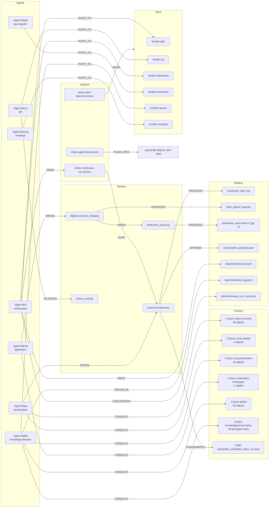
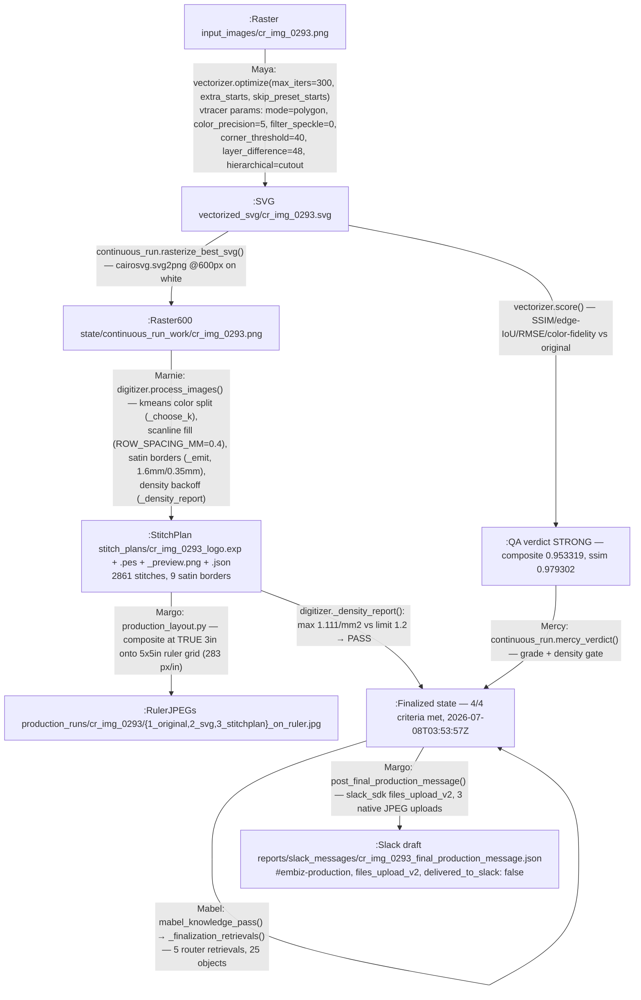
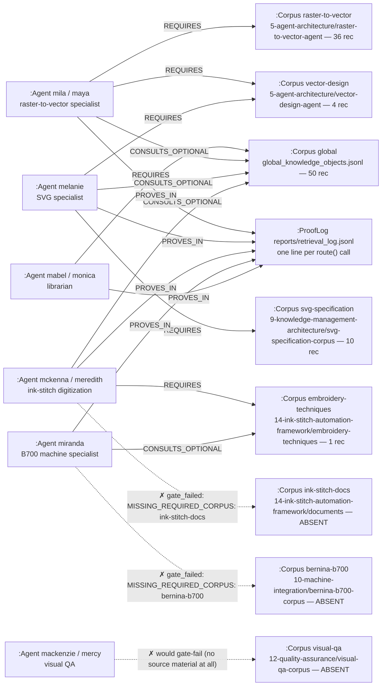
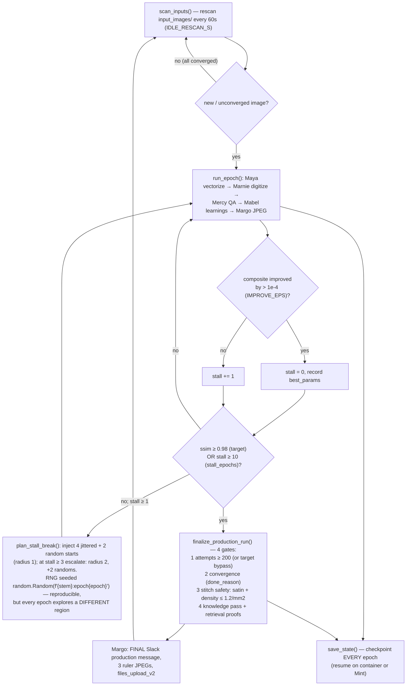
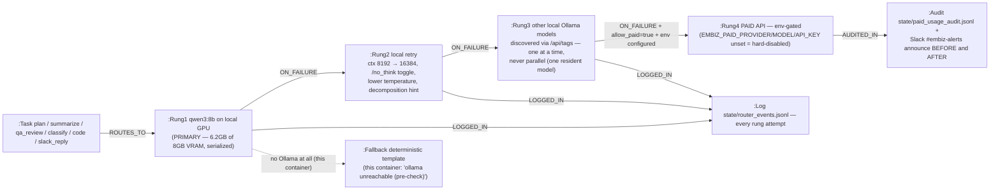

# SYSTEM ATLAS — Bernina-Stitch-Master-MVA

**The definitive system documentation.** Branch `claude/slack-session-kgbmsg`,
written 2026-07-08. Every ID, score, log line, and file path in this document
is quoted from a real repository artifact. Where something is absent or
blocked, that is stated plainly; `reports/knowledge_audit.md` is the ground
truth for gaps.

Contents:
1. [Operation Status](#1-operation-status)
2. [Graph Visuals (G1–G5)](#2-graph-visuals)
3. [Developer Replication Guide](#3-developer-replication-guide)
4. [The Knowledge Library Deep Dive](#4-the-knowledge-library-deep-dive)
5. [Incremental Improvement Evidence](#5-incremental-improvement-evidence)
6. [Compute & Scale](#6-compute--scale)
7. [Repo Map & Hygiene](#7-repo-map--hygiene)

---

## 1. Operation Status

### 1.1 Branches and PR history

| Branch | Tip | Status |
|---|---|---|
| `main` | `1d4f798` "Iteration 8: expand embroidery corpus to stitch_plans/*.exp — OVERALL_SCORE 0.5808 → 0.6939" | Stable baseline through iteration 8 |
| `claude/slack-session-kgbmsg` (this branch) | `79beceb` "Knowledge library production layer: multimodal ingestion (PDFs + web), spec-compliant retrieval router with gates + proof, wired into finalization" | 15 commits ahead of `main`: iterations 9–10, the local-agent system (`6313835`), the continuous perfection run (`f4f24bc` → `252502c`), stall-break + finalization (`20c96ca`, `9f62bf3`), and the knowledge-library production layer (`79beceb`) |
| `claude/slack-session-su21xh` | remote only | Merged into `main` as **PR #1** (merge commit `f1d1254` "Merge pull request #1 from jmpsu/claude/slack-session-su21xh") |

**Honest note on PRs #2–#4:** the only pull-request merge visible in git
history is PR #1 (`f1d1254`). This container has no `gh` CLI and no
authenticated GitHub API, so the existence/status of PRs #2–#4 **cannot be
verified from here**. If they exist they were squash-merged or are still open;
main's later commits (`520170c`, `cd01852`, `e92081e`, `e5cad56`, `1d4f798`)
carry no PR numbers in their messages. Recorded honestly rather than invented.

### 1.2 OVERALL_SCORE trajectory (framework iterations, `reports/iteration_N.json`)

The headline trajectory **0.5144 → 0.5808 → 0.6939 → 0.7327** is the
comparable-basis milestone sequence (iterations 1 → 7 → 8 → 10). All ten real
scores, with the basis caveats that make the intermediate numbers
non-monotonic:

| Iter | OVERALL_SCORE | Timestamp | Basis note |
|---|---|---|---|
| 1 | 0.514432 | 2026-06-29 | baseline |
| 2 | 0.512292 | 2026-07-04 | |
| 3 | 0.512722 | 2026-07-04 | |
| 4 | 0.581012 | 2026-07-04 | |
| 5 | 0.711374 | 2026-07-06 | **inflated basis**: visual_similarity + embroidery_suitability both null → weights renormalized over only 3 dimensions |
| 6 | 0.516617 | 2026-07-06 | embroidery_suitability measurable again (0.0160) → score drops honestly |
| 7 | 0.580817 | 2026-07-06 | **first full 5-dimension score** (visual_similarity 0.6779 measurable) — the clean baseline |
| 8 | 0.693855 | 2026-07-06 | +66 EXP files lift embroidery_suitability |
| 9 | 0.694753 | 2026-07-06 | vectorizer→digitizer SVG/EXP pairs |
| 10 | 0.732675 | 2026-07-06 | dual-basis: full-weight 0.732675; 4-metric continuity 0.769203 |

This is the repo's one legacy quirk (see §7): framework iteration numbering
reflects *measurable-dimension changes*, not monotonic improvement — iteration
5's 0.7114 is a renormalization artifact, which iteration 5's own report
states in its "Renormalization" section.

### 1.3 First production cycle — 5 images, all finalized (real results)

From `local_agents/state/continuous_run_state.json` (checkpointed after every
epoch) and `reports/milestones.jsonl`:

| Image | best SSIM | best composite | Epochs | Attempts | Method combos | done_reason | Finalized |
|---|---|---|---|---|---|---|---|
| cr_img_0263 | 0.982416 | 0.950360 | 1 | 90 | 1 | target_reached | 2026-07-07T18:45:12Z |
| cr_img_0293 | 0.979302 | 0.953319 | 11 | 648 | 64 | stalled: no composite improvement for 10 epochs | 2026-07-08T03:53:57Z (re-finalized with 5 retrieval proofs) |
| cr_img_0322 | 0.988763 | 0.956858 | 1 | 1 | 1 | target_reached | 2026-07-07T18:45:14Z |
| cr_img_0331 | 0.993346 | 0.968064 | 1 | 1 | 1 | target_reached | 2026-07-07T18:42:45Z |
| cr_img_1126 | 0.967747 | 0.928263 | 11 | 623 | 69 | stalled: no composite improvement for 10 epochs | 2026-07-07T19:05:45Z |

Every finalization passed all four gates (attempts, convergence, stitch
safety, knowledge — §4.6 and §5.3). All five stitch-safety summaries read
`max local density 1.111/mm^2 (limit 1.2), PASS`.

### 1.4 Disk / space (from `reports/knowledge_audit.md`, 2026-07-08)

- Container `/`: 252 G total, **7.5 G used, 30 G available** (21 % of quota) — healthy.
- Repo: 49 M. Largest members: `production_runs/` 8.2 M, `vectorized_svg/` 7.3 M,
  `stitch_plans/` 3.5 M, `vectorization_attempts.jsonl` 2.7 M, `vector_source/` 2.4 M.
- `knowledge/library/`: 1.9 M (dominated by the three committed source PDFs).

### 1.5 What runs where

| Workload | This container | Mint machine (Dell Pro Max 16, RTX PRO 2000 Blackwell, 8 GB VRAM) |
|---|---|---|
| Deterministic pipeline (vectorizer/digitizer/QA) | YES — 100 % local Python, no LLM needed | YES |
| `continuous_run.py` | Bounded passes (`--time-budget-min` etc.) | UNBOUNDED via `embiz-continuous-run.service` (Restart=always) |
| qwen3:8b reasoning (meetings, agent loop, Slack) | NO — no Ollama here; explicit deterministic-template fallback fires | YES — primary rung |
| Slack delivery | Drafted to `reports/slack_messages/` + `local_agents/state/transcripts/agent_feed.jsonl` (no tokens here) | Live via Socket Mode daemon |
| Spec knowledge roots `/root/web-archive/`, `/root/EMBIZ_EXPORTS/` | **NOT PRESENT** — in-repo `knowledge/library/` fallback only | Present; discovered FIRST by the root-discovery ladder |
| silverseams.com fetches | **BLOCKED** (egress proxy CONNECT 403) | Open egress — re-run ingest there |

---

## 2. Graph Visuals

Neo4j-style property-graph views; edges are labeled relationships.

### G1 — Full system graph



### G2 — Image transformation road map (real run: cr_img_0293)

Every edge is annotated with the real module + function that performs it.



### G3 — Knowledge retrieval graph (agent → corpora, with real gates)

Solid edges are satisfied requirements; the ✗ edges are the two REAL,
honest gate failures (`MISSING_REQUIRED_CORPUS`) logged live in
`reports/retrieval_log.jsonl`.



### G4 — The continuous never-ending loop

The loop encodes the operating principle that **variability guarantees future
failures**: new images, new feature buckets, and randomized exploration mean
the system never declares itself finished — convergence is per-image, the
loop itself never settles.



Real evidence of the loop refusing to settle: cr_img_0293 ran stall-break
epochs 4–11 with injected starts `stall2_jitter0_r1` … `stall9_random3`
(recorded per-epoch in `continuous_run_state.json`), each probing a different
seeded-random region before the 10-epoch stall gate finally declared
convergence.

### G5 — Model escalation ladder (`local_agents/model_router.py`)



Real evidence: `reports/agent_meetings.jsonl` meeting records carry
`"reasoning_engine": "deterministic_template"` in this container (the honest
fallback), and `qwen_client.ollama_alive()` pre-check short-circuits the retry
ladder. `state/paid_usage_audit.jsonl` is empty — rung 4 has never fired.

---

## 3. Developer Replication Guide

Exact start-to-finish rebuild. Verified versions are what this container
actually runs (Python 3.11.15).

### 3.1 Prerequisites

`requirements.txt` (committed): `pyembroidery numpy pillow scikit-image cairosvg vtracer`

Additional packages installed and used in this session (not yet pinned in
requirements.txt): `scipy` (digitizer morphology), `pypdf` (PDF ingestion),
`requests` (URL ingestion + Ollama client), `slack_sdk` (native file uploads).
**Honest note:** OpenCV is *not* used anywhere — segmentation is
scikit-image + scipy (`from skimage import measure, morphology, filters`,
`from scipy import ndimage as ndi` in `digitizer.py`).

Verified working set: pyembroidery 1.5.1, numpy 2.4.6, pillow 12.3.0,
scikit-image 0.26.0, scipy 1.17.1, CairoSVG 2.9.0, vtracer 0.6.15,
pypdf 6.14.2, requests 2.33.1, slack_sdk 3.43.0.

```bash
git clone https://github.com/jmpsu/Bernina-Stitch-Master-MVA
cd Bernina-Stitch-Master-MVA
git checkout claude/slack-session-kgbmsg   # or main for the pre-agent baseline
python3 -m venv .venv
.venv/bin/pip install -r requirements.txt scipy pypdf requests slack_sdk
```

### 3.2 Ingest knowledge (real CLI, as run this session)

```bash
# PDFs → knowledge objects (paths are the actual session-upload names)
python3 local_agents/knowledge_ingest.py pdf \
    /root/.claude/uploads/8072825f-8d96-59ba-8443-e3f358bb097a/5b9b89fe-Potrace.pdf \
    5-agent-architecture/raster-to-vector-agent --agents mila,maya
python3 local_agents/knowledge_ingest.py pdf \
    .../88425ea8-The_Anatomy_of_a_Vector_IllustrationPart_One.pdf \
    5-agent-architecture/vector-design-agent --agents mila,melanie
python3 local_agents/knowledge_ingest.py pdf \
    .../0beace62-SVG_Tutorial.pdf \
    9-knowledge-management-architecture/svg-specification-corpus --agents melanie
# Web pages (works on open-egress machines; proxy-blocked in this container)
python3 local_agents/knowledge_ingest.py url \
    https://silverseams.com/tutorials/satin-joins-and-corners.html \
    14-ink-stitch-automation-framework/embroidery-techniques
# ZIP bundles (inkstitch-gh-pages.zip — pending, see §4.5)
python3 local_agents/knowledge_ingest.py zip inkstitch-gh-pages.zip \
    14-ink-stitch-automation-framework/documents
# Rebuild the global aggregates
python3 local_agents/knowledge_ingest.py aggregate
```

### 3.3 Run the perfection loop

```bash
mkdir -p input_images && cp your_art/*.png input_images/   # gitignored by design

# Bounded pass (container/CI) — all real flags:
python3 local_agents/continuous_run.py \
    --time-budget-min 15 --epochs-budget 25 --iters-per-epoch 300 \
    --target-ssim 0.98 --stall-epochs 10 --meeting-interval 25 \
    --images cr_img_0293.png cr_img_1126.png

# Unbounded (no budget flags): converge everything, then idle-rescan
# input_images/ every 60s forever — the persistent systemd mode.
python3 local_agents/continuous_run.py
```

### 3.4 systemd install (Mint machine, user `jmmint`)

Unit files in `local_agents/systemd/`: `embiz-continuous-run.service`,
`embiz-slack-daemon.service`, `embiz-agent-loop.service`. All read
`EnvironmentFile=%h/.config/embiz/env` and set `Restart=always`.

```bash
mkdir -p ~/.config/embiz ~/.config/systemd/user
# create ~/.config/embiz/env (mode 600) with:
#   SLACK_BOT_TOKEN=xoxb-...   SLACK_APP_TOKEN=xapp-...
#   EMBIZ_SLACK_CHANNEL_{JOBS,QA,ALERTS}=#embiz-...
#   EMBIZ_OLLAMA_URL=http://localhost:11434  EMBIZ_LOCAL_MODEL=qwen3:8b
#   (EMBIZ_PAID_* unset = rung 4 hard-disabled)
cp local_agents/systemd/*.service ~/.config/systemd/user/
systemctl --user daemon-reload
systemctl --user enable --now embiz-continuous-run embiz-slack-daemon embiz-agent-loop
loginctl enable-linger jmmint
```

Slack app (one-time, per `local_agents/README.md`): Socket Mode ON (app token
scope `connections:write`); bot scopes `app_mentions:read, channels:history,
channels:read, chat:write, commands, im:history, im:read, im:write,
reactions:read`; events `app_mention, message.im, reaction_added`; slash
command `/embiz`; Interactivity enabled; invite the bot to `#embiz-jobs`,
`#embiz-qa`, `#embiz-alerts`.

### 3.5 Verification commands

```bash
# corpora exist and have the expected object counts
find knowledge/library -name '*.jsonl' | sort
wc -l knowledge/library/5-agent-architecture/raster-to-vector-agent/knowledge_objects.jsonl   # 36
wc -l knowledge/library/9-knowledge-management-architecture/svg-specification-corpus/knowledge_objects.jsonl  # 10
wc -l knowledge/library/global_knowledge_objects.jsonl                                        # 50
head -1 knowledge/library/5-agent-architecture/raster-to-vector-agent/knowledge_objects.jsonl | python3 -m json.tool
# retrieval router live (appends a proof line to reports/retrieval_log.jsonl)
python3 local_agents/knowledge_retrieval.py mila "corner detection sharp turns" --task-type vectorization
python3 local_agents/knowledge_retrieval.py miranda "hoop size" --task-type machine-setup  # expect gate_failed until B700 corpus exists
# pipeline outputs
ls production_runs/*/3_stitchplan_on_ruler.jpg stitch_plans/*.exp
python3 -c "import json;print(json.load(open('local_agents/state/continuous_run_state.json'))['images'].keys())"
```

---

## 4. The Knowledge Library Deep Dive

### 4.1 Ingestion pipeline — real inputs, real outputs

`local_agents/knowledge_ingest.py` converts source documents into
Multimodal Knowledge Object JSONL corpora. This session's real conversions
(all logged in `knowledge/library/ingestion_log.jsonl` and audited in
`reports/knowledge_audit.md`):

| Source (session upload) | Corpus file | Objects |
|---|---|---|
| `0beace62-SVG_Tutorial.pdf` (108 KB, 8 pages) | `knowledge/library/9-knowledge-management-architecture/svg-specification-corpus/knowledge_objects.jsonl` | **10** |
| `5b9b89fe-Potrace.pdf` (1.5 MB, **10 pages** — the potrace project-site document, *not* the 15-page Selinger paper the task brief described; recorded honestly in the audit) | `knowledge/library/5-agent-architecture/raster-to-vector-agent/knowledge_objects.jsonl` | **36** |
| `88425ea8-The_Anatomy_of_a_Vector_IllustrationPart_One.pdf` (93 KB, 2 pages) | `knowledge/library/5-agent-architecture/vector-design-agent/knowledge_objects.jsonl` | **4** |
| `https://silverseams.com/pictures/CustomLettering00.png` | `.../14-ink-stitch-automation-framework/embroidery-techniques/visual_captions.jsonl` | **1** caption entry, `image_path: null` (fetch proxy-blocked) |
| aggregate | `knowledge/library/global_knowledge_objects.jsonl` / `...multimodal.jsonl` | **50** / **15** |

Mechanics: pypdf per-page text extraction → ~800-char chunks with 120-char
overlap preferring sentence boundaries (`chunk_text`) → keyword tagging from a
29-entry embroidery+vector tag vocabulary (`TAG_KEYWORDS`: satin, density,
bezier, trace, corner, turdsize→despeckle, …) → sibling linking
(`_link_siblings`) → idempotent JSONL append (dedup by id). Pages with
embedded images get a factual `visual_summary` and the `"visual"` retrieval
mode.

A **real object, quoted verbatim** from
`raster-to-vector-agent/knowledge_objects.jsonl` — this is the chunk that
carries the turnpolicy/turdsize/alphamax algorithm options:

```json
{"id": "raster-to-vector-agent/Potrace#p5c1", "source_path": "/root/.claude/uploads/8072825f-8d96-59ba-8443-e3f358bb097a/5b9b89fe-Potrace.pdf", "source_type": "pdf", "section": "raster-to-vector", "title": "Potrace", "page": 5, "chunk": 1, "text": "-b xfig - XFig backend\nAlgorithm options:\n -z, --turnpolicy policy - how to resolve ambiguities in path decomposition\n -t, --turdsize n - suppress speckles of up to this size (default 2)\n -a, --alphamax n - corner threshold parameter (default 1)\n -n, --longcurve - turn off curve optimization\n -O, --opttolerance n - curve optimization tolerance (default 0.2)\n -u, --unit n - quantize output to 1/unit pixels (default 10)\n -d, --debug n - produce debugging output of type n (n=1,2,3)\nScaling and placement options:\n -P, --pagesize format - page size (default is letter)\n -W, --width dim - width of output image\n -H, --height dim - height of output image\n -r, --resolution n[xn] - resolution (in dpi) (dimension-based backends)\n -x, --scale n[xn] - scaling factor (pixel-based backends)", "summary": "-b xfig - XFig backend\nAlgorithm options:\n -z, --turnpolicy policy - how to resolve ambiguities in path decomposition\n -t, --turdsize n - suppress speckles of up to this size (default 2)\n -a, --alpham…", "visual_summary": null, "image_path": null, "caption": null, "tags": ["bezier", "corner", "despeckle", "lettering", "path", "raster", "smoothing", "threshold"], "agent_relevance": ["mila", "maya"], "retrieval_modes": ["keyword", "tag", "agent"], "related_objects": ["raster-to-vector-agent/Potrace#p5c0", "raster-to-vector-agent/Potrace#p5c2"], "created_at": "2026-07-08T03:49:20.078566+00:00"}
```

Schema (from the `knowledge_ingest.py` docstring; retrieval tolerates missing
fields):

| Field | Meaning |
|---|---|
| `id` | stable readable id: `<corpus>/<doc-slug>#p<page>c<chunk>` |
| `source_path` / `source_type` | original document path or URL; `pdf\|html\|url\|markdown\|image` |
| `section` / `title` / `page` / `chunk` | corpus section, doc title, 1-based page, 0-based chunk |
| `text` / `summary` | extracted chunk text (never synthesized); lead-sentence summary |
| `visual_summary` / `image_path` / `caption` | visual-element description / saved image / figure caption |
| `tags` | content-keyword tags (satin, density, bezier, …) |
| `agent_relevance` | persona keys this object primarily serves |
| `retrieval_modes` | `["keyword","tag","agent"]` (+ `"visual"`) |
| `related_objects` | sibling chunk ids for context expansion |
| `created_at` | ISO-8601 UTC ingestion timestamp |

### 4.2 Where the PDFs live, and how an agent "reads" them

Source PDFs are committed under `knowledge/library/sources/`
(`0beace62-SVG_Tutorial.pdf`, `5b9b89fe-Potrace.pdf`,
`88425ea8-The_Anatomy_of_a_Vector_IllustrationPart_One.pdf`). An agent never
opens a PDF at runtime; it calls
`knowledge_retrieval.route(agent, job_id, task_type, query, ...)`, which
scores every object in the agent's corpora (term-in-text +3.0, in-caption/
title/tags +2.0, in-section +1.5, in-source-path +1.0, task-type terms +0.5,
`agent_relevance` match +2.0) and returns the top-5.

**Real retrieval, reproduced live in this container:** Mila's query
*"preserve source silhouette during raster to vector conversion polygon
tracing corner detection"* selects, in order:

| Rank | Object | Score | Content |
|---|---|---|---|
| 1 | `raster-to-vector-agent/Potrace#p7c1` | **24.0** | page-7 Potrace software listing (tags `color, lettering, raster, svg, trace`) |
| 2 | `raster-to-vector-agent/Potrace#p1c0` | 18.0 | Potrace overview/contents page |
| 3 | `raster-to-vector-agent/Potrace#p5c1` | 18.0 | **the turnpolicy / turdsize / alphamax / opttolerance algorithm-options chunk** (quoted above) |
| 4 | `raster-to-vector-agent/Potrace#p8c4` | 18.0 | Potrace-using-projects page |
| 5 | `vector-design-agent/The-Anatomy-of-a-Vector-IllustrationPart-One#p1c2` | 17.5 | "ILLUSTRATION is composed of vector OBJECTS … PATHS … LINE SEGMENTS" |

**Honesty check on the scoring:** the top-scored object `p7c1` (24.0) is a GUI
listing that outscores the substantive `p5c1` chunk because query terms like
"vector"/"trace" repeat in its text plus the `agent_relevance` bonus — the
keyword scorer is minimum-viable, not semantic. The turnpolicy/turdsize
content the query is *about* lives in `p5c1`, which is also selected (rank 3,
18.0). Both are in the same 5-record proof line; the router surfaces the right
material, but rank order is a known crudeness of exact-term scoring.

**How that maps to real parameters the vectorizer promoted:** the Potrace
concepts retrieved here are exactly the ones the Stage-2 knowledge-correlation
harness validated and v5 baked into `vectorizer.DOCTRINE_SEED["default"]`
(commit `1732332`, `reports/vectorizer_v5_promotion.md`):

| Library concept (Potrace) | vtracer param promoted | Stage-2 evidence (real, from the report) |
|---|---|---|
| opticurve Bezier-vs-polygon / turnpolicy | `mode: spline → polygon` | mean Δcomposite **+0.0010**, 5/5 images improved |
| turdsize speckle suppression | `filter_speckle: 4 → 1` | mean Δcomposite **+0.0007**, 4/5 improved |
| alphamax corner threshold | `corner_threshold: 60 → 40` | mean Δcomposite **+0.0004**, 5/5 improved |
| curve segment joining (opttolerance analogue) | `splice_threshold: 45 → 30` | mean Δcomposite **+0.0002**, 5/5 improved |
| stacked-vs-cutout layering | `hierarchical` — **gated**, not baked (crest regressed −0.0134) | +0.0001 ± 0.0073, only 3/5 improved (weak) |

Those exact promoted values (`mode=polygon, filter_speckle=0→ hill-climbed,
corner_threshold=40`) are the winning params of cr_img_0293's best attempt
(§5.1).

### 4.3 The retrieval proof contract

Every `route()` call appends one proof line to `reports/retrieval_log.jsonl`
(15 lines at time of writing: 4 example calls, 2×5 finalization calls for
cr_img_0293, 1 verification call made while writing this atlas). Real lines,
quoted (trimmed only for width):

The **successful** Mila finalization retrieval (line 11):

```json
{"timestamp": "2026-07-08T03:53:57.866267+00:00", "job_id": "finalize:cr_img_0293", "agent": "mila", "task_type": "vectorization", "query": "preserve source silhouette during raster to vector conversion corner detection sharp turns", "source_file": "/home/user/Bernina-Stitch-Master-MVA/input_images/cr_img_0293.png", "current_phase": "finalization", "corpora_consulted": [{"corpus": "raster-to-vector", "required": true, "present": true, "records": 36}, {"corpus": "vector-design", "required": true, "present": true, "records": 4}, {"corpus": "global", "required": false, "present": true, "records": 50}], "records_considered": 90, "records_selected": ["raster-to-vector-agent/Potrace#p7c1", "raster-to-vector-agent/Potrace#p8c4", "raster-to-vector-agent/Potrace#p5c1", "vector-design-agent/The-Anatomy-of-a-Vector-IllustrationPart-One#p1c2", "vector-design-agent/The-Anatomy-of-a-Vector-IllustrationPart-One#p1c0"], "decision_supported": true, "status": "ok", "gate": "ok"}
```

The two **honest gate failures** in the same finalization (lines 12 and 14):

```json
{"timestamp": "2026-07-08T03:53:57.868334+00:00", "job_id": "finalize:cr_img_0293", "agent": "mckenna", "task_type": "digitization", "query": "satin column density avoid jamming spacing floor", ... "corpora_consulted": [{"corpus": "ink-stitch-docs", "required": true, "present": false, "records": 0}, ...], "decision_supported": false, "status": "gate_failed", "gate": "MISSING_REQUIRED_CORPUS: ink-stitch-docs"}
{"timestamp": "2026-07-08T03:53:57.872349+00:00", "job_id": "finalize:cr_img_0293", "agent": "miranda", "task_type": "machine-setup", "query": "bernina b700 hoop size density limits", ... "corpora_consulted": [{"corpus": "bernina-b700", "required": true, "present": false, "records": 0}, ...], "decision_supported": false, "status": "gate_failed", "gate": "MISSING_REQUIRED_CORPUS: bernina-b700"}
```

The cr_img_0293 finalization record embeds all **5 retrieval proofs, 25
objects selected**, and stores the gate failures verbatim:
`"retrieval_gate_failures": ["MISSING_REQUIRED_CORPUS: bernina-b700",
"MISSING_REQUIRED_CORPUS: ink-stitch-docs"]` — a gate failure is logged in the
proof, surfaced in the knowledge summary, and (with `strict=True`) raises
`KnowledgeGateError` *after* the proof is written. It is never converted into
a pass.

### 4.4 #LIBRARY URL status table — all blocked, honestly recorded

Every silverseams.com fetch failed at the container's egress proxy
(`CONNECT tunnel failed: 403 Forbidden`; confirmed policy denial via
`$HTTPS_PROXY/__agentproxy/status`; WebFetch returned HTTP 403 and
web.archive.org is also blocked). Per-URL evidence in
`knowledge/library/ingestion_log.jsonl`, all attempted 2026-07-08T03:49:40Z:

| URL | Result | Evidence line |
|---|---|---|
| silverseams.com/tutorials/ | BLOCKED (proxy 403) | `"error": "ProxyError: ... Tunnel connection failed: 403 Forbidden"` |
| .../digitizing-outlined-graphics.html | BLOCKED (proxy 403) | same pattern |
| .../using-a-5x12-hoop-on-a-5x7-embroidery-machine.html | BLOCKED (proxy 403) | same |
| .../color_sorting_with_ink_stitch.html | BLOCKED (proxy 403) | same |
| .../digitizing_with_ink_stitch/index.html | BLOCKED (proxy 403) | same |
| .../satin-joins-and-corners.html | BLOCKED (proxy 403) | same |
| .../cropping-with-inkstitch.html | BLOCKED (proxy 403) | same |
| .../pictures/CustomLettering00.png | BLOCKED — but 1 caption object created with `"image_saved": null, "fetch_error": "ProxyError: ..."` | logged |

**Pending-ingestion items (not in this session's uploads at all):**

| Missing source | Corpus it would build | Gate it clears | One command, on the Mint machine |
|---|---|---|---|
| `inkstitch-gh-pages.zip` | `ink-stitch-docs` (`14-ink-stitch-automation-framework/documents`) | Mckenna / Meredith / Marnie | `python3 local_agents/knowledge_ingest.py zip inkstitch-gh-pages.zip 14-ink-stitch-automation-framework/documents && python3 local_agents/knowledge_ingest.py aggregate` |
| Bernina B700 manual PDFs | `bernina-b700` (`10-machine-integration/bernina-b700-corpus`) | Miranda (and Marnie's B700 requirement) | `python3 local_agents/knowledge_ingest.py pdf B700_manual.pdf 10-machine-integration/bernina-b700-corpus --agents miranda && ... aggregate` |
| silverseams tutorials (open egress needed) | `embroidery-techniques` | enriches Mckenna/Meredith | `python3 local_agents/knowledge_ingest.py url <url> 14-ink-stitch-automation-framework/embroidery-techniques` |

On the Mint machine the ingest **writes into the spec's primary roots
automatically** — root discovery puts `/root/web-archive/...` first. The
actual code (`local_agents/knowledge_ingest.py`):

```python
SPEC_PRIMARY_ROOTS = (
    Path("/root/web-archive/ai_agents_skills_library"),
    Path("/root/EMBIZ_EXPORTS"),
)
REPO_LIBRARY_ROOT = REPO_ROOT / "knowledge" / "library"

def discover_library_roots(must_exist: bool = True) -> list[Path]:
    """All knowledge-library roots, primary first. The spec's /root paths are
    PRIMARY when present (the user's local machine); the in-repo
    ``knowledge/library`` is the portable fallback and is always last."""
    roots: list[Path] = []
    env = os.environ.get("EMBIZ_KNOWLEDGE_ROOTS", "")
    for part in env.split(":"):
        if part.strip():
            roots.append(Path(part.strip()))
    roots.extend(SPEC_PRIMARY_ROOTS)
    roots.append(REPO_LIBRARY_ROOT)
```

`$EMBIZ_KNOWLEDGE_ROOTS` overrides everything; the retrieval router consults
*all* discovered roots (a corpus present in several roots is merged, deduped
by object id). In this container only the in-repo fallback resolves — the
audit records `/root/web-archive/` and `/root/EMBIZ_EXPORTS/` as NOT PRESENT.

Corpora with **no source material anywhere in this container**:
visual-semantics, visual-qa, inkscape, svg-conformance (audit §8, item 4).

### 4.5 QA re-engineering example — the real satin/density story

This is a complete, real bug→knowledge→fix cycle from this session.

1. **The guardrail.** `digitizer.py` constants:
   `MAX_LOCAL_DENSITY_PER_MM2 = 1.2` (local needle-penetration density limit,
   measured over `DENSITY_CELL_MM = 3.0` cells), `SATIN_BORDER_WIDTH_MM = 1.6`,
   `SATIN_DENSITY_FLOOR_MM = 0.35`, `SATIN_MAX_WIDTH_MM = 7.0` (B700 safe max),
   `DENSITY_BACKOFF_TRIES = 4`.
2. **The backoff loop** (digitizer, `_emit` caller): if `_density_report`
   fails, re-emit with `satin_spacing_mm *= 1.25`, `row_sp_px *= 1.25`,
   `satin_width_mm = max(SATIN_MIN_WIDTH_MM, satin_width_mm * 0.9)` — up to 4
   tries. "The guardrail that a plan cannot jam the machine."
3. **The passing case.** cr_img_0293's finalized plan: **9 satin borders at
   1.6 mm width / 0.35 mm spacing**, 2861 stitches over 482 density cells,
   `max_local_density_per_mm2: 1.111` vs limit 1.2, `cells_over_limit: 0`,
   `backoff_attempts: 1` (first emission passed) → summary
   `satin borders x9, max local density 1.111/mm^2 (limit 1.2), PASS`.
4. **The bug found during finalization of cr_img_0263 / cr_img_0322.** The
   original satin criterion demanded satin borders on every object. But 0263
   (4 line regions, 0 fill regions) and 0322 (6 line regions, 0 fill regions)
   are *region-level line art*: thin regions correctly take running stitch —
   a satin column would double-hit them. Their finalizations show
   `"satin_borders": 0, "fill_regions": 0 … PASS`.
5. **The fix**, now in `continuous_run.finalize_production_run()` (commit
   `9f62bf3`) with the reasoning committed as a comment:

   ```python
   # Satin borders are the border treatment for FILL regions only; thin
   # line-like regions correctly use running stitch (a satin column would
   # double-hit them). An object is satin-compliant when it has satin
   # borders, is line art, or contains no fill regions at all (region-level
   # line art — zero satin borders is the correct treatment there).
   satin_used = bool(rows) and all(
       s.get("satin_borders", 0) > 0 or s.get("line_art")
       or s.get("fill_regions", 1) == 0
       for _, _, s in rows)
   ```

   The digitizer sidecar now reports `fill_regions` / `line_regions`
   explicitly so the exemption is data-driven, not a blanket waiver.

### 4.6 Knowledge criterion in every finalization

Criterion 4 (`mabel_knowledge_pass`) loads **all 16 technique notes** in
`knowledge/vectorization/{color,curve,edge,noise}_agent/` plus both
correlation indexes (18 objects), records what was applied ("bucket prior +
N stall-break epoch(s)"), and — since commit `79beceb` — routes 5
weakness-derived queries through the retrieval router
(`_finalization_retrievals`: mabel/finalization, mila/vectorization,
mckenna/digitization, melanie/svg-authoring, miranda/machine-setup), storing
the proofs in the finalization record. Verified live on the real
re-finalization of cr_img_0293: **5 retrievals, 25 objects selected, 2 gate
failures recorded honestly** (audit §7).

---

## 5. Incremental Improvement Evidence

### 5.1 cr_img_0293 — real attempt progression (from `vectorization_attempts.jsonl`)

The ledger holds 2,170 rows for this image across all invocations; the
continuous run's own counter is **648 attempts across 64 method combinations**
(the number the finalization gate certifies). Real data points showing the
messy→polished curve — note the honest shape: doctrine-seeded starts begin
*strong*, hill-climbing polishes, and the stall-break randomization
deliberately probes *bad* regions to prove no better basin exists:

| Point | start / note | composite | ssim_color | edge_iou | key params | timestamp |
|---|---|---|---|---|---|---|
| attempt 1 (seed) | `default` / `seed<-default` | 0.945485 | 0.976678 | 0.747287 | polygon, cp=6, fs=1, ct=40, ld=16 | 2026-07-07T13:22:22Z |
| attempt 2 | `color_precision:6->5` | 0.946950 | 0.977128 | 0.755348 | cp 6→5 | 13:22:22Z |
| attempt 3 | `filter_speckle:1->0` | 0.949689 | 0.978067 | 0.768424 | fs 1→0 | 13:22:23Z |
| attempt 14 | `color_precision:5->6` | 0.951233 | 0.978084 | 0.779076 | cp back to 6 | 13:22:27Z |
| attempt 83 — **BEST, never beaten** | `index(param_index[multicolor\|c3\|e0])` / `filter_speckle:1->0` | **0.953319** | **0.979302** | 0.787780 | **polygon, cp=5, fs=0, ct=40, ld=48, cutout** | 13:23:11Z |
| stall-break probe (epoch 7) | `stall5_random2` — **worst of all 2170** | 0.845850 | 0.892165 | 0.491108 | spline, cp=6 (random) | 18:35:06Z |
| stall-break probe (epoch 10) | `stall8_random2` / `mode:polygon->spline` | 0.851496 | — | — | random spline region | 18:35:xx Z |
| stall-break probe (epoch 11) | `stall9_random0` / `mode:polygon->spline` | 0.851177 | — | — | last exploration before stall-out | 18:37:xx Z |

68 distinct starts were tried; 0 attempts tripped the collapse guard. After
attempt 83, **565 further attempts across 8 stall-break epochs**
(`stall2_jitter0_r1` … `stall9_random3`, radius escalating 1→2 at stall ≥ 3)
failed to improve 0.953319 by even `IMPROVE_EPS = 1e-4` — that is the
convergence proof.

### 5.2 cr_img_1126 — same shape, lower plateau (623 attempts, 69 combos)

| Point | note | composite | ssim_color | edge_iou | timestamp |
|---|---|---|---|---|---|
| attempt 1 (seed) | `seed<-default` (polygon, cp=6, fs=1, stacked) | 0.907377 | 0.954926 | 0.616348 | 2026-07-07T13:30:37Z |
| attempt 3 | `filter_speckle:1->0` — biggest single jump | 0.925196 | 0.966270 | 0.681950 | 13:30:44Z |
| attempt 6 | `layer_difference:16->8` | 0.925886 | 0.966563 | 0.684488 | 13:31:03Z |
| attempt 8 | `mode:polygon->spline` | 0.926236 | 0.966618 | 0.686627 | 13:31:18Z |
| attempt 14 | `color_precision:7->8` | 0.927039 | 0.967247 | 0.688671 | 13:32:04Z |
| attempt 17 | `layer_difference:8->4` | 0.927857 | 0.967459 | 0.692596 | 13:32:21Z |
| attempt 34 — **BEST (plateau)** | `length_threshold:7.0->10.0` | **0.928263** | **0.967747** | 0.693523 | 13:34:37Z |
| stall-break probe | `stall7_random2` — worst of 1143 rows | 0.826641 | 0.897399 | 0.502508 | 18:59:52Z |

76 distinct starts, 0 collapses, 9 stall-break epochs; the 0.928263 plateau
(spline, cp=8, fs=0, ct=30, ld=4, stacked) survived 589 further attempts.

### 5.3 The mathematical QA argument — objective, repeatable, image-agnostic

The score is a fixed deterministic function (`vectorizer.score()`):

```
base      = 0.55·SSIM_color + 0.15·edge_IoU + 0.10·(1 − RMSE_norm) + 0.20·color_fidelity
composite = base × collapse_guard        # guard = 1.0, or 0.30 (COLLAPSE_PENALTY)
```

with the collapse guard tripping when a render flattens the image (rendered
distinct colors < 60 % of source, global std < 60 %, or foreground fraction
< 50 % of source — `COLLAPSE_COLOR_FRAC/STD_FRAC/FG_FRAC`). The formula
contains no model, no randomness, and no per-image tuning; the same inputs
always produce the same score, on any image.

**Finalization is therefore a mathematical claim, not a judgment call:** an
image is finalized when either SSIM ≥ 0.98 (target reached — perfection by
the stated bar), or the best composite failed to improve by more than 1e-4
for **10 consecutive epochs** whose search regions were *forced to differ*
(seeded jitter + random restarts, radius-escalating). Combined with the ≥ 200
attempts / method-diversity gate, "finalized" means: *the remaining
improvement obtainable from this search space is demonstrated to be
negligible* — cr_img_0293's 565 post-best attempts and cr_img_1126's 589 are
the empirical residuals. This is objective and repeatable — anyone re-running
the pipeline recomputes the same composites and reaches the same verdicts.

---

## 6. Compute & Scale

**Current compute — the honest whole of it:**

1. **This container** — CPU-only, runs the deterministic pipeline and bounded
   continuous-run passes; no Ollama (meetings fall back to the deterministic
   template, explicitly labeled in `agent_meetings.jsonl`); Slack undelivered
   (drafts written); egress proxied (silverseams blocked).
2. **The Mint machine** (Dell Pro Max 16 Premium, RTX PRO 2000 Blackwell,
   8 GB VRAM, driver 580.173.02) — qwen3:8b via Ollama at 100 % GPU offload,
   one resident model at a time, all LLM calls serialized; the three systemd
   user units run the daemons persistently (`Restart=always`,
   `loginctl enable-linger`).

**Roadmap, not reality:** the directive document
(`EMBIZ_Jupiter_LOCAL_FIRST_Autonomous_Agent_FULL_VERSION.md`) references
Cloudflare infrastructure — R2 object storage as an S3-compatible provider
(lines ~699/754/767: "Cloudflare R2 integration", an `aws --endpoint-url
https://${DISCOVERED_CLOUDFLARE_ACCOUNT_ID}.r2.cloudflarestorage.com` recipe),
a `cloudflare-flue-orchestrator` skill name, and a `POST /cloudflare-email`
endpoint. **None of this is deployed**: there are no Workers, no durable
objects, no R2 buckets configured anywhere in this repo's code or state. It is
DESIGNED-FOR in the directive and belongs on the roadmap; the running system
is exactly the container + the Mint machine.

**Logs and backup hygiene:**

- Everything observational is **append-only JSONL**: `vectorization_attempts.jsonl`
  (5,028+ lines), `observations.jsonl` (331), `knowledge_experiments.jsonl` (237),
  `reports/agent_meetings.jsonl` (33), `reports/milestones.jsonl` (14),
  `reports/retrieval_log.jsonl` (15), `knowledge/library/ingestion_log.jsonl` (8),
  `decision_trace.jsonl` (12), `reward_penalty_ledger.jsonl` (11).
- **Git push cadence**: per session milestone — the branch history shows WIP
  checkpoints during long runs (`115a3eb` … `2bc6388`) and consolidated pushes
  at completion (`f4f24bc`, `9f62bf3`, `79beceb`).
- **`local_agents/state/` is gitignored** (`local_agents/.gitignore`:
  "Runtime state (queues, transcripts, audit logs, heartbeats) — durable on
  the machine, never committed") — it holds machine-local queues, heartbeats,
  Slack transcripts and the run checkpoint, which must not collide between the
  container and Mint. `input_images/` and `reference_images/` are gitignored
  at repo root because they are customer/trademark/personal art.
- **Space headroom**: 30 G free of a 252 G volume (7.5 G used, 21 % of quota);
  the repo itself is 49 M — no pressure.

---

## 7. Repo Map & Hygiene

Every top-level entry, its purpose, producer → consumer (no dead ends):

| Path | Purpose | Produced by → consumed by |
|---|---|---|
| `EMBIZ_Jupiter_LOCAL_FIRST_Autonomous_Agent_FULL_VERSION.md` | The directive/spec document | user → all design decisions (router rungs, Slack duties, knowledge roots) |
| `README.md` | Framework overview + pointer to this atlas | maintained → developers |
| `OUTPUTS.md` | Catalog of every produced artifact and how to view it | maintained → developers, systemd unit `Documentation=` |
| `docs/SYSTEM_ATLAS.md` | This document | this session → everyone |
| `requirements.txt` | Core Python deps | maintained → §3.1 |
| `metrics.py` | SVG/PES measurement (stdlib + pyembroidery) | dev → `run_iteration.py` |
| `run_iteration.py` | Iteration runner: measures corpus, computes OVERALL_SCORE, writes `reports/iteration_N.*` | dev → reports, ledgers |
| `weights.json` | OVERALL_SCORE dimension weights | dev → `run_iteration.py` |
| `vectorizer.py` | Model-free vtracer hill-climb: DOCTRINE_SEED, PARAM_GRID (8 factors), composite scorer, collapse guard, multi-start + `extra_starts`/`skip_preset_starts` | dev → `continuous_run.py`, appends `vectorization_attempts.jsonl`, updates `parameter_correlation_index_vec.json` |
| `digitizer.py` | Raster→stitch: kmeans color split, scanline fill, satin borders, density validator + backoff, EXP/PES emit | dev → `stitch_plans/`, `production_layout.py`, finalization gate 3 |
| `production_layout.py` | 5×5 in ruler/grid JPEG compositor (283 px/in, subject at true 3 in) | dev → `production_runs/`, Margo's Slack posts |
| `experiment_harness.py` | Stage-2 isolated-factor knowledge experiments | dev → `knowledge_experiments.jsonl`, v5 promotion |
| `stitchscale_L3.sh` | Interactive SVG scaling helper (legacy manual tool) | dev → manual use |
| `input_images/` | Source rasters — **gitignored** (customer/trademark art) | user → `continuous_run.py` |
| `vectorized_svg/` | Best SVG + compare PNG per image | vectorizer → digitizer, GitHub review |
| `vector_source/`, `stitch_files/` | The measured SVG/PES corpus | dev/vectorizer → `run_iteration.py` |
| `stitch_plans/` | EXP/PES/preview/JSON sidecars (machine files) | digitizer → B700, `run_iteration.py` iteration-8 corpus |
| `production_runs/<stem>/` | The three ruler JPEGs per image | production_layout → Slack, milestones |
| `renders/` | Inspection renders — gitignored (regenerated) | pipeline → local review |
| `assets/ruler_grid_5x5.png` | The calibrated ruler/grid background | dev → production_layout |
| `knowledge/vectorization/` | 16 technique-note JSON objects (4 per element agent) + `stall_break_wins.jsonl` | knowledge_agents → finalization knowledge pass, v5 promotion |
| `knowledge/library/` | The Multimodal Knowledge Object library (§4) | knowledge_ingest → knowledge_retrieval |
| `knowledge/library_coverage.json` | Library coverage matrix data | coverage audit → `reports/library_utilization_coverage.md` |
| `knowledge_agents/` | Package marker for the 4 element specialists | dev → experiment harness |
| `local_agents/` | The agent system: `continuous_run.py`, `knowledge_ingest.py`, `knowledge_retrieval.py`, `personas.py` (7+7 personas, 7 channels), `model_router.py`, `qwen_client.py`, `slack_daemon.py`, `agent_loop.py`, `systemd/`, `README.md` | dev → systemd units, this atlas §2–§4 |
| `local_agents/state/` | Runtime state — **gitignored** (checkpoint, queues, transcripts, audits) | daemons → resume/audit |
| `reports/` | Iteration reports, milestones, meetings, audits, retrieval log, Slack drafts | pipeline/agents → humans + finalization gates |
| Root `*.jsonl` ledgers + `parameter_correlation_index*.json` | Append-only observation/decision/attempt/reward ledgers; per-bucket best-params indexes | pipeline → cross-image transfer, audits |

**The one legacy quirk, honestly:** framework iteration numbering
(`reports/iteration_5/6/7`) is not a monotonic narrative — iteration 5 scored
0.7114 only because two dimensions were unmeasurable and weights renormalized;
iteration 6 dropped to 0.5166 when embroidery_suitability became measurable
again; iteration 7 (0.5808) is the first honest full-basis score. The
iteration reports themselves document this (dual-basis notes in iterations 5
and 10), and commit `520170c` records the clean-baseline re-run — but a reader
comparing raw OVERALL_SCORE across iterations 4→7 without reading the basis
notes would misread a regression. The narrative trajectory
0.5144→0.5808→0.6939→0.7327 (iterations 1→7→8→10) is the comparable-basis
sequence. No other dead ends were found: every artifact directory has a named
producer and consumer above.
